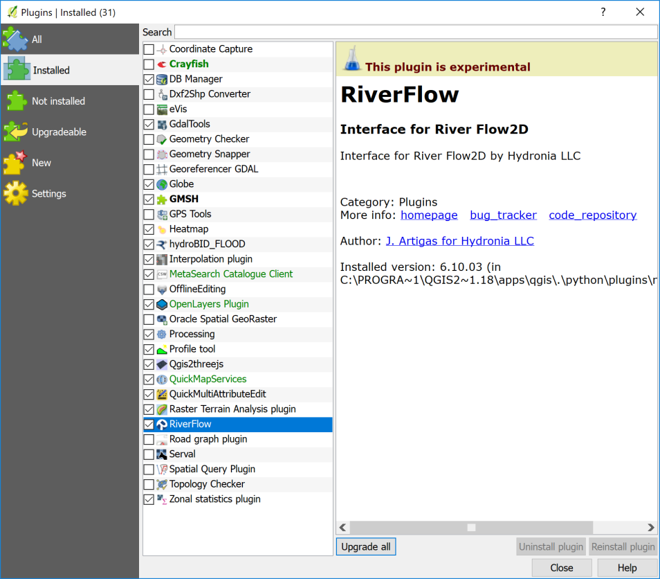
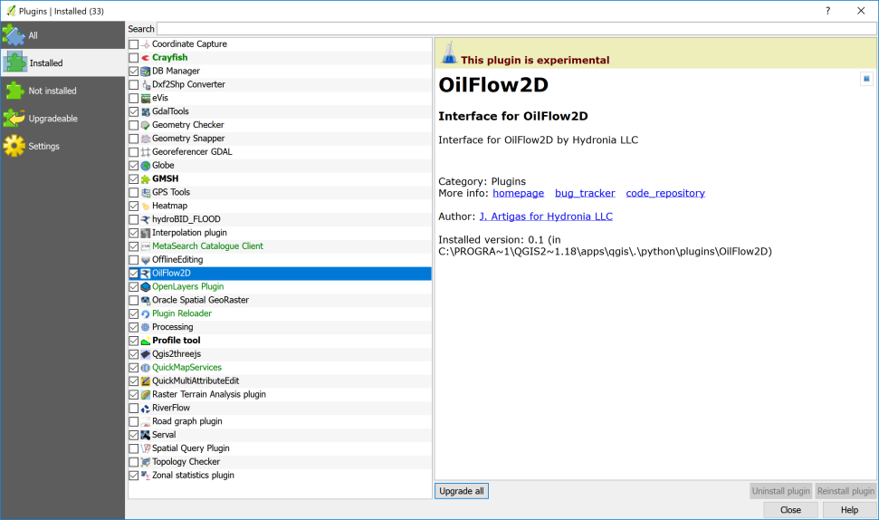
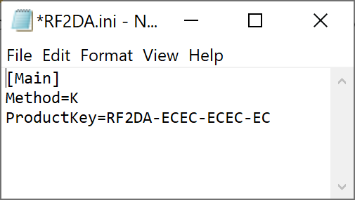

# Installation

This guide covers installing Hydronia's desktop solver (RiverFlow2D or OilFlow2D) and enabling the corresponding QGIS plugin. HydroBID Flood installs the same way as RiverFlow2D; where the flow differs, it's called out.

## System requirements

- **OS**: Windows 10 or 11 (64-bit). Windows 7 is legacy-supported but not recommended.
- **Privileges**: install as a user with **local Administrator** rights.
- **QGIS**: 3.40 LTR or later.
- **Disk**: 2 GB free for the solver and sample data.

## Software installation

1. Make sure you are logged in as a Windows Administrator.
2. Download the installer from the link you received at purchase.
3. Run the installer and accept the defaults.
4. **Reboot the computer** before attempting to activate the license.

!!! warning "Reboot is required"
    Several licensing components only register with Windows after a restart. Activation will fail if you skip this step.

## Activation

The software cannot run until a license is activated. Hydronia supports two licensing models:

- **Standalone** — one license, one computer, one activation.
- **Network** — one centralized license, multiple concurrent users on the same local network.

Pick the model that matches what you purchased and follow the [Licensing](licensing.md) page for the step-by-step procedure.

## Enabling the QGIS plugin

Installing the solver does not automatically enable the QGIS plugin. You need to enable it once, per QGIS profile:

1. Launch QGIS.
2. Open **Plugins → Manage and Install Plugins**.

    { width=78% }

3. In the **Installed** tab, locate the plugin (RiverFlow2D, OilFlow2D, or HydroBID Flood) and tick its checkbox.

    { width=78% }

4. Close the dialog. The plugin's toolbar appears immediately in QGIS.

If the plugin is not listed under **Installed**, the installer did not register it correctly — re-run the installer as Administrator and reboot again.

## Enabling RiverFlow2D in Aquaveo SMS

If you use Aquaveo's SMS in addition to QGIS, the solver can be registered as a generic model:

1. Run SMS.
2. **Edit → Preferences**, open the **File Locations** tab.
3. Scroll to **Model Executable → Generic**.
4. **Browse** to the RiverFlow2D install folder — typically `C:\Program Files\Hydronia\RiverFlow2D` — and select `RiverFlow2Dm4.exe`.
5. Click **OK** to close the preferences dialog.

## Troubleshooting

- The installer fails part-way — re-run as Administrator. Temporary folders left by a failed install are cleaned up on retry.
- The plugin's toolbar doesn't appear after enabling the plugin — QGIS sometimes needs to be restarted. Close all QGIS windows and relaunch.
- The desktop shortcuts are missing — they're created under the installing user's profile only. Re-run the installer under the account that will actually use the software.

Report any installation error message to [support@hydronia.com](mailto:support@hydronia.com).

## Finding your license file

If support asks you to share your license details, the activation files are:

- **Standalone**: `C:\ProgramData\AVU\RF2DA.ini`
- **Network License Server**: `C:\Program Files\Hydronia\LicenseManager\RF2DA.ini`

The file usually looks like this in Notepad:

{ width=45% }

Open with Notepad and send the contents to support — never share these files in public channels.
