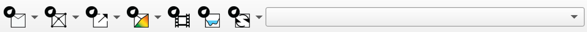

# Interface Overview

A quick map of the plugin's UI so the rest of the documentation makes sense.

## The toolbar

After install, a product-specific toolbar appears at the top of QGIS. Each toolbar is organized left-to-right by the order of a typical workflow: create project -> generate mesh -> export to solver -> visualize results -> auxiliary tools.

**RiverFlow2D**

{ width=80% }

**OilFlow2D**

{ width=80% }

**HydroBID Flood**

{ width=80% }

## Toolbar groups

Most toolbar buttons are drop-down menus exposing several related actions. The drop-downs correspond directly to the sections of this manual:

- **New Project / Scene** - create a new project, add scenes, import from disk.
- **TriMesh** - generate and refine the simulation mesh.
- **Export** - write the scene out for the solver.
- **Maps** - produce result maps.
- **Animation** - time-series visualization and video export.
- **Cross Sections** - transect-based WSE plots.
- **Tools** - utility functions (SWMM, HEEF, template layers, compare).

## Layer panel conventions

The plugin creates layers in a consistent order (domain, break-lines, boundary conditions, mesh) and groups them per scene. Don't rename the group labels - the plugin uses them to find layers for later actions.

## Context menus

Right-click on plugin-managed layers or features for action shortcuts. See the **Context Menus** section under each product.
