# Licensing

Before running RiverFlow2D or OilFlow2D, a license must be activated. Hydronia offers two models; the steps to activate differ between them.

## License models

- **Standalone** — a single license tied to one computer. Activates once; can only be used from that machine. Best for individual engineers and small teams.
- **Network** — a centralized license on a shared machine (the *network server*) that lets any number of client machines *install* the software, but limits the number of *concurrent users* to what you purchased. Best for larger teams and office environments.

Hydronia's licensing layer is [CopyMinder](https://www.copyminder.com). The license key you receive is a CopyMinder product code.

## Standalone activation

Do this on the machine that will run the software.

1. Open the **RiverFlow2DDIP** shortcut on your desktop.
2. In the left-hand **Control Data** section, go to **Options → License**.
3. You'll be offered three options:
   - **Reactivate License**
   - **Install Network License Server**
   - **Check for Updates**
4. Click **Reactivate License**.
5. When the activation dialog opens, select **Configure as a standalone program**.

    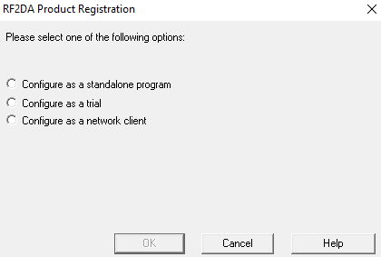{ width=55% }

6. Enter the license key Hydronia sent you.

    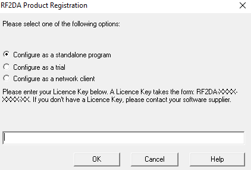{ width=55% }

7. Click **OK**. CopyMinder contacts its server to validate the key.

    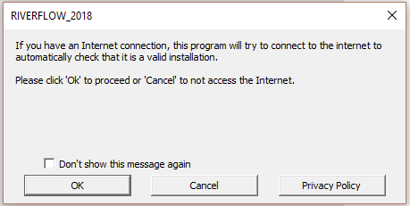{ width=55% }

8. Fill out the **Product Registration** dialog with your details.

    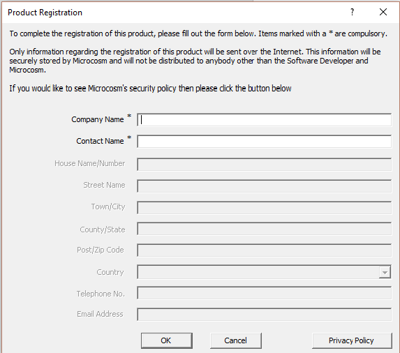{ width=60% }

Once registration finishes, the software is licensed on that machine. You can now [enable the QGIS plugin](installation.md#enabling-the-qgis-plugin).

!!! note "One activation per license"
    A standalone license can only activate once. If you need to move it to another machine, contact [support@hydronia.com](mailto:support@hydronia.com) for a transfer.

## Network server installation

Do this **once**, on the machine that will host the license server (the *network server*).

The Network Administrator needs a CopyMinder license key configured for network use. Don't share this key with end-users — it's separate from the client activation step and giving it out can cause client activations to fail in confusing ways.

1. Open **RiverFlow2DDIP** on the server.
2. **Control Data → Options → License**.
3. Click **Install Network License Server**.
4. CMServer's configuration window opens.

    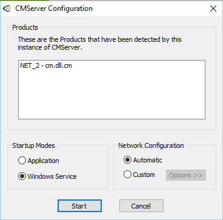{ width=55% }

5. Under **Startup Modes**, pick:
   - **Service** *(recommended)* — runs as a Windows background service; no login required on the server.
   - **Application** — requires an interactive login on the server. Use only if your IT policy forbids services.
6. Under **Network Configuration**, choose **Automatic**.
7. Click **Start**.
8. When prompted for a **License Key**, enter the network license key from Hydronia Support.

    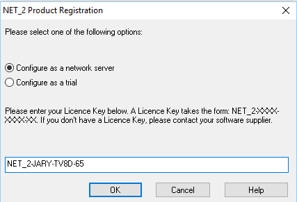{ width=55% }

9. Accept the firewall prompt — choose **Automatically Configure Windows Firewall**.

    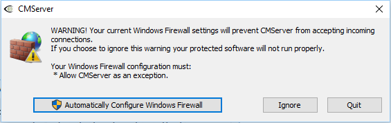{ width=50% }

10. Fill out **Product Registration** with your organization's details.

    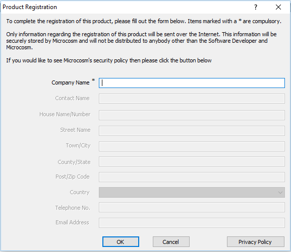{ width=60% }

11. On success, you'll see a confirmation message. The server is now ready for clients.

    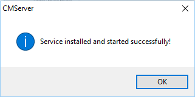{ width=40% }

### Checking who's using a network license

In the CMServer viewer, every active license appears with the client's machine name or IP and username.

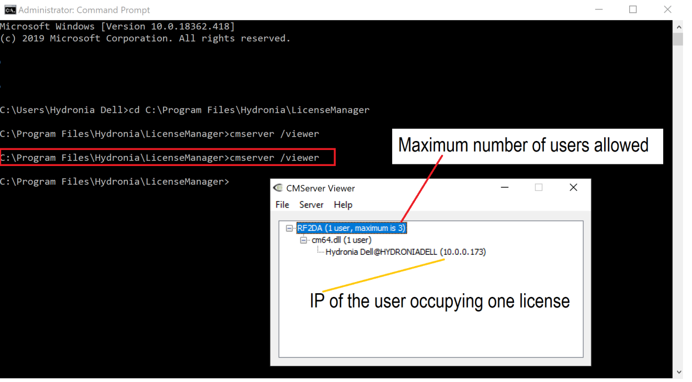{ width=78% }

If CMServer is running as a service, open the viewer from a command prompt:

```bat
cmserver /viewer
```

This connects to the running service and displays current usage.

## Network client installation

Do this on **every** client workstation that should run the software.

Install the software first (see [Installation](installation.md)), then:

1. Open **RiverFlow2DDIP** on the client.
2. **Control Data → Options → License → Reactivate License**.
3. Select **Configure as a Network Client**.
4. In most cases the client auto-detects the CopyMinder server on the LAN and fills in the details.
5. If auto-detection fails, enter the server's IP address or hostname followed by **`:10589`** — for example `LenovoJJ:10589` or `10.0.0.12:10589`.

    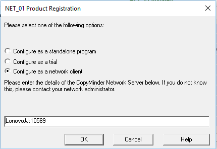{ width=55% }

6. Click **OK**. The client should start working immediately.

Repeat for each client machine. Clients can be installed on as many computers as you want — only the configured number of **concurrent** users is capped.

## Troubleshooting

### Activation fails with no error

Confirm the machine has rebooted after the install. Licensing components are unreliable until the first post-install reboot.

### "Cannot reach license server" on a client

- Verify the server's IP/hostname is reachable: `ping <server>` from the client.
- Confirm port `10589` is open on the server's Windows Firewall.
- If CMServer is running as a service, check the Windows Services panel for **CopyMinder Server** in the Running state.

### Finding your license file

If support needs to see the raw license record, open the correct file in Notepad:

- **Standalone**: `C:\ProgramData\AVU\RF2DA.ini`
- **Network License Server**: `C:\Program Files\Hydronia\LicenseManager\RF2DA.ini`

Paste the contents into a support email — never share these in public channels.

## Contact

For anything licensing-related, reach Hydronia Support at [support@hydronia.com](mailto:support@hydronia.com).
