# Hydronia Tools Context Menus

This chapter documents the Hydronia tools that are only available by right-clicking supported layers in the QGIS Layers panel. The context menu appears as *Hydronia tools*. Each tool is activated from the menu, then used by left-clicking a feature in the map canvas. Right-clicking exits the tool.

## Boundary Conditions HydroGraphs
This tool plots boundary condition hydrographs from the current scenario.

### Dialog Window
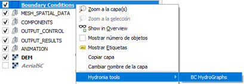

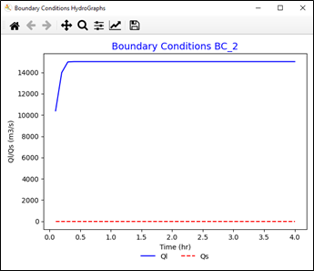

### Dialog Controls
All Hydronia context-menu plots use Matplotlib dialogs and share the same navigation toolbar behavior. The toolbar provides the standard Matplotlib controls:

-   **Home:** Resets the view to the original extents.

-   **Back/Forward:** Steps through prior zoom and pan states.

-   **Pan:** Click-drag to move the plot; scroll wheel zooms when supported by the backend.

-   **Zoom:** Drag a rectangle to zoom into a region.

-   **Save:** Saves the current plot view to an image file (PNG is supported by default).

Some plot dialogs include additional buttons tied to the plot content. For example, ObservationPoints plots allow loading measured data from a two-column text file to overlay on the model results, and a variable selector lets you choose which series the measured data represents. When these controls are present, the plot refreshes in place using the same toolbar for navigation and saving.

#### Figure Options
Many plot windows include a small 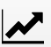 button that opens the Figure Options dialog. This dialog provides quick access to styling and labeling controls, organized by tabs:

-   **Axes Tab:** Edit axis titles, labels, ranges, and tick formatting.

-   **Curves Tab:** Adjust line styles, colors, markers, and visibility for plotted series.

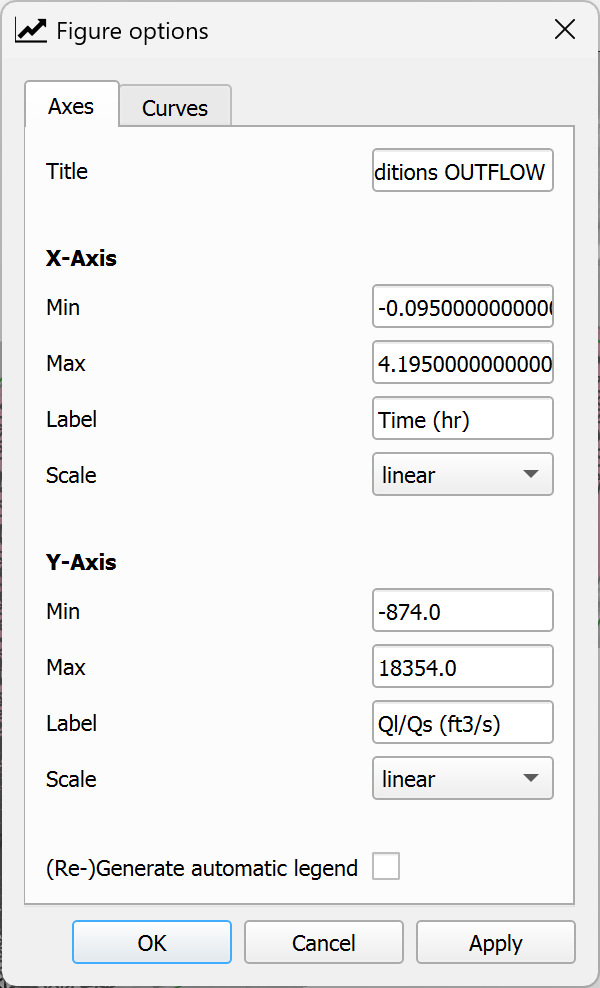

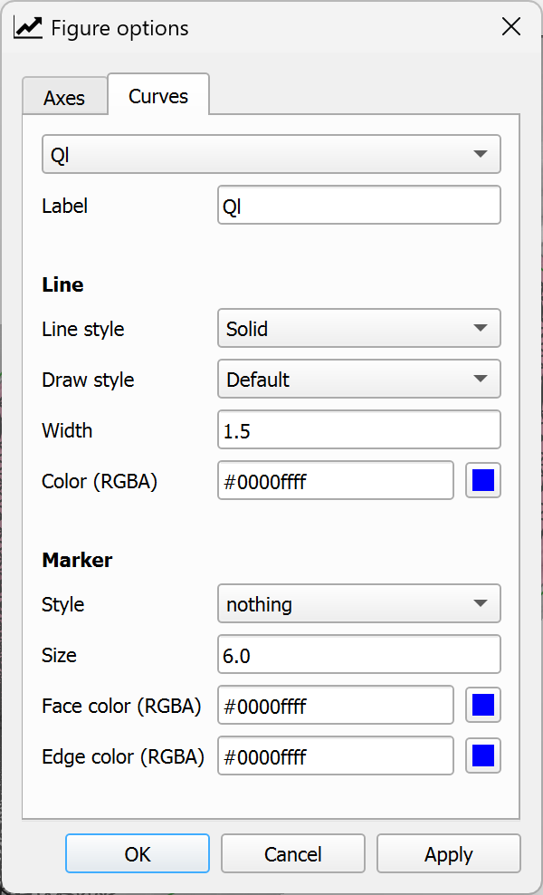

#### Configure Subplots
Some plots expose a 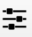 button that opens the Configure Subplots dialog for fine control of margins and spacing. Use it to adjust the plot layout before saving.

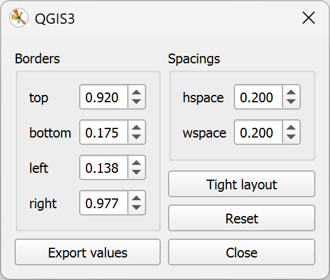

### Workflow
1.  Right-click the *Boundary Conditions* layer and choose *Hydronia tools* *BC HydroGraphs*.

2.  Left-click a boundary condition polygon in the map canvas.

3.  The tool reads the matching data from the scenario `.ROUT` file and plots inflow and outflow hydrographs.

4.  Right-click to exit the tool.

### Requirements
-   Valid *Boundary Conditions* layer with features.

-   Model output file: `<scene>.ROUT`

### Technical Details
-   The tool identifies the closest boundary condition to the clicked point using the feature's ID attribute.

-   Hydrograph values are read from the `.ROUT` file, which contains time series of inflow (Ql) and outflow (Qs) discharge for each boundary condition.

-   Units are automatically determined based on project settings (m³/s or ft³/s).

## Bridges HydroGraphs
This tool plots discharge and water surface elevation through a selected bridge.

### Dialog Window
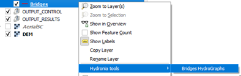

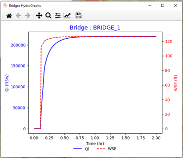

### Dialog Controls
This tool uses standard Matplotlib plot controls. See Section [7.1.2](#dialog-controls) for details on navigation controls, Figure Options, and Configure Subplots.

### Workflow
1.  Right-click the *Bridges* layer and choose *Hydronia tools* *Bridges HydroGraphs*.

2.  Left-click a bridge polyline in the map canvas.

3.  The tool reads the corresponding bridge output file and plots discharge and water surface elevation.

4.  Right-click to exit the tool.

### Requirements
-   Valid *Bridges* layer with features.

-   Model output file: `BRIDGE_<ID>.OUT`

### Technical Details
-   The tool identifies the closest bridge to the clicked point using the feature's ID attribute.

-   Each bridge has its own output file containing time series of discharge and water surface elevation.

## Culverts HydroGraphs
This tool plots discharge and water surface elevation at the inlet and outlet of a culvert.

### Dialog Window
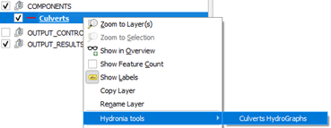

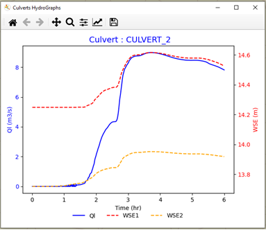

### Dialog Controls
This tool uses standard Matplotlib plot controls. See Section [7.1.2](#dialog-controls) for details on navigation controls, Figure Options, and Configure Subplots.

### Workflow
1.  Right-click the *Culverts* layer and choose *Hydronia tools* *Culverts HydroGraphs*.

2.  Left-click a culvert polyline in the map canvas.

3.  The tool reads the corresponding culvert output file and plots discharge, inlet WSE, and outlet WSE.

4.  Right-click to exit the tool.

### Requirements
-   Valid *Culverts* layer with features.

-   Model output file: `CULVERT_<ID>.OUT`

-   Project must use metric units (this tool is not available with English units).

### Technical Details
-   The tool identifies the closest culvert to the clicked point using the feature's ID attribute.

-   Each culvert has its own output file containing time series of discharge and water surface elevations at inlet and outlet.

-   The plot displays three series: discharge (Q), inlet water surface elevation (inlet WSE), and outlet water surface elevation (outlet WSE).

## Gates HydroGraphs
This tool plots the discharge through a selected gate.

### Dialog Window
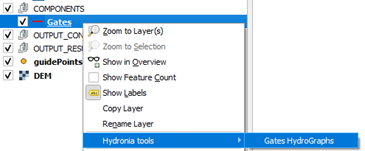

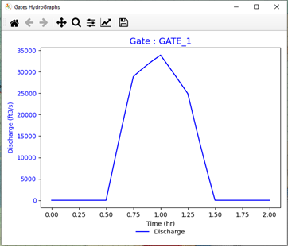

### Dialog Controls
This tool uses standard Matplotlib plot controls. See Section [7.1.2](#dialog-controls) for details on navigation controls, Figure Options, and Configure Subplots.

### Workflow
1.  Right-click the *Gates* layer and choose *Hydronia tools* *Gates HydroGraphs*.

2.  Left-click a gate polyline in the map canvas.

3.  The tool reads the gate output file and plots the discharge hydrograph for the selected gate.

4.  Right-click to exit the tool.

### Requirements
-   Valid *Gates* layer with features.

-   Model output file: `<scene>.GATEH`

### Technical Details
-   The tool identifies the closest gate to the clicked point using the feature's ID attribute.

-   Data for all gates is stored in a single `.GATEH` file, and the tool extracts the time series corresponding to the selected gate's ID.

## StormDrain HydroGraphs
This tool plots inflow, flooding, and water depth for a storm drain node.

### Dialog Window
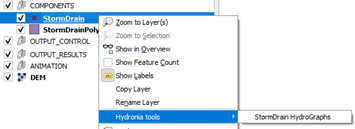

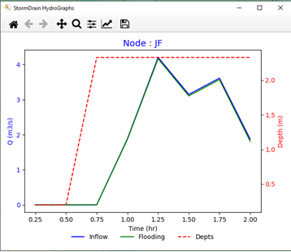

### Dialog Controls
This tool uses standard Matplotlib plot controls. See Section [7.1.2](#dialog-controls) for details on navigation controls, Figure Options, and Configure Subplots.

### Workflow
1.  Right-click the *StormDrain* layer and choose *Hydronia tools* *StormDrain HydroGraphs*.

2.  Left-click a StormDrain node in the map canvas.

3.  The tool reads the corresponding SWMM node output and plots inflow, flooding, and depth over time.

4.  Right-click to exit the tool.

### Requirements
-   Valid *StormDrain* layer with features.

-   Model output files:

    -   `<scene>.inp` (node list)

    -   `_swmm_node<X>.out`

### Technical Details
-   The tool identifies the closest storm drain node to the clicked point.

-   Data is read from SWMM output files, which contain time series of inflow, flooding volume, and water depth at each node.

-   The plot displays three series: inflow, flooding, and water depth.

## Weirs Tools
The Weirs layer exposes three tools in the *Hydronia tools* context menu.

### Dialog Window
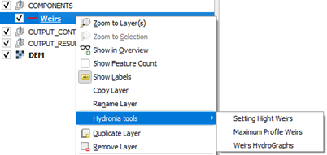

### Dialog Controls
The weir plotting tools use standard Matplotlib controls. See Section [7.1.2](#dialog-controls) for details on navigation controls, Figure Options, and Configure Subplots.

#### Setting Weirs Height
Sets a constant crest elevation or a constant height for the vertices of each weir.

-   **Weirs crest elevation:** assigns a fixed elevation to all vertices of each weir.

-   **Weirs height:** assigns a fixed height above the DEM; requires a DEM layer.

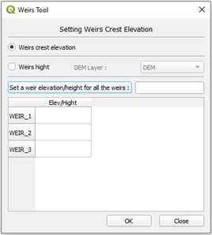

#### Maximum Profile Weirs
Plots the weir profile and the maximum water surface elevation on both sides of the weir.

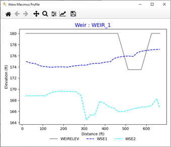

#### Weirs HydroGraphs
Plots the discharge hydrograph over the selected weir.

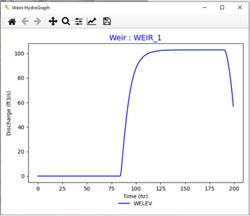

### Workflow
1.  Right-click the *Weirs* layer and choose *Hydronia tools*.

2.  Select one of the three Weirs tools.

3.  Left-click a weir polyline in the map canvas to run the selected tool.

4.  Right-click to exit the tool.

### Requirements
-   Valid *Weirs* layer with features.

-   Model output files:

    -   `<scene>.TWEIRS`

    -   `<scene>.WEIRI` or `<scene>.WEIRE`

-   For the weirs height tool: DEM layer if using the height above terrain option.

### Technical Details
-   The tool identifies the closest weir to the clicked point using the feature's ID attribute.

-   Weir data is read from `.TWEIRS` (time series) and `.WEIRI`/`.WEIRE` (profile data) files.

-   The maximum profile displays the weir crest elevation along with maximum water surface elevations on the upstream and downstream sides.

## Sources HydroGraphs
This tool plots the time series defined by a source or sink feature.

### Dialog Window
The tool displays a Matplotlib plot with the time series for the selected source.

### Dialog Controls
This tool uses standard Matplotlib plot controls. See Section [7.1.2](#dialog-controls) for details on navigation controls, Figure Options, and Configure Subplots.

### Workflow
1.  Right-click the *Sources* layer and choose *Hydronia tools* *Sources HydroGraphs*.

2.  Left-click a source point in the map canvas.

3.  The tool reads the time-series file referenced by the source feature and plots the series.

4.  Right-click to exit the tool.

### Requirements
-   Valid *Sources* layer with features.

-   Time-series file referenced by the `SourceFile` attribute (name resolved from the current scenario path).

### Technical Details
-   The tool identifies the closest source to the clicked point.

-   The feature's `SourceFile` attribute contains the time-series filename, which is resolved relative to the current scenario folder.

-   The plot displays the source (positive values) or sink (negative values) discharge over time.

## ObservationPoints Tools
The ObservationPoints layer exposes three tools in the *Hydronia tools* context menu.

### Dialog Window
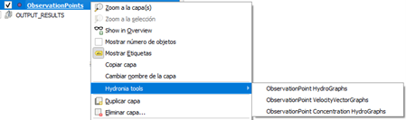

### Dialog Controls
The observation points tools use standard Matplotlib controls. See Section [7.1.2](#dialog-controls) for details on navigation controls, Figure Options, and Configure Subplots.

#### ObservationPoint HydroGraphs
Plots velocity, depth, and water surface elevation (WSE) versus time for a selected observation point.

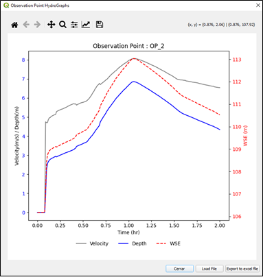

#### ObservationPoint VelocityVectorGraphs
Plots velocity vectors versus time for a selected observation point.

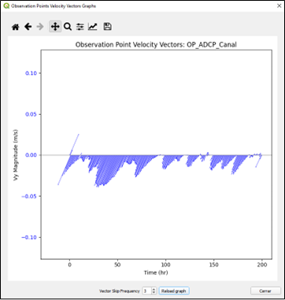

#### ObservationPoint Concentration HydroGraphs
Plots concentration time series for pollutants or suspended sediment fractions when those modules are enabled.

#### Optional Measured Data Overlay
The HydroGraphs and Concentration tools allow loading measured data from a two-column text file (time in hours, value). After loading, select the variable type (Velocity, Depth, or WSE) to overlay the measured series on the plot.

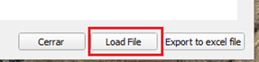

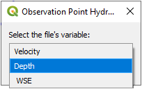

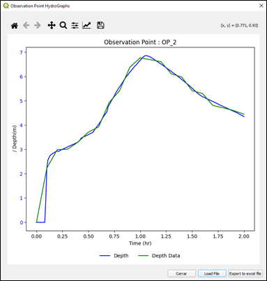

### Workflow
1.  Right-click the *ObservationPoints* layer and choose *Hydronia tools*.

2.  Select one of the three ObservationPoint tools.

3.  Left-click an observation point in the map canvas.

4.  The tool reads the corresponding output file and plots the requested series.

5.  Right-click to exit the tool.

### Requirements
-   Valid *ObservationPoints* layer with features.

-   Model output file: `RESvsT_<ID>.OUTI`

-   The HydroGraphs and Concentration tools require metric units (not available with English units).

### Technical Details
-   The tool identifies the closest observation point to the clicked point using the feature's ID attribute.

-   Data is read from `RESvsT_<ID>.OUTI` files, which contain time series of velocity, depth, WSE, and optionally concentrations.

-   The velocity vector plot displays the u and v velocity components over time.

-   Measured data files must have two columns: time (in hours) and value, with no header.
