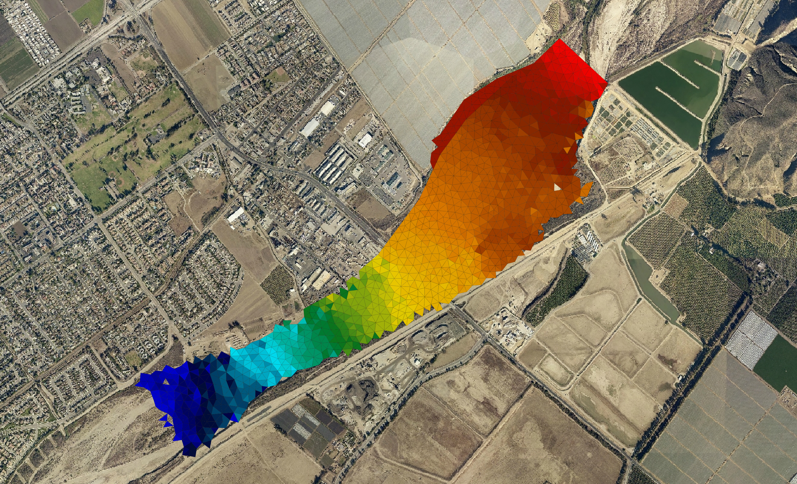

# Introduction

This section presents the system of equations, the formulation of the boundary conditions, and the finite-volume scheme used in RiverFlow2D and the information can be expanded in the references.

RiverFlow2D is a combined hydrologic and hydraulic, mobile bed and pollutant transport finite-volume model for rivers, estuaries and floodplains based on the RiverFlow2D model[^1].

It is part of the Hydronia suite of models that includes OilFlow2D. RiverFlow2D can route floods in rivers and simulate inundation over floodplains and complex terrain at high resolution and with remarkable speed, stability, and accuracy. The use of adaptive triangular-cell meshes enables to resolve the flow field around key features in riverine, estuarine, and coastal environments.

This version of RiverFlow2D model includes a Graphical User Interface (GUI) based upon a plugin developed by Hydronia for the Open Source Geographical Information System QGIS (www.qgis.org). The plugin was partially funded by the InterAmerican Development Bank. The integration of the RiverFlow2D model and the QGIS software system provides interactive functions to generate and refine the flexible mesh used by RiverFlow2D, familiar GIS layers and tools to construct a high-level representation of the model, facilitating assigning boundary conditions and Manning's n values, and all the other data layers required by RiverFlow2D components, allowing the user to efficiently manage the entire modeling process.

RiverFlow2D offers a comprehensive set of visualization tools including map rendering, animations, and exporting graphs in shapefile format and Google Earth.

RiverFlow2D computation engine implements an accurate, fast, and stable finite-volume solution method that eliminates the boundary and hot start difficulties of some old generation two-dimensional flexible mesh models. RiverFlow2D can integrate hydraulic structures such as culverts, weirs, bridges, gates, internal rating tables, and internal dam and levee breaches. The model also accounts for distributed wind stress on the water surface. The hydrologic capabilities include spatially distributed rainfall, evaporation and infiltration. The model also accounts for distributed wind stress on the water surface.

This reference manual provides instructions to install RiverFlow2D, and explains the fundamentals of the model and its components, as well as the numerical methods used to solve the governing equations. It also presents a detailed description of the input data files and output files. A separate tutorial document provides detailed guidelines to use many of the RiverFlow2D capabilities, that will help you get started using the model and learning to apply model components such as bridges, culverts, rainfall and infiltration, weirs, sediment transport, etc.

{ width=100% }

## Summary of RiverFlow2D Features and Capabilities

### Mesh Generator

- Automatic generation of flexible triangular-cell mesh.
- Mesh refinement along density polylines or inside polygons.
- Use of breaklines to adjust mesh along terrain features.
- Use of multiple Digital Elevation Models in the same mesh according to user selected areas.
- Spatially interpolation of DEM elevations to cells.
- Mesh cell and node numbering optimization.

### Numerical Engine

- Spatial discretization using triangular cells.
- High performance Finite-Volume engine.
- Automatic and dynamic selection of the computational time step.
- Dry cell integration.
- Exact volume conservation.
- Double-precision computations for higher accuracy.
- Fully parallelized with OpenMP for faster execution in Multiple-Core computers.
- GPU version for up to $>$ 700X faster simulations using NVIDIA GPU Graphic Cards.

### Hydraulic Components

- Internal dam and levee breaches.
- Culverts using the US Federal Highway Administration (FHWA) formulation.
- Bridge hydraulics in 2D including pressure flow and overtopping.
- Bridge pier drag forces.
- Weirs with variable crest elevations.
- Gates.
- Dam Breach (prescribed failure, piping and overtopping erosion)
- Internal hydraulic structures.
- Sources and sinks.
- Spatially distributed rainfall and evaporation.
- Spatially distributed infiltration.
- Spatially distributed wind stress.
- Depth dependent Manning's n.
- Bridge pier and abutment scour.
- Sequential automated batch runs for each input source/spill.

### Input Data Formats

- Metric or English units.
- ASCII X, Y, Z.
- ESRI ASCII grid files.
- USGS DEM.
- ESRI shapefiles.
- Autodesk DXF.
- TIFF, GIF, JPG, etc. raster's.
- Any raster or vector data format accepted by QGIS.

### Initial Conditions

- Dry-bed.
- User-defined constant water elevations over polygons.
- User-defined variable water elevations given by raster data.

### Boundary Conditions

- Water discharge hydrograph.
- Water discharge and water elevation vs time.
- Water elevation vs time.
- Uniform flow.
- Rating tables.
- Free outflow.
- Inflow suspended sediment concentrations (ST Module).
- Inflow solid discharge for bed load option (ST Module).
- Inflow pollutant concentrations (PL Module).

### Output Options

- Results at cross sections and profiles.
- Observation points: time series at user selected locations.
- Dynamic plots while the model runs.
- Velocity field, depth and water surface elevations.
- Bed shear stress.
- Froude Number.
- Accumulated rainfall.
- Accumulated infiltration.
- Erosion and deposition depths.
- Bed elevation changes.
- Sediment fluxes.
- Time to 0.3 m (1 ft), time to 0.5 m (2 ft) , time to 1 m (3 ft), time to peak depth, and frontal wave arrival time.
- Inundation time during which depth is greater than 0.1 m or 4 in.
- Frontal wave arrival time.
- ESRI shapefiles.
- GIS post processing plots including shapefiles and raster images.
- Paraview VTK.

### Output of Results for Maximum Values

- Maximum velocity magnitude.
- Maximum depths.
- Maximum water surface elevations.
- Maximum depth times velocity.
- Maximum Shear Stress.
- Maximum Impact force per unit width.

### Output for Hazard Assessments

- United States Bureau of Reclamation (USBR) Hazard for Homes.
- United States Bureau of Reclamation (USBR) Hazard for Vehicles.
- United States Bureau of Reclamation (USBR) Hazard for Adults.
- United States Bureau of Reclamation (USBR) Hazard for Children.
- Swiss method for flooding.
- Swiss method for debris flow.
- Austrian method for river flooding.
- Austrian method for torrents Tr = 10 yrs.
- Austrian method for torrents Tr = 100 yrs.
- UK method
- Australia flood hazard

### Urban Drainage Module (UD)

- Surface flooding integrated with storm drainage network.
- Dynamic integration with EPA-SWMM.
- User defined catchment polygons that define surface-storm drain exchange areas.

### Sediment Transport Module (ST)

- Separate calculation of suspended and bed load sediment transport.
- Multiple size fractions.
- Bed-changes (erosion-deposition).
- Spatial and temporal bed class dynamics.
- 10 sediment-transport formulas.
- Sediment transport over rigid bed.
- Limited maximum bed elevation gradient.
- Maximum erosion depth areas.
- Coupled or decoupled computation.

### Mud and Tailings Flow Module (MT)

!!! note
    The MT module was previously known as Mud and Debris Flow Module (MD).

- Non-Newtonian fluids.
- Eight rheological formulations.
- Granular flow.
- Variable density, viscosity, and yield stress.
- Multiple size fractions in Inflow and bed material.
- Erosion and deposition.
- Multiple inflows and initial deposits with variable properties.
- Tailings prescribed dam breach.
- Dynamic calculation of tailings deposit volume mobilization.

### Pollutant Transport Module (PL)

- Advection-Dispersion-Reaction.
- Reaction rates between pollutants/solutes.
- Simultaneous computation of multiple solutes.

### Water Quality Module (WQ)

- Advection-Dispersion-Reaction based on the US Environmental Protection Agency EPA-WASP model formulation.
- Considers the following constituents:

    - Ammonium nitrogen ($\rm{NH_4^+-N}$).
    - Nitrate Nitrogen ($\rm{NO_3^--N}$).
    - Inorganic phosphorus ($\rm{IP}$).
    - Phytoplankton carbon ($\rm{PHYT}$).
    - Carbonaceous biological oxygen demand ($\rm{CBOD}$).
    - Dissolved oxygen ($\rm{DO}$).
    - Organic nitrogen ($\rm{ON}$).
    - Organic phosphorus ($\rm{OP}$).
    - Temperature ($\rm{T}$).
    - Total coliform bacteria ($\rm{TC}$).

{ width=100% }

[^1]: RiverFlow2D^TM^ and OilFlow2D^TM^  are registered trademarks of Hydronia, LLC
