# Installing and Activating RiverFlow2D

RiverFlow2D installation includes the most current version of QGIS that has been tested to work with the model. This section will assist you in setting RiverFlow2D and enabling it in QGIS.

## Hardware Requirements

RiverFlow2D is supported on 64-bit computers running MS-Windows Operating System versions 7 through 11. It is recommended to use a computer with a minimum of 4 GB of RAM and at least 10 GB of free hard disk space. RiverFlow2D is capable of running in modern Intel single processor computers. If multiple-core processors (Duo, Quad, etc.) are available, the model can execute in parallel processor mode, thereby running much faster than in single processor computers. In addition, using the RiverFlow2D GPU option, the model can take advantage of NVIDIA Graphic Processing Unit (GPU) cards to run up to 700 times faster than in single-processor computers.

## Software Installation

1. If you are installing on a PC running Windows 7 or later, you must be logged on the PC as an administrator before you begin the installation.
2. Download your software from the link provided when purchased.
3. Run the installation.

    !!! note

        Reboot will be required. Please reboot before proceeding to the next section.

## Software Activation

- Standalone - A single license for one computer.
- Network - A centralized license that allows multiple concurrent users depending on license count purchased. This requires additional license manager software to be installed on an accessible computer on your network.

### Standalone Activation

Use the this activation mode if you have received a single-user stand-alone software license key. If you received a network license key, please proceed to the the next section.

1. To activate your software, you must open DIP (Hydronia DIP) shortcut on your desktop.
2. In the *Control Data* section on the left side, go to *Options* and select *License*.
3. You will be prompted to select one of three options:

    1. Reactivate License
    2. Install Network License Server
    3. Check for Updates

4. Select *Reactivate License*.
5. The following dialog will appear:

    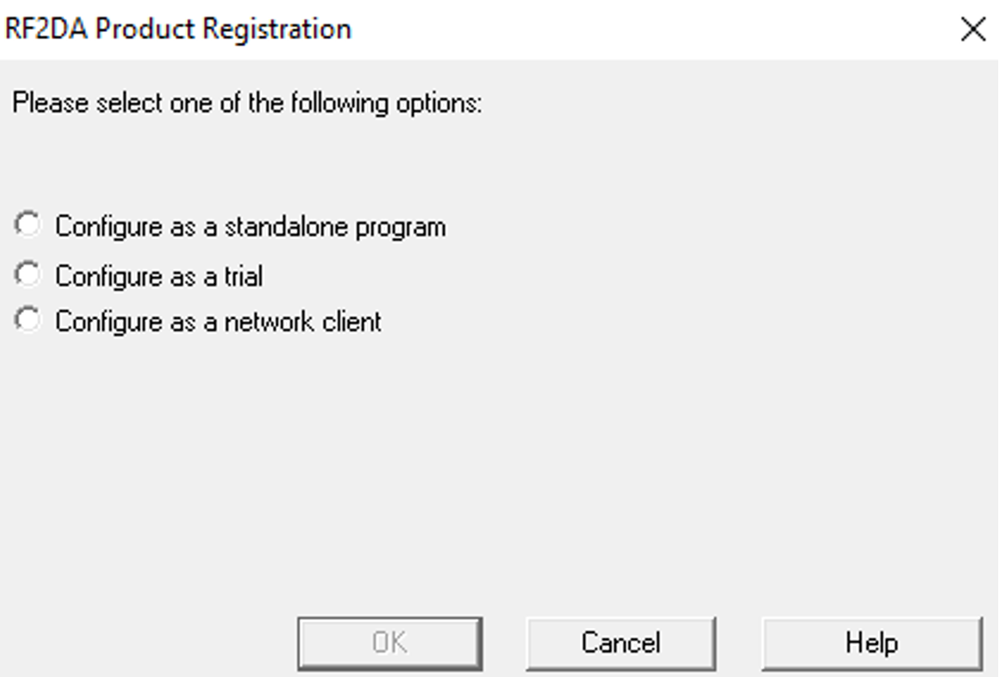{ width=50% }

6. Select *Configure as a standalone program*.
7. Enter the license key provided to you (e.g. ):

    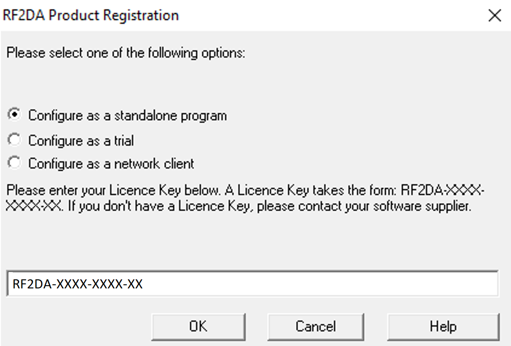{ width=50% }

8. Click *OK*.
9. protection will connect to the web site to check the settings defined for this product code and license. Click *OK* in the dialog.

    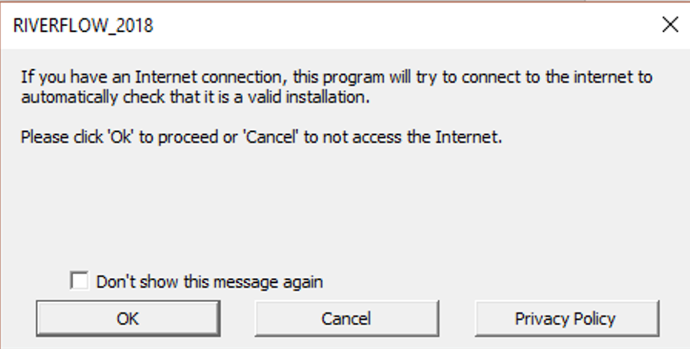{ width=40% }

10. The next dialog asks for the Product Registration data. Please fill out the required fields:

    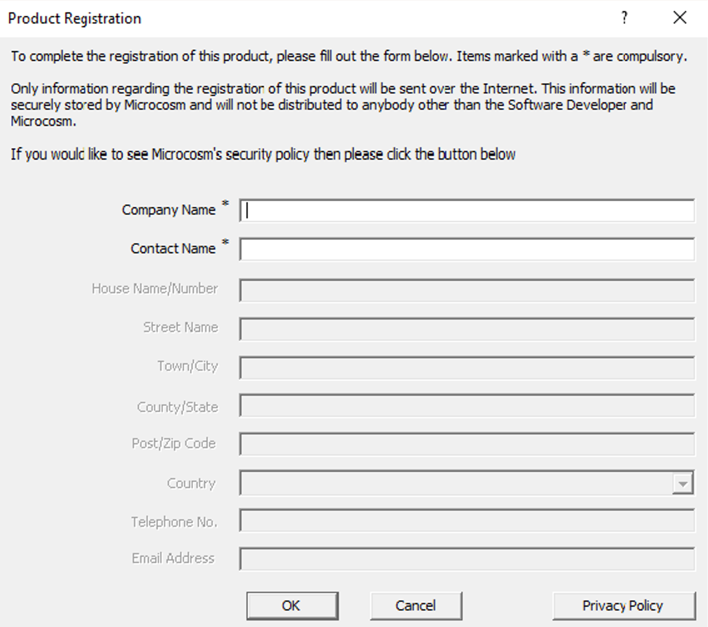{ width=50% }

11. Once registration is complete, please proceed to the section *Enabling Plugins for RiverFlow2D and OilFlow2D in QGIS* on page.

### Network Server Installation

Use the this activation mode if you have received a network license key. If you received a stand alone license key, please use the activation procedure described in the previous section on page.

A network installation allows the use of your software on any number of machines on the same network, but limits the number of simultaneous users of your software.

The client machines will communicate with this server to carry out protection checks.

The Network Administrator will need a license key (configured to allow network installation) to activate the installation on the server. It is recommended that the Network Administrator does not reveal this license key to end-users, to avoid the potential confusion of the user trying to activate their copy of your software as a single user installation using that license key (this will not work).

The Network Administrator runs with its associated files (defined and distributed by Hydronia) in the network server.

1. To activate your software, you must open DIP shortcut on your desktop.
2. In the *Control Data* section on the left side, go to *Options* and select *License*.
3. You will be prompted to select one of three options:

    1. Reactivate License
    2. Install Network License Server
    3. Check for Updates

4. Select *Install Network License Server*.
5. will display a configuration window.

    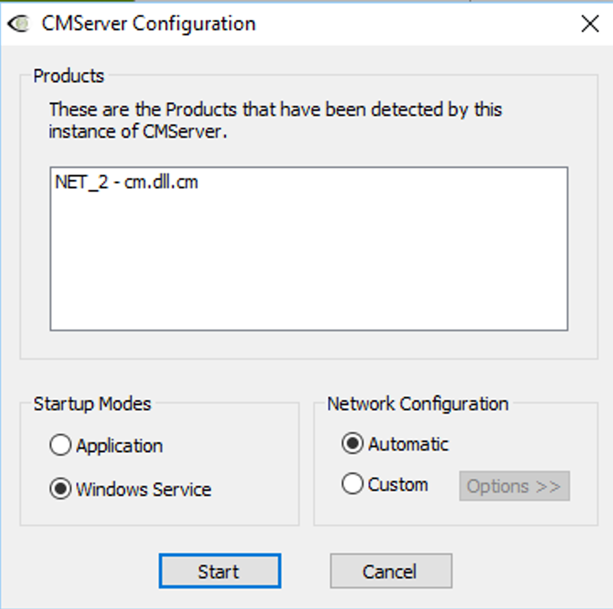{ width=50% }

6. Choose *Startup Modes* as *Windows Service*.
7. In *Network Configuration*, select *Automatic*.
8. Click *Start*.
9. After clicking *Start*, enter the License Key provided by Hydronia.

    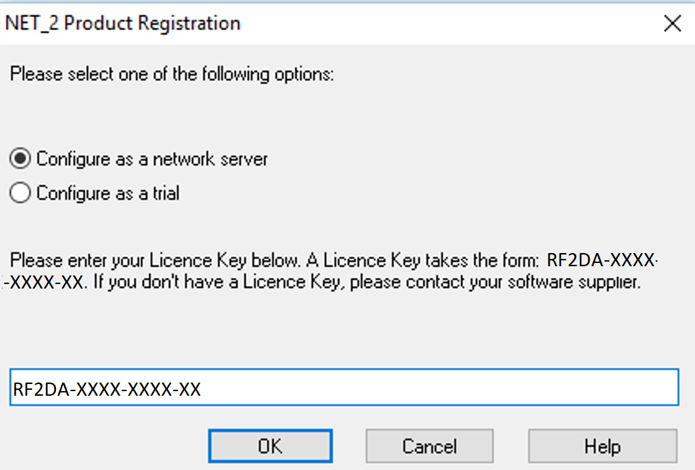{ width=50% }

10. You will be prompted to add an exception to the firewall rules.

    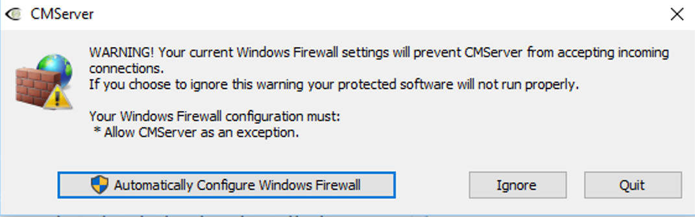{ width=50% }

11. Select *Automatically Configure Windows Firewall*.
12. Next, input your details in the Product Registration window:

    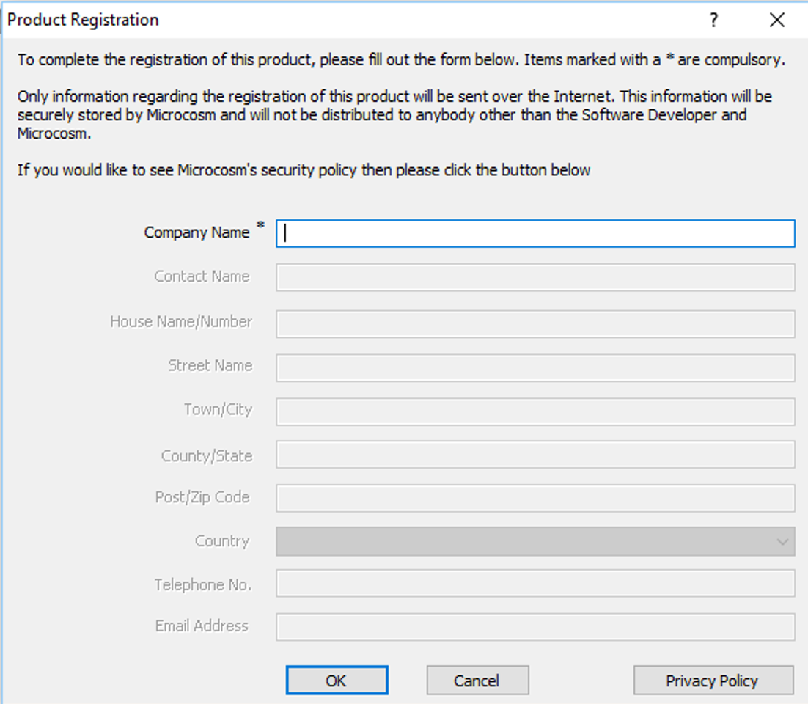{ width=50% }

13. If successful, the following message will appear:

    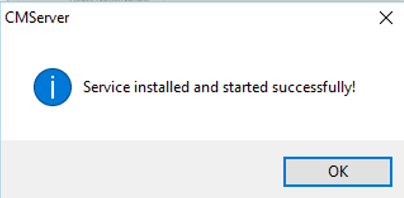{ width=40% }

14. You may now install network clients on other machines.

### Network Client Installation

Once is running on the server, the RiverFlow2D or OilFlow2D programs and dependencies must be installed on each client workstation computer. Please refer to installation steps in section : *Software Installation* on page. The steps below assume you have already run the installation program in the client computer, and are ready to activate.

1. To activate your software, open DIP shortcut on your desktop.
2. In the *Control Data* section on the left side, go to *Options* and select *License*.
3. You will be prompted to select one of three options:

    1. Reactivate License
    2. Install Network License Server
    3. Check for Updates

4. Select *Reactivate License*
5. Select *Configure as a Network Client*.

    !!! note

        Note: In most cases the software will automatically detect the presence of the Network Server and the details will be filled in. If it does not fill this information in, input the IP address or computer name followed by.

6. The window shows the name of the network server ( in this example):

    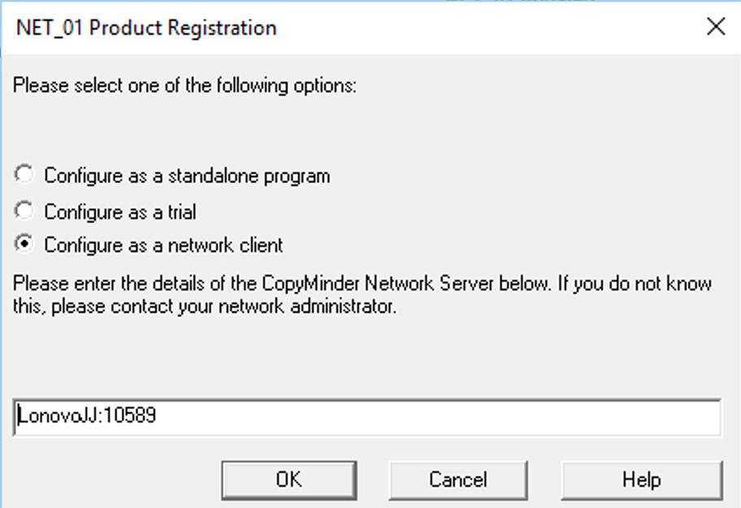{ width=50% }

7. Click *OK*.
8. Repeat this process for each RiverFlow2D or OilFlow2D network client.

!!! note

    Note: The software can installed and configured as a network client on as many computers as desired in the network. In that case, the model will only run concurrently on as many computers as the number of RiverFlow2D or OilFlow2D licenses that you have purchased.

## Enabling Hydronia Plugins in QGIS

By default, the first time you run QGIS, the plugins developed for RiverFlow2D or OilFlow2D will not be enabled.

### Enabling RiverFlow2D Plugin

For RiverFlow2D plugin, please enable it by selecting the *RiverFlow* check box using the *Plugins \| Manage and Install Plugins\... menu* as shown.

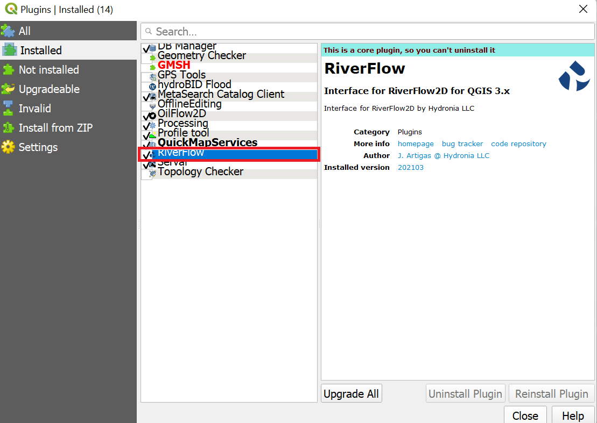{ width=80% }

Then verify that the RiverFlow2D plugin icons appear in the QGIS toolbar area:

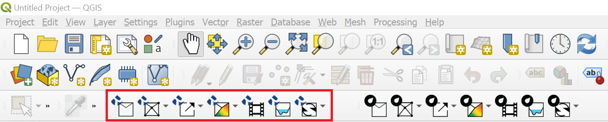{ width=80% }

### Enabling OilFlow2D Plugin

For OilFlow2D plugin, please enable it by selecting the *OilFlow2D* check box using the *Plugins \| Manage and Install Plugins\... menu* as shown.

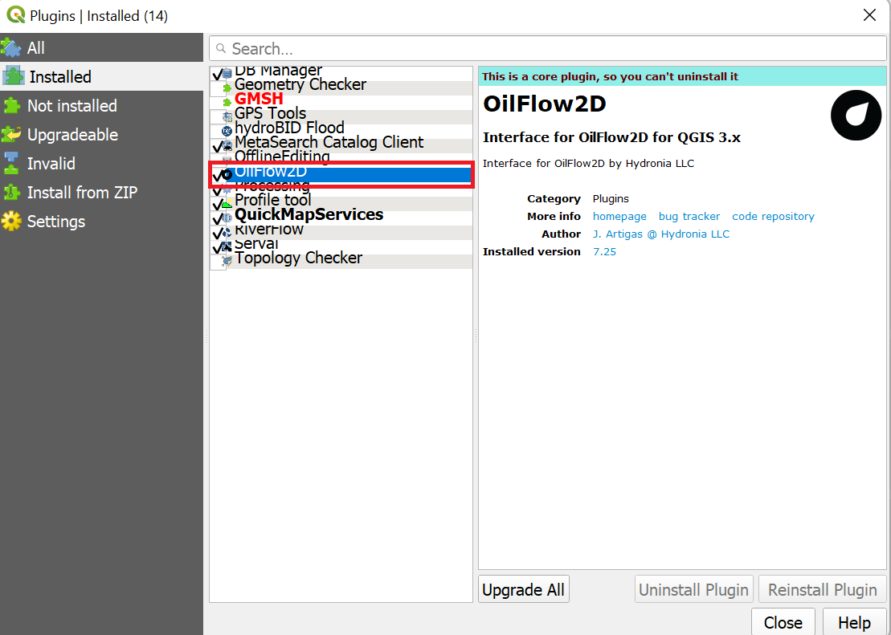{ width=80% }

Then verify that the OilFlow2D plugin icons appear in the QGIS toolbar area:

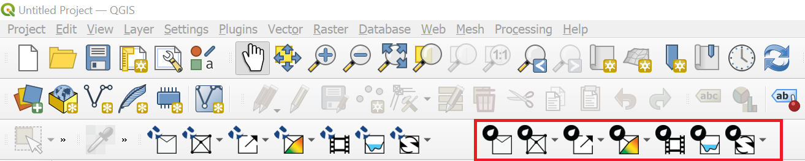{ width=80% }

### Enabling Macros in QGIS

Successfully using the RiverFlow2D plugin requires enabling the use of macros in QGIS. To do that, access the *Options* dialog by using the *Settings \| Options\...* menu, and in the *General* panel scroll down and select the *Always* option on the *Enable Macros* drop down list as indicated in the figure below.

!!! note

    Please, do not pay attention to the (*Not Recommended*) warning on the option, since that is shown to warn about plugins of unknown origin, and that is not applicable to Hydronia Plugins.

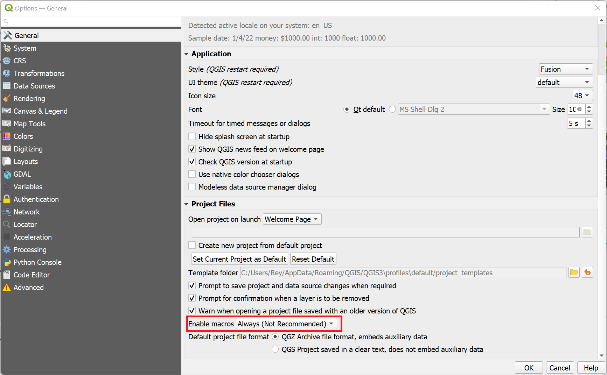{ width=80% }

## Troubleshooting

In this section we include solutions to some issues that may occur during the software installation. Bear in mind that you may always contact Hydronia support team at to report any error message or problem that you may encounter during installation.

### Finding your License Key

If you ever have an issue related to your installation, you can find the license key in the following files depending on the type of installation that you are using:

- Standalone: `C:\ProgramData\AVU\RF2DA.ini`
- Network License Server: `C:\Program Files\Hydronia\LicenseManager\RF2DA.ini`

Open the file with Notepad or any other text editor, and your license key will be indicated following "\". In the following example the license key is:

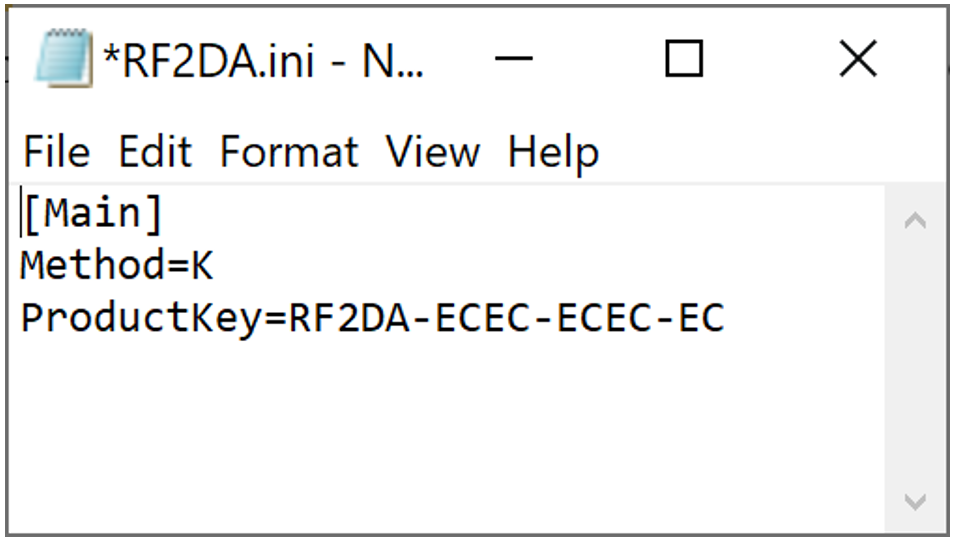{ width=30% }

### Find Who is Using the Software in a Network Installation

You can check how many users are occupying each license and know their computer ID using the viewer program that is installed on the folder.

In the , all the licenses in use are displayed, with the machine name or IP address and username.

If CMserver is running as a service, you can start the GUI for the viewer from the command line as follows:

1. In the Windows search box write and then press *Enter*
2. Enter and press *Enter*
3. Enter and press *Enter*

The information displayed in the window will be similar as indicated in the following figure

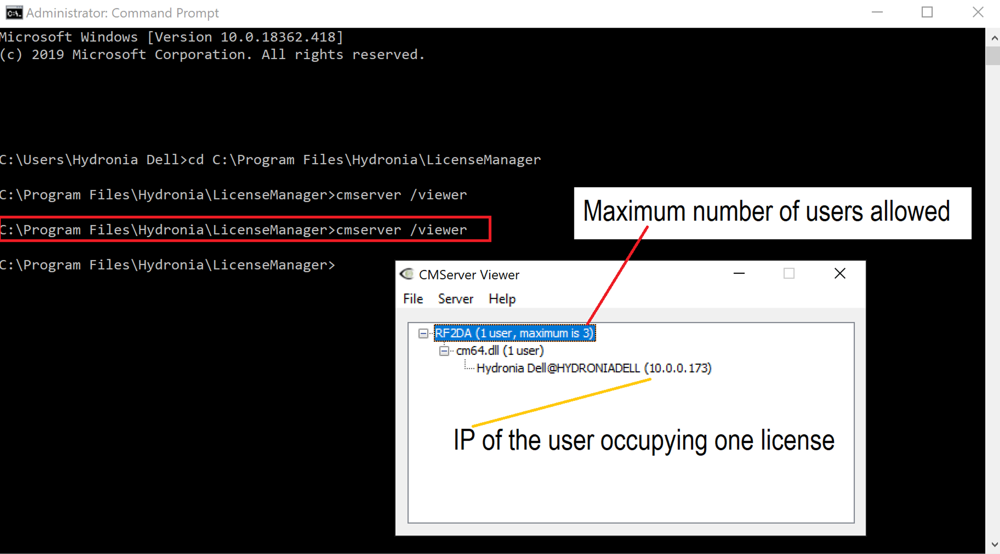{ width=90% }

### ERROR 641: \"You have reached the limit on the maximum number of simultaneous users of this program.\"

This error can appear when there are more models trying to run than the number of available licenses. However, sometimes the run was interrupted at a critical stage and the model executable remains in memory. This is interpreted by the protection as if there was more licenses running. To fix this issue, open the Windows task Manager and in the Process tab look for the model executable, select it by clicking on the file and click *End task*. That will remove the model from memory and terminate the idle run.

### ERROR 659: \"This program is configured for network installation only. It cannot be installed as a standalone system.\"

This error is frequently a result of specifying a Product Key on a network client machine instead of the License Manager Host Name. For a network installation, when the model is first run on a client machine, you should select *Configure as a network client* and enter the Host Name of the computer with the Network License manager installed. To solve the issue follow the instructions provide in section on page.

### ERROR 660: \"This program is configured for standalone installation only. It cannot be installed as a network system\"

This error is the result of having used a license key that is for network installations only with a license that has been configured for standalone use. To solve the issue, please install the Network License Server as instructed in section on page and use the key provided by Hydronia.

### ERROR 739: \"This program has been installed or copied too many times.\"

This error is generated when the RiverFlow2D program has been installed or re-activated more times than allowed by the protection program. It does not necessarily indicates improper use of the model. If you get this error please send an email to our support team at indicating the error and your license key. With that information we will reset the license server to release the license.

If you do not know your license key, please refer to section on page.

## RiverFlow2D Documentation

Find RiverFlow2D documentation including this manual in the following folder:\
usually installed under or (see Figure ).\
Also under , you will find example projects, videos, and other useful resources.

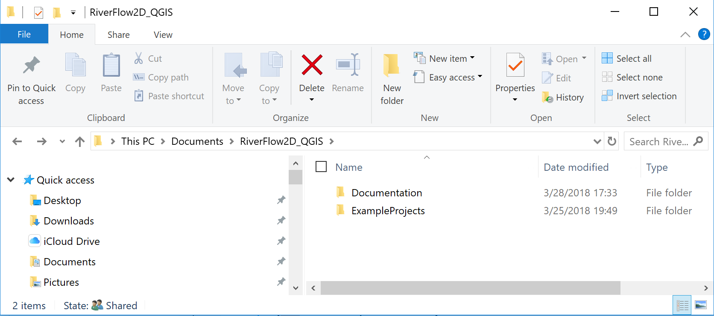

## RiverFlow2D Technical Support

If you have any questions or require assistance using RiverFlow2D, please send an email to our support team at:

<mailto:contact@hydrobidlac.org>. Please make sure you visit our web site <https://www.hydrobidlac.org> regularly to find out about new products and news about the software.

## RiverFlow2D Tutorials

The best way to get acquainted and using RiverFlow2D capabilities is following the tutorials. In the accompanying RiverFlow2D there are tutorials to get started with the model, and several of the model components. Each tutorial includes a set of files that you can use to do each exercise.
