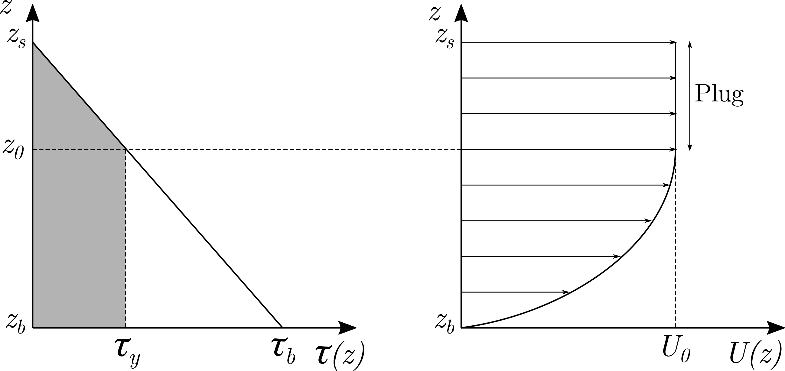
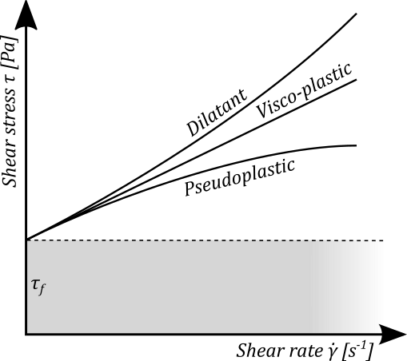
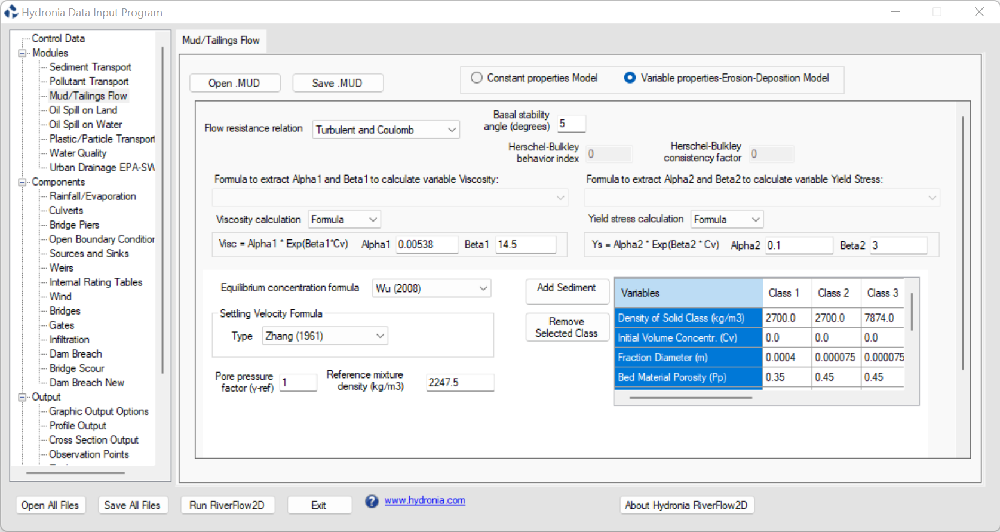
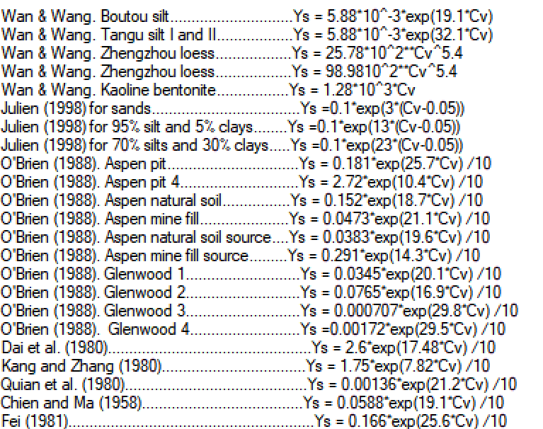
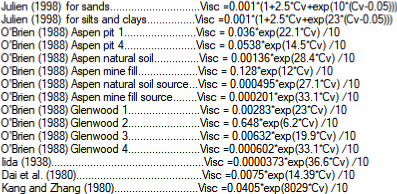

# Mud and Tailings Flow Model: MT

Mud, debris or tailing floods are highly unsteady surface flow phenomena in which the fluid shows compressible non-Newtonian behavior, including stop and go mechanisms. The bulk properties of the fluids are those of a hyperconcentrated mixture of water and sediments, with important gradients of the solid phase concentration. The global resistance of the mud/tailings flow depends on the relative importance of the shear stresses arising from different sources that, apart from turbulent shear stress at the channel boundary, include viscous stress, yield stress, dispersive stress and inelastic collisions of solid particles within the fluid mixture.

RiverFlow2D MT module includes two options. The first is the *Constant-Properties Fixed-Bed Model (CP-FB)* that considers an homogeneous fluid with constant density, viscosity, yield stress, and friction angle, where the sediment volumetric concentration does not change in time nor space. The second option is the *Variable-Properties Movable-Bed Model (VP-MB)* in which the solid phase is composed of multiple sediment size classes. This model includes transient bulk density, variable viscosity and yield stress in space and time, dynamic pore-fluid pressure affecting the stop mechanism, and entrainment/deposition of material from/to the underlying movable bed.

## *Constant-Properties Fixed-Bed (CP-FB)* Mud Flow Model

The mathematical model adopted in the *CP-FB* model is based on that of , considering fixed-bed conditions and the basal resistance for free-surface flow ranging from clear water to hyperconcentrated mixtures of sediments.

The *CP-FB* model involves the following assumptions:

- The flow is confined to a layer which is thin compared to the horizontal scale of interest.
-   The flow is governed by equation  with the resistance terms evaluated as explained below.
- The mixture of water and sediments is described by using the continuum approach, without distinguishing the liquid from the solid phase.
- The river bed does not erode, hence entrainment/deposition of material is not possible.
- The fluid is assumed to be an homogeneous single-phase mix of water and sediment and has constant properties: e.g. density, viscosity, yield stress, basal frictional angle, etc. The pore-fluid pressure is also considered hydrostatic.
- The reference coordinate system is horizontal-vertical and the pressure and stress forces act along the horizontal direction.

## *Variable-Properties Movable-Bed (VP-MB)* Flow Model

The *VP-MB* model for mud/tailings flow is based on that of and involves the following assumptions:

- Shallow-flow approach: the flow is confined to a layer which is thin compared to the horizontal scales of interest, leading to the hydrostatic bulk pressure assumption.
- Multicomponent flow: the mixture of water and sediment particles is described by using the continuum approach and assuming the same velocity for the liquid and the solid phase.
- The different sediment size-classes present in the flow are distributed uniformly in the flow column.
- The reference coordinate system is horizontal-vertical, but the pressure and stress forces act along the direction tangential to the bed surface.
- Dynamic pore-fluid pressures can be developed in the liquid phase, affecting the frictional shear stress between solid grains.

The two-dimensional mud/tailings flow model over erodible bed consists of $3+N+1$ partial differential equations, including the depth-averaged equations for the water-sediment mixture mass and momentum conservation:

$$\begin{aligned}
    & \frac{\partial}{\partial t} (\rho h) + \frac{\partial}{\partial x} (\rho hu) + \frac{\partial}{\partial y} (\rho hv) = - \sum_{p=1}^{N} \rho_{b,p}\, \frac{D_p-E_p}{1-\xi_p} \\
    & \frac{\partial}{\partial t} (\rho hu) + \frac{\partial}{\partial x} (\rho hu^2 + \frac{1}{2} g_{\psi} \rho h^2 ) + \frac{\partial}{\partial y} (\rho huv) = -\, g_{\psi} \rho h\, \dfrac{\partial z_b}{\partial x} - \tau_{bx}\\
    & \frac{\partial}{\partial t} (\rho hv) + \frac{\partial}{\partial x} (\rho huv) + \frac{\partial}{\partial y} (\rho hv^2 + \frac{1}{2} g_{\psi} \rho h^2) = -\, g_{\psi} \rho h\, \dfrac{\partial z_b}{\partial y} - \tau_{by}
\end{aligned}$$

the continuity equation for each sediment size-class $p=1,...,N$, expressed as:

$$\frac{\partial}{\partial t} (h\,\phi_p)+ \frac{\partial}{\partial x} (hu\,\phi_p) + \frac{\partial}{\partial y} (hv\,\phi_p) = - (D_p-E_p) \\$$

as well as the mass conservation equation for the bed layer considering $N$ sediment size-classes:

$$\begin{aligned}
    & \frac{\partial z_b}{\partial t} = \sum_{p=1}^{N} \frac{D_p-E_p}{1-\xi_p} 
\end{aligned}$$

where $\rho$ is the bulk mixture density, $h$ is the flow depth, $(u,\,v)$ are the components of the depth-averaged flow velocity vector $\mathbf{u}$ along the $x$ and $y$ coordinates respectively, $\phi_p$ represents the depth-averaged volumetric concentration of the $p$th sediment size-class, being $N$ the number of sediment size-classes transported, and $(\tau_{bx},\,\tau_{by})$ are the components of the basal resistance vector $\bm{\tau_b}$ along the $x$ and $y$ coordinates respectively. Moreover, $z_b$ is the bed elevation, $\xi_p$ is the deposition porosity for the $p$th sediment class and $\rho_{b,p}$ the associated bulk density in the bed layer, $D_p$ and $E_p$ are the size specific deposition and entrainment exchange rates respectively, and $g_{\psi} = g \cos^2{\psi}$ is the bed-normal projection of the gravity, being $g$ the gravitational acceleration and $\cos{\psi}$ the direction cosine of the bed normal with respect to the vertical axis.

Accordingly, the normalized bulk density $r$ is given by:

$$r = \frac{\rho}{\rho_w} = 1 + \phi^{\chi} 
    {\hspace{0.8cm}} \text{with:} {\hspace{0.4cm}}
    \phi^{\chi}=\sum_{p=1}^{N} \frac{\rho_{s,p}-\rho_w}{\rho_w}\, \phi_{p}$$

where $\phi^{\chi}$ is the buoyant solid concentration, $\rho_w$ is pore-water density and $\rho_{s,p}$ is the density of the sediment particles for each sediment size-class.

The complete 2D system can be expressed in vector form as:

$$\frac{\partial \mathbf{U}}{\partial t}+\frac{\partial \mathbf{F(U)}}{\partial x}+\frac{\partial \mathbf{G(U)}}{\partial y} = \mathbf{S_b(U)} + \mathbf{S_{\tau}(U)} + \mathbf{E_b(U)}$$

where $\mathbf{U}$ is the vector of conserved variables, $\mathbf{F(U)}$ and $\mathbf{G(U)}$ are the convective fluxes along the $x$ and $y$ global coordinates respectively, $\mathbf{S_b(U)}$ is the momentum source term associated to the variation of the pressure force on the bottom, $\mathbf{S_{\tau}(U)}$ is the momentum dissipation due to the boundary shear stress between the mixture flow and the bed layer and $\mathbf{E_b(U)}$ accounts for the mass net exchange flux between the mixture flow and the bed layer:

$$\mathbf{U}=\left( \begin{array}{ccccc}
        rh,& rhu,& rhv,& h \phi^{\chi},& z_b 
    \end{array}\right)^{T}$$

$$\begin{array}{cc}
        \mathbf{F(U)} = \left( \begin{array}{c}
            rhu \\
            rhu^2 + \frac{1}{2} g_{\psi} r h^2 \\
            rhuv \\
            hu\,\phi^{\chi} \\
            0
        \end{array}\right)
        \mathbf{G(U)} = \left( \begin{array}{c}
            rhv \\ 
            rhuv \\
            rhv^2 + \frac{1}{2} g_{\psi} r h^2 \\   
            hv\,\phi^{\chi} \\
            0
        \end{array}\right) 
    \end{array}$$

$$\mathbf{S_b(U)} = 
    \left( \begin{array}{c}
        0 \\ 
        -\, g_{\psi}rh\, \dfrac{\partial z_b}{\partial x} \\ 
        -\, g_{\psi}rh\, \dfrac{\partial z_b}{\partial y} \\ 
        0 \\
        0
    \end{array}\right)
    {\hspace{1cm}}
    \mathbf{S_{\tau}(U)} =
    \left( \begin{array}{c}
        0 \\ 
        -\tau_{bx} / \rho_w \\ 
        -\tau_{by} / \rho_w \\
        0 \\ 
        0
    \end{array}\right)$$

$$\mathbf{E_b(U)} = 
    \left( \begin{array}{c}
        N_b^{r} \\ 
        0 \\
        0 \\ 
        N_{b}^{\chi} \\
        N_b^{\xi}
    \end{array} \right)$$

In resistance vector $\mathbf{S_{\tau}(U)}$ and regardless the rheological model selected for modeling the behavior of the complex compressible fluid, the basal resistance $\bm{\tau_b}$ between the flow and the bed can be expressed as:

$$\bm{\tau_b} = (\tau_{bx},\tau_{by}) = \tau_b\, \mathbf{n_u}$$

being $\tau_b$ the modulus of the basal shear stress and $\mathbf{n_u}=(n_{ux},n_{uy})$ the velocity unit vector.

In the net exchange source term $\mathbf{E_b(U)}$ , the global net exchange fluxes for the mixture, solid phase and bed layer mass conservation equations ($N_b^{r}$, $N_b^{\chi}$ and $N_b^{\xi}$ respectively) can be calculated as:

$$\begin{aligned}
        & N_b^{r} = - \sum_{p=1}^{N} \frac{\rho_{b,p}}{\rho_w}\, \frac{D_p-E_p}{1-\xi_p} \\
        & N_b^{\chi} = - \sum_{p=1}^{N} \frac{\rho_{s,p}-\rho_w}{\rho_w}\, (D_p-E_p) \\
        & N_b^{\xi} = \sum_{p=1}^{N} \frac{D_p-E_p}{1-\xi_p} \\
    \end{aligned}$$

where $\rho_{b,p}=\rho_w \xi_p + \rho_{s,p}(1-\xi_p)$ is the bulk density of the bed layer for the deposition $p$th sediment size-class.

The terms $D_p$ and $E_p$ are the deposition and entrainment vertical rates, respectively, for the $p$th sediment size-class. The size-specific net exchange flux ($D_p-E_p$) can be expressed as a function of the actual mixture depth-averaged volumetric concentration $\phi_p$ and the capacity volumetric concentration $\phi_p^*$ for each sediment size-class:

$$\begin{aligned}
        & D_p = \alpha_{D,p} \, \omega_{s,p} (1-\phi_0)^{m_0}\, \phi_p \\
        & E_p = \alpha_{E,p}\, F_{b,p}\, \omega_{s,p}\, \phi_p^*
    \end{aligned}$$

being $\alpha_{D,p}$ and $\alpha_{E,p}$ two tuning parameters for the deposition and entrainment rates of the $p$th sediment class respectively, $\omega_{s,p}$ the size-specific settling velocity of the sediment particles in clear water, $\phi_0 = \sum\limits_{p=1}^N \phi_p$ the total sediment concentration in the flow column, $m_0 \approx 4$ a semi-empirical parameter accounting for the hindering effect on the settling velocity due to high sediment concentrations and $F_{b,p}$ the fraction of the $p$th sediment size-class in the bed layer, satisfying $\sum\limits_{p=1}^N F_{b,p}=1$. Note that the entrainment rate is graded as a function of the fraction in the bed layer for each sediment class.

The equilibrium suspended concentration $\phi_p^*$ is estimated by the different semi-empirical relations. Bagnold , Van Rijn and Zhang-Xie formulations have been implemented. Furthermore, the Wu formulation accounting for the total transport capacity of the flow (bedload and suspended load) is also available:

$$\frac{q_{s,p}^*}{\beta_p \sqrt{\chi_p g d_{s,p}^3}}=
    0.0053 \left[ \left(\frac{n}{n_p}\right)^{1.5} \frac{\tau_b}{\tau_{c,p}} -1 \right]^{2.2}
    +
    0.0000262 \left[ \left( \frac{\tau_t}{\tau_{c,p}}-1 \right) \frac{|\mathbf{u}|}{\omega_{s,p}}\right]^{1.74}$$

where $q_{s,p}^*=\phi_p^*h|\mathbf{u}|$ is the equilibrium solid transport rate by volume per unit time and width for the $p$th sediment size-class, $d_{s,p}$ is the corresponding medium diameter, $\beta_p$ is a calibration factor (Equilibrium Formula Factor) , $n$ and $n_p=d_{s,p}^{1/6}/21.1$ are the global and size-specific Manning roughness parameters respectively, $\tau_b$ is the modulus of the basal shear stress, $|\mathbf{u}|$ is the flow velocity, $\tau_t=\rho_w g h S_f$ is the turbulent shear stress of the flow with $S_f$ being the friction slope, and $\tau_{c,p}$ is the size-specific critical shear stress for incipient motion of the solid material.

### Bed-material conservative model for multi-grain deposits

In this conservative model, the total mass of the $p$th sediment class available in the bed layer is expressed as:

$$\rho_{s,p} \big[ f_{s,p} (1-\xi_p) \zeta + f_{b,p} (1-\xi_p) \eta \big]$$

where $\zeta$ is the height of the original bed stratum over the bedrock and $eta$ the thickness of the bed-material deposit, $f_{s,p}$ and $f_{b,p}$ are the fraction of the $p$th sediment class in the underlying stratum and the deposit respectively. Note that $f_{s,p}$ is always constant in time, whereas $f_{b,p}$ might vary in time and space, satisfying $\sum\limits_{p=1}^N f_{b,p}=1$. The relative composition of the bed-material deposit changes as the solid material is deposited or entrained from/into the flow layer.

When the material is deposited/entrained to/from erodible bed-material deposits $eta$, the mass conservation for each sediment mass is ensured by solving the equation:

$$\begin{aligned}
    & \frac{\partial (f_{b,p} \eta )}{\partial t} = \frac{D_p-E_p}{1-\xi_p} 
\end{aligned}$$

being $\eta$ the deposit height and $f_{b,p}$ the fraction of the $p$th sediment class in the deposit.

In this conservative model, the net solid flux for the $p$th sediment class is alternatively computed as:

$$D_p - E_p = A_{b,p}\, N_{b,p}$$

where $N_{b,p}$ and $A_{b,j}$ are the single-class net exchange flux and the exposure area for the $p$th sediment class in the bed-material deposit, computed as:

$$\begin{aligned}
    & N_{b,p} = \big[\alpha_{D,p} \, \omega_{s,p} (1-\phi_0)^{m_0}\, \phi_p \big] 
    - \big[\alpha_{E,p}\, \omega_{s,p}\, \phi_p^* \big]
    \\
    & A_{b,j} = \left\lbrace
    \begin{array}{lll}
        - **\dfrac{f_{b,p}/d_{s,p}}{\sum\limits_{p=1}^N f_{b,p}/d_{s,p}}:** \rm{if}; N_{b,p} < 0\ \rm{(Entrainment)}
        - **1:** \rm{if}; N_{b,p} > 0\ \rm{(Deposition)}
    \end{array} \right.
\end{aligned}$$

### Finite-volume Numerical Solution for Compressible Flows

The numerical method for the VP-MB model is detailed in and. Here only the most important points are summarized.

For the numerical solution for the compressible mud/tailings flow model, the spatial domain is divided in computational cells using a mesh fixed in time and system is integrated in each cell $\Omega_i$. Assuming a constant piecewise representation of the conserved variables at the cell $\Omega_i$ for the time $t^n$, $\mathbf{U}_i^n$, the explicit formula for updating the conserved variables to the next time $t^{n+1}$, $\mathbf{U}_i^{n+1}$, is written as:

$$\begin{aligned}
        \mathbf{U}_i^{n+1} = \mathbf{U}_i^n - \frac{\Delta t}{A_i} \sum\limits_{k=1}^{NE} \mathbf{R}_k^{\mathbf{-1}}\, \bm{\mathcal{F}}_k^{\downarrow} \, l_k + \frac{\Delta t}{A_i}\, \mathbf{E_b^{\boxdot}}
    \end{aligned}$$

being $\Delta t = t^{n+1} - t^n$ the time step, $A_i$ the cell area, $l_k$ the length of the $k$th cell edge, $\bm{\mathcal{F}}_k^{\downarrow}$ the numerical flux normal to the $k$th cell edge and $\mathbf{E_b^{\boxdot}} = A_i \mathbf{E_b} (\mathbf{U}_i^n)$ the explicitly integrated cell-centered exchange between the hyperconcentrated flow and the bed. Therefore, the set of projected conservative variables for the $k$th edge cell is defined as$\mathbf{\hat{U}} = \mathbf{R}_k \mathbf{U}$, where $\mathbf{R}_k$ and $\mathbf{R}_k^{\mathbf{-1}}$ are the rotation matrix and its inverse respectively.

The numerical flux $\bm{\mathcal{F}}_k^{\downarrow}$ normal to each cell edge is defined as:

$$\bm{\mathcal{F}}_k^{\downarrow} = \left( \mathbf{F (\hat{U})} - \mathbf{\hat{S}_b}^{\vee} - \mathbf{\hat{S}}_{\bm \tau}^{\vee} \right)_k$$

incorporating the integrated bed-pressure and basal resistance momentum source edge-contributions, $\mathbf{\hat{S}_b}^{\vee}$ and $\mathbf{\hat{S}}_{\bm \tau}^{\vee}$ respectively, into the homogeneous convective numerical fluxes $\mathbf{F (\hat{U})}_k$ and ensuring the well-balance property for steady states.

The numerical flux at the cell edges is upwind computed using a x-split fully-coupled augmented Roe scheme (xA-Roe), which considers a linearized Riemann problem with a Jacobian matrix $\mathbf{\widetilde{J}}_k$ for water-sediment mixture flow defined as:

$$\widetilde{ \mathbf{J} }_k = 
    \left( \begin{array}{cccc}
        - **0:** 1; 0; 0
        - **\frac{1}{2}g_{ \psi} \widetilde{h} (1+\widetilde{r})-\widetilde{u}^2:** 2\widetilde{u}; 0; -\frac{1}{2}g_{ \psi} \widetilde{h} \widetilde{r}
        - **-\widetilde{u}\, \widetilde{v}:** \widetilde{v}; \widetilde{u}; 0
        - **-\widetilde{u}\, \widetilde{\phi}^{\chi} \big/ \widetilde{r}:** \widetilde{\phi}^{\chi} \big/ \widetilde{r}; 0; \widetilde{u}
    \end{array} \right)$$

with four approximate real eigenvalues:

$$\begin{array}{cccc}
        \widetilde{\lambda}_{1,k} = ( \widetilde{u} - \widetilde{c})_k \quad \quad
        \widetilde{\lambda}_{2,k} = \widetilde{u}_k  \quad  \quad
        \widetilde{\lambda}_{3,k} = ( \widetilde{u} + \widetilde{c})_k  \quad  \quad  
        \widetilde{\lambda}_{4,k} = \widetilde{u}_k
    \end{array}$$

where the averaged celerity $\widetilde{c}_k$ is defined as:

$$\widetilde{c}_k = \left( \sqrt{\frac{1}{2} g_{\psi} \widetilde{h}\, \left( 1 + \widetilde{r} -\widetilde{\phi}^{\chi} \right) } \right)_k$$

The time step at each $k$ edge is determined using the Courant-Friedrichs-Lewy (CFL) condition and assuming that the fastest wave celerity corresponds to the absolute maximum of the eigenvalues of the mixture flux Jacobian matrix $\widetilde{ \mathbf{J} }_k$. The limiting time steps at $k$th edge are computed using:

$$\Delta t^{\{k\}} = \frac{\min(A_i,A_j)}{l_k\,\max(|\widetilde{\lambda}_{1,k}|,\widetilde{|\lambda}_{3,k}|) }$$

and the global time step $\Delta t$ is limited using the CFL condition as:

$$\begin{aligned}
        \Delta t = \text{CFL}\, \min\limits_{k} (\Delta t^{ \{k\} } ) 
    \end{aligned}$$

## Rheological Formulation and non-Newtonian Basal Resistance

A detailed explanation of the depth-averaged non-Newtonian basal resistance models used for the VP-MB model can be found in and here only the most important points are summarized.

There is not an universal closure relation for representing the depth-averaged basal resistance $\bm{\tau_b}$ in tailings and mud/debris flows. The formulation selected to model the stress state along the flow column incorporates into the momentum equations the rheological behavior of the complex compressible fluid in motion. Different kinds of shear stresses determine this complex rheology: turbulent/dispersive stress $\tau_t$ and viscous stress $\tau_{\mu}$ in the liquid phase, cohesive yield stress $\tau_y$, or Coulomb-type frictional stress $\tau_f$ between solid grains. All these different types of shear stress act simultaneously along the mixture column and hence participate in the modulus of the flow resistance at the bed surface $\tau_b$, which must be expressed as a function of the flow depth $h$ and the depth-averaged density $\rho$ and velocity modulus $|\mathbf{u}| = \sqrt{{u}^2+{v}^2}$.

The rheological formulation in RiverFlow2D MT accounts for the following complex fluid behavior:

*Turbulent Newtonian flows:* Surface flows involving water or granular mixtures with low solid concentrations usually show a Newtonian behavior and most of the times occur in turbulent regime. Depth-averaged turbulent formulations are expressed as a quadratic relation on the depth-averaged velocity as

$$\tau_b = \rho g_{\psi} h C_f |\mathbf{u}|^2$$

where $C_f\ [m^{-2}s^2]$ is a friction coefficient which takes the form

$$C_f = \frac{n^2}{h^{4/3}}$$

for the Manning relationship, being $n\ [m^{-1/3} s]$ the Manning roughness parameter.

*Cohesive viscoplastic flows:* The linear viscoplastic relation, also called Bingham model, can be used to modeling laminar flows of cohesive materials where the modulus of the shear stress along the flow column $\tau(z)$ follows the linear relation:

$$\tau(z) = \tau_y + \mu_B \frac{\partial U}{\partial z}$$

being $\tau_y$ $[Pa]$ the cohesive yield strength, $\mu_B$ $[Pa \cdot s]$ the bulk Bingham viscosity of the complex fluid and $U$ the modulus of the instantaneous velocity along the flow column. Rheological measurements of muddy fluids indicate the existence of a cohesive yield strength which opposes deformation. Typical values for the yield stress $\tau_y$ range from about $10$--$400\,Pa$.

Assuming simple shear stress, the flow structure consists of the two separate regions depicted in Figure. For $z_0 < z \leq z_s$, $\tau(z)$ is lower than the yield strength $\tau_y$, hence the velocity is constant throughout the plug region. In the lower region ($z_b < z \leq z_0$), the induced shear stress is larger than $\tau_y$ and the material is sheared.

{ width=66% }

Integrating this velocity profile along the entire flow column $z_b < z \leq z_s$ leads to the cubic equation which relates the basal shear stress modulus $\tau_b$, the yield strength $\tau_y$ and the linear viscous stress:

$$2 \tau_b^3 - 3 \left( \tau_y + 2 \mu_B \frac{|\mathbf{u}|}{h} \right) \tau_b^2 + \tau_y^3 = 0$$

The full Bingham model solves analytically to obtain the modulus of the basal resistance $\tau_b$. In cases of the stress ratio $\tau_y/\tau_b$ is smaller than $1/2$, the Bingham relation can be simplified to

$$\tau_b= \frac{3}{2} \tau_y + 3 \mu_B \frac{|\mathbf{u}|}{h}$$

*Frictional shear-thinning/shear-thickening flows:* The non-linear viscoplastic model with a Coulomb-type yield stress can be used to modeling liquid-solid mixture flows where the intergranular frictional stresses are important and the shear stress modulus along the flow column $\tau(z)$ follows the non-linear relation:

$$\tau(z) = \sigma_e(z)\, \tan{\delta_f} + \mu_P \left( \frac{\partial U}{\partial z} \right)^{m}$$

where $\sigma_e(z)$ denotes the effective normal stress along the flow column, $m$ is the fluid behavior index, $\mu_P \ [Pa \cdot s^m]$ denotes a plastic viscosity-type parameter $U$ the modulus of the instantaneous velocity along the flow column.

$\delta_f$ is the basal stability angle and accounts for the effective friction angle between solid particles. It can be approximated by the angle of the material free surface once it has stopped. Typically values range between 1 and 15 degree. As general guide, the smaller its value the larger the fluidity of the material.

The effective normal stress $\sigma_e(z)$ accounts for the total normal stress and the pore-fluid pressure $\mathcal{P}(z)$ as

$$\sigma_e(z) = \rho g_{\psi} (z_s-z) - \mathcal{P}(z)$$

where pore-fluid pressure can be decomposed as $\mathcal{P}(z) = p_h(z) + p_e(z)$, considering a hydrostatic component $p_h(z)=\rho_w g_{\psi} (z_s-z)$ plus a dynamic pore pressure $p_e(z)$, also known as *p*ore pressure excess.

Assuming simple shear stress along the fluid column leads to the flow structure as that depicted in Figure , where the motion is hindered until the frictional shear stress $\sigma_e(z)\, \tan{\delta_f}$ is reached along the entire flow column.

{ width=66% }

Integrating this velocity profile along the entire flow column $z_b < z \leq z_s$ allows obtaining the following depth-integrated expression for the basal shear stress modulus $\tau_b$:

$$\tau_b = \tau_f + \left( \frac{2m+1}{m} \right)^{m} \mu_P \left( \frac{|\mathbf{u}|}{h} \right)^{m}$$

being $\tau_f$ is the frictional yield stress at the basal surface, estimated as:

$$\tau_f = \big( \rho g_{\psi} h - \mathcal{P}_b \big) \tan{\delta_f}$$

where $P_b$ is the pore-fluid pressure at the basal surface.

The basal pore pressure $P_b$ is computed as:

$$\mathcal{P}_b = \gamma_{pp} \rho_w g_\psi h$$

being $\gamma_{pp}$ is a coefficient accounting for the hydrostatic+dynamic pressure in the pore-fluid, defined as follows:

$$\gamma_{pp}= 
    \left\lbrace \begin{array}{l l l}
        - **\dfrac{\rho_{ref}}{\rho} \gamma_{ref}:** {\rm if}; \rho < \rho_{ref}
        - **\gamma_{ref}:** {\rm if}; \rho \geq \rho_{ref}
    \end{array} \right.$$

where $\gamma_{ref} \geq 1$ is a user-defined pore pressure factor and $\rho_{ref} \geq \rho_w$ is the user-defined reference density. It is worth noting that $\gamma_{pp}$ increases as the depth-averaged $\rho$ decreases, i.e. the lower the solid concentration in the flow, the higher the basal pore pressure and hence the lower the frictional yield strength $\tau_f$. The flow is considered fully liquefied ($\tau_f=0$) for values $\gamma_{pp} \geq \rho/\rho_w$.

The values of the pore pressure factor are typically between 1.2 and 1.8 representing 20% to 80% increase of hydrostatic pressure in the fluid. This range of values have been estimated in other debris flow models to replicate real events.

Furthermore, as the solid material disappears in the fluid column, the non-Newtonian flow features are hindered until the clear-water behavior is recovered. For bulk solid concentrations lower than 0.15, VP-MB model assumes the turbulent/dispersive Newtonian model for the basal resistance regardless the rheological formulation selected. Contrarily, the CP-FB model considers always only the hydrostatic component of the pore-fluid pressure, leading to $\mathcal{P}_b = \rho_w g_\psi h$ regardless the user-defined bulk density.

{ width=50% }

It is worth mentioning that represents a generalized depth-integrated formulation for viscoplastic flows (Figure ) which encompasses:

- Shear-thinning (pseudoplastic) behavior for $m<1$, reducing the apparent viscosity as the induced shear rate increases. Taking $m=0.5$ leads to

    $$\tau_b = \tau_f + \left( \sqrt{2} \mu_P\, \dot{\gamma}^{-1/2} \right) \dot{\gamma}$$

    being $\dot{\gamma}=2 |\mathbf{u}|/h$ the macroscopic shear rate.

- Linear viscoplastic behavior for $m=1$, with a linear relation between shear stress and shear rate following

    $$\tau_b = \tau_f + \left( \frac{3}{2} \mu_P \right) \dot{\gamma}$$

- Shear-thickening (dilatant) behavior for $m>1$, increasing the apparent viscosity as the induced shear rate grows. Taking $m=2$ leads to

    $$\tau_b = \tau_f + \left( \frac{25}{16} \mu_P\, \dot{\gamma} \right) \dot{\gamma}$$

- ***Frictional turbulent flows:* Based on , where the basal resistance increases proportionally to $|\mathbf{u}|^2$, the Turbulent:** Coulomb relationship uses the Manning approach to include the turbulent stresses into the basal resistance estimation as

$$\tau_b = \tau_f + \rho g_{\psi} \frac{n^2 |\mathbf{u}|^2 }{h^{1/3}}$$

In the particular case of dry pure-granular material, this model simplifies to the Coulomb relation commonly used in soil mechanics:

$$\tau_b = \rho g_{\psi}\, h \tan{\delta_f}$$

*Cohesive turbulent flows:* Combining a cohesive yield strength, viscous stress and the turbulent/dispersive contribution leads to the quadratic formulation for turbulent hyperconcentrated flows with dominant cohesive stress at low shear rates. For this additive model, the basal resistance modules $\tau_b$ can be expressed as

$$\tau_b = \tau_y + \frac{k_0}{8} \mu_B \frac{|\mathbf{u}|}{h} + \rho g_{\psi} \frac{n^2 |\mathbf{u}|^2 }{h^{1/3}}$$

where $\mu_B \ [Pa \cdot s]$ is the plastic viscosity of the material and $k_0$ is a resistance parameter. In the particular case of laminar flow in smooth, rectangular, wide channels, $k_0=24$ is usually suitable but it increases with roughness and irregular channel geometry.

Table summarizes the different models used by RiverFlow2D MT for the estimation of the basal resistance $\tau_b$.

p0.5cm p3cm c p3cm

- **1:** Turbulent Manning; $\tau_b = \tau_f + \rho g_{\psi} \frac{n^2 |\mathbf{u}|^2 }{h^{1/3}}$; Turbulent Newtonian.
- **2:** Full Bingham; $2 \tau_b^3 - 3 \left( \tau_y + 2 \mu_B \frac{|\mathbf{u}|}{h} \right) \tau_b^2 + \tau_y^3 = 0$; Cohesive viscoplastic.
- **3:** Simplified Bingham; $\tau_b= \frac{3}{2} \tau_y + 3 \mu_B \frac{|\mathbf{u}|}{h}$; Cohesive viscoplastic.
- **4:** Turbulent Coulomb; $\tau_b = \tau_f + \rho g_{\psi} \frac{n^2 |\mathbf{u}|^2 }{h^{1/3}}$; $\tau_f = \big( \rho g_{\psi} h - \mathcal{P}_b \big) \tan{\delta_f}$; Frictional turbulent.
- **5:** Turbulent Yield; $\tau_b = \tau_y + \rho g_{\psi} \frac{n^2 |\mathbf{u}|^2 }{h^{1/3}}$; Cohesive turbulent.
- **6:** Turbulent Coulomb/Yield; $\tau_b = \min(\tau_y,\tau_f) + \rho g_{\psi} \frac{n^2 |\mathbf{u}|^2 }{h^{1/3}}$; $\tau_f = \big( \rho g_{\psi} h - \mathcal{P}_b \big) \tan{\delta_f}$& Frictional/cohesive and turbulent.
- **7:** Quadratic; $\tau_b = \tau_y + \frac{k_0}{8} \mu_B \frac{|\mathbf{u}|}{h} + \rho g_{\psi} \frac{n^2 |\mathbf{u}|^2 }{h^{1/3}}$; $k_0=24$; Cohesive/viscous and turbulent.
- **8:** Granular; $\tau_b = \rho g_{\psi}\, h \tan{\delta_f}$; Dry pure-frictional.
- **9:** Viscoplastic Coulomb; $\tau_b = \tau_f + \left( \frac{2m+1}{m} \right)^{m} \mu_P \left( \frac{|\mathbf{u}|}{h} \right)^{m}$; $\tau_f = \big( \rho g_{\psi} h - \mathcal{P}_b \big) \tan{\delta_f}$; Frictional shear-thinning $m<1$ or shear-thickening $m>1$.
- **10:** Voellmy; $\tau_b = \mathcal{A}\, \rho g_{\psi} h + \rho g_{\psi} \frac{|\mathbf{u}|^2}{\mathcal{B}}$; $\mathcal{A} \approx \tan{\delta_f}$ and $\mathcal{B} \approx h^{1/3}/n^2$; Frictional with negligible pore-pressure.

!!! note

    NOTES:

    - To simulate mud flows of coarse materials, it is recommended to use the Turbulent-Coulomb or Turbulent-Coulomb-Yield.
    - To simulate mud flows of fine plastic materials are often better represented by the Bingham formulation.
    - The Granular formulation is intended to simulate dry granular materials, not mudflows.
    - In the Granular formulation, the friction angle is the stability basal angle of the material which is equivalent to the free surface angle once the material stops flowing. This stability basal angle varies for different materials, but to obtain runouts similar to those of mudflows they should be in the range of 1$^\circ$ to 8$^\circ$, and never greater than 15$^\circ$ for materials with a low tendency to flow. Using friction angles around 30$^\circ$ makes mobilization almost impossible with the granular formulation.

### Variable viscosity and yield stress in the VD-MB model

When using the Variable-Property Movable-Bed (VP-MB) model, the user can select 1) Bingham viscosity $\mu_B$ and yield stress $\tau_y$ are constant in time and space, or contrarily 2) Bingham viscosity $\mu_B$ and yield stress $\tau_y$ vary as a function of the bulk solid concentration at each cell.

The following formula is used to calculate the local viscosity:

$$\mu_B = \alpha_1 \exp \Big(\beta_1 \sum\limits_{p=1}^{N} \phi_p \Big)$$

and this one is used to determine the local yield stress:

$$\tau_y = \alpha_2 \exp \Big(\beta_2 \sum\limits_{p=1}^{N} \phi_p \Big)$$

where $\alpha_1$, $\beta_1$, $\alpha_2$, and $\beta_2$, are user-defined empirical coefficients that can be estimated based on measurements for the fluid being simulated or from experiences and observations reported in the literature. The DIP provides a series of these coefficients that have proven useful to replicate flood of tailings and muddy fluids in different environments.

## Boundary Conditions for the *Variable-Properties Movable-Bed (VP-MB)* Flow Model

When using this option, the user must impose volume concentration for each sediment fraction at all inflow boundaries. This data should be included in the same file that sets the discharge time series at each inlet. For instance, if you select two sediment fractions and BCType = 6 where the inflow is set as discharge, a typical file should be like this:

3

0 1000. 0.2 0.3

2 67000. 0.2 0.3

100 67000. 0.2 0.3

where the first line indicates that there are 3 times. The first column corresponds to the time in hours: 0, 2, and 100 hours in this example. The second column is the water discharge in m$^{3}$/s or ft$^{3}$/s. The third and fourth columns indicate the sediment volume concentrations for each of the two given fractions respectively.

## Entering Data for the Mud and Tailings Flow Model

To enter data for a mud and tailings flow simulation use the *Mud/Tailings Flow* panel. Also make sure that the *Mud/Tailings Flow* check box is active in the *Control Data* panel.

{ width=100% }

Depending on the selected flow resistance relation, the user will need to enter different parameters. For example:

- The Turbulent Manning relation (1) only needs the roughness parameter $n$;
- The Full Bingham formulation (2) requires yield stress $\tau_y$ and Bingham viscosity $\mu_B$;
- The Viscoplastic Coulomb formulation (9) needs the plastic viscosity parameter $\mu_P$ and the behavior index $m$ and the basal frictional angle $\delta_f$ required for the computation of the frictional yield strength $\tau_f$, as well as the parameters $\gamma_{ref}$ and $\rho_{ref}$ for the estimation of the basal pore pressure $\mathcal{P}_b$.

When the Constant-Properties Fixed-Bed (CP-FB) model is selected, the *Mud/Tailings Flow* panel provides functions to determine yield stress and viscosity based on formulas recommended in a number of publications. Figure presents the formulas available to set the uniform yield stress as a function of volume concentration:

$$C_v = \dfrac{\rm Solid\ volume}{\rm Total\ volume}$$

{ width=75% }

Also Figure lists the formulas provided to determine the uniform bulk viscosity from the volume concentration $C_v$.

{ width=75% }

The *Mud/Tailings Flow* panel also calculates the uniform bulk density $\rho$ as a function of volume concentration $C_v$ and the water density $\rho_w$ using the following formula:

$$\rho = \rho_w \,(1 + 1.65 C_v)$$
