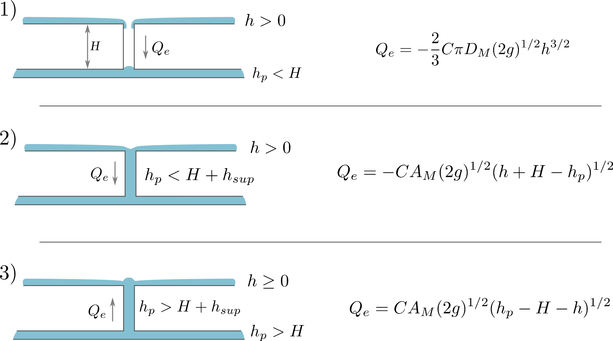
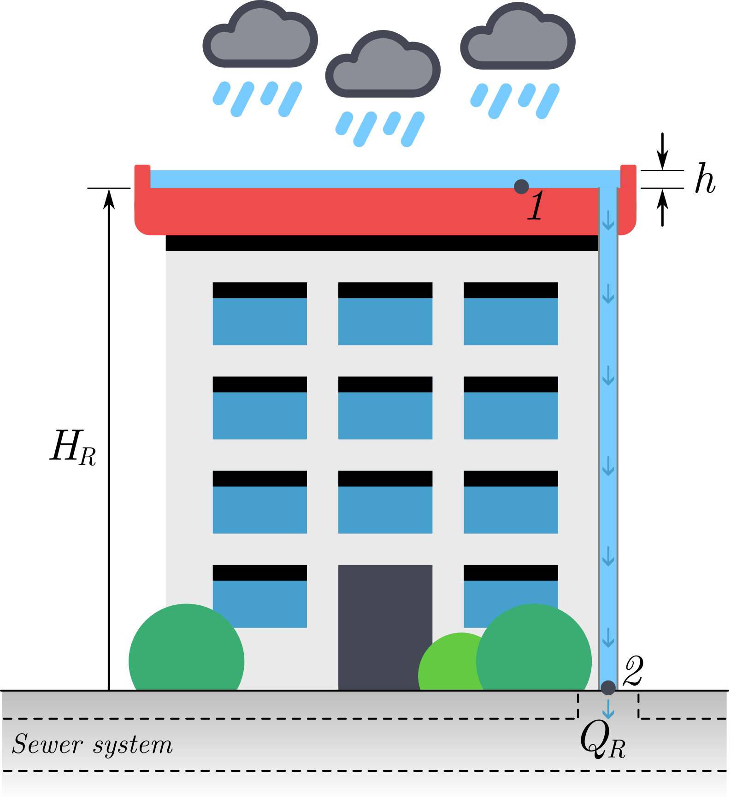

# Urban Drainage Model: UD 

Hydrologic and hydraulic modeling in urban environments has become an essential tool to predict, evaluate, and mitigate the effects of storm events due to the insufficiency of drainage networks. When this occurs, water overflows to the surface at the linking elements, manholes or storage wells. The surface flow numerical simulation by means of distributed models provides a detailed assessment of the spatial variations of the hydraulic variables such as flow velocity and water depths. This is of special importance in abrupt and irregular topographies or in urban areas where the buildings greatly affect the flow distribution.

The RiverFlow2D UD module integrates the extensive surface water capabilities of RiverFlow2D with the industry standard SWMM open-source storm drain model developed by the the Environmental Protection Agency in the USA. SWMM contains a flexible set of hydraulic modeling capabilities used to route runoff and external inflows through the drainage network of conduits. Further details on this models can be found in Rossman (2015) and Rossman (2017).

A key point in the surface-drainage model coupling is the interaction between models (Leandro (2016), Rubinato (2017)). The methodology adopted in RiverFlow2D ensures a perfect mass conservation for the full (surface and storm drain) computational domain by means of the water exchange computation depending on the hydraulic conditions at every time step.

The coupling between the RiverFlow2D 2D Shallow Water overland flow model and the SWMM 5.1 storm sewer model is able to deal with transient conditions in both domains, works with flexible triangular meshes.

## 1D pipe flow model

In this work, pipe flow routing is modeled by means of the routing portion of SWMM 5.1 software (Rossman (2017)), which transports the surface inflows through a user-designed system of pipes conforming a network of links connected together at nodes. The routing of the water flow is governed by the 1D St. Venant equations of conservation of mass and momentum:

$$\frac{\partial A}{\partial t}-
    \frac{\partial Q}{\partial x}=
    q_e$$

$$\frac{1}{A}\frac{\partial Q}{\partial t}+
    \frac{1}{A}\frac{\partial}{\partial x}\left(\frac{Q^2}{A}\right)+
    g\frac{\partial h_p}{\partial x}-
    g\left(S_0-S_f\right)=0$$

where $A$ is the flow cross-sectional area, $Q$ is the flow rate, $h_p$ is the conduit water depth and $q_e$ if the exchange discharge $f_M$ per unit length.

The solution method for and involves a finite-difference discretization with an implicit backwards Euler method in order to provide additional numerical stability (Rossman (2017)).

## Water exchange between RiverFlow2D and SWMM models

Several situations regarding the flow exchange between the surface flow and the storm water system can take place. Figure displays all the possible scenarios: 1) Inflow into non-pressurized sewer, 2) Inflow into pressurized sewer, 3). Outflow over floodplain (wet or dry). Every time step, an internal algorithm compares the values of the surface water depth ($h$), pressure head in the pipe ($h_p$) and the distance between flume bottom and the invert level of the sewer ($H=z+(z_p+H_{max})$), in order to adequately estimate the exchange discharge in terms of the diameter of the manhole $D_M$, area of the manhole $A_M$, and a coefficient $C$ which accounts for the energy losses at the manhole. The particular form used to formulate the exchange discharge $Q_e$ follows closely the formulation suggested in Rubinato et al. (2017).

{ width=100% }

To ensure an efficient and volume conservative link between RiverFlow2D and SWMM, the RiverFlow2D time step will always govern the temporal advance of the simulation.

## Rooftop Tool

This tool allows connecting all the cells over an exchange polygon such as a rooftop to an SWMM manhole. The cells will not exchange flow with the other cells on the mesh and will only receive water from rainfall or a source. This section describes a basic procedure to estimate the water flowrate through the drainpipe that channels rainwater from the rooftop to the street level (see Figure ). Such systems are common in urban buildings and play a crucial role in stormwater drainage. Accurate estimation of flow within these pipes is important not only for ensuring efficient water evacuation, but also for the proper sizing of components, prevention of overflow, and structural damage.

{ width=40% }

The approach presented here is based on fundamental principles of fluid mechanics. The analysis begins with the application of the energy equation between points 1 and 2, which relates the various forms of energy present in a fluid flow system. By making appropriate simplifications, such as assuming steady flow, negligible pressure differences, and a known vertical height difference $H_R$, we can reduce the problem to a solvable form. Frictional and local losses are grouped into a single coefficient $K_T$:

$$\left(\frac{p}{\rho g}+\frac{v^2}{2 g}+z\right)_1-\left(\frac{p}{\rho g}+\frac{v^2}{2 g}+z\right)_2=-K_T Q_R^2$$

where $p$ is the pressure, $v$ is the water velocity, $Q_R$ is the water flowrate through the roof pipe, $\rho$ is the water density, $g$ is the acceleration due to gravity and $z$ is the elevation.

$K_T$ is a dimensional loss coefficient considered as a required user data. It can be approximated as a function of material, length and diameter the connecting pipe as follows:

$$K_T = f L/D \left(\frac{1}{2 g A^{2}}\right)$$

Where $D$ is the pipe diameter, $A$ is the pipe cross section area and $f$ is the friction coefficient according to the Moody diagram.

The assumptions for simplification are:

- The pressure at both the inlet and the outlet is atmospheric ($p_{atm}$). Hence, $p_1=p_{atm}$ and $p_2=p_{atm}+\rho g h$, being $h$ the instant water depth over the rooftop.
- The pipe flow is steady during the time-step, so $v_1=v_2$
- Elevation difference is the main flow driver.

Under these assumptions, the energy equation simplifies to:

$$h+H_R=-K_T Q_R^2$$

being and $H_R=z_2-z_1$ the height of the considered building.

Now the water flowrate is solved as

$$Q_R=\sqrt{\frac{H_R+h}{K_T}}$$

Once the water flowrate $Q_R$ through the drainpipe has been estimated using the method described above, it is introduced as an external inflow into a subsurface urban drainage model developed with SWMM Storm Water Management Model. In SWMM, such inflows are typically represented as external inflows at specific nodes within the sewer network. These nodes correspond to the locations where runoff from rooftops or other impervious surfaces enters the drainage system.
