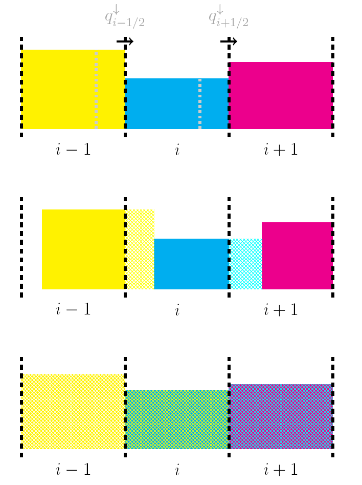
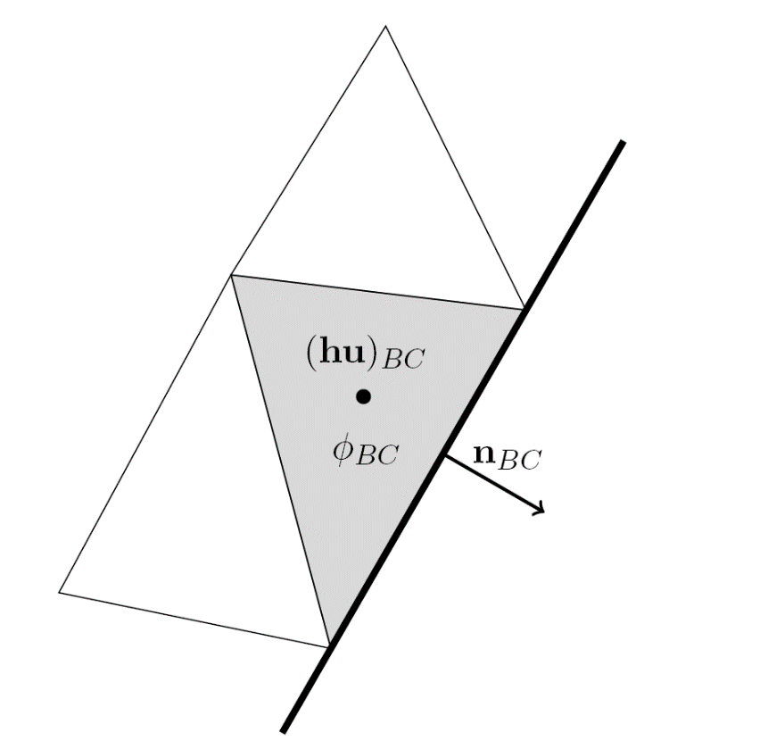
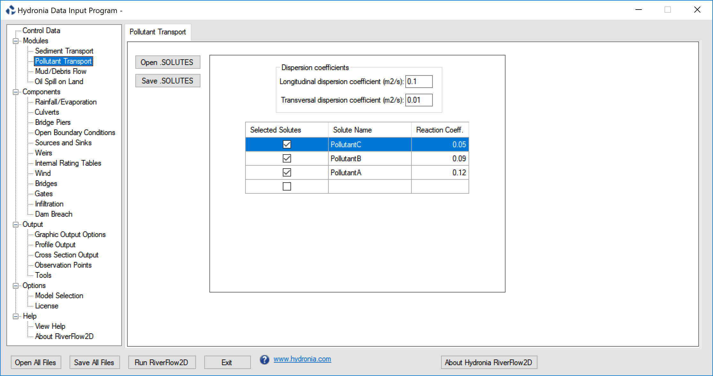

# Pollutant Transport Model: PL

The study of solute transport phenomena and river mixing has become a great concern in hydraulic and environmental problems. RiverFlow2D Pollutant Transport Model provides a tool to calculate concentrations of multiple pollutants in a variety of riverine and estuarine situations.

A solute or pollutant is defined as any substance that is advected by water and well mixed in the vertical direction. The interest of simulating pollutant transport is usually focused around determining the time evolution of a solute concentration within a complex hydrodynamic system, that is, given the solution concentration at a specific time and space, the model determines the spatial distribution of the solute concentrations at for future times. This physical process is accounted for the advection-dispersion equation and can incorporate the effect of reaction with the water and with other solutes

## Model Equations

Although RiverFlow2D PL can handle multiple pollutants simultaneously, for the sake of clarity in this section the transport of only one solute is presented coupled to the 2D model. The pollutant transport equations will be expressed in a conservative form, assuming that the velocities and the water depth may not vary smoothly in space and time.

Correspondingly, the 2D shallow water model with solute transport can be written in unique coupled system:

$$\frac{\partial \mathbf{U}}{\partial t}+\frac{\partial \mathbf{F} \mathbf{(U)}}{\partial x}+\frac{\partial \mathbf{G} \mathbf{(U)}}{\partial y}=\mathbf{H(U)} + \mathbf{R(U)} + \mathbf{D(U)}$$

where

$$\begin{array}{c}
    \mathbf{U}=\left( h ,   q_x ,   q_y ,   h\phi \right)^{T} \quad \\\\
    \mathbf{F}=\left(  q_x,  \frac {q_x2}{h} + \frac {1}{2} g h2 ,   \frac {q_x q_y}{h}  ,  h \phi u \right)^{T}, \qquad    
    \mathbf{G}=\left(  q_y, \      \frac {q_x q_y}{h}, \      \frac {q_y2}{h} + \frac {1}{2} g h2  , \  h \phi v  \right)^{T}   \\\\
    \mathbf{H}=\left(  0 , \;  g h (S_{0x}-S_{fx}) , \;    g h (S_{0y}-S_{fy}) , \; 0\right)^{T} \\
\end{array}$$

and $\phi$ is the depth-averaged solute concentration. The sources terms associated to the solute transport equation are expressed as follows:

$$\mathbf{R}=\left(  0 , 0,  0, -Kh\phi\right)^{T} \qquad \mathbf{D}=\left(  0 , 0,  0, \overrightarrow{\nabla}(D h \overrightarrow{\nabla} \phi) \right)^{T}$$

where $K$ is the uptake constant and $D$ is an empirical diffusion matrix.

## Pollutant Transport Finite-Volume Numerical Solution

In RiverFlow2D, the solute transport has been considered letting aside the consideration concerning diffusion terms. However many strategies such as splitting and computing separately the advection and the diffusion terms or solving the diffusion implicitly , have been developed to avoid small values in the time step size due to the combination of the CFL and Peclet number.

The numerical resolution of the solute transport equation under an explicit finite-volume method is frequently performed by solving the depth-averaged concentration apart from the shallow water equations, that is, using a simpler decoupled algorithm. Once the hydrodynamic equations have been solved, the corresponding substances or solutes are advected with these flow field previously computed.

In order to get a fully conservative method, RiverFlow2D considers the complete system including the hydrodynamic and the transport equations. Mathematically, the complete system conserves the hiperbolicity property, implying the existence of a $4 \times 4$ Jacobian matrix for the 2D model. On this basis we can apply the straightforward procedure described above, allowing a Roe's local linearization and expressing the contributions that arrive to the cell as a sum of waves. To ensure conservation and bounded values in the final solute concentration even in extreme cases, a conservative redistribution of the solute maximum fluxes as proposed in was implemented in RiverFlow2D.

According to , once the hydrodynamic part is properly formulated, a simple numerical flux $q^\downarrow$, directly related to the Roe's linearization, which is able to completely decouple the solute transport from the hydrodynamic system in a conservative way is used. Therefore,

$$q^\downarrow_{k} = q_i + \sum_{m=1}^3 \left(\widetilde{\lambda}^- \ \widetilde{\gamma} \ \widetilde{\mathbf{e}}_1 \right)^m_{k}$$

where $q_i=(h \mathbf{u n})_i$ and the decoupled numerical scheme for the solute transport equation is written as:

$$(h\phi)^{n+1}_{i} = (h\phi)^{n}_{i}  -   \frac{\Delta t   }{A_i  }   \sum_{k=1}^{N_E} ( q \phi)^{\downarrow}_{k} l_k$$

where

$$\phi^\downarrow_{k}=\left\{
\begin{array} {ccc}
- **\phi_{i}:** if; q_k^\downarrow > 0
- **\phi_{j}:** if; q_k^\downarrow < 0
\end{array}
\right.$$

in cell $i$. A sketch of the fluxes is showed in Figure.

From a physical point of view, the new solute mass at a fixed cell can be seen as exchanging water volumes with certain concentration through the neighboring walls and mixing them (finite-volume Godunov's type method) with the former mass existing in the previous time (Figure ). According to this philosophy, the outlet boundary cells will require a special treatment when applying this technique in order to extract the corresponding solute mass through the boundary walls. For this reason, it is necessary to define $q^{\downarrow}=\left(h\bf{u}\cdot\bf{n}\right)_{BC}$ and $\phi^{\downarrow}=\phi_{BC}$ at the boundary wall and to include this contribution for the updating of the boundary cell BC (see Figure ).

{ width=6cm }

{ width=6cm }

As shown, the formulation reduces to compute a class of numerical flux $q^{\downarrow}$ using the already computed averaged values at each edge. Apart from ensuring a perfect conservation and bounded free-oscillatory solutions (Murillo et al, 2012), this simple discretization decreases substantially the number of computations that would be necessary for the complete coupled system.

## Entering Data for the Pollutant Transport Model

To enter data for a pollutant transport simulation use the *Pollutant Transport* panel. Also make sure that the Pollutant Transport check box is active in thee Control Data tab.

{ width=100% }

## Assumptions of the Pollutant Transport Model

The main assumptions involved in the present version of RiverFlow2D model are:

1. There is no predetermined limit to the number of pollutants.
2. The pollutant concentration units are arbitrary. The user can use volume concentration, mg/l, ppt, ppm, or any other suitable units, provided that the inflow boundary conditions are consistent.
3. Interaction between solutes and between each solute and water are assumed to be first order reactions.
4. All inflow boundaries where either discharge or water elevation is imposed must provide a concentration time series for each pollutant.
