# Hydraulic and Hydrologic Components

RiverFlow2D components are internal boundary conditions that can be used to complement calculations that may not be directly handled using the 2D flow equations. Components can be specified on polygons, polylines or points, depending on the required data.\
The following components are set over polygons:

- **Rainfall and Evaporation:** accounts for spatially distributed rainfall and evaporation.
- **Infiltration:** accounts for infiltration losses.
- **Wind:** allows incorporating the effect of spatially distributed wind stress on the water surface.

The following hydraulic components are set over polylines (feature arcs):

- **Bridges:** account for general geometry bridges including pressure flow and overtopping.
- **Dam Breach:** accounts for internal dams or levees that can break.
- **Internal Rating Tables:** provide an internal relationship of water elevation and discharge.
- **Gates:** used to represent sluice gate structures.
- **Weirs:** represent crested structures such as weirs, levees, sound walls, etc., where there is a unique relationship between discharge and depth.

Hydraulic components that are entered on points are:

- **Bridge Piers:** account for pier drag forces in a simplified formulation.
- **Culverts:** one dimensional conveyance conduits where discharge can be calculated using equations for circular or box structures, and rating tables.
- **Sources and Sinks:** provide a mean to enter point inflows or outflows that may vary in time.

## Bridges Component

RiverFlow2D provides several options to integrate bridge hydraulics into the 2D mesh calculations. The most common option is to create the pier plan geometry generating a 2D triangular-cell mesh that represents each pier as a solid obstacle. In that case, the model will compute the flow around the pier and account for the pier drag. This would be the preferred approach when the user needs to know the detailed flow around the piers, but it does not account for pressure flow or overtopping conditions. In this option, the resulting mesh around piers has commonly very small cells which can lead to increased computer times.

The *Bridges* component is a comprehensive bridge hydraulics computation tool that does not require capturing bridge pier plan geometry in detail, therefore allowing longer time steps, while allowing calculating the bridge hydraulics accounting for arbitrary plan alignment, complex bridge geometry, free surface flow, pressure flow, overtopping, combined pressure flow and overtopping, and submergence all in 2D.

This component requires defining the bridge alignment in plan and the bridge geometry cross section. The bridge alignment is given in the data file which is generated by RiverFlow2D model based on the user defined data in DIP. To run a simulation with the bridges component, you need to select the option in the *Control Data* panel as shown in Figure.

{ width=100% }

The bridge plan data is entered in RiverFlow2D *Bridges* layer. To create a bridge, please consult the *Simulating bridges* tutorial in the Tutorials document.

!!! note

    There is no limit to the number of bridges that can be used.

### Bridge Geometry Data File

The bridge geometry cross section file is necessary to define the bridge cross section. It is defined by four polylines and the fined in five columns as follows:\
Line 1: Number of points defining polylines.

- **NP**

NP lines with these entries:

The relationship between the four polylines must be as follows:

- **For all stations, STATION(I) $\leq$ STATION(I+1)**
- **BEDELEV $\leq$ ZLOWER $\leq$ LOWCHORD $\leq$ DECKELEV**
- **In a given line all elevations correspond to the same station.**
- **The space between BEDELEV and ZLOWER is blocked to the flow.**
- **The space between ZLOWER and LOWCHORD is open to the flow.**
- **The space between LOWCHORD and DECKELEV is blocked to the flow.**

#### Example of the Bridge Cross Section File

The following table is an example one of the geometry file that schematically represents the bridge in.

- **BEDELEV:** R; -; m or ft; Bed elevation. Must be the lowest elevation for all polylines at a given point.
- **DECKELEV:** R; -; m or ft; Elevation of the bridge deck. Must be the highest elevation for all polylines at a given point.
- **LOWCHORD:** R; -; m or ft; Elevation of the lower bridge deck. LOWCHORD must be larger or equal to ZLOWER and smaller or equal to DECKELEV for a particular point. The space between LOWCHORD and DECELEV is an area blocked to the flow.
- **NP:** I; -; $>1$; Number of points defining cross section polylines.
- **STATION:** R; -; m or ft; Distance from leftmost point defining cross section polyline. All polylines points must have a common station.
- **ZLOWER:** R; -; m or ft; Elevation of lower polyline. ZLOWER must be larger or equal to BEDELEV and smaller or equal to LOWCHORD for a given point. The space between BEDELEV and ZLOWER is an area blocked to the flow. The space between ZLOWER and LOWCHORD is open to the flow. If the bridge has no holes, ZLOWER must be identical to BEDELEV.

### Bridge Calculations

To model bridges, the source term in the dynamic equation is split in three terms $\mathbf{S}=\mathbf{S}_z +\mathbf{S}_f+\mathbf{S}_b$. The term $\mathbf{S}_z$ defined as

$$\mathbf{S}_z=\left(  0 , \;   -gh\frac{\partial z } {\partial x   }   , \;-gh \frac{ \partial z } {\partial y }    \right)^{T}$$

expresses the variation of the pressure force along the bottom in the $x$ and $y$ direction respectively, formulated in terms of the bed slopes of the bottom level $z$. The term $\mathbf{S}_f$

$$\mathbf{S}_f=\left(  0 ,   - \frac{\tau_{f,x}} {\rho} ,   - \frac{\tau_{f,y}} {\rho}  \right)^{T}$$

involves the the bed shear stresses $\tau_{f,x},\tau_{f,y}$ in the $x$ and $y$ direction respectively, with ${\rho}$ the density of the fluid. The last term, $\mathbf{S}_b$ stands for local energy losses due to other processes

$$\mathbf{S}_b=\left(  0 , \;   -ghS _{b,x}   , -ghS _{b,y}     \right)^{T}$$

and is used to represent bridges.

The description of energy losses for the friction term associated to the bed stress in equation is commonly formulated as an extension of a 1D formulation. The same approach is applied in RiverFlow2D deriving 1D closure relations for the definition of the bridge source term. Note that although the terms $S_{b,x}$ and $S_{b,y}$ represent energy losses in the presence of bridges, they are actually acting as a momentum sink. Empirical models for the energy loss caused by the bridge are described next.

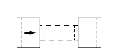

#### Energy dissipation in bridges

The formulation of Borda-Carnot for energy loss in sudden contractions or expansions in pipes can also be used for channels. This in turn can model bridges with free water surface. The energy loss will be expressed in terms of the total available head $\Delta H_{\text{BC}}$, and represents the total mechanical energy of the flow. In a 1D framework the head loss $\Delta H_{\text{BC}}$ is expressed as follows

$$\Delta H _{BC} = \left(\Delta H_{c}+\Delta H_{e}\right)$$

where $\Delta H_{c}$ and $\Delta H_{e}$ are the contraction and expansion losses respectively

$$\begin{array}{rcl}
      \Delta H_{c}&=& \frac{\bar{v}_1^2}{2g} \left[ \left( \frac{1}{m} -1 \right)^2+\frac{1}{9}\right] \left( \frac{A_1}{A_2} \right)^2 \\
 \Delta H_{e}&=& \frac{\bar{v}_4^2}{2g} \left[ \left( \frac{A_4}{A_3} -1 \right)^2+\frac{1}{9}\right] \\ 
  \end{array}$$

where $m$ is a typical value for the contraction coefficient, $m=0.62$ and the areas $A_1$ to $A_4$ refer to effective cross sectional flow area. The numbering of areas is shown in Figures. Area 1 is a section upstream of the bridge while area 4 is a downstream section. Areas 2 and 3 are sections inside the bridge, near the entrance and exit respectively.

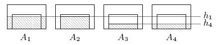

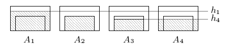

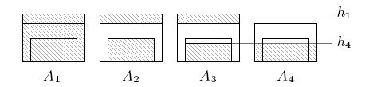

The values $\bar{v}_1$ and $\bar{v}_4$ are the cross sectional averaged velocities

$$\bar{v}_1=\frac{Q_1}{A_1(d_1)}, \qquad \bar{v}_4=\frac{Q_4}{A_4(d_4)}$$

with $Q_1$ and $Q_4$ the total discharges in areas $A_1$ and $A_4$, expressed as a function of the water surface elevation, $d=h+z$. Different regimes can be described. Figure shows a sketch of the areas considered in the free surface case, Figure shows the equivalent areas for partially submerged bridges and Figure for fully submerged bridges.

#### Integration of the energy losses generated by bridges

The unified formulation of the source terms accounting for energy losses generated by bridges also ensures the well balanced property in steady cases with velocity. In order to do that it is necessary to define $\mathbf{S_n}_b$ at the edge of the RP where the bridge exists. The source term $\mathbf{S_n}_b$ is formulated as

$$(\mathbf{S_n}_b )_{k} = \left( \begin{array}{c}
      0 \\
     - g\widetilde{h }  \;  \delta H  n_x  \\     
     - g\widetilde{h }  \;  \delta H  n_y  \\     
    \end{array}\right)_{k}$$

with

$$\delta H=\Delta H  \frac{   \mathbf{\widetilde{u}n}    }{  \vert \mathbf{\widetilde{u}\cdot n}  \vert  }$$

where $\Delta H$ is the singular loss term used to represent bridges. Computation of $\Delta H$ in a real mesh is done as follows. The bridge is defined on cell edges (bold line in Figure ), and the cells on both sides of these edges are considered to form two cross sections $\Gamma_L$ and $\Gamma_R$ (hatched cells in Figure ). Note that it is possible to define bridges in arbitrary orientations and in structured/unstructured meshes.

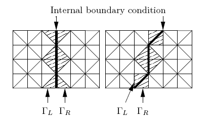

In each time step, the necessary variables for the calculation of the global bridge head loss are averaged from the cells in both upstream and downstream sections as illustrated in Figure. The discharge is computed as

$$Q_{\Gamma_L}= \sum_{k \in  \Gamma_L } (\mathbf{q n})_{k} l_k  \qquad Q_{\Gamma_R}=\sum_{k \in \Gamma_R}  (\mathbf{q n})_{  k} l_k$$

and the cross sectional average water level surface is estimated as

$$d_{\Gamma_L}= \frac {\sum_{ k \in \Gamma_L}   d_k  l_k  }{\sum_{k \in \Gamma_L}  l_k} \qquad d_{\Gamma_R}= \frac {\sum_{ k \in \Gamma_R } d_k  l_k }{\sum_{k \in \Gamma_R}  l_k }$$

involving cells with values of $h>0$. The signs of $Q_{\Gamma_L}$ and $Q_{\Gamma_R}$ are used to determine which section is upstream and which downstream. If $Q_{\Gamma_L}\ge0$, the discharge across the bridge is computed as $Q=Q_{\Gamma_L}$ and the areas are computed using $d_{1}=d_{\Gamma_L}$ and $d_{4}=d_{\Gamma_R}$. In case that $Q_{\Gamma_L}<0$, the discharge across the bridge is computed as $Q=Q_{\Gamma_R}$ and the sections are reversed setting $d_{1}=d_{\Gamma_R}$ and $d_{4}=d_{\Gamma_L}$. Next, the different areas and the cross-sectional top width are calculated as a function of the average water level surface. From these values the total head loss $\Delta_H$ can be evaluated.

#### Influence of the Bridge Width

The computation algorithm used in the Bridges component neglects the effect of the structure width (distance perpendicular to the bridge alignment) on the head loss. According to and , the bridge width has a small influence on the flow variables such as water surface elevation and energy loss. Yarnell performed experiments in a laboratory flume with bridges having rectangular piers with width-to-length ratios (*w*:*l*) of 1:4, 1:7 and 1:13, where *w* is the pier dimension perpendicular to the flow direction and *l* the pier length parallel to the flow. Yarnell noted that the energy loss increased less than 10% for the configuration with longest piers. performed numerical simulations to confirm Yarnell's experiments using piers with the same with-to-length ratios and a wide range of approach discharges (see Figure ).

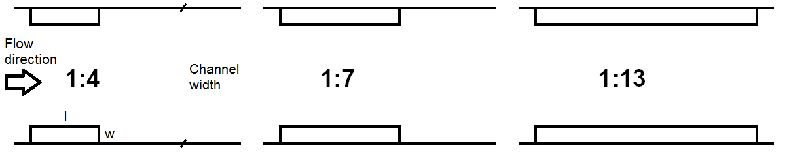

Numerical results indicate that the changes in total head loss across the structure are very similar for the three configurations (see Figure ).

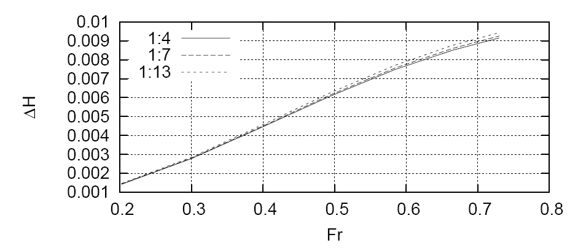

## Bridge Piers

The Bridge Piers component allows accounting for the losses caused by piers in the flow field in a simplified way, without requiring a refined mesh around the actual pier plan geometry.

To run a simulation with the *Bridge Piers* Component, you need to select the option in the *Control Data* panel of DIP as shown in Figure.

{ width=100% }

!!! note

    There is no limit to the number of Bridge Piers that can be used.

### Bridge Pier Calculation

The Bridge Pier component can be used when the pier plan area is small compared to the cell area and there is no need to determine the details of the flow field around the structure. In this component the model computes the drag force on each pier as a function of the drag coefficient, water density, flow velocity and wetted pier projected area as shown in Eq. :

$$F_D=\frac{1}{2}C_D\rho U^2 A_P$$

Where $C_D$ is the pier drag coefficient, $\rho$ is the water density, $U$ is the water velocity, and $A_P$ is the pier wet area projected normal to the flow direction. Piers are assumed to be located on cells that not necessarily conform to the pier geometry as shown on the following figure.

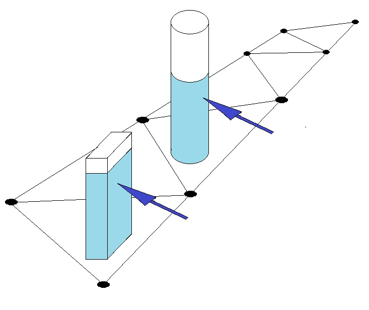{ width=50% }

Piers can be circular or rectangular in plan. Rectangular piers are located on cells based on the pier center coordinates and the angle between the axis along the largest dimension and the X-axis as shown in the following figure.

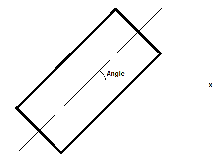

To represent circular piers enter the with and length equal to the pier diameter and the corresponding drag coefficient.

Velocity vector magnitude and approach angle usually varies in time during unsteady flow computations and is used to calculate the projected area. To account for the resistance force that the pier exerts on the flow, RiverFlow2D converts it to the distributed shear stress on the cell where the pier centroid coordinate is located. The resulting pier shear stress expressions in x and y directions are as follows:

$$\tau_{px}=\frac{1}{2}C_D\rho U\sqrt{U^2+V^2}\frac{A_P}{A_e}$$ $$\tau_{py}=\frac{1}{2}C_D\rho V\sqrt{U^2+V^2}\frac{A_P}{A_e}$$

where $A_e$ is the cell area.

## Culverts Component

The culvert component in RiverFlow2D allows incorporating 1D hydraulic structures that convey water between two locations on the mesh, or between a point on the mesh an another outside.

To run a simulation with the Culverts Component, you need to select the option in the *Control Data* panel of DIP dialog as shown in Figure.

{ width=100% }

There are two options to compute culvert discharge in RiverFlow2D. When the user selects Rating Table calculation and provides a rating table on the associated file, the model determines the discharge by interpolation as a function of the depth upstream. If the user enters Culvert calculation using culvert characteristics, the model will calculate the discharge based on the culvert geometric characteristics given in the file. Both procedures are described in more detail below.\

!!! note

    There is no limit to the number of culverts that can be used.

### Culvert Calculation using a Rating Table (CulvertType = 0)

When the user provides a rating table, the culvert calculation algorithm is as follows:

1. If at least one of the culvert ends is wet, determine the flow direction based on the water surface elevations at each culvert end,
2. Interpolate flow discharge from the rating table using the depth at the culvert inlet,
3. If depth at the culvert inlet is lower than minimum value in the rating table, then the discharge is assumed to be zero.
4. If depth at entrance is higher than maximum value in the rating table, then the discharge is assumed to be equal to that of the maximum depth.
5. The computed discharge is subtracted from the inlet cell and added to the outlet cell assuming instantaneous water volume transmission.

### Culvert Calculation using Culvert Characteristics (CulvertType = 1,2)

For CulvertType's 1 and 2, the model will calculate culvert discharge for inlet and outlet control using the FHWA procedure (Norman et al. 1985). Later Froehlich (2003) restated the algorithm in dimensionless form. The resulting formula is expressed as follows:

$$Q=N_b C_c A_c\sqrt{2 g H_c}$$

where $N_b$ is the number of identical barrels, $C_c$ is a discharge coefficient that depends on the flow control and culvert geometric characteristics, $A_c$ is the culvert area at full section, $g$ is the gravitational acceleration, $H_c = WSEL_h - Z_{bi}$ for inlet control and $H_c = WSEL_h - WSE_{tw}$ for outlet control, $WSEL_h$ is the water surface elevation at the culvert inlet, $Z_{bi}$ is the inlet invert elevation, $WSE_{tw}$ is the water elevation downstream (tailwater). For inlet control calculation,

$$C_c= Min \left \{ \begin{matrix}{ \sqrt{\frac{1-\frac{D_c}{H_h}\left(Y+m S_0\right)}{2 c'}} } \\
\frac{1}{\sqrt{2}K'^(1/M)}\left(\frac{H_h}{D_c}\right)^{\left(\frac{1}{M}-0.5\right)} \end{matrix} \right.$$

where $H_h = WSEL_h - Z_{bi}$ is the headwater depth. $D_c$ is the culvert diameter for circular culverts and the hight dimension for box culverts, $m = 0.7$ for mitered inlets and $m = -0.5$ for all other inlets. For outlet control, the following formula is used to determine $C_c$:

$$C_c=\left(1+K_e+\frac{2 g n_c^2 L_c}{R_c^{4/3}}\right)^{-0.5}$$

where $R_c$ is the culvert hydraulic radius, $K_e$ is the entrance loss coefficient that can be obtained from Table , $n_c$ is the Manning's $n$ obtained from Table , $L_c$ is the culvert length, and $Y$, $K'$, $M$, $c'$ are inlet control coefficients (see Table ).

- **Concrete:** Good joints, smooth walls; 0.012
- **Projecting from fill, square-cut end:** 0.015
- **Poor joints, rough walls:** 0.017
- **Corrugated metal:** 2-2/3 inch $\times$ 1/2 inch corrugations; 0.025
- **6 inch $\times$ 1 inch corrugations:** 0.024
- **5 inch $\times$ 1 inch corrugations:** 0.026
- **3 inch $\times$ 1 inch corrugations:** 0.028
- **6 inch $\times$ 2 inch corrugations:** 0.034
- **9 inch $\times$ 2-1/2 inch corrugations:** 0.035

- **Concrete pipe:** Projecting from fill, grooved end; 0.2
- **Projecting from fill, square-cut end:** 0.5
- Headwall or headwall with wingwalls (concrete or cement sandbags)
- **Grooved pipe end:** 0.2
- **Square-cut pipe end:** 0.5
- **Rounded pipe end:** 0.1
- **Mitered end that conforms to embankment slope:** 0.7
- Manufactured end section of metal or concrete that conforms to embankment slope
- **Without grate:** 0.5
- **With grate:** 0.7
- **Corrugated metal pipe or pipe-arch:** Projecting from embankment (no headwall); 0.9
- **Headwall with or without wingwalls (concrete or cement sandbags):** 0.5
- **Mitered end that conforms to embankment slope:** 0.7
- Manufactured end section of metal or concrete that conforms to embankment slope
- **Without grate:** 0.5
- **With grate:** 0.7
- **Reinforced concrete box:** Headwall parallel to embankment (no wingwalls) &
- **Square-edged on three sides:** 0.5
- **Rounded on three sides to radius of 1/12 of barrel dimension:** 0.2
- Wingwalls at 30$^\circ$ to 75$^\circ$ to barrel
- **Square-edged at crown:** 0.4
- **Crown edge rounded to radius of 1/12 of barrel dimension:** 0.2
- Wingwalls at 10$^\circ$ to 30$^\circ$ to barrel
- **Square-edged at crown:** 0.5
- Wingwalls parallel to embankment
- **Square-edged at crown:** 0.7

- **Concrete:** Circular; Headwall; square edge; 0.3153; 2.0000; 1.2804; 0.6700
- **Concrete:** Circular; Headwall; grooved edge; 0.2509; 2.0000; 0.9394; 0.7400
- **Concrete:** Circular; Projecting; grooved edge; 0.1448; 2.0000; 1.0198; 0.6900
- **Cor. metal:** Circular; Headwall; 0.2509; 2.0000; 1.2192; 0.6900
- **Cor. metal:** Circular; Mitered to slope; 0.2112; 1.3300; 1.4895; 0.7500
- **Cor. metal:** Circular; Projecting; 0.4593; 1.5000; 1.7790; 0.5400
- **Concrete:** Circular; Beveled ring; 45$^{\circ}$bevels; 0.1379; 2.5000; 0.9651; 0.7400
- **Concrete:** Circular; Beveled ring; 33.7$^{\circ}$bevels; 0.1379; 2.5000; 0.7817; 0.8300
- **Concrete:** Rectangular; Wingwalls; 30$^{\circ}$to 75$^{\circ}$flares; square edge; 0.1475; 1.0000; 1.2385; 0.8100
- **Concrete:** Rectangular; Wingwalls; 90$^{\circ}$and 15$^{\circ}$flares; square edge; 0.2242; 0.7500; 1.2868; 0.8000
- **Concrete:** Rectangular; Wingwalls; 0$^{\circ}$flares; square edge; 0.2242; 0.7500; 1.3608; 0.8200
- **Concrete:** Rectangular; Wingwalls; 45$^{\circ}$flare; beveled edge; 1.6230; 0.6670; 0.9941; 0.8000
- **Concrete:** Rectangular; Wingwalls; 18$^{\circ}$to 33.7$^{\circ}$flare; beveled edge; 1.5466; 0.6670; 0.8010; 0.8300
- **Concrete:** Rectangular; Headwall; 3/4 inch chamfers; 1.6389; 0.6670; 1.2064; 0.7900
- **Concrete:** Rectangular; Headwall; 45$^{\circ}$bevels; 1.5752; 0.6670; 1.0101; 0.8200
- **Concrete:** Rectangular; Headwall; 33.7$^{\circ}$bevels; 1.5466; 0.6670; 0.8107; 0.8650
- **Concrete:** Rectangular; Headwall; 45$^{\circ}$skew; 3/4 in chamfers; 1.6611; 0.6670; 1.2932; 0.7300
- **Concrete:** Rectangular; Headwall; 30$^{\circ}$skew; 3/4 in chamfers; 1.6961; 0.6670; 1.3672; 0.7050
- **Concrete:** Rectangular; Headwall; 15$^{\circ}$skew; 3/4 in chamfers; .7343; 0.6670; 1.4493; 0.6800
- **Concrete:** Rectangular; Headwall; 10-45$^{\circ}$ skew; 45$^{\circ}$bevels; 1.5848; 0.6670; 1.0520; 0.7500
- **Concrete:** Rectangular; Wingwalls; non-offset 45$^{\circ}$/flares;; 1.5816; 0.6670; 1.0906; 0.8030
- **Concrete:** Rectangular; Wingwalls; non-offset 18.4$^{\circ}$/flares; 3/4 in chamfers; 1.5689; 0.6670; 1.1613; 0.8060
- **Concrete:** Rectangular; Wingwalls; non-offset 18.4$^{\circ}$/flares; 30$^{\circ}$/skewed barrel; 1.5752; 0.6670; 1.2418; 0.7100
- **Concrete:** Rectangular; Wingwalls; offset 45$^{\circ}$/flares; beveled top edge; 1.5816; 0.6670; 0.9715; 0.8350
- **Concrete:** Rectangular; Wingwalls; offset 33.7$^{\circ}$/flares; beveled top edge; 1.5752; 0.6670; 0.8107; 0.8810
- **Concrete:** Rectangular; Wingwalls; offset 18.4$^{\circ}$/flares; top edge bevel; 1.5689; 0.6670; 0.7303; 0.8870
- **Cor. metal:** Rectangular; Headwall; 0.2670; 2.0000; 1.2192; 0.6900
- **Cor. metal:** Rectangular; Projecting; thick wall; 0.3023; 1.7500; 1.3479; 0.6400
- **Cor. metal:** Rectangular; Projecting; thin wall; 0.4593; 1.5000; 1.5956; 0.5700
- **Concrete:** Circular; Tapered throat; 1.3991; 0.5550; 0.6305; 0.8900
- **Cor. metal:** Circular; Tapered throat; 1.5760; 0.6400; 0.9297; 0.9000
- **Concrete:** Rectangular; Tapered throat; 1.5116; 0.6670; 0.5758; 0.9700
- **Concrete:** Circular; Headwall; square edge; 0.3153; 2.0000; 1.2804; 0.6700
- **Concrete:** Circular; Headwall; grooved edge; 0.2509; 2.0000; 0.9394; 0.7400
- **Concrete:** Circular; Projecting; grooved edge; 0.1448; 2.0000; 1.0198; 0.6900
- **Cor. metal:** Circular; Headwall; 0.2509; 2.0000; 1.2192; 0.6900
- **Cor. metal:** Circular; Mitered to slope; 0.2112; 1.3300; 1.4895; 0.7500
- **Cor. metal:** Circular; Projecting; 0.4593; 1.5000; 1.7790; 0.5400
- **Concrete:** Circular; Beveled ring; 45$^{\circ}$bevels; 0.1379; 2.5000; 0.9651; 0.7400
- **Concrete:** Circular; Beveled ring; 33.7$^{\circ}$bevels; 0.1379; 2.5000; 0.7817; 0.8300
- **Concrete:** Rectangular; Wingwalls; 30$^{\circ}$to75$^{\circ}$flares; square edge; 0.1475; 1.0000; 1.2385; 0.8100
- **Concrete:** Rectangular; Wingwalls; 90$^{\circ}$and 15$^{\circ}$flares; square edge; 0.2242; 0.7500; 1.2868; 0.8000
- **Concrete:** Rectangular; Wingwalls; 0$^{\circ}$flares; square edge; 0.2242; 0.7500; 1.3608; 0.8200
- **Concrete:** Rectangular; Wingwalls; 45$^{\circ}$flare; beveled edge; 1.6230; 0.6670; 0.9941; 0.8000
- **Concrete:** Rectangular; Wingwalls; 18$^{\circ}$to 33.7$^{\circ}$flare; beveled edge 1.5466; 0.6670; 0.8010; 0.8300
- **Concrete:** Rectangular; Headwall; 3/4 inch chamfers; 1.6389; 0.6670; 1.2064; 0.7900
- **Concrete:** Rectangular; Headwall; 45$^{\circ}$bevels; 1.5752; 0.6670; 1.0101; 0.8200

cp7cm

- **:** End of the culvert barrel projects out of the embankment.
- **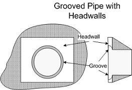:** Grooved pipe for concrete culverts decreases energy losses through the culvert entrance.
- **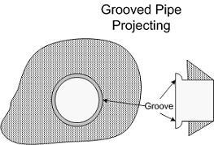:** This option is for concrete pipe culverts.
- **:** Square edge with headwall is an entrance condition where the culvert entrance is flush with the headwall.
- **:** 'Beveled edges' is a tapered inlet edge that decreases head loss as flow enters the culvert barrel.
- **:** Mitered entrance is when the culvert barrel is cut so it is flush with the embankment slope.
- **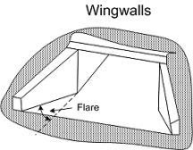:** Wingwalls are used when the culvert is shorter than the embankment and prevents embankment material from falling into the culvert

The culvert computation algorithm works as follows:

1. If at least one of the culvert ends is wet, Determine the flow direction based on the water surface elevations at each culvert end.
2. Compute the culvert discharge using inlet control formulas.
3. Compute the culvert discharge using outlet control formulas.
4. Select the minimum discharge from the inlet and outlet control discharges.
5. If depth at the culvert inlet is lower than minimum value in the rating table, then the discharge is assumed to be zero.
6. The computed discharge is subtracted from the inlet cell and added to the outlet cell assuming instantaneous water volume transmission.

!!! note

    When using CulvertType 1 or 2, both ends of the culvert must be inside the mesh.

### Assumptions of Culvert Calculations

1. The same rating table will be used to interpolate discharge regardless of the flow direction. In other words, if the flow is from cell A to cell B at some point during the simulation, depth at A will be used to interpolate discharge from A to B, but if at some other time flow changes from B to A, discharge will be interpolated using depth at B.
2. There is no outlet control on the rating table discharge calculation.
3. When using CulvertTypes 1 and 2, both ends of the culvert must be inside the mesh. It is not allowed to extract flow from the modeling domain when using these options.
4. Discharge calculation with CulverTypes 1 and 2 is only available for circular or box (rectangular) cross section culverts.
5. The entrance to a culvert is regarded as submerged when the head water depth, H, 1.2D, where D is the diameter of the circular culvert or the height of box culverts.

### Culvert Multiple-Cell Volume Exchange Tool in QGIS

The purpose of this option is to increase the number of computational cells involved in the volume exchange between the inlet and outlet. Expanding the selection of cells typically results in a smoother and more stable volume-transfer process effectively reducing oscillations while maintaining accurate computation of exchange discharges.

Using this option, the inlet water elevation is calculated as the average across all wet cells contained within the defined polygon. If the exchange volume for a given time step exceeds the available volume in the inlet cell, the additional volume is drawn from the surrounding cells within the polygon. The primary impact of the new multiple-cell method is the prevention of inlet-cell drying. This significantly reduces the oscillations that commonly occurred when only a single inlet cell was used.

This section describes the tool used to generate and edit polygons for culvert types that rely on multiple cells for volume exchange. The tool automates the creation of inlet and outlet polygons and provides functions to adjust their orientation and size.

#### Overview

For culverts with BCType = 11, 12, 14, and 15, the modeling framework requires defining inlet and outlet polygons to specify the grid cells involved in the volume-exchange process. To facilitate this, the software includes a dedicated tool that generates a layer called CulvertsPolygon, containing predefined trapezoidal polygons located at each culvert's entrance and exit.

Before using this tool, ensure that the Culverts layer has been added to the project and that all culvert alignments have been properly drawn.

#### Creating the CulvertsPolygon Layer

Follow the steps below to create the CulvertsPolygon layer:

1. In the Layers panel, right-click the Culverts layer.
2. Select Hydronia Tools from the context menu.
3. Click Create CulvertPolygon.

    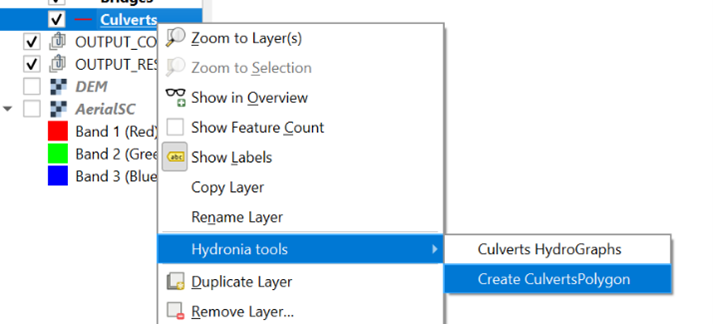

After completion, a new layer named CulvertsPolygon will be added to the project. This layer automatically contains a pair of trapezoidal polygons - one at the inlet and one at the outlet of each culvert. These polygons represent the areas used for identifying neighboring cells.

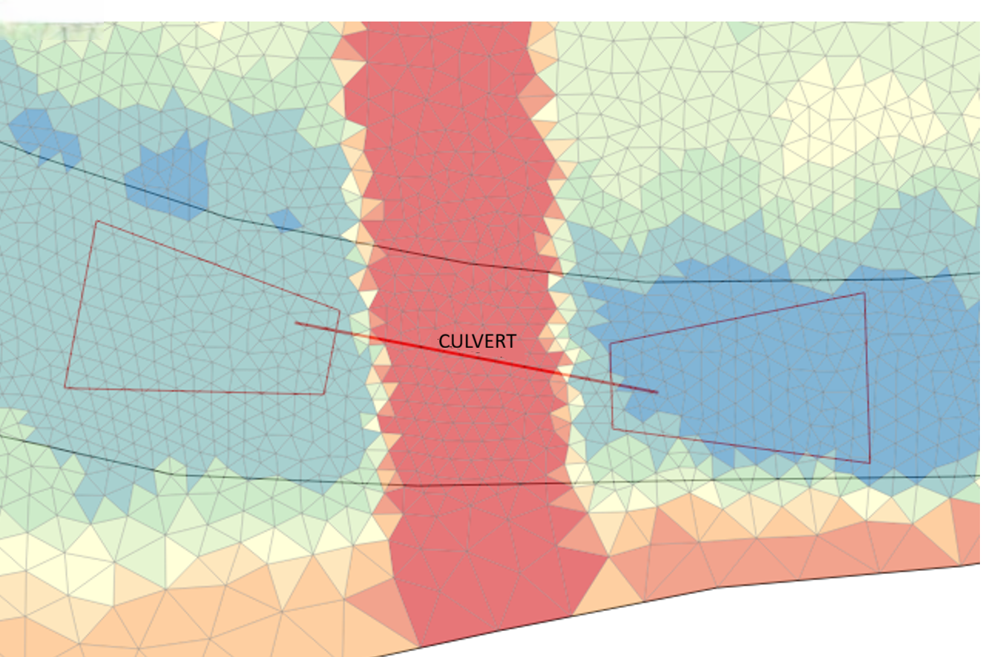{ width=7.8cm }

#### Editing the CulvertsPolygon Layer

The polygons generated by the tool may require adjustment to better match the culvert geometry or local topography. The following tools and procedures are available for polygon editing.

**Adjusting Polygon Orientation and Position**

To modify the alignment of the polygons:

1. Activate the Advanced Digitizing toolbar.
2. Switch the CulvertsPolygon layer to editing mode.
3. Use the following tools to make the necessary adjustments.

    - Rotate Object: Rotates the polygon around its centroid or a selected reference point.
    - Move Object: Translates the polygon to a new position without altering its shape.
    - To adjust the polygons' vertices, activate the vertex tool 

These tools allow you to align the polygons with the culvert axis accurately.

**Adjusting Polygon Size**

To modify the dimensions of the polygons:

1. Activate the Node Tool.
2. Select the polygon to be edited.
3. Drag the individual nodes or vertices to reshape or resize the polygon.

Adjusting polygon size ensures proper coverage of the neighboring cells used for flow exchange.

#### Notes and Recommendations

- Always verify that polygons align correctly with the culvert and fully cover the intended computational cells.
- After editing, remember to save the layer's edits before proceeding with the setup.
- Avoid excessive stretching or distortion of polygons, as this may affect model behavior.

## Gates Component

The GATES components allows integrating gates inside the modeling region. Each gate needs to be defined in terms of its plan alignment, crest elevation ($Zc$), gate height ($Hgate$) and the time history of apertures ($Ha$) given as a table in a file associated to each structure (see Figure ). Figure shows the flow modes that can be calculated through gates that include submergence and overtopping.

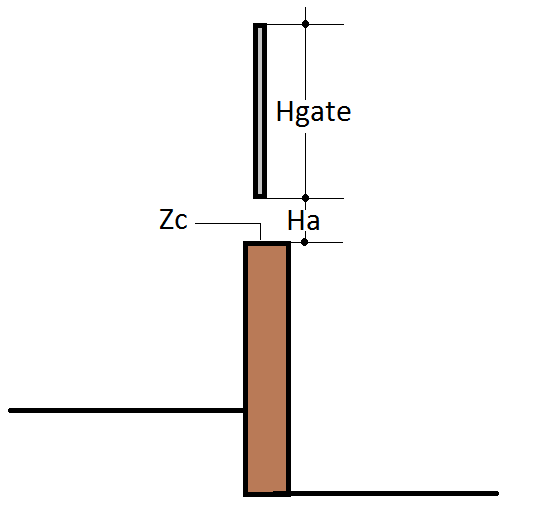{ width=3.8cm }

<figure>

   
  

<figcaption>Flow modes across gates.</figcaption>
</figure>

To run a simulation with the gates component, you need to select the option in the *Control Data* panel of DIP as shown in Figure.

{ width=90% }

The gate plan data is entered in the QGIS Gates layer.

Since the gate polyline must pass through nodes, it is essential that the mesh generation engine creates nodes along the polyline. This is easily done recreating the mesh.\

!!! note

    There is no limit to the number of gates that can be used.

### Gate Calculations

The gate is simulated by assuming that the discharge per unit breadth $q$ crossing the gate is governed by the difference between the water surface level ($d=h+z$) on both sides of the gate, referred to as $d_l$ upstream of the gate and $d_r$ downstream of the gate, and by the allowable gate opening, $G_o$. Several situations are envisaged. In the case that $G_o=0$ the gate behaves as a solid wall and no flow crosses the gate. When the gate opening is larger than the surface water level on both sides, it no longer influences the flow. In any other case, assuming that $d_l<d_r$, without loss of generality, two different flow situations can occur depending on the relative values of $G_o$, $z_l$, $z_r$, $d_l$ and $d_r$. When $G_o+max(z_l, z_r)<min(d_l, d_r)$, Figure , the discharge is given by

$$q= G_o K_1 (d_r-d_l)^{1/2}$$

with $K_1$ an energy loss coefficient. In RiverFlow2D $K_1$=3.33 .\
When $G_o+max(z_l, z_r)>min(d_l, d_r)$, Figure , the discharge is given by

$$q= C_d (2/3) \sqrt{2g} \left[d_r-max(z_l, z_r)\right]^{1/2}$$

with $C_d$ being the non-dimensional discharge coefficient that takes values around 0.6.

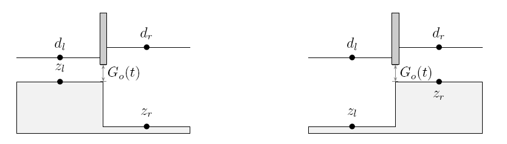{ width=80% }

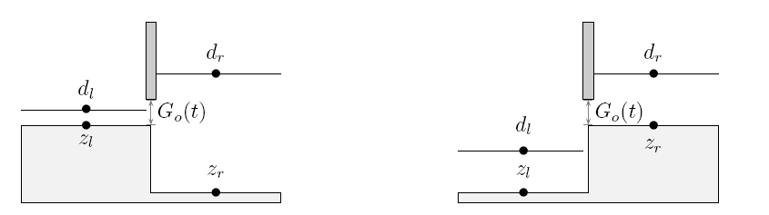{ width=80% }

## Rainfall and Evaporation

This section and the following about infiltration describe the hydrologic computations implemented in RiverFlow2D. The component includes capabilities to integrate rainfall, evaporation and infiltration in the model simulations. You may use these components to perform hydrologic simulations with the following options:

- Rainfall and evaporation and impermeable soil (no infiltration)
- Infiltration (no rainfall)
- Rainfall, evaporation and infiltration.

Please follow the Rainfall, Evaporation and Infiltration Tutorial that explains how to setup a hydrologic simulation from start to finish.

Rainfall is treated as a simple source term. It represents an additional input to the cell water depth in the previous step of flow calculation. You can set up local rainfall events for several regions of the watershed. This allows to simulate more realistic cases, in which data from several rain gauges are available.

!!! note

    In RiverFlow2D the rainfall imposed before calculating infiltration. This is an important because the infiltration capacity strongly depends on the rainfall intensity, as we will see in the next section.

## Infiltration

- **Infiltration represents another component of the hydrological budget and it can be defined as the process by which surface water enters the soil. In RiverFlow2D, infiltration is treated as a loss. This process is mainly governed by two forces: gravity and capillarity action. The model provides three methods to compute the infiltration losses: Horton, Green:** Ampt and SCS-Curve Number (SCS-CN).

!!! note

    When using the infiltration component without rainfall, only the Horton or the Green and Amp methods can be used since they take into account the existing surface water to determine the infiltration rates regardless if there is no precipitation. The SCS-CN method calculates infiltration as a function of the given rainfall and does not consider the ponded water.

### Horton Infiltration Model

Horton's infiltration model suggests an exponential equation for modeling the soil infiltration capacity $f_p$:

$$f_p(t) =f_c+\left(f_0-f_c\right)e^{-k t}$$

where $f_0$ and $f_c$ are the initial and final infiltration capacities, both measured in *m/s* or *in/s* and *k* represents the rate of decrease in the capacity (*1/s*).

The parameters $f_0$ and *k* have no physical basis, so they must be determinated from experimental data. A good source for experimental values of these parameters for different types of soils can be found in and summarized in. Table and Table show the parameters for some general types of soil, as presented in. Note that no *k* values are shown. A value of $k=4.14 \ hr^{-1}$ is recommended in the absence of any field data.

lc

- **Dry sandy soils with few to no vegetation:** 127
- **Dry loam soils with few to no vegetation:** 76.2
- **Dry clay soils with few to no vegetation:** 25.4
- **Dry sandy soils with dense vegetation:** 254
- **Dry loam soils with dense vegetation:** 152.4
- **Dry clay soils with dense vegetation:** 50.8
- **Moist sandy soils with few to no vegetation:** 43.18
- **Moist loam soils with few to no vegetation:** 25.4
- **Moist clay soils with few to no vegetation:** 7.62
- **Moist sandy soils with dense vegetation:** 83.82
- **Moist loam soils with dense vegetation:** 50.8
- **Moist clay soils with dense vegetation:** 17.78

lc

- **Clay loam, silty clay loams:** 1.27
- **Sandy clay loam:** 1.3 - 3.8
- **Silt loam, loam:** 3.8 - 7.6
- **Sand, loamy sand, sandy loams:** 7.6 - 11.4

The equation has to be applied after the surface ponding. In other words, we are assuming conditions of unlimited water supply at the surface. Under this consideration, the cumulative infiltration up to time *t* can be calculated by integrating the infiltration capacity:

$$F=\int_0^t f_p(t)dt=f_c t+{{f_0-f_c}\over{k}}\left(1-e^{-k t}\right)$$

It is important to highlight the difference between the infiltration capacity $f_p$ and the infiltration rate *f*. If we consider a rain event starting with a weak rainfall intensity ($R\leq f_p$), then all the rain will be infiltrated into the soil. On the other hand, if the rain exceeds the soil infiltration capacity or if the surface becomes ponded, this magnitude will determine the infiltration rate:

$$R\leq f_p\Rightarrow f=R\qquad\qquad R>f_p, t>t_p\Rightarrow f=f_p$$

where $t_p$ represents the ponding time.

Following , for the two first rain intervals, the rainfall intensity is less than the infiltration capacity, so the real infiltration rate is equal to the rainfall rate. Because of this fact, the actual infiltration capacity does not decay as given by Horton's equation. The reason, as indicated above, is the Horton's model assumption of water supply always exceeding the infiltration capacity from the beginning. Hence, the soil has more infiltration capacity and we have to compute the real infiltration at t=20 min, so we need to determine the ponding time $t_p$ by solving :

$$F=\int_0^{t_p}R(t)dt=f_c t_p+{{f_0-fc}\over{k}}\left(1-e^{-k t_p}\right)$$

where *F* stands for the cumulative infiltration (that is equal to the rainfall volume) until this ponding time.

The above equation needs to be solved by an iterative procedure, for instance the Newton-Raphson method. Thus, the infiltration capacity is now a function of the actual infiltrated water, not just a function of time. Finally, the real infiltration capacity at t=20 min is calculated by evaluating at $t_p$:

$$f_p=f_c+\left(f_0-f_c\right)e^{-k t_p}$$

When rainfall intensity exceeds the soil infiltration capacity, the real infiltration rate is equal to this capacity and decays following Horton's equation by replacing $fc=fp$ and $t=t-t'$, being $t'$ at which the rainfall intensity exceeds the soil infiltration capacity:

$$f=f_c+\left(f_p-f_c\right)e^{-k\left(t-t'\right)}$$

An additional consideration must be taken into account. It is possible that the recalculated infiltration capacity will be greater than the rainfall intensity. This implies a non-physical situation with negative storage or run-off. The reason for this behavior is that the soil cannot infiltrate more than the rainfall rate, so a limit in the recalculated infiltration capacity must be imposed:

$$f_p\leq R$$

### Green-Ampt Infiltration Model

The infiltration Green-Ampt model is a simple model with a theoretical base on Darcy's law, so it is not strictly empirical. Moreover, its parameters have physical meaning and they can be computed from soil properties. The most common soil parameters are shown in Table , as presented in.

lccc

- **Sand:** 0.437(0.374-0.500); 4.95(0.97-25.36); the78
- **Loamy sand:** 0.437(0.363-0.506); 6.13(1.35-27.94); 2.99
- **Sandy loam:** 0.453(0.351-0.565); 11.01(2.67-45.47); 1.09
- **Loam:** 0.463(0.375-0.551); 8.89(1.33-59.38); 0.66
- **Silt loam:** 0.501(0.420-0.582); 16.68(2.92-95.39); 0.34
- **Sandy clay loam:** 0.398(0.332-0.464); 21.85(4.42-108.0); 0.15
- **Clay loam:** 0.464(0.409-0.519); 20.88(4.79-91.10); 0.10
- **Silty clay loam:** 0.471(0.418-0.524); 27.30(5.67-131.50); 0.10
- **Sandy clay:** 0.430(0.370-0.490); 23.90(4.08-140.2); 0.06
- **Silty clay:** 0.479(0.425-0.533); 29.22(6.13-139.4); 0.05

The original Green-Ampt model starts from the assumption that a ponding depth $h$ is maintained over the surface. The Green-Ampt method approximates the soil infiltration capacity as follows:

$$f_p=K_s+{{K_s\left(\theta_s-\theta_i\right)S_f}\over{F}}$$

being $K_s$ the effective hydraulic conductivity, $S_f$ the suction head at the wetting front, $\theta_i$ the initial uniform water content and $\theta_s$ the porosity. The integration of provides the cumulative infiltration:

$$f_p={{dF}\over{dt}}\Longrightarrow K_s t=F-\left(\theta_s-\theta_i\right)S_f ln\left[1+{{F}\over{\left(\theta_s-\theta_i\right)S_f}}\right]$$

Solving for the cumulative infiltration *F* in equation requires an iteration procedure (e.g. Picard iterations or Newton-Rhapson method). The effective suction head can be replaced by the average value $\Psi$.

Equations  and  assume that the soil is ponded from the beginning. Additional considerations should be taken into account in order to model an unsteady storm pattern. Three possibilities can occur in every time step: 1) ponding occurs at the beginning of the interval; 2) there is no ponding within the interval; 3) ponding occurs within the interval. The first step consists of computing the actual infiltration capacity $f_p$ from the known value of the cumulative infiltration *F* at time *t*. From :

$$f_p=K_s\left({{}\Psi\Delta\theta\over{F}}+1\right)$$

The result from eq. is compared with the rainfall intensity *i*. If $f_p\leq i$, case 1 occurs and the cumulative infiltration at the end of the interval is given by. Moreover, the real infiltration *f* rate will be equal to the potential one $f_p\leq i$:

$$F_{t+\Delta t}-F-\Psi\Delta\theta ln\left({{F_{t+\Delta t}+\Psi\Delta}\over{}F+\Psi\Delta}\right)=K\Delta\theta$$

If $f_p>i$, there is no ponding at the beginning of the interval. We assume that there is no ponding during the entire interval, so the real infiltration rate is equal to the rain rate and a tentative value for the cumulative infiltration at the end of the period can be computed as:

$$F_{t+\Delta t}'=F+i\Delta t.$$

From equations  and  a tentative infiltration capacity $f_{p,t+\Delta t}'$ can be calculated. If $f_{p,t+\Delta t}'>i$, there is no ponding during the interval, the assumption is correct and the problem corresponds to situation number 2, so $F_{t+\Delta t}'=F_{t+\Delta t}$. If $f_{p,t+\Delta t}'\leq i$, there are ponding condition within the interval (case 3). The cumulative infiltration at ponding time $F_p$ is found by taking $f_p=i$ and $F=F_p$ at :

$$F_p={{K_s\Psi\Delta\theta}\over{i-K_s}}$$

Then, the ponding time is computed as $t+\Delta t'$, where:

$$\Delta t'={{F_p-F}\over{i}}$$

Finally, the cumulative infiltration can be found by replacing $F=F_p$ and $\Delta t=\Delta t-\Delta t'$ in equation.

### SCS-CN Model

The Soil Conservation Service-Curve Number (SCS-CN) runoff model was originally developed by the USDA Natural Resources Conservation Service for estimating runoff from rainfall events on agricultural watersheds. Nowadays it is also used for urban hydrology. The main parameter of the method is the Curve Number (CN) which is essentially a coefficient for reducing the total precipitation to runoff or surface water potential, by taking into account the losses (evaporation, absorption, transpiration and surface storage). In general terms, the higher the CN value the higher the runoff potential.

Let us define the concepts of runoff or effective precipitation $RO$, rainfall volume $RV$, initial water abstraction which infiltrates before runoff begins $I_a$ and the potential maximum retention $S$. Hence, the potential runoff can be calculated as $RV-I_a$. The main hypothesis of SCS-CN method is assuming equal relations between the real quantities and the potential quantities, as follows:

$$\frac{F}{S}=\frac{RO}{RV-I_a}$$

On the other hand, the water mass balance on the catchment lead us to:

$$RV=RO+F+I_a$$

By combining and and taking into consideration that the runoff cannot begin until the initial abstraction has been met:

$$RO=\left \{ \begin{matrix}{{\left(RV-I_a\right)^2}\over{RV-I_a+S}}\qquad (RV>I_a) \\ 0 \qquad (RV\leq I_a) \end{matrix} \right.$$

The potential maximum retention $S$ is estimated (in $mm$) by means of the Curve Number:

$$S={{25400}\over{CN}}-254$$

The initial abstraction is assumed proportional to $S$:

$$I_a=\alpha S$$

where traditionally $\alpha=0.2$ for every watersheds (USDA, 1986) but recent studies suggest that there is a wide range of values that work better than this value, depending on the soil properties. This parameter can be changed in RiverFlow2D, and its influence in water runoff was studied in Caviedes et al..

To determine appropriate Curve Numbers we recommend following the guidelines provided in.

It is important to remark that SCS-CN method was not designed to consider time. Following , when the method is implemented in a complex simulator, a time-advancing methodology is used. The method is not applied to the entire catchment. Runoff is calculated for every cell in every time step, using the cumulative rainfall since the beginning of the storm.

The SCS-CN method can be extended in order to estimate the temporal distribution of the water losses. By combining again and but solving for $F$:

$$F=\frac{S\left(RV-I_a\right)}{RV-I_a+S},\qquad RV\geq I_a$$

By differentiating , taking into account that $I_a$ and $S$ are constant magnitudes, the following expression for the infiltration rate is obtained :

$$f=\frac{dF}{dt}=\frac{S^2 R}{RV-I_a+S}$$

being $R$ the rainfall rate, defined as follows:

$$R=\frac{dRV}{dt}$$

#### Antecedent Moisture Conditions

In the SCS-CN method you can consider the Antecedent Moisture Content (AMC), that represents the preceding relative moisture of the soil prior to the storm event and its influence in the water runoff. This parameter allows accounting for the CN variation for different storm events, and the initial soil moisture for a given event. Three possible assumptions can be considered: dry conditions (AMC I), average conditions (AMC II) or wet conditions (AMC III) as summarized in Table.

- **I:** Less than 13 mm; Less than 36 mm
- **II:** 13 mm to 28 mm; 36 mm to 53 mm
- **III:** More than 28 mm; More than 53 mm

Traditionally , the Curve Number for dry or wet conditions has been recalculated in terms of the standard conditions according to Eqs. and :

$$CN(I)={{4.2 CN(II)}\over{10-0.058 CN(II)}}$$ $$CN(III)={{23 CN(II)}\over{10+0.13 CN(II)}}$$

On the other hand, some newer references recommend to use an empirical data table to compute both values.

## Wind Component

The wind stress is added to the momentum equations source term vector as follows:

$$\mathbf{S}=\left[  0 , \;  g h (S_{0x}-S_{fx}) + S_{wx}, \;    g h (S_{0y}-S_{fy}) + S_{wy} \right]^{T}$$\
where
$$S_{wx}=C_d \dfrac{\rho_a}{\rho_w} {u} |{{U}}| \qquad S_{wy}=C_d \dfrac{\rho_a}{\rho_w} {v} |{{U}}|$$

being $U=(u,v)$ the wind velocity vector, $\rho_a$ and $\rho_w$ the air and water densities respectively, and $C_d$ is the coefficient of aerodynamic resistance at a height of 10 m above the water level.

The model considers $C_d$ constant but typically it increases with the wind velocity. Garrat (1977) suggested the following formula to determine $C_d$

$$C_d= \left( 0.75 + 0.067 U \right) 10^{-3}$$\
where $U$ is given in m/s.
For wind velocities varying from 1 to 25 m/s $C_d$ would be between 0.0008 and 0.0024 approximately. Powell, 2008, suggested that the $C_d$ range in shallow water is 0.00095 to 0.00157, with values that could reach 0.0045 for severe storm events.
Note that typically the wind velocity is obtained in angle/magnitude ($\phi, U$) format, and the meteorological convention is to provide the wind direction from which wind is blowing from in clockwise sense. In this convention a north wind would have an angle of 0 degrees while an east wind is 90 degrees and so forth.
To compute the $(u, v)$ wind velocity vector components based on ($\phi, U$) you can apply these formulas:
$$u = -U sin(\phi)
     \\
    v = -U cos(\phi) 
    \\
    \hbox{with} 
    \\
    U = \sqrt(u^2+v^2)$$\
## Internal Rating Tables
Internal Rating Tables is an internal condition along a polyline where the model imposes the interpolated water elevation from the calculated discharge from a user provided rating table.
!!! note

    If the rating table is not fully compatible with the computed 2D flow, results can be erroneous. It is suggested to use this condition with care to avoid inconsistencies.
To run a simulation with Internal Rating Tables, you need to select the option in the *Control Data* panel of DIP shown in Figure.
{ width=100% }
Internal Rating Table (IRT) plan data is entered in the QGIS Internal Rating Table Layer.
!!! note

    There is no limit to the number of Internal Rating Tables that can be used.
### Internal Rating Table Calculations
An internal rating table is implemented as a set of values of total discharge in terms of the water surface level $Q=Q(h+z)$. This table is defined along a polyline in the mesh. First, a common average water surface level is computed considering all the upstream cells along the polyline. Then, the discharge is imposed at the cells sharing the edges on both sides in the polyline according to the common upstream water surface level and following the internal rating table.
The IRT calculation algorithm works as follows:
1. For each calculation time interval, estimate an average water surface level at each side of the IRT polyline.
2. Compute the discharge passing through the IRT polyline from the average water levels in 1 using the rating table.
3. Define an average velocity from the discharge and the cross sectional wetted area.
4. Assign a common unit discharge to every pair of cells sharing a polyline segment.
!!! note

    Some inappropriate IRT polyline configurations or very long polylines can over-constrain the model and should be avoided.
### Assumptions of Internal Rating Table Calculations
The rating table does not account for outlet control.
## Sources and Sinks
Sources and Sinks component allows accounting point inflows (source) or outflows (sink) of water on the mesh. This allows simulating for example water intakes at any location on the mesh.
To run a simulation with Sources or Sinks, you need to select the option in the *Control Data* panel of DIP as shown in Figure.
{ width=100% }
Sources and Sinks data is entered in RiverFlow2D *Sources* layer.
!!! note

    There is no limit to the number of sources and sinks that can be used.
## Weirs
RiverFlow2D *Weirs* component may be convenient when trying to simulate levee or road overtopping. The tool allows defining a polyline representing the structure alignment and assigning crest elevations that can vary along the polyline.
To run a simulation with weirs, you need to select the option in the *Control Data* panel of DIP as shown in Figure.
{ width=100% }
Weir plan data is entered in the QGIS *Weirs* layer.
Since RiverFlow2D requires that the weir passes through nodes, it is essential that mesh generation engine creates nodes along the weir polyline. To achieve this always remember to re-mesh after changing any weir aliment in the *Weirs* layer.\
!!! note

    There is no limit to the number of weirs that can be used.
### Weir Calculations
The weir calculation algorithm works as follows:
1. For each calculation time interval, the model checks for each segment defined by two pair of opposing cells (L, R) along the weir that at least one of the opposite cells is wet and that its water surface elevation is above the crest elevation.
2. Then the model calculates the water elevation at each weir segment as:
    $$d_w=h_{crest}+MAX\left(z_L,z_R\right)$$

    where $h_{crest}$ is the crest elevation and $d_w$ the segment water elevation.

3. When the water surface levels on both sides is below the weir level, $MAX\left(d_L,d_R\right)\leq d_w$, the velocity component normal to the weir segment direction is set to zero.
4. Otherwise the model calculates the normal discharge for the segment according to the water levels on both sides.
5. The discharge is imposed on both the and cells.

The weir is simulated by assuming that the discharge per unit breadth $q$ crossing the weir is governed by the difference between the water surface level ($d=h+z$) on both sides of the weir, referred to as $d_l$ upstream and $d_r$ downstream of the weir, and by the weir crest elevation, $H_w$. Several situations are accounted for. In the case that both water elevations are below the weir crest elevation the weir behaves as a solid wall and no flow crosses it. When $d_l<d_r$, without loss of generality, two different flow situations can occur depending on the relative values of $H_w$, $z_l$, $z_r$, $d_l$ and $d_r$. When $H_w+max\left(z_l,z_r\right)<min\left(d_l,d_r\right)$, the discharge is given by

$$q= C_d {2 \over 3} \sqrt{2g} \left(d_r-d_l\right)^{3/2}$$

with $C_d$ the non-dimensional weir discharge coefficient that takes values between 0.611 and 1.1.\
When $H_w+max\left(z_l,z_r\right)>min\left(d_l,d_r\right)$, the discharge is given by

$$q=C_d {2 \over 3} \sqrt{2g} \left(d_r-H_w\right)^{3/2}$$

### Assumptions of Weir Calculations

The weir crest elevation may vary along the weir but must be higher than both cells opposing each weir segment.

## Dam Breach Modeling

RiverFlow2D Dam Breach component provides a way to simulate a gradual breach of internal linear obstructions such as dams, levees, etc. Three methods are provided: Prescribed breach, breach formation by erosion over-topping and breach formation by piping.

The dam is entered as an arbitrary polyline and is considered a barrier to the flowing water that restricts, directs or slows down the flow, often creating water pounding upstream.

### Prescribed dam breach

In RiverFlow2D, the dam is defined as an internal boundary condition and modeled as a progressive trapezoid. For a complete parametrization of the breach, the next parameters and variables are used (see Figure ):

- Coordinates ($x$,$y$) of the center of the breach, assuming $z=z_{crest}$, where $z_{crest}$ is the initial dam $z$-coordinate.
- Value of material angle $\alpha$ (assumed constant).
- Table ($t$, $b(t)$, $H_b(t)$), being $t=$time, $b=$lower breach width, $H_b=$breach height.

Particular cases include $b(t)=0$ that reduces the breach to a triangular weir, and $\alpha=0$ represents a rectangular breach.

In general, the total discharge through the breach will be calculated with a law of the type:

$$Q_b= C_d (2/3) \sqrt{2g} H^{3/2}$$

where $H=h+z-H_v$, $H_v=z_{crest}-H_b$, $B(H)=b(t)+2\frac{H(t)}{tg\alpha}$, and $C_d$ is the non-dimensional discharge coefficient that takes values between 0.611 and 1.1.

The discharge computed in will be distributed among the cells included in the breach top length $B(H_b)$:

$$B(H_b)=b(t)+2\frac{H_b(t)}{tg\alpha}$$

{ width=75% }

### Dam breach failure by piping erosion

The dam breach evolution due to piping erosion assumes that the initial pipe channel cross-section is considered as an arch with a rectangular base at the bottom and a semicircle on top (See Figure ). Orifice and open channel flow equations are used to compute the discharge for pressure and free surface flows, respectively. A shear stress-based formula is adopted to calculate the erosion rate. The arched pipe tunnel is assumed to enlarge along its width until the overlying soil can not maintain stability.

The pipe roof collapse is determined by comparing the overlying soil weight and the soil cohesion of the two sidewalls of the pipe. The failure planes are assumed to be vertical and, for the sake of simplicity, the collapse is assumed to move downstream instantaneously.

<figure>

<figcaption>Cross-section of the expansion due to piping process before the dam collapse (left) and trapezoidal breach evolution after the dam collapse (right).</figcaption>
</figure>

## Flow discharge through the piping cross section

If the pipe is fully filled with water, the discharge through can be estimated using the following orifice equation:

$$Q_{b}=A\sqrt{\frac{2 g\left(z_s-z_{b}\right)}{1+f L/(4 R)}}$$

where:

- $A=b^2+\frac{1}{8} \pi b^2$ is the cross-sectional area of the pipe,
- $b$ is the width of the base of the pipe,
- $z_{pb}=z_{b}+\frac{1}{2}b$ is the elevation of the pipe center line,
- $z_{b}$ is the elevation of the pipe bottom,
- $z_{s}=h+z_{bed}$ is the elevation of the water surface level,
- $L$ is the pipe length,
- $R=A/P$ is the pipe hydraulic radius
- $P=(3+0.5\pi)b$ is the pipe wet perimeter,
- $f= 8 g n^2 R^{-1/3}$ is the Darcy-Weisbach friction factor of the pipe surface,
- $n=\frac{1}{A_n} d_{50}^{1/6}$ is the Manning's roughness coefficient of the pipe surface, and
- $A_n=12$ is a constant.

On the other hand, in case of partially filled pipe, roof collapse or overtopping, the discharge is computed by means of a free surface flow equation:

$$Q_{b}=k_{sm} \left(c_r b\, (z_s-z_b)^{1.5}+\frac{c_t (z_s-z_b)^{2.5}}{\tan{\beta}}\right)$$

being:

- $k_{sm}$ is a dimensionless submergence correction for tail water effects,
- $\beta$ is the breach side slope angle with respect to the horizontal,
- $c_r=1.7\, \sqrt{m}/s$ is a discharge coefficient for the rectangular part of the breach section, and
- $c_t=1.2\, \sqrt{m}/s$ is a discharge coefficient for the triangular part of the breach section.

## Pipe erosion

Regarding the erosion process, a shear stress-based formula is adopted to calculate the erosion rate. As erosion takes place, the full pipe cross section is enlarged along its height and width due to the removal of materials until the collapse of the pipe roof occurs (see Figure ). The vertical erosion of the pipe is computed using an excess detachment rate relation:

$$\frac{d z_b}{dt}=k_d(\tau_e-\tau_c)$$

where:

- $k_d$ is the measured erosion coefficient at the breach,
- $\tau_c$ is the critical stress required to initiate detachment for the material,
- $\tau_e=\frac{\rho_w g n^2 Q_b^2}{A^2 R^{1/3}}$ is the bed shear stress in the pipe surface, and
- $\rho_w$ is the water density.

The horizontal erosion rate is assumed to be equal to the vertical erosion rate and hence the evolution can be expressed as:

$$\frac{db}{dt}=2k_d(\tau_e-\tau_c)$$

The collapse of the pipe roof is estimated by comparing the weight of the overlying soil and the cohesion of the soil on the two sidewalls of the pipe. The failure planes are assumed to be vertical and, for the sake of simplicity, the collapse is assumed to move downstream instantaneously. The arch finally becomes unstable due to the erosion of the pipe and the collapse of the soil mass above the arch occurs. The failure of the roof occurs if the top of the eroding pipe ($z_b+1.5 b$) reaches the top of the dam ($z_{crest}$). On the other hand, the failure also occurs if the driving force $F_d$ exceeds the soil resistant force $F_r$ (Figure ). Hence, the model compares these two forces along the vertical direction. Once the driving force (equal to the weight of the failure part) is larger than the resistant force, the roof above the pipe will collapse:

$$\begin{aligned}
        & F_d=\rho_w g \big[ p+G_s(1-p) \big] \left( A_a\,b - A_c \frac{L_2+L_3}{2} \right) + \rho_w g G_s(1-p) A_b\, b
        \\
        & F_r=2 C\left(A_a+A_b\right)
    \end{aligned}$$

being $p$ is the sity of the soil material, $G_s=\rho_d/\rho_w$ specific gravity of the soil, $\rho_d$ soil material density and $C$ cohesion of the dam fillings. The areas $A_a$, $A_b$ and $A_c$ are computed as follows:

$$\begin{aligned}
        & A_a=\frac{L_2+L_3}{2} \left(z_s-(z_b+b)\right) \\
        & A_b=\frac{L_1+L_2}{2} \left(z_{crest}-z_s\right) \\
        & A_c=\frac{1}{8}\pi b^2
    \end{aligned}$$

being:

- $L_1$ the dam crest width,
- $L_2=L_1+\frac{z_{crest}-z_s}{\tan{\alpha_{uw}}}+\frac{z_{crest}-z_s}{\tan{\alpha_{dw}}}$,
- $L_3=L_2+\frac{z_s-(z_b+b)}{\tan{\alpha_{uw}}}+\frac{z_s-(z_b+b)}{\tan{\alpha_{dw}}}$,
- $\alpha_{uw}$ the upward dam slope angle, and
- $\alpha_{dw}$ the downward dam slope angle.

<figure>

<figcaption>Schematic diagram of the piping situation.</figcaption>
</figure>

The collapsed pipe roof is assumed to move downstream instantaneously. After the collapse, overtopping failure dominates and the breach flow discharge and the vertical erosion can be estimated using Eqs. and , respectively. The relationship between horizontal expansion and vertical undercutting is given by the change in the breach top width $\Delta B$:

$$\Delta B= \frac{2 \Delta z_b}{\sin{\beta}}$$

and the change in the breach bottom width $\Delta b$ is given by:

$$\Delta b=2 \Delta z_b\left(\frac{1}{\sin{\beta}} - \frac{1}{\tan{\beta}}\right)$$

## Overtopping erosion

The other type of erosion considered is the overtopping erosion, in which the breach already exists at the top of the dam and widens as the flow of water circulates through it (see Figure ). The erosion process causes the width and height of the trapezoidal breach to evolve according to the same mathematical expressions as in the previous section, when the dam roof collapses:

- Breach depth evolution:

    $$\frac{d z_b}{dt}=k_d(\tau_e-\tau_c)$$

- Breach width evolution:

    $$\frac{db}{dt}=2k_d(\tau_e-\tau_c)$$

- Change in the breach top width:

    $$\Delta B= \frac{2 \Delta z_b}{\sin{\beta}}$$

- Change in the breach bottom width:

    $$\Delta b=2 \Delta z_b\left(\frac{1}{\sin{\beta}} - \frac{1}{\tan{\beta}}\right)$$

<figure>

<figcaption>Trapezoidal breach evolution for the overtopping erosion case.</figcaption>
</figure>

## Dambreach flow as internal boundary condition

When using triangular meshes, there are three contributions to update the three conserved variables. At boundary cells at least one of the edges does not have a neighbor cell and boundary conditions are necessary to complete the information supplied by the numerical scheme. The presence of an internal hydraulic structure can be modeled by means of a mathematical condition defined along an interior line in the computational domain. This is called internal boundary condition (IBC), i.e. each pair of cells sharing an edge on that internal line are considered internal boundary cells. These cells are updated using both information from the numerical scheme and from the IBC. Figure shows an example of IBC defined along an internal boundary line where several pairs of cells (filled with blue) on both sides of the line share an edge. An external law is used to define the module of the discharge through them while the water depth is provided by the numerical scheme.

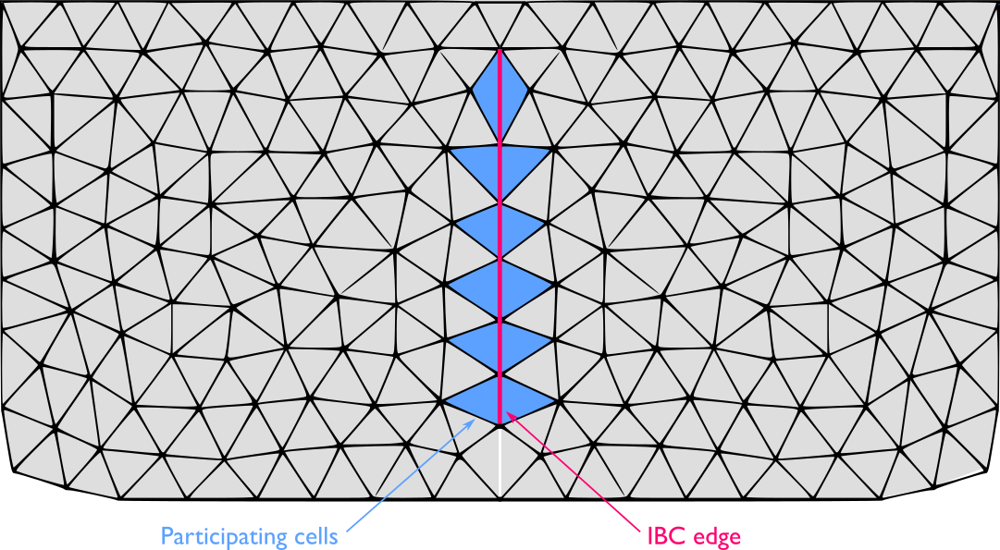{ width=75% }

Assuming the pipe roof collapse has not occurred and the flow direction from left to right, the upstream element is cell L and the downstream is cell R. Water surface elevation levels at the left side $z_{s,L}^{n+1}=(h+z)_L^{n+1}$, provided by the numerical scheme

are used to evaluate the discharge by means of the external discharge expression. First, the change of the pipe bottom elevation and width due to erosion are computed using and as:

$$\begin{aligned}
        z_b^{n+1}=z_b^{n} + \Delta t\, k_d\, (\tau_e-\tau_c)_b^{n} \\
        b^{n+1}=b^{n} + \Delta t\, 2\, k_d\, (\tau_e-\tau_c)_b^{n} \\
    \end{aligned}$$

where $(\tau_e-\tau_c)_b^{n}$ accounts for the erosive shear stress at the breach evaluated at the time level $t^n$. Then, the driving and the soil resistant forces, $F_d$ and $F_r$ respectively, are computed using and the pipe roof collapse condition is checked. Therefore, two cases must be taken into consideration:

1. If the roof collapse does not occurred, the pipe is considered filled with water and pressurized so that the enforced cell discharge in pipe during the next time level is computed using as:

    $$Q_b^{n+1}= A \sqrt{\frac{2 g (z_{s,L}^{n+1}-z_b^{n+1}) }{1+f L/(4 R)}}$$

    where the integrated breach features $A$, $f$, $L$, $R$ are evaluated at time $t^{n+1}$.

2. If the roof collapse condition is satisfied, the dam breach is assumed open and the enforced cell discharge in pipe during the next time level is computed using as:

    $$Q_b^{n+1}=k_{sm} \left(c_r b^{n+1} (z_{s,L}^{n+1}-z_b^{n+1})^{1.5}+\frac{c_t (z_{s,L}^{n+1}-z_b^{n+1})^{2.5}}{\tan{\beta}}\right)$$

Note that once the roof collapse occurs, the pipe stability condition has not to be checked anymore and the dam breach is assumed open. Regardless the pipe is maintained or collapsed, the unit discharge at each cell pair composing the dam breach is assumed normal to the direction of the shared edge $\mathbf{\hat{n}_b}$ and its module is updated as:

$$q_L^{n+1}=q_R^{n+1} = \frac{l}{W_b} Q_b^{n+1}$$

being $W_b$ the total breach width and $l$ the length of the shared edge for each internal boundary cell pair.
