---
caption:
  figure:
    enable: false
  table:
    enable: false
  custom:
    enable: false
---

# DIP (DIP)

DIP (DIP) user interface provides the tools to enter non-spatial data, and run RiverFlow2D. All changes introduced on the DIP will be saved to the native RiverFlow2D data files.

The DIP appears when you export the files to RiverFlow2D from QGIS. You can also access the DIP double-clicking on the DIP icon  on the desktop. In that case, the program will give you a list of previous projects and let you open any one of them:

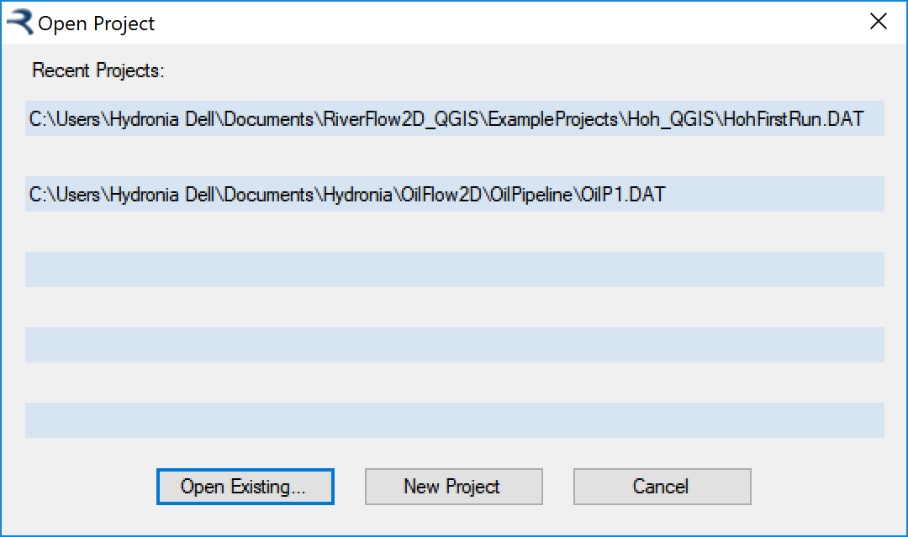{ width=65% }

DIP provides a data input environment with panels that include all the non-spatial options to run RiverFlow2D. The left column on the main window allows you select modules, components, output options, etc. When you click on one of the cells, the appropriate right side panel is activated. Each panel contains the data corresponding to each of RiverFlow2D data files. For example, the *Control Data* Panel has all the data of the file.

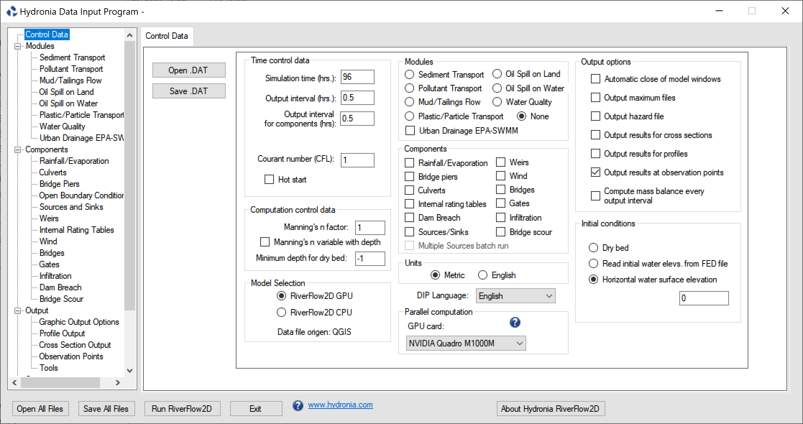{ width=100% }

DIP lets you select different model engines. Using the options the Model Selection frame you can select between RiverFlow2D CPU or RiverFlow2D GPU. Note that to run the GPU version you need the appropriate GPU hardware. Please contact Hydronia at <mailto:support@hydronia.com> to inquire about the currently supported NVIDIA GPU cards.

The following sections describe the panel dialogs of the DIP.

## Control Data Panel (.DAT file)

This panel determines the general run options like time step control parameters, metric or English units, physical process (components), graphical outputs, and initial conditions. It also provides buttons to open and saving files, and running the RiverFlow2D model. The program will launch with the *Control Data* panel visible.

{ width=100% }

- **Open .DAT:** Opens an existing file.
- **Save .DAT:** Saves a file with the data shown on the Panel.
- **Open All Files:** Saves data from all enabled Tabs. *Note: This operation does not alter the node coordinates and elevations, triangular mesh topology, Manning roughness coefficients, and other mesh related parameters in the file*.
- **Run RiverFlow2D:** Runs RiverFlow2D .
- **Exit:** Closes DIP.
- **About DIP:** Shows a concise description of RiverFlow2D.

- **www.hydronia.com:** Opens Hydronia home page.

- **DIP Language:** Drop down list that allows selecting the language of the Data Input Program user interface. Presently the options available are English and Spanish. Other language will be added in future releases.

- **Simulation time (h.):** Total simulation time in hours.
- **Output Interval (h.):** Time interval for output reporting.
- **Output Interval for components (h.):** Time interval for components output reporting. It applies to cross sections, profiles, observation points, culverts, weirs, dam breach, bridges, and gates.
- **CFL:** Courant-Friederich-Lewy condition (CFL). Set this number to a value in the (0,1\] interval. By default CFL is set to 1.0 which is the recommended value for maximum performance. A few rare applications may require reducing CFL to 0.5 or to avoid model oscillations in the model results.
- **Hot start:** Use this option to restart the model from a previously simulation.

- **Metric:** Select this option to work in metric units. Coordinates are given in meters, velocities in m/s, discharge in m$^{3}$/s, etc. Text output is provided in metric units.
- **English:** Select this option to work in English units. Coordinates are given in feet, velocities in ft/s, discharge in ft$^{3}$/s, etc. Text output is provided in English units.

!!! note

    When exporting RiverFlow2D files from QGIS, units are automatically set according to the selected Projection. Changing to units different to those of the projection should not be attempted since it will certainly lead to incorrect model results.

- **Manning's n factor:** Use the XNMAN factor to test the sensitivity of results to Manning's n and reduce the number of calibration runs. Using this option, will each cell Manning's n-value will be multiplied by XNMAN. Default is XNMAN = 1.
- **Manning's n variable with depth:** Select this option to set Manning's n as a function of depth. The user must enter polygons over the mesh and each polygon should have an associated file containing the depth vs Manning's n table.
- **Minimum depth for dry bed:** This parameter indicates the depth below which cell velocity will be assumed 0. By default it is set to -1 which will allow the model to dynamically set the dry cell conditions for depths smaller than $10^{-6}$m.

- **Automatic close of model windows:** The model windows are automatically closed as soon as the program finalizes the execution.

- **Output maximum files:** Switch to allow reporting maximum values throughout the simulation to , , and maximum values output files.
- **Output hazard file:** The model will generate flood hazard levels based on the criteria used in different countries .

- **Output results for cross sections:** Use this option to generate results for user defined cross sections. The cross section can be edited in the Cross Section Output Panel. This data goes in a file.

- **Output results for profiles:** Use this option to generate results along a user defined polyline. The polyline data can be edited in the Profile Cut Output Panel. This data goes in a file.

- **Output results at observation points:** Switch to allow reporting time series of results at specified locations defined by coordinates in the Observation Points Panel.

- **Compute mass balance every output interval:** Switch to calculate detailed mass or volume balance. The report is written in the file. Keep this option selected to check general model mass balance, but it is recommended to turn it off for production runs, since it will speed up the model operation.

- **Mud/Tailings Flow:** Option to activate the Mud and Tailings Flow modeling. The data can be edited in the Mud/Tailings Flow Panel. The data is written to the file.
- **Oil Spill on Land:** Option to activate the Overland Oil Spill modeling. The data can be edited in the Oil Spill on Land Panel. The data is written to the file.
- **Oil Spill on Water:** Option to activate the Oil Spill on Water modeling. The data can be edited in the Oil Spill on Water Panel. The data is written to the file.
- **Pollutant Transport:** Option to activate pollutant transport modeling. The pollutant transport data can be edited in the Pollutant Transport Panel. The data is written to the file.
- **Sediment transport:** Option to activate sediment transport modeling with erosion and deposition for a mobile bed. The sediment transport data can be edited in the Sediment Transport Panel. This data is written to the and files.
- **Urban Drainage EPA-SWMM:** Switch to integrate surface water with storm drain EPA-SWMM model. The data is written to file.
- **Water Quality:** Option to activate water quality model. The water quality data can be edited in the Water Quality Panel. The data is written to the file.

- **Rainfall/Evaporation:** Option to activate rainfall and/or evaporation. The required data has to be entered in the Rainfall /Evaporation Panel. This data is written to file.
- **Bridge piers:** Switch to allow accounting for pier drag force. The Bridge piers data can be edited in the Bridge Piers Panel. The data is written to file.
- **Bridges:** Switch to model Bridges using the bridge cross section geometry and accounting for energy losses. The data can be edited in the Bridges Panel. The data is written to file.

- **Bridge Scour:** Switch to calculate bridge scour at piers and abutments. The data can be edited in the Bridge Scour Panel. The data is written to file.

- **Culverts:** Switch indicating if one dimensional culverts will be used. The Culverts data can be edited in the Culverts Panel. The data is written to file.
- **Dam Breach:** Switch to activate the Dam Breach component. The data is written to file.
- **Gates:** Switch to model gates. The data can be edited in the *Gates* Panel. The data is written to file.
- **Infiltration:** Option to activate Infiltration loss calculations. The required data has to be entered in the Infiltration Panel. This data is written to file.
- **Internal rating tables:** Switch to allow using internal rating tables. The data can be edited in the Internal Rating Tables Panel. The data is written to file.
- **Multiple sources batch run:** Switch to activate batch runs when more than one source is defined. The model will perform sequentially runs for each individual source in separate directories, that will have the name given to each source.
- **Sources/Sinks:** Switch to indicate existence of sources or sinks. The sources/sinks data can be edited in the Sources/Sinks Panel. The data is written to file.
- **Wind:** This option activates the calculation of wind stress on the water surface. The data can be edited in the Wind Panel. The data is written to file.

- **Dry bed:** The simulation will start with a fully dry bed. For discharge boundary conditions, an arbitrary depth ($>$ 0.0) is assigned to calculate the inflow for the first time-step. Subsequently the flow depth at the boundary will be determined by the model.
- **Read initial water elevations from file:** Initial water surface elevations will be read from the file. It is possible to assign a spatially variable initial water surface elevation in the Initial Conditions Layer.
- **Horizontal water surface elevation:** Use this option to start a simulation with a user provided initial horizontal water surface elevation.
- **Initial water elevation:** Initial water surface elevation on the whole mesh. If initial water elevation is set to -9999, the program will assign a constant water elevation equal to the highest bed elevation on the mesh.

## Sediment Transport Panel (.SEDS and .SEDB Files)

This panel allows entering sediment transport data. To activate this panel, first select *Sediment Transport* on the *Components Frame* of the *Control Data* Panel.

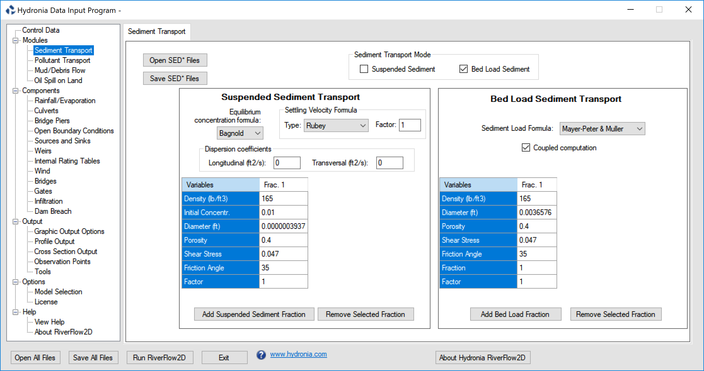{ width=100% }

- **Suspended sediment:** When this check box is selected, the model will compute sediment concentrations using the suspended sediment transport component. See comment 1.
- **Bed load Sediment:** Selecting this check box will activate the bed load sediment transport component. See comment 1.
- **Open:** Opens an existing or files.
- **Save:** Saves the sediment data to and files.

- **Equilibrium Concentration formula:** When this check box is selected, the model will compute sediment concentrations using one of the following suspended sediment transport formulas:

1. Bagnold (1966)lb
2. Van Rijn (1984a)
3. Zhang and Xie (1993)

- **Settling Velocity Formula:** It is a unique formula that applies for all fractions. This drop-down list includes the following formulas:

1. Rubey (1933)
2. Zhang (1961)
3. Zanke (1977)
4. Van Rijn (1984a)
5. Raudkivi (1990)
6. Julien (1998)
7. Cheng (1997)
8. Jimenez-Madsen (2003)
9. Wu-Wong (2006)

- **Factor:** This factor multiplies the settling velocity calculated by the selected formula.
- **Dispersion coefficients:** Longitudinal and transversal dispersion coefficients for the Suspended Sediment module (m$^{2}$/s or ft$^{2}$/s).
- **Density:** Suspended sediment density (kg/m$^{3}$ or lb/ft$^{3}$).
- **Initial Concentration:** Initial volumetric sediment concentration. See comment 2.
- **Diameter:** Characteristic sediment size for this fraction (m or ft).
- **Porosity:** Bed porosity.
- **Shields Stress:** Critical Shield stress.
- **Friction Angle:** Sediment friction angle (degrees).
- **Factor:** Equilibrium concentration formula factor for each fraction. This factor multiplies the equilibrium concentration calculated by the selected formula.
- **Add Suspended Sediment Fraction:** Used to add a new fraction. Up to 10 fractions may be used.
- **Remove Selected Fraction:** Deletes the selected fraction.

- **Sediment load formula:** Allows selection of one of the following sediment transport formulas:

- **1. Meyer-Peter:** Muller (1948)
2. Ashida (1972)
3. Engelund (1976)
4. Fernandez (1976)
5. Parker fit to Einstein (1979)
6. Smart (1984)
7. Nielsen (1992)
8. Wong 1 (2003)
9. Wong 2 (2003)
10. Camenen-Larson (1966)

- **Density:** Sediment density (lb/ft$^{3}$ or kg/m$^{3}$).
- **Diameter D30:** Sediment D30 size (m). 30% of the sediment is finer than D30. Only used for Smart Formula.
- **Diameter:** Characteristic sediment size for this fraction (m).
- **Diameter D90:** Sediment D90 size (m). 90% of the sediment is finer than D90. Only used for Smart Formula.
- **Porosity:** Sediment porosity.
- **Shields Stress:** Critical Shield stress.
- **Friction Angle:** Sediment friction angle (degrees).
- **Fraction:** Fraction of material in bed. All fractions must add up to 1.
- **Factor:** Transport formula factor for each fraction. This factor multiplies the result of the transport formula selected.
- **Add Bed Load Fraction:** Used to add a new fraction. Up to 10 fractions may be used.
- **Remove Selected Fraction:** Deletes the selected fraction.

#### Comments for the .SEDS and .SEDB Files

1. You can select either one or both options. When using the suspended sediment transport option, all inflow data files should contain time series of volumetric concentrations for each fraction entered.
2. Volumetric concentration should be provided as a fraction of 1. Note that the typically total maximum suspended load concentration do not exceed 0.08. Concentrations greater than 0.08 is generally considered hyperconcentrated flow which falls beyond the validity of the sediment transport algorithms. Therefore, the sum of all initial concentrations should also not exceed 0.08.

## Urban Drainage EPA-SWMM Panel (.LSWMM File)

This panel is used to display the content of the file and enter data for the Urban Drainage module. it is expected that you create the using the manhole (exchange nodes) in the EPA-SWMM project file. In this panel can edit the diameter and discharge coefficient for each manhole. To activate this panel, first select the *Urban Drainage EPA-SWMM* from the *Modules* group on the left panel of DIP.

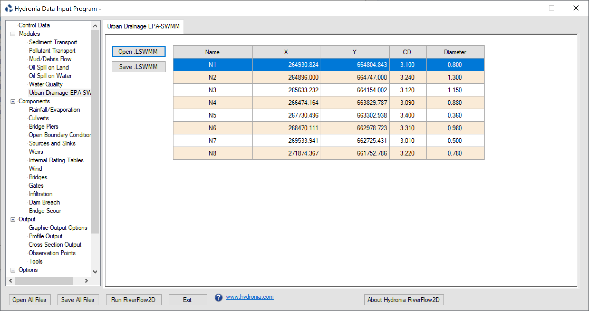{ width=100% }

- **CD:** Discharge coefficient for exchange node.
- **Diameter:** Diameter of exchange node.
- **Name:** Name of manhole or exchange node. Should have less than 26 characters and must not contain blank spaces.
- **X Y:** Coordinates of exchange node.

## Mud and Tailings Flow Data Panel (.MUD File)

This panel allows entering the data required to perform mud and tailings flow simulations. It includes options for constant properties and variable-properties model. To activate this panel, first select *Mud/Tailings Flow* on the *Components Frame* of the *Control Data* Panel. There are two separate frames for the Constant Properties and Variable Properties / Erosion / Deposition models.

The panel also provides a tool to calculate the Yield Stress, Viscosity and Density of the material based on the Volumetric Concentration Cv according to different procedures available in publications selected from the drop down lists.

When using the Variable Properties model, the user can enter multiple classes to represent the different types of materials characterized by their diameter and density. In that case it is important to keep in mind that each of the inflow boundary condition files will need to contain, in addition to the flowrate or water elevation, the volumetric concentrations Cv for each given material class.

Further details about the data on this panel can be seen in table on section , page.

{ width=100% }

- **Constant properties:** Select the constant property model where viscosity, density and yield stress remain invariant in space and time during the computation.

- **Variable properties:** Select the variable property model where viscosity, density and yield stress can change during the computation. The model also can consider the material grain distribution with different size fractions, with erosion and deposition.

Flow resistance relation &

1. Turbulent flow
2. Full Bingham
3. Simplified Bingham
4. Turbulent and Coulomb
5. Turbulent and Yield
6. Turbulent, Coulomb and Yield
7. Quadratic
8. Granular flow
9. Herschel-Bulkley

Viscosity calculation &

1. Constant: Viscosity will be assumed constant in space and time and equal to the value entered in the Viscosity box for Constant properties.
2. Formula: Viscosity will depend on Cv according to the Formula selected as a function of Cv.
3. Table: Viscosity will be interpolated from the user provided Cv vs Viscosity Table at the bottom end of the panel. See the file format in section below.

Yield stress calculation &

1. Constant: Yield stress will be assumed constant in space and equal to the value entered in the Yield stress box for Constant properties.
2. Formula: Yield stress will depend on Cv according to the Formula selected as a function of Cv.
3. Table: Yield stress will be interpolated from the user provided Cv vs Yield stress Table at the bottom end of the panel. See the file format in section below.

- **Cv:** Volumetric fluid concentration

- **Yield stress:** Yield stress (Pa or lb/in$^{2}$).

- **Viscosity:** Fluid viscosity (Poise or lb/in$^{2}$).

- **Equilibrium concentration formula:** Selection list from different authors.

- **Basal stability angle:** Friction angle of the material (degrees).
- **Settling Velocity Formula:** It is a unique formula that applies for all fractions. This drop-down list includes the following formulas:

1. Rubey (1933)
2. Zhang (1961)
3. Zanke (1977)
4. Van Rijn (1984a)
5. Raudkivi (1990)
6. Julien (1998)
7. Cheng (1997)
8. Jimenez-Madsen (2003)
9. Wu-Wong (2006)

- **Factor:** This factor multiplies the settling velocity calculated by the selected formula.
- **Pore pressure factor:** $\gamma_{ref} \geq 1$ is a user-defined pore pressure factor. See equation .

- **Material density:** Fluid density (kg/m$^{3}$ or lb/ft$^{3}$).

- **Reference density:** $\rho_{ref} \geq \rho_w$ is the user-defined reference density used in the pore pressure term. Must be greater or equal to the water density (kg/m$^{3}$ or lb/ft$^{3}$). See equation .

- **Density of solid class:** Solid density for each class (kg/m$^{3}$ or lb/ft$^{3}$).

- **Initial Volume Concentration:** Initial volumetric material concentration. Is overridden if Initial Concentration polygons are provided.

- **Fraction Diameter:** Characteristic material size for each class (m or ft).

- **Bed Material Porosity:** Bed porosity used when computing deposition.

- **Shields Critical Stress:** Critical Shield stress for each class.

- **Equilibrium Formula Factor:** Equilibrium concentration formula factor for each class. This factor multiplies the equilibrium concentration calculated by the selected formula, and is commonly used for model calibration..

- **Bed material fraction:** Initial fraction of each class on the bed material. The sum of bed material fractions for all the classes must add 1.

- **Settling velocity Factor:** Settling velocity formula factor for each class. This factor multiplies the settling velocity calculated by the selected formula, and is commonly used for model calibration.

- **Add Sediment:** Used to add a new material class. Up to 10 classes may be used.
- **Remove Selected Class:** Deletes the selected class.

### Optional Viscosity or Yield Stress Data Files

When selecting the Table option from the Viscosity Calculation or Yield Stress Calculation drop down lists a data file must be provided that represent the variation of viscosity or yield stress with volumetric concentration Cv.

The file format is as follows

Line 1: Number points in data series.\
**NDATA**\
NDATA lines containing\
**Cv(I) VARIABLE(I)**\
Where VARIABLE(I) is the Viscosity, or Yield Stress for the corresponding Cv(I).

#### Example of the Viscosity or Yield Stress Data Files

The following example shows an yield stress data as function of Cv, where NDATA is 5 and there are 5 lines with pairs of Cv and Ys:\
5

0.00 0.

0.20 0.1

0.30 150.

0.50 500.

0.65 1200.

## Pollutant Transport panel (.SOLUTES)

Use the *Pollutant Transport* panel to enter the parameters required to characterize the reaction rates between multiple solutes as summarized in Table.

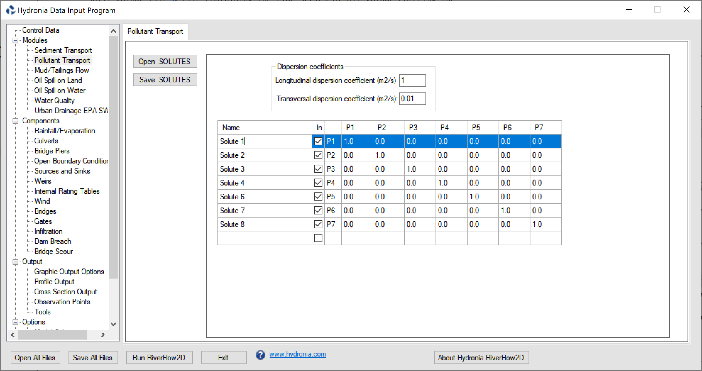{ width=100% }

- **Dispersion coefficients:** Longitudinal and transversal dispersion coefficients for the PL module (m$^{2}$/s or ft$^{2}$/s).
- **Name:** Solute name.
- **In:** Check box to include pollutant in the simulation.
- **Reaction coefficients:** Matrix to enter the linear reaction coefficients between the solutes. The matrix is symmetrical. The diagonal may be used to enter the linear decay coefficient for a given pollutant. You can add more solutes by clicking on the last row name. You can also eliminate a solute by selecting the name and using the Delete keyboard key. The columns tittles (P1, P2,\...) correspond to each solute.

## Graphic Output Options Tab (.PLT File)

This panel allows entering options to control RiverFlow2D output. To activate this panel, first select *Graphic Output Options* from the *Output* group on the left panel DIP.

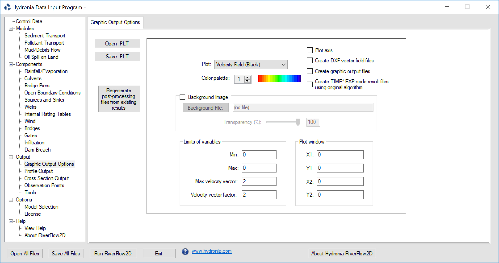{ width=100% }

- **Open:** Opens an existing output data file.
- **Save:** Saves only the graphic output data to a file.
- **Regenerate post-processing files from existing results:** Use this button to create output files from existing simulations. The output files written during a previous simulation must be available.
- **Plot:** Chose the desired plot from the list:

- Velocity field using black arrows.
- Velocity field using colored arrows based on velocity magnitude.
- Velocities in black over colored depths.
- Velocities in black over colored bed elevations.
- Flow depth.
- Bed elevation.
- Water elevations.
- Velocities in black over colored water elevations.
- Erosion and deposition.
- Concentration

- **Color palette:** For future use.

- **Plot axis:** For future use.
- **Create DXF vector field files:** Generate velocity vector DXF (CAD) files. This option will also export the mesh in DXF format to the file: .

- **Create graphic output files:** For future use.
- **Create node result files using original algorithm.:** Using this option RiverFlow2D when running will generate files using an algorithm to compute nodal values from cell values that was available in versions older than 2018.

- **Background image:** For future use.
- **Background file:** For future use.
- **Transparency:** For future use.

- **Min:** For future use.
- **Max:** For future use.
- **Max velocity vector:** For future use.
- **Velocity vector factor:** For future use.
- ****Plot Window Frame**:** For future use.
- **X1:** For future use.
- **Y1:** For future use.
- **X2:** For future use.
- **Y2:** For future use.

## Profile Output Panel (.PROFILES File)

Use this panel to enter polyline coordinates where the model results are to be generated. The model will generate output and files. To activate this panel, first select the *Profile Output* in *Output* from the *Output* group on the left panel of DIP.\
See output file section for output file content description.

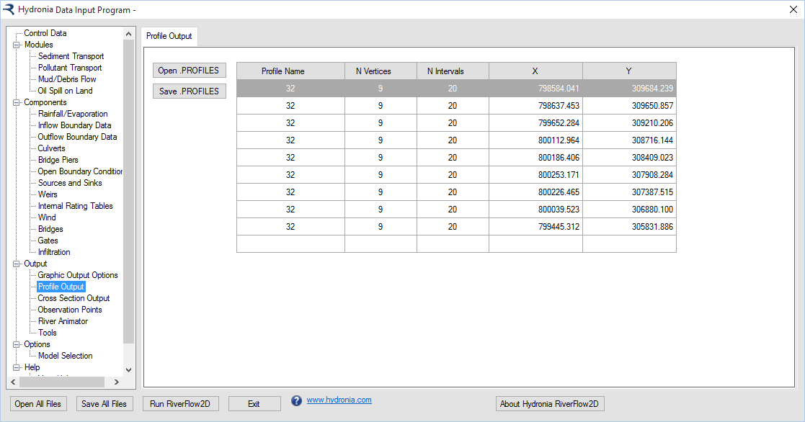{ width=100% }

- **Profile name:** Profile name. Should not contain spaces and must have less than 26 characters.
- **N Vertices:** Number of vertices in each profile.
- **N Intervals:** Intervals to divide each profile sub-segment between vertices. Results will be reported at each interval.
- **X, Y:** Coordinates for each vertex in polyline.
- **Open:** Opens an existing file.
- **Save:** Saves only the profile data to a file.

## Cross Section Output Panel (.XSECS File)

Use this panel to enter coordinates for cross sections that intersect the triangular-cell mesh where you want to output model results. RiverFlow2D will generate output and files. To activate this panel, first select the *Cross Section Output* from the *Output* group on the left panel of p p.\

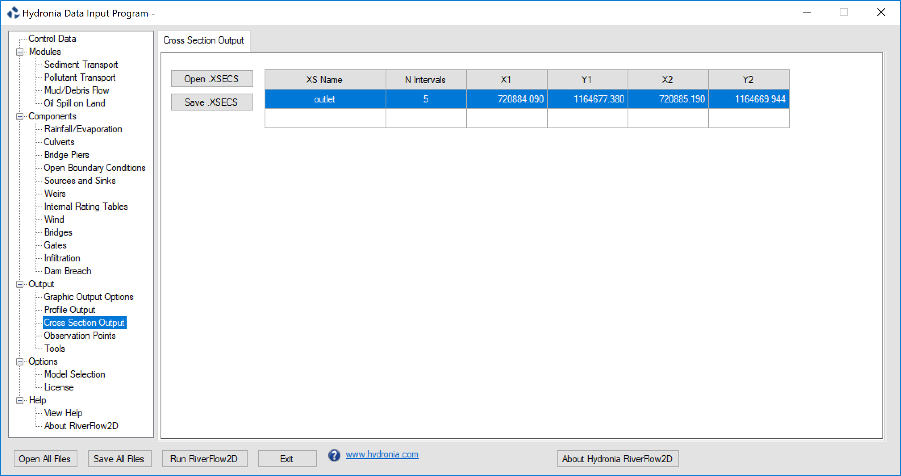{ width=100% }

- **XS Name:** Cross section name. Should not contain spaces and must have less than 26 characters.
- **N Intervals:** Intervals to divide each section. Results will be extracted and reported at each interval.
- **X1 Y1 X2 Y2:** Each row corresponds to the coordinates of the initial (X1,Y1) and ending (X2,Y2) of one cross section.
- **Open:** Opens an existing file.
- **Save:** Saves only the cross section data to a file.

## Culverts Panel (.CULVERTS File)

This panel is used to display the content of the file and enter data for culverts. Figure shows the *Culvert* panel with a three culverts. Selecting Culvert1 on the first row shows the associated rating table. To activate this panel, first select the *Culverts* from the *Components* group on the left panel of DIP.

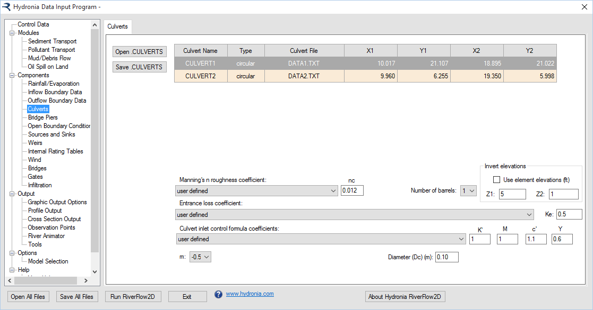{ width=100% }

Figure shows the corresponding data entry controls that appear when selecting the first row for Culvert1 that is a circular culvert.

- **Culvert Name:** Culvert name. Should not contain spaces and must have less than 26 characters.
- **Type:** Type of culvert. For Type = 0, culvert discharge is computed from a user given rating table on the Culvert File. For Types = 1 and 2, discharge is computed using culvert equations based on culvert characteristics provided in the Culvert File.
- **Culvert File:** Culvert rating table file name or culvert characteristic data. Name Should not contain spaces and must have less than 26 characters.
- **X1, Y1, X2, Y2:** Coordinates of vertices defining each culvert line.
- **Manning's roughness coefficient:** Culvert Manning's n Coefficient given by Table .
- **Entrance loss coefficient:** Culvert entrance loss coefficient given by Table .
- **Culvert inlet control formula coefficients:** Culvert inlet control formula coefficients given by Table .
- **m:** Inlet form coefficient. m=0.7 for mitered inlets, m=-0.5 for all other inlets.
- **Barrel height (Hb):** Barrel height for box culverts (ft or m). Only for box culverts: CulvertType = 1.
- **Barrel width (Base):** Barrel width for box culverts (m or ft). Only for box culverts: CulvertType = 1.
- **Diameter (Dc):** Barrel diameter for circular culverts (m or ft). Only for circular culverts: CulvertType = 2.
- **Number of barrels:** Number of identical barrels.
- **Use cell elevations:** When this check box is selected the model will extract the inlet and outlet invert elevations from the cell elevations of the culvert ending points. If the check box is not selected, the user can enter the inlet invert elevation (Z1) and outlet invert elevations (Z2) that may be different from the cell elevations.
- **Open:** Opens an existing file.
- **Save:** Saves only the culvert data to a file.

## Internal Rating Tables Panel (.IRT File)

This panel is used to display the content of the file and enter data for Internal rating Tables. In this Panel can also edit Internal Rating Table polylines, type, and data file name. To activate this panel, first select the *Internal Rating Table* from the *Components* group on the left panel of DIP.

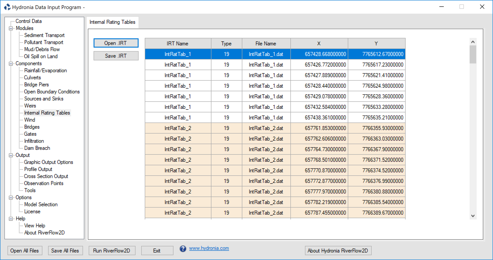{ width=100% }

- **IRT Name:** Name of internal rating table. Should not contain spaces and must have less than 26 characters.
- **Type:** Boundary condition is always equal to 19 in this version, corresponding to discharge vs. water surface elevation tables.
- **File Name:** Name of file containing internal rating table data in the format described as a stage-discharge data file.
- **X, Y:** Coordinates of vertices defining each IRT polyline.
- **Open:** Opens an existing file.
- **Save:** Saves only the internal rating table data to a file.

## Weirs Panel (.WEIRS File)

This panel is used to display the content of the file. In this Panel can also create weir polyline data. To activate this panel, first select the *Weirs* from the *Components* group on the left panel of DIP.

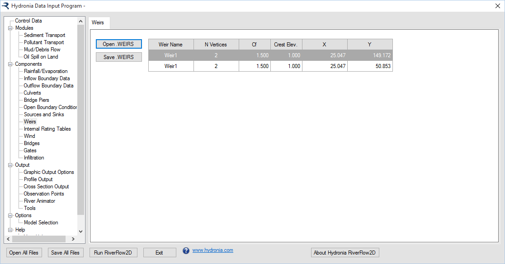{ width=100% }

- **Weir Name:** Name of weir. Should not contain spaces and must have less than 26 characters.
- **N Vertices:** Number of points defining each weir polyline.
- **Cf:** Weir coefficient.
- **X, Y:** Coordinates of vertices defining each weir polyline (m or ft).
- **Open:** Opens an existing file.
- **Save:** Saves only the weir data to a file.

## Sources/Sinks Panel (.SOURCES File)

This panel is used to display the content of the file. Use this Panel to also create sources and sinks location data, type, and sources/sink data file. To activate this panel, first select the *Sources and Sinks* from the *Components* group on the left panel of DIP.

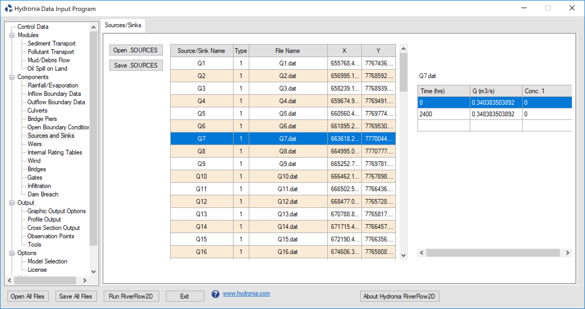{ width=100% }

- **Source/Sink Name:** Name of point source or sink. Should not contain spaces and must have less than 26 characters.
- **File Name:** Name of file containing the time series or rating table of each point source or sink.
- **Type:** Source/sink type. If equal to 1, the file should contain a hydrograph. If equal to 2, it contains a rating table with depths vs discharge values.
- **X, Y:** Coordinates of point.
- **Open:** Opens an existing file.
- **Save:** Saves only the sources and sinks data to a file.

## Bridge Scour Panel (.SCOUR File)

This panel is used to display the content of the file. Use this Panel to edit bridge pier or abutment data and calculate scour on those structures. To activate this panel, first select *Bridge Scour* from the *Components* group on the left panel of DIP.

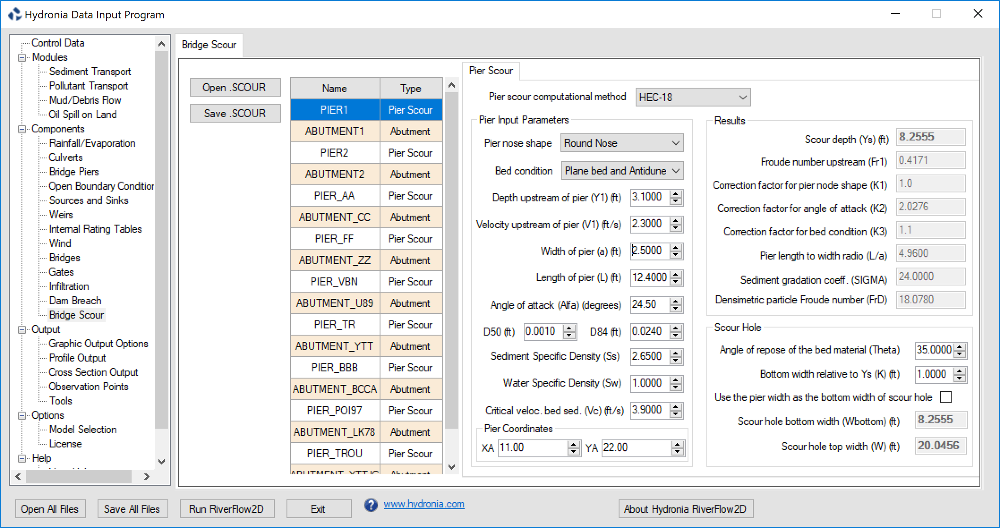{ width=100% }

- **Pier ID:** Pier name
- **Icomp::** Computational method
- **XA, YA:** Pier coordinates
- **Y1:** Flow depth directly upstream of the pier
- **V1:** Velocity upstream of the pier
- **Alfa:** Angle of attack
- **alfaRAD:** Angle of attack
- **ishape:** Pier shape
- **L:** Pier length
- **a:** Pier width
- **iBedCondition:** Bed condition
- **D50:** D50
- **D84:** D84
- **Sediment Specific Density:** Ss
- **Water Specific Density:** Sw
- **K1:** Correction factor for pier nose shape.
- **K2:** Correction factor for angle of attack of flow
- **K3:** Correction factor for bed condition
- **K:** bottom width relative to Ys.
- **theta:** angle of repose of the bed material
- **ys:** Scour depth
- **W:** scour hole top width
- **Wbottom:** scour hole bottom width
- **Fr1:** Froude Number upstream of pier
- **FrD:** Densimetric particle Froude Number
- **SIGMA:** Sediment gradation coefficient
- **Vc:** Critical velocity for initiation of erosion of the material
- **iAbutmentType:** Abutment Type
- **AlfaA:** Amplification factor for live-bed conditions
- **AlfaB:** Amplification factor for clear-water conditions
- **YmaxLB:** Maximum flow depth after scour for live-bed conditions
- **YmaxCW:** Maximum flow depth after scour for clear-water conditions
- **YcLB:** Depth including live-bed contraction scour
- **YsA:** Abutment scour depth
- **YcCW1:** Depth including clear-water contraction scour. Method 1
- **YcCW2:** Depth including clear-water contraction scour. Method 2
- **q1:** Upstream unit discharge
- **q2c:** Upstream unit discharge of the constricted opening
- **n Manning:** Mannings n
- **TauC:** Critical shear stress
- **GammaW:** Unit weight of water
- **BridgeXSEC_X1, BridgeXSEC_Y1, BridgeXSEC_X2, BridgeXSEC_Y2:** Coordinates of extreme points of Bridge Cross Section
- **UpstreamXSEC_X1, UpstreamXSEC_Y1, UpstreamXSEC_X2, UpstreamXSEC_Y2:** Coordinates of extreme points of Upstream Cross Section
- **Open:** Opens an existing file.
- **Save:** Saves only the bridge pier and abutment data to a file.

## Bridge Piers Panel (.PIERS File)

This panel is used to display the content of the file. In this Panel can also enter bridge pier location and pier geometry data. To activate this panel, first select the *Bridges Piers* from the *Components* group on the left panel of DIP.

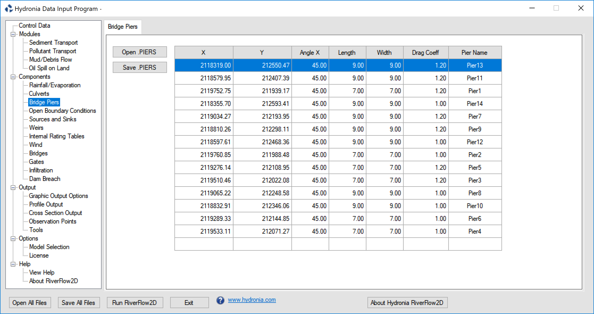{ width=100% }

- **X,Y:** Coordinates of pier centroid.
- **Angle X:** Pier angle with respect to X axis.
- **Length:** Pier length (m or ft).
- **Width:** Pier width (m or ft).
- **Drag Coeff.:** Drag coefficient of the pier.
- **Pier Name:** Name of pier. Should not contain spaces and must have less than 26 characters.
- **Open:** Opens an existing file.
- **Save:** Saves only the bridge piers data to a file.

!!! note
    To simulate circular piers use the same width and length and set an adequate Drag Coefficient for round piers.

## Observation Points Panel (.OBS File)

Use this panel to create, edit and display the content of the file. To activate this panel, first select the *Observation Points* from the *Output* group on the left panel of DIP.

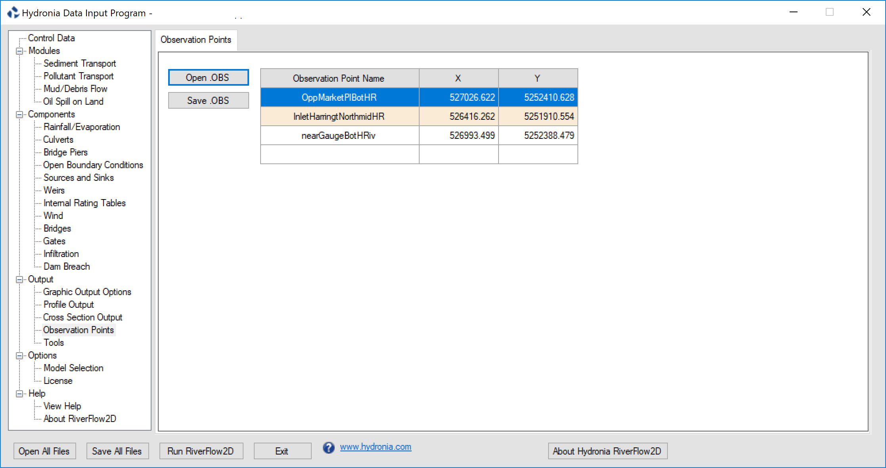{ width=100% }

- **Observation Point Name:** Name of observation point. Should not contain spaces and must have less than 26 characters.
- **X,Y:** Coordinates of point.
- **Open:** Opens an existing file.
- **Save:** Saves only the observation point data to a file.

## Tools Panel

This section describes various utilities that are available through DIP. To activate this panel, first select the *Tools* from the *Output* group on the left panel.

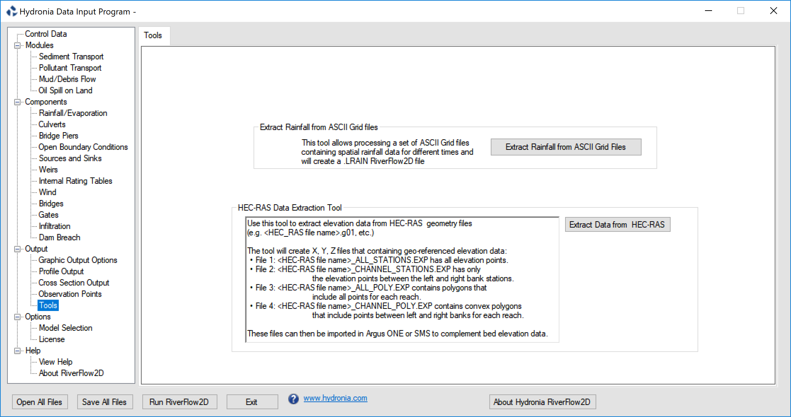{ width=100% }

### Process Rainfall and Evaporation Data from ASCII Grid Files Tool

You can use this tool to process rainfall (e.g. NEXRAD) and evaporation ASCII Grid Files to prepare RiverFlow2D data files that can be used for hydrologic simulations. The program will let you extract data from a set of point rainfall and evaporation ASCII grid files and to create a file in the format readable by RiverFlow2D.

To use the tool, you need first to create file with a text editor (e.g Notepad) using the following format:\
Line 1: Number of ASCII Rain Files\
**NRF**\
NRF lines containing:\
**Ti RAINFILEi.ASC**\
Where Ti is the time in hours and is the ASCII Grid file for the rainfall corresponding to time Ti.

Optionally if you have a set of evaporation files you add the following lines:\
Number of ASCII Evaporation Files (must be equal to NRF)\
**NEV**\
NEV lines containing:\
**Ti EVAPFILEi.ASC**\
Where Ti is the time in hours and is the ASCII Grid file for the evaporation corresponding to time Ti.

It is assumed that in the rain and evaporation ASCII files values are given in mm or in. Since RiverFlow2D uses intensities instead of mm or in, the values provided will be converted internally to mm/hr or in/hr using the time interval determined from the times provided in the file described above.

If the number of files (NRF) in the first line is positive, the rainfall/evaporation will be assumed to be given in points, and will be interpolated to each cell. If the number is negative, the program will consider the rain/evaporation given in squares centered at each grid point, and then the cell precipitation will be that of the grid where the cell centroid is located. This last method does not involve interpolation and is faster than the first method.

Once you have the file created and the files are located in the same folder, use the *Extract Rainfall from ASCII Grid Files Tool* button, select the file and click Open.

Wait for a few moments and enter the name of the file. The conversion process will take a few seconds or minutes depending on the number of files and their size.

To use the resulting file, you should copy it to the project folder making sure to setting the same file name as that of your project. For instance, if your project files are , , then name it as.

#### Example of a .RFC File with rainfall only

        -4 
        0 rain_spas1275_001_20040917_0100_utc.asc
        1 rain_spas1275_002_20040917_0200_utc.asc
        2 rain_spas1275_003_20040917_0300_utc.asc
        3 rain_spas1275_004_20040917_0400_utc.asc

#### Example of a .RFC File with rainfall and evaporation

        -4 
        0 rain_spas1275_001_20040917_0100_utc.asc
        1 rain_spas1275_002_20040917_0200_utc.asc
        2 rain_spas1275_003_20040917_0300_utc.asc
        3 rain_spas1275_004_20040917_0400_utc.asc
        -4 
        0 evap_spas1275_001_20040917_0100_utc.asc
        1 evap_spas1275_002_20040917_0200_utc.asc
        2 evap_spas1275_003_20040917_0300_utc.asc
        3 evap_spas1275_004_20040917_0400_utc.asc

### HEC-RAS Data Extraction Tool

The purpose of this tool is to facilitate migrating existing HEC-RAS projects to RiverFlow2D. The program allows extraction of point elevation data from geo-referenced cross-section from the HEC-RAS one-dimensional model developed by the USACE. The tool reads HEC-RAS geometry files with extension , , etc., and creates X Y Z files that can be readily imported in QGIS. The utility discriminates the elevations in the channel between the left and right bank on each cross section and exports the files as detailed in the following table.

& Contains all elevation points in all cross sections in the for all reaches and cross sections in the file.\
& Contains polygons that include all elevation points in each reach.\
& Contains only the elevation points between the left and right banks in all cross sections in the for all reaches in the file.\
& Contains polygons that include only the elevation in the main channel for each reach.\
