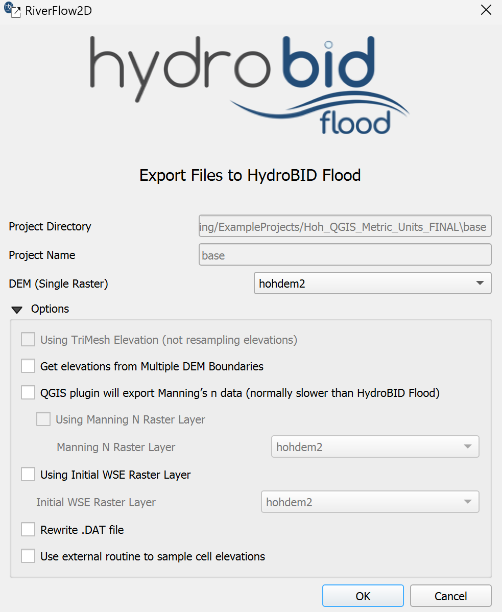

# Export Tools

This chapter describes the export options available for the active model and how output files are configured.

## Export Hydro-BID Flood
{ width=10% }

### Dialog Window

The following dialog is the main interface for configuring and initiating the export process for the HydroBID Flood model. It gathers information about input layers and specific components to be included in the export.

{ width=80% }

### Dialog Controls
The following table describes the controls available in the Export dialog.

| **Control Name** | **Type** | **Description** |
| --- | --- | --- |
| Project Directory | *Text Field* | Displays the full path to the current scenario's output directory within the project. (Read-only) |
| Scenario Name | *Text Field* | Displays the name of the current scenario being exported. (Read-only) |
| DEM (Single Raster) | *Dropdown* | Select the single raster layer representing the bed topography/elevation. Enabled only if neither 'Using TriMesh Elevation' nor 'Get elevations from Multiple DEM Boundaries' is active. Populated with available raster layers. |
| Using TriMesh Elevation (not resampling elevations) | *Checkbox* | Enable to use elevation data directly from the 'TriMesh' layer vertices/nodes instead of resampling from a DEM raster. Disables DEM selection options. Automatically checked if mesh was generated using \"Generate TriMesh with Elevation\" tool. |
| Get elevations from Multiple DEM Boundaries | *Checkbox* | Enable to use elevation data based on boundaries defined in a 'MultipleDemBoundaries' layer. Disables the 'DEM (Single Raster)' dropdown. Requires the 'MultipleDemBoundaries' layer to be present. |
| Using Manning N Raster Layer | *Checkbox* | Enable to use Manning's n values sampled from a selected raster layer instead of a vector layer. Enables the 'Manning N Raster Layer' dropdown. |
| Manning N Raster Layer | *Dropdown* | Select the raster layer containing Manning's n values. Enabled only when 'Using Manning N Raster Layer' is checked. Populated with available raster layers. |
| Using Initial WSE Raster Layer | *Checkbox* | Enable to use initial water surface elevation (WSE) values sampled from a selected raster layer. Enables the 'Initial WSE Raster Layer' dropdown. |
| Initial WSE Raster Layer | *Dropdown* | Select the raster layer containing initial WSE values. Enabled only when 'Using Initial WSE Raster Layer' is checked. Populated with available raster layers. |
| Rewrite .DAT file | *Checkbox* | Enable to force regeneration and overwriting of the main RiverFlow2D control file ('.dat'). |
| Use external routine to sample cell elevations | *Checkbox* | Enable to use the external executable ('ASCIISamplingC.exe') for sampling elevation values for mesh cells/centroids. This might be faster or handle large datasets differently than the internal QGIS methods. |
| OK | *Button* | Confirms the selections and initiates the export process based on the chosen options and detected layers. |
| Cancel | *Button* | Closes the dialog without exporting any files. |

### Workflow
The typical workflow for using the Export Files to RiverFlow2D tool is as follows:

1.  Ensure all required input layers (e.g., 'TriMesh', 'Manning N'/'Nr'/'Nz', optional layers like 'Boundary Conditions', 'Weirs', 'Bridges', DEM rasters etc.) are loaded into the QGIS project and meet the requirements (See Section [2.1.4](#requirements)). Make sure the 'Domain Outline' layer, if present, is not in editing mode.

2.  Activate the tool from the HydroBID Flood plugin menu or toolbar. This will open the Export Files to HydroBID Flood dialog (Figure 2.2).

3.  Verify that the Project Directory and Scenario Name are correctly displayed, reflecting the current project and active scenario.

4.  Click **OK** to start the export process, or alternately if you need to set additional parameters, review the **Options** group box.

5.  (Optional) Configure if Manning's roughness data should be sourced from a raster layer.

6.  (Optional) Select the checkbox to use a raster for Initial Water Surface Elevation.

7.  (Optional) Decide whether to use the external elevation sampling routine and whether to force rewriting the '.dat' file.

8.  Click **OK**.

9.  The tool performs requirement checks (e.g., layer existence, CRS compatibility, empty layers).

10. If checks pass, the tool proceeds with the export. It creates a centroids layer, samples necessary data (elevation, roughness, initial WSE) based on the selected options, and exports various component files ('.TGates', '.TWeirs', '.TBridges', '.TDams', '.THydnet', '.OBC', etc.) based on the presence of corresponding layers in the QGIS project (e.g., 'Gates', 'Weirs', 'Bridges', 'DamBreach', 'Channels1D', 'Boundary Conditions', etc.).

11. Finally, it generates the primary model input files: the geometry/mesh file ('.fed') and the control data file ('.dat'). Other auxiliary files like '.plt' and '.qgisunits' may also be created.

12. All exported files are saved in a subdirectory named after the current scenario within the main project directory. A confirmation message will appear upon successful completion, or error messages will be shown if issues occur.

### Requirements
Before using the Export tool, ensure the following requirements are met:

-   A QGIS project must be loaded.

-   The project must have a defined current scene (scenario). This determines the output subdirectory and file naming.

-   A mesh layer named 'TriMesh' must be present and active in the layer panel. This provides the core mesh geometry.

-   At least one Manning's roughness source must be available and active: either a vector layer named 'Manning N' or raster layers named 'Manning Nr' or 'Manning Nz'.

    -   Having both 'Manning N' (vector) and 'Manning Nz' (raster) active simultaneously is not allowed.

    -   Having both 'Manning N' (vector) and 'Manning Nr' (raster) active simultaneously is not allowed.

-   All layers must **not** be in editing mode. Save any edits and toggle editing off for this layer before exporting.

-   If the option 'Get elevations from Multiple DEM Boundaries' is to be used, a layer named 'MultipleDemBoundaries' must be present.

-   All relevant input layers (mesh, DEMs, roughness sources, component layers) must have compatible Coordinate Reference Systems (CRS).

-   Active input layers should not be empty (contain no features or valid data).

Failure to meet these requirements will likely result in error messages displayed in the QGIS message bar and prevent the export from completing.

### Technical Details
-   The primary output files generated are the model's mesh/geometry file ('.fed') and the main input control data file ('.dat'). A plot data file ('.plt') and a units file ('.qgisunits') are also typically generated.

-   Numerous other component-specific input files are generated conditionally, based on the presence of layers with specific names in the QGIS project. These include: `.dOut` ('Domain Outline'), `.TGates` ('Gates'), `.IRT` ('InternalRatingTable'), `.TWeirs` ('Weirs'), `.TDams` ('DamBreach'), `.TBridges` ('Bridges'), `.THydnet` ('Channels1D'), `.OBC`/`.OBCP` ('Boundary Conditions'), `.OBS` ('Observation Points'), `.source` ('Sources'), `.scour` ('ScourFromPiers', 'ScourFromAbutment'), `.lswmm` ('LSWMM'), `.MannN`/`.MannN2` ('Manning N' vector/raster), `.Linf`/`.Lrain`/`.Wind`/`.initConc` (Related infiltration, rain, wind, initial concentration layers).

-   All exported files are saved within a subdirectory named after the current project scene (scenario name), located within the main project directory identified in the dialog.

-   A temporary centroids layer is created during the process using `centroide_layer()`.
