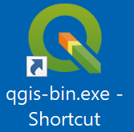
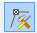

# Creating your first RiverFlow2D application

This section provides a step-by-step guide to help you get started with a RiverFlow2D project using the QGIS interface. The example illustrates the model application to simulate flow in a river with a single inflow upstream and a single outflow downstream. It includes instructions to enter the terrain elevation data, create the mesh, prepare the layers with the input information, and run RiverFlow2D.

## Starting a new project

::: shaded
The files required to follow this tutorial can be extracted from the 'ExampleProjects' zip file under the 'Hoh_QGIS_Metric_Units' folder. This zip file is downloaded separately from your installation materials.
:::

**Files with data required for the example.**

The first step is to start the QGIS  software clicking the QGIS desktop icon { width=0.6cm }. If this icon is not available, you can run the 'qgis-bin.exe' executable on the QGIS 'bin' subdirectory. After loading, you will see a window similar to the one shown below:

**QGIS interface indicating window areas.**

If you don't see the toolbar with the model icons as shown, you will need to activate the plugin using the *Manage and Install Plugins...* command under the *Plugins* menu.

**Plugins window showing activated HydroBID Flood.**

## Start a new project

1.  To create a new RiverFlow2D project, click on the *New RiverFlow2D Project* button { width=0.6cm } in the toolbar. to start a new RiverFlow2D project. A dialog window appears where you select the layers that will be created, the Coordinate Reference System (CRS), and the directory path where the layers will be saved. This example will use the basic layers: *Domain Outline*, *Manning N*, and *BoundaryConditions*

2.  Select *None* in the Layers drop down menu.

3.  Select the *Projection* button. In the *Filter* textbox, type *2855* and select the *Coordinate Reference System* as shown:

    

**Coordinate Reference System Selector dialog window.**

4.  Click OK.

5.  Select EPSG:2855 that corresponds to the NAD83(HARN)/Washington North Coordinate Reference System (CRS):

    

**Create New RiverFlow2D Project.**

6.  Click the { width=0.6cm } button to provide a path to store the project files in the *Project Directory* textbox. This will be the folder where the model will write all results and output files.

7.  After clicking OK, the layer templates are created, and displayed on the *Layers Panel*

    ::: shaded
    The model will use the unit system as that defined in the projection you selected. If the projection has coordinates in feet, units will be set to English. If the projection coordinates are in meters, units will be set to Metric/SI.
    :::

    

**Layers created for the project.**

8.  On the QGIS *Project* menu, click *Save*, to save the project in the same directory that you previously selected in the *Create New Project* dialog above.

## Load elevation data

In this tutorial we will use a raster file that contains the terrain and river bed bottom elevation data in ASCII grid format.

1.  To load an ASCII grid file, click the *Add Raster Layer* button { width=0.6cm }.

2.  In the dialog search for the tutorial folder and select the 'hohdem2.tif' file as shown:

    

**Dialog to create a layer from a raster file.**

3.  While on the dialog, click *Add* and click *Close*.

4.  Use the *Zoom to Layer* button { width=0.6cm } to center the image.

    Once the process is completed, the raster will be displayed on the screen, by default it is rendered in gray gradient as shown.

    

**Digital elevation model in raster format.**

    ::: shaded
    Right-clicking on the label of the new raster layer and selecting *Properties* allows you to change the rendering style for a more informative palette such as *Hillshade* for instance.
    :::

    

**Window to change the raster layer render style.**

    And now the raster layer is displayed with the new palette selected:

    

**Digital elevation model with Hillshade render.**

5.  You should move the raster layer dragging it to the end of the list of layers to avoid that it would hide or interfere visually with the other layers.

## Create the limits of the modeling area

We define the limits of the modeling area drawing a polygon on the *Domain Outline* layer. To create it do as follows:

1.  Click the *Domain Outline* layer to activate it and then click *Toggle Editing* (pencil) in the toolbar

    { width=20% }

2.  This activates the rest of the editing buttons. Now click the *Add Feature* tool which is the bean-looking polygon { width=0.6cm }.

    Proceed to delineate the outline of the polygon by clicking the vertices with the left mouse button.

    ::: shaded
    Make sure that the polygon is contained within the limits of the raster layer since the program will not extrapolate elevations to areas that are outside of the available data on the raster layer.
    :::

3.  To finalize and close the polygon, right-click on the map view area. A dialog window to input the cell size attribute of the newly created polygon will appear. The *CellSize* value for the reference size of the mesh cell is indicated. Enter a value of 20 m.

    

**CellSize defined for the Domain Outline layer.**

    If you want to make any correction in the outline of the created polygon, use the *Node* Tool { width=0.6cm }.

4.  Save the polygon by clicking the *Save* button { width=0.6cm }.

5.  and click on *Toggle Editing* button to deactivate the layer Edit mode { width=0.6cm }

    The *Domain Outline* is now complete.

**Domain Outline layer.**

## Generating the triangular-cell mesh

Now that the *Domain Outline* layer has been created, proceed to create the mesh by clicking on the *Generate Trimesh* button

The following figure shows the generated mesh. You will also see in the Layers panel the new layer: *Trimesh*

**Resulting mesh.**

You can see the mesh generation statistics, and other messages produced by the mesh generation program while creating the mesh in the Log messages panel. This window is accessed from the *View* menu, then by clicking *Panels*.

**Message panel of the registry with GMSH messages.**

## Setting up the boundary conditions

*Inflow boundary conditions:*

1.  Select the *BoundaryConditions* layer in the Layers panel.

2.  Click the *Toggle Editing* button { width=0.6cm } to add the polygons that will indicate the open boundary segments where inflow and outflow conditions are imposed. Draw a polygon at the upper end of the mesh as indicated in the figure:

    

**Polygon that covers the nodes defining the Inflow boundary condition segment.**

3.  To finish the polygon, right-click on desired location. A window to enter the attributes of the newly created polygon is displayed.

4.  In the *Boundary Cond. ID* enter the desired name or leave the default.

5.  From *Type of Open Boundary* list, select *2. Discharge vs. Time*

6.  Click *Import BC File* button, and search for the 'QIN.DAT' hydrograph file as shown below:

    

**Inflow boundary condition parameters.**

    

**Hydrograph loaded from the ‘QIN.DAT‘ file.**

7.  Click *OK* to close the dialog and then click *Save* { width=0.6cm }.

*Outflow boundary conditions:*

1.  Draw the polygon defining the outflow boundary condition at the downstream end of the channel as shown.

    

**Polygon that defines the outflow boundary condition segment.**

2.  Right click to close the polygon. A dialog window will appear to enter the parameters. Select the condition type *Uniform flow conditions* and enter the channel slope. Slope is entered in *So* as shown:

    

**Parameters for the uniform flow outflow open boundary condition.**

3.  Save the changes made to the layer by clicking the *Save* button { width=0.6cm }.

4.  Deactivate editing mode by clicking on the *Toggle Editing* button { width=0.6cm }.

    The figure below shows how the *BoundaryConditions* layer should look:

    

**Polygons that define the inflow and outflow boundary conditions.**

## Assigning Manning's n

To assign Manning's n values, we enter polygons with given n's. There can be as many polygons as those required to reproduce the spatial variability of this parameter. In this example, a single polygon will be drawn for the entire area.

1.  Select the *Manning N* layer and click the *Toggle Editing* button

2.  Draw a polygon that covers the entire domain. The polygon may extend beyond the mesh area as shown:

    

**Capa Manning N.**

3.  Close the polygon by right-clicking on the end vertex and enter a Manning's n equal to 0.035:

    

**Diálogo para ingresar ManningN.**

4.  Click *Save* { width=0.6cm }, and then click the *Toggle Editing* button { width=0.6cm } to deactivate editing mode.

::: shaded
Save the QGIS  project using the *Save* command in the *Project* menu. Name the project file 'Hoh.qgs'.
:::

## Exporting the files

Once the layers with the input data to the model have been created, we need to export data files required to run RiverFlow2D.

1.  In the RiverFlow2d plugin toolbar, click the *Export files for RiverFlow2d* button and select *Export RiverFlow2d ...*

2.  In the export dialog window indicate the *Scenario Name* and the raster layer of the Digital Elevation Model (DEM).

    ::: shaded
    The Scenario name is also the name that will be given to all of the exported files, these names should never be changed manually.
    :::

3.  Click *OK*.

    

**Export RiverFlow2D dialog.**

    A message at the top of the Map area shows the progress of the Export process.

    Once the model files have been created, the Hydronia Data Input Program will appear automatically with the main control data file loaded, in this case: 'Hoh.DAT'.

    Once the model files have been created, the Hydronia Data Input Program will appear automatically with the main control data file loaded, in this case: 'Hoh.DAT'.

    

**Hydronia Data Input Program window.**

4.  Click the *Run RiverFlow2D* button to run the model.

5.  A Dialog box will ask if you want to save changs, no changes were made so select \[No\].

    An image similar to the one shown below should appear:

    

**Window displayed while the model runs.**

Take some time to explore the information included in this window.

This concludes the *Creating your first RiverFlow2D application* tutorial.
