# Hydrologic simulations

The conceptual model of a hydrologic simulation with RiverFlow2D requires a series of non-overlapping polygons where the rainfall/evaporation and infiltration data will be assigned to the mesh. Only areas covered by polygons will receive rainfall or consider infiltration depending on the case. Each Rainfall/Evaporation polygon should be associated with a file containing a rainfall and evaporation time-series file. Similarly, each Infiltration polygon should correspond with a file containing the infiltration calculation method and its parameters for the polygon. The user will need to generate the rainfall and infiltration data files associated with each polygon, and copy them to the project folder prior to running the model.

This tutorial illustrates how to perform a hydrologic simulation accounting for rainfall, evaporation and infiltration. The procedure includes the following steps:

1.  Create the rainfall and evaporation time series data files.

2.  Create the infiltration data files.

3.  Open an existing RiverFlow2D project.

4.  Add the template of the *RainEvap* component layer and the rain/evaporation polygons.

5.  Add the template of the Infiltration component layer and the Infiltration polygons.

6.  Generate the mesh.

7.  Running the model.

8.  Visualize model results.

::: shaded
The files required to follow this tutorial can be extracted from the 'ExampleProjects' zip file under the 'RainfallInfiltrationTutorial' folder. This zip file is downloaded separately from your installation materials.
:::

## Create the rainfall and evaporation time series data file

To run a hydrologic simulation with RiverFlow2D, polygons will be created on which the rainfall/ evaporation data will be applied. The first step is to create the ASCII text files with the rainfall and evaporation time series that will be associated with each polygon. These files can be created with any text editor, such as Notepad or Wordpad. The rainfall/evaporation file has the following format:

Line 1: NPRE `Number of points in the time series of rainfall and evaporation`

Then follows NPRE lines containing:

`Time (hr)`$\quad$`Precipitation intensity (mm/h or in/h)`$\quad$`Evaporation (mm/h or in/h)`

The following table is an excerpt of the 'Rainfall1.dat' file that is included in the folder for this tutorial. In this example, evaporation is assumed to be zero at all times. Figure [11.1](#6-1) shows the graphical representation of the rainfall time series in the 'Rainfall1.dat' file.

`18`

`0.0 0.0 0.0`

`0.08 1.8 0.0`

`0.17 3.5 0.0`

`0.25 7.8 0.0`

`0.33 12.0 0.0`

`0.42 15.0 0.0`

`...`

`1.17 9.0 0.0`

`1.25 4.7 0.0`

`1.33 3.0 0.0`

`1.42 2.4 0.0`

{ width=60% }

## Create the infiltration parameters data file

To take into account infiltration, polygons will be created in which you specify the infiltration calculation method and its corresponding data. The infiltration polygons are completely independent from the precipitation polygons. Each polygon can use a different method with its associated parameters. You will need to create the infiltration ASCII text file for each polygon. These files can be created with any text editor, such as Notepad or Wordpad. The infiltration file is described in detail in the RiverFlow2D Reference Manual. For this tutorial, given that the watershed has an area with natural coverage in the upper area and another with urban use in the lower area of watershed, we will use two infiltration files using the the SCS-CN method to calculate the infiltration. File 'Infiltration1.dat' will be used for the upper watershed, and for the lower urban zone, 'Infiltration2.dat' file. Both files are provided in the folder for this tutorial.

## Open an existing project

1.  Open QGIS

2.  On the *Project* menu click *Open...* and browse to the existing project: 'RainfallInfiltrationTutorial.qgz'. This project contains the information to simulate the rainfall runoff resulting from a 10 yr storm. The layers contained are the following:

    -   Domain Outline

    -   Digital Elevation Model (DEM) in raster format

    -   Aerial photography

    -   Polygons with the Manning's n coefficients

    -   Cross section at watershed outlet

    -   Outflow boundary conditions set to free outflow

    When you open the project you will have an view similar as that shown in Figure *6-2*.

    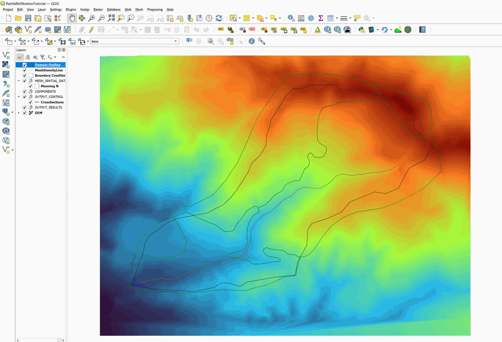{ width=90% }

## Add the *RainEvap* component layer, and the rainfall/evaporation polygons

To add the *RainEvap* where the polygons are drawn with the rainfall and evaporation data, do the following:

1.  To create *RainEvap* layer use the *New Template Layer* button

    { width=0.6cm }

2.  In the window check *RainEvap*, as shown in the Figure below. Then click OK:

    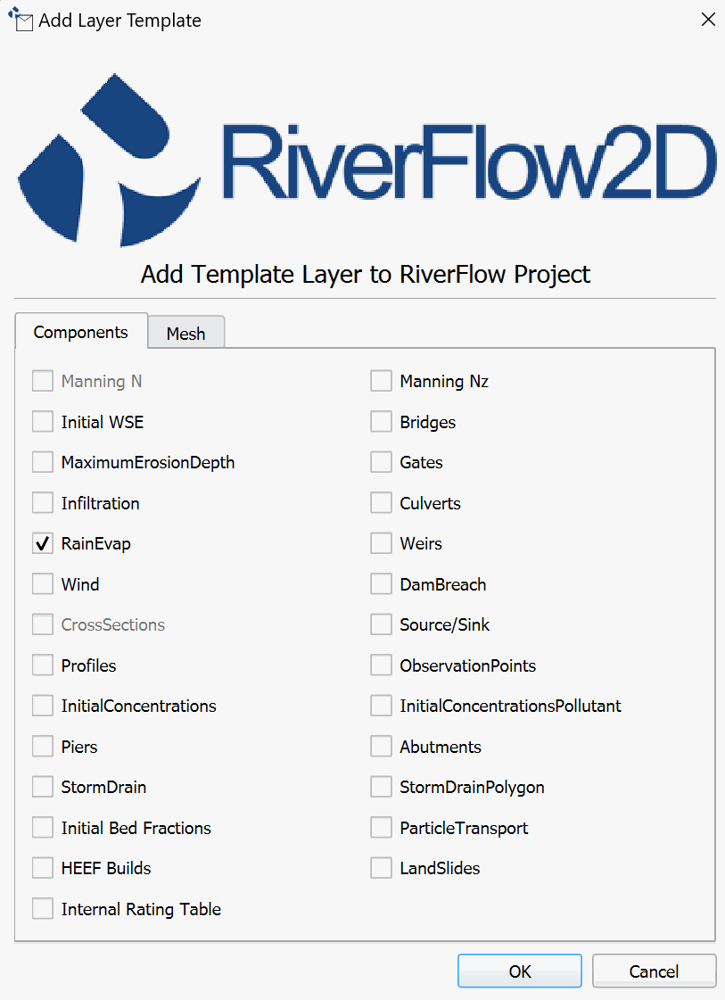{ width=60% }

3.  Edit the *RainEvap* layer: In the layers panel, select the *RainEvap* layer and click on the *Toggle Editing* button in the digitization bar

    { width=0.6cm }

    A pencil icon will appear in the *RainEvap* layer, indicating that the layer is in edit mode:

    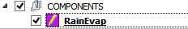{ width=5.2cm }

4.  Draw the polygon that demarcates the spatial distribution of rainfall and evaporation: Using the *Add Feature* tool from the digitalization bar

    { width=0.6cm }

    draw the rainfall/evaporation polygon, as only one file will be used. The polygon should covers the entire *Domain Outline* as shown in the figure below:

    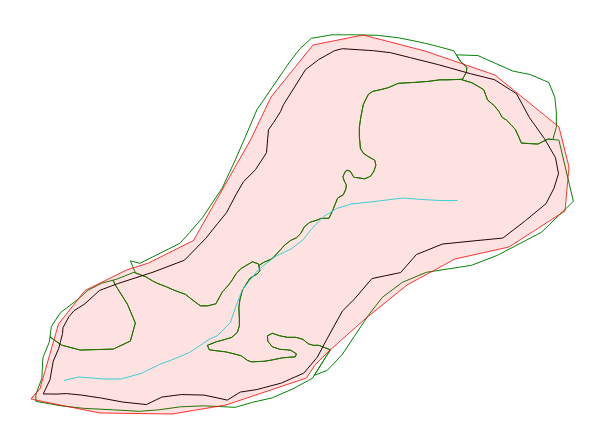{ width=80% }

5.  Right-click to close the polygon. A dialog box will appear to enter the RainEvap Feature Attributes.

6.  Input the parameters or attributes of the RainEvap polygon: Click on the browse \[...\]button and select the 'Rainfall1.dat' file in the scenario folder.

7.  Save the changes in the RainEvap layer and click the pencil icon to disable editing mode.

## Add the *Infiltration* component layer, and the Infiltration polygons

To add the infiltration information, do as follows:

1.  To create the *Infiltration* layer y use the *New Template Layer* button

    { width=0.6cm }

2.  In the dialog select Infiltration, as shown in the Figure below:

    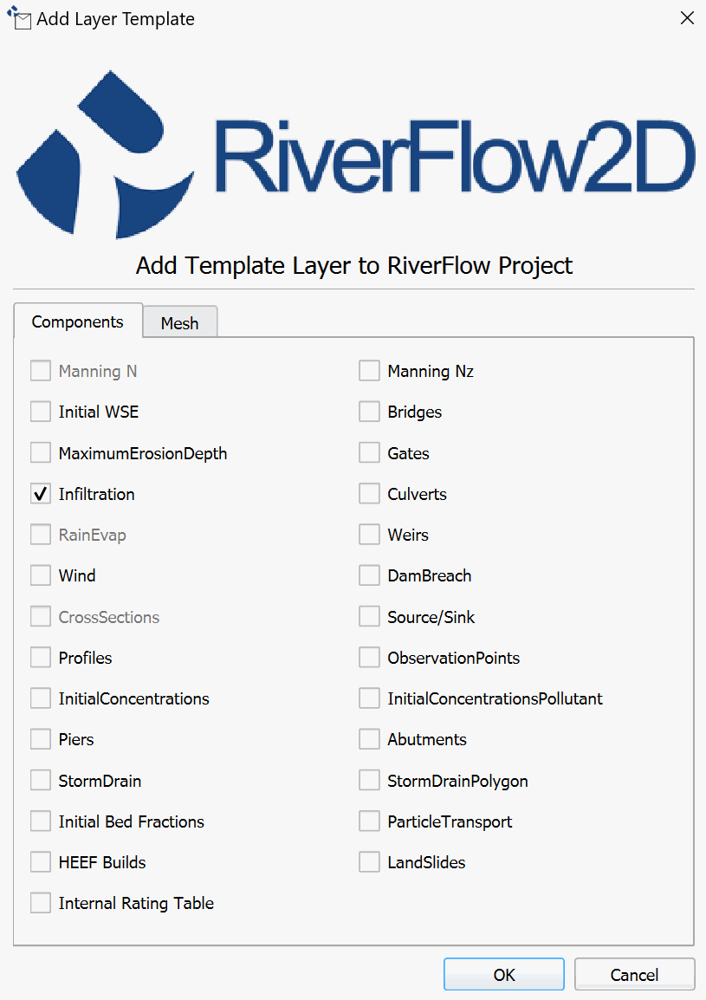{ width=60% }

3.  Edit the *Infiltration* layer: In the layers panel, select the *Infiltration* layer and click on the *Toggle Editing* button.

    { width=0.6cm }

    A pencil will appear in the *Infiltration* layer, indicating that the layer is in edit mode:

    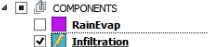{ width=5.2cm }

4.  Draw the polygon that demarcates the spatial distribution of the infiltration: Using the tool Add Feature tool of the digitalization bar, draw the infiltration polygons

    { width=0.6cm }

    Figure [11.6](#6-6) shows the polygons that define the two infiltration zones of the watershed that are based on the land use and vegetation cover.

    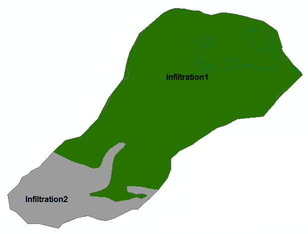{ width=72% }

5.  Draw a polygon for the *infiltration2* area trying to maintain the shape as indicated in the previous figure and that protrudes from the polygon of the Domaine Outline as shown in the figure below:

    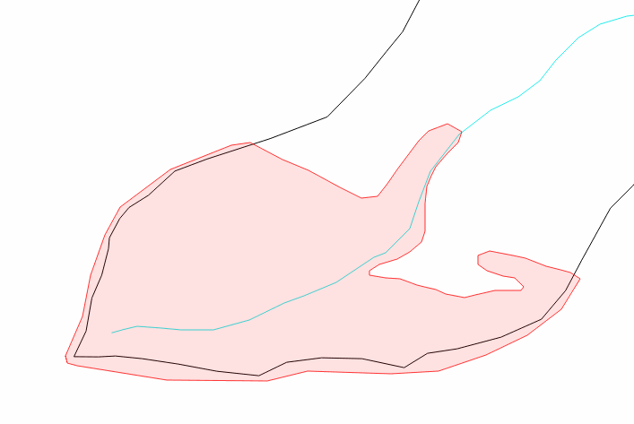{ width=72% }

6.  Once completing the polygon, the dialog to input the parameters opens. Browse to the input file *Infiltration2.txt*, as shown below:

    { width=65% }

7.  To draw the second polygon corresponding to *infiltration2* use the snapping option as shown in the section *Advanced Digitalization/Snapping Tutorial* and there should be a polygon like the one shown in the following figure:

    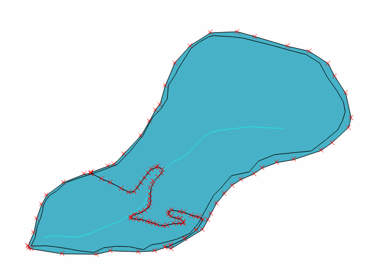{ width=72% }

8.  Once finished drawing the polygon, enter the file name 'Infiltration1.txt' as shown:

    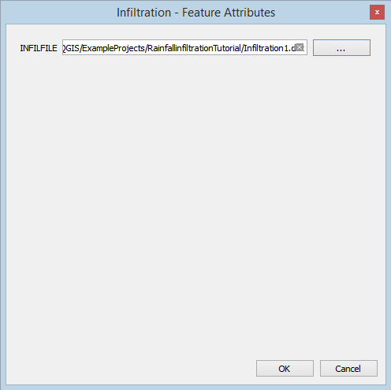{ width=55% }

## Generate the mesh

The mesh is generated using the *Generate TriMesh* icon

{ width=0.6cm }

Figure [11.11](#6-11) shows the resulting mesh of about 70,000 cells.

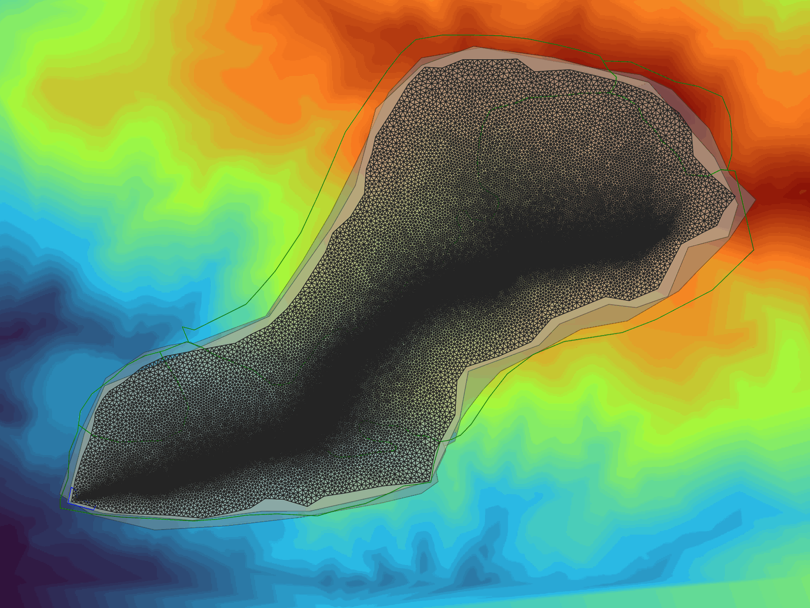{ width=80% }

## Exporting files to RiverFlow2D

Now that once you have generated the mesh and the other layers are ready with the necessary data, you should export the files in the format required by RiverFlow2D. We will use the *Export RiverFlow2D* icon.

1.  Click on the *Export RiverFlow2D* icon.

    { width=0.6cm }

    When running the export command, you need to select the raster layer that contains the Digital Elevation Model (DEM). The name of the current scenario will already be indicated in the dialog.

    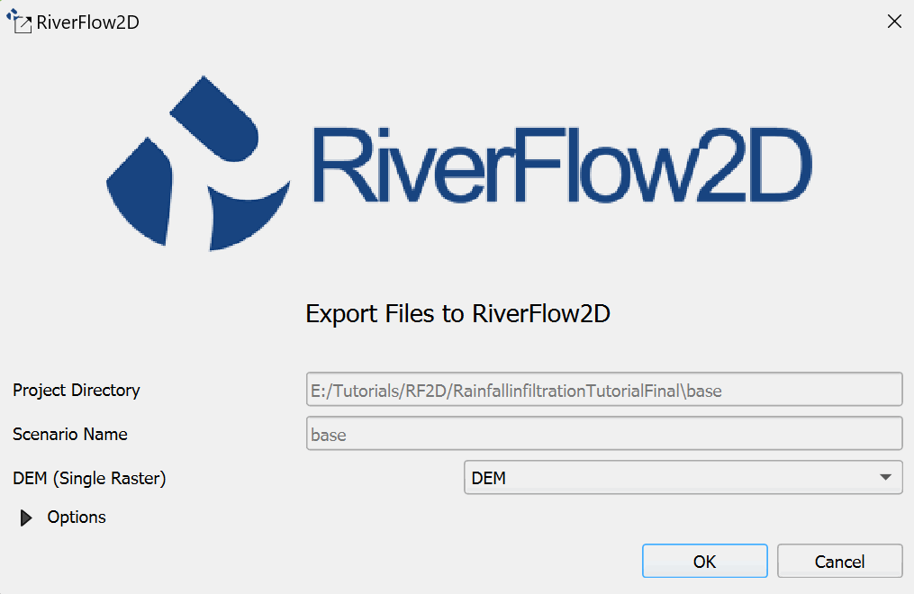{ width=60% }

2.  Click on the \[OK\] button and the export process will begin. Once finished, the RiverFlow2D program will be loaded with the 'base.DAT' file.

## Running the model

After exporting the files, the Hydronia Data Input Program  is loaded with the project file from the 'base.DAT' example and shows the *Control Data* panel as illustrated in Figure [11.13](#6-13)

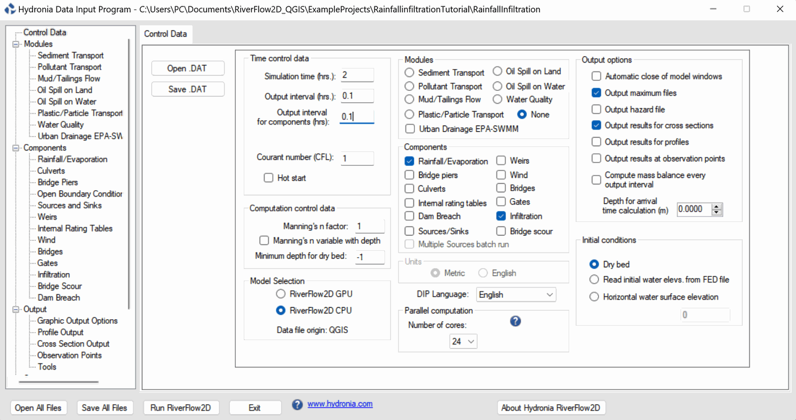{ width=90% }

As shown above, the Rainfall Components Evaporation/Infiltration are selected in the data panel.

1.  Under *Time control data* set the *Output interval for components (hrs)* to 0.1.

    ::: shaded
    If you have an nVidia GPU installed, you may select the *RiverFlow2D GPU* radial button under *Model Selection* to accelerate the model execution
    :::

2.  Click \[Save .DAT\] to overwrite the existing 'base.dat' file.

3.  Select *Rainfall/Evaporation* of the *Conponents* section in left-hand panel.

    The rainfall data contained in the 'rainfall1.txt' file will appear (Figure [11.14](#6-14)). In the *Infiltration* panel the data contained in the *Infiltration1* and *Infiltration2* files is shown (Figure [11.15](#6-15)).

    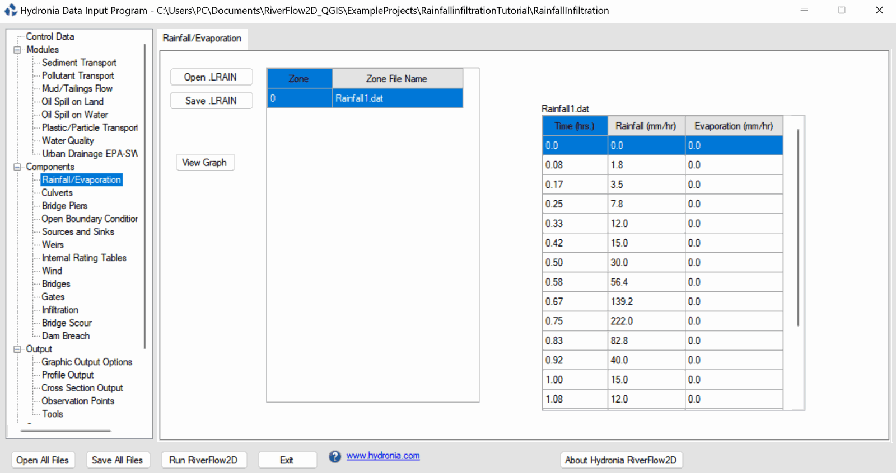{ width=90% }

    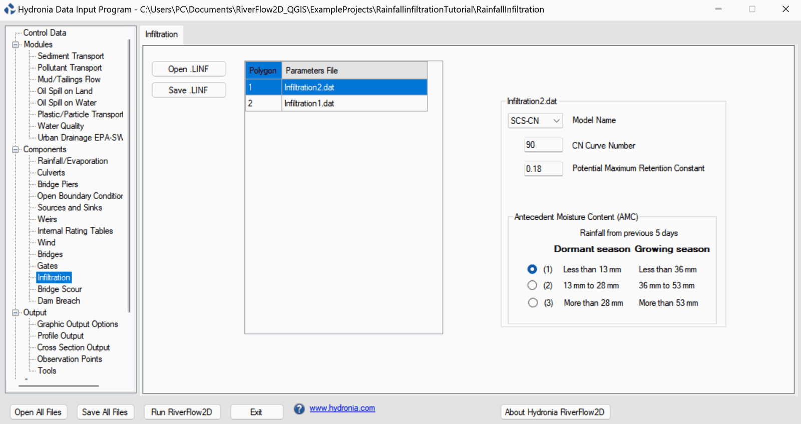{ width=90% }

4.  Leave all other parameters at their default values.

5.  To run the model, click on the *Run RiverFlow2D* button. A window will appear indicating that the model began to run. The window also report the simulation time, volume conservation error, total input and output discharge, and other parameters as the execution progresses (Figure [11.16](#6-16)).

    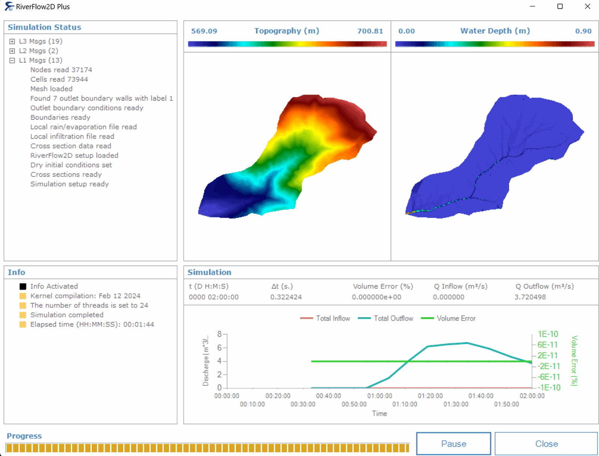{ width=80% }

## Utilizing the Cross Section Tool to review output files

1.  In QGIS, click on the *Cross Section* icon.

    { width=0.8cm }

2.  The Cross Sections panel will appear on the bottom of the QGIS interface.

    The outflow hydrograph can be visualized using the cross section tool as shown in Figure [11.17](#6-17):

    { width=90% }

This concludes the *Hydrologic simulations* tutorial.


