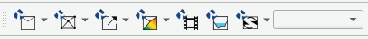
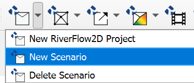
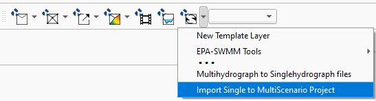
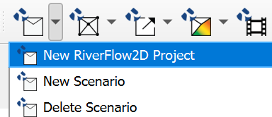
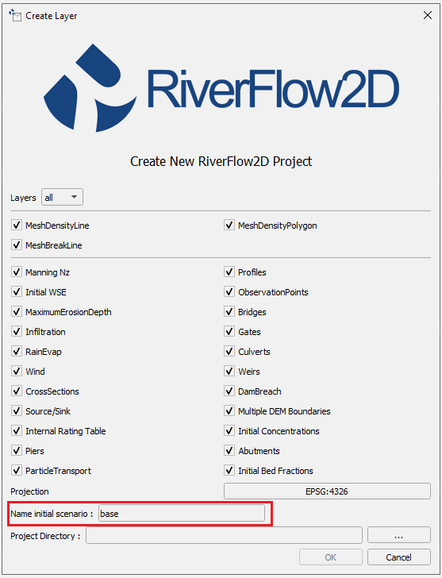
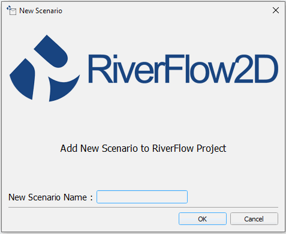
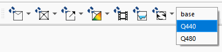
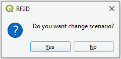
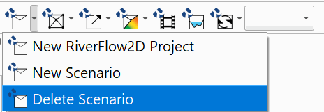
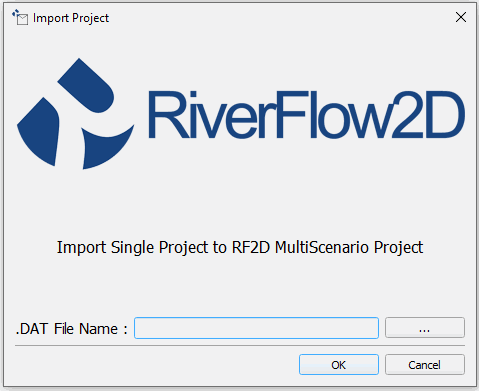

# Multiple Scenario Project Tool

When establishing a mathematical model of a system, it is very common to perform a variety of runs with different values of the most significant parameters to see their effects. In some cases, it is also useful to have the model run the scenario without a project and within a project. In previous versions of the plugin this had to be done in separate QGIS projects, which involved making copies of the project folders and data, which can bring problems with data handling and access. This new version of the RiverFlow2D  plugin for QGIS allows the management of multiple scenarios within the same project. In this way variants of the same model can be created as subprojects, thus bringing with it the advantage of having all the variants organized in the same project which facilitates access and management of information. The following describes the new features of the QGIS interface for RiverFlow2D  that allow the handling of multiple scenarios.

## New interface elements for managing multi-scenario projects in RiverFlow2D  

This section provides a description of the new elements in the QGIS user interface for handling RiverFlow2D  multi-scenario projects. The RiverFlow2D  toolbar now features three new items:

-   A drop-down list that shows the user the list of scenarios contained in the project.

-   An option to generate new scenarios in the *New RiverFlow2D  Project* button.

-   An option in the RiverFlow2D  tools menu that allows you to import an existing RiverFlow2D  project into the multi-scenario mode.

The figures below show the three new elements.

{ width=70% }

{ width=50% }

{ width=70% }

## Creating a new RiverFlow2D  multiple-scenario project using QGIS

-   To create a new project into a multi-scenario project, access the first button on the toolbar and select the *New* *RiverFlow2D  Project* menu option as shown in the figure below:

{ width=50% }

The dialog window a field is presented to indicate the name of the initial scenario (highlighted in a red box in the figure below), by default this field is labeled *base*. The drop-down list for displaying scenario names is limited in length, we recommend that you assign short names to scenarios for ease of viewing and to assign names without spaces.

{ width=70% }

When creating a multi-scenario project, within the folder selected for the project a subfolder is created with the name given to the initial scenario, (in this example the folder name *base*)and within that sub-folder another subfolder is created with the name *shape* where QGIS creates the templates of the layers used by the model for that scenario. Each other scenario will have its own *shape* subfolder that contain the layers for that particular scenario.

## Create a new scenario

Once we have a project created with the new Multi-scenario tool, we can start to create additional scenarios by following the steps in this section. *Please make sure to have either created a new project with the tool or have already converted an existing project before doing the following.*

-   To create a new scenario, access the first button on the toolbar and select the *New Scenario* menu option as shown in the figure below:

    

{ width=50% }

-   A window will be presented, input the scenario name keeping in mind to use short names without spaces.

    

{ width=70% }

    The new scenario is based on the layers with the input data of the current scenario. The plugin will proceed to create a subfolder with the name of the new scenario within the project folder. In this folder the files corresponding to the layers of the RiverFlow2D project will be copied with the input geospatial information it requires. Please note that the model layers will not copy post-processing products such as maps or animations. The plugin then updates the paths of the sources of the layers to the files in the new folder and finally the drop-down list in the RF2D toolbar is updated with the name of the new scenario.

## Switching scenarios

-   To switch between the different scenarios that you have in a project, simply display the scenario list located in the RF2D toolbar and select the desired scenario as shown in the following figure:

    

{ width=50% }

-   Then a Dialog window will ask for confirmation to switch scenarios, as shown in the figure:

    

{ width=50% }

    When you switch scenarios, the state of the layers in the current scenario is automatically saved.

## Deleting scenarios

To safely delete scenarios, the tool also contains a menu option to delete them when needed:

-   Use the button below the New RiverFlow2D  Project dropdown, and select Delete Scenario:

{ width=60% }

*\*IMPORTANT\* Please note that deleting a scenario folder manually from the project directory will cause the entire project to be unusable. This tool must be used in order to avoid this.*

## Import an RiverFlow2D  project into Multi-scenario mode

The RiverFlow2D  Multi Scenario tool has a feature that allows you to import an existing project(mono-scenario) and convert it to a maulti-scenario project.

-   Open this tool in the options menu of the RF2D Tools button as shown in the figure below:

    

{ width=70% }

-   When you start the import tool a window is displayed as illustrated in the figure below, you must specify the project file. DAT to import.

    

{ width=70% }

-   Once you click \[OK\], a subfolder with the name of the file is created inside the folder where the original project is located.

-   All files and sub directories in that main project folder are copied, and the metadata of the project *QGZ* is updated with the new location of the layers.

-   Finally the drop-down list on the RF2D toolbar is updated with the name of the new scenario.

The files of the original project are kept in the project folder, it is at the discretion of the user delete it if you think it necessary, the only one that is required then is the QGIS project file (.qgz) This concludes the tutorial on using the Multiple Scenario Project tool within the QGIS RiverFlow2D  toolbar.
