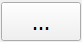
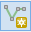
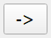
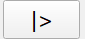

# Simulating a tailings dam failure with RiverFlow2D MT

This tutorial will show how to set up a tailings dam failure simulation with the RiverFlow2D model with the Mud and Tailings Flow Module (MT) using the QGIS interface. The exercise consists of modeling a tailings dam failure flood and creating results maps for the impacted areas. The data is based on the Brumadinho dam disaster occurred on 25 January 2019 when a tailings dam at the CA3rrego do FeijAśo iron ore mine, east of Brumadinho town, in Minas Gerais, Brazil, suffered a catastrophic failure.

::: shaded
The files required to follow this tutorial can be extracted from the 'ExampleProjects' zip file under the 'BrumadinhoRF2D' folder. This zip file is downloaded separately from your installation materials.
:::

**Files with data required for the example.**

## Start a new project for a tailing dam break simulation

1.  To create a new RiverFlow2D project, open QGIS and click on the *New RiverFlow2D Project* button { width=0.6cm } in the toolbar. A dialog window appears where you select the layers that will be created, the name of the *Senario*, the *Coordinate Reference System (CRS)*, and the directory path where the layers will be saved. This example will use the layers: *Domain Outline*, *Manning N*, *BoundaryConditions*, *MeshDensityLine*, and *InitialConcentrations*.

2.  Select *None* in the Layers drop-down menu, then click the *MeshDensityLine* and the *Initial Concentrations* check boxes.

3.  Click the *Projection* button and in the *Filter* text box, type *31983* and select the *Coordinate Reference System* and click OK as shown:

    

**Coordinate Reference System Selector dialog window.**

4.  Click the { width=0.7cm } button to provide a path to store the project files in the *Project Directory* text box. This will be the folder where the model will write all results and output files. Browse to the tutorial directory in the location where the files were extracted, in the 'BrumadinhoRF2D'  folder, then click Select folder. The dialog window should look like the following:

    

**Create new project window.**

5.  After clicking OK, the layer templates are created, and displayed on the *Layers Panel*

    

**Layers created for the project.**

    ::: shaded
    On the QGIS *Project* menu, click *Save*, to save the project in the same directory that you previously selected in the *Create New Project* dialog above.
    :::

## Load elevation data

In this tutorial we will use two *Digital Elevation Model* or *DEM* raster files that contain the terrain elevation data and tailings dam volume data.

1.  To load the DEMs, click the *Add Raster Layer* button { width=0.6cm }. You may also use the QGIS shortcut *Control+Shift+R*.

2.  In the dialog search for the tutorial folder and select the 'RasterBRUMADINHO.tif' and 'RasterDAM10.tif' files as shown:

    

**Dialog to create a layer from a raster file.**

3.  Click *Add* and then *Close*.

4.  Click on the *RasterBRUMADINHO* layer. Use the *Zoom to Layer* button { width=0.6cm } to center the image.

    The raster will be displayed on the screen, by default it is rendered in gray gradient as shown.

    

**Digital elevation model in raster format.**

    Right-clicking on the label of the new raster layer and selecting *Properties*, in the *Symbology* panel you can change the *Render type* for a more informative palette such as *Hillshade* for instance.

    

**Digital elevation model with Hillshade render.**

::: shaded
You may move the raster layer by dragging it to the end of the list of layers to avoid that it would hide or interfere visually with the other layers.
:::

## Create the limits of the modeling area

We define the limits of the modeling area drawing a polygon on the *Domain Outline* layer. To create it do as follows:

1.  Click the *Domain Outline* layer to activate it and then click *Toggle Editing* (pencil) in the toolbar { width=0.6cm }

2.  Click the *Add Polygon Feature* tool { width=0.6cm }. Proceed to delineate the outline of the polygon by clicking the vertices with the left mouse button.

3.  To finalize and close the polygon, right-click on the map view area. A dialog window to input the cell size attribute of the newly created polygon will appear. The *CellSize* value for the reference size of the mesh cell is indicated. Enter a value of 50 m.

    The Domain Outline should look similar to the following figure:

    

**Domain Outline polygon.**

4.  Save the polygon by clicking the *Save Layer Edits* button { width=0.6cm }.

5.  Click on *Toggle Editing* button to deactivate the layer Edit mode { width=0.6cm }

## Create more detail for the mesh down the main flow area

Once the *Domain Outline* is created, a *Mesh Density Line* will provide the necessary detail down the main channel for more accuracy.

1.  Select the *MeshDensityLine* layer making sure it is activated as shown

    <figure>
    
    </figure>

    and click the *Toggle Editing* button { width=0.6cm }.

2.  Click the *Add Line Feature* { width=0.6cm } button then Left-click to draw the points down the middle of the channel all the way to the river entrance at the bottom of the *Domain Outline*.

3.  Right-click to finish the line. A dialog requesting input for the *MeshDensityLine Feature Attributes* will appear. Input *25* as the *CellSize* for the *MeshDensityLine* layer. The first line should look as follows:

    

**First mesh density line.**

    Another line will need to be drawn to finish adding detail down the main path on the river in the south.

4.  Click the *Add Line Feature* { width=0.6cm } button then Left-click to draw the points starting from the the south-western part of the *Domain Outline* along the riverbed and right-click to finish the line, joining it to the first line as follows:

    

**Second mesh density line.**

5.  Right-click to finish the second line. A dialog requesting input for the *MeshDensityLine Feature Attributes* will appear. Input *25* as the *CellSize* for the *MeshDensityLine* layer.

6.  Save the polygon by clicking the *Save Layer Edits* button { width=0.6cm }.

7.  Click on *Toggle Editing* button to deactivate the layer Edit mode { width=0.6cm }

    The finished *MeshDensityLine* layer should look as follows:

    

**Finished MeshDensityLine layer.**

## Generating the triangular-cell mesh

Now that the *Domain Outline* and *Mesh Density Line* layer have been created, proceed to generate the mesh by clicking on the *Generate Trimesh* { width=0.6cm } button.

The following figure shows the generated mesh. You will also see in the Layers panel the new layer: *Trimesh*

**Triangular mesh generated for the tailings dam break tutorial.**

## Setting up the boundary conditions

Here we will explain how to enter boundary conditions that are needed in any inflow or outflow sections of the model area where flow can enter or leave the mesh. In this tutorial we will have one inflow and one outflow condition.

We first enter the inflow boundary condition imposing a hydrograph (discharge vs time).

1.  Select the *BoundaryConditions* layer in the Layers panel.

2.  Click the *Toggle Editing* button { width=0.6cm } to add the polygons that will indicate the open boundary segments where inflow and outflow conditions are imposed. Draw a polygon at the bottom end of the mesh as indicated in the figure:

    

**Polygon that covers the nodes defining the Inflow boundary condition segment.**

3.  To finish the polygon, right-click on desired location. A window to enter the attributes of the newly created polygon is displayed.

    ::: shaded
    The exact form of the polygon is not important. You only need to make sure that the polygon covers the segment length at which you want to impose the condition. All cells falling within that polygon will be open boundary cells.
    :::

4.  In the *Boundary Cond. ID* enter the desired name or leave the default.

5.  Select *2. Discharge vs. Time* from the *Type of Open Boundary* list.

6.  Click *Import BC File* button, and search for the 'inlet1.QVT' hydrograph file as shown below:

    

**Inflow boundary condition parameters.**

    

**Hydrograph loaded from the ‘inlet1.QVT‘ file.**

7.  Click *OK* to close the dialog and then click *Save Layer Edits* { width=0.6cm }.

::: shaded
All boundary condition files, such as 'inlet1.QVT' in this tutorial, need to be in the same directory as all the other project files.
:::

Now we will enter an free outflow condition where the fluid will be let to flow out from the mesh.

1.  Click the *Add Polygon Feature* tool { width=0.6cm }. Proceed to delineate the outline of the polygon by clicking the vertices with the left mouse button. Draw the polygon defining the outflow boundary area at the downstream end of the river as shown:

    

**Polygon that defines the outflow boundary condition segment.**

2.  Right click to close the polygon. A dialog window will appear to enter the parameters. Select the condition type *Uniform flow condition* and set So to 0.005. The dialog should look like the following:

    

**Parameters for the free outflow open boundary condition.**

3.  Save the changes made to the layer by clicking the *Save Layer Edits* button { width=0.6cm }.

4.  Deactivate editing mode by clicking on the *Toggle Editing* button { width=0.6cm }.

    The figure below shows how the *BoundaryConditions* layer should look:

    

**Polygons that define the inflow and outflow boundary conditions.**

## Assigning Manning's n

Manning's n is the parameter determining the bed roughness. The model requires that all cells in the model area have a defined n. In a project application we should have n's that vary through the mesh since variable vegetation and terrain characteristics will have different roughness. However, for simplicity, in this tutorial we will assume a single n.

1.  Select the *Manning N* layer and click the *Toggle Editing* button { width=0.6cm }.

2.  Click the *Add Polygon Feature* { width=0.6cm } to draw a polygon that covers the entire domain. The polygon may extend beyond the mesh area as shown:

    

**Manning N layer.**

3.  Close the polygon by right-clicking on the end vertex and enter a Manning's n equal to 0.035:

    

**Dialog to input ManningN.**

4.  Click *Save Layer Edits* { width=0.6cm }, and then click the *Toggle Editing* button { width=0.6cm } to deactivate editing mode.

## Providing the Initial Concentrations for the tailings material

The RiverFlow2D  MT model allows defining initial volume concentrations that vary in space. In order for the model to assign this initial state, one or more polygons must be drawn over the tailings raster or initial water surface elevation polygon. This polygon will then be assigned a data table attribute that gives the concentrations for each sediment class.

1.  Select the *InitialConcentrations* layer in the *Layers* and click the *Toggle Editing* { width=0.6cm } button

2.  Click the *Add Polygon Feature* { width=0.6cm } button and draw the polygon, keeping within the edges of the *RasterDAM10* raster:

    

**Initial Concentrations polygon.**

3.  An *InitialConcentrations - Feature Attributes* dialog will appear. On the *Initial Concentrations File* line click the { width=0.7cm } Browse button to select the 'Deposit_Initial.txt' file from the project folder '\\ExampleProjects\\BrumadinhoRF2D\\base\\' folder and then click *OK*.

4.  The dialog should look like the following:

    

**Initial Concentrations - Feature Attributes dialog.**

5.  Save the changes made to the layer by clicking the *Save Layer Edits* button { width=0.6cm }.

6.  Click the *Toggle Editing* { width=0.6cm } button to disable editing mode.

::: shaded
Save the QGIS  project using the *Save Project* button or by using the *Project* menu. Name the project file 'Brumadinho.qgs'.
:::

## Exporting the project from QGIS to RiverFlow2D

Once the layers with the input data to the model have been created, we need to export data files required to run RiverFlow2D.

1.  In the RiverFlow2D plugin toolbar, click the *Export files for RiverFlow2D* button and select *Export RiverFlow2D ...*

2.  In the export dialog window indicate the *Project Name*, *Brumadinho* in this tutorial.

3.  In the drop-down menu for *DEM Single Raster* select *RasterBRUMADINHO*

4.  Click on the *Options* arrowhead to view the additional parameters for the export.

5.  under *DEM (Single Raster)* make sure *RasterBRUMADINHO* is selected in the dropdown menu.

6.  Click to enable the checkbox for *Using Initial WSE Raster Layer*, then on the drop down menu select the *RasterDAM10* as your *InitialWSE* layer.

    Your *Export RiverFlow2D* dialog window should look like this:

    

**Parameters for the Export to RiverFlow2D dialog.**

7.  Click *OK*.

## Configure final model parameters in the Hydronia Data Input Program [(]{.nodecor}DIP[)]{.nodecor}.

Once the model files have been created, the Hydronia Data Input Program will appear automatically with the main control data file loaded, in this case: 'Brumadinho.DAT'.

### Control Data Panel

The following parameters will need to be changed as indicated:

1.  In the *Control Data* panel under the *Time control data* section, Set the *Output interval [(]{.nodecor}hrs.[)]{.nodecor}:* to *0.01*.

2.  In the *Modules* section click the *Mud/Tailings Flow* radial button.

    ::: shaded
    \*Optional\* If you have an nVidia graphics card installed on the system, you can enable the *RiverFlow2D GPU* under the *Model Selection* section to accelerate the computation speed for the simulation.
    :::

    The *Control Data* panel should look like the following:

    

**Hydronia Data Input Program window with Control Data parameters for the tailings dam break tutorial.**

3.  Click the *Save .DAT* button. Click Save again in the dialog box and click *Yes* to replace the existing file.

### Mud/Tailings Flow Panel

The *Mud/Tailings Flow* module needs to be configured with the tailings properties and other rheological parameters. Please do the following:

1.  Click on the *Mud/Tailings Flow* on the left side panel to activate it.

2.  In the *Mud/Tailings Flow* panel, click the *Open .MUD* button.

3.  A dialog will appear asking for a file ending with the '.MUD' extension. Browse for the file '\\ExampleProjects\\BrumadinhoRF2D\\base\\brumDam.MUD' and click *Open*.

    You will now see that the panel has changed most of the parameters. More importantly, the *Variable properties-Erosion-Deposition Model* has been enabled, and there are six sediment classes loaded. Take some time to familiarize yourself with the parameters.

    The parameters that have been loaded need to be saved with the same name as the project name so that the model will use it upon execution.

4.  Click the *Save .MUD* button and the Scenario name 'base.MUD' should already be set. Click *Save*.

    The *Mud/Tailings Flow* panel should look like the following:

    

**Hydronia Data Input Program window with Mud/Tailings Flow parameters for the Brumadinho Tutorial.**

    ### Providing the Viscosity and Yield Stress data for Variable properties-Erosion-Deposition Model

    When selecting to use the *Variable properties-Erosion-Deposition Model* in this tutorial, data tables for the volume concentrations relationship with Viscosity and Yield Stress need to be provided. These files are already prepared for this tutorial, and must be copied into the Scenario folder as follows:

    1.  In File Explorer browse to the location of the project folder '\\ExampleProjects\\BrumadinhoRF2D\\'

    2.  Select the following files from the folder: 'YieldStressVsCv3.txt, ViscosityVsCv3.txt'

    3.  Copy the files into the Scenario folder '\\ExampleProjects\\BrumadinhoRF2D\\base\\'

    ### Updating the Inflow Boundary Condition File

    It is critical to update the *Open Boundary Conditions* data file with additional columns of data that represent the new sediment classes. By default this file contains a table of time and discharges, but the model requires for all inflow conditions the volume concentration for each sediment or material class. In case of water flow, all concentrations must be set to 1. To update it do the following:

5.  Click on the *Open Boundary Conditions* under *Components* in the side panel of the Hydronia Data Input Program.

6.  Click on the cell in the first table that contains the 'inlet1.QVT' variable:

    

**Section containing table with Boundary Conditions set for this run.**

    Upon clicking the cell, a dialog box should appear that will allow us to automatically update the existing data table in the 'inlet1.QVT' file with the additional rows needed, and setting each to 0:

    

**Dialog for correcting the Boundary Conditions file automatically.**

7.  Click *Yes* to update the 'inlet1.QVT' file.

    You can verify the contents have been updated by scrolling to the right in the file contents section or by opening the '\\ExampleProjects\\BrumadinhoRF2D\\base\\inlet1.QVT' file in Windows Explorer. Your Inlet1.QVT file should look like the following figure:

    

**Contents of the updated Inlet1.QVT file.**

## Running the model

The simulation is now ready to run. Proceed as follows:

1.  Click on *Control Data* in the side panel of the DIP and then click the *Run RiverFlow2D* button at the bottom.

2.  The DIP will ask to save changes to the .DAT file, click *No*.

    A few windows should appear, the last one will be the graphical model windows that displays the status of the model. When the model is finished running, it should look as follows:

    

**RiverFlow2D model execution window.**

3.  Click Close and let the program finish writing the remaining output files.

## Generating maps for the Mud/Tailings Flow module

Once the model has finished running we can create maps for various outputs. This tutorial will focus on some of the specific maps that can be generated once the Mud/Tailings module with variable properties-erosion deposition enabled.

1.  In QGIS , in the RiverFlow2D plugin toolbar, click on the drop down menu for *Results vs Time Maps* and select *Concentrations and Properties vs Time Maps*

    

**Concentrations and Properties vs Time button in RiverFlow2D Plugin toolbar.**

    The *Concentrations and Properties vs Time Maps* window will provide maps for each *Sediment class*, labeled *Conc\_#* under the *Maps subsection*. Users can also create maps for each of the variables in the list.

2.  Select one of the *Maps*, then select an *Output Times* of interest. You can hold *Control* key while clicking on multiple *Maps* and / or *Output Times*.

3.  Once all outputs of interest are selected, click on the *Right Arrow* button { width=0.6cm } to move them to the *Output Maps* subsection.

    

**Concentrations and Properties vs Time Maps window.**

4.  Click the OK button to generate the maps.

    The *Layers* panel on the left side will have a group named *OUTPUT RESULTS* where the resultant map or maps will be placed.

**Results map of Conc_1 at hour 2.**

Repeat these steps to create maps for each of the concentrations if desired.

## Generating animations for the Mud/Tailings Flow module

An animation can best illustrate the mud / tailings flow over time. This section will show how to generate results for the specific variable properties-erosion deposition enabled model outputs.

::: shaded
On the QGIS *Project* menu, click *Save*, to save the project in the same directory that you previously selected in the *Create New Project* dialog above. This is required for the *Animations* panel to function.
:::

1.  Start by activating the *Animations* panel in the RiverFlow2D plugins toolbar { width=0.6cm }

    A panel will appear below the *Layers* panel on the bottom left.

2.  Click on the *Select layer* drop-down menu and select *Mud/Tailings Flow*.

3.  Click *Add Layer*. A dialog box will appear asking for the specific Animation we would like to create:

    

**RF2D Animation dialog window.**

4.  Click on the drop-down menu to see the available outputs. They will be the same as the ones from *Concentrations and Properties vs Time Maps* plugin.

5.  Choose any of these and click OK.

6.  Select the output range desired, or just leave the default for the entire range of output intervals. Click OK

    There is a status bar underneath the *Select layer* drop-down showing the progress of the animation generation. When it is finished, the layer previous choice of animation will appear in the box underneath the status bar.

    

**RF2D Animation panel indicating the status bar and generated animation layer.**

7.  Click and hold to drag the newly created *ANIMATION* group in the *Layers* panel and move it above the Raster layers so that the animation will be visible.

8.  Click on the layer that was generated in the *RiverFlow2D Animation* panel then click the *Play* button { width=0.6cm } to view the animation.

    Repeat these steps to create animations for each of the concentrations if desired.

This concludes the tutorial for Simulating tailings dam Failures utilizing the Mud/Tailings Flow module in RiverFlow2D.


