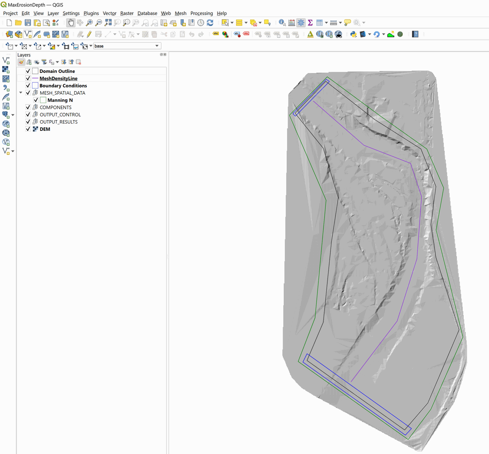
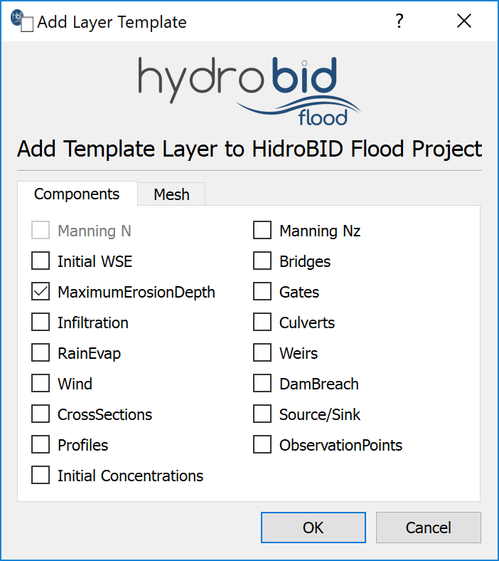
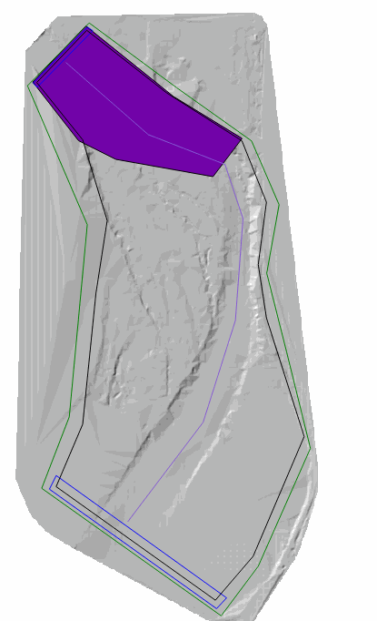
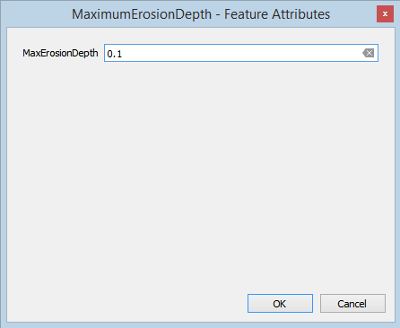
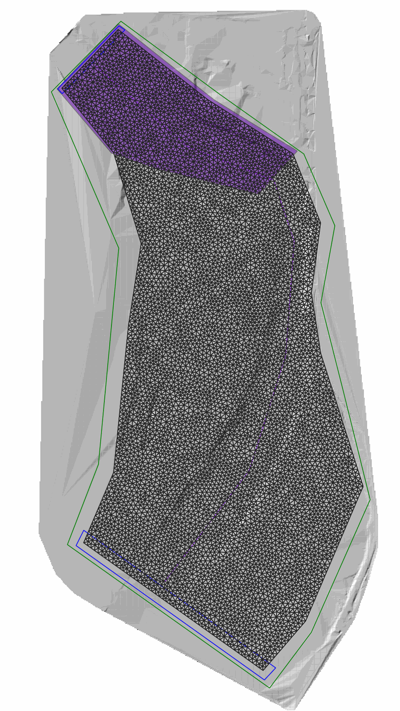
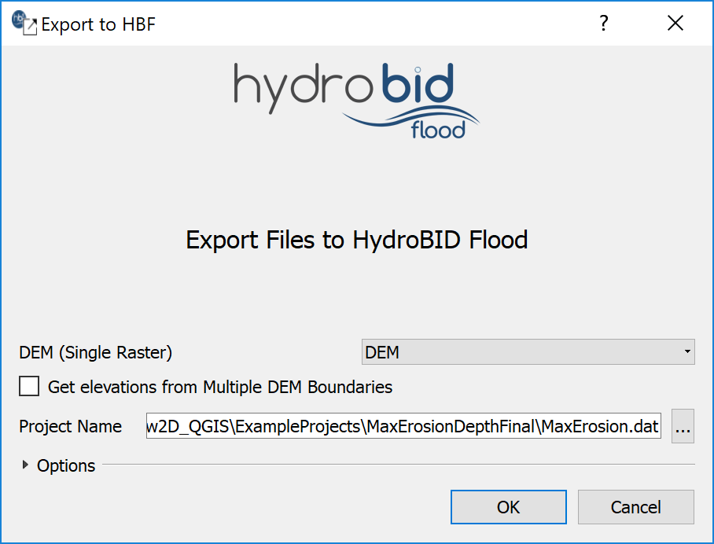
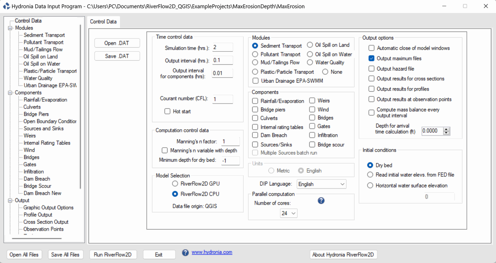
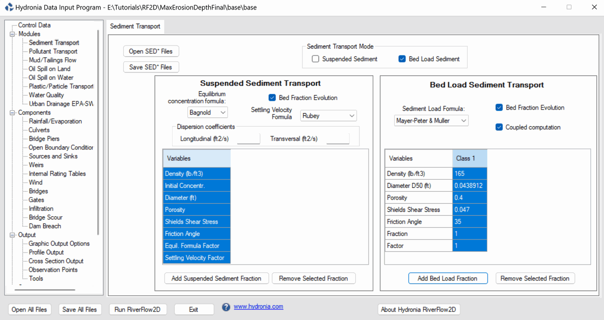
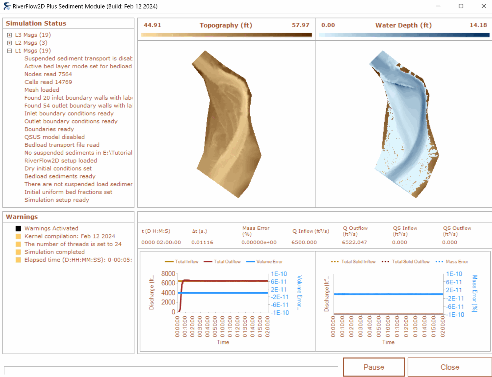
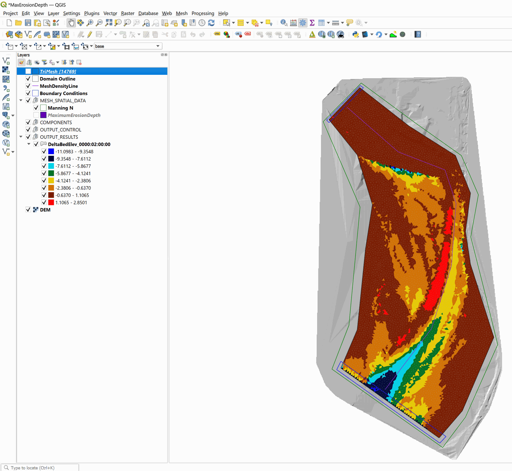

# Simulating bed load sediment transport with limited erosion bed areas

In the Sediment Transport model you can define areas with a maximum erosion depth. This is useful to represent pavements, rock outcrops or any surface that does not erode or that it has a known erodible layer of sediment above it. This tutorial illustrates how to perform a sediment transport simulation in which there is a non-erodible area using the QGIS interface. The procedure includes the following steps:

1.  Open an existing RiverFlow2D  project.

2.  Create a 'MaximumErosionDepth' layer and the polygons that define the limited erosion areas.

3.  Generate the mesh.

4.  Running the model.

::: shaded
The files required to follow this tutorial can be extracted from the 'ExampleProjects' zip file under the 'MaxErosionDepth' folder. This zip file is downloaded separately from your installation materials.
:::

## Open an existing project

1.  Open QGIS

2.  In the main menu go to *Project* $\rightarrow$ *Open...* browse to the existing tutorial folder: .

This project contains the layers of the domain outline, of the digital elevation model DEM of the river bed in raster format, the layer with the boundary conditions where inflow is located in the upper left and outflow in the lower left. The boundary conditions are a hydrograph with a peak discharge of 6,500 $ft^3/s$ and outflow condition is set to free outflow. The *MeshDensityLine* layer is there to refine the mesh in the mesh generation step. When you open the project you will have a project image loaded in QGIS as shown in Figure [9.1](#9-1).

{ width=90% }

## Add MaximumErosionDepth layer and draw the polygon that defines the area of limited erosion

Defining the limited erosion areas involves the following steps:

1.  Create the template for the *MaximumErosionDepth* layer: In the RiverFlow2D  toolbar click on the *New Template Layer* button

    <figure>
    
    </figure>

2.  Activate the checkbox *MaximumErosionDepth*, as shown in the Figure below:

    { width=40% }

3.  Edit the *MaximumErosionDepth* layer: In the layers panel, select the *MaximumErosionDepth* layer and in the digitalization toolbar click on the *Toggle editing* button

    <figure>
    
    </figure>

    A pencil icon will appear in the *MaximumErosionDepth* layer, indicating that the layer is in edit mode:

    <figure>
    
    </figure>

4.  Draw the polygon of the limited erosion area: Using the *Add Feature* tool:

    <figure>
    
    </figure>

    Draw the polygon that defines the area of limited erosion. The polygon should cover all the cells that will have limiting erosion. In this tutorial we will assume that an area on the river has the maximum erosion depth limited to 0.1 feet, at the end you should have an image similar to the one shown in the following figure:

    { width=47% }

    Once you finish drawing the polygon, the window to input the area parameters immediately appears. Input a maximum depth of erosion of 0.1 feet, as shown below:

    { width=50% }

5.  Click on the *OK* button to save the parameters.

6.  Save the changes to the layer by clicking on the *Save* { width=1cm } button of the digitalization toolbar.

7.  Exit the editing mode by clicking on the *Toggle editing* { width=1cm } button of the digitalization toolbar.

## Generate the mesh

Generate the mesh using the *Generate TriMesh* button

<figure>

</figure>

The results obtained as shown in Figure [9.5](#9-5) (mesh of close to 15,000 cells).

{ width=60% }

## Exporting files to RiverFlow2D 

Now that you have generated the mesh and you have the other layers with the necessary data, export the files in the format required by RiverFlow2D.

1.  Click on the *Export RiverFlow2D  * button

    <figure>
    
    </figure>

2.  When run the plugin a window is displayed, select the raster layer that contains the Digital Elevation Model (DEM) and the name of the project to be exported. Input the name without any extension. For this example it will be: 'MaxErosion'.

3.  Before running the plugin activate the layer with the DEM (if it is deactivated).

    Once the plugin is executed, a window will be shown (Figure [9.6](#9-6)), as it should be for our example.

    { width=60% }

4.  Once finished inputting the information, click on the OK button and the export process will begin.

Once it is finished, RiverFlow2D  will be loaded with the 'MaxErosion.DAT' file of the specific example.

## Running the model

After exporting the files, RiverFlow2D  is loaded with the project file of the 'MaxErosion.DAT' example and shows the *Control Data* panel to it as illustrated in Figure [9.7](#9-7)

{ width=90% }

Note that the sediment transport module appears selected and displays a message warning that the file with the sediment information must be created. The procedure includes the following steps:

1.  To create the '.SEDB' file with the parameters to calculate sediment transport: in the Modules list select *Sediment Transport*.

2.  Enter the parameters for transport in suspension and bed load transport, for this example the *Sediment Transport Mode* checkbox for *Suspended Sediments* is deactivated and *Bed Load Sediment* is left active.

3.  Add the sediment fractions to be considered: for this example add a single fraction with the default values presented by the Hydronia Data Input Program, we will have an image similar to the one shown in the following Figure:

    { width=90% }

    Leave all other parameters at their default values.

4.  Click the \[Save SED\* Files\] button and leave the default name provided, click \[Save\].

5.  To run the model, click on the *Run RiverFlow2D* button in the lower section of Hydronia Data Input Program.

6.  Click \[Yes\] when asked to save changes. By default it will prompt to overwrite the existing 'base.DAT', click \[OK\].

The window presented while running the model shows: simulation time, volume conservation error, total discharge of the liquid flow in and out and in this case also shows the sediment load at the inlet and outlet as well as other parameters as the execution progresses (Figure [10.6](#9-9)).

{ width=80% }

## Check the output files

RiverFlow2D  creates the following files for output time interval defined in the *Control Data* panel:

'CELL_TIME_METRIC_DDDD_HH_MM_SS.TEXTOUT' (Metric Units) or

'CELL_TIME_ENG_DDDD_HH_MM_SS.TEXTOUT' (English Units)

where DDDD indicates the date, HH, hour, MM minutes and SS seconds.

Column 6 reports the changes in the elevation of the river bed with respect to the initial elevation. We can also visualize the changes in the elevation of the riverbed generating layers in vectorial format map from the aforementioned files using the *Maps of Results vs Time* plugin in QGIS,  specifically the *Delta Bed Elevations* map:

<figure>

</figure>

In the following figure, the river elevation difference map for the end of the run. At the time 0000:02:00:00 it can be observed that the zone where the erosion was limited, does not present erosion, but deposition:

{ width=80% }

This concludes the *Simulating bed load sediment transport* tutorial.
