# Simulating bridges

This tutorial illustrates how to incorporate a bridge into an existing RiverFlow2D  project using the Bridge Component through the QGIS  interface. The procedure involves the following steps:

1.  Create the bridge geometry data.

2.  Open an existing RiverFlow2D  project.

3.  Enter the bridge polyline.

4.  Enter the bridge data.

5.  Generate the mesh.

6.  Export the files of RiverFlow2D.

7.  Running the model.

::: shaded
The files required to follow this tutorial can be extracted from the 'ExampleProjects' zip file under the 'BridgesTutorial' folder. This zip file is downloaded separately from your installation materials.
:::

## Create a bridge geometry file

Integrating bridges in RiverFlow2D  requires preparing the bridge cross section geometry data prior to running the model. With the QGIS  interface you have the option of creating a simplified bridge geometry from the terrain profile obtained from the digital elevation model, and then you can use the Bridges panel in the Hydronia Data Input Program  to perform the adjustments necessary to the geometry generated by QGIS. This option is useful when the bridge is located on a natural section of the river, and the geometry of the bridge is simple (Figure [5.1](#3-1)a). However, other cases may involve more complex bridge geometries (Figure [5.1](#3-1)b), that require a more detailed preparation of the bridge geometry file.

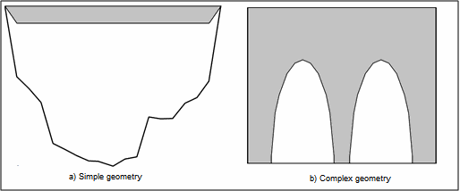{ width=80% }

Figure [5.2](#3-2) shows the front view of the bridge that you will to incorporate into the model for this tutorial. The data is also in the file 'BRIDGEGEOMETRY.DAT' contained in the directory of this tutorial.

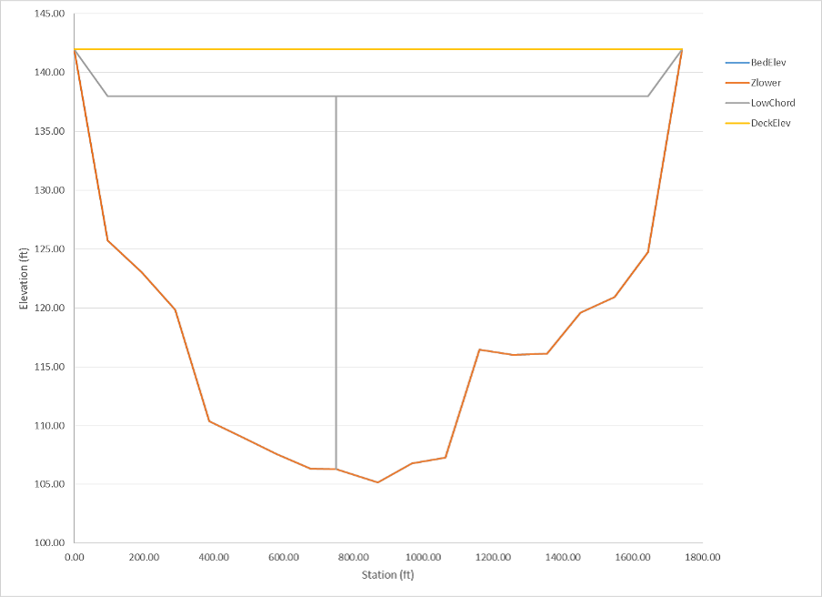{ width=80% }

It represents the cross section of a bridge with only one central pier, although this is just for the purpose of illustrating the Bridges component in this tutorial since the actual bridge in this location has about 12 sets of piers. This geometry is represented in the RiverFlow2D  model using the bridge geometry file shown below, where the header row is presented only to describe the parameters, and they should not be included in the actual data file:

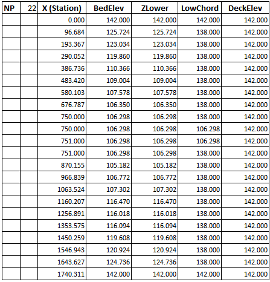{ width=70% }

You may use the *Bridges* panel in Hydronia Data Input Program  to create to some extent, or edit a bridge geometry file (see Figure [5.4](#3-4)). The program lets you enter data in tabular form and view a graph of the bridge geometry. You may also manipulate the graphical lines, which will make that the tabular data be modified.

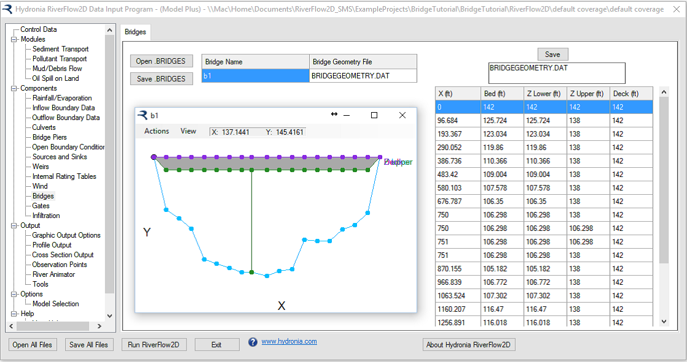{ width=90% }

An alternative way to create the bridge geometry file is to use a spreadsheet. In the folder for this tutorial there is a MS-Excel sheet ('BridgesGeometryPlot.xlsx') that allows editing and plotting bridge geometry files.

## Open an existing project

1.  On the *Project* menu click *Open...* to load the existing project: .

    This project contains the layers of the domain contour, the Digital Elevation Model DEM of the river bed in raster format, the polygons with the Manning's n for the different land coverages, an aerial image, and the boundary conditions. Inflow is located in the upper right segment, and outflow in the lower left. The boundary conditions are a hydrograph with a peak discharge of 220,000 $ft^3/s$ (cfs), and outflow condition is set to uniform flow. When you open the project you will have an image of the project loaded in QGIS  as shown in Figure [5.5](#3-5).

    

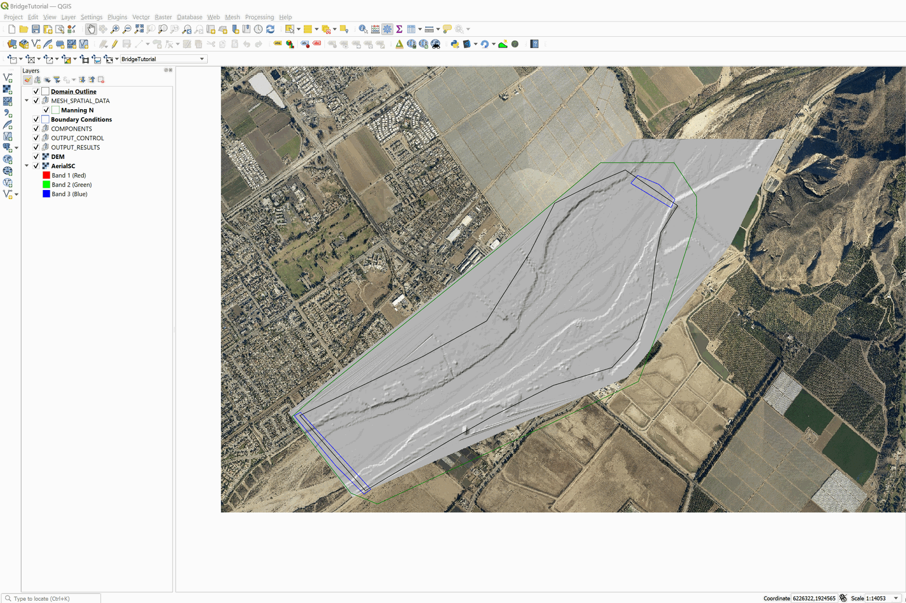{ width=100% }

## Enter the bridge polyline in the *Bridges* layer

This step ensures that the mesh will conform to the bridge alignment, so that there will be nodes generated along the bridge. In this case we will enter the bridge is a straight line approximately 1740 feet long as follows:

1.  Create a new *Bridges* layer: for this, go to the RiverFlow2D  toolbar and left click on the *New Template Layer* button

    <figure>
    
    </figure>

    In the plugin window we activate the Bridges checkBox, as shown in the Figure below.

    

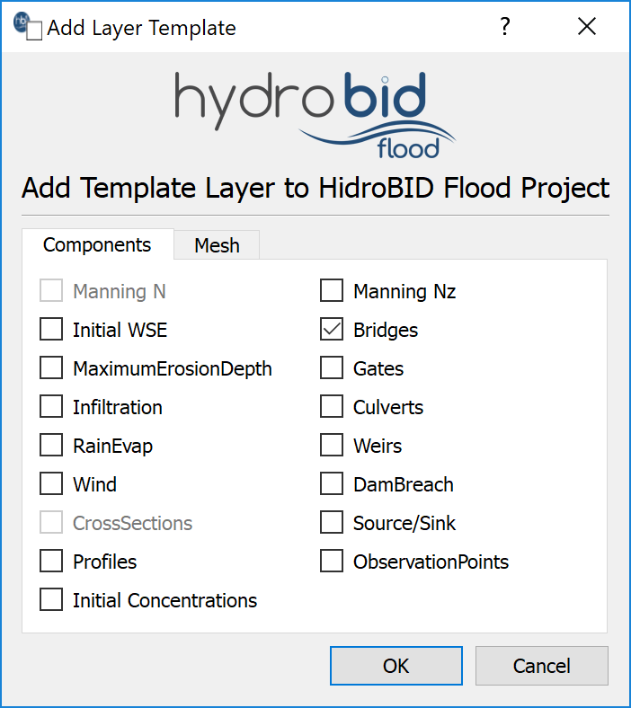{ width=55% }

2.  Edit the *Bridges* layer: In the layers panel we select the *Bridges* layer then in the digitalization toolbar we left click on the *Toggle Editing* button { width=.6cm }.

    A pencil icon will appear in the *Bridges* layer that tells us that the layer is in edit mode:

    <figure>
    
    </figure>

3.  Draw the line representing the bridge: (if necessary, turn off the DEM layer so that it does not interfere with the identification of the bridge site in the aerial photograph).

4.  Using the *Add Feature* button of the digitalization toolbar { width=.6cm }, draw the line indicating the location of the bridge. In the case shown, to demarcate the line that indicates the location of the bridge. It is only necessary to indicate two vertices (initial and final), then right-click to finish the drawing.

    We will have an image similar to the one shown in the following figure:

    

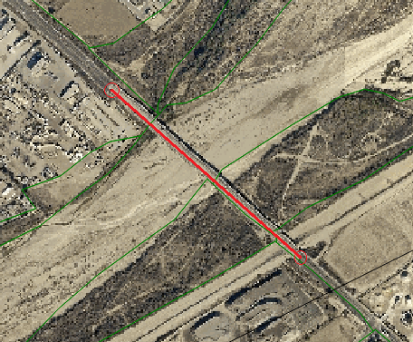{ width=60% }

5.  Enter the bridge data: After the bridge layout is finished, the window to input the attributes of the bridge is immediately displayed, these are:

    -   Bridge Name (ID): Bridge1

    -   Size Element: 150 feet

    -   Click on the \[Import Geometry Bridge File\] button to select the Bridge file: BRIDGEGEOMETRY.dat in the Data folder of this tutorial.

    -   Elevation of the lower bridge deck (LOWCHORD): 138

    -   Elevation of the bridge deck (DECKELEV): 142

    The figure below shows the attributes window of the *Bridges* layer:

    

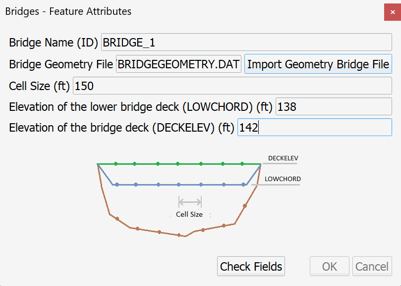{ width=60% }

6.  After entering the values, click on the \[Check Fields\] button, then click the \[OK\] button.

7.  Save the changes in the layer using the *save* button of the digitalization toolbar:

    <figure>
    
    </figure>

    and disable the editing mode of the layer with the *Toggle Editing*

    <figure>
    
    </figure>

## Generate the mesh

The mesh is generated with using the RiverFlow2D  emphGenerate TriMesh icon:

<figure>

</figure>

Check that the resulting mesh is perfectly aligned with the bridge as shown in Figure [5.9](#3-9).

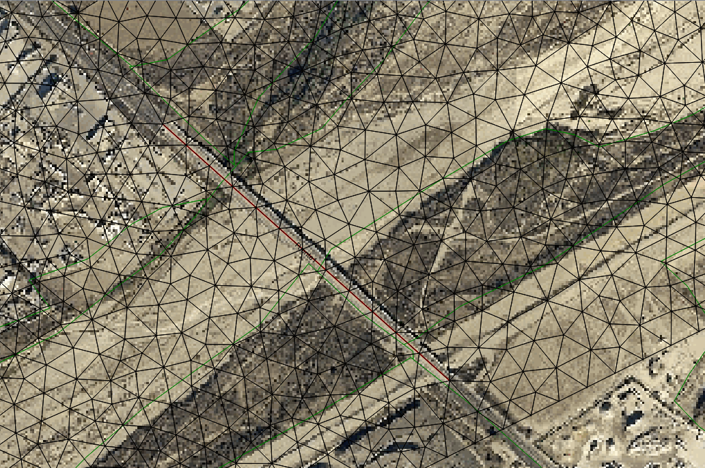{ width=90% }

## Exporting files to RiverFlow2D

Now that you have generated the mesh, and you have the other layers with the necessary data ready, you should export the files in the format required by RiverFlow2D.

1.  Click on *Export RiverFlow2D* button:

    <figure>
    
    </figure>

    In the export files dialog we need to make sure that the appropriate raster layer corresponding to the Digital Elevation Model (DEM) is selected. The *Project Name* will already be set.

    The dialog should look as follows:

    

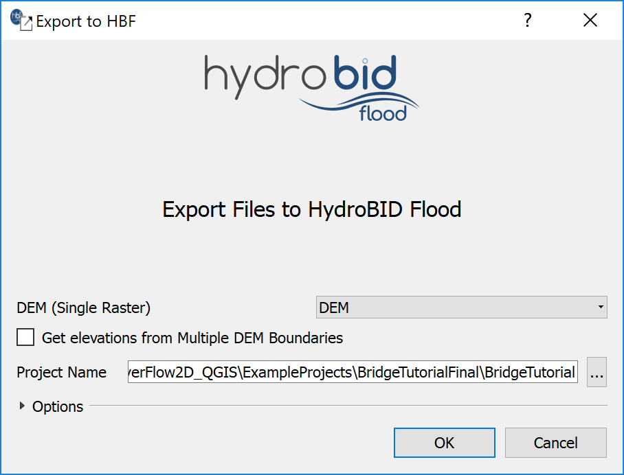{ width=60% }

2.  Click on the \[OK\] button and the export process will begin.

    Once finished, the *Data Input Program* will be loaded with the '.DAT' file of the specific example.

## Running the Model

After exporting the files, the RiverFlow2D  program is loaded with the project file of the 'bridge.DAT' example, and the *Control Data* panel is shown (Figure [5.11](#3-11)).

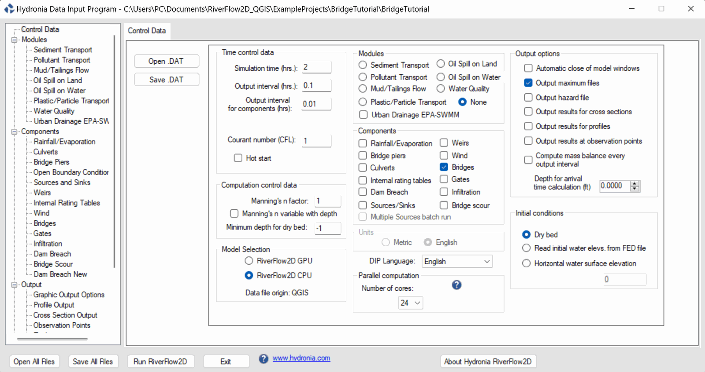{ width=90% }

Select the Bridges panel to review the contents of the bridge geometry file (Figure [5.12](#3-12)). Note how the bridge profile was discretized every 150 feet according to the element size imposed to the bridge line.

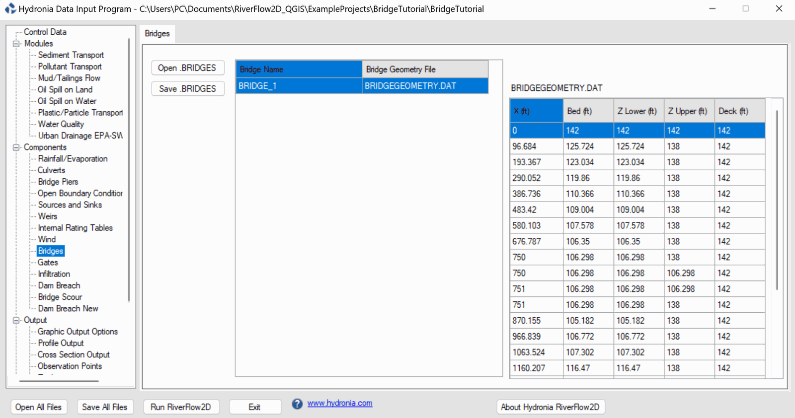{ width=90% }

Leave all other parameters at their default values.

To run the model, click on the Run RiverFlow2D  button in the lower section of Hydronia Data Input Program. A window will appear indicating that the model run started. The window also reports the simulation time, the volume conservation error, the total input and output discharge, and other parameters as the execution progresses (Figure [5.13](#3-13)).

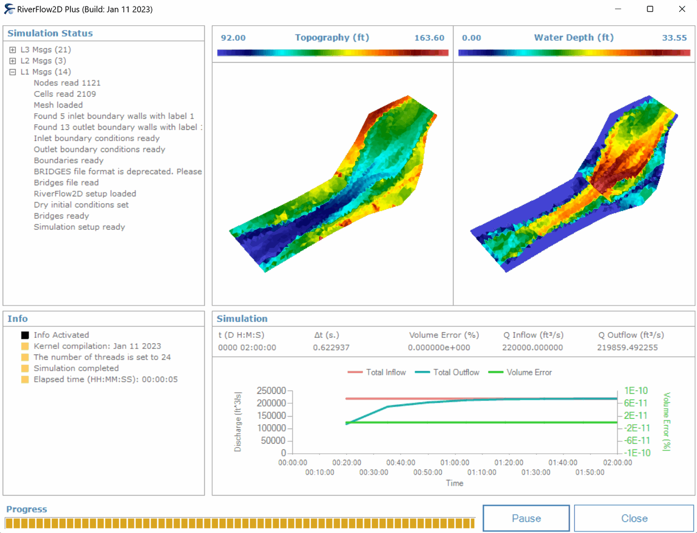{ width=80% }

Once this process completes, check the outputs in the scenario folder to review the 'BridgeTutorial.bridgeh' file:

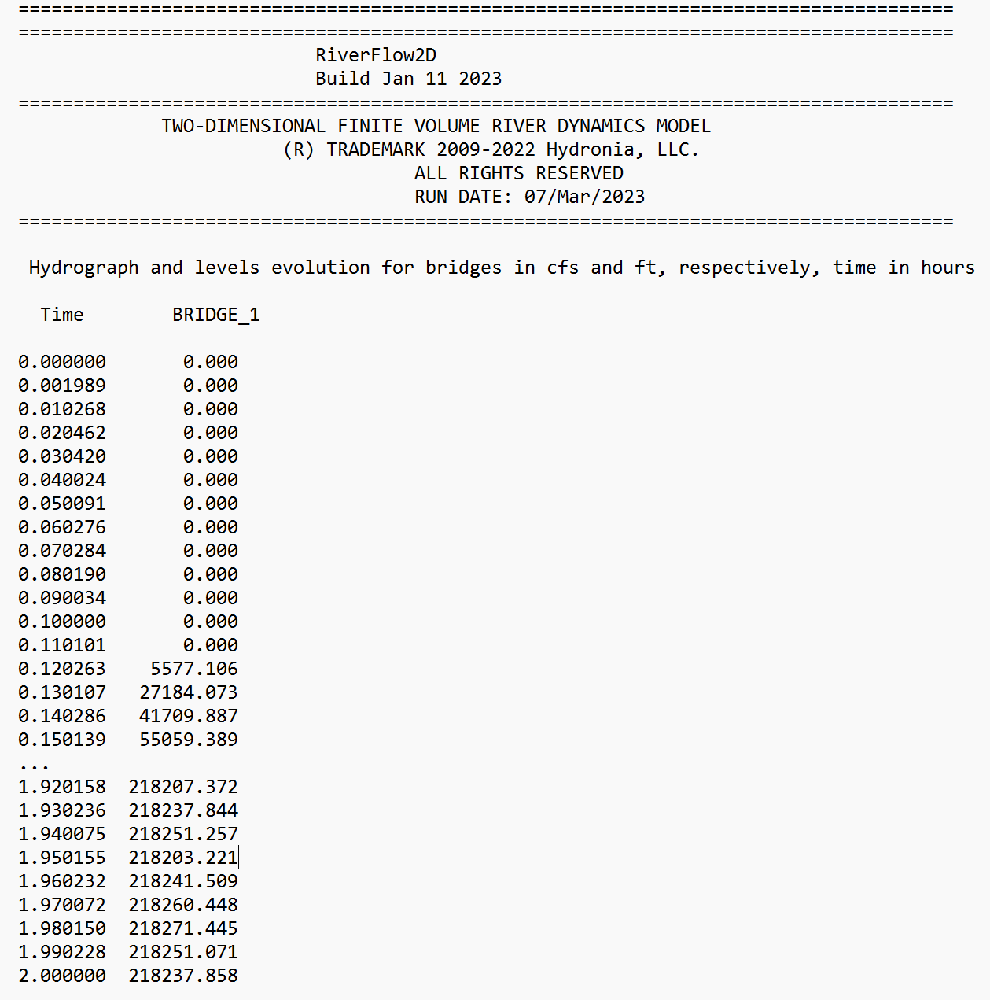{ width=80% }

This concludes the *Simulating bridges* tutorial.
