# Simulating levees using weirs

This tutorial illustrates how to incorporate a levee to an existing RiverFlow2D  project using the Weirs Component in the QGIS  interface. The problem consists in modeling a lateral weir along the right margin of a river, as can be seen in the following figure:

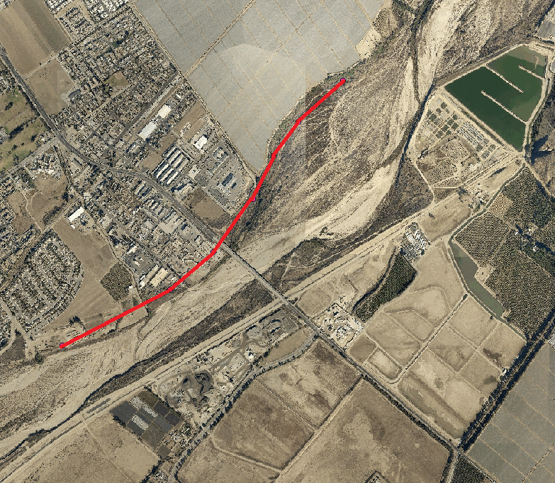{ width=60% }

The procedure to incorporate the weir in a RiverFlow2D  simulation involves the following steps:

1.  Open an existing RiverFlow2D  project.

2.  Add the *Weirs* layer.

3.  Draw the weir polylines.

4.  Input the weir parameters or attributes.

5.  Export the files to RiverFlow2D.

6.  Run the RiverFlow2D  model.

7.  Review the output files.

::: shaded
The files required to follow this tutorial can be extracted from the 'ExampleProjects' zip file under the 'WeirTutorial' folder. This zip file is downloaded separately from your installation materials.
:::

## Open an existing project

1.  Open QGIS.

2.  On the *Project* menu click *Open...* and browse to select the existing project: .

    This project contains the following layers: Domain Outline, Digital Elevation Model (DEM) of the river bed in raster format, aerial photography, polygon with the Manning coefficient and the polygons with the boundary conditions where the flow entrance is in the upper left corner and exit in the lower left corner. The boundary conditions are a hydrograph with a peak discharge of 220,000 $ft^3/s$, and outflow condition is set to *uniform flow*. When you open the project you will have a project image loaded in QGIS as shown in Figure [4.2](#5-2):

    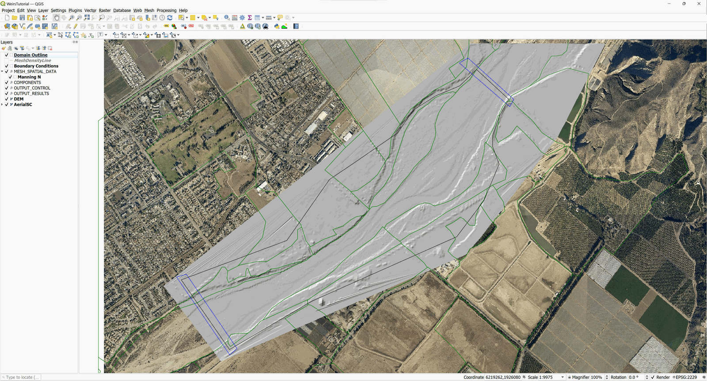{ width=80% }

## Create a Weirs layer and the weir polyline

The weir location can be drawn on the *Weirs* layer or it can be imported from an existing file. In this tutorial, the polyline that indicates the location of the weir will be imported from a text file. The structure of the file should be as follows:

-   The first line must indicate the number n of nodes that contains the polyline.

-   The *n* successive lines will contain three columns with the X, Y coordinates.

-   The elevation of the weir crest separated by space as shown in Figure [4.3](#5-3):

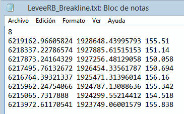{ width=50% }

Adding the *Weirs* layer involves the following steps:

1.  Create *Weirs* layer: for this click on the *New Template Layer* button in the RiverFlow2D  toolbar

    { width=1cm }

2.  Activate the checkbox Weirs, as shown in the Figure below:

    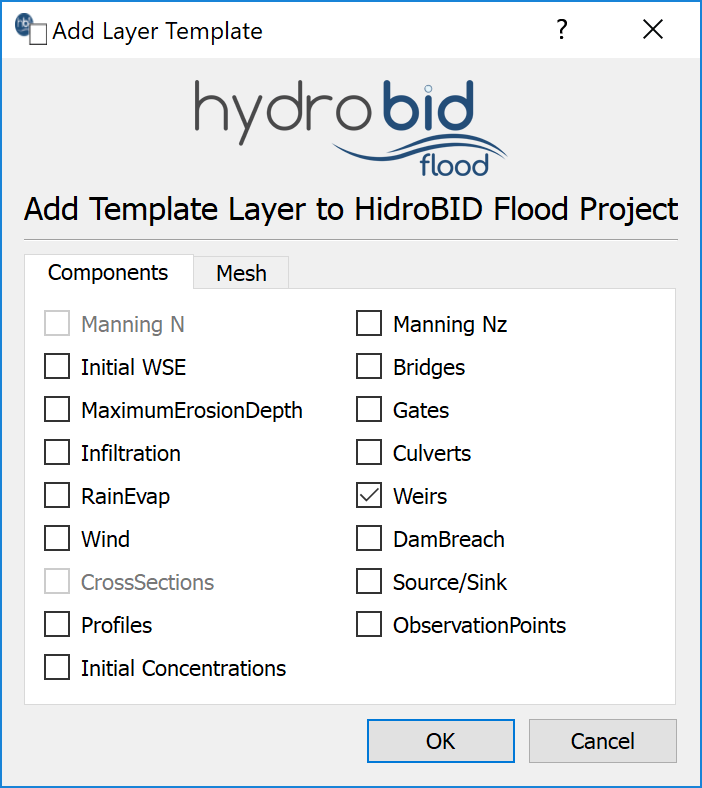{ width=60% }

3.  Edit the *Weirs* layer: In the layer panel, select the *Weirs* layer and in the digitalization toolbar click on the *Toggle Editing* button

    { width=1cm }

    A pencil icon will appear in the *Weirs* layer indicating that the layer is in edit mode:

    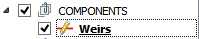{ width=3.6cm }

4.  Draw the line representing the weir: Using the *Add Feature* tool from the digitalization bar

    { width=1cm }

    Draw a line anywhere in the map area (just mark two vertices or nodes. This line will then be replaced by the coordinates of the file to be imported).

5.  Right-click to finish the layout and a dialog window will appear to input the weir parameters.

6.  Input the weir parameters: The window to input the weir attributes contains two tabs. In the first one there are the fields of the general parameters, within which has:

    -   Weir Name (ID): Weir1

    -   Weir discharge coefficient: 3.2

    -   Weir crest elevation for all the weir: since a file will be imported this field will be left empty.

    -   Size Element: 150

    -   Import Geometry File: Click the \[...\] button and point to the file *LeveeRB_Breakline.txt* which is found in the tutorials folder.

    The weir parameters window should look like the image shown below:

    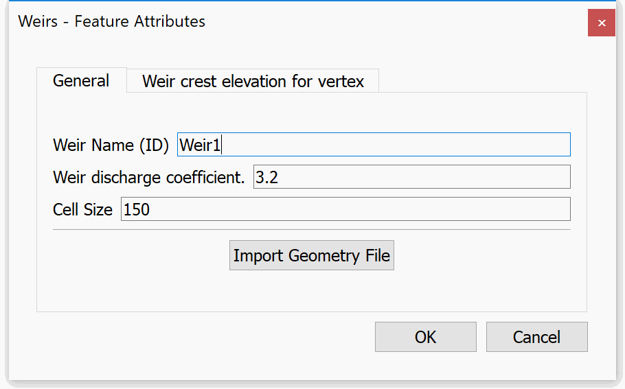{ width=60% }

    In the second tab 'Weir crest elevation for vertex' the data contained in the file *LeveeRB_Breakline.txt* is displayed, as shown in the following Figure:

    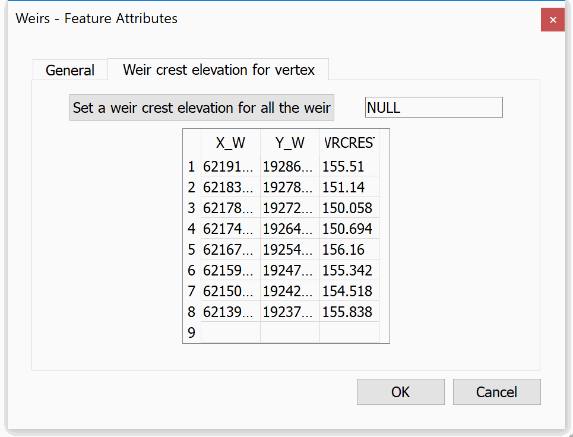{ width=60% }

7.  Then click on the \[OK\] button.

8.  Save the changes in the layer using the *Save* button of the digitalization toolbar

    { width=1cm }

9.  Disable the editing mode of the layer with the *Toggle Editing* button

    { width=1cm }

    and we will have on screen an image similar to the one shown below where you can see the layout of the weir:

    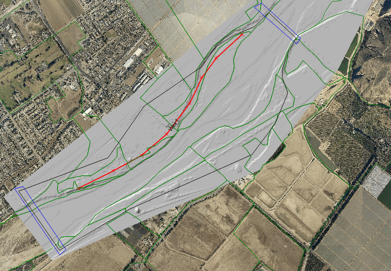{ width=60% }

## Generate the mesh

The mesh is generated with the *Generate TriMesh* plugin.

{ width=1cm }

result should look similar to the image on Figure [4.8](#5-8).

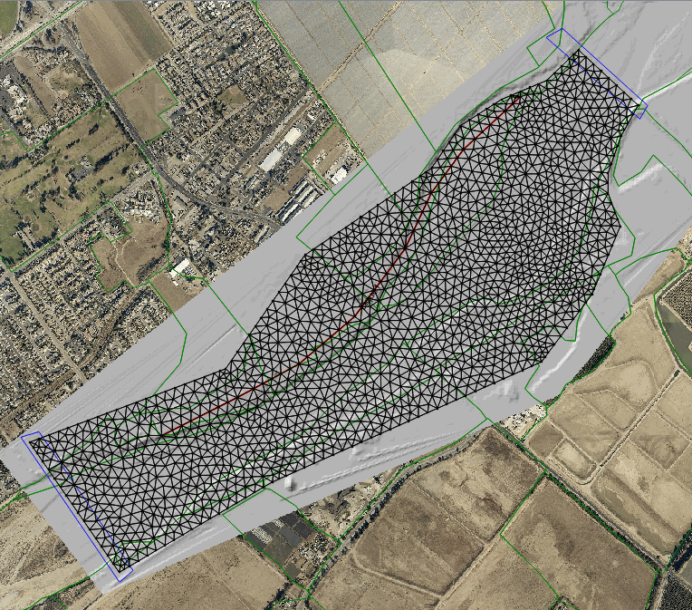{ width=60% }

## Exporting files to RiverFlow2D

Now that you have generated the mesh and you have the other layers ready with the necessary data, you should export the files in the format required by RiverFlow2D.

1.  Click the *Export to RiverFlow2D * button.

    { width=1cm }

2.  When running the plugin a window is displayed, here we must select the raster layer that contains the Digital Elevation Model (DEM) and the name of the project to be exported.

    Once the plugin is executed, a window will be shown (Figure [4.9](#5-9)), as it should be for our example.

    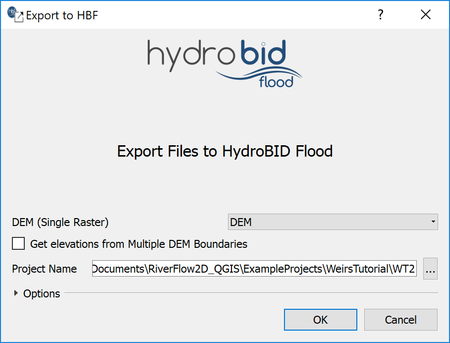{ width=60% }

3.  After inputting the data, click on the OK button and the export process will begin. Once it is finished, Hydronia Data Input Program  will be loaded as shown in Figure [4.10](#5-10)

    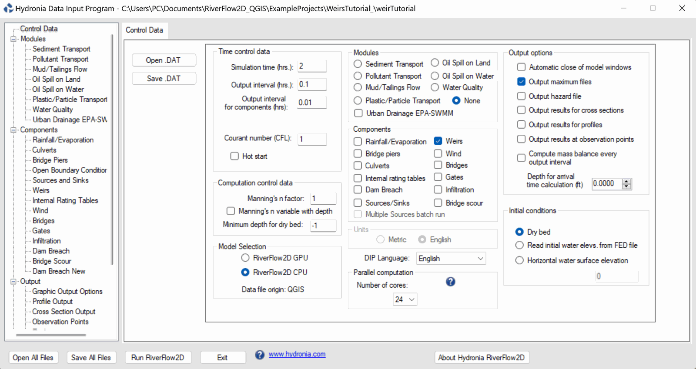{ width=90% }

## Running the model

Make sure that the Weirs Component appears selected in the Control Data panel.

1.  In the list of components, select 'Weirs' and the panel of the Weirs component will appear. In this window the contents of the '.WEIRS' file content as prepared by RiverFlow2D will be displayed (Figure [4.11](#5-11)).

    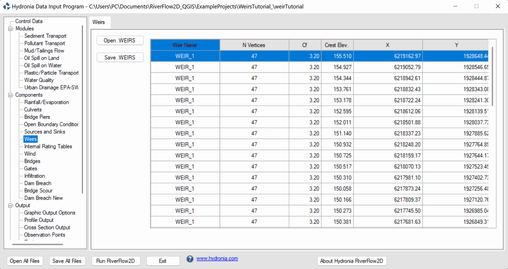{ width=90% }

2.  Leave all other parameters at their default values.

3.  Click on the *Run RiverFlow2D* button in the lower section of Hydronia Data Input Program. A window will appear indicating that the model began to run. The window also informs the simulation time, the volume conservation error, the total input and output discharge and other parameters as the execution progresses (Figure [4.12](#5-12)).

    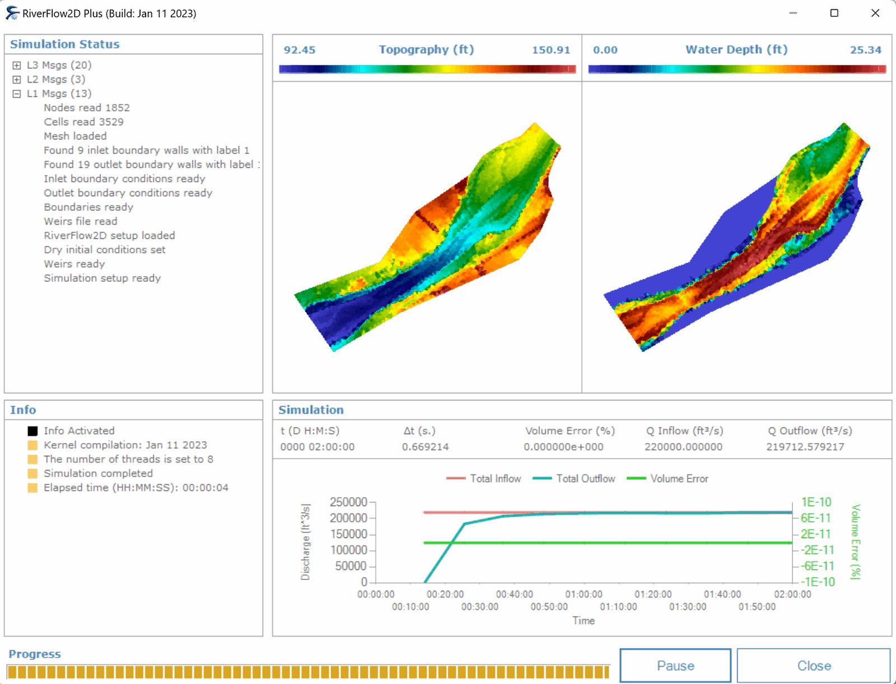{ width=75% }

## Review the output files

RiverFlow2D  creates an output file with the name of the project and extension '.WEIRI' for metric units and '.WEIRE' for English units. The files report results for each weir and for each output interval. Output includes the following information:

-   EDGE: The segments into which the weir is divided and is given by the length of the cells in contact with the weir.

-   N1 y N2: The numbers that identify the cells that share the EDGE segment in the weir.

-   WSE1 y WSE2: The elevations of the water surface in the cells indicated by N1 and N2.

-   D1 y D2: The depths of the flow in the cells indicated by N1 and N2.

-   Distance: The length of the EDGE segment.

-   Q: The discharge that passes through the EDGE segment.

The '.WEIRE' file contains the following:

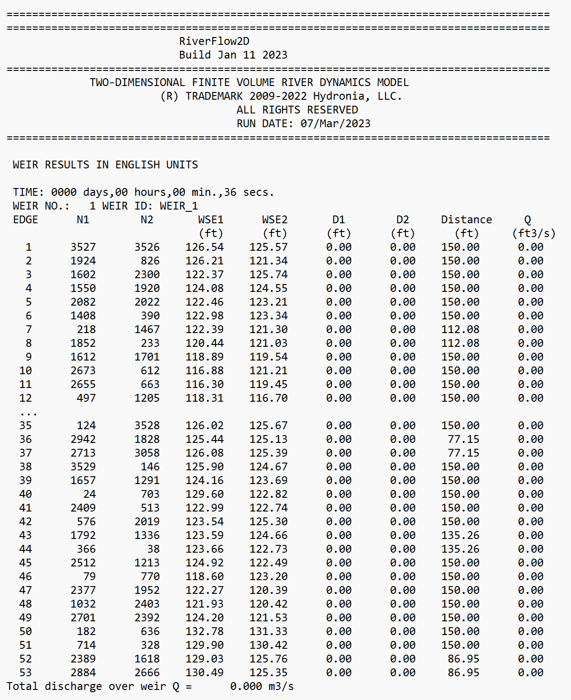{ width=90% }

This concludes the *Simulating Levees using Weirs* Tutorial.
