# Simulating Pollutant Transport

RiverFlow2D contains the *Pollutant Transport* module that simulates the movement and transformation of pollutants in a water body. It can account for various processes that affect the fate of pollutants, such as:

-   Dissolved substance transport (Solutes)

-   Advection-Dispersion-Reaction

-   Thermal analysis

-   Decay over time

-   Multiple pollutants

-   Reaction rates between pollutants

In this tutorial we will go through the step-by-step process of creating a simple scenario with pollutants on the Magdalena River in Columbia to show how the model is used to solve these types of cases. In this tutorial we will:

1.  Open an existing RiverFlow2D project.

2.  Create a scenario for a single pollutant.

3.  Create an *Initial Concentrations* layer.

4.  Enter pollutant data.

5.  Generate the mesh and Export the files to RiverFlow2D.

6.  Run the RiverFlow2D model.

7.  Review the output files.

::: shaded
The files required to follow this tutorial can be extracted from the 'ExampleProjects' zip file under the 'SimulatingPollutants' folder. This zip file is downloaded separately from your installation materials.
:::

Please refer to the *RiverFlow2D  Reference Manual* for additional specifications and requirements to run the *Pollutant Transport* model.

## Create a scenario to model a single pollutant as an initial condition

There are a few layers involved with handling the introduction of pollutants in the areas of interest, depending on the conditions that will be simulated. For this section, we will create a scenario named SinglePollutant that will showcase a an existing pollutant that is already present initially and is part of the discharge of the river. The water body will be utilizing an *Initial Concentrations* layer to have the desired concentration for the same pollutant present.

1.  In QGIS, in the *File* menu click *Open*. Browse to the tutorial folder and select the 'SimulatingPollutants.qgz' project and click \[OK\].

2.  In the RiverFlow2D  toolbar click on the New Project button and select *New Scenario*:

    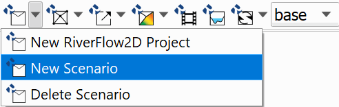{ width=0.5\textwidth }

3.  Type "SinglePollutant" without quotes as your new scenario name. A copy of the current project will be made and kept in a separate subfolder named "SinglePollutant"

    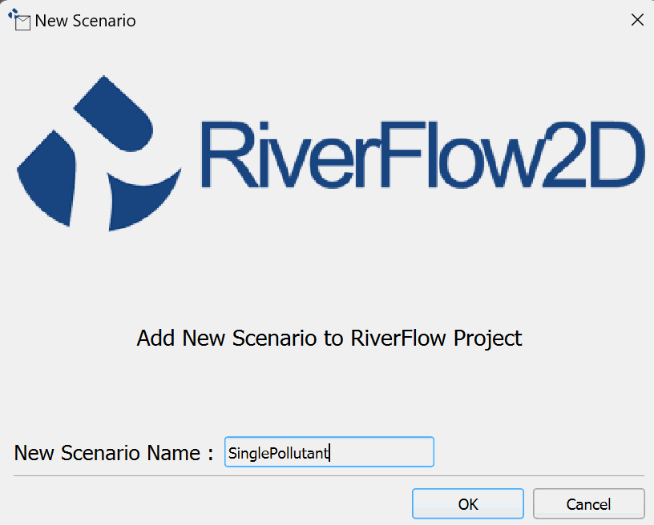{ width=0.5\textwidth }

## Create an Initial Concentrations layer.

1.  In the RiverFlow2D  toolbar, click on the dropdown button for *RF2D* tools and click *New Template Layer*:

    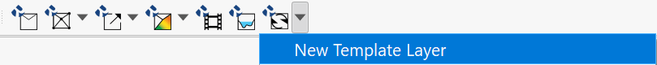{ width=0.7\textwidth }

2.  In the *Add Layer Template* dialog window, select the *InitialConcentrationsPollutant* checkbox and click \[OK\].

    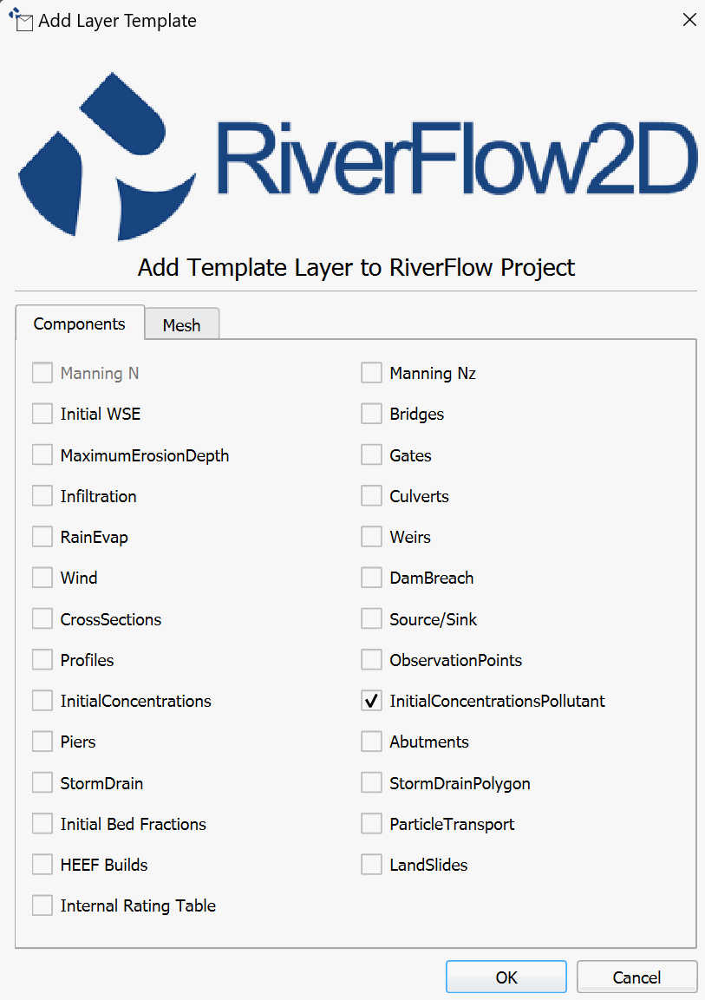{ width=0.5\textwidth }

    A new layer should appear in the *Layers* panel on the left-hand side:

    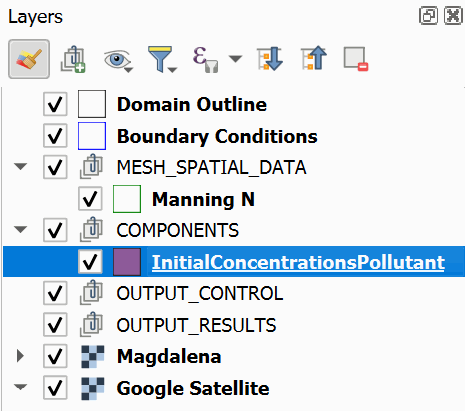{ width=0.5\textwidth }

    We need to create a polygon in the *Initial Concentrations* layer that covers all of the river. We can utilize the *Domain Outline* layer and copy the same polygon into our newly created layer.

3.  Select the *Domain Outline* layer in the *Layers* panel.

4.  Click on the *Select Feature by Area or Single Click* { width=1cm } button, then click inside of the *Domain Outline* polygon in the map area to highlight it:

    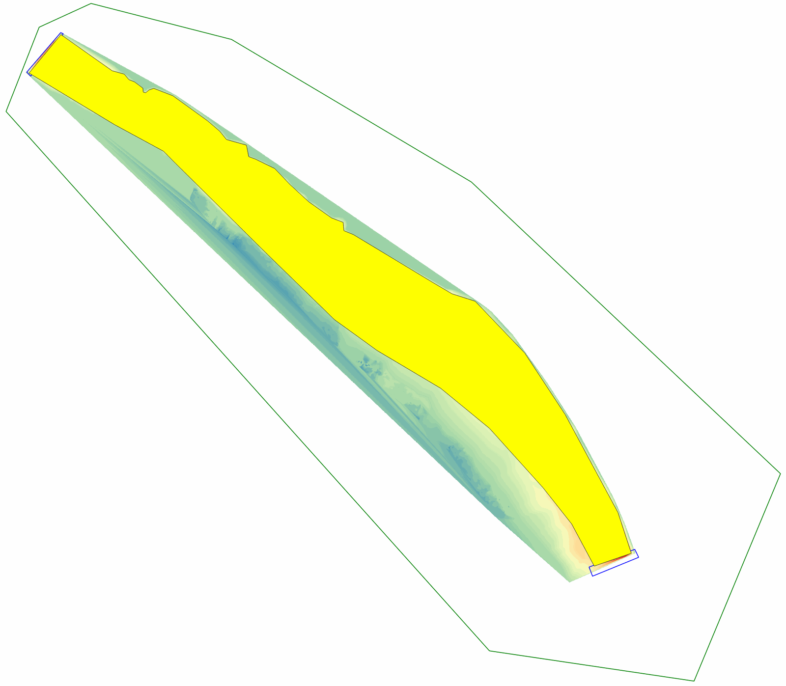{ width=0.7\textwidth }

5.  Click the *Copy Features*{ width=0.8cm } button from the QGIS toolbar.

6.  Select the *Initial Concentrations* layer in the *Layers* panel and click on the *Toggle Editing* { width=0.8cm } button to put the layer in edit mode.

7.  Click the *Paste Features* { width=0.8cm } button.

## Enter pollutant data.

1.  Right-click the *InitialConcentrationsPollutant* layer in the *Layers* panel and select *Open Attribute Table*.

2.  In the *InitialConcentrationsPollutant* features window, click on the \[Browse\] button for the *Initial Concen* field.

3.  In the project folder, browse into the project folder and select 'InitialConcentration.txt', copy it, then go back to the main project folder and browse to the *SinglePollutant* folder and paste it there. Click on the file again and click \[Open\].

4.  Close the *InitialConcentrationsPollutant* Features dialog window.

5.  Click the *Save Layer Edits* { width=0.8cm } button then click the *Toggle Editing* { width=0.8cm } button.

## Generate the mesh and Export to RiverFlow2D

1.  Generate the mesh by clicking on the *Generate TriMesh with elevations* { width=0.8cm } button in the *Generate TriMesh* menu:

    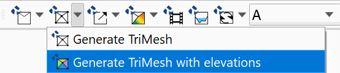{ width=0.5\textwidth }

    Ensure that the "Magdalena" DEM is selected in the *Raster Layer List* dropdown.

2.  Export the project to RiverFlow2D  by clicking the *Export RiverFlow2D* button in the RF2D toolbar.

3.  You will be presented with the *Export Files to RiverFlow2D* dialog. Leave all parameters as they are and click \[OK\].

    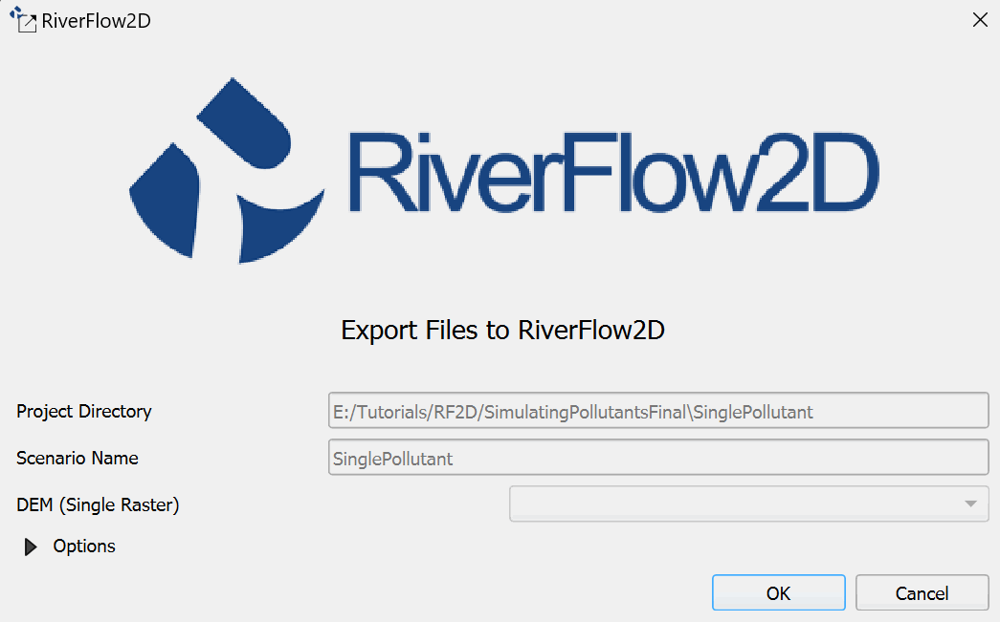{ width=0.7\textwidth }

    We want to start the model with a body of water present in the river channel. Since this area is below sea level, we will set a horizontal water surface elevation to provide water below that level in the DIP.

4.  The *Hydronia Data Input Program* will open. Under *Modules* select the *Pollutant Transport* radio button. Under *Initial conditions* section, click the *Horizontal water surface elevation* radio button, leaving it at 0 then and click on *Pollutant Transport* on the left side panel:

    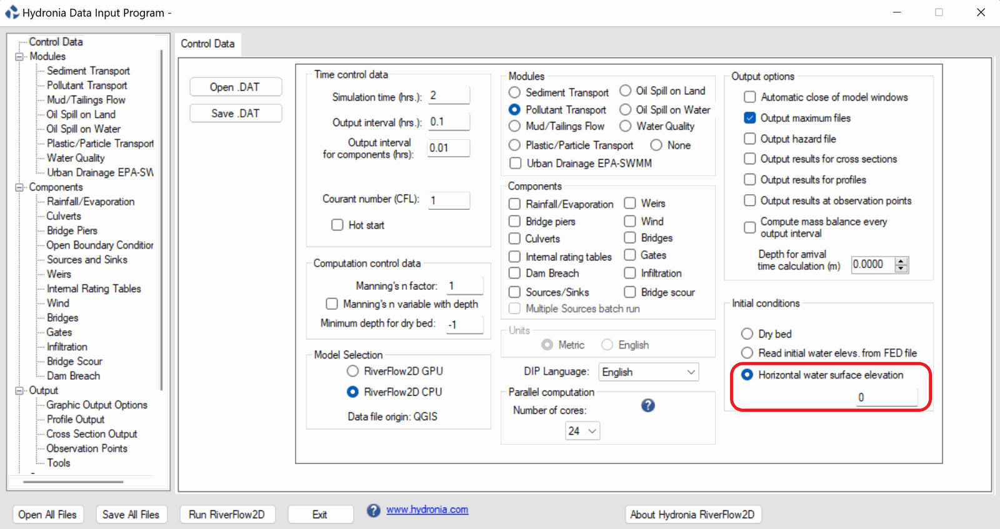{ width=100% }

5.  In the *Name* section double click in the empty cell and write *Pollutant1*, then set the *P1* column value for the row to 0.

    The *Pollutant Transport* panel allows the user to control Dispersion coefficients for all pollutants, as well as define the decay rate for each pollutant. We want to set the decay rate to 0 and leave the rest as default.

    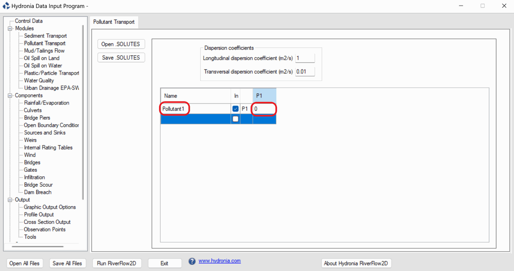{ width=0.8\textwidth }

6.  Click on the \[Save .SOLUTES\] button, it will use the name of the scenario 'A.SOLUTES'. Click \[OK\] to save the file.

## Review Boundary Condition Panel for Pollutant Inflow

The pollutant we have specified will be arriving via the inflow boundary condition that was present in the base tutorial files.

::: shader
The pollutant concentration units are arbitrary. Your can use volume concentration Cv (fraction of 1), mg/l, ppt, ppm, or any other suitable units, provided that the inflow boundary conditions are consistent.
:::

You can view the boundary conditions file to see the additional column that is required, noting the additional column present in the 'QIN2.DAT' file:

1.  Click on the *Open Boundary Conditions* panel on the left-hand side.

    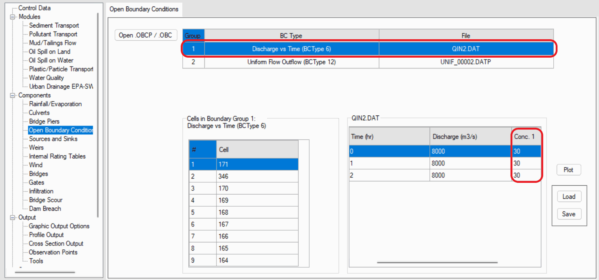{ width=0.8\textwidth }

2.  Switch back to the *Control Data* panel and click \[Save .DAT\]. Replace the existing 'SinglePollutant.dat' file to save the changes made earlier.

3.  Click \[Run RiverFlow2D\] to execute the model.

## Review the output files

The output maps for pollutants will show us the concentrations over the model domain. We will use the *Concentrations and Properties vs. Time Maps* tool to generate them.

1.  In QGIS, Click on the { width=0.8cm } button and select *Concentrations and Properties vs. Time Maps*.

2.  in the *Concentrations and Properties vs. Time Maps* dialog window, click the \[. . .\] button and select the 'A.SOLUTES' file and click \[OK\].

3.  Select *Conc_1* under *Maps*, then select the last output time, then click the \[$\rightarrow$\] button to make the selection. You may also hold the control key and select multiple output times. Click \[OK\] when ready.

    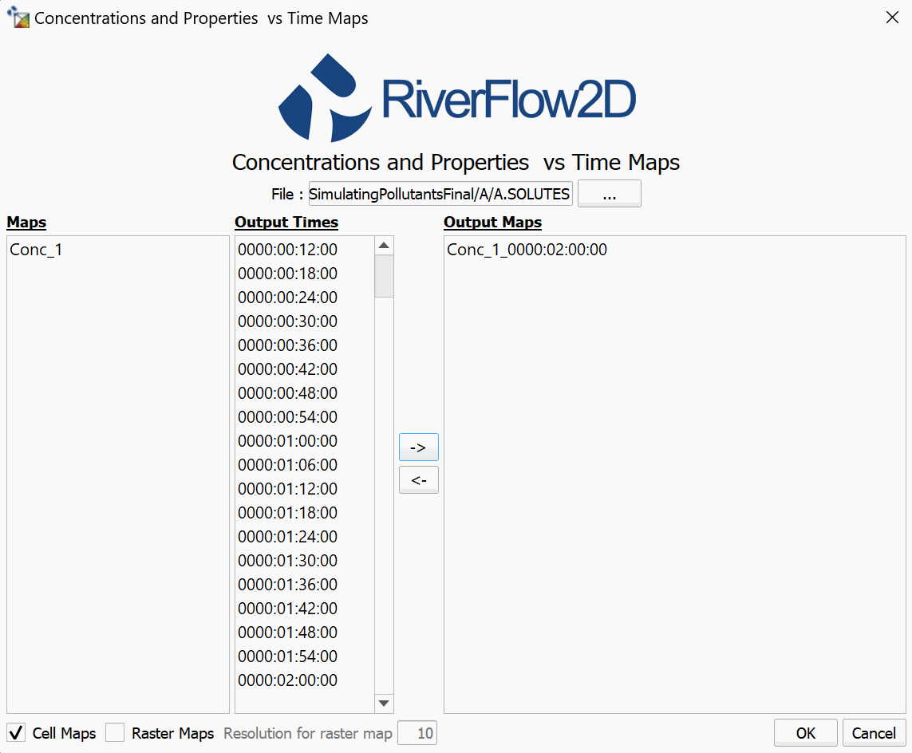{ width=0.8\textwidth }

    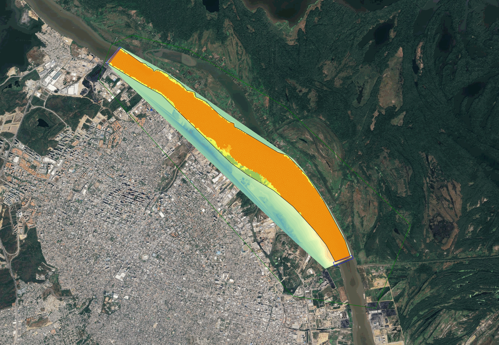{ width=100% }

## Create a second scenario for adding a new pollutant source under existing conditions

We will now create a new scenario to test having an additional separate pollutant enter the river from a specific point by utilizing a *Sources/Sink* layer.

1.  In the RiverFlow2D toolbar click on the New Project button and select *New Scenario*:

    { width=0.5\textwidth }

2.  type "MultiplePollutant" without quotes as your new scenario name. A copy of the current project will be made and kept in a separate subfolder named "MultiplePollutant"

3.  In the RiverFlow2D  toolbar, click on the dropdown button for *RF2D* tools and click *New Template Layer*:

    { width=0.7\textwidth }

4.  In the *Add Layer Template* dialog window, select the *Source/Sink* checkbox and click \[OK\].

    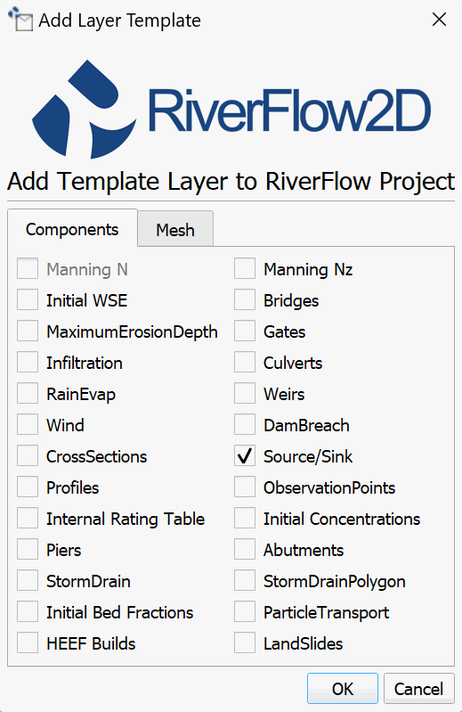{ width=0.5\textwidth }

    A new *Sources* layer will appear on the lefthand *Layers* panel, under the *COMPONENTS* group.

5.  Select the *Sources* layer and click the *Toggle Editing* { width=0.8cm } button.

    We want to place the second pollutant in the middle of the river, ideally somewhere away from our inflow.

6.  Click the *Add Point Feature* { width=0.8cm }.

7.  Place the point by clicking on the desired location. A dialog window will appear to enter the source information:

    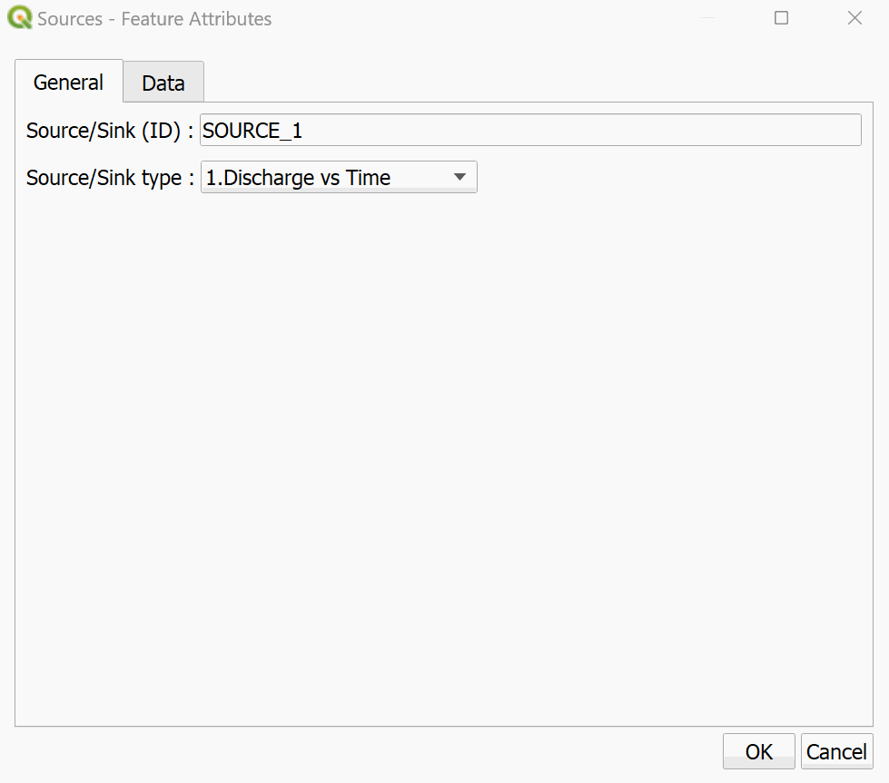{ width=0.6\textwidth }

8.  Select *1.Discharge vs Time* under *Source/Sink type*. Click the *Data* tab.

    Your sources file has to exist in the *MultiplePollutant* folder, we must copy the one created for this tutorial into the current scenario folder.

9.  Browse by clicking the \[Import Source/Sink File\] button. Browse to the project base scenario directory at '/SimulatingPollutants/base' and copy the 'Source2_Pollutant.txt' file.

10. Browse back to the current scenario folder in 'SimulatingPollutants/MultiplePollutant'. Paste the copied file into this directory. Select the copied file 'Source2_Pollutant.txt' then click \[OK\] twice to save the Sources information.

11. Click the *Save Layer Edits* { width=0.8cm } button then click the *Toggle Editing* { width=0.8cm } button.

12. Export the project to RiverFlow2D  by clicking the *Export RiverFlow2D* button in the RF2D toolbar. Leave all default values.

## Adding required multiple pollutants concentrations information

This section will explain how to edit inflows and initial concentrations needed in the current Scenario B in order to run the simulation with multiple pollutants.

We need to copy the 'InitialConcentration.txt' file from our project folder into our current scenario:

1.  In *File Explorer*, browse to the 'ExampleProjects/SimulatingPollutants/' and copy the 'InitialConcentration.txt' file.

2.  Browse to 'ExampleProjects/SimulatingPollutants/MultiplePollutant' and paste the file.

3.  Double-click the 'InitialConcentration.txt' to edit the contents in Notepad.

    This file needs to contain a second column indicating there is a second pollutant, with 0 concentration. You can set this to be any concentration

4.  Add a 0 next to the current one, they can be separated by a space or tab. It should look like this:

    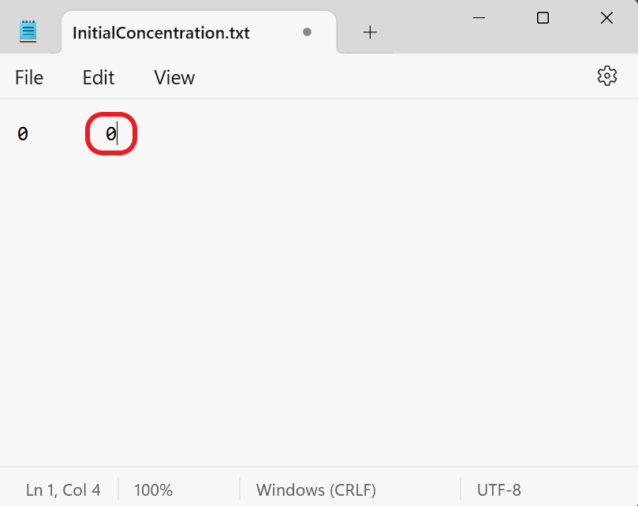{ width=0.5\textwidth }

5.  Save the file and close it.

6.  In *File Explorer*, double-click on 'QIN2.txt' to edit it in Notepad.

7.  Add a fourth column of data starting on the second row. We will set the inflow for this pollutant to 0 since we only want one pollutant entering the through the inflow boundary condition:

    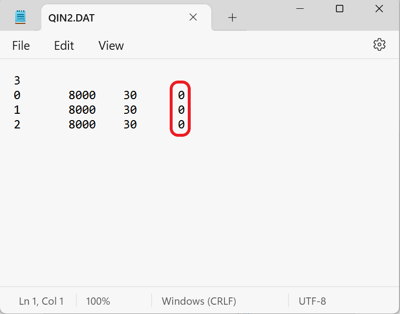{ width=0.5\textwidth }

## Add the new pollutant parameters in the Hydronia Data Input Program  then Run the RiverFlow2D  model

Before running the model we will need to ensure that some additional settings are saved.

1.  In the *Control Data*  panel under the *Modules* section, ensure that *Pollutant Transport* is enabled.

2.  In the *Components* section, ensure that *Sources/Sinks* is enabled.

3.  Under *Initial conditions*, ensure that the *Horizontal water surface elevation* radial button is enabled and has a 0 value, then and click on *Pollutant Transport* on the left side panel.

    We need to add our second pollutant information.

4.  Under the *Name* section below *Pollutant1*, then create an additional pollutant by double-clicking in the empty row and set the *P2* column value for the second row to 0. Your *Pollutant Transport* panel should look as follows:

    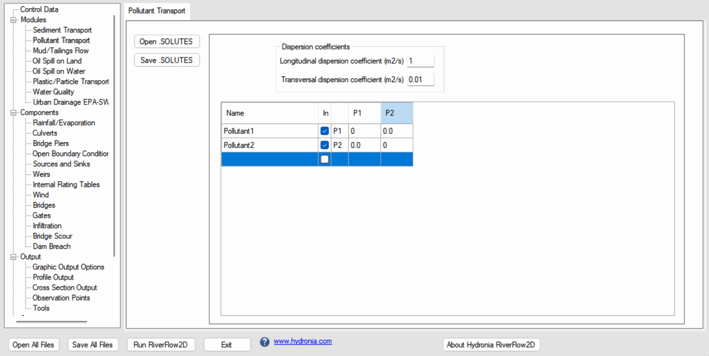{ width=100% }

5.  Click on the \[Save .SOLUTES\] button, it will use the name of the scenario 'MultiplePollutant.SOLUTES'. Click \[OK\] to overwrite the existing file.

6.  Click on the *Sources and Sinks* button on the left side panel.

7.  Click \[Open .SOURCES\]. Select the 'MultiplePollutant.SOURCES' file. You should see the table for the new pollutant source discharge on the 4th column.

    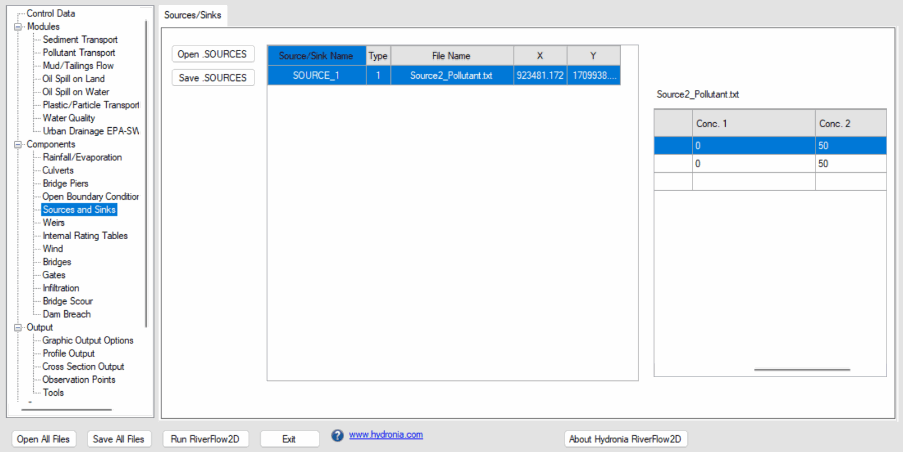{ width=100% }

8.  Click on *Control Data*  on the left side panel.

    The *Control Data* panel should have the following parameters set:

    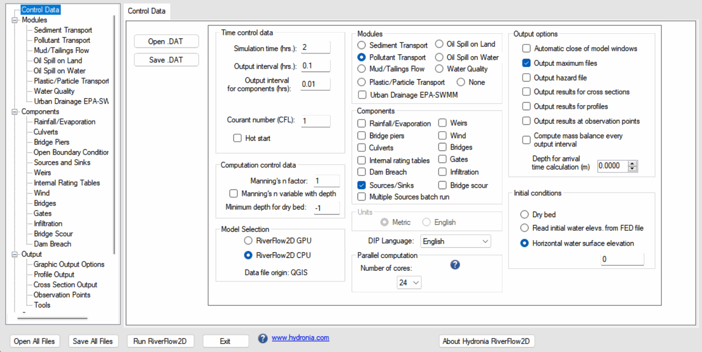{ width=100% }

9.  Click \[Run RiverFlow2D\]. When asked to save, click \[Yes\] to overwrite the MultiplePollutant.DAT file with the changes made in the Hydronia Data Input Program.

Once the model is finished running, you can follow the same steps outlined in the *Review output files* section of this tutorial. You will notice there are two concentrations in the list. The output for the new source *Conc_2* should look something like this, depending on where you placed your source:

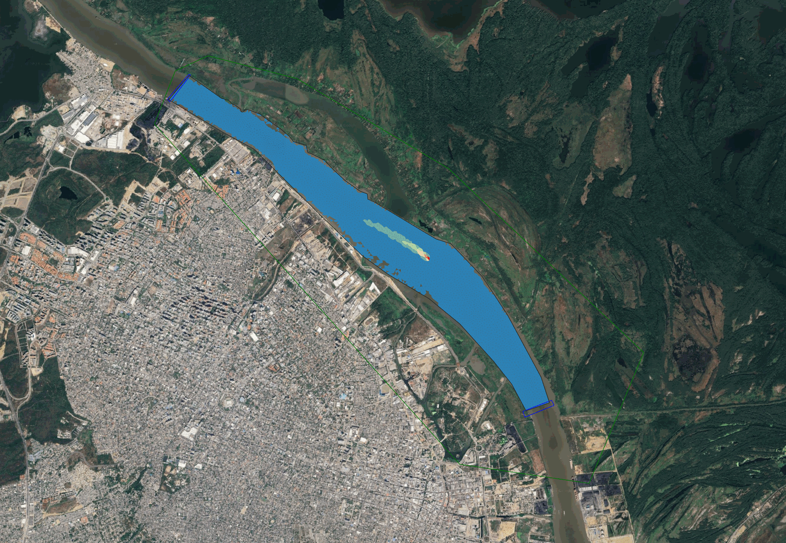{ width=100% }

This concludes the tutorial for simulating pollutant transport with RiverFlow2D.


