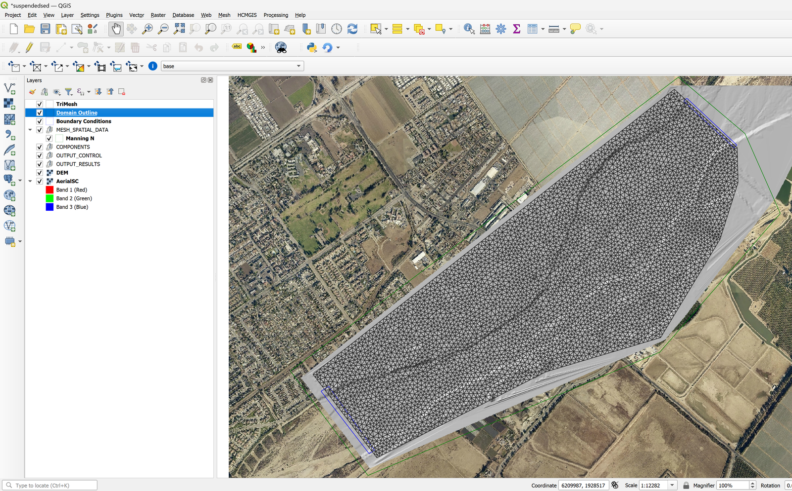
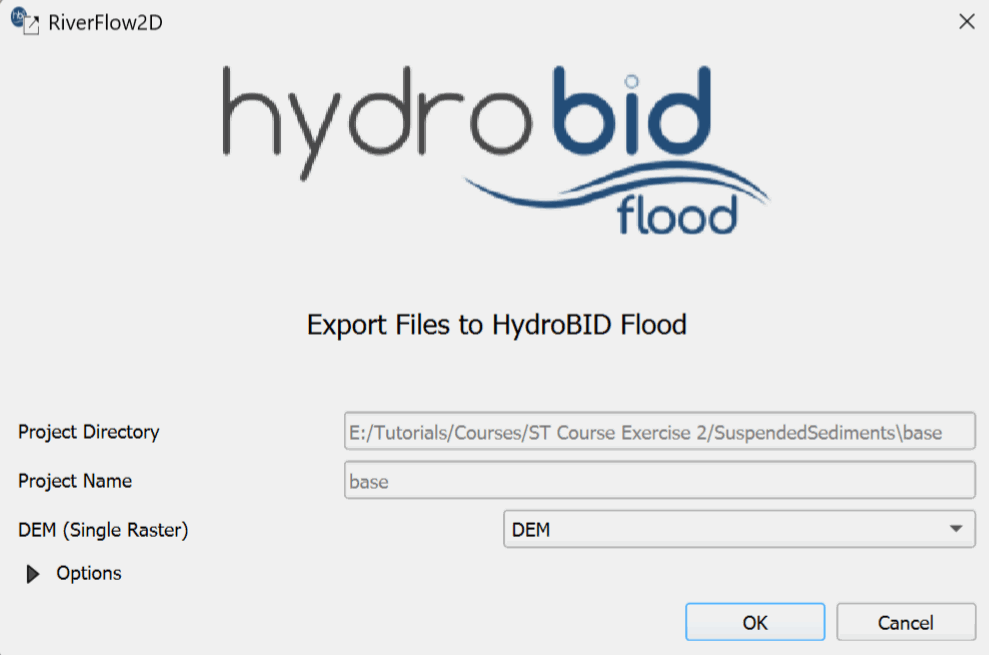
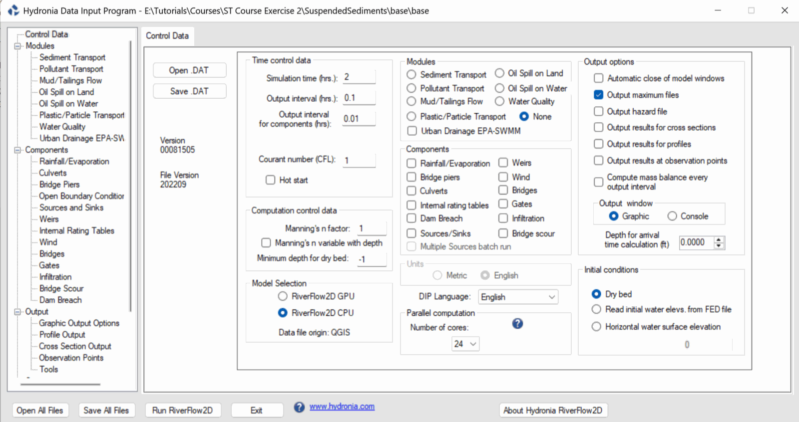
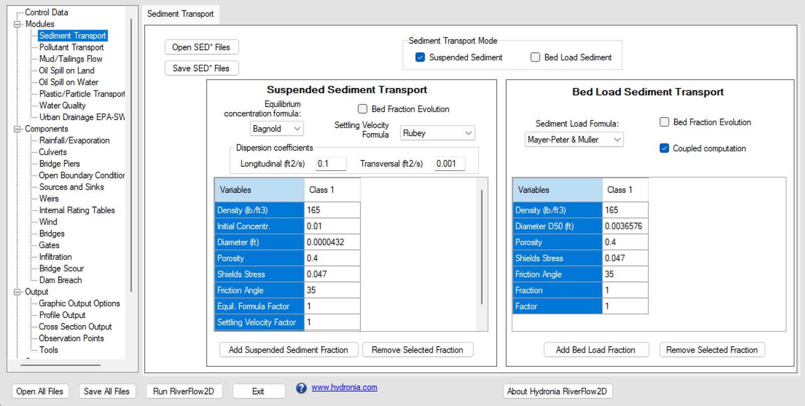
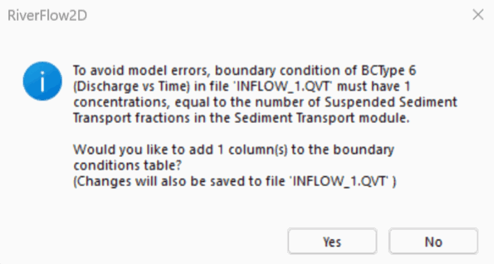
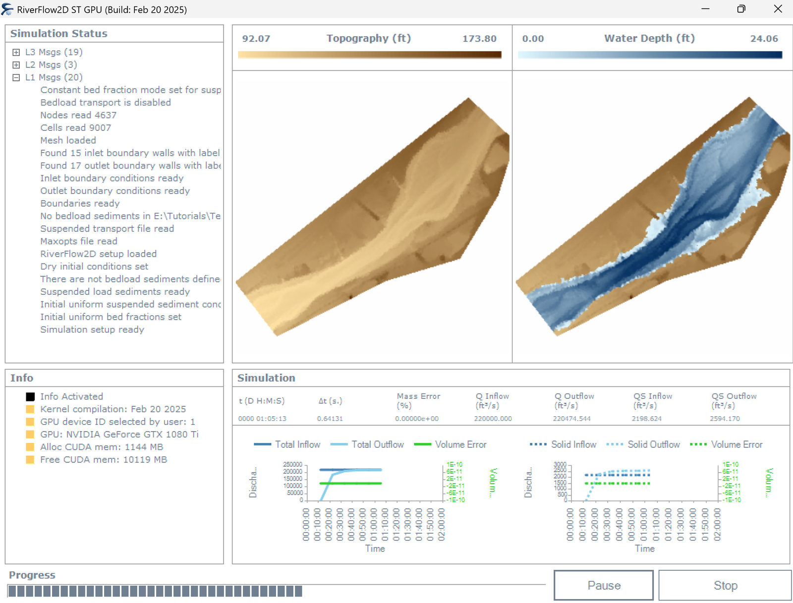
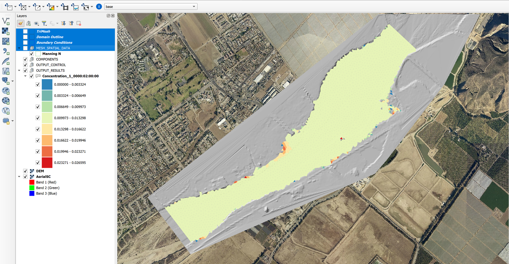

# Simulating suspended sediment transport with inflows of suspended sediment concentrations

In the Sediment Transport model you can define inflows of suspended sediment concentrations. This is useful to represent the spatial distribution of said sediments in the modeling domain. This exercise illustrates how to configure and perform a suspended sediment transport simulation using RiverFlow2D  in which there is an inflow of suspended sediment concentrations using the QGIS interface. The procedure includes the following steps:

1.  Open an existing RiverFlow2D  project.

2.  Export the project to Hydronia Data Input Program.

3.  Edit the parameters in the Hydronia Data Input Program.

4.  Running the model.

::: shaded
The files required to follow this tutorial can be extracted from the 'ExampleProjects' zip file under the 'SuspendedSediments' folder. This zip file is downloaded separately from your installation materials.
:::

## Open an existing project

1.  Open QGIS

2.  In the main menu go to *Project* $\rightarrow$ *Open...* browse to the existing exercise folder: .

This project comes with preconfigured layers: a domain outline with cells of 100m size, a the digital elevation model DEM of the river bed in raster format, the layer with the boundary conditions where inflow is located in the upper right and outflow in the lower left. The boundary conditions are a hydrograph with a peak discharge of 220000 $ft^3/s$ and outflow condition is set to Uniform Flow Condition. When you open the project you will have a project image loaded in QGIS as shown in Figure 10.1.

{ width=90% }

## Exporting files to RiverFlow2D 

The project is already set up within QGIS, so we can export the files to RiverFlow2D.

1.  Click on the *Export RiverFlow2D  * button

    <figure>
    
    </figure>

2.  When run the plugin a window is displayed, select the raster layer that contains the Digital Elevation Model (DEM) and the name of the project to be exported.

3.  Before running the plugin activate the layer with the DEM (if it is deactivated).

    { width=60% }

4.  After entering all the required information, click \[OK\] to begin the export process.

Once the export process completes, RiverFlow2D  will automatically load the project's 'base.DAT' file.

## Running the model

After exporting the files, RiverFlow2D  loads the project file 'base.DAT' and displays the *Control Data* panel as shown in Figure 10.3

{ width=90% }

Note that the sediment transport module is not selected by default. The Hydronia Data Input Program  should be configured as follows:

1.  On the Control Data panel, click on *Sediment Transport* module. (If you have an Nvidia GPU, you can click on *RiverFlow2D  GPU* under *Model Selection*.)

2.  To create the '.SEDB' file with the parameters to calculate sediment transport: in the Modules list select *Sediment Transport*.

3.  Enter the parameters: In this example the *Sediment Transport Mode* checkbox for *Bed Load Sediment* is deactivated and *Suspended Sediments* is left active.

4.  In the *Suspended Sediment Transport* section: Uncheck the option for *Bed Fraction Evolution*.

5.  Under the *Dispersion coefficient* section, give the values *0.1* for Longitudinal and *0.001* for Transversal.

6.  Click on *Add Suspended Sediment Fraction* to add a single fraction with the default values presented by the Hydronia Data Input Program, we will have an image similar to the one shown in the following Figure:

    { width=90% }

    Leave all other parameters at their default values.

7.  Click the \[Save SED\* Files\] button and leave the default name provided, click \[Save\].

8.  On the left-hand panel, click on *Open Boundary Conditions*.

9.  In the Boundary Conditions panel, click on the entry for BC 1, Discharge vs. Time. A message should be displayed indicating that you will need to add a column for each concentration that is configured in the *Sediment Transport* module:

    { width=60% }

10. In the section displaying the contents of the 'Inflow_1.QVT' file, scroll to the right and add the concentrations 0.01 to each row in the *Conc.1* column.

11. Once entered, a warning message should be displayed indicating that the 'Inflow_1.QVT' file has been modified, click \[Yes\] to save the changes.

12. To run the model, click on the *Run RiverFlow2D* button in the lower section of Hydronia Data Input Program.

13. Click \[Yes\] when asked to save changes. By default it will prompt to overwrite the existing 'base.DAT', click \[OK\].

The window presented while running the model shows: simulation time, volume conservation error, total discharge of the liquid flow in and out and in this case also shows the sediment load at the inlet and outlet as well as other parameters as the execution progresses (Figure [10.6](#9-9)).

{ width=80% }

## Check the output files

RiverFlow2D  creates the following files for output time interval defined in the *Control Data* panel:

'cell_st_DDDD_HH_MM_SS.textout'

Where DDDD indicates the date, HH, hour, MM minutes and SS seconds.

The format for these files is as follows: The first line indicates the number of suspended sediment classes/fractions used in the ST run times 2 plus 1 (2\*NSSNFRAC+1). Then follows NELEM lines with results for each cell in the triangular-cell mesh.

## Generate a Concentration Map

1.  Click the *Results vs Time Maps* button.

2.  Select *Concentrations and Properties versus Time Maps*.

3.  In the *Maps* section, select `Concentration_1`.

4.  In the *Output Times* section, select the desired time (e.g., `0000:02:00:00`).

5.  Move the second desired output time to the *Output Map* section by clicking the right arrow button ($\rightarrow$).

6.  Click *OK* to generate the map.

{ width=90% }

This concludes the *Simulating suspended sediment transport with inflows of suspended sediment concentrations* exercise.
