# Urban Drainage using RiverFlow2D and EPA-SWMM

This tutorial illustrates how to apply the RiverFlow2D  Urban Drainage module that integrates surface flooding with EPA-SWMM storm drain model. The project objective is to assess the shallow inundation originating from a surcharging underground pipe. The procedure involves the following steps:

1.  Create a SWMM application.

2.  Open an existing RiverFlow2D  model.

3.  Import the surface-storm drain exchange points from the'.INP' SWMM file.

4.  Generate the mesh.

5.  Export the files of RiverFlow2D.

6.  Run the model.

::: shaded
The files required to follow this tutorial can be extracted from the 'ExampleProjects' zip file under the 'UrbanDrainageTutorial' folder. This zip file is downloaded separately from your installation materials.
:::

The pipe is modeled in 1D and connected to the 2D mesh through a manhole. The modeled area is approximately 0.4 km by 0.96 km (see Figure 12.1). A storm drain of circular section of $1.4 m$ in diameter and 1340 m in length is assumed to run through the modeled area. The pipe Manning's roughness is set to n=0.017. An inflow boundary condition is applied at the upstream end of the pipe, illustrated in Figure 12.2. A free outfall is considered as downstream boundary condition. A base initial flow of 1.6 m$^3$/s is set as uniform initial condition. A surcharge is expected to occur at a vertical manhole of 1 m$^2$ cross-section located 467 m from the top end of the culvert at the coordinates (x=264,896 m,y=664,747 m). The profile geometry of the culvert is given in Table [\[pipe012\]](#pipe012) and shown in Figure 12.3.

{ width=100% }

{ width=100% }

| c c c c c Node | Distance from upstream inlet (m) | Invert level (m) | Reach length (m) | X | Y |
| --- | --- | --- | --- | --- | --- |
| N1 | 0͡ | 39.17 | - | 264896.000 | 664747.000 |
| N2_manhole | 467͡ | 29.46 | 467 | 264896.000 | 664747.000 |
| N3 | 571͡ | 27.70 | 104 | 265633.232 | 664154.002 |
| N4 | 677͡ | 26.37 | 106 | 266474.164 | 663829.787 |
| N5 | 877͡ | 25.70 | 200 | 267730.496 | 663302.938 |
| N6 | 991͡ | 24.64 | 114 | 268470.111 | 662978.723 |
| N7 | 1145͡ | 24.29 | 154 | 269533.941 | 662725.431 |
| Out1 | 1340͡ | 23.49 | 195 | 271874.367 | 661752.786 |

{ width=100% }

## Storm drain configuration in EPA-SWMM

::: shader
If you want to skip this step, you may want to use the SWMM 'base.INP' in the tutorial folder. In that case, please go to section 12.1.1.
:::

1.  Open the SWMM application.

2.  The first step consists in setting the position of all the nodes that conforms the drainage network by means of the button *Add a junction node*:

    { width=38% }

    On the *Study area map* window, click as many times as nodes should be added to the network. In this project there will be 8 nodes. Note that the position of the nodes is schematic:

    { width=100% }

3.  Configure the node data by double-clicking on each node. The node properties window should appear:

    <figure>
    <p><span class="image placeholder" data-original-image-src="img/n1" data-original-image-title="" width="38%">image</span> <span class="image placeholder" data-original-image-src="img/n2" data-original-image-title="" width="38%">image</span></p>
    </figure>

    In this example, the most relevant parameters are: *Name*, *X-* and *Y-Coordinates*, *Inflows*, *Invert elevation* and *Max. depth*. The only inflow nodes are *N1* and *N2_manhole*. Node *N2_manhole* should have *Max. depth=2 m*. Node *N1* is the discharge input and should follow the time series given in Figure 12.2.

    { width=38% }

    The time series can be inserted point-by-point or read from file. On the other hand, node *N2_manhole* will be the connection with the surface domain and the baseline values should be 0.0:

    <figure>
    <p><span class="image placeholder" data-original-image-src="img/inflow_n1_series" data-original-image-title="" width="38%">image</span> <span class="image placeholder" data-original-image-src="img/inflow_n2" data-original-image-title="" width="38%">image</span></p>
    </figure>

    The outfall node *Out1* should be configured as *free*:

    { width=38% }

4.  Join the nodes by means of the *Add a conduit link* tool:

    { width=38% }

    The result should look like the following figure:

    { width=100% }

5.  Configure the link properties by double-clicking on each one:

    { width=38% }

    The most relevant properties are: *Name*, *Inlet node*, *Outlet node*, *Shape*, *Max. depth*, *Length*, *Roughness* and *Initial flow*.

6.  Once the network is completely configured, the project should be saved in order to generate the '.INP' file that should be similar to the one shown below.

```{=html}
<!-- -->
```

    [EVAPORATION]
    ;;Data Source    Parameters
    ;;-------------- ----------------
    CONSTANT         0.0
    DRY_ONLY         NO

    [JUNCTIONS]
    ;;Name           Elevation  MaxDepth   InitDepth  SurDepth   Aponded   
    ;;-------------- ---------- ---------- ---------- ---------- ----------
    N1               39.17      0          0          0          0         
    N2_manhole       29.46      2          0          0          0         
    N3               27.7       0          0          0          0         
    N4               26.37      0          0          0          0         
    N5               25.7       0          0          0          0         
    N6               24.64      0          0          0          0         
    N7               24.29      0          0          0          0         

    [OUTFALLS]
    ;;Name           Elevation  Type       Stage Data       Gated    Route To        
    ;;-------------- ---------- ---------- ---------------- -------- ----------------
    Out1             23.49      FREE                        NO                       

    [CONDUITS]
    ;;Name           From Node        To Node          Length     Roughness  InOffset   OutOffset  InitFlow   MaxFlow   
    ;;-------------- ---------------- ---------------- ---------- ---------- ---------- ---------- ---------- ----------
    L1               N1               N2_manhole       467        0.017      0          0          1.6        0         
    L2               N2_manhole       N3               104        0.017      0          0          1.6        0         
    L3               N3               N4               106        0.017      0          0          1.6        0         
    L4               N4               N5               200        0.017      0          0          1.6        0         
    L5               N5               N6               114        0.017      0          0          1.6        0         
    L6               N6               N7               154        0.017      0          0          1.6        0         
    L7               N7               Out1             195        0.017      0          0          1.6        0         

    [XSECTIONS]
    ;;Link           Shape        Geom1            Geom2      Geom3      Geom4      Barrels    Culvert   
    ;;-------------- ------------ ---------------- ---------- ---------- ---------- ---------- ----------
    L1               CIRCULAR     1.4              0          0          0          1                    
    L2               CIRCULAR     1.4              0          0          0          1                    
    L3               CIRCULAR     1.4              0          0          0          1                    
    L4               CIRCULAR     1.4              0          0          0          1                    
    L5               CIRCULAR     1.4              0          0          0          1                    
    L6               CIRCULAR     1.4              0          0          0          1                    
    L7               CIRCULAR     1.4              0          0          0          1                    

    [INFLOWS]
    ;;Node           Constituent      Time Series      Type     Mfactor  Sfactor  Baseline Pattern
    ;;-------------- ---------------- ---------------- -------- -------- -------- -------- --------
    N1               FLOW             discharge_inflow FLOW     1.0      1                
    N2_manhole       FLOW             ""               FLOW     1.0      1.0      0.0     

    [TIMESERIES]
    ;;Name           Date       Time       Value     
    ;;-------------- ---------- ---------- ----------
    discharge_inflow            0:00       1.6       
    discharge_inflow            0:02       1.6       
    discharge_inflow            0:04       1.6       
    discharge_inflow            0:06       1.6       
    discharge_inflow            0:08       1.61644   
    discharge_inflow            0:10       1.6336    
    discharge_inflow            0:12       1.65472   
    discharge_inflow            0:14       1.67188   
    discharge_inflow            0:16       1.68904   
    discharge_inflow            0:18       1.70488   
    discharge_inflow            0:20       1.71808   
    discharge_inflow            0:22       1.71808   
    discharge_inflow            0:24       1.7392    
    discharge_inflow            0:26       1.75636   
    discharge_inflow            0:28       1.77352   
    discharge_inflow            0:30       1.7986    
    discharge_inflow            0:32       1.82764   
    discharge_inflow            0:34       1.8448    
    discharge_inflow            0:36       1.88704   
    discharge_inflow            0:38       1.92136   
    discharge_inflow            0:40       1.95436   
    discharge_inflow            0:42       1.98868   
    discharge_inflow            0:44       2.02168   
    discharge_inflow            0:46       2.056     
    discharge_inflow            0:48       2.09824   
    discharge_inflow            0:50       2.1484    
    discharge_inflow            0:52       2.19988   
    discharge_inflow            0:54       2.25928   
    discharge_inflow            0:56       2.32264   
    discharge_inflow            0:58       2.3728    
    discharge_inflow            1:00       2.4784    
    discharge_inflow            1:02       2.56288   
    discharge_inflow            1:04       2.66056   
    discharge_inflow            1:06       2.77012   
    discharge_inflow            1:08       2.8876    
    discharge_inflow            1:10       3.0064    
    discharge_inflow            1:12       3.17536   
    discharge_inflow            1:14       3.29416   
    discharge_inflow            1:16       3.44992   
    discharge_inflow            1:18       3.61888   
    discharge_inflow            1:20       3.78784   
    discharge_inflow            1:22       3.9568    
    discharge_inflow            1:24       4.168     
    discharge_inflow            1:26       4.33696   
    discharge_inflow            1:28       4.50592   
    discharge_inflow            1:30       4.67488   
    discharge_inflow            1:32       4.83988   
    discharge_inflow            1:34       4.99168   
    discharge_inflow            1:36       5.16064   
    discharge_inflow            1:38       5.27944   
    discharge_inflow            1:40       5.41012   
    discharge_inflow            1:42       5.54476   
    discharge_inflow            1:44       5.67148   
    discharge_inflow            1:46       5.77312   
    discharge_inflow            1:48       5.89984   
    discharge_inflow            1:50       6.00148   
    discharge_inflow            1:52       6.10312   
    discharge_inflow            1:54       6.1876    
    discharge_inflow            1:56       6.24096   
    discharge_inflow            1:58       6.28111   
    discharge_inflow            2:00       6.28111   
    discharge_inflow            2:02       6.24096   
    discharge_inflow            2:04       6.1876    
    discharge_inflow            2:06       6.10312   
    discharge_inflow            2:08       6.00148   
    discharge_inflow            2:10       5.89984   
    discharge_inflow            2:12       5.77312   
    discharge_inflow            2:14       5.67148   
    discharge_inflow            2:16       5.54476   
    discharge_inflow            2:18       5.41012   
    discharge_inflow            2:20       5.27944   
    discharge_inflow            2:22       5.16064   
    discharge_inflow            2:24       4.99168   
    discharge_inflow            2:26       4.83988   
    discharge_inflow            2:28       4.67488   
    discharge_inflow            2:30       4.50592   
    discharge_inflow            2:32       4.33696   
    discharge_inflow            2:34       4.168     
    discharge_inflow            2:36       3.9568    
    discharge_inflow            2:38       3.78784   
    discharge_inflow            2:40       3.61888   
    discharge_inflow            2:42       3.44992   
    discharge_inflow            2:44       3.29416   
    discharge_inflow            2:46       3.17536   
    discharge_inflow            2:48       3.0064    
    discharge_inflow            2:50       2.8876    
    discharge_inflow            2:52       2.77012   
    discharge_inflow            2:54       2.66056   
    discharge_inflow            2:56       2.56288   
    discharge_inflow            2:58       2.4784    
    discharge_inflow            3:00       2.3728    
    discharge_inflow            3:02       2.32264   
    discharge_inflow            3:04       2.25928   
    discharge_inflow            3:06       2.19988   
    discharge_inflow            3:08       2.1484    
    discharge_inflow            3:10       2.09824   
    discharge_inflow            3:12       2.056     
    discharge_inflow            3:14       2.02168   
    discharge_inflow            3:16       1.98868   
    discharge_inflow            3:18       1.95436   
    discharge_inflow            3:20       1.92136   
    discharge_inflow            3:22       1.88704   
    discharge_inflow            3:24       1.8448    
    discharge_inflow            3:26       1.82764   
    discharge_inflow            3:28       1.7986    
    discharge_inflow            3:30       1.77352   
    discharge_inflow            3:32       1.75636   
    discharge_inflow            3:34       1.7392    
    discharge_inflow            3:36       1.71808   
    discharge_inflow            3:38       1.71808   
    discharge_inflow            3:40       1.70488   
    discharge_inflow            3:42       1.68904   
    discharge_inflow            3:44       1.67188   
    discharge_inflow            3:46       1.65472   
    discharge_inflow            3:48       1.6336    
    discharge_inflow            3:50       1.61644   
    discharge_inflow            3:52       1.6       
    discharge_inflow            3:54       1.6       
    discharge_inflow            3:56       1.6       
    discharge_inflow            3:58       1.6       
    discharge_inflow            5:00       1.6       

    [REPORT]
    ;;Reporting Options
    INPUT      NO
    CONTROLS   NO
    SUBCATCHMENTS ALL
    NODES ALL
    LINKS ALL

    [TAGS]

    [MAP]
    DIMENSIONS 260000.000 660000.000 270000.000 670000.000
    Units      Meters

    [COORDINATES]
    ;;Node           X-Coord            Y-Coord
    ;;-------------- ------------------ ------------------
    N1               264903.824         664753.843
    N2_manhole       264896.000         664747.000
    N3               265633.232         664154.002
    N4               266474.164         663829.787
    N5               267730.496         663302.938
    N6               268470.111         662978.723
    N7               269533.941         662725.431
    Out1             271874.367         661752.786

    [VERTICES]
    ;;Link           X-Coord            Y-Coord           
    ;;-------------- ------------------ ------------------

### Starting QGIS
Start the QGIS  software. After loading we will have a window similar to the one shown below:

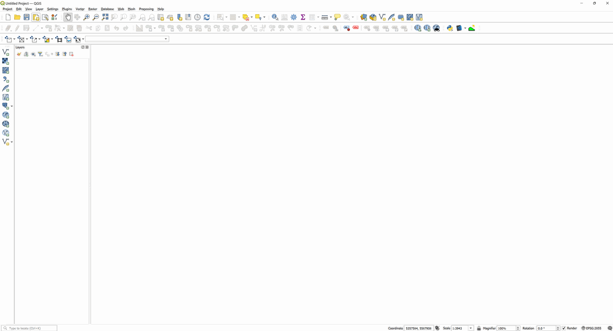{ width=100% }

### Start a new RiverFlow2D  project

1.  In the RiverFlow2D  toolbar, click on the *New RiverFlow2D  Project* button

    { width=0.6cm }

    to start a new RiverFlow2D  project. A dialog window appears where you select the layers that will be created, the Coordinate Reference System (CRS), and the directory path where the layers will be saved. This example will use the basic layers: *Domain Outline*, *Manning N*, and *BoundaryConditions*

2.  Select *None* in the Layers dropdown menu.

3.  Select the *Projection* button.

4.  In the Filter textbox, type 7405 and select the *Coordinate Reference System* as shown:

    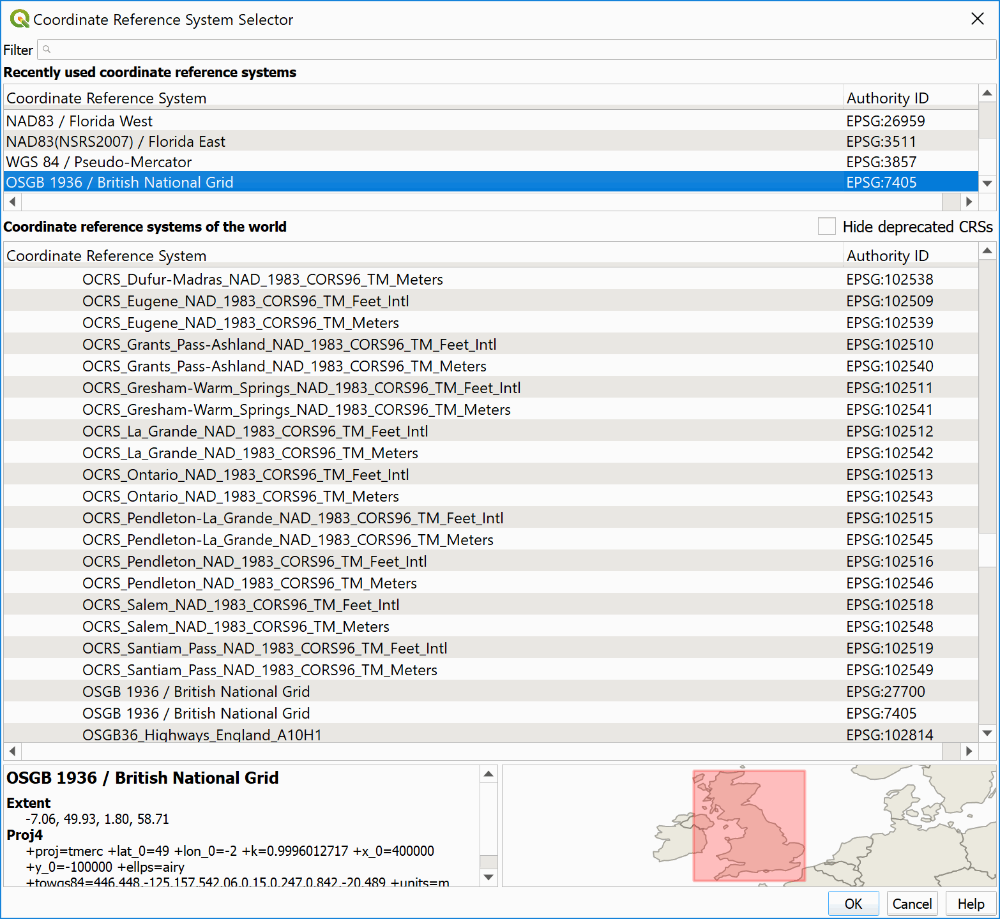{ width=50% }

5.  Click OK.

6.  The Coordinate Reference System (CRS) EPSG code: 7405 should be selected, and the dialog window will look like this:

    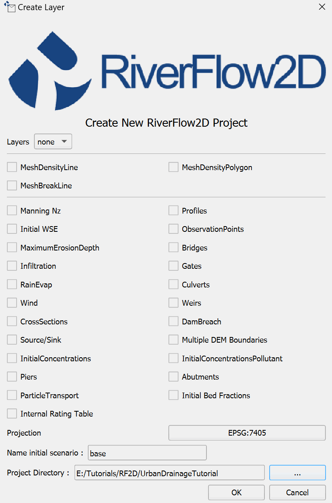{ width=40% }

7.  Click the "..." button to provide a path to store the project files in the *Project Directory* textbox. For this example you may browse to the UrbanDrainageTutorial folder.

8.  After clicking OK, the layer templates are created, and displayed on the *Layers Panel*:

    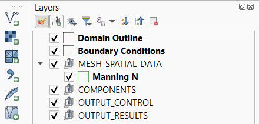{ width=45% }

    ::: shaded
    RiverFlow2D  will use the unit system as that defined in the projection you selected. If the projection has coordinates in meters, units will be set to Metric. If the projection coordinates are in feet, units will be set to English.
    :::

9.  On the QGIS *Project* menu, click *Save*, to save the project in the same directory that you previously selected in the *Create New Project* dialog above.

### Load elevation data

RiverFlow2D  uses elevation data in raster format. To load an ASCII grid file, from the *Layer* menu, click *Add Layer*, and then click *Add Raster Layer...* You may also click the *Add Raster Layer* button:

{ width=1cm }

Search for the 'TEST8BDEM.ASC' in the 'UrbanDrainageTutorial\\base' folder:

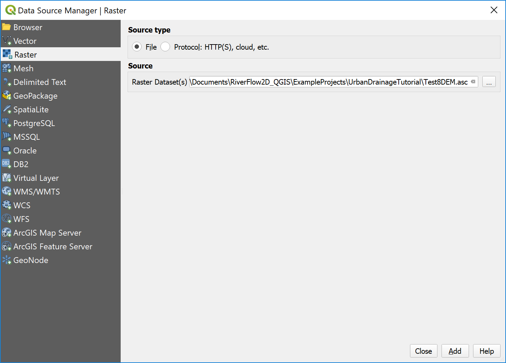{ width=80% }

1.  Click Add, assign the EPSG:7405 projection code to the file, and raster will be displayed on the screen, by default it is rendered in gray gradient as shown in Figure [19.7](#11).

    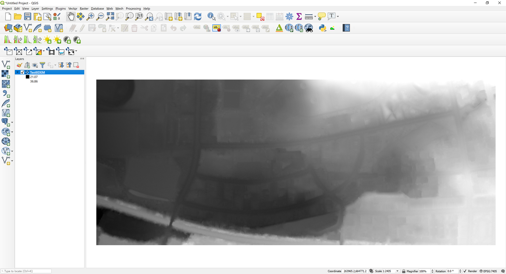{ width=100% }

    ::: shaded
    Right-clicking on the label of the created layer and selecting *Properties* allows you to change the rendering style for a more informative color palette.
    :::

    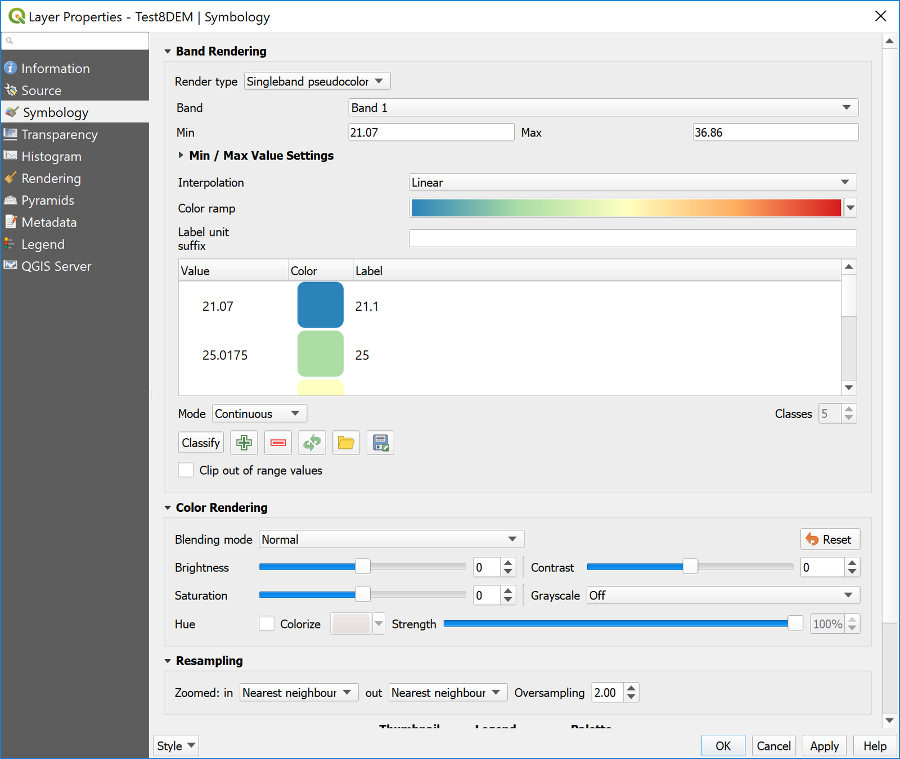{ width=50% }

    And now the raster layer is displayed with the new color palette selected:

    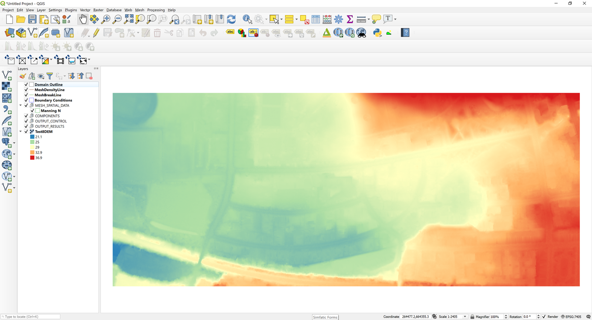{ width=100% }

    ::: shaded
    It is convenient to move the raster layer created to the end of the list of layers, thus it does not interfere with the display of other layers.
    :::

    ### Import the surface-storm drain exchange node connections from the SWMM .INP file

    To connect the surface water mesh with the storm drain components, we will import the exchange nodes from the '.INP' file created in the first part of this tutorial. For that we will use the *Import EPA-SWMM INP file* command from the RiverFlow2D  tools drop down icon:

    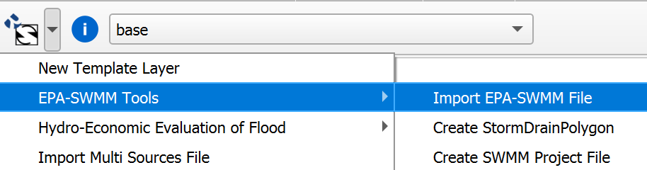{ width=60% }

    Select the 'base.INP' file and a message will indicate the transfer was successful:

    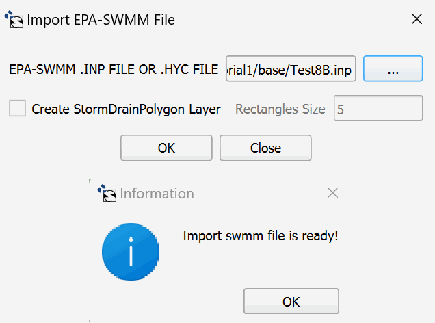{ width=40% }

    You will note that there is a new *StormDrain* layer created and the imported exchange nodes are displayed:

    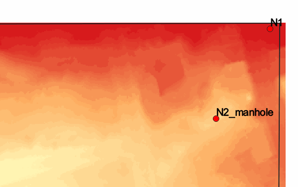{ width=40% }

### Create the limits of the modeling area

The limits of the modeling area are defined using a polygon on the *Domain Outline* layer. To create it do as follows:

1.  Click the *Domain Outline* layer to activate it and then click *Toggle Editing* (pencil) in the toolbar:

    { width=43% }

2.  This activates the rest of the editing buttons. Now click the *Add Feature* tool which is the bean looking polygon.

    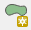{ width=0.8cm }

    Proceed to delineate the outline of the polygon by marking the vertices clicking with the left mouse button:

    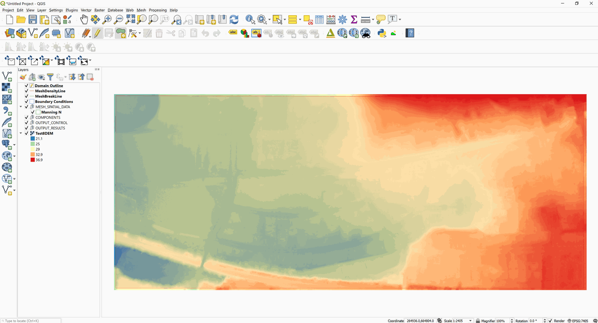{ width=100% }

    ::: shaded
    Make sure that the polygon is contained within the limits of the raster layer since RiverFlow2D  will not extrapolate elevations to areas that are outside of the available data on the raster layer. Also, the SWMM exchange nodes should be inside the *Domain Outline* polygon.
    :::

3.  To finalize and close the polygon, right-click anywhere on the map view area. A dialog window to input the cell size attribute of the newly created polygon. The value for the reference size of the mesh cell is indicated. Enter a value of 10 m.

    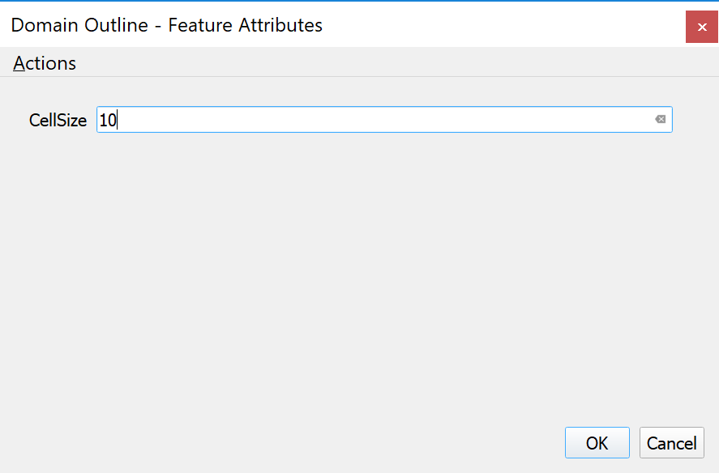{ width=60% }

    Now click on *Toggle Editing* button to deactivate the layer Edit mode and save the changes.

    { width=1cm }

    The *Domain Outline* is now complete.

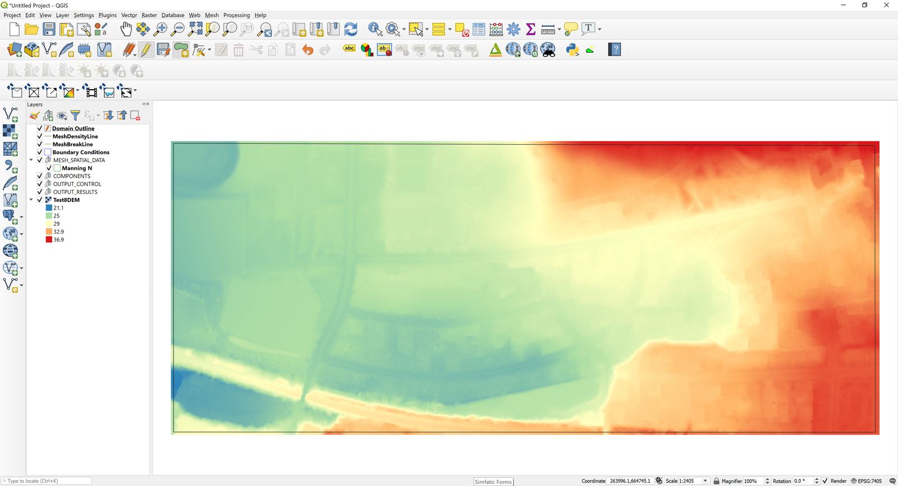{ width=100% }

### Assigning Manning's n

To assign Manning's n roughness values, we will enter polygons with given n's. There can be as many polygons as those required to reproduce the spatial variability of this parameter. In this example, a single polygon will be drawn for the entire area.

1.  Select the *Manning N* layer and click the *Toggle Editing* button:

    { width=1cm }

2.  Draw the polygon around the entire domain taking care that it covers all the cells.

    You should have an image like the one shown below:

    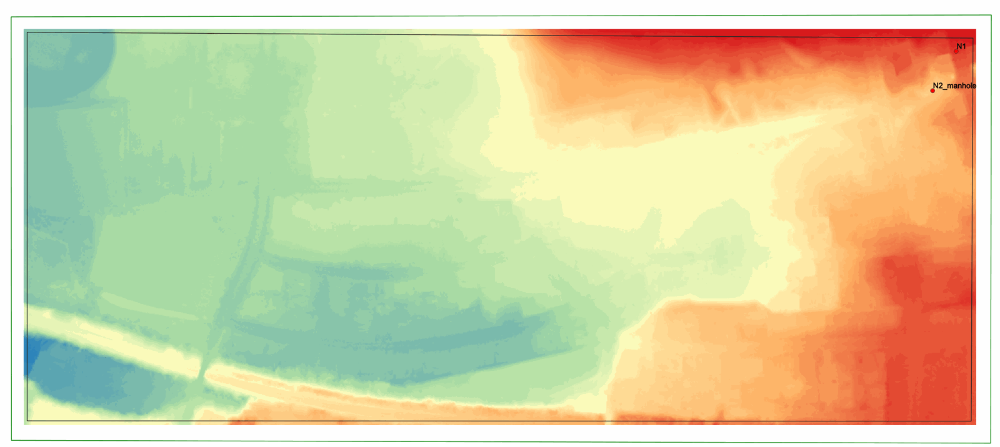{ width=100% }

3.  Close the last vertices on the polygon by right-clicking on the desired position. The following dialog window is presented where you must input the Manning's n value associated to the polygon. For this case, enter 0.03:

    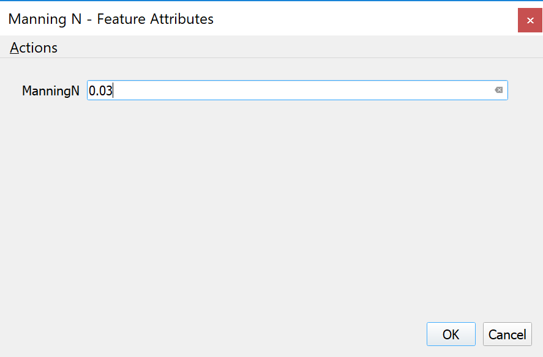{ width=50% }

4.  Click the *Save* button

    { width=1cm }

    and then click the Editing Tool button

    { width=1cm }

    to deactivate editing mode.

### Imposing the boundary conditions

By default all boundaries are closed unless we set open boundary conditions. Since in this project flow is input from the storm drain, we will set only outflow conditions. To define the boundary conditions draw a polygon that includes the nodes or vertices at the left end of the mesh as indicated in the figure:

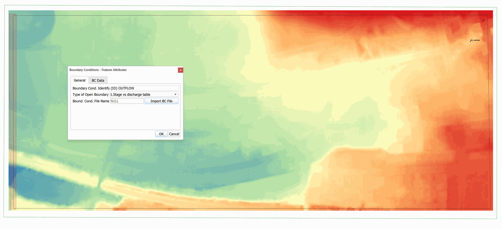{ width=100% }

1.  Select the *BoundaryConditions* layer in the Layers panel.

2.  Click the Toggle Editing button to add the polygons that are going to indicate the nodes on which the inflow and outflow conditions are established.

    { width=1cm }

3.  To finish the polygon, right-click on desired location. A window to enter the attributes of the newly created polygon is displayed.

4.  The window contains a list to select the name of ID of this BC (*Boundary Cond. ID*), set Id to OUTFLOW condition, and from the list of boundary condition Types select *Free Outflow*.

    Enter the data as shown in Figure 12.21 below:

    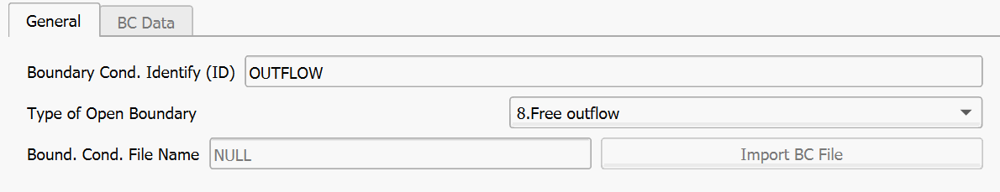{ width=100% }

5.  Click the Save { width=0.7cm } button:

6.  Click the Toggle Editing { width=0.7cm } button to exit editing mode.

### Generating the triangular-cell mesh

Now that the *Domain Outline* has been set, the Manning's n entered, and the SWMM nodes have been imported, we can proceed to create the mesh using the GMSH  program.

To run the plugin, on the the *Plugins* menu, click *Generate TriMesh*, or click on the icon:

{ width=0.6cm }

The following figure shows the generated mesh. You will also see in the Layers panel two new layers: *Trimesh* and *Trimesh_point*:

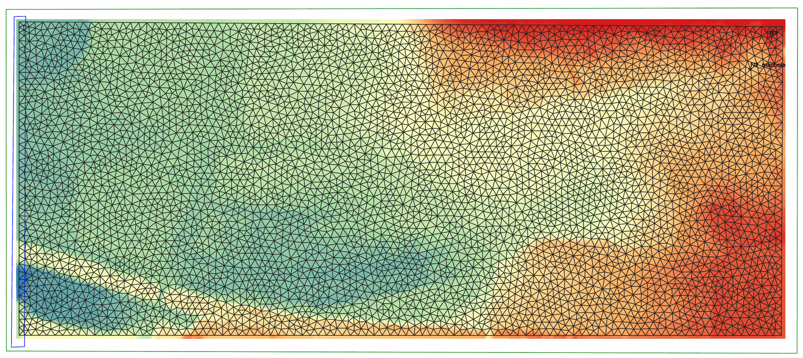{ width=100% }

::: shaded
Before using the *Export* plugin, save the QGIS  project. To accomplish this, from the *Project* menu, click *Save*. Name the project file 'UrbanDrainageTutorial.qgz'.
:::

## Exporting the files

Once the layers with the input information to the model have been created, the next step is to export from QGIS the data files required by the RiverFlow2D  model.

1.  Run the *Export RiverFlow2D * plugin

    { width=1cm }

2.  A dialog window is presented. We must indicate the raster layer of the Digital Elevation Model (DEM), as this layer is not created by the plugin and its name may be different.

3.  Using the "..." button, select the path, and enter the file name. Please, ensure that the path is the same as that previously selected, and the one corresponding to the '.qgz' project file.

4.  Click OK.

    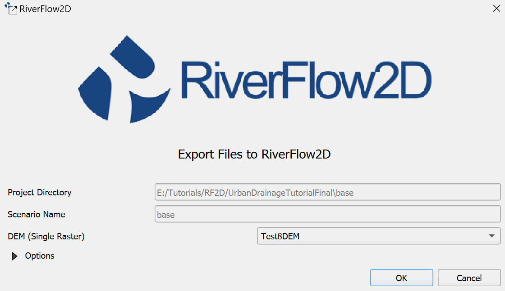{ width=50% }

    The plugin will begin to process the information. A message bar at the top will indicate the approximate progress of the process.

    Once the process of creating the files with the input data is finished, the Hydronia Data Input Program  is opened automatically and a dialog window is presented with the model project to run. In this case: 'base.DAT' should already be set.

    Then the window with the input parameters of RiverFlow2D  is presented, as shown in the image below:

    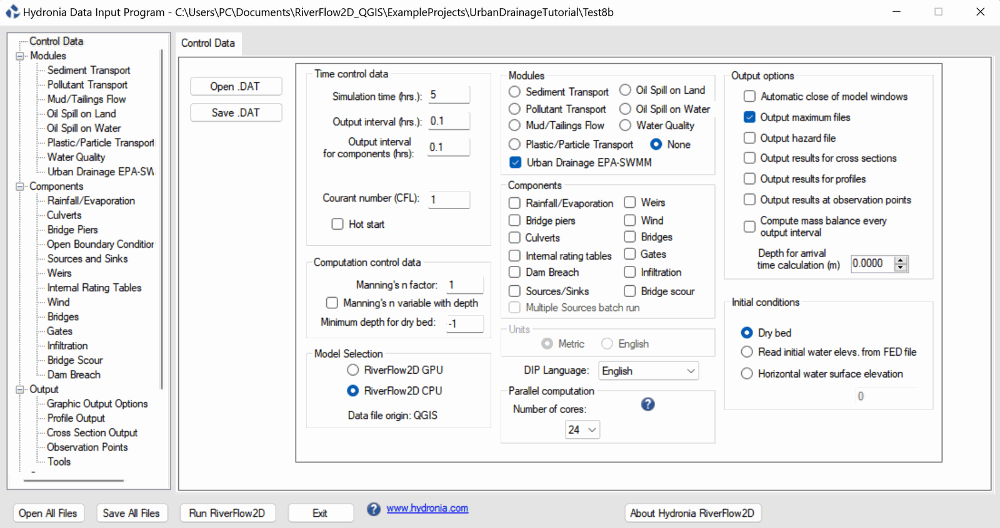{ width=90% }

    Enter 5 hours for the Simulation time and click on the Storm Drain EPA-SWMM panel. Enter for the N1 node CD = 0 since we don't want exchange with that inflow node to the conduit.

    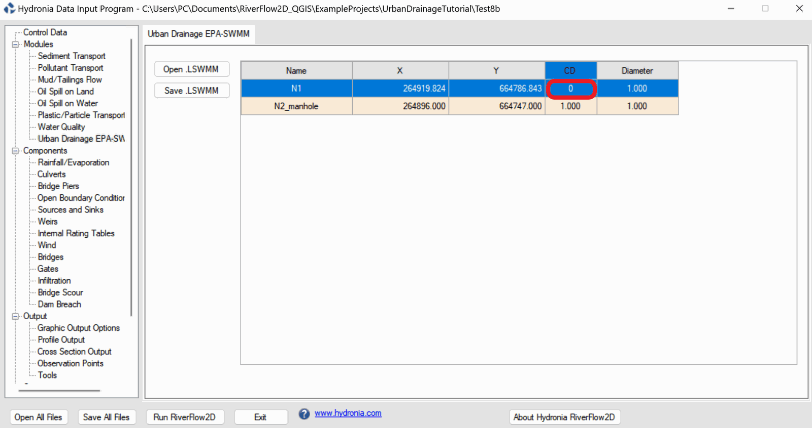{ width=100% }

5.  Click \[Save .LWSMM\] and overwrite the existing file, for this tutorial the filename will be the name of the project when it was exported with the '.lwsmm' extension.

6.  Click the *Run RiverFlow2D* button to run the model. The model will show a window reporting on the model progress.

    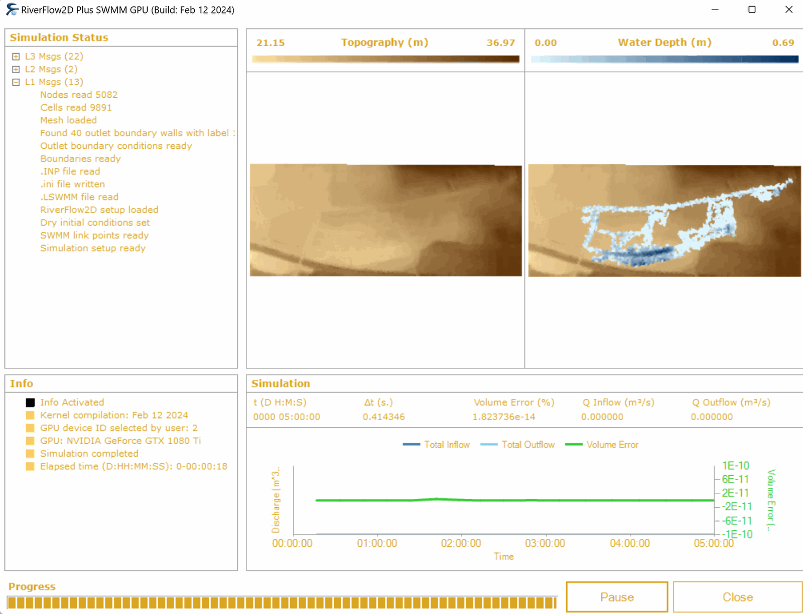{ width=100% }

    When the run finishes, close the window and you can import results back in QGIS to prepare maps and animations. An example of the maximum depths is shown below:

    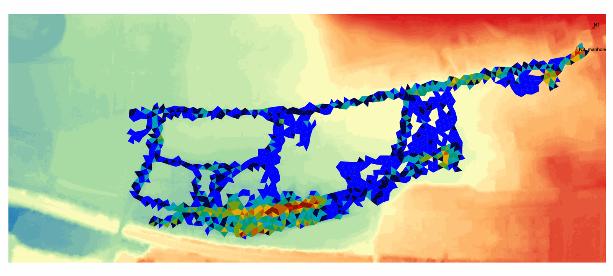{ width=100% }

This concludes the *Urban Drainage using RiverFlow2D and EPA-SWMM* tutorial.


