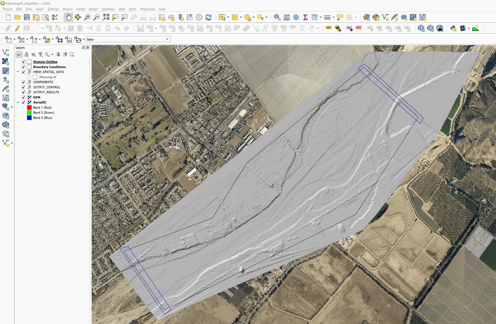
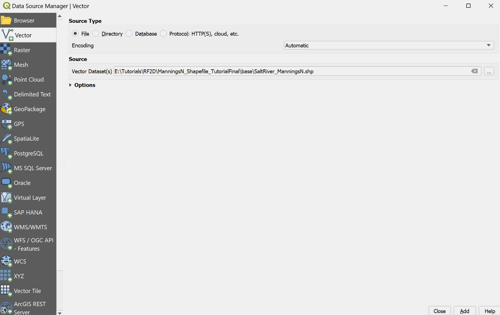
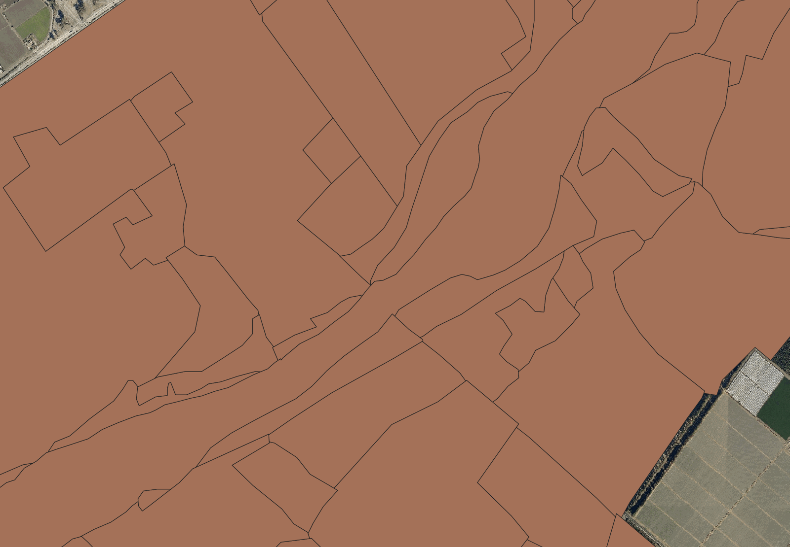
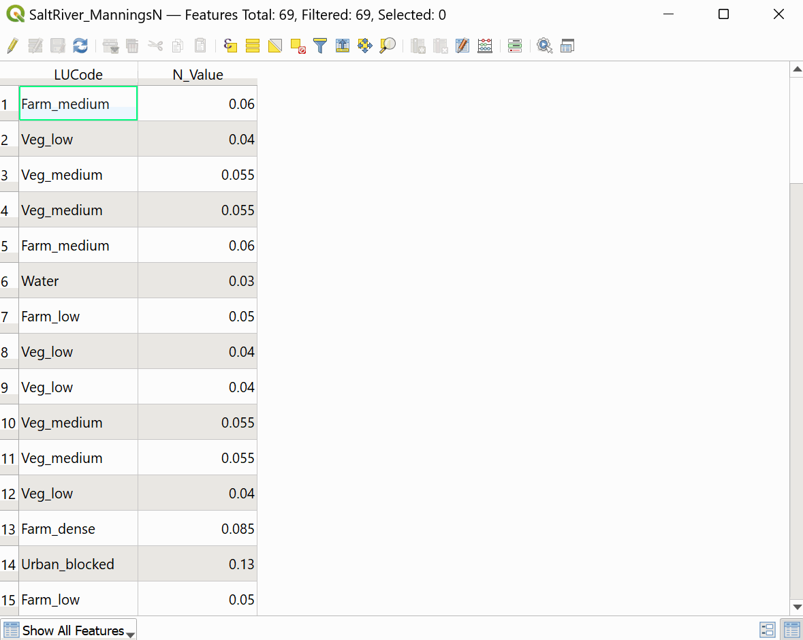
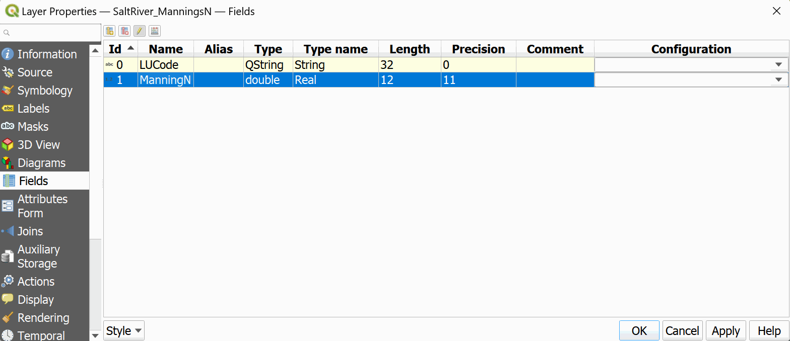
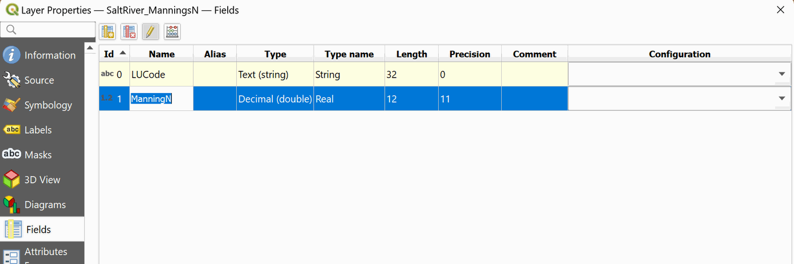
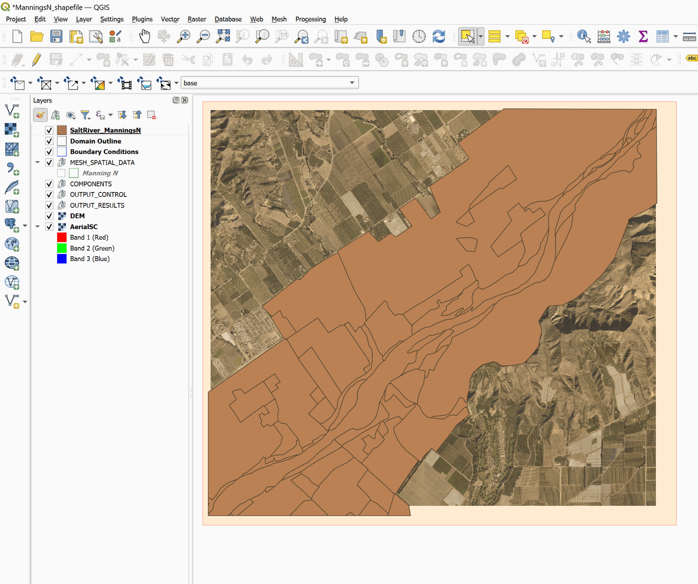
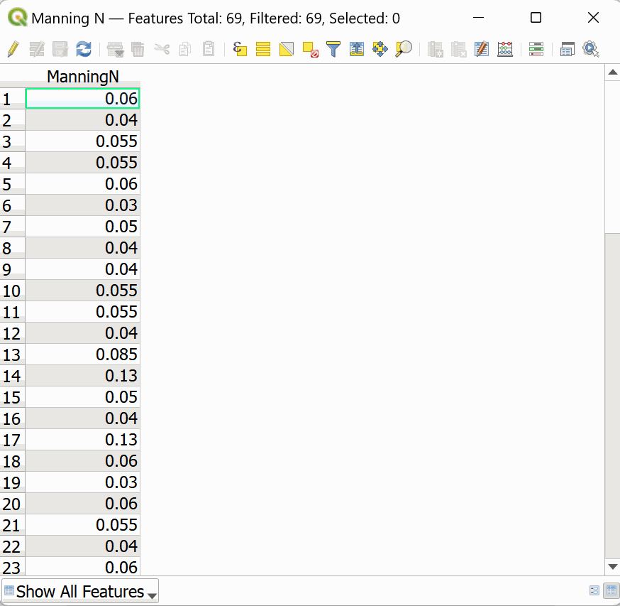

# Using Manning's n ESRI shape files

This tutorial illustrates how to use Manning's n files in ESRI shape file format to assign Manning's n values to an existing project using the QGIS interface. The procedure includes the following steps:

1.  Open an existing RiverFlow2D  project.

2.  Load the shape files with the Manning's n polygons.

3.  Import the Manning's n geometry and values to the *Manning N* layer.

::: shaded
The files required to follow this tutorial can be extracted from the 'ExampleProjects' zip file under the 'ManningsNShapefileTutorial' folder. This zip file is downloaded separately from your installation materials.
:::

## Open an existing project

1.  Open QGIS

2.  On the *Project* menu click *Open...* and browse to the existing project: .

    This project contains the layers of the domain contour, the Digital Elevation Model (DEM) of the river bed in raster format, an aerial photograph, and the boundary conditions layer where the inflow is located in the upper right and outflow in the lower left. The inflow boundary condition is a hydrograph with a peak discharge of 220,000 ft$^3$/s, and the outflow conditions is set to *Free outflow*. When you open the project you will have an image of the project loaded in QGIS as shown in [16.1](#8-1).

    

{ width=100% }

## Load the shape file with the Manning's n polygons

1.  In order to load the shape file with the polygons containing the Manning's n values, click on *Add Vector Layer* button

    <figure>
    
    </figure>

    of Manager layer toolbar or from the main menu *Layer* $\rightarrow$ *Add layer* $\rightarrow$ *Add Vector Layer...*

2.  In tutorial folder under the *base* subfolder, select the 'SaltRiver_ManningsN.shp' file (Figure [16.2](#8-2)).

    

{ width=70% }

    When loading the file, an image similar to the one shown in the following figure will be displayed on the screen:

    

{ width=90% }

## Import the Manning's n geometry and values to the Manning N layer

To transfer spatial and attributive information from the shape file to the *Manning N* layer, a copy and paste operation is performed, but it must be ensured that both layers have a field or column with the same name. The procedure is as follows:

1.  Check the fields name of shape file: Right-click on the *SaltRiver_ManningsN* layer label and in the pop-up menu select the option *Open attribute table* (Figure [16.4](#8-4)).

    

{ width=70% }

    You can see that the shape file loaded has two fields, *LUCode* and *N_Value*, the first one with the coding of the land cover type and the second corresponds to the value of the Manning's n, in the case of the Manning N layer, it has a single field called *ManningN*.

2.  Proceed to change the name of the field *N_Value* to *ManningN*. Close the table of attributes and right-click on the layer label. In the pop-up menu, select Properties then in window that opens select the Fields tab as shown in Figure [16.5](#8-5):

    

{ width=90% }

3.  Click on the *Toggle Editing* button

    <figure>
    
    </figure>

    then change the *N_Value* field name by *ManningN* (Figure [16.6](#8-6)), and click on the *Toggle Editing* button again, and save.

    

{ width=90% }

4.  Copy the polygons of the shape file: select the *SaltRiver_ManningsN* layer in the Layers Panel.

5.  With the select tool { width=1cm } we draw a rectangle that covers the entire layer:

    

{ width=90% }

6.  Copy the spatial elements by clicking on the *Copy* button { width=1cm } of the digitization toolbar

7.  Paste the spatial elements in the *Manning N* layer: select *Manning N* layer of the Layers Panel and set it in edit mode by clicking on the *Toggle Editing* button { width=1cm }.

8.  Click on the *Paste Feature* button { width=1cm }.

    and a message will appear that indicates that features were successfully pasted.

    <figure>
    
    </figure>

9.  Click on the *Toggle Editing* button again { width=1cm }.

    Confirm and save the changes made to the layer.

To verify the operation was successful, open the attribute table of the *Manning N* layer and you can see that the polygons have been copied with their Manning n values. As shown in the Figure below:

{ width=70% }

You can now remove the *SaltRiver_ManningsN* layer from the Layer Panel.

This concludes the *Using Manning's n ESRI shape files* tutorial.
