# Wind driven circulation

RiverFlow2D  and OilFlow2D allow defining wind velocity on the water surface to account for the effect of the wind stress on the flow velocities. The conceptual model of a wind driven simulation require a series of non-overlapping polygons that determine the wind velocity data to the model. Only areas covered by polygons will be affected by the wind stress. Each wind velocity polygon should be associated with a file containing a wind velocity time-series file containing the two components of the wind velocity vector for each time. The user will need to generate the wind velocity data file associated with each polygon, and copy them to the project folder, prior to running the model.

This tutorial illustrates how to perform a wind drive simulation using the QGIS interface. The procedure includes the following steps:

1.  Create time series data for wind speed.

2.  Open an existing RiverFlow2D / OilFlow2D project.

3.  Create the template of the wind layer and the wind speed polygons.

4.  Generate the mesh.

5.  Running the model.

6.  Review wind output files.

::: shaded
The files required to follow this tutorial can be extracted from the 'ExampleProjects' zip file under the 'WindTutorial' folder. This zip file is downloaded separately from your installation materials.
:::

## Open an existing project

1.  Open QGIS

2.  On the *Project* menu click *Open...* to load the existing project: 'WindTutorial.qgz'.

This project contains the layers of the domain contour and the layer of the Digital Elevation Model (DEM) of Lake Champlain in the USA. When the project is opened, a project image will be loaded in QGIS as shown in Figure [15.1](#10-1).

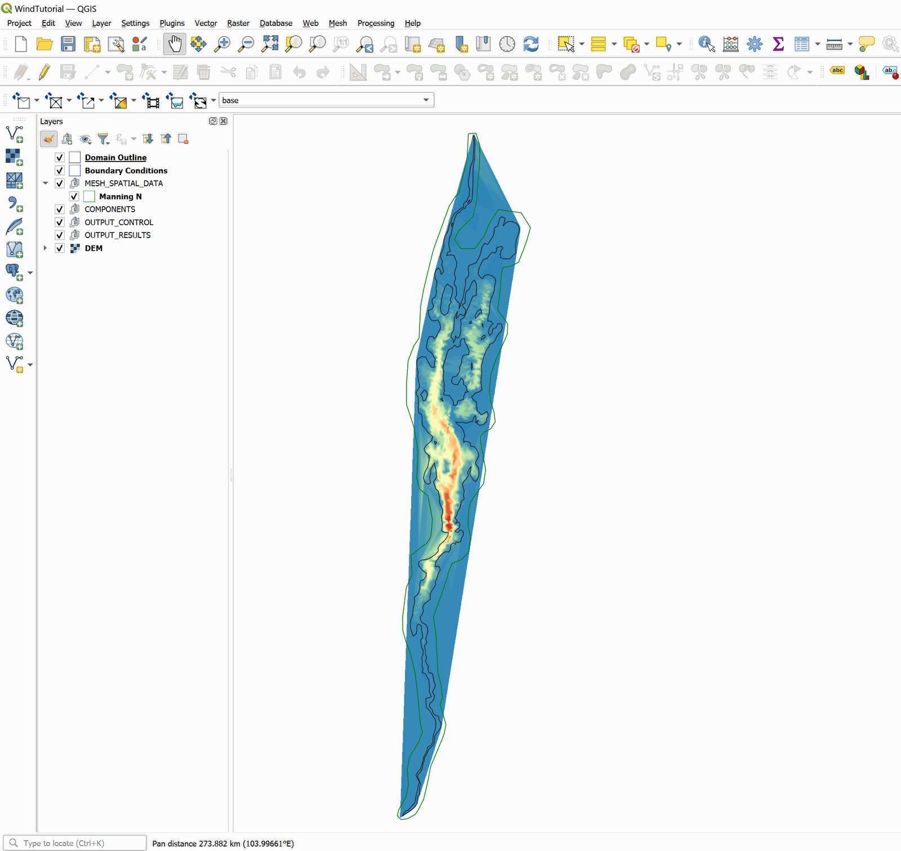{ width=100% }

## Wind velocity time-series data file

To run a wind driven simulation you create polygons over which the wind velocity data will be applied. Each polygon will have an associated velocity time series. These files can be created with any text editor such as Notepad or Wordpad. The wind velocity file has the following format:

Line 1: Number of points in the time series of wind velocity

`NP`

NP lines containing:

`TIME Wvx Wvy `

where `Wvx` and `Wvy`, are the wind velocity components in *x* and *y* directions respectively in m/s or ft/s.

The following table is an excerpt of the 'WindVelocDATA.TXT' file that is included in the Data folder for this tutorial:

    6544
    0        5.97       -2.17
    1        5.09        8.83
    2        3.84        6.63
    3        5.87        4.92
    4        0.00        0.00
    5       -3.31       -1.90
    ...
    6543     3.84       -6.63

## Create the template for the wind layer and the wind speed polygons

To add the template where the polygons are drawn with the wind speed time series data involves the following steps:

1.  Create the template for the Winds layer: In the model toolbar click on the *New Template Layer* command

    <figure>
    
    </figure>

    <figure>
    
    </figure>

2.  In the plugin window, activate the *Wind* checkBox, as shown in the Figure below:

    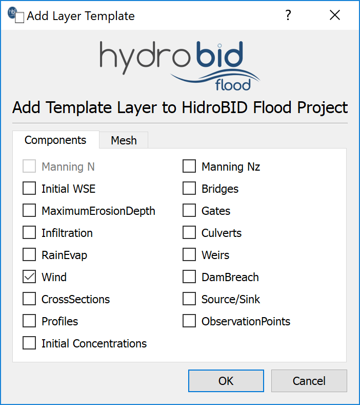{ width=40% }

    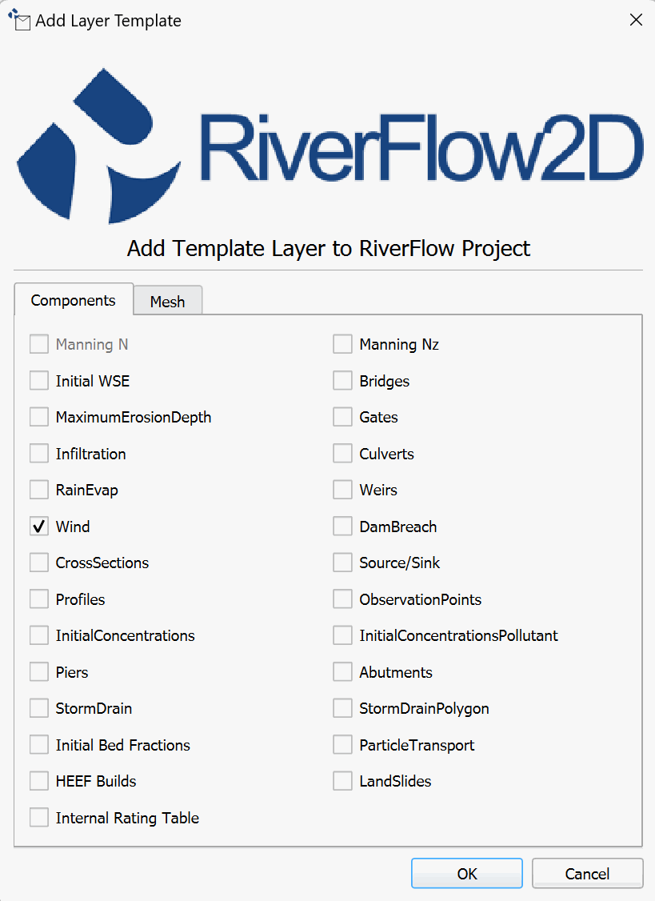{ width=40% }

3.  Edit the Wind layer: In the layers panel, we select the Wind layer and in the digitalization toolbar we click on the *Toggle Editing* tool { width=0.6cm }. A pencil icon will appear in the Wind layer, indicating that the layer is in edit mode:

    <figure>
    
    </figure>

4.  Draw the polygon that demarcates the Wind area: Using the *Add Feature* tool from the digitalization toolbar { width=0.6cm }.

    Draw the polygon that defines the wind area. In this case, the tracing of the polygon must be done in such a way that it covers all the cells of the mesh. Once you finish drawing the polygon a window to input the polygon parameters is immediately opens, which are three:

    -   Wind stress coefficient CD: 0.009,

    -   Air density: 1.225, and

    -   Wind speed time series File: 'WindVelocDATA.txt'.

    The parameter window should be as shown below:

    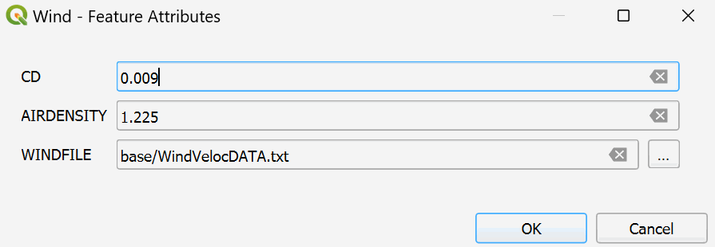{ width=60% }

5.  After input the values, click *OK* and accept the changes. There should be an image similar to the one shown in the following figure:

    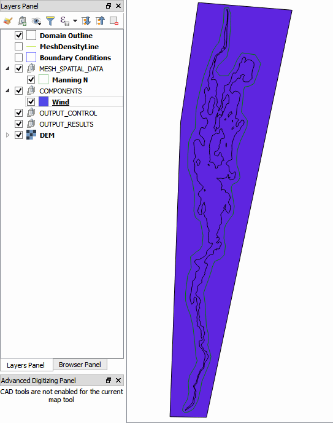{ width=60% }

## Generate the mesh

Then the mesh is generated with the *Generate TriMesh* button

{ width=0.6cm }

{ width=0.6cm }

The results obtained as shown in Figure [15.6](#10-5) (mesh of around 17,500 cells).

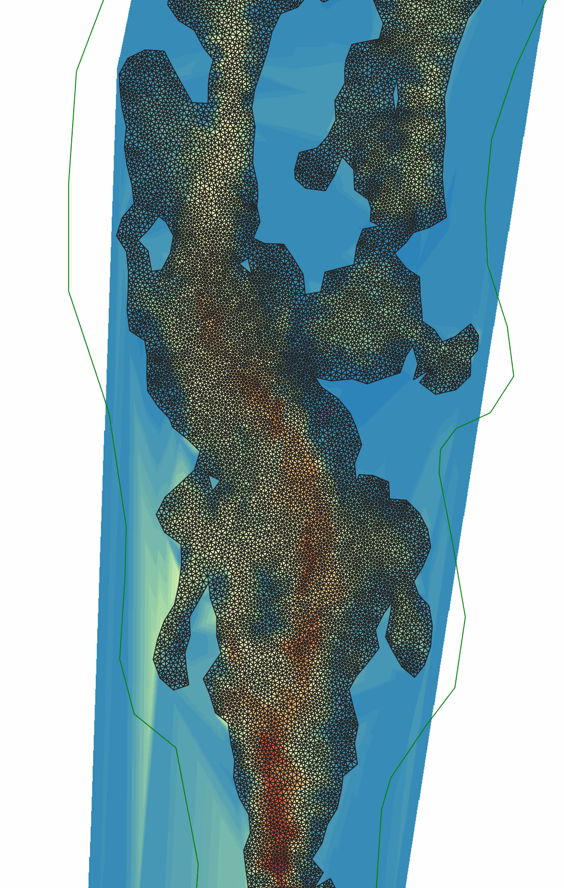{ width=70% }

## Exporting files

Now that the mesh is generated and the other layers are ready with the necessary data, export the files in the format required by the model.

1.  Uncheck the *Boundary Conditions* layer.

2.  Click on the *Export* button

    { width=0.6cm }

    { width=0.6cm }

3.  In the dialog, select the raster layer that contains the Digital Elevation Model (DEM) and the name of the project to be exported.

4.  Use the *Zoom Full* button { width=0.6cm } to center the image.

5.  Before executing the plugin activate the DEM layer (if it is deactivated).

    Once the plugin is executed, a window will be shown (Figure 10.6) as it should be for our example.

    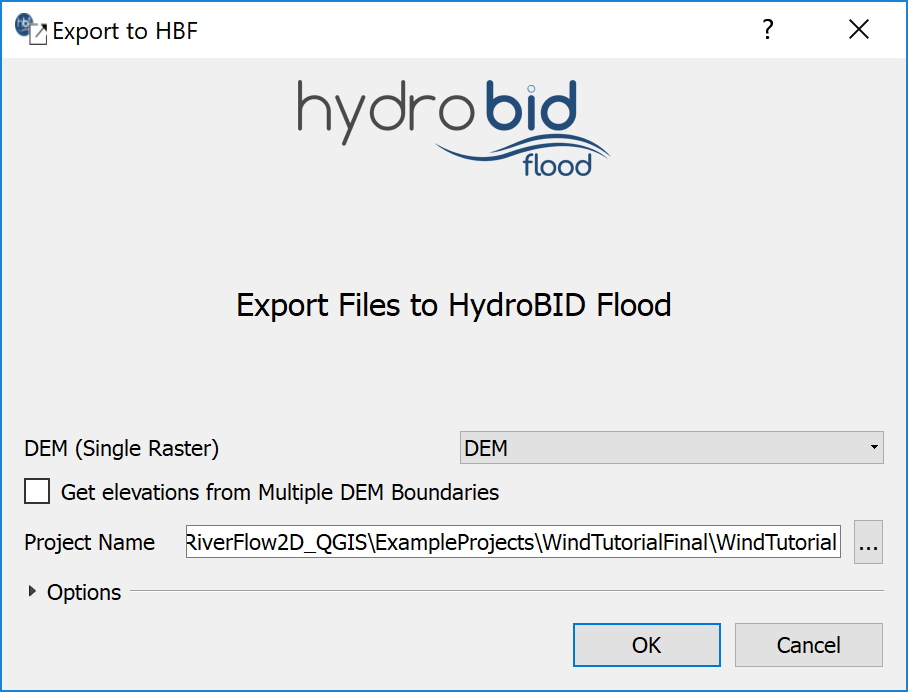{ width=30% }

    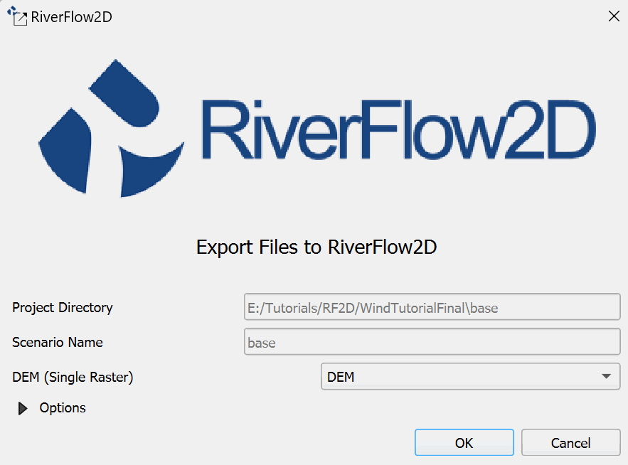{ width=50% }

6.  Click on the OK button.

## Running the model

After exporting the files, Hydronia Data Input Program  is loaded with the project file from the 'WindTutorial.DAT' example and shows the *Control Data* panel.

1.  Enter the information as illustrated in Figure [15.9](#10-7)

    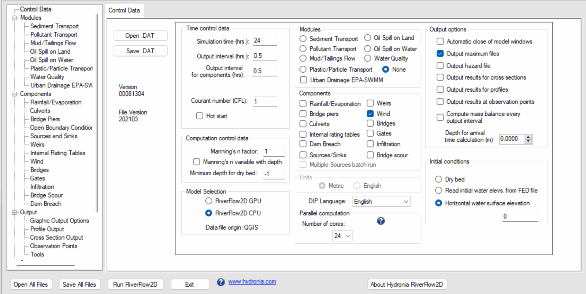{ width=100% }

2.  Verify that the *Wind* component is selected.

3.  Select the *Wind* component from list in the left side of the panel. The window with the information of the wind parameters will appear as can be seen in the figure below:

    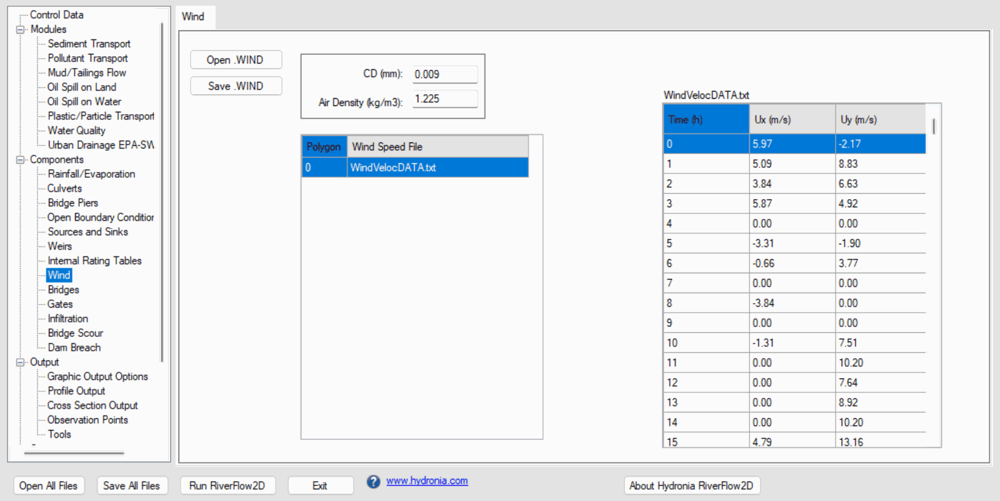{ width=100% }

4.  Verify that the simulation time is set to 24 hours and the output interval is set to 0.5 hours.

5.  Verify that the *Initial conditions* is set to *Horizontal water surface elevation* and 0 on the text box. Leave all other parameters at their default values.

6.  Click on the *Run RiverFlow2D* button in the lower section of Hydronia Data Input Program.

7.  Save the changes with the same name as the 'base.DAT' file, then a window will appear indicating that the model started running.

The model window that appears during the run model shows several runtime parameters.

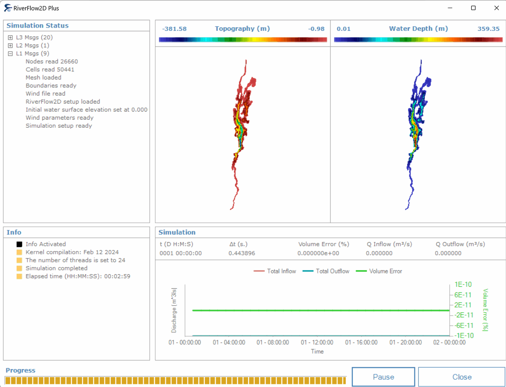{ width=100% }

## Check the wind output files

The model creates the following files for each output time as defined in the Control panel:

'CELL_TIME_METRIC_DDDD_HH_MM_SS.TEXTOUT' (Metric Units) or

'CELL_TIME_ENG_DDDD_HH_MM_SS.TEXTOUT' (English Units)

where DDDD indicates the day, HH, hour, MM minutes and SS seconds.

In these files, columns 1, 2 and 3 report the velocity components in Vx, Vy and the module respectively. We can visualize the water velocity fields generating layers either in raster or vectorial format from the aforementioned files using the *Maps of Results vs Time* tool.

<figure>

</figure>

<figure>

</figure>

The following figure shows the water velocity field map for time `0000:20:00:00`:

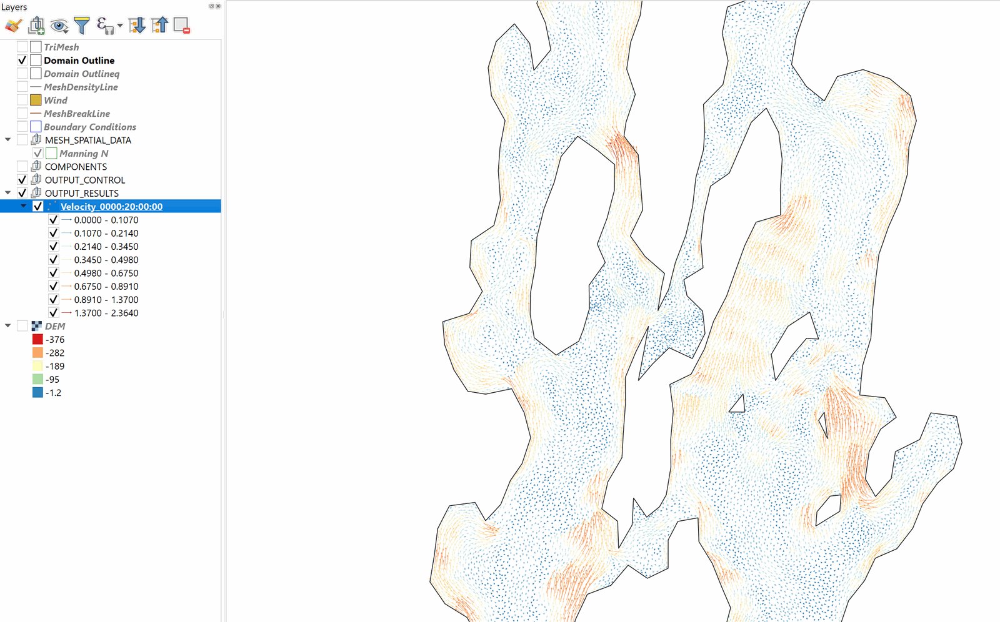{ width=100% }

This concludes the *Wind driven circulation* tutorial.
