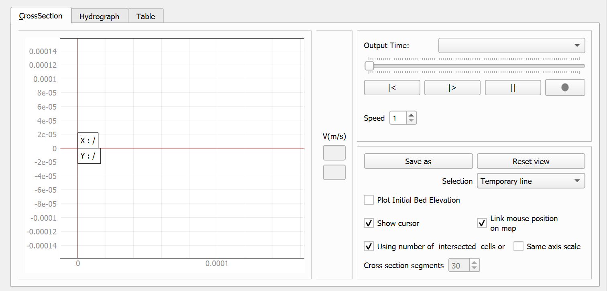
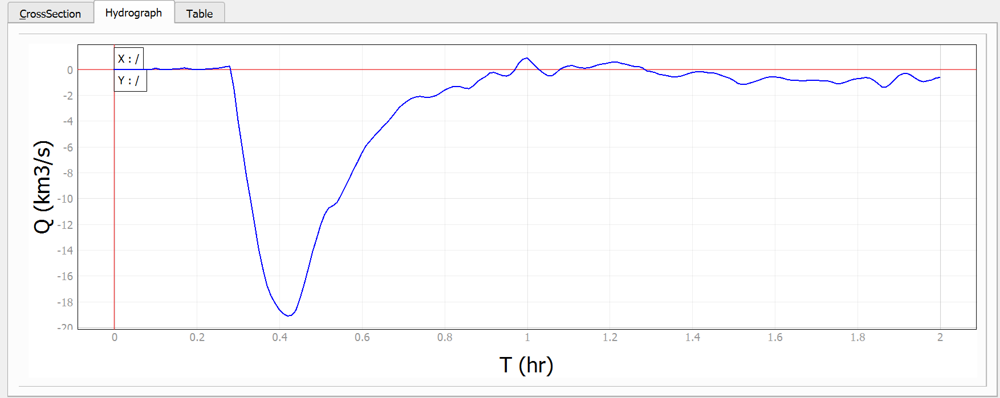
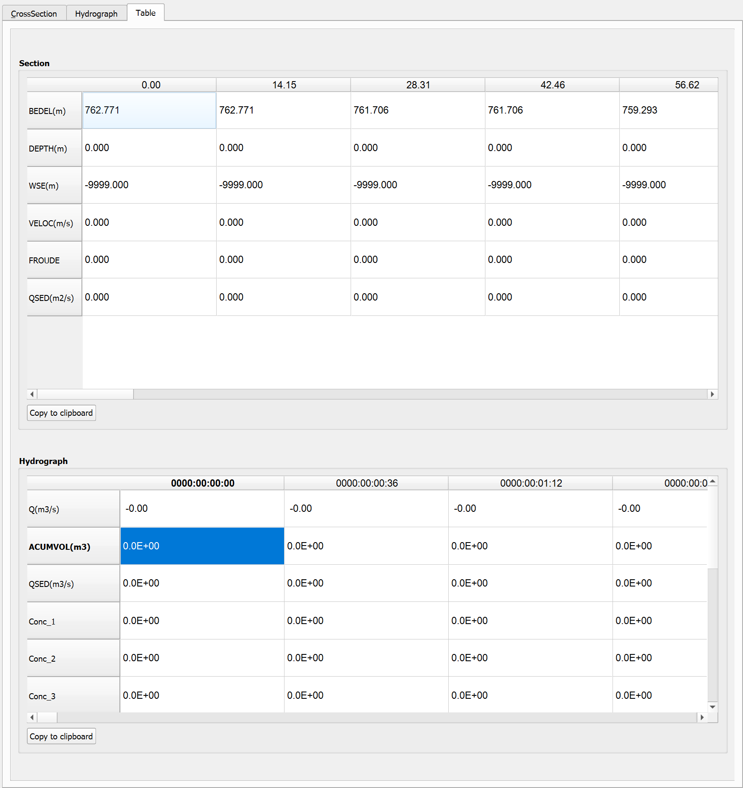

# Cross Sections Tool

The Cross Sections Tool is a specialized QGIS plugin designed to generate, visualize, and analyze cross-sectional profiles of terrain and water surfaces from RiverFlow2D model outputs. This tool allows users to create profiles along user-defined lines, visualize how cross-sections change over time, and export the data for further analysis.

## CrossSection Tab
The CrossSection tab is the primary interface of the Cross Sections Tool for creating and visualizing cross-sectional profiles. It displays a graphical representation of the terrain and water surface profile along a user-defined line, with controls for time navigation, animation, and export.

### Tab Window

### Tab Controls
| **Control** | **Type** | **Description** |
| --- | --- | --- |
| Plot Frame | Frame | Main plotting area where the cross-section profile is displayed. |
| Velocity Legend | Frame with labels | Displays a color scale with min/max velocity values (m/s). |
| Output Time | Combo Box | Selects which time step to display from the simulation results. |
| Time Slider | Horizontal Slider | Allows scrolling through available time steps. |
| Animation Controls | Button Group | Includes Rewind ($|<$), Play ($|>$), and Pause ($||$) buttons for animating through time steps. |
| Video Button | Button | Records the animation as a video file. |
| Animation Speed | Spin Box | Controls the speed of the animation playback. |
| Save As | Button | Exports the current cross-section to .PNG format. |
| Reset View | Button | Resets the view to the default display settings. |
| Selection | Combo Box | Chooses between \"Temporary line\" and \"CrossSection or Profile\" modes. |
| Plot Initial Bed Elevation | Check Box | When checked, displays the initial bed elevation alongside the current profile. |
| Show Cursor | Check Box | Toggles cursor display on the profile graph. |
| Link Mouse Position on Map | Check Box | Synchronizes the cursor position between the profile view and the map. |
| Using number of intersected cells or Cross section segments | Check Box and Spin Box | Controls the sampling density of the cross-section with options for using cell intersections or a fixed number of segments. Uncheck to set number of segments manually. |
| Same Axis Scale | Check Box | Maintains the same scale for both X and Y axes. |

### Workflow
To create and analyze a cross-section profile:

1.  Open the Cross Sections Tool from the plugin toolbar.

2.  Select the profile creation method:

    -   **Temporary line (default):** Single-click to add vertices, double-click to complete the line.

    -   **Existing feature:** Select \"CrossSection or Profile\" from the Selection dropdown and click on a line feature on the map.

3.  Wait for the tool to generate the cross-section profile.

4.  Use the Output Time dropdown or slider to select different time steps.

5.  Use the animation controls (Rewind, Play, Pause) to animate through time steps.

6.  Click the video button to record an animation of the cross-section changing over time.

7.  Use the \"Save As\" button or right-click on the plot and select \"Export\...\" to export the profile.

### Requirements
-   Valid RiverFlow2D project file loaded in QGIS.

-   Model time-series output files (`.OUTFILES` index file).

-   For existing feature method, a CrossSections or Profile layer with valid line features is required.

-   FFmpeg installed for video recording functionality.

### Technical Details
-   The tool uses PyQtGraph for high-performance graph rendering with interactive zoom and pan capabilities.

-   Terrain data sampling is performed using QGIS's raster data provider interface with coordinate transformation between map canvas CRS and layer CRS.

-   Hydraulic data is extracted from model output files by processing triangular mesh cells and identifying which cells contain each point along the cross-section.

-   Velocity magnitude is calculated using the Pythagorean formula: $velocity = \sqrt{u^2 + v^2}$, where u and v are velocity components.

-   Sampling density can be controlled using the cell intersection method (uses natural grid intersections) or fixed segment method (divides into equally spaced segments).

-   Video recordings are created using FFmpeg with customizable frame rate settings.

## Hydrograph Tab
The Hydrograph tab displays time-series data at the selected cross-section location, showing how hydraulic parameters (e.g., water level, discharge) change over time. Available parameters vary based on the model's active module (basic hydraulics, sediment transport, solute transport, mud/tailings flow, or oil spill).

### Tab Window

### Tab Controls
| **Control** | **Type** | **Description** |
| --- | --- | --- |
| Plot Frame | Frame | Displays the time-series hydrograph data for the selected cross-section. |

Available parameters in the hydrograph vary based on the model's active module:

::: tabular
\|p3.5cm\|p11cm\| **Module** & **Available Parameters**

**Basic Hydraulics** &

-   Output Time (timestamp) as column header

-   Output Time (hr) - Cumulative simulation time in hours

-   Discharge (m³/s) or (km³/s) - Flow rate at the cross-section

-   Accumulated Volume (m³) - Total volume of water that has passed through the cross-section

**Sediment Transport** & All Basic Hydraulics parameters, plus:

-   Sediment Discharge (m³/s) or (km³/s) - Rate of sediment transport

-   Volumetric concentration of each sediment fraction (Conc_1, Conc_2, etc.)

**Solute Transport** & All Basic Hydraulics parameters, plus:

-   Concentration for each solute fraction(Conc_1, Conc_2, etc.)

**Mud/Tailings Flow** & All Basic Hydraulics parameters, plus:

-   Concentration for each mud fraction (Conc_1, Conc_2, etc.)

-   Total Concentration (CvTotal) - Sum of all mud fraction concentrations

-   Fluid Density - Density of the mud mixture

-   Fluid Dynamic Viscosity - Viscosity of the mud mixture

-   Yield Stress - Minimum stress required for the mud to flow

**Oil Spill on Land** & All Basic Hydraulics parameters, plus:

-   Oil Concentration - Concentration of oil in the water

-   Oil Volume - Volume of oil at the cross-section

-   Oil Mass - Mass of oil at the cross-section

-   Evaporated Oil - Amount of oil lost to evaporation

-   Infiltrated Oil - Amount of oil that has infiltrated into the soil
:::

### Workflow
To visualize and analyze hydrograph data:

1.  Create a cross-section profile using the CrossSection tab (temporary line or existing feature method).

2.  Switch to the Hydrograph tab.

3.  The hydrograph plot will automatically display time-series data for the selected cross-section.

4.  Parameters displayed depend on the model's active module (see parameter table above).

5.  Use PyQtGraph's zoom and pan capabilities to examine specific time periods.

6.  Right-click on the plot and select \"Export\...\" to export the hydrograph in various formats (PNG, SVG, CSV, etc.).

### Requirements
-   A valid cross-section profile created using the CrossSection tab.

-   Model output files with time-series data for all time steps.

-   Index file `.OUTFILES` specifying all available output time steps.

-   For module-specific parameters, appropriate configuration files (`.seds`, `.solutes`, `.mud`) must be present.

### Technical Details
-   Hydrograph values are calculated by averaging parameters across all cells intersected by the cross-section line.

-   The tool reads time-specific output files: `cell_time_metric_[timestamp].textout` or `cell_time_eng_[timestamp].textout` for basic hydraulics.

-   For sediment transport, `cell_st_[timestamp].textout` files are read.

-   For solute concentrations, `cell_conc_[timestamp].textout` files are read.

-   For mud/tailings flow, `cell_mt_[timestamp].textout` files are read.

-   Volumetric calculations use trapezoidal integration: $Volume_t = Volume_{t-1} + \frac{Q_t + Q_{t-1}}{2} \times \Delta t$.

-   Time interval $\Delta t$ is read from the model's `.dat` configuration file.

## Table Tab
The Table tab presents the cross-section data in tabular format, allowing for more precise examination of values. The table displays hydraulic parameters at each station along the cross-section, including bed elevation, water depth, water surface elevation, velocity, Froude number, and discharge.

### Tab Window

### Tab Controls
| **Control** | **Type** | **Description** |
| --- | --- | --- |
| Scroll Area | Scroll Area | Contains a table view displaying all cross-section data points with their corresponding values. |
| Data Table | Table | Displays hydraulic parameters at each station along the cross-section, including: |
| Copy to clipboard | Button | Allows users to copy the entire table of values to the system clipboard. This enables easy transfer of data to external applications such as spreadsheet software (e.g., Microsoft Excel) or text editors for further analysis or reporting. Simply click the button and then paste the data into the desired application. |
| Navigation Controls | Arrow keys | The keyboard arrow keys (ƒ+', ƒ+\", ƒ+?, ƒ+') can also be used to navigate through the data when there are more values than can be displayed at once. |

### Workflow
To view and export tabular cross-section data:

1.  Create a cross-section profile using the CrossSection tab.

2.  Switch to the Table tab.

3.  The table will automatically display all hydraulic parameters for each station along the cross-section.

4.  Use keyboard arrow keys or the scroll bar to navigate through the data.

5.  Click the \"Copy to clipboard\" button to copy all table values.

6.  Paste the data into external applications like Excel for further analysis.

### Requirements
-   A valid cross-section profile created using the CrossSection tab.

-   Model output files with hydraulic data for the selected time step.

### Technical Details
-   The table displays the following parameters for each station:

    -   Bed elevation (m) - Terrain elevation

    -   Water depth (m) - Water height above bed

    -   Water surface elevation (m) - Bed elevation + depth

    -   Velocity (m/s) - Velocity magnitude calculated as $\sqrt{u^2 + v^2}$

    -   Froude number - Dimensionless number: $Fr = \frac{v}{\sqrt{gd}}$

    -   Discharge (m³/s) - Volumetric discharge

-   Data copied to clipboard is in tab-separated table format, compatible with spreadsheets.

-   The number of rows in the table corresponds to the number of sample points along the cross-section (determined by the selected sampling method).

## Tips and Best Practices
-   **Sampling method**: For most applications, the cell intersection method provides the most accurate representation of the model results. Use the fixed segment method when you need evenly spaced sample points or when comparing multiple profiles.

-   **Cross-section orientation**: For best results, draw cross-sections perpendicular to the flow direction. This provides a clearer representation of the hydraulic profile.

-   **Vertex density**: When creating temporary lines, use enough vertices to capture changes in topography, but avoid too many points that may slow down performance.

-   **Data export**: Use the Table tab and \"Copy to clipboard\" function to export precise numerical data for further analysis in spreadsheets.

-   **Video recording**: Set the appropriate animation speed before recording videos. Slower speeds are better for long simulations, while faster speeds are suitable for brief events.

-   **Cursor linking**: Enable \"Link Mouse Position on Map\" to synchronize cursor position between the profile view and the map, making it easier to identify specific locations.

-   **Axis scaling**: Use \"Same Axis Scale\" when you need to maintain correct geometric proportions in the profile. Disable it to maximize use of the display space.
