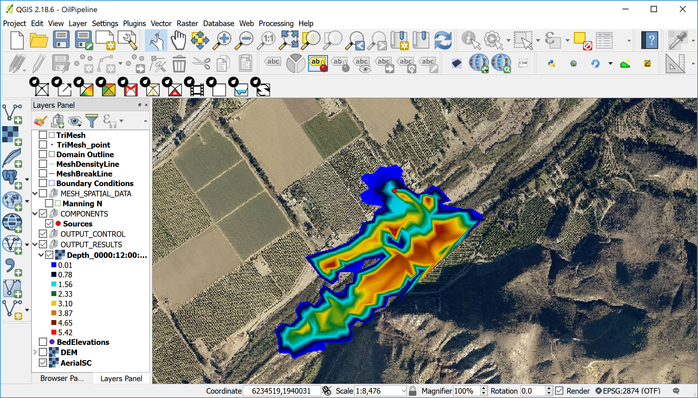

# Introduction

This section presents the system of equations, the formulation of the boundary conditions, and the finite-volume scheme used in OilFlow2D. The information can be expanded in the references.

OilFlow2D is a numerical model that simulates the spreading of oil and viscous fluids on the land surface, and the trajectory and fate of crude oils in water. OilFlow2D is part of the Hydronia suite of models that includes RiverFlow2D, and RiverFlow2D GPU. OilFlow2D overland spill component can simulate fluid depths and velocity over complex terrain at high resolution and with remarkable stability, accuracy and speed, accounting for oil evaporation and infiltration. The use of adaptive triangular-cell meshes enables resolving the flow field around key features in irregular geometry and complex terrain environments.

OilFlow2D oil spill in water component computes oil trajectories in rivers, estuaries and coastal waters, incorporating the effects of oil evaporation, emulsification, dissolution, and interaction of oil with shores.

This version of the OilFlow2D includes an advanced Graphical User Interface based upon a plugin developed by Hydronia for the Open Source Geographical Information System QGIS (www.qgis.org). The integration of the OilFlow2D plugin and the QGIS software system provides interactive functions to generate and refine the flexible mesh used by OilFlow2D, familiar GIS layers and tools to construct a high-level representation of the model, facilitating assigning boundary conditions and Manning's n values, and all the other data layers required by the OilFlow2D components, allowing the user to efficiently manage the entire modeling process. OilFlow2D for QGIS offers a comprehensive set of visualization tools including map rendering, animations, and exporting graphs in shapefile format and Google Earth.

OilFlow2D computation engine uses an accurate, fast, and stable finite-volume solution method that ensures exact mass conservation and stable solutions through dynamic and automatic adjustment of the numerical time step. OilFlow2D can integrate hydraulic structures such as culverts, weirs, bridges, gates, weirs, and integrate the effect of wind on the water surface.

This reference manual provides instructions to install the OilFlow2D for QGIS software and explains the fundamentals of the model and its components, as well as the numerical methods used to solve the governing equations. It also presents a detailed description of the input data files and output files. A separate tutorial document provides detailed guidelines to get started using OilFlow2D capabilities.

{ width=100% }

## Summary of OilFlow2D Features and Capabilities

### Main capability

- Simulation of crude oils and viscous fluids on water and over complex terrain.

### Mesh Generator

- Automatic generation of flexible triangular-cell mesh.
- Mesh refinement along density polylines or inside polygons.
- Use of breaklines to adjust mesh along terrain features.
- Use of multiple Digital Elevation Models in the same mesh according to user selected areas.
- Spatially interpolation of DEM elevations to cells.
- Mesh cell and node numbering optimization.

### Numerical Engine

- Spatial discretization using triangular cells.
- High performance Finite-Volume engine.
- Automatic and dynamic selection of the computational time step.
- Dry cell integration.
- Exact volume conservation.
- Double-precision computations for higher accuracy.
- Fully parallelized with OpenMP for faster execution in Multiple-Core computers.
- GPU version for up to $>$ 700X faster simulations using NVIDIA GPU Graphic Cards.

### Hydraulic Components

- Internal dam and levee breaches.
- Culverts using the US Federal Highway Administration (FHWA) formulation.
- Bridge hydraulics in 2D including pressure flow and overtopping.
- Bridge pier drag forces.
- Weirs with variable crest elevations.
- Gates.
- Dam Breach (prescribed failure, piping and overtopping erosion)
- Internal hydraulic structures.
- Sources and sinks.
- Spatially distributed wind stress.
- Bridge pier and abutment scour.
- Sequential automated batch runs for each input source/spill.

### Input Data Formats

- Metric or English units.
- ASCII X, Y, Z.
- ESRI ASCII grid files.
- USGS DEM.
- ESRI shapefiles.
- Autodesk DXF.
- TIFF, GIF, JPG, etc. raster's.
- Any raster or vector data format accepted by QGIS.

### Initial Conditions

- Dry-bed.
- User-defined constant water elevations over polygons.
- User-defined variable water elevations given by raster data.

### Boundary Conditions

- Water discharge hydrograph.
- Water discharge and water elevation vs time.
- Water elevation vs time.
- Uniform flow.
- Rating tables.
- Free outflow.
- Inflow pollutant concentrations (PL Module).

### Output Options

- Results at cross sections and profiles.
- Observation points: time series at user selected locations.
- Dynamic plots while the model runs.
- Velocity field, depth and water surface elevations.
- Bed shear stress.
- Froude Number.
- Time to 0.3 m (1 ft), time to 0.5 m (2 ft) , time to 1 m (3 ft), time to peak depth, and frontal wave arrival time.
- Inundation time during which depth is greater than 0.1 m or 4 in.
- Frontal wave arrival time.
- ESRI shapefiles.
- GIS post processing plots including shapefiles and raster images.
- Paraview VTK.

### Output of Results for Maximum Values

- Maximum velocity magnitude.
- Maximum depths.
- Maximum water surface elevations.
- Maximum depth times velocity.
- Maximum Shear Stress.
- Maximum Impact force per unit width.

### Pollutant Transport Module PL

- Advection-Dispersion-Reaction.
- Reaction rates between pollutants/solutes.
- Simultaneous computation of multiple solutes.

{ width=100% }
