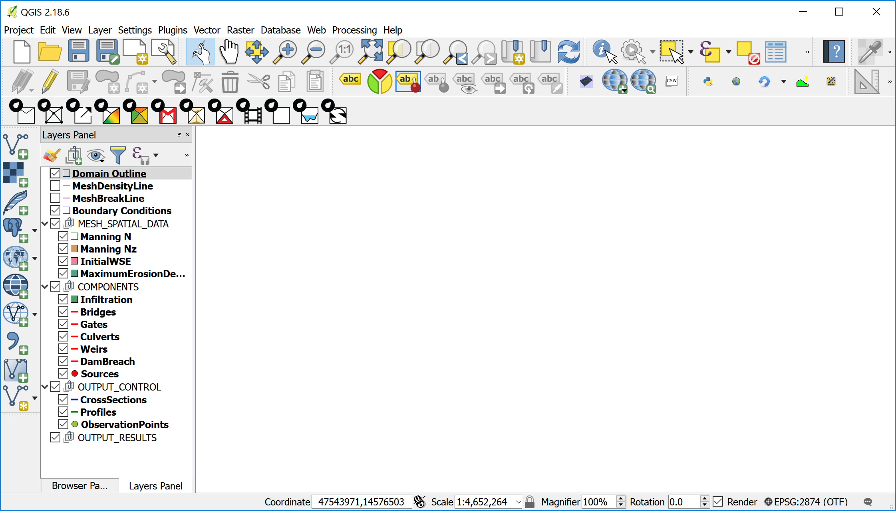

# Overview of RiverFlow2D

When you create a new RiverFlow2D project in QGIS, the plug-in creates a number of empty layers, each one with an specific purpose, and associated with particular components or modules. The standard set includes the layers depicted in Figure. Description of each layer is included in Table.

                                      **Content**
  ------------------------- --------- ----------------------------------------------------------------------------------------------------------------------------------------------------------------------------------------------------------------------------------------------------------------------------------------------------------------------------------------
                                      **Content**
  TriMesh                   Polygon   Contains the mesh triangular cells. It is automatically created by the mesh generation program.
  Domain Outline            Polygon   Container for the required external polygon that defines the extent of the modeling area. It can also include internal polygons that represent impermeable islands or other obstacles that will not contain cells. Each polygon has a *CellSize* attribute that controls the approximate triangle size desired for the generated mesh.
  MultipleDemBoundaries     Polygon   It is used to enter polygons that define areas with different terrain elevation data sets. You can associate each polygon to a different raster layer containing a terrain elevation model.
  MeshDensityLine           Line      It is used to enter polylines along which the mesh generation program will refine the mesh according to each polyline *CellSize* attribute. The lines do not force the mesh generator to create nodes along the lines. In this sense, they act as soft breaklines.
  MeshBreakLine             Line      It is used to enter polylines along which the mesh generation program will refine the mesh according to each polyline *CellSize* attribute. The lines do force the mesh generator to create nodes along the lines. Therefore, they act as hard breaklines.
  Boundary Conditions       Polygon   Container for polygons that define the model open boundaries, either inflow or outflow. All the boundary cells laying inside these polygons will be open boundary cells.
  MESH_SPATIAL_DATA 
  Multiple DEM Boundaries   Polygon   Container for polygons over which different elevation rasters (e.g. DEMs) will be used to interpolate elevations to the cells.
  Manning N                 Polygon   Defines areas of different Manning's n.
  Manning Nz                Polygon   Accepts polygons associated to files that contain tables of Manning's n as a function of depth.
  InitialWSE                Polygon   Container for areas of initial Water Surface Elevations (WSE).
  MaximumErosionDepth       Polygon   Container for polygons with Maximum Erosion Depth (MED) attribute. When using the Sediment Transport ST module, the model will not allow erosion to reduce the bed elevation below the initial bed elevation minus MED.
  COMPONENTS 
  Infiltration              Polygon   Defines areas of different Infiltration parameters.
  RainEvap                  Polygon   Container for areas associated with a rainfall intensity and evaporation.
  Wind                      Polygon   Defines areas associated with a wind velocity time series that will be used in the model to calculate the wind stress on the water surface.
  Bridges                   Line      Includes polylines defining bridges. Each entity will have specific data that characterize the bridge cross section. Also the lines will act as hard breaklines.
  Gates                     Line      Includes polylines defining gates. Each entity will have specific data that characterizes the gate including gate aperture table. Also each line will act as a hard breakline.
  Culverts                  Line      Contains lines that connect two points in the modeling area with culverts. The model will calculate the culvert discharge depending on the given data, and transfers discharge from culvert the inlet cell to the culvert outlet cell.
  Weirs                     Line      Container for polylines defining weirs. Each entity will have specific data that characterizes the weir. The line will act as a hard breakline.
  DamBreach                 Line      Contains polylines that represent dam or levees in plan. They allow the model to calculate the discharge through levee or dam breaches.
  Sources                   Point     Container for point sources or sinks. Source data includes a time series of discharge vs. time. When using the Pollutant Transport PL Module, the data must include concentrations for each pollutant in addition to the discharge. Sinks are defined by negative discharges.
  OilSpills                 Point     Container for spill locations within the mesh. Each spill point needs data to define the spill volume, and other parameters required to simulate the oil trajectory and behavior based on existing results from a hydrodynamic run.
  Piers                     Point     Container for bridge pier locations. Piers are used to enter data that will allow the model to compute scour around bridge piers.
  Abutments                 Line      Container for bridge abutment locations. Abutments are used to enter data that will allow the model to compute scour around bridge abutments.
  StormDrain                Point     Container to indicate flow exchange points between the surface water with the storm drain network of a EPA-SWMM model.
  OUTPUT_CONTROL 
  CrossSections             Line      Container for lines that define cross sections where the model will write results including discharge for each report interval.
  Profiles                  Line      Defines profiles where the model will write in text files results for each report interval.
  Observation Points        Point     Container for locations where the model will write results each report interval.
  OUTPUT_RESULTS Group that include layers with model results that will be incorporated by the program when creating specific graphics with model results.
  : RiverFlow2D layers.
