# Oil Spill on Land Model

One-dimensional hydraulic models are not adequate to simulate flooding when flows are unconfined or velocities change direction during the course of the hydrograph. The cost of non-simplified three-dimensional numerical models can be avoided using depth averaged two-dimensional (2D) shallow water equations.

When dealing with the shallow water equations, realistic applications always include source terms describing bed level variation and bed friction that, if not properly discretized, can lead to numerical instabilities. In the last decade, the main effort has been put on keeping a discrete balance between flux and source terms in cases of quiescent water, leading to the notion of well-balanced schemes or C property \[, , , \]. Recently, in order to include properly the effect of source terms in the weak solution, augmented approximate Riemann solvers have been presented \[Rosatti et al. (2003), \]. In this way, accurate solutions can be computed avoiding the need of imposing case dependent tuning parameters which are used frequently to avoid negative values of water depth and other numerical instabilities that appear when including source terms.

This section presents the system of equations, the formulation of the boundary conditions, and the finite-volume scheme used in OilFlow2D and the information can be expanded in the references.

## Assumptions of the Viscous Flow Model

1. OilFlow2D uses the Shallow Water Equations resulting from the vertical integration of the Navier-Stokes equation. Therefore, the model does not calculate vertical accelerations, vertical velocities and consequently cannot resolve secondary flows.
2. The bed shear stress is assumed to follow the depth-average velocity directions.
3. The model does not include dispersion nor turbulence terms. Turbulence dissipation and energy loses are accounted for only through the Manning's n term in the momentum equations.
4. The model can consider heat transfer to calculate the oil temperature as it flows overland, and considers the density, viscosity and yield stress variation in time and space.

## Flow equations considering prescribed temperature variations

Shallow water flows can be described mathematically by depth averaged mass and momentum conservation equations with all the associated assumptions. That system of partial differential equations will be formulated here in a conservative form as follows:

$$\frac{\partial \mathbf{U}}{\partial t}+\frac{\partial \mathbf{F(U)}}{\partial x}+\frac{\partial \mathbf{G(U)}}{\partial y}=\mathbf{S}(\mathbf{U},x,y)$$

where $\mathbf{U}=\left( h , \;   q_x , \;  q_y  \right)^{T}$ is the vector of conserved variables with $h$ representing the water depth, $q_x=uh$ and $q_y=vh$ the unit discharges, with $(u,v)$ the depth averaged components of the velocity vector $\mathbf{u}$ along the $(x,y)$ coordinates respectively. The flux vectors are given by:

$$\mathbf{F}=\left(  q_x, \;  \frac {q_y^2}{h} + \frac {1}{2} g h^2 , \;   \frac {q_x q_y}{h}  \right)^{T}, \qquad    
    \mathbf{G}=\left(  q_y, \;     \frac{q_x q_y}{h}, \;     \frac {q_y^2}{h} + \frac {1}{2} g h^2 \right)^{T}$$

where $g$ is the acceleration of the gravity. The terms $\frac{1}{2}gh^2$ in the fluxes have been obtained after assuming a hydrostatic pressure distribution in every water column, as usually accepted in shallow water models. The source term vector incorporates the effect of pressure force over the bed and the tangential forces generated by the bed stress

$$\mathbf{S}=\left(  0 , \;  g h (S_{0x}-S_{fx}) , \;    g h (S_{0y}-S_{fy}) \right)^{T}$$

where the bed slopes of the bottom level $z_b$ are

$$S_{0x} = - \frac{\partial z_b}{\partial x} ,  \qquad  S_{0y} = - \frac{\partial z_b}{\partial y}$$

and the bed stress contribution is modeled using the Manning friction law so that:

$$S_{fx}= \frac{n^2u \sqrt{u^2+v^2}}{h^{4/3}}, \qquad S_{fy}= \frac{n^2v\sqrt{u^2+v^2}}{h^{4/3}}$$

with $n$ the roughness coefficient.

Using this option, the model can consider the variation of temperature and its effect on density and viscosity, but the oil temperature is assumed to be prescribed by the user and it does not depend on environmental chances during the simulation.

## Equations considering heat transfer

This section presents the equations that OilFlow2D solves to consider the heat transfer from the oil to the atmosphere and soil as it flows overland. The model also determines how the oil density, viscosity and yield stress change as a function of the temperature during the simulation.

The continuity equation for the oil mass is written as

$$\frac{\partial (\rho h)}{\partial t} + \frac{\partial}{\partial x} (\rho hu) + \frac{\partial}{\partial y} (\rho hv) = 0$$

and the conservation laws of the bulk linear momentum along the $x-$ and $y-$ axes are be expressed as

$$\begin{aligned}
            & \frac{\partial (\rho hu)}{\partial t} + \frac{\partial}{\partial x} (\rho hu^2 + \frac{1}{2} g_n \rho h^2 ) + \frac{\partial}{\partial y} (\rho huv) = -g_n \rho h \frac{\partial z_b}{\partial x} - \tau_{bx} \\
            & \frac{\partial (\rho hv)}{\partial t} + \frac{\partial}{\partial x} (\rho huv) + \frac{\partial}{\partial y} (\rho hv^2 + \frac{1}{2} g_n \rho h^2) = -g_n \rho h \frac{\partial z_b}{\partial x} - \tau_{by}
        \end{aligned}$$

where $\rho$ ois the depth-integrated bulk density \[kg/m$^3$ or lb/ft$^3$\], $h$ the vertical flow depth \[m or ft\] and ($u,\,v$) the components of the depth-integrated flow velocity vector $\mathbf{u}$ \[m/s or ft/s\], $z_b$ the bed elevation \[m or ft\], ($\tau_{bx},\,\tau_{by}$) the components of the depth-integrated basal resistance vector ${\tau_b}$.\
The energy equation for temperature is written non conservative form as follows:

$$\frac{\partial T}{\partial t} + u\frac{\partial}{\partial x} T + v\frac{\partial}{\partial y} T = \mathbf{S}_{T}$$

where $\mathbf{S}_{T}$ source term considers the heat transfer of the oil with the environment, as a function of the oil depth, $h$ and other factors.\
To close the model, the following equation is used to determine the fluid density $\rho$ \[kg/m$^3$ or lb/ft$^3$\]

$$\rho = \rho_0 + \Lambda (T-T_0)$$

where $\rho_0$ \[kg/m$^3$ or lb/ft$^3$\] is the oil reference density at temperature $T_0$ \[$^{\circ}$K\] and $\Lambda$ is an experimental parameter.\

### Fluid properties and friction laws

Besides the density, the flow temperature also affects the viscosity and yield stress, generating changes in friction stresses between the flow and terrain.\
The yield stress \[Pa or lb/in$^2$\] dependence on temperature can be entered as a table of experimental stress for each temperature or using regression formulas as the following one

$$Ys = 10^{(Ays T^2+ Bys T - Cys)},$$

where $Ays$, $Bys$ and $Cys$ are flow parameters coming from oil characterization.\
The oil viscosity, $\mu$ \[Pa$\cdot$s or lb$\cdot$s/in$^2$\], is governed by Andrade formulation

$$\mu = Av \ e^{\left( {Bv}/{T}\right)}$$

where $Av$ and $Bv$ are flow parameters coming from oil characterization and $T$ is in $^\circ$K.\
The model provides also the option to enter tables that represent the variation of viscosity, yield stress and density as a function of temperature.

### Temperature Source Term and Heat Transfer Mechanisms

The temperature source term is computed as

$$\mathbf{S}_{T} = \dfrac{Q}{\rho C_p h}$$

where $C_p$ is specific heat \[J/kg$^{\circ}$C or BTU/lb$^{\circ}$F\], and $Q$ total heat flux \[W/m$^2$ or BTU/ft$^2$\] that quantifies the heat exchange between the oil and the environment.

OilFlow2D considers the following formulation to represent the heat transfer between the oil and the environment.

- Ambient radiation (oil$\rightarrow$environment):
- Received solar thermal radiation (sun$\rightarrow$oil): calculated as a function of: extra planetary radiation (R0), which is attenuated by atmospheric transmission (at), cloudiness (ac), shading (cs) and reflection (cr).
- Convection transfer between oil and ground
- Convection transfer between oil and air

The heat transfer model considers air convection, incident radiation and emitted radiation. The heat transfer mechanisms are acting as parallel heat exchanges between the fluid surface and the environment that can be expressed as

$$\mathcal{S_T}=\dfrac{\dot{Q}}{\rho h C_p} = \dfrac{\dot{Q}_{rad}+\dot{Q}_{conv}+\dot{Q}_{em}}{\rho h C_p}$$

The radiation heat transfer between the oil and air is computed by following the Stefan-Boltzmann equation

$$\dot{Q}_{em}=\varepsilon\sigma\left(T^4-T_{air}^4\right)$$

where $\varepsilon$ is the oil surface emissivity (assumed as 0.55), $\sigma = 5.67 \times 10^{-8}$ W/(m$^2$K$^{-4}$) is the Stefan-Boltzmann constant and $T_{air}$ is the air temperature.\
The air convection is computed as a function of the difference between the fluid and the air temperatures, $T$ and $T_{air}$ \[K\], and a convection coefficient, $h_c$,

$$\dot{Q}_{conv}=h_c\left(T-T_{air}\right)$$

in terms of the convective heat transfer coefficient $h_c$ \[Wm$^{-2}$K\] that introduces the effect of air movement. It can be related to the Nusselt number, in order to establish how relevant is the convection heat transfer compared to the heat conduction:

$$Nu=\frac{h_c L}{k}\left(T-T_{air}\right)$$

where $L$ \[m\] is a characteristic length and $k$ \[W m/K\] the thermal conductivity.

In the model $h_c$ is calculated as function of the wind velocity 

$$h_c = 8.55 + 2.56 \cdot U_w$$

Finally, incident radiation, $\dot{Q}_{rad}$, can be obtained from measured data and is required in the model as an input parameter.

## Oil Retention

Oil retention is a phenomenon in which the velocity of the oil phase is significantly reduced due to its interaction with the soil or vegetation. This retention occurs through a combination of adsorption, capillary trapping in pore spaces, and increased viscous resistance, leading to reduced oil mobility and extended residence time within the subsurface. In this context, the focus is on the viscous resistance between the oil flow and the soil. To model this process, the Simple Shear Infinite Landslide approach is used ,. In this model, the shear stress is balanced by the gravitational force component in the horizontal flow direction (see Figure ). This shear stress reduces the momentum in the oil flow direction. However, this shear stress only affects the thin layer closest to the bottom. Therefore, an oil depth, $h_{\text{retention}}$, must be defined as the thickness of this layer. Therefore, the shear stress caused by this phenomenon, $\tau_{\text{retention}}$, at the soil-oil interface can be expressed as:

$$\tau_{\text{retention}} = \rho g h_{\text{retention}} sin (\theta)$$

where $\mu$ is the oil viscosity, $\rho$ is the oil density, $g$ is gravitational acceleration, $\theta$ is the bottom slope angle (see Figure ). Using this expression, the following cases may occur:

- **Case with slope ($S_0 = tg(\theta)$)**: In this case, the shear stress is defined by the expression , and the velocity is considered zero when the oil depth is $h\leq h_{\text{retention}}$.
- **Case without slope ($S_0=0, \; \theta=0$)**: In this case, using the expression , $\tau_{\text{retention}}=0$. Therefore, oil retention is caused by imposing a oil flow velocity of zero when $h \leq h_{\text{retention}}$.

It is important to note that the oil retention depth, $h_{\text{retention}}$, represents the minimal depth for oil flow. Consequently, the velocity of cells with an oil depth smaller than $h_{\text{retention}}$ will be zero. For this reason, the values for $h_{\text{retention}}$ should be on the order of millimeters.

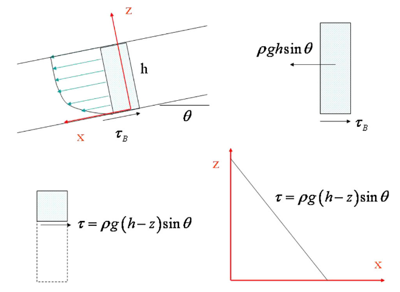{ width=65% }

## Pipeline Break Spill Hydrograph Equations

The OilFlow2D QGIS Oil Pipeline Break Model prepares a multiple-sources file and one discharge hydrograph for each generated pipeline break point. The calculation is performed before the OilFlow2D simulation; the resulting hydrograph files are then read by the model as source time series for the overland oil spill simulation. The following equations summarize the calculation used by the pipeline module.

For a pipe diameter $D_p$ and leak diameter $D_l$, the pipe and leak areas are

$$A_p = {\pi D_p^2 \over 4}$$

$$A_l = {\pi D_l^2 \over 4}$$

The gravitational acceleration is $g = 9.80665$ m/s$^2$ when the project is in metric units, or $g = 32.174$ ft/s$^2$ when the project is in English units. The leak loss coefficient associated with the user-entered discharge coefficient $C_d$ is

$$K_l = {1 \over C_d^2} - 1$$

### Initial Steady Pipeline Head

The module first computes a steady energy head along the pipeline from the initial flow rate $Q_0$ and the initial pressure head entered at the pipe end. If $z_n$ is the elevation at the downstream pipe end and $H_{end}$ is the entered pressure head at that end, the downstream energy head is

$$h_n = z_n + H_{end}$$

Moving upstream by segment, the energy head is updated as

$$h_i = h_{i+1} + {f_i \Delta x_i \over 2 g D_i A_i^2} Q_0^2$$

where $h_i$ is the energy head at node $i$, $\Delta x_i$ is the segment length, $D_i$ is the pipe diameter, $A_i$ is the pipe area, and $f_i$ is the Darcy-Weisbach friction factor. The Reynolds number used for each segment is

$$Re_i = {|Q_0| D_i \over A_i \nu}$$

where $\nu$ is the kinematic viscosity. For laminar flow the friction factor is

$$f_i = {64 \over Re_i}$$

For turbulent flow, the module solves the Colebrook relation by Newton-Raphson iteration:

$$ {1 \over \sqrt{f_i}} =
-0.86 \ln \left({e_i \over 3.71 D_i} + {2.51 \over Re_i \sqrt{f_i}}\right) $$

where $e_i$ is the pipe roughness. If the dialog option to calculate the friction coefficient from rugosity is enabled, this friction calculation is also used by the spill-drainage equations. Otherwise, the user-entered friction coefficient is used for the spill-drainage step.

### Upstream Leak Flow

For each break, the pressure head used at the break is

$$h_p = h_b - z_b$$

where $h_b$ is the computed energy head at the break and $z_b$ is the break elevation. The upstream leak discharge at each time step is calculated with the orifice equation

$$Q_l = C_d A_l \sqrt{2 g h_p}$$

The calculation interval is $\Delta t$. The inflow from the pipeline upstream of the break is initially $Q_0$. If $t_s$ is the valve-closing start time and $t_c$ is the valve-closing duration, the module uses

$$Q_{in}(t) =
\begin{cases}
Q_0, & t \leq t_s \\
Q_0 \left(1 - {t - t_s \over t_c}\right), & t_s < t \leq t_s + t_c \\
0, & t > t_s + t_c
\end{cases}$$

At each time step the leaked volume, incoming volume, and net outgoing volume are

$$V_l = Q_l \Delta t$$

$$V_{in} = Q_{in} \Delta t$$

$$V_{net} = V_l - V_{in}$$

The available upstream pipe volume $V_a$ is reduced by the net outgoing volume. While available volume remains, the pressure head is reduced in proportion to the remaining volume:

$$V_a^{new} = V_a - V_{net}$$

$$h_p^{new} = h_p {V_a^{new} \over V_a}$$

When the available volume is depleted, the upstream pressure head is set to zero and the upstream contribution ends.

### Downstream Gravity Drainage

The downstream portion of the pipe is assumed to drain by gravity from the pipe volume downstream of the break. For the contributing downstream length $L_a$, the available volume is

$$V_a = L_a A_p$$

The local pipe slope used to lower the oil surface during drainage is

$$m = {|z_s - z_b| \over L_a}$$

where $z_s$ is the elevation at the end of the contributing segment. At each time step the module solves the quadratic form

$$A Q_l^2 + B Q_l + C = 0$$

with

$$A = {8 \over g \pi^2} \left({1 + K_l \over D_l^4} - {1 \over D_p^4}\right)$$

$$B = f L_a$$

$$C = {P_l - P_s \over \rho g} + z_b - z_s$$

where $\rho$ is oil density, $P_l$ is the pressure at the leak, and $P_s$ is the pressure at the upstream end of the contributing segment. For downstream gravity drainage the module uses zero gauge pressure, so the pressure term is normally zero. The positive-root discharge is

$$Q_l = {-B + \sqrt{B^2 - 4 A C} \over 2 A}$$

The source discharge written to the spill hydrograph is $Q_l$. For the internal downstream pipe-volume update, the module also computes a downstream flow term $Q_o$ when an active downstream boundary or valve contribution is present; otherwise $Q_o = 0$. The net volume removed from the downstream contributing pipe volume is

$$V_{net} = (Q_l - Q_o) \Delta t$$

and the remaining downstream volume and contributing length are updated as

$$V_a^{new} = V_a - V_{net}$$

$$L_a^{new} = {V_a^{new} \over A_p}$$

The oil surface elevation used by the next time step is lowered by

$$z_s^{new} = z_s - m {V_{net} \over A_p}$$

The downstream hydrograph ends when the remaining pipe volume no longer changes by more than the module tolerance.

### Combined Source Hydrograph

For each break point, the upstream and downstream hydrographs are combined by time step:

$$Q_{source}(t) = Q_{upstream}(t) + Q_{downstream}(t)$$

The combined hydrograph is written as the source time series referenced by the multiple-sources file. Each source is then applied by OilFlow2D as a point inflow at the generated break coordinates.

## Finite-Volume Numerical Solution

To introduce the finite-volume scheme, is integrated in a volume or grid cell $\Omega$ using Gauss theorem:

$$\frac {\partial} {\partial t} \int_{\Omega} \mathbf{U}d\Omega + \oint_{ \partial \Omega } \mathbf{E}  \mathbf{n} dl  = \int_{\Omega} \mathbf{S}d \Omega$$

where $\mathbf{E}=(\mathbf{F},\mathbf{G})$ and $\mathbf{n}=(n_x,n_y)$ is the outward unit normal vector to the volume $\Omega$. In order to obtain a numerical solution of system the domain is divided into computational cells, $\Omega_i$, using a fixed mesh. Assuming a piecewise representation of the conserved variables (Figure ) and an upwind and unified formulation of fluxes and source terms

$$\frac {\partial} {\partial t} \int_{\Omega_i} \mathbf{U}d\Omega  + \sum_{k=1} ^{NE} (\mathbf{En}- \mathbf{\bar {S }})_{ k}    l_k = 0$$

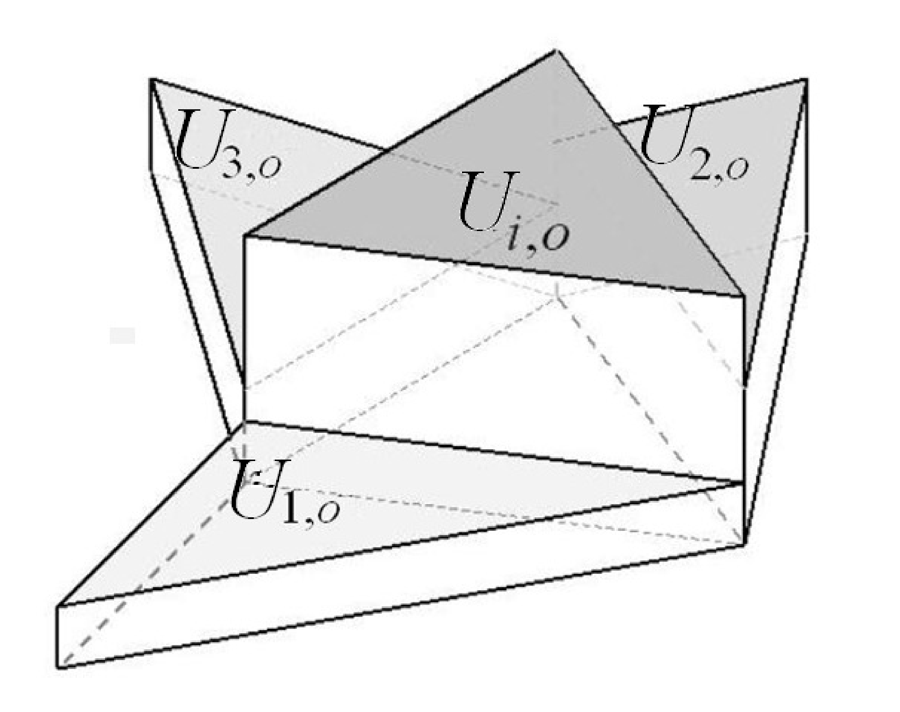

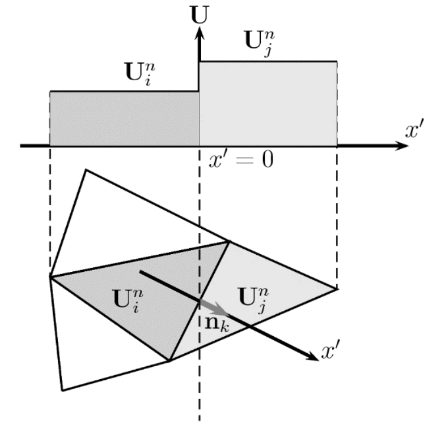

The approximate solution can be defined using an approximate Jacobian matrix $\widetilde{\mathbf{J}}_{\mathbf{n},k}$ of the non-linear normal flux $\mathbf{E_n}$ and two approximate matrices $\widetilde{\mathbf{P}} = (\mathbf{\widetilde{e}}^1,  \mathbf{\widetilde{e}}^2,  \mathbf{\widetilde{e}}^3 )$, and $\widetilde{\mathbf{P}}^{-1}$, built using the eigenvectors of the Jacobian, that make $\widetilde{\mathbf{J}}_{\mathbf{n},k}$ diagonal

$$\widetilde{\mathbf{P}}_{k}^{-1} \widetilde{\mathbf{J}}_{\mathbf{n},k}  \widetilde{\mathbf{P}}_{k}    =\widetilde{\boldsymbol{\Lambda}}_{k}$$

with $\widetilde{\boldsymbol{\Lambda}}_{k}$ is a diagonal matrix with eigenvalues $\widetilde{\lambda}^{m}_{k}$ in the main diagonal

- **$$\widetilde{\boldsymbol{\Lambda}}_{k} =  \left( \begin{array}{ccccc}  \widetilde{\lambda}^{ 1}:** 0; 0  \\ 0; \widetilde{\lambda}^{ 2}; 0   \\ 0; 0; \widetilde{\lambda}^{3}   \\  \end{array}\right)_{k}$$
Both the difference in vector $\mathbf{U}$ across the grid edge and the the source term are projected onto the matrix eigenvectors basis
$$\delta \mathbf{U}_{k}= \widetilde{\mathbf{P}}_{k} \mathbf{A}_{k} \quad (\mathbf{\bar {S }})_{k}= \widetilde{\mathbf{ P}}_{k} \mathbf{B}$$

where $\mathbf{A}_{k} =  (  \alpha ^1, \alpha ^2, \alpha ^3  )^{T}_{k}$ contains the set of wave strengths and $\mathbf{B} =  (    \beta^1  , \beta^2  , \beta^3        )^{T}_{k}$ contains the source strengths. Details are given in. The complete linearization of all terms in combination with the upwind technique allows to define the numerical flux function $(\mathbf{En}- \mathbf{\bar {S }})_{ k}$ as

$$(\mathbf{En}- \mathbf{\bar {S }})_{ k} =  \mathbf{E}_i \mathbf{n}_k+  \sum^{3 }_{m=1} \left( \widetilde{\lambda}^-\; \theta \alpha \widetilde{\mathbf{ e}} \right)^{m}_{ k}$$

with $\widetilde{ {\lambda}}^{-} = \frac {1} {2}( \widetilde{ {\lambda}} -\vert \widetilde{ {\lambda}}  \vert  )$ and $\theta^{m}_{k} = \left(1-  \frac {\beta}{\widetilde{\lambda}\alpha} \right)^{m}_{k}$ that when inserted in  gives an explicit first order Godunov method

$$\mathbf{U}^{n+1}_{ i}  =  \mathbf{U}^{n}_{ i} -     \sum_{k=1} ^{NE} \left[ \mathbf{E}_i \mathbf{n}_k+  \sum^{3 }_{m=1} \left( \widetilde{\lambda}^-\; \theta \alpha \widetilde{\mathbf{ e}} \right)^{m}_{ k}  \right]    \frac { l_k } {A_i}   \Delta t$$

As the quantity $\mathbf{E}_i$ is uniform per cell $i$ and the following geometrical property is given at any cell

$$\sum_{k=1}^{NE} \mathbf{n}_k l_k = 0$$

 can be rewritten as

$$\mathbf{U}^{n+1}_{ i}  =  \mathbf{U}^{n}_{ i} -     \sum_{k=1} ^{NE} \left[    \sum^{3 }_{m=1} \left( \widetilde{\lambda}^-\; \theta \alpha \widetilde{\mathbf{ e}} \right)^{m}_{ k}  \right]    \frac { l_k \Delta t } {A_i}$$

The finite-volume method can be written using a compact wave splitting formulation as follows:

$$\mathbf{U}^{n+1}_{ i}  =  \mathbf{U}^{n}_{ i} -     \sum_{k=1} ^{NE}  \left(  \delta\mathbf{M}_{i,k}^{-}  \right)^n   \frac { l_k } {A_i}   \Delta t$$

with

$$\delta\mathbf{M}_{i,k}^{-} = \sum^{3 }_{m=1} \left( \widetilde{\lambda}^-\; \theta \alpha \widetilde{\mathbf{ e}} \right)^{m}_{ k}$$

The use of is efficient when dealing with boundary conditions. At the same time it ensures conservation. In it was demonstrated how for a numerical scheme written in splitting form, the total amount of contributions computed inside the domain at each cell edge, is equal to the balance of fluxes that cross the boundary of the domain, proving exact conservation.

### Numerical Optimizations

Once wave propagations in $\delta\mathbf{M}_{i}^-$ in are computed, the first order method can be applied averaging the contributions of the local Riemann Problems (RPs) shaping the contour cell.

The approximate solution is always constructed as a sum of jumps or shocks, even in cases involving rarefactions. One widely reported problem of linearized solvers is the entropy violation in sonic rarefactions , that produces negative values of depth in the shallow water equations, even in absence of source term. The solution is restored by means of a suitable redefinition of the approximate solution by means of entropy fixes.

The time and space linearization of the source terms in can also have negative consequences, as numerical instabilities may arise when approximating their value. Their influence over the approximate RP solutions is the key to construct appropriate fixes that avoid unphysical results. In it was shown how errors in the integral approaches done over the source terms can be avoided if imposing physically based restrictions over the approximate solution. By simply modifying the source strength coefficients $\beta$ correct solutions are restored when necessary.

### Stability Region

Once numerical fixes are applied the stability region for the homogeneous case can be used to compute the size of the time step. In the 2D framework, considering unstructured meshes, the relevant distance, that will be referred to as $\chi_i$ in each cell $i$ must consider the volume of the cell and the length of the shared $k$ edges.

$$\chi_i = \frac {A_i}{\max_{k=1,NE} l_k}$$

Considering that each $k$ RP is used to deliver information to a pair of neighboring cells of different size, the distance $\min(A_i,A_j)/l_k$ is relevant. The time step is limited by

$$\Delta t \leq  CFL \; \Delta t^{\widetilde{\lambda}} \qquad \Delta t^{\widetilde{\lambda}}=  \frac { \min (\chi_i,\chi_j) }{ \max    |\widetilde{\lambda}^{m} |  }$$

with $CFL$=1/2, as the construction of finite-volume schemes from direct application of one-dimensional fluxes leads to reduced stability ranges.

OilFlow2D solution method uses variable time steps. The maximum allowed time-step is controlled by the user-set Courant-Friederich-Lewy (CFL) number that is proportional to the local cell size, but also inversely proportional to velocity and depth. Smaller cells lead to smaller time-steps. The maximum theoretical CFL value is 1, but in some runs it may be necessary to reduce this number to lower values.

## Open Boundary Conditions

There are two main boundary condition types that can be used in OilFlow2D: Open boundaries where flow can enter of leave the modeling area and closed boundaries that are solid no-flow walls (see Figure ). There is no restriction on the number of inlet or outlet boundaries. This section describes the open boundary conditions.

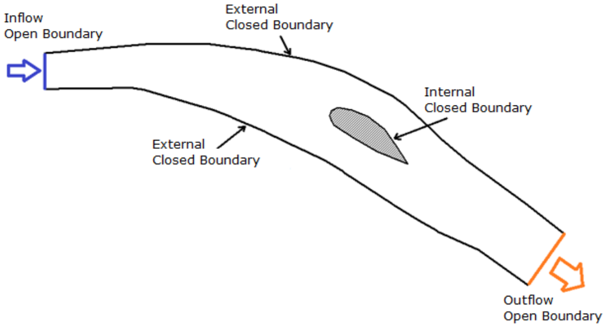

OilFlow2D allows having any number of inflow and outflow boundaries with various combinations of imposed conditions. Proper use of these conditions is a critical component of a successful OilFlow2D simulation. Shallow water equation theory indicates that for two-dimensional subcritical flow it is required to provide at least one condition at inflow boundaries and one for outflow boundaries. For supercritical flow all conditions must be imposed on the inflow boundaries and no boundary condition should be imposed at outflow boundaries. The table below helps determining which conditions to use for most applications.

- **Subcritical:** Q or Velocity; Water Surface Elevation
- **Supercritical:** Q and Water Surface Elevation; None

!!! note

    It is recommended to have at least one boundary where water surface or stage-discharge (e.g. Uniform Flow) is prescribed. Having only discharge and no water surface elevation condition may result in instabilities due to violation of the theoretical boundary condition requirements of the shallow water equations.

The open boundary condition options are described in the table below.

& Imposes Water Surface Elevation. An associated boundary condition file must be provided.\
- **5:** Imposes water discharge and water surface elevation.
- **6:** Imposes water discharge inflow.
- **9:** Imposes single-valued stage-discharge rating table.
- **10:** Free\" inflow or outflow condition. Velocities and water surface elevations are calculated by the model.
- **11:** Free\" outflow condition. Velocities and water surface elevations are calculated by the model, but only outward flow is allowed.
- **12:** Uniform flow outflow condition.
& Imposes Water Surface Elevation and forces perpendicular velocity directions. An associated boundary condition file must be provided.\
- **18:** Imposes Water Surface Elevation and sediment or pollutant concentrations. It also forces perpendicular velocity directions. An associated boundary condition file must be provided.
- **26:** Imposes water and sediment discharge inflow. An associated boundary condition file must be provided.

!!! note

    If you need to impose open conditions on boundary segments that are adjacent, do it in such a way that each segment is separated by a gap more than one cell (see Figure ). Setting two or more open conditions without this separation will lead to incorrect detection of the open boundaries.

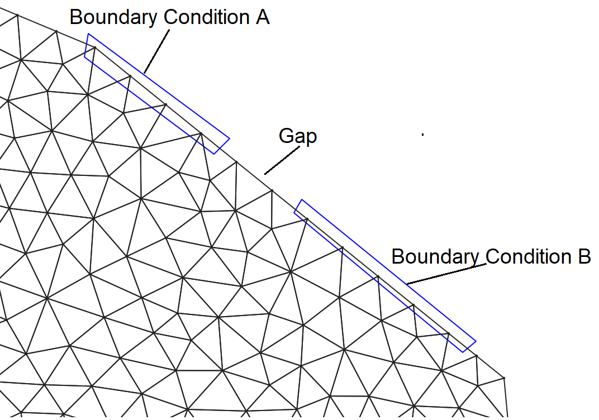{ width=50% }

### Single Variable Boundary Condition Types (BCTYPE 1 and 6)

When imposing a single variable (water surface elevation, or Q), the user must provide a time series for the corresponding variable. To model steady state the time series should contain constant values for all times. There is no restriction on the time interval used for the time series. When imposing water surface elevation it is important to check that the imposed value is higher than the bed elevation.

#### Water Discharge Converted in Velocities (BCTYPE 6)

In this inflow condition the program calculates the flow area and the average water velocity corresponding to the imposed discharge that can be variable in time. Then, velocity is assigned to each cell assuming perpendicular direction to the boundary line as shown:

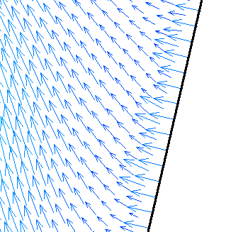{ width=50% }

### Discharge Rating Table (BCTYPE 9)

When using a single valued stage-discharge condition the model first computes the discharge on the boundary then interpolates the corresponding water surface elevation from the rating table and imposes that value for the next time step. If the boundary is dry, it functions as a "free\" condition boundary. Water surface elevations are imposed only on wet nodes. This condition requires providing an ASCII file with the table values entries. See section for details on the file format.

Since these condition may generate wave reflection that can propagate upstream, it is important to locate the downstream boundary on a reach sufficiently far from the area of interest, therefore minimizing artificial backwater effects. Unfortunately, there is no general way to select such place, but numerical experimenting with the actual model will be necessary to achieve a reasonable location.

!!! note

    In most small slope rivers, the stage-discharge relationship is affected by hysteresis. In other words, the stage-discharge curve is looped with higher discharges occurring on the rising limb than on the rescission limb of the hydrograph. This is mainly caused by the depth gradient in the flow direction that changes in sign throughout the hydrograph. In practice, this implies that there can be two possible stages for the same discharge. Loop stage-discharge relationships are not considered in this OilFlow2D version.

### "Free\" Open Boundaries (BCTYPE 10, 11)

On free condition boundaries, the model calculates velocities and water surface elevations applying the full equations from the internal cells. In practice this is be equivalent to assuming that derivatives of water surface elevations and velocities are 0. In subcritical flow situations, it is advisable to use these conditions only when there is at least another open boundary where water surface elevation or stage-discharge is imposed. BCTYPE 10 allows water outflow and inflow, while BCTYPE 11 will only allow flow out of the mesh.

### Uniform Flow Boundary Condition (BCTYPE 12)

To apply this boundary condition the user provides only the bed slope $S_0$. The model will use $S_0$, Manning's n, and discharge to create a rating table. Then for each time-interval, the program will impose the water surface elevation corresponding to the boundary discharge interpolating on the rating table. The rating table is calculated every 0.05 m (0.16 ft.) starting from the lowest bed elevation in the outflow cross section up to 50 m (164 ft.) above the highest bed elevation in the section. If $S_0=-999$, the model will calculate the average bed slope perpendicular to the boundary line.

### Numerical Implementation of Open Boundaries

Many simulation models are based on reliable and conservative numerical schemes. When trying to extend their application to realistic problems involving irregular geometries at boundaries a special care has to be put in preserving the properties of the original scheme. Conservation, in particular, is damaged if boundaries are careless discretized.

In the cells forming the inlet discharge region the flow is characterized by the negative sign of the following scalar product in the $k_{\Gamma}$ boundary edges

$$\mathbf{q}_{i}\cdot\mathbf{n}_{i,k_{\Gamma}}= (h \mathbf{u})_{i}\cdot\mathbf{n}_{i,k_{\Gamma}} < 0$$

and by the state of the flow, defined commonly through the Froude number

$$Fr_{i}=\frac{\mathbf{u}_{i}\cdot\mathbf{n}_{i,k_{\Gamma}}}{c_i}$$

with $c_i=\sqrt{gh_i}$. When the Froude number defined as in is greater than one, the flow is supercritical and all the following eigenvalues are negative:

$$\lambda^{1}=\mathbf{u}_{i}\cdot\mathbf{n}_{i,k_{\Gamma}}+c_i<0 \qquad \lambda^{2}=\mathbf{u}_{i}\cdot\mathbf{n}_{i,k_{\Gamma}}<0 \qquad \lambda^{3}=\mathbf{u}_{i}\cdot\mathbf{n}_{i,k_{\Gamma}}-c_i<0$$

therefore the values of h, u, v, and $\phi$ must be imposed. The water solute concentration $\phi$ is independent of the eigenvalues, and therefore has to be provided at the inlet region for all flow regimes.\
The cells in the outlet discharge region are defined by

$$\mathbf{q}_{i}\cdot\mathbf{n}_{i,k_{\Gamma}}= (h \mathbf{u})_{i}\cdot\mathbf{n}_{i,k_{\Gamma}} > 0$$

for supercritical flow, all the following eigenvalues are positive:

$$\lambda^{1}=\mathbf{u}_{i}\cdot\mathbf{n}_{i,k_{\Gamma}}+c_i<0 \qquad \lambda^{2}=\mathbf{u}_{i}\cdot\mathbf{n}_{i,k_{\Gamma}}<0 \qquad \lambda^{3}=\mathbf{u}_{i}\cdot\mathbf{n}_{i,k_{\Gamma}}-c_i<0$$

in consequence, no extra information is required.

When in both inlet and outlet discharge region, the flow state is subcritical, the updating information is not complete. The same happens at the cell edges acting like solid walls, that cannot be crossed by the flow. Commonly the extra information provided upstream and downstream are discharge functions. And, on solid boundaries, a zero normal discharge function is defined.

To decide whether we are dealing with a supercritical or a subcritical inlet or outlet is not easy in a 2D mesh. A cell based characterization of the boundary flow regime at the boundaries leads to complicated situations both from the physical and from the numerical point of view. On the other hand, physical or external boundary conditions usually refer to average quantities such as water surface level or total discharge that have to be translated into water depth or velocity at each cell, depending on the practitioner criterion. To handle these situations, a suitable connection between the two-dimensional and the one-dimensional models is required at the open boundaries. The section Froude number is defined once the boundary section has a uniform water level as:

$$Fr_{s}=\frac{w}{\sqrt{g(S_T/b_T)}}$$

being the cross sectional velocity $w=Q/S_T$ and defining the total wet cross section $S_T$ and total breath as:

$$S_{T}=\sum_{j=1}^{NB}S_j=\sum_{j=1}^{NB}h_jl_j \qquad, b_{T}=\sum_{j=1}^{NB}l_j$$

where $NB$ is the number of wet boundary cells, $l_j$ is the length of each edge conforming the wet boundary and $h_j$ is the water depth at each boundary cell.

#### Inlet discharge boundary

This is one of the boundary conditions that poses most difficulties because a correct and conservative representation of the steady or unsteady incoming flow must be defined and there is not one obvious form to implement it. The total inflow discharge hydrograph $Q = Q(t)$ is the usual function given in flooding simulation, and it is important to analyze the best way to impose it since it involves the full inlet cross section and we are dealing with a 2D discrete representation in computational cells. Different cases may be found.

#### Simple cases

When the inlet cross section is of rectangular shape (Figure ), that is, of flat bottom and limited by vertical walls, the inlet wet cross section is just rectangular.

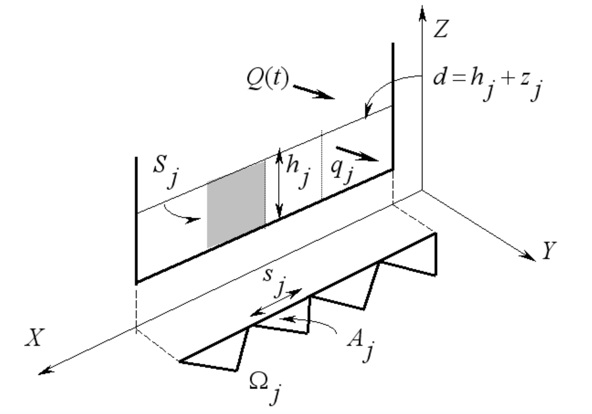

The total inlet discharge at time $t$, $Q_I(t)$, can be distributed along the inlet cross section using a constant discharge per unit width, $q_I (m^2s^{-1})$, that can be calculated as

$$q_{j}=q_{I}=\frac{Q_I(t)}{b_T}$$

In this simple case, $q_I$ is uniform along the inlet boundary and so is the resulting modulus of the velocity, $w=q_I/h$, with $w=(u^2+v^2)^{1/2}$. It should be noted, that the direction of the entering discharge is not necessarily the same as the direction normal to the inlet boundary. However, this direction is usually chosen as the default information.

#### Complex cases

In real problems of general geometry the inlet cross section may change shape as water level changes (drying/wetting boundary), and so does the number of boundary cells involved (Figure ).

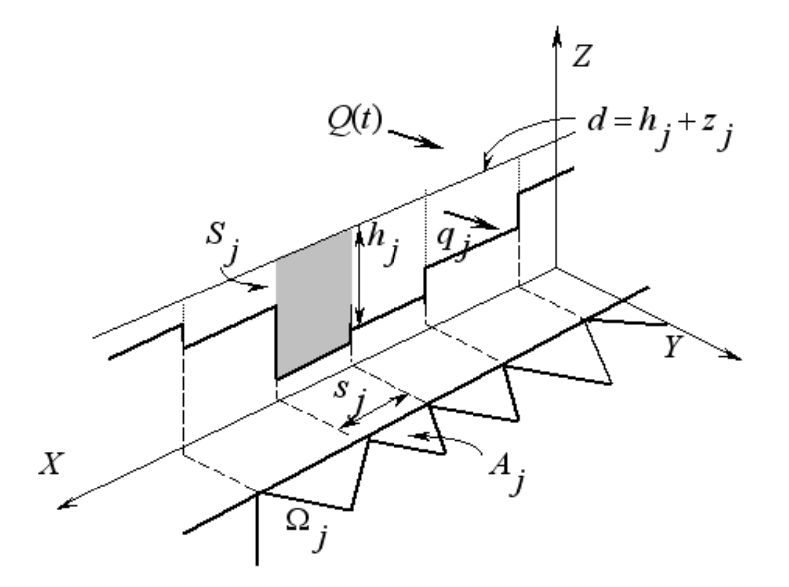

When dealing with inlet sections like that in Figure , a uniform value of $q_I$ as in leads to a completely unrealistic state of faster water at the section borders and slower water at the middle of the cross section. Since the resulting velocities depend on the value of water depth $h$, higher values will appear in those cells where water depth is smaller.

In order to seek a more appropriate distribution, a uniform modulus of the water velocity $w$ is enforced in the whole inlet boundary cross section. In this case, the unit discharge at each boundary cell $j$ is variable and defined depending both on the total cross section area, $S_T$, and on the individual cell transverse area, $S_j$ as follows:

$$q_{j}=Q_I\frac{S_j}{S_T l_j}$$

On the other hand, the updating of the water depth values at the inlet cells provided by the numerical scheme leads in the general case to a set of new water depths $h_j^{n+1}$ (Figure ) associated, in general, to different water surface levels $d_j$ $d_j=h_j+z_j$.

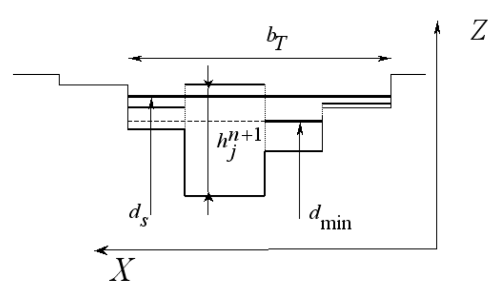

For our purposes a horizontal water surface level is required in that region, in order to help in the translation between the 2D and the 1D points of view at the open boundary. The value of that uniform cross sectional water level is fixed taking into account mass conservation, that is, conservative redistribution of water volume. The minimum value of the water levels among all the wet cells in the inlet boundary, $d_{min}$, is found and the water volume $V_S$ stored in the inlet section above $d_{min}$ is evaluated as

$$V_{S}=\sum_{j=1}^{NB}(d_j-d_{min})A_j|_{d_j>d_{min}}$$

and the wet surface above that level, $A_w$, is defined:

$$A_{w}=\sum_{j=1}^{NB}A_j|_{d_j>d_{min}}$$

They are used to redistribute the volume over the inlet section, keeping constant the wet section breadth $b_T$. As Figure 3 shows a new uniform water level at the section, $d_S$, is given by:

$$d_{s}=d_{min}+\frac{V_S}{A_w}$$

Apart from helping to decide the flow regime at the boundary, the modifications described above make easier the treatment of supercritical inflow conditions. When modeling unsteady river flow, high peaks in the hydrograph can be encountered. If those peaks are not correctly handled from the numerical point of view, they can lead to local and unrealistic supercritical states in the inlet boundary.

In that case of supercritical inlet flow, the specification of all the variables at the inlet boundary cells is required. However, in many practical problems only the discharge hydrograph is available as a function of time, with no data, in general, on the water level distribution or discharge direction at the inlet boundary.

The alternative proposed is, when the inlet Froude number is bigger than 1

$$Fr_{s}=\frac{w}{\sqrt{g(S_T/b_T)}}> 1$$

to enforce a maximum Froude number, $Fr_{s,max}$, to the inlet flow. For that purpose, keeping the section breadth $b_T$, a new inlet wet cross section area, $S_T^*$, is computed from the $Fr_{s,max}$ imposed:

$$S_T^*=(\frac{Q_I^2}{g Fr_{s,max}^2/b_T)})^{1/3}$$

If $S_T^*$ is greater than $S_T$, it provides a new water surface level for the inlet section, $d^*$, also greater than $d_s$ (Figure ). The associated increment in water volume is balanced by means of a reduction in the imposed discharge $Q_I(t)$ in that time step.

Occasionally, both conditions, $Q_I(t)$ and $d(t)$ are known at supercritical inlets. For those cases, imposing both data at the inlet boundary is enough. However, due to the discrete time integration method used, this procedure does not follow the mass conservation criterion. To guarantee that the mass balance is preserved, one of the conditions is imposed, the other must be modified, so that the fluxes calculated in the following step lead to mass conservation. The best solution is to impose directly the global surface water level at the inlet boundary section,$d(t)$, and to adapt the discrete inlet discharge to ensure that the final volume is conserved. The imposed value of $d$ sets an input volume that can be transformed into discharge by means of dividing it by the time step. This value is added to the discharge leading to a correct mass balance.

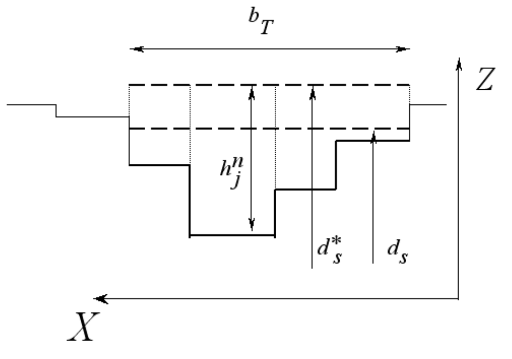

When the boundary cell belongs to an open boundary where the inlet flow discharge is the condition imposed and the flow is subcritical, the discharge is computed using  and imposed in the boundary cell. Moreover, the water level is computed as a results of the contributions from that other cell edges in  when updating the conserved values in the boundary cell at time level $n+1$ and is carefully redistributed as explained before.

#### Outlet boundaries

The analysis of the flow at the outlet boundary is simpler. For supercritical outflow no external conditions have to be imposed. In OilFlow2D, a preliminary sweep is performed over the wet outlet boundary cells in order to evaluate the cell Froude number. If a supercritical cell is found, the whole flow at the outflow boundary section is considered supercritical and no external condition has to be enforced. Otherwise, all the cells are in a subcritical state, and receive an analogous treatment to that of the inlet boundary described above. As before, a uniform cross sectional water level is generated and a velocity distribution is set in cases in which a discharge rating curve is the boundary condition to impose.

### Closed Boundaries

Closed boundaries are rigid or solid walls that completely block the flow such as river banks or islands. They constitute vertical walls that the flow can never overtop. A very thin viscous sublayer occurs near these boundaries that would require extremely small cells to be appropriately resolved. OilFlow2D uses slip condition on closed boundaries and the model will set zero normal flow across the boundary, but tangential velocities are allowed. OilFlow2D detects closed boundaries automatically.

This kind of boundary condition does not require any special treatment. As no flow must cross the boundary, the physical condition $\mathbf{u}\cdot\mathbf{n}=0$ is imposed on the cell velocity $\mathbf{u}$ after adding all the wave contributions from the rest of the cell edges, where $\mathbf{n}$ is the solid wall normal (Figure ). In other words, if the boundary is closed, the associated boundary edge $k_{\Gamma}$ is a solid wall, with a zero normal velocity component. As there are no contributions from that edge, $\delta\mathbf{M}_{i,k_{\Gamma}}^{-}=0$ is set in when updating the conserved values in the boundary cell at time level $n+1$.

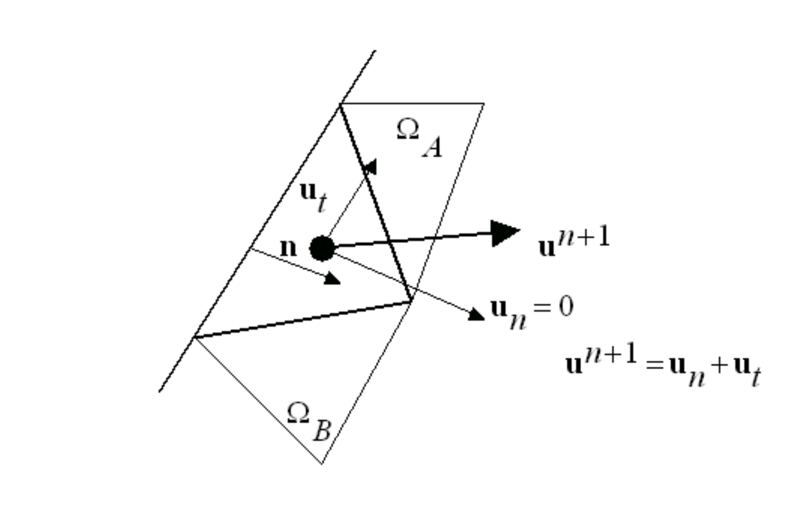

## Dry/Wet Cell Modeling

OilFlow2D is able to simulate the drying and wetting of the bed. This model capability is important when simulating flood wave progression down an initially dry channel. In this case both the channel bed and floodplain will get inundated. The channel bed can also dry again as the flood wave recedes.

In OilFlow2D the triangular-cell mesh can cover both dry and wet areas and the model will handle these conditions using two distinct algorithms and depending on the following cell classification.

### Cell definitions Based on Dry and Wet Conditions

A cell is considered dry if its water depth is less than a fraction of a millimeter. There is not a partially dry cell situation. A cell edge is considered inactive if it separates two dry cells and is excluded from the computation. Otherwise, the cell edge always contributes to the updating of the variables on both sides. The so called wet/dry situation takes place at a cell edge when all the following conditions hold:

- One of the neighbor cells is wet and the other is dry.
- The water level a the wet cell is below the bed level at the dry cell.
- Flow is subcritical.

In that case, the procedure to follow is well described in.

OilFlow2D drying and wetting algorithm is an adaptation of the the one originally proposed by and later improved by and in the finite-volume context and works as follows:

1. At the beginning of each time-step all cells are classified as wet or dry according to the definition.
2. If a cell is dry and completely surrounded by dry cells, it is removed from the computations and velocity components are set to zero for the ongoing time step.
3. All the internal cell edges are classified as active or inactive according to the definition.
4. Wet/dry cell edge contributions are computed assuming the edge is a solid boundary and the velocities on both sides are set to zero.
5. The rest of the cell edge contributions are computed according to the numerical scheme as described above.
6. Wet cells and dry cells surrounded by at least one wet cell are retained in the computation and solved with the updating scheme using the contributions from the cell edges.

This method generates stable numerical solutions without spurious velocities over dry areas and offers machine accuracy mass conservation errors allowing the use of the classical CFL condition.

## Volume Conservation

The volume conservation or volume balance in the simulation domain can be defined through a discharge contour integral:

$$\Delta M(\Delta t)=\int_t^{t+\delta t} (\mathbf{Q}_{I}\cdot\mathbf{n}_{I}-\mathbf{Q}_{O}\cdot\mathbf{n}_{O})dt$$

where $\mathbf{Q}_{I}$ and $\mathbf{Q}_{O}$ are the total discharge functions at the inlet and at the outlet boundaries respectively, and $\mathbf{n}_{I}$ and $\mathbf{n}_{O}$ are the normal vectors to the boundaries. The normal discharge at solid walls is zero. This balance is actually evaluated integrating at the contour cell by cell as follows

$$\Delta M(\Delta t)=\sum_{j=1}^{NB_I}q_{I,j}l_j (\mathbf{n}_{I}\cdot\mathbf{n}_{j}) \Delta t - \sum_{m=1}^{NB_O}q_{O,m}l_m (\mathbf{n}_{O}\cdot\mathbf{n}_{m}) \Delta t$$

where $\mathbf{n}_{j}$ and $\mathbf{n}_{m}$ are the directions of the flow in the inlet and in the outlet cells respectively.

The volume variation in the domain of calculation can be only due to

$$\Delta M(\Delta t) \neq 0$$

Therefore, the mass error of the numerical solution is measured by comparing the total amount of water calculated at time $t+\Delta t$

$$Vol(t+\Delta t)=\sum_{i=1}^{NCELLS} h_{i}^{n+1} S_i$$

with the total amount of water existing at time $t$

$$Vol(t)=\sum_{i=1}^{NCELLS} h_{i}^{n} S_i$$

as follows

$$Error = \left[Vol(t+\Delta t)- Vol(t)\right]- \Delta M(\Delta t)$$

This is usually expressed in relative terms as follows:

$$Relerror = \frac{\left[Vol(t+\Delta t)- Vol(t)\right]- \Delta M(\Delta t)}{Vol(t)+ \Delta M(\Delta t)}$$

## Manning's n roughness Coefficients

The Manning's n usually estimated to determine head losses in channel and river flow is a global measure that accounts not only for the effects of bed roughness, but also for internal friction and variations in shape and size of the channel cross section, obstructions, river meandering (Ven Te Chow, 1959). Therefore, estimations of Manning's n applicable for 1D models should be adjusted, because 2D model equations consider two-dimensional momentum exchange within the cross section that is only lumped in the 1D simplification. Several researchers have found in practical applications of 2D models that the *n* values required can be $30\%$ lower than those normally used for 1D models on the same river reach (Belleudy, 2000). However, 2D models do not account for lateral friction, therefore the final selection of Manning's n coefficients should be the outcome of a calibration process where the model results are adjusted to measured data.
