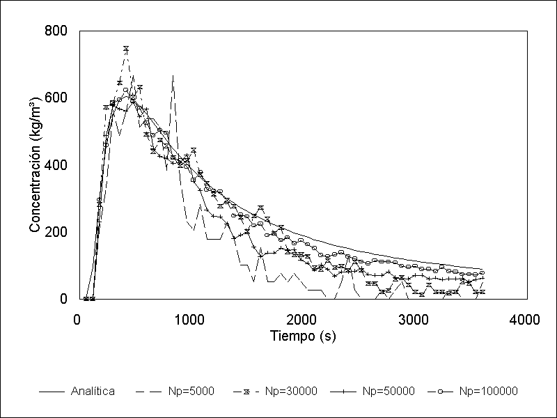
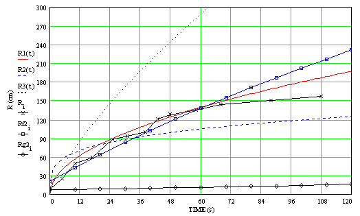
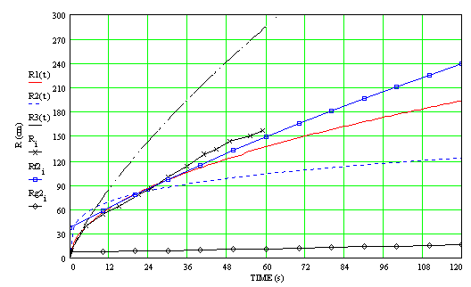
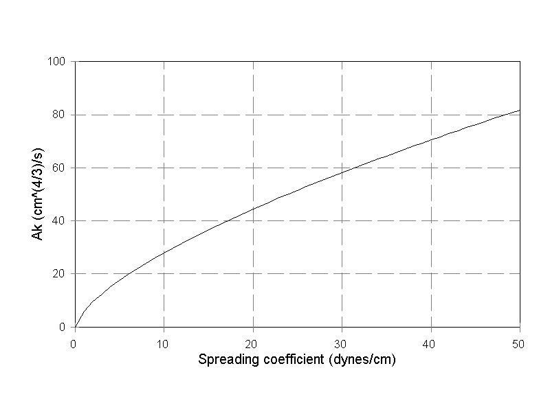
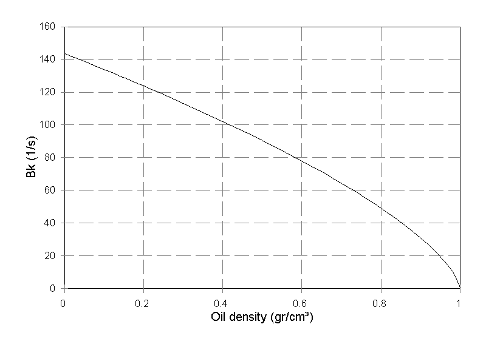

# Oil Spill on Water Model

Oil spill simulation is a very complex task where a large number of interacting factors may affect the oil trajectory and fate. Oil trajectory and spreading are two the fundamental processes, since they will determine the areas that will be affected.

The Oil Spills on Water model allows simulation of crude oil spills on the water surface using a 3D particle-tracking approach to represent the oil trajectory. The model also includes algorithms to consider oil evaporation, emulsification, dispersion, dissolution, interaction with shores, and the oil property changes caused by these processes.

Multiple spills can be considered from fixed user selected locations and also from a moving ship. The model can also include containment booms that represent physical barriers with arbitrary levels of efficiency.

## 3D Oil Spill Trajectory Algorithm

The trajectory of a particular spill is of fundamental importance since it will determine the oil impact on coastal areas and other sensitive ecosystems. The Lagrangian-particle-tracking approach used in OilFlow2D calculates the oil trajectory assuming that the oil is formed by a relatively large number of particles that move on a pre-calculated velocity field.

Many oil spill models available today use Eulerian schemes that are often accompanied by serious difficulties like spurious oscillations leading to nonphysical representation of the phenomena. Instead of using such Eulerian approach where the pollutant concentration is calculated at certain fixed points, a Lagrangian approach was chosen to model oil spreading and trajectory on water based on experimental results and data reports from many oil spills. In this method the spilled mass is represented by a predetermined number $N$ of tracer particles. This transport model, based on tracer or Lagrangian concepts, calculates the particle trajectories in a turbulent flow field considering advection by the flow and dispersion of the oil in water column.

The main advantage of this technique compared to the traditional Eulerian method is the elimination of *numerical* diffusion.

In turbulence theory the concentration of a substance may be represented by a finite number of particles moving with the velocity at their instantaneous position. Usually, it is assumed that the water velocity can be expressed as a mean flow *advective* velocity $u_a$ plus a smaller scale random fluctuation due to turbulent diffusion $u_d$.

To calculate the particle trajectories the model solves the following ordinary differential equations

$$\frac{d x_i}{d t} = {u_a}_i + {u_d}_i$$

$$\frac{d y_i}{d t} = {v_a}_i + {v_d}_i$$

$$\frac{d z_i}{d t} = {w_a}_i + {w_d}_i$$

where $x_i,y_i,$ and $z_i$ are the coordinates of the $i$ particle, $t$ is the time, ${u_a}_i, {v_a}_i,$ and ${w_a}_i$ are the water velocities that advect particle $i$ in $x, y,$ and $z$ directions respectively and ${u_d}_i, {v_d}_i,$ and ${w_d}_i$ are the particle $i$ velocities due to diffusion in the $x, y,$ and $z$ directions respectively.

These equations may be solved using Euler numerical method as follows

$$x_i^{n+1} = x_i^{n} + \Delta x_i^n + \Delta x_i^{n'}$$

$$y_i^{n+1} = y_i^{n} + \Delta y_i^n + \Delta y_i^{n'}$$

$$z_i^{n+1} = z_i^{n} + \Delta z_i^n + \Delta z_i^{n'}$$

where $\Delta t$ is the time interval, $x_i^{n+1}$, $y_i^{n+1}$, and $z_i^{n+1}$ are the $i$ particle coordinates for time $(n+1)\Delta t$, $x_i^{n}$, $y_i^{n}$, and $z_i^{n}$ are the $i$ particle coordinates for time $n \Delta t$, and $\Delta x_i^n$, $\Delta y_i^n$, and $\Delta z_i^n$ are the advective particle displacements defined by

$$\Delta x_i^n = {u_a}_i \Delta t$$

$$\Delta y_i^n = {v_a}_i \Delta t$$

$$\Delta z_i^n = {w_a}_i \Delta t$$

and $\Delta t$ is the time interval, $\Delta x_i^{n^{\prime}}$, $\Delta y_i^{n^{\prime}}$, and $\Delta z_i^{n^{\prime}}$ are the $i$ particle displacements due to the random velocity fluctuations defined as

$$\Delta x_i^{n'} = {u_d}_i \Delta t$$

$$\Delta y_i^{n'} = {v_d}_i \Delta t$$

$$\Delta z_i^{n'} = {w_d}_i \Delta t$$

The horizontal advective field ($u_a,v_a$) is calculated by the water current model and the vertical velocity $w_d$ considers the buoyancy forces due to differences in densities between water and oil through the Stokes law a logarithmic velocity profile described below.

The random velocities ($u_d,v_d,w_d$) due to diffusion are obtained using Montecarlo sampling in a range of velocities $[-U_r,U_r]$ proportional to the diffusion coefficient. $U_r$ is calculated as follows. Assuming large-scale Brownian motion the isotropic diffusion coefficient $D$ may be expressed as

$$D={\left( \frac 1{2\tau }\int_{-\infty }^{+\infty }{x^2f(x)dx}\right) }\biggr/\left( {\int_{-\infty }^{+\infty }{f(x)dx}}\right)$$

where $f(x)$ is a probability distribution that determines the particle displacement $x$ due to the random fluctuations in time $\tau$. It may be proved that equation depends mainly on the variance of $f(x)$ and not on its specific form. Therefore, this model adopts a *tophat* distribution that, introduced in determine the relationship between $\epsilon$ and the diffusion velocity fluctuation range $[-U_r,U_r]$ in the following way

$$U_r=\sqrt{\frac{6D_x}{\Delta t}}$$

where $D_x$ is the diffusion coefficient in $x$ direction.

An analogue deduction may be performed to obtain the random velocity fluctuation ranges in $y$ and $z$ directions ($[-V_r, V_r], [-W_r, W_r]$).

To calculate oil concentration at a particular point $(x, y, z)$, the model counts the number of particles inside a control cubic volume around the point. The concentration corresponding to each particle is the initial concentration divided by the number of particles used to represent the spill.

To calculate oil thickness $Z$, the following expression is used:

$$
Z = N (\Delta A) Z_p$$

where $N(\Delta A)$ is the number of particles contained in the reference surface area $\Delta A$, and $Z_p$ is the *particle thickness* defined as:

$$Z_p = {\frac{V }{\Delta A N_p}}$$

$V$ is the initial spill volume, and $N_p$ is the total number of particles used to represent the oil.

### Three-dimensional 3D Flow Field

Since the OilFlow2D  hydrodynamic component is based on the two-dimensional shallow water equations that provide the depth average velocities, in OilFlow2D oil spills on water model the vertical distribution of the streamwize velocity is obtained assuming the logarithmic velocity profile. That assumption allows representing the three dimensional flow field in an approximated manner.

$$U(z) = {U_* \over \kappa} \ln \left( {z \over z_0}\right)$$

where $U(z)$ is streamwize velocity at elevation z

$U_*$ is the shear velocity = $\sqrt{\tau_0/\rho}$

$\tau_0$ is the bottom shear

$\rho$ is the water density

$\kappa$ is the von Karman constant $\approx = 0.41$

$z_0$ is the bottom friction length

### Dispersion Coefficients

Adequate estimation of the dispersion coefficients is one of the basic factors affecting oil spills, since they determine the random velocity ranges and consequently the oil trajectories.

The complexity of the dynamic process that govern turbulent dispersion in water and the spreading dynamics justify an empirical approach to estimate these coefficients. OilFlow2D can estimate horizontal dispersion coefficients such that the particle spreading calculated with the Lagrangian scheme would be equivalent to the solution given by the modified Mackay formulation .

With this assumption, the spreading coefficient can be obtained knowing that $d\sigma^2/dt\,\propto \,dR/dt$, where $R$ represents the radius of the circular slick. In addition, for spreading in 2D, the variance and its derivative with respect to time are $\sigma ^2=4Dt$, $d\sigma ^2/dt=4D$, and $d\sigma ^2/dt=dA/dt$.

The resulting expression gives a relationship between the oil spreading law and the dispersion coefficient $D$ as shown in the table below, where $k_1$, $k_2$, and $k_3$ are constants that depend on the spreading regime, according to Fay: $k_1=1.14$, $k_2=1.45$, and $k_3=1.0$.

| Regime | Slick radius | Dispersion coefficient |
| --- | --- | --- |
| Gravity-Inertia | $\frac{k_1}{2}(\Delta g V t^2)^{1/4}$ | $\frac{\pi k_1^2}{16}(\Delta g V)^{1/2}$ |
| Gravity-Viscous | $\frac{k_2}{2}\left(\frac{\Delta g V^2 t^{3/2}}{\nu_w^{1/2}}\right)^{1/6}$ | $\frac{\pi k_2^2}{32} \left(\frac{\Delta g V^2}{\nu_w^{1/2}}\right)^{1/3}\frac{1}{\sqrt{t}}$ |
| Surface tension-Viscous | $\frac{k_3}{2}\left(\frac{\sigma^2 t^3}{\rho_w^2 \nu_w}\right)^{1/4}$ | $\frac{3 \pi k_3^2}{16}\left(\frac{\sigma}{\rho_w \nu_w^{1/2}}\right)\sqrt{t}$ |

### Comparison with Analytical Solution

The oil spill trajectory model was compared with a 3-D analytical solution. The simplest solution corresponds to the instantaneous release of mass $M$ of a solute in an unconfined static fluid at $t=0$. The resulting concentration distribution is given by (Crank ):

$$c=\frac{M}{(4\pi t)^{3/2}(D_x D_y D_z)^{1/2}}exp
\left(-\frac{x^2}{4 D_x t}-\frac{y^2}{4 D_y t}-\frac{z^2}{4 D_z t}\right)$$

Figure 1.1 shows the comparison of the model with the analytical solution at point (0,5,0) for an spill of of $1000\,m^3$ of at the origin of coordinates (0,0,0). The diffusion coefficients were: $D_x=D_y=D_z=1\times 10^{-2}\,m^2/s$. Different runs were done for number of particles ranging from 5.000 to 100.000. Note how as the number of particles is increased the numerical solution approaches the analytical one.

{ width=70% }

### Comparison with Experiments

To test the validity of the model and the expressions deduced previously for $A_k$ and $B_k$, a set of oil spreading experiments were performed in a laboratory wave tank 14 m long, 9 m wide and 0 .60 m deep, varying the oil types, spilled volume, wave period and wave height. A total of thirty four oil spills were tested with Victoria, Mesa, and Lago Medio crude oils. The oil-water and oil-air interfacial tensions was measured in the laboratory for each oil sample using a Fisher ring tensiometer. Density and viscosity were measured before each test. Details of these tests are reported in .

Figure 1.2 presents the time variation of the radius of the circular slick measured with Mesa oil as well as the calculations performed with various formulations. It may be seen that the proposed formulation (Rf2) compares well with the experimental data. Mackay thick and thin formulas differ with the experiments and with the other formulations.

Figure 1.3 presents similar results for Lago Medio oil. It is also observed that the proposed formulation (Rf2) in this case also compares very well the experimental data, while the Mackay thick and thin formulas deviates from the experimental results. Also Mackay's thick slick formulation underestimates the spreading radius in all tests performed in this study.

{ width=70% }

{ width=70% }

## Evaporation

Immediately after an oil spill occurs, hydrocarbons begin to evaporate, thus reducing the volume of spilled oil. To consider this phenomenon, it is necessary calculate the fraction of oil that has evaporated at each time interval depending on the crude oil properties. OilFlow2D  offers two the formulation to calculate the evaporated oil fraction, one proposed by Fingas (2010) and another that of Stiver-Mackay (1984).

### Stiver-Mackay formulation

The Stiver-Mackay formulation is as follows:

$${d F_e \over dt} = \ {\Theta}  \left[ 6.3 - ({10.3 \over T_{oil}})\  (T_{0} + P \   F_e) \right] 
        $$

where $F_e$ is the fraction of the total volume of the slick that has been evaporated.

$\Theta$ is the so-called *exposure coefficient* and is defined as:

$$\Theta = \ {K_{m} A    \over V_{o}}$$

being $K_{m}$ the mass transfer coefficient which can be written as:

$$K_{m} = \ 0.0025 \ { W }^{0.78}$$

$W$ is the wind velocity at 10 m above the surface in $m/s$, $A$ the slick area expressed in $m^{2}$, $t$ is the spill time in seconds, $V$is the initial volume of the spill in $m^{3}$, $T$, is oil temperature in $K$, $T_0   = 532.95-3.125 API$, is the initial the boiling point for oil initial air temperature in $K$, $P = 985.62 -13.597 API$ is represents the slope of the oil standard distillation (Temperature vs. Evaporated fraction).

### Fingas formulation

According to Fingas (2010), the evaporation of oils and petroleum products can be described using the concept of diffusion-controlled regulation through the oil layer and the oil-air surface interface. This mechanism differs fundamentally from air-boundary-layer regulation, which applies to pure, rapidly evaporating liquids such as water.

Evaporation models are generally classified into two categories: those based on air-boundary-layer-controlled evaporation and those based on diffusion-regulated evaporation. Experimental studies demonstrate that oil evaporation does not follow air-boundary-layer control. Unlike water, where evaporation rates are strongly influenced by atmospheric conditions, oil evaporation is governed primarily by diffusion processes within the oil layer itself.

Because according to Fingas, oil evaporation is not air-boundary-layer regulated, a relatively simple evaporation formulation is sufficient to describe the process. Factors such as wind speed, turbulence intensity, surface area, and scale effects do not need to be explicitly considered. Instead, the dominant variables controlling evaporation are time and temperature. Oil thickness also plays a secondary role and is therefore included in diffusion-regulated evaporation formulations.

Fingas (2010) developed a simplified, empirically based modeling framework that provides evaporation equations for more than 200 common oils and petroleum products. These formulations were derived from experimental studies of oil evaporation behavior. For most oils, evaporation follows a functional relationship of the form $F_e = 0.01 (a + b \, T) \ln(t)$, where $a$ and $b$ are empirical constants, $T$ represents temperature, and $t$ denotes time.

Some oils, such as diesel fuels, exhibit a different evaporation behavior, following a relationship of the form $F_e = 0.01 (a + b \, T) \sqrt(t)$. Diesel and similar fuels therefore display a distinct temporal curvature in their evaporation profiles, particularly during the early stages of evaporation, when compared to most other oils.

The resulting Fingas (2010) formulations to determine the evaporation fraction are summarized in the following tables:

| Oil (Group 1)                  | $F_{{e}} \times 100$           | Oil (Group 2)                      | $F_{{e}}\times 100$          |
|:-------------------------------|:-------------------------------|:-----------------------------------|:-----------------------------|
| Adgo                           | $(0.11 + 0.013\,T)\sqrt{t}$    | Chavyo                             | $(3.52 + 0.045\,T)\ln(t)$    |
| Adgo-long term                 | $(0.68 + 0.045\,T)\ln(t)$      | Combined oil/gas                   | $(-0.08 + 0.013\,T)\sqrt{t}$ |
| Alberta Sweet Mixed Blend      | $(3.24 + 0.054\,T)\ln(t)$      | Compressor Lube Oil-new            | $(-0.68 + 0.045\,T)\ln(t)$   |
| Amauligak                      | $(1.63 + 0.045\,T)\ln(t)$      | Cook Inlet Trading Bay             | $(3.15 + 0.045\,T)\ln(t)$    |
| Amauligak-f24                  | $(1.91 + 0.045\,T)\ln(t)$      | Cook Inlet-Granite Point           | $(4.54 + 0.045\,T)\ln(t)$    |
| Arabian Heavy                  | $(1.31 + 0.045\,T)\ln(t)$      | Cook Inlet-Swanson River           | $(3.58 + 0.045\,T)\ln(t)$    |
| Arabian Heavy                  | $(2.71 + 0.045\,T)\ln(t)$      | Corrosion Inhibitor Solvent        | $(-0.02 + 0.013\,T)\sqrt{t}$ |
| Arabian Light                  | $(2.52 + 0.037\,T)\ln(t)$      | Cusiana                            | $(3.39 + 0.045\,T)\ln(t)$    |
| Arabian Light                  | $(3.41 + 0.045\,T)\ln(t)$      | Delta West Block 97                | $(6.57 + 0.045\,T)\ln(t)$    |
| Arabian Light (2001)           | $(2.4 + 0.045\,T)\ln(t)$       | Diesel (regular stock)             | $(0.31 + 0.018\,T)\sqrt{t}$  |
| Arabian Medium                 | $(1.89 + 0.045\,T)\ln(t)$      | Diesel Anchorage-Long              | $(4.54 + 0.045\,T)\ln(t)$    |
| ASMB (offshore)                | $(2.2 + 0.045\,T)\ln(t)$       | Diesel Anchorage-Short             | $(0.51 + 0.013\,T)\sqrt{t}$  |
| ASMB-Standard \#5              | $(3.35 + 0.045\,T)\ln(t)$      | Diesel fuel-Southern-long term     | $(2.18 + 0.045\,T)\ln(t)$    |
| Av Gas 80                      | $(15.4 + 0.045\,T)\ln(t)$      | Diesel fuel-Southern-short term    | $(-0.02 + 0.013\,T)\sqrt{t}$ |
| Avalon                         | $(1.41 + 0.045\,T)\ln(t)$      | Diesel Mobile 1997                 | $(0.03 + 0.013\,T)\sqrt{t}$  |
| Avalon J-34                    | $(1.58 + 0.045\,T)\ln(t)$      | Diesel Mobile 1997 long-term       | $(-0.02 + 0.013\,T)\sqrt{t}$ |
| Aviation Gasoline 100 LL       | $(0.5 + 0.045\,T)\ln(t)$       | Diesel-long term                   | $(5.8 + 0.045\,T)\ln(t)$     |
| Barrow Island                  | $(4.67 + 0.045\,T)\ln(t)$      | Dos Cuadros                        | $(1.88 + 0.045\,T)\ln(t)$    |
| BCF-24                         | $(1.08 + 0.045\,T)\ln(t)$      | Ekofisk                            | $(4.92 + 0.045\,T)\ln(t)$    |
| Belridge Crude                 | $(0.03 + 0.013\,T)\sqrt{t}$    | Empire Crude                       | $(2.21 + 0.045\,T)\ln(t)$    |
| Bent Horn A-02                 | $(3.19 + 0.045\,T)\ln(t)$      | Endicott                           | $(0.9 + 0.045\,T)\ln(t)$     |
| Beta                           | $(-0.08 + 0.013\,T)\sqrt{t}$   | Esso Spartan EP-680 Industrial Oil | $(-0.66 + 0.045\,T)\ln(t)$   |
| Beta-long term                 | $(0.29 + 0.045\,T)\ln(t)$      | Eugene Island 224-condensate       | $(9.53 + 0.045\,T)\ln(t)$    |
| Boscan                         | $(-0.15 + 0.013\,T)\sqrt{t}$   | Eugene Island Block 32             | $(0.77 + 0.045\,T)\ln(t)$    |
| Brent                          | $(3.39 + 0.048\,T)\ln(t)$      | Eugene Island Block 43             | $(1.57 + 0.045\,T)\ln(t)$    |
| Bunker C Anchorage             | $(-0.13 + 0.013\,T)\sqrt{t}$   | Evendell                           | $(3.38 + 0.045\,T)\ln(t)$    |
| Bunker C Anchorage (long term) | $(0.31 + 0.045\,T)\ln(t)$      | FCC Heavy Cycle                    | $(0.17 + 0.013\,T)\sqrt{t}$  |
| Bunker C-Light (IFO-250)       | $(0.0035 + 0.0026\,T)\sqrt{t}$ | FCC Light                          | $(-0.17 + 0.013\,T)\sqrt{t}$ |
| Bunker C-long term             | $(-0.21 + 0.045\,T)\ln(t)$     | FCC Medium Cycle                   | $(-0.16 + 0.013\,T)\sqrt{t}$ |
| Bunker C-short term            | $(0.35 + 0.013\,T)\sqrt{t}$    | FCC-VGO                            | $(2.5 + 0.013\,T)\sqrt{t}$   |
| California API 11              | $(-0.13 + 0.013\,T)\sqrt{t}$   | Federated                          | $(3.47 + 0.045\,T)\ln(t)$    |
| California API 15              | $(-0.14 + 0.013\,T)\sqrt{t}$   | Federated (new-1999)               | $(3.45 + 0.045\,T)\ln(t)$    |
| Cano Limon                     | $(1.71 + 0.045\,T)\ln(t)$      | Garden Banks 387                   | $(1.84 + 0.045\,T)\ln(t)$    |
| Carpenteria                    | $(1.68 + 0.045\,T)\ln(t)$      | Garden Banks 426                   | $(3.44 + 0.045\,T)\ln(t)$    |
| Cat cracking feed              | $(-0.18 + 0.013\,T)\sqrt{t}$   | Gasoline                           | $(13.2 + 0.21\,T)\ln(t)$     |

Evaporated fraction as a function of temperature $T$ and time $t$ according to the Fingas (2010) formulation

| Oil (Group 3)              | $F_{{e}} \times 100$         | Oil (Group 4)                   | $F_{{e}} \times 100$         |
|:---------------------------|:-----------------------------|:--------------------------------|:-----------------------------|
| Genesis                    | $(2.12 + 0.045\,T)\ln(t)$    | Maya                            | $(1.38 + 0.045\,T)\ln(t)$    |
| Green Canyon Block 109     | $(1.58 + 0.045\,T)\ln(t)$    | Mayan crude                     | $(1.45 + 0.045\,T)\ln(t)$    |
| Green Canyon Block 184     | $(3.55 + 0.045\,T)\ln(t)$    | Mississippi Canyon Block 194    | $(2.62 + 0.045\,T)\ln(t)$    |
| Green Canyon Block 65      | $(1.56 + 0.045\,T)\ln(t)$    | Mississippi Canyon Block 72     | $(2.15 + 0.045\,T)\ln(t)$    |
| Greenplus Hydraulic Oil    | $(-0.68 + 0.045\,T)\ln(t)$   | Mississippi Canyon Block 807    | $(2.05 + 0.045\,T)\ln(t)$    |
| Gullfaks                   | $(2.29 + 0.034\,T)\ln(t)$    | Nektoralik                      | $(0.62 + 0.045\,T)\ln(t)$    |
| Heavy Reformate            | $(-0.17 + 0.013\,T)\sqrt{t}$ | Neptune Spar (Viosca Knoll 826) | $(3.75 + 0.045\,T)\ln(t)$    |
| Hebron MD-4                | $(1.01 + 0.045\,T)\ln(t)$    | Nerlerk                         | $(2.01 + 0.045\,T)\ln(t)$    |
| Heidrun                    | $(1.95 + 0.045\,T)\ln(t)$    | Ninian                          | $(2.65 + 0.045\,T)\ln(t)$    |
| Hibernia                   | $(2.18 + 0.045\,T)\ln(t)$    | Norman Wells                    | $(3.11 + 0.045\,T)\ln(t)$    |
| High Viscosity Fuel Oil    | $(-0.12 + 0.013\,T)\sqrt{t}$ | North Slope-Middle Pipeline     | $(2.64 + 0.045\,T)\ln(t)$    |
| Hondo                      | $(1.49 + 0.045\,T)\ln(t)$    | North Slope-Northern Pipeline   | $(2.64 + 0.045\,T)\ln(t)$    |
| Hout                       | $(2.29 + 0.045\,T)\ln(t)$    | North Slope-Southern Pipeline   | $(2.47 + 0.045\,T)\ln(t)$    |
| IFO-180                    | $(-0.12 + 0.013\,T)\sqrt{t}$ | Nugini                          | $(1.64 + 0.045\,T)\ln(t)$    |
| IFO-30 (Svalbard)          | $(-0.04 + 0.045\,T)\ln(t)$   | Odoptu                          | $(4.27 + 0.045\,T)\ln(t)$    |
| IFO-300 (old Bunker C)     | $(-0.15 + 0.013\,T)\sqrt{t}$ | Oriente 1                       | $(1.32 + 0.045\,T)\ln(t)$    |
| Iranian Heavy              | $(2.27 + 0.045\,T)\ln(t)$    | Oriente 2                       | $(1.57 + 0.045\,T)\ln(t)$    |
| Issungnak                  | $(1.56 + 0.045\,T)\ln(t)$    | Orimulsion 400-dewater          | $3.6\,\ln(t)$                |
| Isthmus                    | $(2.48 + 0.045\,T)\ln(t)$    | Orimulsion plus water           | $(3 + 0.045\,T)\ln(t)$       |
| Jet 40 Fuel                | $(8.96 + 0.045\,T)\ln(t)$    | Oseberg                         | $(2.68 + 0.045\,T)\ln(t)$    |
| Jet A1                     | $(0.59 + 0.013\,T)\sqrt{t}$  | Panuke                          | $(7.12 + 0.045\,T)\ln(t)$    |
| Jet Fuel (Anch)            | $(7.19 + 0.045\,T)\ln(t)$    | Pitas Point                     | $(7.04 + 0.045\,T)\ln(t)$    |
| Jet Fuel (Anch) short term | $(1.06 + 0.013\,T)\sqrt{t}$  | Platform Gail (Sockeye)         | $(1.68 + 0.045\,T)\ln(t)$    |
| Komineft                   | $(2.73 + 0.045\,T)\ln(t)$    | Platform Holly                  | $(1.09 + 0.045\,T)\ln(t)$    |
| Lago                       | $(1.13 + 0.045\,T)\ln(t)$    | Platform Irene-long term        | $(0.74 + 0.045\,T)\ln(t)$    |
| Lago Treco                 | $(1.12 + 0.045\,T)\ln(t)$    | Platform Irene-short term       | $(-0.05 + 0.013\,T)\sqrt{t}$ |
| Lucula                     | $(2.17 + 0.045\,T)\ln(t)$    | Point Arguello Heavy            | $(0.94 + 0.045\,T)\ln(t)$    |
| Main Pass Block 306        | $(2.86 + 0.045\,T)\ln(t)$    | Point Arguello Light            | $(2.44 + 0.045\,T)\ln(t)$    |
| Main Pass Block 37         | $(3.04 + 0.045\,T)\ln(t)$    | Point Arguello Light-b          | $(2.3 + 0.045\,T)\ln(t)$     |
| Malongo                    | $(1.67 + 0.045\,T)\ln(t)$    | Point Arguello-co-mingled       | $(1.43 + 0.045\,T)\ln(t)$    |
| Marinus Turbine Oil        | $(-0.68 + 0.045\,T)\ln(t)$   | Polypropylene Tetramer          | $0.25\,t$                    |
| Marinus Valve Oil          | $(-0.68 + 0.045\,T)\ln(t)$   | Port Hueneme                    | $(0.3 + 0.045\,T)\ln(t)$     |
| Mars TLP                   | $(2.18 + 0.045\,T)\ln(t)$    |                                 |                              |
| Maui                       | $(-0.14 + 0.013\,T)\sqrt{t}$ |                                 |                              |

Evaporated fraction as a function of temperature $T$ and time $t$ according to the Fingas (2010) formulation

| Oil (Group 5)              | $F_{{e}} \times 100$         | Oil (Group 6)               | $F_{{e}} \times 100$         |
|:---------------------------|:-----------------------------|:----------------------------|:-----------------------------|
| Prudhoe Bay (new stock)    | $(2.37 + 0.045\,T)\ln(t)$    | Vasconia                    | $(0.84 + 0.045\,T)\ln(t)$    |
| Prudhoe Bay (old stock)    | $(1.69 + 0.045\,T)\ln(t)$    | Viosca Knoll Block 826      | $(2.04 + 0.045\,T)\ln(t)$    |
| Prudhoe stock b            | $(1.4 + 0.045\,T)\ln(t)$     | Viosca Knoll Block 990      | $(3.16 + 0.045\,T)\ln(t)$    |
| Rangely                    | $(1.89 + 0.045\,T)\ln(t)$    | Voltesso 35                 | $(-0.18 + 0.013\,T)\sqrt{t}$ |
| Sahara Blend               | $(0.001 + 0.013\,T)\sqrt{t}$ | Waxy Light and Heavy        | $(1.52 + 0.045\,T)\ln(t)$    |
| Sahara Blend (long term)   | $(1.09 + 0.045\,T)\ln(t)$    | West Delta Block 30 w/water | $(-0.04 + 0.013\,T)\sqrt{t}$ |
| Sakalin                    | $(4.16 + 0.045\,T)\ln(t)$    | West Texas Intermediate 1   | $(2.77 + 0.045\,T)\ln(t)$    |
| Santa Clara                | $(1.63 + 0.045\,T)\ln(t)$    | West Texas Intermediate 2   | $(3.08 + 0.045\,T)\ln(t)$    |
| Scotia Light 1             | $(6.92 + 0.045\,T)\ln(t)$    | West Texas Sour             | $(2.57 + 0.045\,T)\ln(t)$    |
| Scotia Light 2             | $(6.87 + 0.045\,T)\ln(t)$    | White Rose                  | $(1.44 + 0.045\,T)\ln(t)$    |
| Ship Shoal Block 239       | $(2.71 + 0.045\,T)\ln(t)$    | Zaire                       | $(1.36 + 0.045\,T)\ln(t)$    |
| Ship Shoal Block 269       | $(3.37 + 0.045\,T)\ln(t)$    |                             |                              |
| Sockeye                    | $(2.14 + 0.045\,T)\ln(t)$    |                             |                              |
| Sockeye Co-mingled         | $(1.38 + 0.045\,T)\ln(t)$    |                             |                              |
| Sockeye Sour               | $(1.32 + 0.045\,T)\ln(t)$    |                             |                              |
| Sockeye Sweet              | $(2.39 + 0.045\,T)\ln(t)$    |                             |                              |
| South Louisiana            | $(2.39 + 0.045\,T)\ln(t)$    |                             |                              |
| South Pass Block 60        | $(2.91 + 0.045\,T)\ln(t)$    |                             |                              |
| South Pass Block 67        | $(2.17 + 0.045\,T)\ln(t)$    |                             |                              |
| South Pass Block 93        | $(1.5 + 0.045\,T)\ln(t)$     |                             |                              |
| South Timbalier Block 130  | $(2.77 + 0.045\,T)\ln(t)$    |                             |                              |
| Statfjord                  | $(2.67 + 0.06\,T)\ln(t)$     |                             |                              |
| Sumatran Heavy             | $(-0.11 + 0.013\,T)\sqrt{t}$ |                             |                              |
| Sumatran Light             | $(0.96 + 0.045\,T)\ln(t)$    |                             |                              |
| Taching                    | $(-0.11 + 0.013\,T)\sqrt{t}$ |                             |                              |
| Takula                     | $(1.95 + 0.045\,T)\ln(t)$    |                             |                              |
| Tapis                      | $(3.04 + 0.045\,T)\ln(t)$    |                             |                              |
| Tchatamba Crude            | $(3.8 + 0.045\,T)\ln(t)$     |                             |                              |
| Terra Nova                 | $(1.36 + 0.045\,T)\ln(t)$    |                             |                              |
| Terresso 150               | $(-0.68 + 0.045\,T)\ln(t)$   |                             |                              |
| Terresso 220               | $(-0.66 + 0.045\,T)\ln(t)$   |                             |                              |
| Terresso 46 Industrial oil | $(-0.67 + 0.045\,T)\ln(t)$   |                             |                              |
| Thevenard Island           | $(5.74 + 0.045\,T)\ln(t)$    |                             |                              |
| Turbine Oil STO 120        | $(-0.68 + 0.045\,T)\ln(t)$   |                             |                              |
| Turbine Oil STO 90         | $(-0.68 + 0.045\,T)\ln(t)$   |                             |                              |
| Udang                      | $(-0.14 + 0.013\,T)\sqrt{t}$ |                             |                              |
| Udang (long term)          | $(0.06 + 0.045\,T)\ln(t)$    |                             |                              |

Evaporated fraction as a function of temperature $T$ and time $t$ according to the Fingas (2010) formulation

## Emulsification

This is one of the least understood yet most critical processes influencing the evolution of an oil slick, particularly with respect to the phenomenon of oil properties changes and oil sinking. A careful analysis is required due to its significant impact on the physical behavior and fate of spilled oil. The process involves the formation of a water-in-oil emulsion, which transforms the spilled oil into a highly viscous mixture. Owing to its dark color and thick, semi-solid appearance, this emulsion is commonly referred to as *chocolate mousse*.

Oil emulsification occurs as the oil spreads over the water surface. Certain oil components tend to accumulate at the oil-water interface, forming a stabilizing layer composed primarily of asphaltenes, resins, and waxes. This interfacial layer inhibits the coalescence of individual oil droplets. Nevertheless, partial aggregation still occurs, and as oil fragments merge, water becomes entrapped between them, forming thin films that evolve into small, stable emulsified structures. The retained water provides structural support to the emulsion, thereby promoting and sustaining the water-in-oil emulsification process.

The propensity of crude oil to emulsify depends strongly on the oil's composition as well as on the environmental conditions prevailing at the spill site, such as temperature, wave energy, and salinity.

The incorporated water fraction into the oil slick due to emulsion formation can be calculated using the Macay's formulation (Sebastiao and Soares, 1995):

$${ dF_{em} \over dt}= K_{em} (1+W^2) (1- {F_{em} \over F_{max}} )$$

where $F_{em}$ is the water fraction in the oil with respect to the total oil slick volume, $F_{max}$ is the maximum water content, and $W$ is the wind velocity at 10 m above the surface in $m/s$.

## Density and Viscosity Change

The density and viscosity of an oil slick on the sea surface are primarily governed by oil weathering processes. Among these, evaporation and emulsification are the dominant mechanisms influencing viscosity evolution. Although evaporation alters oil properties, its impact on viscosity has been reported to be less significant than that of emulsification. Emulsification leads to a rapid increase in slick viscosity. Therefore, the effect of emulsion formation must be explicitly accounted for when estimating slick viscosity.

To estimate the oil density change the model uses the following formula:

$$\rho_o = F_{em} \rho_w + \rho_{oi} (1-F_{em}) (1+0.18 F_e)$$

where $\rho_o$ is the oil density at a given time ($kg/m^3$), $\rho_{oi}$ is the initial oil density ($kg/m^3$), and $\rho_w$ is the water density ($kg/m^3$).

To determine the viscosity change the model uses the following formula:

$$\mu_{ow}= \mu_{oi} \exp \left( 10 F_{e} \right) \exp \left( {2.5 F_{em} \over 1-0.65 F_{em}} \right) \exp \left( -63.16 {T_{ref} - T_o \over T_o T_{ref}} \right)$$

where $\mu_{ow}$ is the oil-water mixture viscosity (cP), $\mu_{oi}$ is the initial oil viscosity (cP), $T_{o}$ is the oil temperature ($K$), and $T_{ref}$ is the initial oil temperature ($K$).

## Oil Spreading Formulation

Many authors have treated the theme among which the works of Fay and Hoult may be considered as the first attempts to formulate relatively simple formulas useful to simulate oil spreading. In 1980, Mackay et al.[^1] presented the now landmark work *Oil Spill Processes and Models* , where the most important phenomena that determine oil spills were formulated in a simple manner. In particular, the spreading formulation, based on Fay formulas, applied the concept of thick and thin slick that has had wide acceptance. It appears that most research work since 1980 has been dedicated to study other important processes with the assumption that the spreading process was correctly modeled.

Mackay spreading formulation for the thin slick is based on the Fay's surface tension spreading regime. The time evolution of oil area is written:

$$A_{tn}=K_{tn}t^{3/2}$$

where $A_{tn}$ is the oil thin slick area, $t$ is the time, and $K_{tn}$ is assumed to be constant.

Differentiating the previous equation with respect to time:

$${\frac{dA_{tn}}{dt}}={\frac 32}K_{tn}t^{1/2}$$

Substituting $t$ from the area equation into the derivative and simplifying, the following expression is obtained:

$${\frac{dA_{tn} }{dt}} = K^{\prime}{A_{tn}}^{1/3}$$

where $K^{\prime }=3/2K_{tn}^{2/3}$

Applying Euler method to the ordinary differential equation and assuming $K^{\prime }$ independent of time (Mackay assumes $K_{tn}$ is constant), it is approximated as:

$${\Delta A_{tn}} = A_k {A_{tn}}^{1/3} \Delta t$$

where $\Delta A_{tn}$ is the thin slick area change in the time interval $\Delta t$, and $A_k = K^{\prime}$.

Mackay assumed that the thin slick is of constant thickness ($1 \mu m$), and as it spreads, *draws* oil from the thick slick. To account for the retardation of this *feeding* mechanism, Mackay introduces an empirical exponential factor:

$${\Delta A_{tn}} = A_k {A_{tn}}^{1/3} \exp({\frac{-C_k }{Z}})\Delta
    t$$

where $C_k$ is a constant to be adjusted, and $Z$ is the thick slick thickness.

To simulate the thick slick, Mackay derivation starts from the Fay's gravity-viscous equation:

$${A_{tk}} = K_{tk} V^{2/3} t^{1/2}$$

where $A_{tk}$ is the oil thick slick area, and $K_{tk}$ is assumed to be constant.

Differentiating the previous equation with respect to time:

$${\frac{dA_{tk} }{dt}} = {\frac{1 }{2}} K_{tk} V^{2/3} t^{-1/2}$$

Substituting $t$ from the thick slick area equation into its derivative, assuming constant thick slick thickness ($V = A_{tk} Z$), and simplifying, the following expression is obtained:

$${\frac{dA_{tk} }{dt}} = K_{tk}^{\prime}Z^{4/3} {A_{tk}}^{1/3}$$

where $K_{tk}^{\prime}= 1/2 K_{tk}^2$.

Applying Euler method to the ordinary differential equation, assuming $K_{tk}^{\prime }$ independent of time (remember again that Mackay assumes $K_{tk}$ is constant) and that $Z$ does not change significantly in the $\Delta t$ time interval, it is approximated as:

$${\Delta A_{tk}} = B_k Z^{4/3} {A_{tk}}^{1/3} \Delta t$$

where $\Delta A_{tk}$ is the thin slick area change in the time interval $\Delta t$, and $B_k = K_{tk}^{\prime}$.

The final equation for thick slick area evolution taking into account loss of volume due to the *feeding* of the thin slick is according to Mackay

$${\Delta A_{tk}} = B_k Z^{4/3} {A_{tk}}^{1/3} \Delta t - \left(10^{-6} {\frac{\Delta A_{tn} }{Z}}\right)$$

Mackay determines $A_k$, $B_k$, and $C_k$ constants by adjusting them so that the thin- and thick-slick equations fit a particular spreading field experiment. The values obtained were:

$$A_k = 1.0$$

$$B_k = 150.0$$

$$C_k = 0.0015$$

Although these values were fitted to a particular set of field tests, most oil spill models available today use the same constants disregarding the influence of the oil properties in its determination.

### $A_k$ and $B_k$ Formulation

To analyze the Mackay equations and to determine the correct expressions of $A_k$ and $B_k$, we will start with the Fay and Hoult original surface tension spreading formulation. Assuming circular spreading we have:

$$A_{tn} = {\frac{\pi }{4}} {\frac{ \sigma }{\rho_w \nu_w^{1/2}}}
    t^{3/2}$$

where $\rho_w$ is the water density, $\nu_w$ is the water kinematic viscosity, and $\sigma$ is the net spreading coefficient defined as:

$$\sigma = \sigma_{aw} - \sigma_{ow} - \sigma_{oa}$$

where $\sigma_{aw}, \sigma_{ow}$ and $\sigma_{oa}$ are the air-water, oil-water and oil-air interfacial tensions respectively.

Comparing the Fay and Hoult expression with Mackay's thin slick expression, it is observed that $K_{tn}$ is not a constant but actually:

$$K_{tn}={\frac \pi 4}{\frac \sigma {\rho _w\nu _w^{1/2}}}$$

Substituting this value into $A_k$ the following expression is obtained:

$$A_k = {\frac{3 }{2}} \left({\frac{\pi }{4}}\right)^{2/3} \left({\frac{ \sigma }{\rho_w \nu_w^{1/2}}}\right)^{2/3}$$

Note that $A_k$ has dimensions $[ L^{4/3} / T]$.

The previous analysis shows that $A_k$ is not a constant but depends on the net oil spreading coefficient and on the water properties.

To analyze Mackay thick slick equation, we start with Fay and Hoult gravity-viscous spreading formulation. Assuming again circular spreading we have:

$$A_{tk} = {\frac{\pi }{4}} \left( {\frac{\Delta g }{\nu_w^{1/2}}}\right)^{1/3} V^{2/3} t^{1/2}$$

where $g$ is the gravitational acceleration, $\Delta =1-\rho
_o/\rho _w$, and $\rho _o$ is the oil density.

Comparing the Fay and Hoult expression with Mackay's thick slick expression, it is observed that $K_{tk}$ is not a constant but actually:

$$K_{tk}={\frac \pi 4}\left( {\frac{\Delta g}{\nu _w^{1/2}}}\right) ^{1/3}$$

Substituting this value into $B_k$ the following expression is obtained:

$$B_k = {\frac{1 }{2}} \left({\frac{ \pi }{4}}\right)^2\left( {\frac{\Delta g }{\nu_w^{1/2}}}\right)^{2/3}$$

Note that $B_k$ has dimensions $[ 1 / T]$.

Therefore, $B_k$ is not a constant but depends on the oil and water physical properties.

Figure 1.4 shows the dependence of $A_k$ on the spreading coefficient $\sigma$. Mackay's proposed value of $A_k=1m^{4/3}/s  = 464.16 cm^{4/3}/s$ corresponds to $\sigma \approx 714$ dynes/cm. It is well known that the $\sigma$ value for existing oils is around 25 dynes/cm. There is not any oil with surface tension values in the range of that implied by Mackay's constant.

{ width=70% }

{ width=70% }

Figure 1.5 shows the dependence of $B_k$ on oil density. Note that the Mackay's suggested value of $B_k=150$ is out of range and does not correspond to any existing oil. The appropriate values should be around $B_k=30$.

The previous analysis demonstrated that errors may be obtained if the values of $A_k$ and $B_k$ originally suggested by Mackay are used for all oil spill simulations without taking into consideration oil and water properties.

## Containment Booms

OilFlow2D  can consider the effect of containment booms in the trajectory of oil spills using the *Booms* component. Booms are entered as polylines in the QGIS *SpillBooms* layer and are assumed to be physical barriers to the particles that represent the oil. These barriers can be partial depending on an *Oil Trapping Fraction (OTF)* parameter assigned to each boom. For instance if the OTF is 1, all of the oil particles will be trapped by the boom, but if OTF is set to 0.1, only 10% of the particles will be contained and 90% will pass through the boom.

## Setting up a Oil Spill on Water Simulation

Please, consult the Tutorials document for step-by-step explanation about setting up a complete oil spill on water simulation.

[^1]: In this manual Mackay et al. report will be called indistinctly Mackay report
