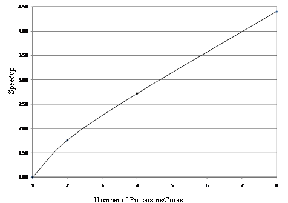
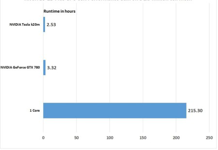

# Code Parallelization

## OilFlow2D CPU

OilFlow2D code has been parallelized using OpenMP directives available in the Intel C++ compiler. OpenMP Application Program Interface (API) supports multi-platform shared-memory parallel programming in C/C++ and Fortran on architectures, including MAC OS, Unix and Windows platforms (OpenMP, 2009). OpenMP provides instructions to parallelize existing serial codes to run in shared-memory platforms ranging from affordable and widely available multiple-core computers to supercomputers. Using this parallelization approach OilFlow2D dynamically distributes the computational workload between as many processors or cores as are available. In this way the model optimizes its computations to the particular architecture of each computer.

Figure shows the speedup of the model with respect to the number of processors/cores on a DELL Precision 7400 computer with 2 Intel Xeon CPU X5472 \@3.00GHz and 16GB of RAM. With 8 cores, the model runs more than 4 times faster than with the non-parallelized model. One hour simulation takes approximately 6 minutes using the parallelized model in this particular computer platform.

## OilFlow2D GPU

The GPU version of the OilFlow2D model offers amazing speedups that considerably reduce run times. OilFlow2D GPU implements two strategies: OpenMP parallelization and GPU techniques. Since dealing with transient inundation flows the number of wet calls changes during the simulation, a dynamic task assignment to the processors that ensures a balanced work load has been included in the Open MP implementation. OilFlow2D strict method to control volume conservation (errors of Order $10^{-14} \%$) in the numerical modeling of the wetting/drying fronts involves a correction step that is not fully local which requires special handling to avoid degrading the model performance. The GPU version reduces the computational time by factors of up to 700X when compared with non-parallelized CPU (1-core) runs. Figure shows performance tests using recent GPU hardware technology, that demonstrate that the parallelization techniques implemented in OilFlow2D GPU can significantly reduce the computational cost.

