# Input Data File Reference

Data files for non-spatial information required to run the OilFlow2D. All OilFlow2D input data files are in ASCII free-form format, which can be opened using any text editor or spreadsheet program. In some instances it may be convenient to directly edit the data. However, it is recommended to edit files with extreme caution, and only after having gained a thorough understanding of OilFlow2D file formats. This section explains the input data files, and the parameters included in each file.

The OilFlow2D installation program creates a folder with several example projects that can be consulted to review the model data files. Depending on your operating system and settings, this folder can be found in `...\Documents\OilFlow2D_QGIS\ExampleProjects`.

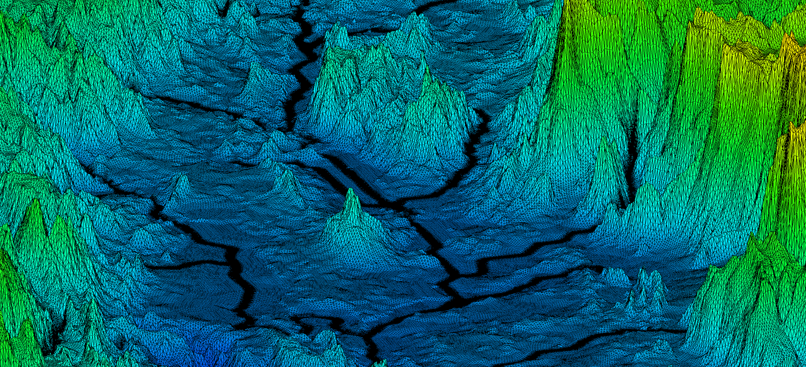{ width=100% }

OilFlow2D data files will share the same name and will use the file extensions listed in the table below. For example a run named Run1 will have files as follows: , , etc. The following table summarizes the data files used by OilFlow2D model.

!!! note

    Table DEPENDENCIES column indicates all required and optional files depending on the options selected. You may use this information to select the files that should be transferred to another computer that will perform the simulations, or to a Virtual Machine on a Cloud Service.

- **QGIS project file:** & Required when using the OilFlow2D; This is the project file where QGIS stores all the spatial data used in the project, including the triangular cell mesh.

- **Elevation data:** any; Required; Scattered elevation data points.
- **Triangle-cell mesh data:** & Required; Node coordinates and elevations, triangular mesh topology, boundary condition type and file names, initial water elevations, and Manning's n coefficients.
- **Mesh boundary nodes:** & Internal file; List of external and island boundary nodes. This file is internally generated by OilFlow2D.
- **I/O boundary conditions:** & Internal file; List of external boundary nodes, inflow and outflow conditions. This file is internally generated by OilFlow2D.
- **Boundary condition nodal file:** & Required; List of external boundary conditions. For each boundary, it contains the list of nodes and the associated data file. Note that all files listed within are required to run the model, and should reside in the same folder. This file is now internally generated by OilFlow2D, based on the information in the file.
- **Run control data:** ,; Required; General run control options, including time step, simulation time, metric or English units, graphical output options, initial conditions, components, etc.
- **Plot results options:** & Optional; Graphical output options.
- **Observation points data:** & Optional; Location of observation points where the model will report time series of results.
- **Cross section output:** & Optional; List of cross sections where the model will output results. Each cross section is defined by coordinates of its two ending points.
- **Profile output:** & Optional; Mesh profile cut where results are desired.
- **Time series or rating table files for inflow or outflow boundary conditions:** user defined; Required; Hydrograph, water surface elevations vs. time, etc. The model requires one file for each open boundary condition, except "free" boundary condition types.
- **Initial concentration of each pollutant:** & Required when using the Pollutant Transport module.; Defines the initial concentrations over the mesh.
- **Bridges:** & Required when using the Bridges component.; Bridge cross section geometry file is used to compute energy losses.
- **Culverts:** & Required when using the Culvert component.; Culvert location and associated culvert data files.
- **Dam Breach:** & Required when using the Dam Breach component.; Location and data for the dam breach.
- **Gates:** & Required when using the Gates component.; Gate location and associated gate aperture data files.
- **Infiltration:** & Required when using the Infiltration component.; Infiltration parameters data file.
- **Internal rating tables:** & Required when using the Internal Rating Table component.; Data to impose discharge rating tables along internal boundaries.
- **Manning's n variable with depth:** & Required when using variable Manning's n with depth.; Provides the parameters necessary to account for Manning's n roughness coefficient that vary with depth according to a user provided table. Created from polygons on the ManningsNz layer.
- **Bridge piers:** & The Piers component is selected; Bridge pier data used to calculate pier drag forces.
- **Rainfall/Evaporation:** & Required when using the Rainfall/Evaporation component.; Time series for rainfall and evaporation.
- **Sources and sinks:** & Required when using the Sources component.; This file contains location of input discharge sources or output discharge sinks and associated time series of discharge data files.
- **Weirs:** & Required when using the Weir component.; This file contains weirs polylines and associated weir data.
- **Wind:** & Required when using the Wind component.; This file contains wind specific density and velocity data.

- **Bridge Scour:** & Required to calculate bridge pier or abutment scour.; This file contains pier and abutment parameters needed to compute scour.

- **Mud/Tailings Flow:** & Required when using the Mud/Tailings Flow module.; Provides the parameters necessary to model mud and tailings flow.
- **Oil Spills on Land:** & Required when using the OilFlow2D model to simulate overland spills.; Provides the parameters necessary to model overland oil spills.
- **Oil Spills on water:** & Required when using the OilFlow2D model to simulate oil spills over water.; Provides the parameters necessary to model oil spills on water.
- **Pollutant transport:** & Required when using the Pollutant Transport module.; Data for passive or reactive pollutants.
- **Bed load sediment transport:** & Required when using the Sediment transport module.; Bed load sediment transport data.
- **Suspended sediment transport:** & Required when using the Sediment transport module.; Suspended sediment transport data.
- **Water Quality:** & Required when using the Water Quality; Water quality parameters.

## Run Control Data

### Run Control Data File: .DAT

This file contains parameters to control the model run including time step, simulation time, metric or English units, physical processes or component switches, and graphical output and initial conditions options.\
Line 1: Internal program version number.\
**RELEASE**\
Line 2: Model selector switch.\
**IMS**\
Line 3: Physical processes or component switches.\
**IRAIN ISED IPIERS IWEIRS ICULVERTS ISOURCES IINTRC IBRIDGES IGATES IDAMS ISWMM**\
Line 4: Wet-dry bed method switch.\
**IWETDRY**\
Line 5: Output control switches.\
**IEXTREMES IXSEC IPROFILE NOGRAPH IOBS**\
Line 6: Time control data.\
**DUMMY CFL DUMMY TOUT TLIMT**\
Line 7: Initial conditions and hot start control switches.\
**IINITIAL IHOTSTART**\
Line 8: Manning's n variable with depth switch.\
**IMANN**\
Line 9: Manning's n value global multiplication factor.\
**XNMAN**\
Line 10: Mass Balance Reporting Switch.\
**IMASSBAL**\
Line 11: Unit system definition switch.\
**NUNITS**\
Line 12: Minimum flow depth for dry areas.\
**HMIN**\
Line 13: Initial water surface elevation.\
**INITIAL_WSE**\
Line 14: Pollutant transport / Water Quality models switch.\
**IPOLLUTANT**\
Line 15: Wind stress switch.\
**IWIND**\
Line 16: Mud/Tailings flow and Oil Spill models switch.\
**IMDOIL**\
Line 17: Number of cores or GPU ID.\
**IDGPU**\
Line 18: Graphical User Interface that created the files.\
**IGUI**\
Line 19: Additional components.\
**ISCOUR IMULTSOURCES IHAZARD HARRIVAL FUTURE5 FUTURE6 FUTURE7 FUTURE8 FUTURE9 FUTURE10**

#### Example of .DAT file

    201905 
    1 
    0 0 0 0 1 1 0 0 0 0 0 
    2 
    0 0 0 0 0 
    0 0.5 0.25 0.25 8 
    1 0 
    1 
    1 
    0.9 
    1 
    -1 
    0 
    0 
    0 
    0 
    4 
    2 
    1 0 0 0.05 0 0 0 0 0 0 0

- **CFL:** R; $(0,1]$; -; Applies to OilFlow2D and OilFlow2D GPU models. Courant number. Default value is set to 1.0. CFL may need to be set to lower values if results show signs of unexpected oscillations.
- **DUMMY:** R; -; -; Dummy parameter for future use. Ignored in OilFlow2D.
- **HMIN:** R; $-1$ or $>0$; m/ft; In OilFlow2D HMIN is the depth limit for dry-wet calculation. If depth is less than HMIN, cell velocity will be set to 0. If HMIN = -1, all cells with depth less than $10^{-6}$ m will be considered dry.
- **HARRIVAL:** R; $\ge 0$; m/ft; The model will report the inundation or frontal wave arrival time to each cell when the depth at the cell reaches HARRIVAL for the first time during the simulation.
- **IADDISP:** I; 0,1; -; Switch to activate the pollutant transport model.

1. Turn off pollutant transport computations.
2. Apply pollutant transport.

- **IBRIDGES:** I; 0,1; -; Switch to activate the Bridges component.

1. Turn off Bridges component.
2. Apply Bridges component.

Requires file. See details on the *Bridges* Section of this manual.\
- **ICULVERTS:** I; 0,1; -; Switch indicating if one-dimensional culverts will be used.

1. No culverts will be used.
2. Use culverts.

Requires file. See details on the *Culverts* Section of this manual.\
- **IDAMS:** I; 0,1; -; Switch to activate the Dam Breach component.

1. Turn off Dam Breach component.
2. Apply Dam Breach component.

Requires file. See details on the *Dam Breach* Section of this manual.\
- **IDGPU:** I; $\geq 0$; -; OilFlow2D: This parameter indicates how many processors or cores will be used in the parallel computation. The maximum number will depend on the processor capabilities. OilFlow2D GPU: If your computer has multiple GPU cards, this parameter allows selecting which card will be used for the run. Since the model allows only one concurrent run per cards, this option allows running simultaneous simulations in different cards.
- **IEXTREMES:** I; 0,1; -; Switch to reporting maximum values throughout the simulation.

1. Do not report maximum values.
2. Report maximum values.

- **IGATES:** I; 0,1; -; Switch to activate the Gates component.

1. Turn off Gates component.
2. Apply Gates component.

Requires file. See details on the *Gates* Section of this manual.\
- **IGUI:** I; 1, 2; -; This parameter indicates what Graphical User Interface was used to create OilFlow2D files.

1. Aquaveo SMS
2. QGIS

- **IHAZARD:** I; 0,1; -; Switch to create flood hazard files.

1. Does not create hazard files.
2. The model will create the hazard files.

- **IHOTSTART:** I; 0,1; -; Switch to start run from scratch or continue a previous simulation.

1. Start simulation from initial time.
2. Start simulation from previous run.

- **IINTRC:** I; 0,1; -; Switch for internal rating tables.

1. Do not use internal rating table component.
2. Use internal rating tables.

See details on *Internal Rating Tables* Section of this manual.\
- **IINITIAL:** I; 0,1,2,-9999; -; Initial condition switch for water surface elevations.

1. Prescribed horizontal water surface elevation
2. Initial dry bed on whole mesh.
3. Initial water surface elevations read from file -9999: Assigns a horizontal water elevation equal to the maximum bed elevation plus 0.5 m. (1.64 ft.). See comment 3.

- **INITIAL_WSE:** R; -; m/ft; Initial water surface elevation on the whole meshes. This will be the initial water surface if IINITIAL is 0. See comment 3.
- **IMANN:** I; 1,2; -; Variable Manning's n with depth switch.

1. Manning's n is constant for all depths.
2. Manning's n may vary with depths as defined in the file.

- **IMASSBAL:** I; 0,1; -; Mass balance report switch. Used to define when to calculate mass balance and create the file.

1. Mass balance is not calculated every time step, and is not created.
2. Mass balance is calculated every time step, and is created

. See comment 9.\
- **IMDOIL:** I; 0-3; -; Switch to select mud/tailings/oil model.

1. Do not run mud/tailings/oil models.
2. Run mud/tailings flow model. Requires file. See details on the Mud/Tailings Flow Model section of this manual.
3. Run the oil spill on land flow model. Requires file. See details on the Oil Spills on Land section of this manual.
4. Run the oil spill on water model. Requires file. See details on the Oil Spills on Water section of this manual.
5. Run the mud/tailings flow model. Requires file. See details on the Mud/Tailings Flow Model section of this manual.

- **IMS:** I; 1,2; -; Model switch used to select the hydrodynamic model engine.

1. OilFlow2D.
2. OilFlow2D GPU.

- **IMULTSOURCES:** I; 0,1; -; Switch used to select multiple-sources batch processing. When set to 1, the model will create a sub-directory (named as the source ID) for each source, and perform independent runs in each sub-directory.

1. All sources will be considered acting simultaneously.
2. The model will perform as many runs as sources are defined.

- **IOBS:** I; 0,1; -; Switch to report time series of results at specified locations defined by coordinates.

1. Do not report on observation points.
2. Report on observation points.

Requires file. See details on the *Observation Points* section of this manual.\
- **IPIERS:** I; 0,1; -; Switch to allow accounting for pier drag force.

1. Do not use pier drag force option.
2. Use pier drag force option.

Requires file. This option may be used if the mesh does not account for the pier geometry. See details on *Bridge Piers Section* of this manual.\
- **IPOLLUTANT:** I; 0,1, 2; -; Switch to select pollutant model.

1. Do not run pollutant transport models.
2. Run pollutant transport advection-dispersion-reaction model. Requires file.
3. Run water quality model. Requires file.

See details on the *Pollutant Transport and Water Quality Models* section of this manual.\
- **IPROFILE:** I; 0,1; -; Switch to control profile output.

1. No profile results output.
2. Results will be output along a prescribed profile.

Requires file. See comment 4.\
- **IRAIN:** I; 0-4; -; Switch for rainfall and evaporation input.

1. No rainfall modeling.
2. Not used.
3. Rainfall/evaporation.
4. Infiltration.
5. Rainfall/evaporation and Infiltration.

- **ISED:** I; 0,1; -; Sediment transport switch.

1. No sediment transport modeling.
2. Sediment transport, mobile bed erosion, and deposition will be simulated. Requires or files.

See details on the *Sediment Transport* section of this manual.\
- **ISCOUR:** I; 0,1; -; Switch for scour computations.

1. Deactivate scour computation around piers and abutments.
2. Compute scour around bridge piers or abutments. Requires file.

- **ISOURCES:** I; 0,1; -; Switch for sources and sinks.

1. No sources or sinks are present.
2. Sources or sinks are present. Requires file.
3. Sources or sinks are present, but each source will be solved as a separate scenarios in different sub-directories named according to each source ID. Requires file.

See details on the *Sources* section of this manual.\
- **ISWMM:** I; 0,1; -; Switch for linking with EPA-SWMM model.

1. Deactivate link with EPA-SWMM model.
2. Compute surface water flow and interaction with storm drains with EPA-SWMM model. Requires file and a compatible SWMM model file.

- **IWEIRS:** I; 0,1; -; Weir computation on internal boundary switch.

1. Do not use weir computation on internal boundaries.
2. Use weir computation on internal boundaries.

See details on the *Weirs* section of this manual.\
- **IWIND:** I; 0,1; -; Switch to account for wind stress on the water surface.

1. Do not consider wind stress.
2. Consider wind stress. Requires file.

See details on the *Wind Stress* section of this manual.\
- **IXSEC:** I; 0,1; -; Cross section output switch.

1. No cross section result output.
2. Cross section results will be output to file. Requires file. See comment 5.

- **NOGRAPH:** I; 0,4; -; Variable to control automatic closing of model run monitoring window.

1. Window remain open until user clicks close button.
2. The model windows will automatically close as soon as the run finalizes.

- **NUNITS:** I; 0,1; -; Variable to indicate unit system:

1. Metric units.
2. English units.

- **RELEASE:** I; -; -; Release number ID used internally for reference. Should not be modified.
- **TLIMT:** R; $>0$; h.; Total simulation time.
- **TOUT:** R; $\leq TLIMT$; h.; Output time interval for reporting results.
- **XNMAN:** R; \[0.1-2\]; -; Manning's n coefficient multiplier. See comment 6.

#### Comments for the .DAT file

1. Setting the CFL (Courant Friederich-Lewy) or Courant number is critical for adequate stability and ensure mass conservation. OilFlow2D explicit time scheme is conditionally stable, meaning that there is a maximum time step above which the simulations will become unstable. This threshold can be theoretically approximated by a Courant-Frederick-Lewy condition defined as follows:

    $$CFL=\frac{\Delta t\sqrt{g h}}{\Delta x}\leq 1$$

    where $\Delta t$ = DT is the time-step, $\Delta x$ is a measure of the minimum triangular cell size, $g$ is the acceleration of gravity, and $h$ is the flow depth. It may occur that during the initial stages of a hydrograph, velocities are small and the selected time step is adequate. During the simulation, however, velocities and flow depth may increase causing the stability condition to be exceeded. In those cases it will be necessary to rerun the model with a smaller CFL. Alternatively, the variable time step option may be used.

2. For variable time step simulations, OilFlow2D estimates the maximum DT using the theoretical Courant-Frederick-Lewy (CFL) condition. Sometimes, the estimated DT may be too high, leading to instabilities, and it may be necessary to reduce CFL to with a value less than one to adjust it. Typical CFL values range from 0.3 to 1, but may vary project to project.
3. There are three initial conditions options. If IINITIAL = 0, the initial water elevation will be a constant horizontal surface at the elevation given as INITIAL_WSE. If INITIAL_WSE is = -9999 then the program will assign a constant water elevation equal to the highest bed elevation on the mesh. If IINITIAL = 1, the whole computational mesh will be initially dry, except at open boundaries where discharge is prescribed and depth $>$ 0 is assumed for the first time step. If IINITIAL = 2, initial water surface elevations are read from the data file for each node in the mesh.
4. Use the IPROFILE option to allow OilFlow2D to generate results along a polyline. The polyline and other required data should be given in the Profiles file , which is defined later in this document.
5.  Use this option to allow OilFlow2D to generate results along prescribed cross sections. The cross sections and other required data should be given in Cross Section file  which is defined later in this document.
6. Use the XNMAN option to test the Manning's n value sensitivity on the results. The prescribed Manning's coefficient assigned to each cell will be multiplied by XNMAN. This option is useful to test model sensitivity to Manning's n during model calibration.
7. The model will create output files with maximum values of each output variable.
8. The user can specify an initial water surface elevation setting IINITIAL = 0 and entering INITIAL_WSE.
9. The user can select whether the model will calculate bass balance or not. This has implications particularly in the GPU model since mass balance calculations are done in the CPU, with the resulting performance overhead and runtime increase. Yu may want to turn it on to review how the model is conserving volume or mass. Once that is checked, it is recommended to turn it off for maximum performance.

## Mesh Data

### Mesh Data File: .FED

This file contains the data that defines the triangular-cell mesh, and includes node coordinates, connectivity for each triangular cell, node elevations, Manning's n coefficients and other parameters. This file is created OilFlow2D. OilFlow2D assures that the file will be created error free and consistent with the boundary conditions and other mesh parameters. Editing this file outside OilFlow2D may introduce unexpected errors.\
Line 1: Number of cells and nodes.\
**NELEM NNODES DUMMY DUMMY**\
NNODES lines containing node coordinates and node parameters.\
**IN X(IN) Y(IN) ZB(IN) INITWSE(IN) MINERODELEV(IN) BCTYPE BCFILENAME**\
NELEM lines containing mesh connectivity and cell parameters.\
**IE NODE(IE,1) NODE(IE,2) NODE(IE,3) MANNINGN(IE) ELZB(IE) ELINITWSE(IE) ELMINERODELEV(IE)**

#### Example of a .FED file

      1965  1048   5   5
    1 243401.515  94305.994  51.071 0.000  -9999.000  0  0   
    2 243424.157  94325.674  49.833 0.000  -9999.000  0  0   
    3 243446.800  94345.354  49.136 0.000  -9999.000 12  0.025   
    4 243469.443  94365.034  48.879 0.000  -9999.000  0  0   
    5 243503.168  94394.347  51.662 0.000  -9999.000 12  0.025   

    ... 

    1044 243830.638  93310.994  48.603 0.000  -9999.000  6  QIN.DAT   
    1045 243492.493  93320.046  49.987 0.000  -9999.000  6  QIN.DAT    
    1046 243693.660  93297.785  47.390 0.000  -9999.000  0  0   
    1047 243964.332  93388.332  50.843 0.000  -9999.000  0  0   
    1048 243861.431  93893.192  50.863 0.000  -9999.000  0  0   
    1  456  987  188  0.035  51.395 0.000  -9999.000 0.000
    2  478  183  809  0.035  49.778 0.000  -9999.000 0.000
    3  336   37  869  0.035  53.992 0.000  -9999.000 0.000
    4  601  393   97  0.035  53.486 0.000  -9999.000 0.000
    5  456  509  987  0.035  51.690 0.000  -9999.000 0.000
    ...

    1961 1024   972   23  0.035  47.480 0.000  -9999.000 0.000
    1962  930  1028  377  0.035  48.126 0.000  -9999.000 0.000
    1963 1028   960  377  0.035  48.385 0.000  -9999.000 0.000
    1964 1043  1017  426  0.035  51.994 0.000  -9999.000 0.000
    1965  850    78   77  0.035  49.715 0.000  -9999.000 0.000

This mesh has 1965 cells, 1048 nodes.

- **BCTYPE:** I; -; -; Code to indicate type of open boundary. See further details about boundary conditions on the file description below.
- **BCFILENAME:** S; $<26$; -; Boundary condition file name. Should not contain spaces and must have less than 26 characters. See further details on the file description below.
- **DUMMY:** I; -; -; Always equal to 2.
- **ELINITWSE(IE):** R; -; m or ft; Initial water surface elevation for cell EL. Used in OilFlow2D and OilFlow2D GPU.
- **ELMINERODELEV (IE):** R; $\geq 0$; -; Minimum erosion elevation allowed at each cell. Used in OilFlow2D and OilFlow2D GPU.
- **ELZB (IE):** R; -; m or ft; Initial bed elevation for cell EL. Used in OilFlow2D and OilFlow2D GPU.
- **INITWSE(IN):** R; -; m or ft; Initial water surface elevation for node IN.
- **IE:** I; $>0$; -; Cell index. Consecutive from 1 to NELEM.
- **IN:** I; $>0$; -; Node number. Consecutive from 1 to NNODES.
- **MANNINGN(IE):** R; $>0$; -; Manning's n value for cell IE.
- **MINERODELEV (IN):** R; $\geq 0$; m or ft; Minimum erosion elevation allowed at each node.
- **NELEM:** I; 1-5; -; Number of triangular cells.
- **NNODES:** I; $>0$; -; Number of nodes.
- **NODE(IE,1), NODE(IE,2), NODE(IE,3):** I; $>0$; -; Node numbers for cell IE given in counter clockwise direction.
- **X(IN):** R; -; m or ft; X coordinate for node IN.
- **Y(IN):** R; -; m or ft; Y coordinate for node IN.
- **ZB (IN):** R; -; m or ft; Initial bed elevation for node IN.

### Open Boundary Conditions Data Files: .IFL and .OBCP 

These files contain boundary condition data used only internally by the model. Both files are internally generated by OilFlow2D. The format of the file is as follows\
Line 1: Number of nodes on external boundary.\
**NNODESBOUNDARY**\
NNODESBOUNDARY lines containing the external boundary conditions data.\
**NODE BCTYPE BCFILENAME**

#### Example of .IFL file

    1165 
    365 1 WSE97out.TXT 
    367 1 WSE97out.TXT 
    431 1 WSE97out.TXT 

This file has 1165 nodes on the boundary. Node 365 has a BCTYPE=1 (Water Surface Elevation) and the time series of water surface elevations vs. time is in file .\
The format of the file is as follows\
Line 1: Number of open inflow and outflow boundaries.\
**NOB**\
NOB groups of lines containing the following data.\
**BCTYPE**\
**BCFILENAME**\
**NNODESBOUNDARYI**\
NNODESBOUNDARYI lines containing the list of nodes on this boundary.\
**NODE(I)**

#### Example of a .OBCP file

    2 
    12
    UNIF1.DATP 
    24
    2916
    ...
    3299

    6
    INFLOW1.QVT 
    17
    2
    1
    ...
    25
    2
    6

This file has 2 open boundaries. The first open boundary is BCTYPE=12 corresponding to Uniform Flow outflow. The uniform flow WSE vs Discharge table is included in file , and there are 24 nodes on the boundary. The second open boundary is BCTYPE = 6 corresponding to inflow hydrograph where the Discharge vs time table is given in file , and there are 17 nodes on the boundary.

- **BCTYPE:** I; -; -; Code to indicate type of open boundary. See Table and comment 1.
- **BCFILENAME:** S; $<26$; -; Boundary condition file name. Should not contain spaces and must have less than 26 characters. See comments 2 and 3.
- **NOB:** I; -; -; Number of open inflow or outflow boundaries.
- **NODE:** I; -; -; Node number.
- **NNODESBOUNDARYI:** I; -; -; Number of nodes on open boundary I.
- **NNODESBOUNDARY:** I; -; -; Total number of nodes on boundary.

lp9.9cm

- **0:** Closed impermeable boundary. Slip boundary condition (no normal flow) is imposed. See comment 5.
- **1:** Imposes Water Surface Elevation. An associated boundary condition file must be provided. See comments 2 and 4.
- **6:** Imposes water discharge. An associated boundary condition file must be provided. See comment 2.
- **9:** Imposes single-valued stage-discharge rating table. An associated boundary condition file must be provided. See comment 6.
- **10:** Free" inflow or outflow condition. Velocities and water surface elevations are calculated by the model. See comment 7.
- **11:** Free" outflow condition. Velocities and water surface elevations are calculated by the model. Only outward flow is allowed. See comment 7.
- **12:** Uniform flow outflow condition. See comment 10.
- **13-16:** For future use.
- **17:** Imposes Water Surface Elevation. This condition is similar to BCTYPE 1, but it forces perpendicular velocity to the input line. An associated boundary condition file must be provided. See comments 2 and 4.
- **19:** Imposes single-valued stage-discharge rating table along an internal polyline. An associated boundary condition file must be provided. See comment 8.
- **26:** Imposes water discharge and sediment discharge time series. An associated boundary condition file must be provided. See comment 9.

#### Comments for the .IFL and .OBCP files

1. OilFlow2D allows having any number of inflow and outflow boundaries with various combinations of imposed conditions. Proper use of these conditions is a critical component of a successful OilFlow2D simulation. Theoretically, for subcritical flow it is required to provide at least one condition at inflow boundaries and one for outflow boundaries. For supercritical flow all conditions must be imposed on the inflow boundaries and 'none' on outflow boundaries. Table helps determining which conditions to use for most applications.

    - **Subcritical:** Q or Velocity; Water Surface Elevation
    - **Supercritical:** Q and WSE; Free

    !!! note

        It is recommended to have at least one boundary where WSE or stage-discharge is prescribed. Having only discharge and no WSE may result in inaccuracies due to violation of the theoretical boundary condition requirements of the shallow water equations.

2. When imposing a single variable ( water surface elevation, or discharge Q), the user must provide an ASCII file with the time series for the corresponding variable. See section Boundary Conditions Data Files for details on the format for one-variable boundary condition files.
3. When imposing two variables ( water surface elevation and discharge Q, etc.), it is required to provide an ASCII file with the time series for the variables. See section Boundary Conditions Data Files for details on the format for two-variable boundary condition files.
4. When imposing water surface elevation it is important to check that the imposed value is higher than the bed elevation. Even though OilFlow2D can run with that condition, it could lead to volume conservation errors.
5. A closed boundary condition is imposed by default on all boundary nodes. In this case, the model calculates velocities and water surface elevations for all nodes on the boundary depending on the value of the ISPLIPBC parameter. For example ISLIPBC = 1 will impose slip conditions setting zero-flow across the boundary. Tangential flow is free corresponding to a slip condition.
6. When using a single valued stage-discharge condition the model first computes the discharge on the boundary then interpolates the corresponding water surface elevation from the rating table and imposes that value for the next time step. In case the boundary is dry, it functions as a free condition boundary (see comment 7). Water surface elevations are imposed only on wet nodes. This condition requires providing an ASCII file with the table values entries. See section Boundary Conditions Data Files for details on the file format. In general it is preferable to use stage hydrograph rather than stage-discharge condition. In most small slope rivers, the stage-discharge relationship is affected by hysteresis. In other words, the stage-discharge curve is looped with higher discharges occurring on the rising limb than on the rescission limb of the hydrograph. This is mainly caused by the depth gradient in the flow direction that changes in sign throughout the hydrograph. In practice, this implies that there can be two possible stages for the same discharge. If the stage-discharge relationship is not well known or if it just computed assuming steady state uniform flow, it may lead to considerable errors when used as downstream boundary condition. That it is why it is often preferred to use the stage hydrograph for that purpose. However, such hydrograph may not be available to study changes in the river and evaluating proposed conditions. For those cases, it is useful to use a stage-discharge relationship, preferably measured over an extensive range of discharges. When this relationship is not available, one option would be to assume steady state flow to determine a single-value rating curve. Since this condition may generate wave reflection that can propagate upstream, it is important to locate the downstream boundary on a reach sufficiently far from the area of interest, therefore minimizing artificial backwater effects. Unfortunately, there is no general way to select such place, but numerical experimenting with the actual model will be necessary to achieve a reasonable location.

    !!! note

        Loop stage-discharge relationships are not implemented in this OilFlow2D version.

7. On free outflow condition boundaries, the model calculates velocities and water surface elevations applying the full equations from the internal cells. No specific values for velocities or depths are imposed *per se* on these nodes. In practice this is equivalent to assuming that derivatives of water surface elevations and velocities are 0. In subcritical flow situations, it is advisable to use this condition when there is at least another open boundary where WSE or stage-discharge is imposed.
8. When using a single valued stage-discharge condition on internal sections, the model first computes the discharge across the boundary then interpolates the corresponding water surface elevation from the rating table, imposing that value for the next time step for all nodes on the internal boundary. This condition requires providing an ASCII file with the table values entries. See section *Boundary Conditions Data Files* for details on the file format.
9. When imposing a water and sediment discharge, it is required to provide an ASCII file with the time series for water discharge and volumetric sediment discharge for each of the fractions. Note that sediment discharge is always expected in volume per unit time. See section *Boundary Conditions Data Files* for details on the format for multiple-variable boundary condition files.
10. The user must provide a file with the energy slope $S_0$ for the corresponding boundary. This file will only contain a single value $S_0$. The model will use $S_0$, Manning's n, and discharge to create a rating table from which water surface elevations will be imposed as a function of the computed outflow discharge. The rating table is calculated every 0.05 m (0.16 ft.) starting from the lowest bed elevation in the outflow cross section up to 50 m (164 ft.) above the highest bed elevation in the section. If $S_0 = -999$, the model will calculate the average bed slope perpendicular to the boundary line. Please, note than when letting the model calculate the average bed slope, it uses the elevations on the cells adjacent to the boundary line, which may result in adverse slopes or slopes that do not capture the general trend the reach.
11. This boundary condition is similar to the BCTYPE = 6 for inflow water discharge. However, in this case, instead of converting the discharge into velocities that are imposed on all the inflow nodes; the model creates sources on all the cells adjacent to the boundary line. The condition then can be visualized as if the given discharge enters over the inflow cells. For each time, the model evenly divides the discharge between all the inflow cells. For example if there are Ne inflow cells and the imposed discharge is Qin, each cell will receive a discharge equal to Qin/Ne. The water volume will naturally flow away from the inflow depending on the bed slopes, etc. Care must be taken when the inflow boundary cells have lower bed elevations than the surrounding cells. When imposing this condition the user must provide an ASCII file with the discharge time series. See section *Boundary Conditions Data Files* for details on the format for one-variable boundary condition files.

### Mesh Boundary Data File: .TBA 

file is for internal use by the model and contains the list of boundary nodes in counterclockwise order for the external boundary polygon and in clockwise order for the internal boundaries. **This file is internally generated by OilFlow2D**.\
Line 1: Start of boundary indicator.\
**IBOUNDARYID**\
Line 2: Number of nodes in external boundary of mesh.\
**NNODESBOUNDARY**\
NNODESBOUNDARY lines containing the list of boundary nodes in counter clockwise direction.\
**BOUNDARYNODE (1:NNODESBOUNDARY)**\
The next lines are only used if there are islands in the mesh.\
For each island:\
Start of boundary parameter indicator for each island or internal closed contour.\
**IBOUNDARYID**\
Number of nodes in island boundary.\
**NNODESISLANDBOUNDARY**\
NNODESISLANDBOUNDARY lines containing the list of boundary nodes in clockwise direction.\
**ISLANDBOUNDARYNODE (1:NNODESISLANDBOUNDARY)**

#### Example of a .TBA file

    -9999 
      132 
        1 
        2 
        3 
      173 
    ... 
      224 
      175 
        1 
    -9999 
       34 
        5 
    ... 
        5 

In this example the external boundary has 132 nodes and there is one island with 34 nodes.

- **IBOUNDARYID:** I; -9999; -; Always = -9999. This value is used to indicate the start of a new boundary.
- **NNODESBOUNDARY:** I; $>$ 0; -; Number of nodes on the mesh external boundary.
- **BOUNDARYNODE:** I; $>$ 0; -; Node number on external boundary. See comments 1 and 2.
- **NNODESISLANDBOUNDARY:** I; $>$ 0; -; Number of nodes on island boundary.
- **ISLANDBOUNDARYNODE:** I; $>$ 0; -; Node number on island boundary.

#### Comments for the .TBA file

1. There should be a single external boundary polygon and any number of internal islands or closed contours.
2. The external boundary should also be the first on the file. The first boundary must always be the external one. The internal boundaries as islands, piers, etc. should follow the external domain polygon.

## Bridges 

OilFlow2D provides four options to account for bridge piers. The most common option is to create the pier plan geometry generating a 2D triangular-cell mesh that represents each pier as a solid obstacle. In that case, the model will compute the flow around the pier and account for the pier drag. This would be the preferred approach when the user needs to know the detailed flow around the piers and the flow does not overtop the bridge deck. However, the resulting mesh may have very small cells, leading to increasing computer times.

The second option (*Bridge Piers*) is a simplified formulation that does not require defining the mesh around the piers, but will compute the pier drag force based on geometric data. This would be the preferred approach when the flow does not overtop the bridge deck and the user does not need to have detailed depiction of the flow around the piers but needs to account for the general effect that the pier would have on the flow.

The third option represented in the *Bridges* component is a comprehensive bridge hydraulics computation tool that does not require capturing bridge pier plan geometry in detail, therefore allowing longer time steps, while allowing calculating the bridge hydraulics accounting for arbitrary plan alignment, complex bridge geometry, free surface flow, pressure flow, overtopping, combined pressure flow and overtopping, and submergence all in 2D. This is the recommended option for most bridges.

There is a fourth option using the *Internal Rating Table* component, but for most applications it is recommended to use one of the above since they better represent the bridge hydraulics.

### Bridges Data File: .BRIDGES

This component requires the data file that is internally generated by the model based on the geometrical representation entered in the OilFlow2D. The file has the following format:\
Line 1: Number of bridges.\
**NUMBEROFBRIDGES**\
NUMBEROFBRIDGES lines containing the data for each bridge.\
Bridge Id.\
**BRIDGE_ID**\
Bridge Cross Section Geometry file name.\
**BRIDGE_GEOMETRY_FILE**\
Number of cells pairs along bridge alignment.\
**NC**\
NUMBEROFCELLS lines containing pairs of cell numbers along bridge alignment.\
**CELL_A(1) CELL_B(1)**\
\...\
**CELL_A(NC) CELL_B(NC)**

#### Example of a .BRIDGES file

    1 
    BRIDGE1 
    1894878.176 586966.254 1895274.636 586613.844 
    BRIDGEGEOM.DAT 
    9 
    133 1294 
    131 1296 
    129 1298 
    127 1300 
    125 1302 
    123 1304 
    121 1306 
    119 1308 
    94 1310 

- **BRIDGE_GEOMETRY_FILE:** S; $<26$; -; Contains the geometry of the bridge cross section as explained below.
- **BRIDGE_ID:** S; $<26$; -; Bridge ID.
- **CELL_A(i) CELL_B(i):** I; -; -; Cell pair along bridge alignment.
- **NC:** I; $>0$; -; Number of cell pairs along the bridge alignment.
- **NUMBEROFBRIDGES:** I; $>0$; -; Number of bridges.

### Bridge Cross Section Geometry Data File

The bridge geometry cross section file is necessary to define the bridge cross section and is defined by four polylines and the fined in five columns as follows:\
Line 1: Number of points defining polylines.\
**NP**\
NP lines with these entries:\
**STATION(1) BEDELEV(1) ZLOWER(1) LOWCHORD(1) DECKELEV(1)**\
**\...**\
**STATION(NP) BEDELEV(NP) ZLOWER(NP) LOWCHORD(NP) DECKELEV(NP)**\
The relationship between the four polylines must be as follows:

- For all stations, STATION(I)$\leq$STATION(I+1).
- BEDELEV$\leq$ZLOWER$\leq$LOWCHORD$\leq$DECKELEV.
- In a given line all elevations correspond to the same station.
- The space between BEDELEV and ZLOWER is blocked to the flow.
- The space between ZLOWER and LOWCHORD is open to the flow.
- The space between LOWCHORD and DECKELEV is blocked to the flow.

#### Example of the Cross Section Geometry Data File

The following table is an example one of the geometry file that schematically represents the bridge in Figure.

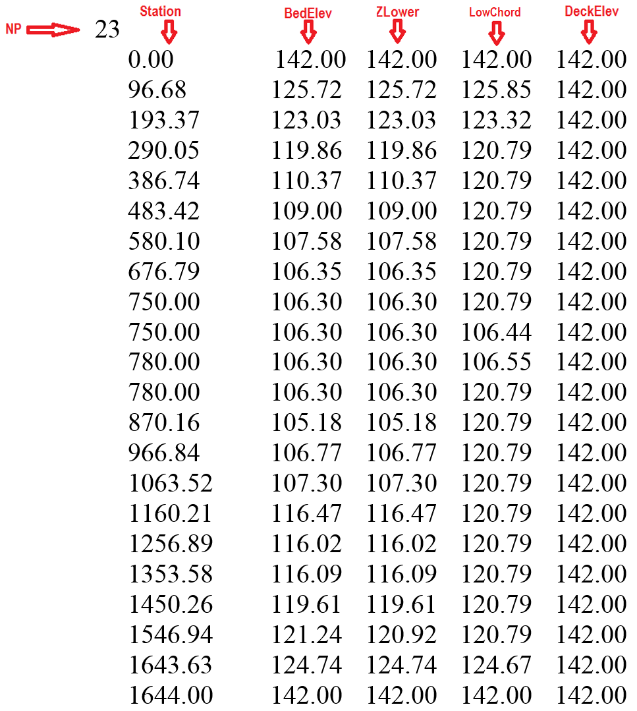{ width=70% }

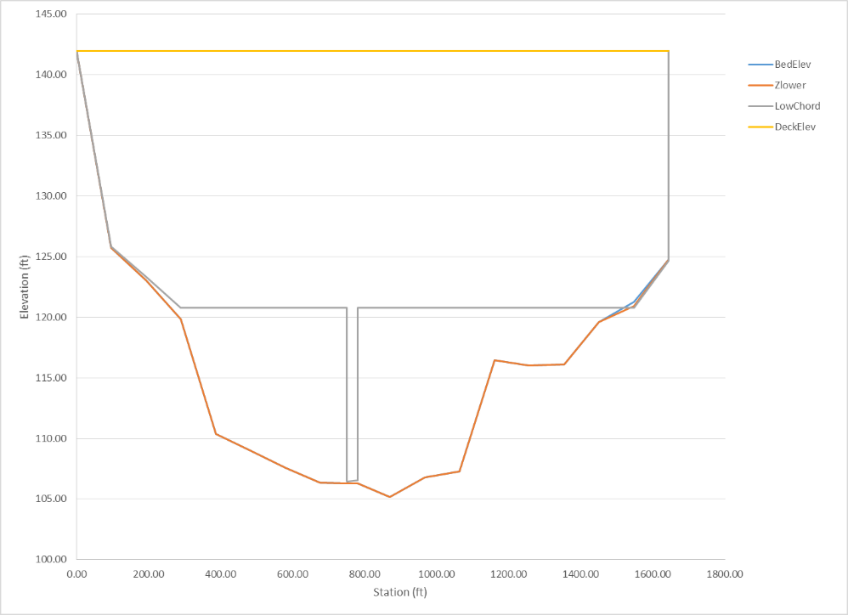{ width=60% }

- **BEDELEV:** R; -; m or ft; Bed elevation. Must be the lowest elevation for all polylines at a given point.
- **DECKELEV:** R; -; m or ft; Elevation of the bridge deck. Must be the highest elevation for all polylines at a given point.
- **NP:** I; -; $>1$; Number of points defining cross section polylines.
- **STATION:** R; -; m or ft; Distance from leftmost point defining cross section polyline. All polylines points must have a common station.
- **ZLOWER:** R; -; m or ft; Elevation of lower polyline. ZLOWER must be larger or equal to BEDELEV and smaller or equal to LOWCHORD for a given point. The space between BEDELEV and ZLOWER is a blocked area to the flow. The space between ZLOWER and LOWCHORD is open space. If the bridge has no holes, ZLOWER must be identical to BEDELEV.
- **LOWCHORD:** R; -; m or ft; Elevation of the lower bridge deck. LOWCHORD must be larger or equal to ZLOWER and smaller or equal to DECKELEV for a particular point. The space between LOWCHORD and DECELEV is a blocked area to the flow.

## Culverts Data File: .CULVERTS 

The culvert component allows accounting for hydraulic structures that convey flow between two locations. The discharge between the structure inflow and outflow ends will be computed based on a user provided hydraulic structure rating table. The model will determine the flow direction based on the hydraulic conditions on the structure ends.\
Line 1: Culvert file version number.\
**CULFILEVER**\
Line 2: Number of culverts.\
**NCULVERTS**\
FOR EACH CULVERT (NCULVERTS):

IF (CULFILEVER = 202208)

**CulvertID**

**CulvertType**

IF (CulvertType is 0, 1, 2, -3, -4, -5)

**CulvertFile**

**X1 Y1 X2 Y2**

ELSE IF (CulvertType is 11, 12, -14, -15)

**CulvertFile**

**NcellsUPS cellID_L_1 cellID_L_2 \... cellID_L_NcellsUPS**

**NcellsDNS cellID_R_1 cellID_R_2 \... cellID_R_NcellsDNS**

ENDIF (CulvertType)

ELSE

  **CulvertID**

  **CulvertType**

  **CulvertFile**

  **X1 Y1 X2 Y2**

ENDIF (CULFILEVER)

END (NCULVERTS)

### Example of a .CULVERTS file

    202208
    2 
    CulvertA 
    2 
    CulvertA.TXT 
    799550.846 309455.307 799363.544 309031.842 
    CulvertB 
    1 
    CulvertB.TXT 
    798858.644 309313.609 799153.441 309004.154 

- **CULFILEVER:** I; -; -; Culvert file version number. Current version is 202208.
- **CulvertFile:** S; $<26$; -; Culvert rating table or culvert characteristic file name. See next section for details about the culvert characteristic file. Should not contain spaces and must have less than 26 characters.
- **CulvertID:** S; $<26$; -; Culvert name. Should not contain spaces and must have less than 26 characters.
- **CulvertType:** I; 0, 1, 2, 11, 12,-3,-4,-5,-14,-15; -; Culvert type. See comments 1 and 2.
- **NCULVERTS:** I; $>0$; -; Number of culverts.
- **NcellsUPS:** I; $>0$; -; Number of upstream exchange cells.
- **NcellsDNS:** I; $>0$; -; Number of downstream exchange cells.
- **X1 Y1 X2 Y2:** R; -; m or ft; Vertex coordinates defining each culvert line.

### Culvert Depth-Discharge Rating table Data Files for CulvertType=0

This format applies to the culvert depth vs. discharge rating table.\
Line 1: Number points in data series\
**NDATA**\
NDATA lines containing depth and discharge.\
**DEPTH(I) Q(I)**\
Where DEPTH(I) is depth corresponding to discharge Q(I).\
**INVERT_Z1**\
**INVERT_Z2**\
Where INVERT_Z1 and INVERT_Z2 are the invert elevations for the inlet and outlet respectively.

#### Example of the Culvert Depth-Discharge Rating Table File

The following example shows a depth-discharge rating table for a culvert. NDATA is 7 and there are 7 lines with pairs of depth and corresponding discharge:

    7
    0 0.20
    0.1 1.00
    1.00 36.09
    2.00 60.00
    3.00 84.78
    4.00 110.01
    100.00 110.02
    5.0
    1.0

- **NDATA:** I; $>0$; -; Number of lines in data file.
- **INVERT_Z1:** R; $>0$; m or ft; Inlet invert elevation. If INVERT_Z1 = -9999, the model makes INVERT_Z1 equal to the average bed elevation of the inlet cekk.
- **INVERT_Z2:** R; $>0$; m or ft; Outlet invert elevation. If INVERT_Z2 = -9999, the model makes INVERT_Z2 equal to the average bed elevation of the inlet cell.
- **DEPTH:** R; $>0$; m or ft; Water depth.
- **Q:** R; $>0$; m$^{3}$/s or ft$^{3}$/s; Water discharge.

### Culvert Characteristic Data Files for CulvertType = 1, 2

The culvert characteristic data has the following structure:\
**Nb**\
**Ke**\
**nc**\
**Kp**\
**M**\
**Cp**\
**Y**\
**m**\
If CulvertType=1\
**Hb**\
**Base**\
Else if CulvertType=2\
**Dc**\
**INVERT_Z1**\
**INVERT_Z2**

### Example of the culvert characteristic data file

    202208
     1
     0.5
     0.012
     1
     1
     1.1
     0.6
    -0.5
     0.10
     5.0
     1.0

This example culvert characteristics data file indicates that the culvert one barrel (Nb =1), Ke=0.4, nc=0.012, Kp=1, cp =1, M =1.1, Y=0.6, m=-0.5, and Dc=0.10, INVERT_Z1=5.0 and INVERT_Z2 = 1.0.

- **Nb:** I; -; -; Number of identical barrels. The computed discharge for a culvert is multiplied by Nb to obtain the total culvert discharge.
- **Ke:** R; 0-1; -; Entrance Loss Coefficient given in Table .
- **nc:** R; 0.01-0.1; -; Culvert Manning's n Coefficient given in Table .
- **K':** R; 0.1-2.0; -; Inlet Control Coefficient given in Table .
- **M:** R; 0.6-2.0; -; Inlet Control Coefficient given in Table .
- **c':** R; 0.6-2.0; -; Inlet Control Coefficient given in Table .
- **Y:** R; 0.5-1.0; -; Inlet Control Coefficient given in Table .
- **m:** R; 0.7,-0.5; -; Inlet form coefficient. m=0.7 for mitered inlets, m=-0.5 for all other inlets.
- **Hb:** R; $>0$; m or ft; Barrel Height for box culverts. Only for CulvertType = 1.
- **Base:** R; $>0$; m or ft; Barrel Width for box culverts. Only for CulvertType = 1.
- **Dc:** R; $>0$; m or ft; Diameter for circular culverts. Only for CulvertType = 2.
- **INVERT_Z1:** R; $>0$; m or ft; Inlet invert elevation. If INVERT_Z1 = -9999, the model makes INVERT_Z1 equal to the average bed elevation of the inlet.
- **INVERT_Z2:** R; $>0$; m or ft; Outlet invert elevation. If INVERT_Z2 = -9999, the model makes INVERT_Z1 equal to the average bed elevation of the inlet cell.

- **Good joints, smooth walls:** 0.012
- **Projecting from fill, square-cut end:** 0.015
- **Poor joints, rough walls:** 0.017
- **2-2/3 inch $\times$ 1/2 inch corrugations:** 0.025
- **6 inch $\times$ 1 inch corrugations:** 0.024
- **5 inch $\times$ 1 inch corrugations:** 0.026
- **3 inch $\times$ 1 inch corrugations:** 0.028
- **6 inch $\times$ 2 inch corrugations:** 0.034
- **9 inch $\times$ 2 1/2 inch corrugations:** 0.035

- **Projecting from fill, grooved end:** 0.2
- **Projecting from fill, square-cut end:** 0.5
- Headwall or headwall with wingwalls (concrete or cement sandbags)
- **Grooved pipe end:** 0.2
- **Square-cut pipe end:** 0.1
- **Rounded pipe end:** 0.7
- **Without grate:** 0.5
- **With grate:** 0.7
- **Corrugated metal pipe:** Projecting from embankment (no headwall); 0.9
- **Headwall with or without wingwalls (concrete or cement sandbags):** 0.5
- **Mitered end that conforms to embankment slope:** 0.7
- Manufactured end section of metal or concrete that conforms to embankment slope
- **Without grate:** 0.5
- **With grate:** 0.7
- Headwall parallel to embankment (no wingwalls)
- **Square-edged on three sides:** 0.5
- **Rounded on three sides to radius of 1/12 of barrel dimension:** 0.2
- Wingwalls at $30^{\circ}$ to $75^{\circ}$ to barrel
- **Square-edged at crown:** 0.4
- **Crown edge rounded to radius of 1/12 of barrel dimension:** 0.2
- Wingwalls at $10^{\circ}$ to $30^{\circ}$ to barrel
- **Square-edged at crown:** 0.5
- Wingwalls parallel to embankment
- **Square-edged at crown:** 0.7

- **Concrete:** Circular; Headwall; square edge; 0.3153; 2.0000; 1.2804; 0.6700
- **Concrete:** Circular; Headwall; grooved edge; 0.2509; 2.0000; 0.9394; 0.7400
- **Concrete:** Circular; Projecting; grooved edge; 0.1448; 2.0000; 1.0198; 0.6900
- **Cor. metal:** Circular; Headwall; 0.2509; 2.0000; 1.2192; 0.6900
- **Cor. metal:** Circular; Mitered to slope; 0.2112; 1.3300; 1.4895; 0.7500
- **Cor. metal:** Circular; Projecting; 0.4593; 1.5000; 1.7790; 0.5400
- **Concrete:** Circular; Beveled ring; 45$^{\circ}$ bevels; 0.1379; 2.5000; 0.9651; 0.7400
- **Concrete:** Circular; Beveled ring; 33.7$^{\circ}$ bevels; 0.1379; 2.5000; 0.7817; 0.8300
- **Concrete:** Rectangular; Wingwalls; 30$^{\circ}$ to 75$^{\circ}$ flares; square edge; 0.1475; 1.0000; 1.2385; 0.8100
- **Concrete:** Rectangular; Wingwalls; 90$^{\circ}$ and 15$^{\circ}$ flares; square edge; 0.2242; 0.7500; 1.2868; 0.8000
- **Concrete:** Rectangular; Wingwalls; 0$^{\circ}$ flares ;square edge; 0.2242; 0.7500; 1.3608; 0.8200
- **Concrete:** Rectangular; Wingwalls; 45$^{\circ}$ flare; beveled edge; 1.6230; 0.6670; 0.9941; 0.8000
- **Concrete:** Rectangular; Wingwalls; 18$^{\circ}$ to 33.7$^{\circ}$ flare; beveled edge; 1.5466; 0.6670; 0.8010; 0.8300
- **Concrete:** Rectangular; Headwall; 3/4 inch chamfers; 1.6389; 0.6670; 1.2064; 0.7900
- **Concrete:** Rectangular; Headwall; 45$^{\circ}$ bevels; 1.5752; 0.6670; 1.0101; 0.8200
- **Concrete:** Rectangular; Headwall; 33.7$^{\circ}$ bevels; 1.5466; 0.6670; 0.8107; 0.8650
- **Concrete:** Rectangular; Headwall; 45$^{\circ}$ skew; 3/4 in chamfers; 1.6611; 0.6670; 1.2932; 0.7300
- **Concrete:** Rectangular; Headwall; 30$^{\circ}$ skew; 3/4 in chamfers; 1.6961; 0.6670; 1.3672; 0.7050
- **Concrete:** Rectangular; Headwall; 15$^{\circ}$ skew; 3/4 in chamfers; 1.7343; 0.6670; 1.4493; 0.6800
- **Concrete:** Rectangular; Headwall;10-45$^{\circ}$ skew; 45$^{\circ}$ bevels; 1.5848; 0.6670; 1.0520; 0.7500
- **Concrete:** Rectangular; Wingwalls; non-offset 45$^{\circ}$/flares; 1.5816; 0.6670; 1.0906; 0.8030
- **Concrete:** Rectangular; Wingwalls; non-offset 18.4$^{\circ}$/flares; 3/4 in chamfers; 1.5689; 0.6670; 1.1613; 0.8060
- **Concrete:** Rectangular; Wingwalls; non-offset 18.4$^{\circ}$/flares; 30$^{\circ}$/skewed barrel; 1.5752 0.6670; 1.2418; 0.7100
- **Concrete:** Rectangular; Wingwalls; offset 45$^{\circ}$/flares; beveled top edge; 1.5816; 0.6670; 0.9715; 0.8350
- **Concrete:** Rectangular; Wingwalls; offset 33.7$^{\circ}$/flares; beveled top edge; 1.5752; 0.6670; 0.8107; 0.8810
- **Concrete:** Rectangular; Wingwalls; offset 18.4$^{\circ}$/flares; top edge bevel; 1.5689; 0.6670; 0.7303; 0.8870
- **Cor. metal:** Rectangular; Headwall; 0.2670; 2.0000; 1.2192; 0.6900
- **Cor. metal:** Rectangular; Projecting; thick wall; 0.3023; 1.7500; 1.3479; 0.6400
- **Cor. metal:** Rectangular; Projecting; thin wall; 0.4593; 1.5000; 1.5956; 0.5700
- **Concrete:** Circular; Tapered throat; 1.3991; 0.5550; 0.6305; 0.8900
- **Cor. metal:** Circular; Tapered throat; 1.5760; 0.6400; 0.9297; 0.9000
- **Concrete:** Rectangular; Tapered throat; 1.5116; 0.6670; 0.5758; 0.9700
- **Concrete:** Circular; Headwall; square edge; 0.3153; 2.0000; 1.2804; 0.6700
- **Concrete:** Circular; Headwall; grooved edge; 0.2509; 2.0000; 0.9394; 0.7400
- **Concrete:** Circular; Projecting; grooved edge; 0.1448; 2.0000; 1.0198; 0.6900
- **Cor. metal:** Circular; Headwall; 0.2509; 2.0000; 1.2192; 0.6900
- **Cor. metal:** Circular; Mitered to slope; 0.2112; 1.3300; 1.4895; 0.7500
- **Cor. metal:** Circular; Projecting; 0.4593; 1.5000; 1.7790; 0.5400
- **Concrete:** Circular; Beveled ring; 45$^{\circ}$ bevels; 0.1379; 2.5000; 0.9651; 0.7400
- **Concrete:** Circular; Beveled ring; 33.7$^{\circ}$ bevels; 0.1379; 2.5000; 0.7817; 0.8300
- **Concrete:** Rectangular; Wingwalls; 30$^{\circ}$ to75$^{\circ}$ flares; square edge; 0.1475; 1.0000; 1.2385; 0.8100
- **Concrete:** Rectangular; Wingwalls; 90$^{\circ}$ and 15$^{\circ}$ flares; square edge; 0.2242; 0.7500; 1.2868; 0.8000
- **Concrete:** Rectangular; Wingwalls; 0$^{\circ}$ flares; square edge; 0.2242; 0.7500; 1.3608; 0.8200
- **Concrete:** Rectangular; Wingwalls; 45$^{\circ}$ flare; beveled edge; 1.6230; 0.6670; 0.9941; 0.8000
- **Concrete:** Rectangular; Wingwalls; 18$^{\circ}$ to 33.7$^{\circ}$ flare; beveled edge; 1.5466; 0.6670; 0.8010; 0.8300
- **Concrete:** Rectangular; Headwall; 3/4 inch chamfers; 1.6389; 0.6670; 1.2064; 0.7900
- **Concrete:** Rectangular; Headwall; 45$^{\circ}$ bevels; 1.5752; 0.6670; 1.0101; 0.8200

- **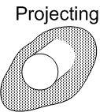{ height=2.0cm }:** End of the culvert barrel projects out of the embankment.
- **{ height=2.0cm }:** Grooved pipe for concrete culverts decreases energy losses through the culvert entrance.
- **{ height=2.0cm }:** This option is for concrete pipe culverts.
- **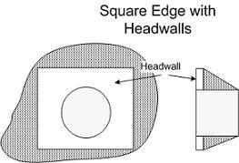{ height=2.0cm }:** Square edge with headwall is an entrance condition where the culvert entrance is flush with the headwall.
- **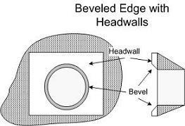{ height=2.0cm }:** 'Beveled edges' is a tapered inlet edge that decreases head loss as flow enters the culvert barrel.
- **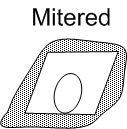{ height=2.0cm }:** Mitered entrance is when the culvert barrel is cut so it is flush with the embankment slope.
- **{ height=2.0cm }:** Wingwalls are used when the culvert is shorter than the embankment and prevents embankment material from falling into the culvert.

### Comments for the .CULVERTS and culvert characteristics files

1. The type of culvert and its flow condition is defined through the CulvertType parameter as follows:

    **CulvertType = 0: \[000\]** Discharge calculated by rating curve (Q vs inlet depth). Only inlet and outlet cells are used for volume exchange.

    **CulvertType = 1: \[001\]** Rectangular/box section culvert. Only inlet and outlet cells are used for volume exchange.

    **CulvertType = 2: \[002\]** Circular section culvert. Only inlet and outlet cells are used for volume exchange.

    **CulvertType = 11: \[011\]** Rectangular/box section culvert. Inlet and outlet cells plus neighboring cells are used for volume exchange.

    **CulvertType = 12: \[012\]** Circular section culvert. Inlet and outlet cells plus neighboring cells are used for volume exchange.

    **CulvertType = -3: \[100\]** Discharge calculated by rating curve (Q vs inlet depth). Only inlet and outlet cells are used for volume exchange. Only flow from (X1,Y1) to (X2,Y2) is allowed.

    **CulvertType = -4: \[101\]** Rectangular/box section culvert. Only inlet and outlet cells are used for volume exchange. Only flow from (X1,Y1) to (X2,Y2) is allowed.

    **CulvertType = -5: \[102\]** Circular section culvert. Only inlet and outlet cells are used for volume exchange. Only flow from (X1,Y1) to (X2,Y2) is allowed.

    **CulvertType = -14: \[111\]** Rectangular/box section culvert. Inlet and outlet cells plus neighboring cells are used for volume exchange. Only flow from (X1,Y1) to (X2,Y2) is allowed.

    **CulvertType = -15: \[112\]** Circular section culvert. Inlet and outlet cells plus neighboring cells are used for volume exchange. Only flow from (X1,Y1) to (X2,Y2) is allowed.

2. For CulvertType 0, culvert discharge is computed using a given rating table on the CulvertFile file.
3. For CulvertType 1, 2, 11, 12, -4, -5, -14, and -15 the model will calculate culvert discharge for inlet and outlet control using the FHWA procedures (Norman et al.,1985) that were later restated in dimensionless form by Froehlich (2003).

## Dam Breach Data File: .DAMBREACH

This component requires the data file that is generated by the QGIS plugin. The file has the following format:\
Line 1: Dam breach file version number.\
**DBFVERSION**\
Line 2: Number of dams.\
**NUMBEROFDAMS**\
Then for each dam it follows NUMBEROFDAMS group of lines with the following data:\
Dam name.\
**DAM_ID**\
Failure mode.\
**DAM_FAILMODE**\
Dam breach center coordinates.\
**X0   Y0**\
Dam breach definition parameters\
**ZC   Angle   CD   t_initial   zb0   d50   tau_c   k_sm   k_d   Gs   Porosity   C   damCrestWidth   UpstreamSlope   DownstreamSlope **\
Dam breach file\
**DAMBREACHFILE**\
Number of cells pairs along the dam alignment.\
**NC**\
**NC** lines containing pairs of cell numbers along dam alignment.\
**CELL_A(1) CELL_B(1)**\
\...\
**CELL_A(NC) CELL_B(NC)**

### Example of a .DAMBREACH file

        202208
        1 
        DAMBREACH1
        1
        5300.0 600.0
        216.3 45.0 0.601 0.0  0.0  0.0  0.0  0.0  0.0  0.0  0.0  0.0  0.0  0.0  0.0
        DambreachFile1.dat
        7
        332 334
        69 335
        67 349
        65 358
        50 360
        41 363
        4 378

- **DBFVERSION:** I; $>0$; --; File version number, e.g. 202208.
- **NUMBEROFDAMS:** I; $>0$; --; Number of dams.
- **DAM_ID:** S; $<26$; --; Bridge ID.

- **DAM_FAILMODE:** I; --; 1, 2, 3; Failure mode:

- Prescribed failure.
- Overtopping Erosion.
- Piping Erosion.

- **X0, Y0:** R; --; \[m or ft\]; Dam-breach center coordinates. These coordinates are calculated by the model using the distance from one of the dam polyline end points given in the QGIS and DIP dialogs.

- **ZC:** R; --; \[m or ft\]; Initial dam crest elevation.
- **Angle:** R; \[5, 90\]; --; Breach side slope angle with respect to the horizontal.
- **CD:** R; --; --; Non-dimensional breach discharge coefficient.
- **T_initial:** R; --; h.; Breach start time
- **Zb0:** R; --; \[m or ft\]; Initial elevation of breach bottom
- **D50:** R; --; \[m or ft\]; Mean dam material diameter.
- **Tau_c:** R; --; \[Pa or lb/in$^2$\]; Critical shear stress.
- **K_sm:** R; --; --; Submergence correction for tailwater effects.
- **Kd:** R; --; \[m$^3$/(N s) or ft$^2$s/lb\]; Erosion coefficient.
- **Gs:** R; --; --; Dam material specific gravity.
- **Porosity:** R; (0,1); -; Dam material porosity given in fractions of 1, e.g. 0.4.
- **C:** R; --; \[Pa or lb/in$^2$\]; Dam material cohesion.
- **DamCrestWidth:** R; --; \[m or ft\]; Dam crest width.
- **UpstreamSlope:** R; \[0-1\]; --; Dam upstream slope.
- **DownstreamSlope:** R; \[0-1\]; --; Dam downstream slope.
- **DAMBREACHFILE:** S; $<26$; --; Used only for the prescribed failure mode (1) but a dummy text should be given always for failure modes 2 and 3. The file contains the time series of the breach width and height opening. File name should contain no black spaces. See details in sections and .
- **NC:** I; $>0$; --; Number of cell pairs along the dam alignment.
- **CELL_A(i) CELL_B(i):** I; --; --; Cell pair along dam alignment.

### Breach time evolution data file for prescribed failure mode

For the prescribed failure model 1, the breach temporal evolution file is necessary to define the width and height of the breach opening for each time. The format is described as follows:\
Line 1: Number of times.\
**NT**\
NT lines with these entries:\
**TIME(1) WIDTH(1) HEIGHT(1)**\
**\...**\
**TIME(NT) WIDTH(NT) HEIGHT(NT)**\

#### Example of the breach time evolution data file (Prescribed Failure Mode only)

        3
        0 1 1 
        0.25    20      25     
        1       20      25   

### Comments for the .DAMBREACH file

These are the breach definition parameters required for each failure mode:

- **Prescribed:** ZC, Angle, and CD.
- **Overtopping erosion:** ZC, Angle, CD, t_initial, zb0, d50, tau_c, k_sm, k_d.
- **Piping erosion:** ZC, Angle, CD, t_initial, zb0, d50, tau_c, k_sm, k_d, Gs, Porosity, C, damCrestWidth, UpstreamSlope, DownstreamSlope.

Note that in the line containing the *Dam breach definition parameters* in the file always have 15 values, even when not all of them are used for the Prescribed and Overtopping modes.

## GATES Data Files: .GATES 

This component requires the data file that is internally generated by the model based on the geometrical representation entered in the OilFlow2D QGIS plugin. The file has the following format:\
Line 1: Number of gates.\
**NUMBEROFGATES**\
NUMBEROFGATES lines containing the data for each gate.\
Gate Id\
**GATES_ID**\
Crest elevation height Cd\
**CRESTELEV GATEHEIGHT Cd**\
Time series of gate aperture\
**GATE_APERTURES_FILE**\
Number of cells pairs along gates alignment\
**NC**\
NUMBEROFCELLS lines containing pairs of cells numbers along gate alignment\
**CELL_A(1) CELL B(1)**\
**\...**\
**CELL_A(NC) CELL B(NC)**

### Example of a .GATES File

    2
    Gate2
    102.00 2.00 1.720
    Gate2.DAT
    5
    3105 29
    3103 79
    3101 87
    3099 137
    3097 141
    Gate1
    111.00 11.00 1.710
    Gate1.DAT
    8
    4099 285
    4097 283
    4033 281
    4031 279
    4029 277
    4027 156
    4026 82
    4024 16

- **Cd:** R; $>0$; -; Non-dimensional discharge coefficient.
- **CRESTELEV:** R; $>0$; -; Gate crest elevation.
- **GATE_APERTURES_FILE:** S; $<26$; -; Gate aperture time series.
- **GATEHEIGHT:** R; $>0$; -; Gate height.
- **GATE_ID:** S; $<26$; -; Gate ID.
- **CELL_A(i) CELL B(i):** I; -; -; Cell numbers of cell pairs along gate alignment.
- **NC:** I; $>0$; -; Name of pier. Should not contain spaces and must have less than 26 characters.
- **NUMBEROFGATES:** I; $>0$; -; Number of cells along the gate alignment.

### Gate Aperture Time Series File

Line 1: Number of points in time series of gate aperture data.\
**NPOINTS**\
NPOINTS lines containing:\
Time and aperture.\
**TIME  H(I)**

### Example of a Gates Aperture Data File

    3
    0 0.0
    2 0.5
    4 1.0

- **NPOINTS:** I; $>1$; -; Number of data points in the gate aperture time series.
- **TIME:** R; $>0$; h.; Time.
- **H(I):** R; -; m or ft; Gate aperture for the corresponding time.

## Internal Rating Table Data File: .IRT 

This data file allows modeling complex hydraulic structures inside the modeling domain. The user would enter polylines coincident with mesh nodes and assign a rating table of discharge vs. water surface elevation to the polyline. In other words, the IRT polylines must connect nodes of the triangular-cell mesh. For each time step, the model will compute the discharge crossing the polyline and find by interpolation the corresponding water surface elevation from the provided rating table. The model will then impose that water surface elevation to all nodes along the polyline. Velocities will be calculated using the standard 2D equations. Therefore, in internal rating table polylines, computed velocities may not necessarily be perpendicular to the IRT polyline.\
The file structure is as follows:\
Line 1: Number of internal rating table polylines.\
**IRT_NPL**\
IRT_NPL line groups containing the IRT polyline ID, the number of vertices defining each polyline, the IRT boundary condition type (always equal to 19 in this version), the Rating Table file name, followed by the list of polyline coordinate vertices as shown:\
**IRT_ID**\
**IRT_NV IRT_BCTYPE IRT_FILENAME**\
**X_IRT(1) Y_IRT(1) **\
**X_IRT(2) Y_IRT(2)**\
**\...**\
**X_IRT(IRT_NV) Y_IRT(IRT_NV)**

### Example of a .IRT file

    2
    IRT_A
    4 19 IRT_A.DAT
    799429.362 308905.287
    799833.895 308354.857
    799986.424 307738.111
    799847.158 307141.259
    IRT_B
    4 19 IRT_B.DAT
    799482.440 309453.678
    799135.525 309118.164
    798914.020 309269.634
    798787.701 309467.583

This file indicates that there are 2 internal rating table polylines, the ID of the first one is IRT_A, which has 4 vertices, BCTYPE 19 and file name.

- **IRT_NPL:** I; $>0$; -; Number of IRT polylines.
- **IRT_NV:** I; $\geq2$; -; Number of points defining each IRT polyline.
- **IRT_ID:** S; $<26$; -; Name of IRT. Should not contain spaces and must have less than 26 characters.
- **IRT_BCTYPE:** I; $19$; -; Boundary condition always equals to 19 in this version corresponding to discharge vs. water surface elevation tables. Future versions will include further options.
- **X_IRT Y_IRT:** R; -; m or ft; Vertex coordinates defining each IRT polyline. See comment 1.
- **IRT_FILENAME:** S; $<26$; -; File name containing internal rating table in the format described as a stage-discharge data file. Should not contain spaces and must have less than 26 characters.

### Comments for the .IRT file

1. IRT polylines should be defined avoiding abrupt direction changes (e.g. 90 degree turns). Polyline alignments as such may create errors in the model algorithm that identifies the nodes that lie over the polyline. Therefore, it is recommended that the IRT follow a more or less smooth path.

## Rainfall And Evaporation Data File: .LRAIN 

Use this file to enter spatially distributed and time varying rainfall and evaporation data. The model assumes that the rainfall and evaporation can vary over the modeling area.\
Line 1: Number of polygons where rainfall time series are defined.\
**NP**

NP group of lines containing hyetograph and evaporation data file for each zone\
**RAINEVFILE(i)**

Number of vertices of polygon i\
**NPZONE(i)**\
List of NPZONE(i) vertex coordinates\
**X(1) Y(1)**\
**\...**\
**X(NPZONE(i)) Y(NPZONE(i))**

#### Example of a .LRAIN file

    2
    hyeto1.TXT
    4
    25.0 25.0
    25.0 75.0
    75.0 75.0
    75.0 25.0
    hyeto2.TXT
    4
    25.0 125.0
    25.0 175.0
    75.0 175.0
    75.0 125.0

In this example, there are two polygons. The rainfall and evaporation data file for the first polygon is and the polygon is defined by four vertices.

- **NPZONE(i):** I; $\geq 1$; -; Number of vertices defining polygon i.
- **NP:** I; -; -; Number of polygons.
- **RAINEVFILE:** S; $\leq$ 26; -; Rainfall intensity. See comment 1.
- **X(i) Y(i):** R; $>0$; m or ft; Vertex coordinates of i polygon.

### Comments for the .LRAIN file

1. The spatial distribution of rainfall and evaporation is given as a number of non-overlapping polygons that would cover or not the mesh area. Zones not covered by any polygons would have no rainfall or evaporation imposed onto the mesh.

#### Hyetograph and Evaporation data file

Line 1: Number of points in time series of rainfall and evaporation.\
**NPRE**\
NPRE lines containing:\
Time Rainfall intensity, Evaporation intensity.\
**TIME RAININT EVAPINT**\

### Example of a Hyetograph and Evaporation data file

    8
    0.0 0.0 0.01
    1.0 1.0 0.02
    3.0 4.0 0.02
    6.0 12.0 0.00
    6.2 7.0 0.00
    7.0 3.0 0.0
    7.1 0.0 0.0
    9.0 0.0 0.0 

- **EVAPINT:** R; $\geq 0$; mm/h or in/h; Evaporation intensity. See comment 1.
- **NPRE:** I; -; -; Number of times in rainfall and evaporation time series.
- **RAININT:** R; $\geq 0$; mm/h or in/h; Rainfall intensity. See comment 1.
- **TIME:** R; $>0$; hours; Time interval

### Comments for the Hyetograph and Evaporation data file

1. To calculate the rainfall/evaporation over the mesh, the model will use rainfall and evaporation intensities given for each time interval. For instance in the example above, for all times between 1 and 3 hours, the rainfall intensity will be equal to 1 mm/h and evaporation intensity equal to 0.02 mm/h. For times between 3 and 6 hours the rainfall intensity will be equal to 1 mm/h and evaporation intensity equal to 0.02 mm/h, and so on for other times.
2. If the user has a file in the project folder, the program will apply the data contained in that file to all cells whose centroid falls outside the polygons given in the *RainEvap* layer, and not covered by any other polygon.

## Infiltration Data File: .LINF 

Use this file to enter spatially distributed infiltration parameters.\
Line 1: Number of zones defined by polygons where infiltration parameters are defined.\
**NIZONES**\
NIZONES group of lines containing:\
Infiltration data file for each zone\
**INFILFILE**\
Number of vertices of polygon i\
**NPZONE(i)**\
List of NPZONE(i) vertex coordinates\
**X(1) Y(1)**\
**\...**\
**X(NPZONE(i)) Y(NPZONE(i))**

### Example of a .LINF file

    2
    inf1.inf
    4
    0.0 0.0
    0.0 200.0
    200.0 200.0
    200.0 0.0
    Inf2.inf
    4
    200.0 200.0
    400.0 200.0
    400.0 0.0
    200.0 0.0

In this example, there are two polygons. The infiltration data file for the first polygon is and the polygon is defined by four vertices.

- **&:** & 7

- **NPZONE(i):** I; $\geq 1$; -; Number of vertices defining zone i.
- **NIZONES:** I; -; -; Number of zones. See Comments 1 and 2.
- **INFILFILE:** S; $\leq$ 26; -; Infiltration parameter file.
- **X(i) Y(i):** R; $>0$; m or ft; Vertex coordinates of the polygon defining Zone i.

### Comments for the .LINF file

1. The spatial distribution of infiltration parameters is given as a number of non-overlapping polygons that would cover or not the mesh area. Zones not covered by any polygons would have no infiltration loss calculated.
2. Each polygon can have a different infiltration method assigned.
3. If the user has a `DefaultInfiltration.DAT` file in the project folder, the program will apply the data contained in that file to the complementary area to the polygons provided.

#### Infiltration parameters data file

Line 1: Model to calculate infiltration.\
**INFILMODEL**\
Line 2: Number of infiltration parameters.\
**NIPARAM**\
If INFILMODEL = 1: Horton method then:\
Line 3: **K** $\bf f_c$ $\bf f_0$\
If INFILMODEL = 2: Green and Ampt method then:\
Line 3: **KH PSI DELTATHETA**\
If INFILMODEL = 3: SCS-CN method then:\
Line 3: **CN POTRETCONST AMC**

### Example of a Infiltration parameter data file

    1
    3
    8.3E-04 3.47E-06 2.22E-5

In this example the infiltration loss method is set to 1 corresponding to the Horton model. There are 3 parameters as follows: K = 8.3E-04, $f_c$ = 3.47E-06 and $f_0$ = 2.22E-5.

- **AMC:** I; $>0$; 1, 2, 3; Antecedent Moisture Content (AMC). Represents the preceding relative moisture of the soil prior to the storm event. Allows accounting for variation of CN for different storm events, or initial soil moisture for a given event using Eqs. and. See possible AMC values in Table .
- **CN:** R; $>0$; -; Curve Number. See USDA (1986) to determine adequate values depending on land cover. Typical values range from 10 for highly permeable soils to 99 for paved impermeable covers.
- **DELTATHETA:** R; $>0$; -; Difference between saturated and initial volumetric moisture content. Default value = 3E-5.
- **$f_c$:** R; \[0,5E-4\]; m/s or ft/s; Final infiltration rate. Default = 2E-5.
- **$f_0$:** R; \[0,5E-4\]; m/s or ft/s; Initial infiltration rate. Default = 7E-5.
- **INFILMODEL:** I; 1,2,3; -; Infiltration method. 1: Horton, 2: Green and Ampt, 3: SCS-CN.
- **K:** I; \[0,30\]; 1/s; Decay coefficient used in Horton method. Default = 1.
- **Kh:** I; $\geq 0$; m/s or ft/s; Hydraulic conductivity used in Green and Ampt method. Default = 0.00001.
- **NIPARAM:** I; 3; -; Number of data parameters depending on the infiltration model selected. Should be set as follows: 3 for Horton of Green and Ampt, and for SCS-CN methods.
- **POTRETCONST:** R; \[0-1\]; -; Potential maximum retention constant. Typically = 0.2.
- **PSI:** R; \[0-1\]; m or in; Wetting front soil suction head. Default = 0.05.

).\

- **Less than 13 mm:** Less than 36 mm
- **2:** 13 mm to 28 mm; 36 mm to 53 mm
- **3:** More than 28 mm; More than 53 mm

## Manning's n Variable with Depth Data File: .MANNN 

This file is created by the OilFlow2D QGIS plugin based on the data you enter in the *ManningsNz* layer. It is used account for spatially distributed Manning's n variable with depth data.\
Line 1: Number of zones defined by polygons where Manning's n variable with depths are defined.\
**NNZONES**\
NRZONES group of lines containing Manning's n variable with depth data file for each zone **MANNNFILE**\
Number of vertices of polygon i\
**NPZONE(i)**\
List of NPZONE(i) vertex coordinates\
**X(1) Y(1)**\
**\...**\
**X(NPZONE(i)) Y(NPZONE(i))**

#### Example of a .MANNN file

        2
        Manning1.TXT
        4
        25.0 25.0
        25.0 75.0
        75.0 75.0
        75.0 25.0
        Manning2.TXT
        4
        25.0 125.0
        25.0 175.0
        75.0 175.0
        75.0 125.0

In this example, there are two polygons. The Manning's n data file for the first polygon is and the polygon is defined by four vertices.

- **NNZONE(i):** I; $\geq 1$; -; Number of vertices defining zone i.
- **NNZONES:** I; -; -; Number of zones.
- **MANNNFILE:** S; $\leq$ 26; -; Manning's n file. See comment 1.
- **X(i) Y(i):** R; $>0$; m or ft; Vertex coordinates of the polygon defining Zone i.

### Comments for the .MANNN file

1. The spatial distribution of Manning's n variable with depth is given as a number of polygons that cover the mesh area. Polygon borders may touch each other or leave a small gap; the model assigns Manning's n data to a cell based on which polygon contains the cell centroid, so exact boundary matching is not required. Zones not covered by any polygon (complementary area) are assigned data from the `DefaultManningsn.DAT` file (see below).
2. When the `.MANNN` file is in use (IMANN=2 in the .DAT run control file), values defined in the regular Manning N layer (the `.MannN2` file) are ignored. The Manning N layer itself does not need to be deleted from the project.

#### Manning's n variable with depth data file

Line 1: Number of points in Manning's n file.\
**NP**\
NP lines containing:\
**DEPTH(i) MANNINGS_N(i)**\

### Example of a Manning's variable with depth data file

        3
        0. 0.1
        0.3 0.1
        1.0 0.03

- **DEPTH(i):** R; $\geq 0$; m or ft; Flow depth. See comment 1.
- **MANNINGS_N(i):** R; $\geq 0$; -; Manning's n corresponding to DEPTH(i). See comment 1.
- **NP:** I; -; -; Number values in file.

### Comments for the Mannign's n variable with depth data file

1. To calculate the Manning's n over the mesh, the model will first identify the polygon over each cell and then will use the interpolated n value for cell depth from the table corresponding to the polygon. In the example above, for all depth between 0.3 and 1, Manning's n will be obtained by linear interpolation between 0.1 and 0.03.
2. The user should provide a `DefaultManningsn.DAT` file in the project folder and the program will apply the data contained in that file to the complementary area to the polygons provided. If the `DefaultManningsn.DAT` does not exist, the model will apply a default value of 0.035 to the areas not covered by Manning's n polygons.

#### Default Manning's n data file: `DefaultManningsn.DAT`

When the `.MANNN` file does not cover the entire mesh, the complementary area is assigned data from a `DefaultManningsn.DAT` file placed in the project folder. The model loads this file automatically. If it is not present, the model applies a default value of 0.035 to the complementary area.

The file format is identical to the inner Manning's n variable with depth data file documented above:

    Line 1: Number of points (NP).
    NP lines: DEPTH(i) MANNINGS_N(i)

### Bridge Piers Drag Forces File: .PIERS 

This option requires the data file that is internally generated by the model based on the geometrical representation entered in the OilFlow2D QGIS plugin. The data file has the following format:\
Line 1: Number of piers.\
**NUMBEROFPIERS**\
NUMBEROFPIERS lines containing the data for each pier.\
**X Y ANGLEX LENGTH WIDTH CD PIERID**\

#### Example of a .PIERS file

        124 
        2042658.82 14214769.48 47.33 19.00 4.00 0.64 P1 
        2042690.52 14214739.87 46.66 19.00 4.00 0.64 P2 
        ...
        2040351.38 14214705.48 0.00 70.00 1.00 0.90 P11 
        2040375.99 14214622.12 0.00 70.00 1.00 0.90 P12 

- **ANGLEX:** R; $0-180$; Deg.; Pier angle with respect to X axis. See comment 1.
- **$C_D$:** R; $0.5-2.5$; -; Non-dimensional drag coefficient of the pier. See comment 2.
- **LENGTH:** R; -; m or ft; Pier length.
- **PIERID:** S; $<26$; -; Name of pier. Should not contain spaces and must have less than 26 characters.
- **WIDTH:** R; -; m or ft; Pier width.
- **X:** R; -; m or ft; X coordinate of pier centroid.
- **Y:** R; -; m or ft; Y coordinate of pier centroid.

lccc

- **Round cylinder:** 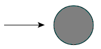{ height=1.2cm } &
- **Square cylinder:** 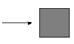{ height=1.2cm } &
- **Square cylinder:** 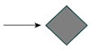{ height=1.2cm } &
- **Square cylinder:** & R/B; $C_D$
- **with:** & 0; 2.2
- **rounded corners:** & 0.02; 2.0
- **& 0.17:** 1.2
- **& 0.33:** 1.0
- **Hexagonal cylinder:** 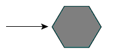{ height=1.2cm } &
- **Hexagonal cylinder:** 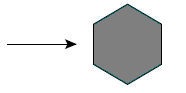{ height=1.2cm } &
- **& L/B:** $C_D$
- **& 1:** 1.0
- **& 2:** 0.7
- **& 4:** 0.68
- **& 6:** 0.64
- **& L/B:** $C_D$
- **& 1:** 2.2
- **& 2:** 1.8
- **& 4:** 1.3
- **& 6:** 0.9

#### Comments for the .PIERS File

1. Angle ANGLEX applies only to piers that are rectangular in plan. For example ANGLEX = 90 corresponds to a pier whose longest axis is perpendicular to the X-axis.
2. The drag coefficient $C_D$ is related to the drag force though the following formula:

    $$F_D=\frac{1}{2}C_D\rho U^2 A_P$$

    where $C_D$ is the pier drag coefficient, $\rho$ is the water density, $U$ is the water velocity, and $A_P$ is the pier wetted area projected normal to the flow direction.

    To account for the drag force that the pier exerts on the flow, OilFlow2D converts it to the distributed shear stress on the cell where the pier centroid coordinate is located. The resulting pier shear stress expressions in x and y directions are as follows:

    $$\tau_{p x}=\frac{1}{2}C_D\rho U\sqrt{U^2+V^2}\left(\frac{A_P}{A_e}\right)$$

    $$\tau_{p y}=\frac{1}{2}C_D\rho V\sqrt{U^2+V^2}\left(\frac{A_P}{A_e}\right)$$

    where $A_e$ is the cell area.

## Bridge Pier and Scour Data File: .SCOUR 

This file stores data required to compute scour around bridge piers and abutments.\
Line 1: Number of piers and abutments.\
**NP**\
**NP** groups of lines containing the following data:\
**Imode**\
**PierID**\
**Icomp**\
**XA, YA**\
**Y1**\
**V1**\
**Fr1**\
**alfa**\
**ishape**\
**L**\
**a**\
**iBedCondition**\
**D50 **\
**D84 **\
**Vcritical**\
**SedimentSpecificDensity**\
**WaterSpecificDensity**\
**FrD**\
**K1**\
**K2**\
**K3**\
**K**\
**theta**\
**ys**\
**W**\
**Wbottom **\
**iAbutmentType**\
**AlfaA**\
**AlfaB**\
**YmaxLB**\
**YmaxCW**\
**YcLB**\
**YcCW1**\
**YcCW2**\
**YsA**\
**q1**\
**q2c**\
**n Manning**\
**Tauc**\
**BridgeXSEC_X1, BridgeXSEC_Y1, BridgeXSEC_X2, BridgeXSEC_Y2**\
**UpstreamXSEC_X1, UpstreamXSEC_Y1, UpstreamXSEC_X2, UpstreamXSEC_Y2**\

### Example of a .SCOUR file

        2
        DrainA
        2
        Drain.TXT
        799019.633 309402.572
        DischargeIn
        1
        Discharge.TXT
        799222.740 309048.493

- **Pier ID:** S; & -; Pier name
- **Icomp:** I; (1, 2, 3, 4); & Computational method
- **XA, YA:** R; -; & Pier coordinates
- **Y1:** R; $>0$; m, ft; Flow depth directly upstream of the pier
- **V1:** R; $>0$; m/s, ft/s; Velocity upstream of the pier
- **Alfa:** R; \[0, 180\]; Degrees; Angle of attack
- **alfaRAD:** R; \[0, Pi\]; Radians; Angle of attack
- **ishape:** I; &; Pier shape
- **L:** R; $>0$; m, ft; Pier length
- **a:** R; $>0$; m, ft; Pier width
- **iBedCondition:** I; &; Bed condition
- **D50:** R; $>0$; m, ft; D50
- **D84:** R; $>0$; m, ft; D84
- **Sediment Specific Density:** R; (0,3); & Ss
- **Water Specific Density:** R; (0,1.2\]; & Sw
- **K1:** R; &; Correction factor for pier nose shape.
- **K2:** R; &; Correction factor for angle of attack of flow
- **K3:** R; &; Correction factor for bed condition
- **K:** R; (0,3); (0,3); bottom width relative to Ys.
- **theta:** R; 20-48$^\circ$; Degrees; angle of repose of the bed material
- **ys:** R; $\ge$ 0; m, ft; Scour depth
- **W:** R; $\ge$ 0; m, ft; scour hole top width
- **Wbottom:** R; $\ge$ 0; m, ft; scour hole bottom width
- **Fr1:** R; $>0$; & Froude Number upstream of pier
- **FrD:** R; $>0$; & Densimetric particle Froude Number
- **SIGMA:** R; $>0$; & Sediment gradation coefficient
- **Vc:** R; $>0$; m/s/, ft/s; Critical velocity for initiation of erosion of the material
- **iAbutmentType:** I; \[1-2\]; -; Abutment Type
- **AlfaA:** R; \[1-2\]; -; Amplification factor for live-bed conditions
- **AlfaB:** R; \[1-2\]; -; Amplification factor for clear-water conditions
- **YmaxLB:** R; $\ge$ 0; m or ft; Maximum flow depth after scour for live-bed conditions
- **YmaxCW:** R; $\ge$ 0; m or ft; Maximum flow depth after scour for clear-water conditions
- **YcLB:** R; $\ge$ 0; m or ft; Depth including live-bed contraction scour
- **YsA:** R; &; Abutment scour depth
- **YcCW1:** R; $\ge$ 0; m or ft; Depth including clear-water contraction scour. Method 1
- **YcCW2:** R; $\ge$ 0; m or ft; Depth including clear-water contraction scour. Method 2
- **q1:** R; $\ge$ 0; m$^2$/s or ft$^2$/s; Upstream unit discharge
- **q2c:** R; $\ge$ 0; m$^2$/s or ft$^2$/s; Upstream unit discharge of the constricted opening
- **n Manning:** R; $\ge$ 0.01; -; Manning's n
- **TauC:** R; $\ge$ 0; Pa or ln/ft$^2$; Critical shear stress
- **GammaW:** R; $\ge$ 0; N/m$^3$ or lb/ft$^3$; Unit weight of water
- **BridgeXSEC_X1, BridgeXSEC_Y1, BridgeXSEC_X2, BridgeXSEC_Y2:** R; -; m of ft; Extreme point coordinates of Bridge Cross Section
- **UpstreamXSEC_X1, UpstreamXSEC_Y1, UpstreamXSEC_X2, UpstreamXSEC_Y2:** R; -; m or ft; Extreme point coordinates of Upstream Cross Section

### Comments for the .SCOUR File

1. The file name is arbitrary but **must not contain blank spaces**. The file format is the same as the *one variable boundary condition* file described in Section.
2. To model inflows use positive discharge values, and to model outflows use negative values.

## Sources and Sinks Data File: .SOURCES 

Use this file to enter data to simulate point inflows or outflows at any location. This feature is typically used when modeling intakes (outflow) or point inflows. The user may provide time varying hydrographs that will be applied to each point.\
Line 1: Number of source and sink points.\
**NSOURCES**\
NSOURCES groups of lines containing source/sink point identification text, name of the file containing the discharge time series or rating table, and the coordinates of the point as follows:\
**SOURCEID**\
**SOURCETYPE**\
**ISFILENAME**\
**X_S(I) Y_S(I)**\
**\...**

### Example of a .SOURCES file

        2
        DrainA
        2
        Drain.TXT
        799019.633 309402.572
        DischargeIn
        1
        Discharge.TXT
        799222.740 309048.493

This file indicates that there are 2 sources/sinks. The first one is named DrainA located at coordinate: X = 799019.633 and Y = 309402.572 and is SOURCETYPE 2, indicating that the data file contains a rating table of depth vs discharge for the drain. The second source is DischargeIN and is type 1 where a hydrograph (time vs discharge) is given in.

- **NSOURCES:** I; $>0$; -; Number of source or sink points.
- **ISFILENAME:** S; -; -; Name of file containing the time series of each point source or sink. Must not contain blank spaces. See comments 1 and 2.
- **SOURCEID:** S; $<26$; -; Name of point source or sink. Should have less than 26 characters and must not contain blank spaces.
- **SOURCETYPE:** I; $1,2$; -; Type of data for the source or sink. If equal to 1, the file should contain a hydrograph. If equal to 2, it contains a rating table with depths vs discharge values.
- **X_S Y_S:** R; -; m or ft; Coordinates of source/sink.

### Comments for the .SOURCES File

1. The file name is arbitrary but must not contain blank spaces. The file format is the same as the *one variable boundary condition* file described in Section.
2. To model inflows use positive discharge values, and to model outflows use negative values.

## Multiple Sources file

This file helps facilitating the input of many inflow sources and is typically used when simulating multiple spills from a pipeline. The file can be read in QGIS using the *Import Multi-sources file* on the Tools OilFlow2D. You can prepare the file in any text editor using the following format.\
Line 1: Number of sources.\
**NSOURCEP**\
NSOURCESP lines containing source/sink point identification text, point X, Y coordinates, and name of the file containing the discharge time series or rating table for each point as follows:\
**SOURCEID** **X_S(I) Y_S(I)** **ISFILENAME**\
**\...**

### Example of a multiple source file

    9 
    Source1 6232789.844 1941100.871 SOURCE_1.txt 
    Source2 6231510.593 1939867.858 SOURCE_2.txt 
    Source3 6230662.896 1938943.098 SOURCE_3.txt 
    Source4 6230154.278 1936954.865 SOURCE_4.txt 
    Source5 6229214.106 1935136.170 SOURCE_5.txt 
    Source6 6227179.634 1933764.443 SOURCE_6.txt 
    Source7 6224158.752 1931853.273 SOURCE_7.txt 
    Source8 6221877.678 1930758.974 SOURCE_8.txt
    Source9 6219519.540 1928847.803 SOURCE_9.txt 

This file indicates that there are 9 sources/sinks. The first one is named Source1 located at coordinate: X = 6232789.844 and Y = 1941100.871 and is the corresponding data file that contains the source discharge vs time series.

- **NSOURCESP:** I; $>0$; -; Number of source or sink points.
- **ISFILENAME:** S; -; -; Name of file containing the time series of each source. Must not contain blank spaces.
- **SOURCEID:** S; $<26$; -; Name of point source or sink. Must not contain blank spaces.
- **X_S Y_S:** R; -; m or ft; Coordinates of source/sink.

Once you have generated the file, you can use the *Import Multi-sources file* tool to populate the *Sources* layer:

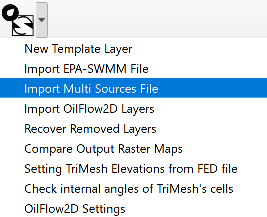{ width=30% }

Then in the Multi-sources dialog, enter the file name, and select to create a new *Sources* layer, or to add the sources to an existing *Sources* layer.

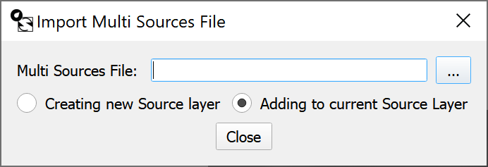{ width=40% }

## Weirs Data Files: .WEIRS and .WEIRP 

These data files allow using weir calculations along user defined polylines representing road or weir overtopping. The user selects the weir coefficient associated with each weir and the model will determine the nodes on each polyline and the discharge across each pair of nodes based on the weir formulae and methods described on Hydraulics of Bridge Waterways FHWA, 1978 (see comment 1). The model allows defining a variable crest elevation along the weir polyline.\
Line 1: Number of weir polylines.\
**NWEIRS**\
NWEIRS group of lines including weir ID, number of vertices defining each weir polyline, the weir coefficient followed by the coordinates each vertex as shown:\
**WEIR_ID**\
**NV CF WRCRESTELEV**\
**X_W(1) Y_W(1) WRCREST(1)**\
**X_W(2) Y_W(2) WRCREST(2)**\
**\...**\
**X_W(NV) Y_W(NV) WRCREST(NV)**

### Example of a .WEIRS file

        4 
        WEIR_1 
        10 0.60 155.000
        6217603.64 1925043.47 155.000
        6217585.08 1925060.22 155.000
        6217566.52 1925076.97 155.000
        6217547.97 1925093.72 155.000
        6217529.41 1925110.47 155.000
        6217510.85 1925127.22 155.000
        6217492.29 1925143.97 155.000
        6217473.73 1925160.72 155.000
        6217455.17 1925177.47 155.000
        6217428.80 1925201.27 155.000
        WEIR_2 
        8 0.60 155.000
        6217496.72 1924525.22 200.000
        6217475.99 1924539.18 200.174
        6217455.25 1924553.15 200.348
        6217434.52 1924567.11 200.522
        6217413.78 1924581.08 200.695
        6217377.46 1924605.54 201.000
        6217353.53 1924612.77 201.229
        6217329.60 1924620.01 201.457

This file indicates that there are 2 weirs. The first one is named WEIR_A and is defined by a polyline with 4 vertices. Weir non-dimensional discharge coefficient is equal to 0.60.

The file is generated by the model based on the file and has a similar structure. They differ in that the , instead of the list of vertices, has the list of triangular cell pairs at each side of the weir.

Line 1: Number of weir polylines.\
**NWEIRS**\
NWEIRS group of lines including weir ID, number of vertices defining each weir polyline, the weir coefficient followed by the coordinates each vertex as shown:\
**WEIR_ID**\
**NC CD WRELEVCELL**\
**CELL_R(1) CELL_L(1) WRCREST(1)**\
**CELL_R(2) CELL_L(2) WRCREST(2)**\
**\...**\
**CELL_R(NC) CELL_L(NC) WRCREST(NC)**

### Example of a .WEIRP file

             4
        WEIR_1 
        0.60 -999
        9
        8409        8851   155.000   
        8636        8677   155.000     
        8618        8705   155.000   
        8613        8703   155.000     
        8647        8602   155.000    
        8571        8841   155.000     
        8727        8809   155.000     
        8826        8824   155.000   
        8828        8731   155.000     
        WEIR_2 
        0.60 -999
        7
        3233        3212   200.087 
        3230        3202   200.261
        3221        3193   200.435  
        3123        3189   200.608     
        3416        3112   200.847    
        3262        3762   201.114     
        3053        2980   201.343  

- **CD:** R; $>0$; -; Non-dimensional weir discharge coefficient. See comment 1.
- **CELL_R(I) CELL_L(I):** I; -; -& Cells at each side of the polyline.
- **NWEIRS:** I; $>0$; -; Number of weir polylines.
- **NC:** I; $\geq 2$; -; Number of cell pairs along each weir polyline.
- **NV:** I; $\geq 2$; -; Number of points defining each weir polyline.
- **WEIR_ID:** S; $<26$; -; Name of weir. Should have less than 26 characters and must not contain blank spaces.
- **WRELEVCELL:** R; -; m of ft; Weir crest elevation for all the weir. If WRCRESTELEVCELL = -999 a weir elevation is provided for each weir polyline vertex.
- **WRCRESTELEV:** R; -; m of ft; Weir crest elevation for all the weir. If WRCRESTELEV = -9999 a weir elevation is provided for each weir polyline vertex.
- **WRCREST(I):** R; -; m of ft; Weir crest elevation for vertex I.
- **X_W(I) Y_W(I):** R; -; m of ft; Vertex coordinates defining each weir polyline. See comment 2.

### Comments for the .WEIRS File

1. Weir discharge is computed between pairs of nodes along the polyline based on the following formula:

    $$Q = C_d {2 \over 3} \sqrt{2 g} L H^{3/2}$$

    where $L$ is the distance between nodes, $H$ is the total head upstream of the polyline segment and $C_d$ is the non dimensional discharge coefficient that takes values between 0.611 and 1.1. The model checks for submergence and it occurs $C_d$ will be corrected according to the correction factor defined by (FHWA, 2001).

2. Weir polylines should be defined avoiding abrupt direction changes (e.g. $\geq$ 90 degree turns), because such angles may create errors in the algorithm that identifies the nodes that lie over the polyline.

## Wind Data File: .WIND 

Use this file to enter spatially distributed and time varying wind velocity data. The model assumes that the wind velocity can vary over the modeling area. The user should provide a set of polygons and a time series of velocities for each polygon.\
Line 1: Number of zones defined by polygons where wind velocity time series are defined.\
**NWZONES**\
Line 2: Wind stress coefficient.\
**CD**\
Line 3: Air density.\
**AIRDENSITY**\
NWZONES group of lines containing hyetograph and evaporation data file for each zone.\
**WINDFILE**\
Number of vertices of polygon i.\
**NPZONE(i)**\
List of NPZONE(i) vertex coordinates.\
**X(1) Y(1)**\
**\...**\
**X(NPZONE(i)) Y(NPZONE(i))**\

### Example of a file

    2
    0.009
    1.225
    Wind1.TXT
    4
    25.0 25.0
    25.0 75.0
    75.0 75.0
    75.0 25.0
    Wind2.TXT
    4
    25.0 125.0
    25.0 175.0
    75.0 175.0
    75.0 125.0

In this example, there are two polygons. The $C_d$ coefficient is set to 0.009 and the wind density to 1.225 kg/m$^{3}$. The wind velocity file for the first polygon is and the polygon is defined by four vertices.

- **AIRDENSITY:** R; $\geq 0$; -; Air density. Always given in metric units. Default = 1.225.
- **CD:** R; $\geq 0$; -; Wind stress coefficient. Always given in metric units. Default = 0.001. See comments for guidance to compute CD.
- **NPZONE(i):** I; $\geq 1$; -; Number of vertices defining zone i.
- **NWZONES:** I; -; -; Number of zones.
- **WINDFILE:** S; $\leq$ 26; -; Wind velocity vector time series file. See Comment 1.
- **X(I) Y(I):** R; $>0$; m or ft; Vertex coordinates of the polygon defining Zone i.

### Comments for the File

1. The spatial distribution of wind is given as a number of non-overlapping polygons that would cover or not the mesh area. Zones not covered by any polygons will be considered as having no wind stress.
2. If the user has a `DefaultWind.DAT` file in the project folder, the program will apply the data contained in that file to the complementary area to the polygons provided.
3. The following formula was proposed by Garrat (1971) to compute CD: CD = $(0.75 + 0.067W) 10^{-3}$, where $W$ is the wind velocity in m/s.

### Wind Velocity Data File

Line 1: Number of points in time series of wind velocity data.\
**NPOINTS**\
NPOINTS lines containing:\
Time Wind velocity component in X and Y directions.\
**TIME UX UY**

### Example of a Wind Velocity and Data File

    3
    0. 0.0 0.0
    24 4.0 -3.0
    48 4.0 -3.0

- **NPOINTS:** I; $>1$; -; Number of data points in the wind velocity time series.
- **TIME:** R; $>0$; h; Time.
- **UX(I) UY(I):** R; -; m/s or ft/s; Wind velocity components in x and y directions.

## Oil Containment Booms Data File: .BOOMS 

This data file contains the data to implement oil containment booms in the OilFlow2D model.

They are represented entering polylines in the *SpillBooms* layer. The user can select the boom type, and skirt height.\
Line 1: Number of boom polylines.\
**NBOOMS**\
NBOOMS group of lines including weir ID, number of vertices defining each boom polyline, the boom type, skirt height, and fraction loss, followed by the coordinates each vertex as shown:\
**BOOM_ID**\
**BOOM_TYPE**\
**FUTURE_USE**   **TRAPPING_FRACTION**  **TUG_VEL_U**  **TUG_VEL_V**  **0.0**  **0.0**  **0.0**  **0.0**  **0.0**  **0.0**\
**NV**\
**X_B(1) Y_B(1) **\
**X_B(2) Y_B(2) **\
**\...**\
**X_B(NV) Y_B(NV) **

### Example of a .BOOMS file

        2
        BOOM_1
        1
        1.0  0.9  0.0   0.0   0.0   0.0   0.0   0.0   0.0   0.0
        5
        4
        799429.362 308905.287 200.
        799833.895 308354.857 201.
        799986.424 307738.111 202.
        799847.158 307141.259 203.
        BOOM_1
        2 
        1.0 0.5  0.0   0.0   0.0   0.0   0.0   0.0   0.0   0.0
        5
        4
        799482.440 309453.678 203.5
        799135.525 309118.164 204.0
        798914.020 309269.634 204.9
        798787.701 309467.583 205.0

This file indicates that there are 2 booms. The first one is named BOOM_1, it is Type 1 ) and is defined by a polyline with 4 vertices.

- **BOOM_TYPE:** I; $[1,4]$ DEFAULT 1; -; Boom type defined as follows

- Curtain
- Fence
- Sorbent
- Bubble barrier

- **TRAPPING_FRACTION:** R; $>0$ DEFAULT 0.0; -; Oil fraction retained by boom with respect of the oil captured.
- **NBOOMS:** I; $>0$; -; Number of boom polylines.
- **NV:** I; $\geq 2$; -; Number of points defining each boom polyline.
- **BOOM_ID:** S; $<26$; -; Boom's name. Should have less than 26 characters and must not contain blank spaces.
- **SKIRT_HEIGHT:** R; - DEFAULT 0& $m$ or $ft$; Boom skirt height
- **TUG_VEL_U& R:** - DEFAULT 0; $m/s$ or $ft/s$; Tug velocity component in x direction.
- **TUG_VEL_V& R:** - DEFAULT 0; $m/s$ or $ft/s$; Tug velocity component in x direction.
- **X_B(I) Y_B(I):** R; -; $m$ or $ft$; Vertex coordinates defining each boom polyline.

## Oil on Land Model File: .OILP 

This section applies to the OilFlow2D model. The file provides the parameters necessary to model flow of viscous fluids including oil over complex terrain using the OilFlow2D model and considers the heat transfer between the flowing oil with the surroundings and the dependence of oil properties with temperature.\
Line 1: OILP file version number.\
**OL_FILEVERSION**\
Line 2: Flow resistance relation.\
**OL_FRR**\
Line 3: Yield stress.\
**OL_YS**\
Line 4: Fluid viscosity.\
**OL_VIS**\
Line 5: Internal friction angle. Not used in this release.\
**OL_THETA**\
Line 6: Oil density.\
**OL_DENS**\
Line 7: Temperature time series file.\
**OL_TEMPTSERIES**\
Line 8: Temperature - Viscosity - Density table file.\
**OL_TEMPVISCDENS**\
Line 9: Evaporation option.\
**OL_EVAPOPTION**\
Line 10: Evaporation calculation coefficients.\
**OL_C1** **OL_C2**\
Line 11: Wind velocity.\
**OL_WINDVEL**\
Line 12: Heat transfer option switch.\
**OL_HTOPTION**\
Line 13: Density formulation.\
**OL_DENSFOR**\
Line 14: Density formulation parameters.\
**RHO0**  **T0**  **Lambda**  **OL_DENSPAR4** \... **OL_DENSPAR10**\
Line 15: Density formulation file.\
**OL_DENSFILENAME**\
Line 16: Viscosity formulation.\
**OL_VISCFOR**\
Line 17: Viscosity formulation parameters.\
**Av**  **Bv**  **OL_VISCPAR3** \... **OL_VISCPAR10**\
Line 18:: Viscosity formulation file.\
**OL_VISCFILENAME**\
Line 19: Yield stress formulation.\
**OL_YSFOR**\
Line 20: Yield stress formulation parameters.\
**Ays**  **Bys**  **Cys**  **OL_YS** \... **OL_YS**\
Line 21: Yield stress formulation file.\
**OL_YSFILENAME**\
Line 22: Heat transfer parameters.\
**INI_T_OPTION**  **INI_T**  **Hr**  **T_AIR**  **Q_RAD**  **Cp**  **OL_MAXTEMP**  **OL_HT8** \... **OL_HT10**\
Line 23: Environmental Parameters file.\
**OL_ENVFILENAME**\
Line 24: Environmental Parameter Options.\
**OL_ENVOPTIONS**\
Line 25: Switch for wet boundary cells.\
**OL_WETBOUNDARY**\
Line 26: Switch for water lower layer.\
**OL_WATERLAYER**\
Line 27: Water density and friction coefficient.\
**OL_WATERRHO**  **OL_CD**\
Line 28: Path to the water hydrodynamic .textout files.\
**OL_WATERPATH**\
Line 29: Total number of .textout files.\
**OL_NFTEXOUR**\
Line 30: Time interval of textout files.\
**OL_TEXTOUTDT**\
Line 31: Oil retention switch and retention depth.\
**OL_RETOPT** **OL_HRETENTION**\

### Example of a .OILP file

        202405
        3
        1.
        0.00899
        1
        2200.
        Temptseries.TXT
        Tempviscdensetable.TXT
        1
        0.018 10
        2.25
        1
        1
        0.1 0.2 0.3 0.4 0. 0. 0. 0. 0. 0.
        densityfile.txt
        1
        0.11 0.12 0.13 0.14 0. 0. 0. 0. 0. 0.
        Viscosityfile.txt
        1
        -0.0196 1.3575 -20.454 0. 0. 0. 0. 0. 0. 0.
        YSfile.txt
        0 30.0 0.3 25.0 300. 1900. 180. 0. 0. 0.
        EnvironmentalParameters.txt
        2
        0
        0
        1000. 10.
        Path
        10
        2.0
        0 0.0

- **Av, Bv:** R; $-$; -; Regression constants for the Andrade viscosity formula $\mu = e^{\left[ Av + (Bv/T)\right]}$ applied when OL_VISCFOR = 1.
- **Ays, Bys, Cys:** R; $-$; -; Regression constants in Yield Stress formula $Ys = 10^{(Ays T^2+ Bys T- Cys)}$ when OL_YSFOR = 1.
- **Lambda ($\Lambda_\rho$):** R; $>0$; -; Temperature gradient in the Arafin et al. formula $\rho(T) =\rho_0 + \Lambda_\rho (T-T_0)$ when OL_DENSFOR = 1.
- **Cp:** R; $>0$; J/kg$^{\circ}$C or BTU/lb$^{\circ}$F; Heat Capacity or Specific Heat. If Q_RAD is set to -1, the model will use the Cp read from the Environmental parameters file indicated in line 22.
- **Hr:** R; $[0,1]$; -; Relative humidity given as a fraction of 1.
- **INI_T:** R; $>0$; $^{\circ}$C or $^{\circ}$F; Constant initial temperature (if INI_T_OPTION=1).
- **INI_T_OPTION:** I; $0,1$; -; Switch to choose between constant temperature distribution (0) or spatially distributed temperature (1) read from .tinitial file.
- **OL_C1, OL_C2:** R; $>0$; -; Evaporation calculation coefficients used to calculate viscosity and density according to equations and. Use OL_C1 = 0.018 and OL_C2 = 10.
- **OL_DENS:** R; $>0$; kg/m$^{3}$ or lb/ft$^{3}$; Fluid density that will be used in the basic model if the lines corresponding to the Temperature-viscosity-density-table file and temperature data file are not provided.
- **OL_DENSFILENAME:** S; -; -; Density formulation file. Will be used in future updates for the interpolation option, and contains a table of temperature vs density.
- **OL_DENSFOR:** I; 1,2,3; -; Density formulation used in the Heat Transfer model.

- Arafin et al. 2006. formulation: $\rho(T) =\rho_0 + \Lambda_p (T-T_0)$, with $\rho_0$ in kg/m$^3$ or lb/ft$^3$, T$_0$ in $^\circ$C or $^\circ$F, and $\Lambda_p$ in kg/m$^3$$^\circ$C or lb/ft$^3$$^\circ$F.
- Arafin density formulation for density. The model does not incorporate density variable in the equations.
- Density is set by interpolation from the given table in OL_DENSFILENAME. In this case the model does not incorporate the variable density in the equations, since it is given by the table values for a given temperature.

- **OL_DENSPAR4..10:** R; -; -; Density formulation parameters that will be added in future updates for alternative formulas.
- **OL_ENVFILENAME:** S; -; -; Environmental parameters data file. See the detailed description below. The model will use the data in this file, always that there OL_ENVFILENAME is present in the project folder.
- **OL_EVAPOPTION:** R; 0, 1, 2; -; Evaporation calculation option:

- No evaporation is calculated,
- Evaporation rate is calculated and properties estimated according to given density viscosity table,
- Evaporation rate is calculated and properties calculated by the model using formula.

- **OL_FRR:** I; 3; -; Flow resistance relation. (see Table )
- **OL_HTOPTION:** I; 0, 1; -; Basic model vs Heat transfer model switch:

- Basic model. No heat transfer is calculated,
- Heat transfer model.

- **OL_HT8..10:** R; -; -; Heat transfer parameters that will be added in future updates.
- **OL_MAXTEMP:** R; $>0$; $^{\circ}$C or $^{\circ}$F; Maximum oil temperature allowed.
- **OL_RETOPT:** I; 0,1; -; Surface retention switch. Oil retention by the soil will be disabled when this switch is set to 0, and if set to 1, the oil will be retained by the terrain up to the depth indicated by OL_RETOPT.
- **OL_HRETENTION:** R; $>=0$; -; Surface retention depth applicable to all cells. It is the $h_{\hbox{retention}}$ variable in equation. The model can consider spatially variable oil retention if the .deteninitial file exits in the scenario folder. Note that OL_HRETENTION should be in the order of millimeters since the model assumes that velocity is 0 for all oil depth below its value. See the .deteninitial file format below.
- **OL_TEMPTSERIES:** S; $\leq26$; -; Temperature time series file used in the basic model.
- **OL_TEMPVISCDENS:** S; $\leq26$; -; Temperature-viscosity-density table file. The basic model will use the temperature for a given time to interpolate the viscosity and density.
- **OL_THETA:** R; $>0$; Degrees; Not used in this release.
- **OL_VIS:** I; $>0$; Pa-s or lb-s/in$^{2}$; Fluid viscosity that the basic model will use if the lines corresponding to the Temperature-viscosity-density-table file and temperature data file are not provided.
- **OL_VISCFILENAME:** S; -; -; Viscosity formulation file. Will be used in future updates for the interpolation option, and contains a table of temperature vs viscosity.
- **OL_VISCFOR:** I; 1,2; -; Viscosity formulation used in the Heat Transfer model.

- Andrade (1934) formulation $\mu = e^{\left[ Av + (Bv/T)\right]}$, with $Av$ in Pa-s or lb-s/in$^2$, $Bv$ in Pa-s/$^\circ$C or lb-s/in$^2$$^\circ$F, and $T$ is the oil temperature in $^\circ$K
- Determined by interpolation from table provided in file OL_VISCFILENAME.

- **OL_VISCPAR3..10:** R; -; -; Viscosity formulation parameters that will be added in future updates for alternative formulas.
- **OL_WINDVEL:** R; $\geq0$; m/s or ft/s; Wind velocity assumed constant in time and space used to compute evaporation rate in basic model that does not considers heat transfer. Note that according to formula , if the wind velocity is zero, the evaporation rate is zero as well.
- **OL_YS:** R; $>0$; Pa or lb/in$^{2}$; Yield stress used in the basic model.
- **OL_YSFILENAME:** S; -; -; Yield stress formulation file. Contains a table of temperature vs Yield stress.
- **OL_YSFOR:** I; 1,2; -; Yield stress in Pa or lb/in$^{2}$ formulation.

- Formulation 1: $Ys = 10^{Ays T^2+ Bys T- Cys}$, with $Ays$ in Pa/$^\circ$C$^2$ or lb/in$^2$$^\circ$F$^2$, $Bys$ in Pa/$^\circ$C or lb/in$^2$$^\circ$F, and $Cys$ in Pa or lb/in$^2$,
- Determined by interpolation from table provided in file OL_YSFILENAME.

- **OL_ENVOPTIONS:** I; 0,1,2; -; Set the option for using Environmental Parameters.

- The model will not compute heat transfer,
- Use constant environmental parameters as entered on line 21 of the .OILP file,
- Use the parameters defined on the OL_ENVFILENAME file.

- **OL_YSPAR4..10:** R; -; -; Yield stress formulation parameters that will be added in future updates for alternative formulas.
- **Q_RAD:** R; $>0$; W/m$^2$ or BTU/ft$^2$ s; Solar radiation. Constant Q_RAD value used if OL_ENVOPTIONS os set to 1 (Constant).
- **RHO0 ($\rho_0$):** R; $>0$; kg/m$^{3}$ or lb/ft$^{3}$; Reference density in the Arafin et al. formula $\rho(T) =\rho_0 + \Lambda_\rho (T-T_0)$ when OL_DENSFOR = 1.
- **T0 ($T_0$):** R; $-$; $^{\circ}$C or $^{\circ}$F; Reference Temperature in the Arafin et al. formula $\rho(T) =\rho_0 + \Lambda_\rho \cdot (T-T_0)$ when OL_DENSFOR = 1.
- **T_AIR:** R; $-$; $^{\circ}$C or $^{\circ}$F; Air temperature. If Q_RAD is set to -1, the model will use the T_AIR read from the Environmental parameters file indicated in line 22.
- **OL_WETBOUNDARY:** I; $0,1$; -; Switch for wet boundary cells.

- No wet cell options.
- The model will write a file named `wetBcells.out` containing the list boundary cell numbers that are wet during the run.

- **OL_WATERLAYER:** I; $0,1$; -; Switch for water lower layer.

- The model will ignore oil flow over water.
- The model will consider oil flow over underlying water. This requires a previous water hydrodynamic run that determines the water flow (see OL_WATERPATH below)

- **OL_WATERRHO:** R; $>0$; g/m$^{3}$ or lb/ft$^{3}$; Water density.
- **OL_CD:** R; $0.001-0.005$; -; Non-dimensional drag coefficient between oil and water.
- **OL_WATERPATH:** S; $-$; -; Path to hydrodynamics cell_time\_\*.textout files. These files contain the results of an existing water hydrodynamic run.
- **OL_NFTEXOUR:** I; $-$; -; Number hydrodynamic cell_time\_\*.textout files.
- **OL_TEXTOUTD:** R; $-$; h; Time interval between hydrodynamic cell_time\_.textout files.

- **2:** Full Bingham; $\tau_b=\tau_0$ with $f_1\left(\tau_b,\tau_0\right)=0$; Viscosity, yield stress, density.
- **3:** Simplified Bingham; $\tau_b=1.5\tau_y+3\tau_{\mu}$; Viscosity, yield stress, density.

- **7:** Quadratic; $\tau_b=\tau_t+\tau_y+\frac{\kappa}{8}\tau_{\mu}$; Manning's n, viscosity, yield stress, density.

#### Temperature Time Series file

The temperature time series files is only used in the basic model and contains the ambient temperature for each time along the simulation. The first line has the number of lines in the time series, then a list of time in hours vs temperature in degrees Celsius or \^F depending on the unit system used.

The following is an example of a Temperature Time Series file:

        7
        0.0 60
        2.0 65
        4.0 70
        6.0 75
        8.0 77
        10.0 79
        12.0 65

In this example there are 7 entries in the Temperature Time series. For the initial time 0.0 hours the temperature is $60^{\circ}$F, and so on.

### Temperature-Viscosity-Density Table file

This file is only used in the basic model and includes the viscosity and density for different temperatures. The basic model will interpolate from the table values to assign to the oil the viscosity and density for the current temperature.

The following is an example of a Temperature-Viscosity-Density file:

        2
        50 1.38E-06 58.00
        120 6.94E-07 56.00

In this example there are 2 lines in the Temperature-Viscosity-Density table file. For $50^{\circ}$F the viscosity is 1.38$\times 10^{-6}$ lb-s/in$^{2}$ and the density 50 lb/ft$^{3}$.

### Temperature vs Density Time Series file

The temperature time series file is only used in the heat transfer model and contains a table of temperature and corresponding oil density for each time along the simulation. The first line has the number of lines in the time series, then a list of temperature and density. This file is optional and will only be necessary when selecting the interpolation for density option.

The following is an example of a temperature vs density time series file:

        8
        10 1010 
        15 1004
        20 998
        22 995
        25 980
        30 975
        35 970
        40 960

### Temperature vs Viscosity Time Series file

The temperature time series file is only used in the heat transfer model and contains a table of temperature and corresponding oil dynamic viscosity for each time along the simulation. The first line has the number of lines in the time series, then a list of temperature and dynamic viscosity. This file is optional and will only be necessary when selecting the interpolation for viscosity option.

The following is an example of a temperature vs viscosity time series file:

        8
        10 0.10 
        15 0.09
        20 0.07
        22 0.04
        25 0.02
        30 0.009
        35 0.0084
        40 0.007

### Temperature vs Yield Stress Time Series file

The temperature time series file is only used in the heat transfer model and contains a table of temperature and corresponding oil yield stress for each time along the simulation. The first line has the number of lines in the time series, then a list of temperature and yield stress. This file is optional and will only be necessary when selecting the interpolation for yield stress option.

The following is an example of a environmental parameter file:

    9
    0.00 2000.0
    35.00 2000.0
    37.50 1000.0
    40.00 200.0
    42.50 80.0
    45.00 20.0
    47.50 1.0
    50.00 0.020
    100.00 0.020

### Environmental Parameters Time Series file

This file contains environmental parameters that affect the oil heat transfer. The first line contains the number of lines with data. Then each subsequent line includes the time in hours, wind speed (m/s or ft/s), relative humidity (0-1), air temperature ($^\circ$C or$^\circ$F), and solar radiation (W/m$^2$ or BTU/ft$^2$). The model will use the data in this file if the solar radiation entered in line 21 is equal to -1.

The following is an example of a environmental parameter file:

        12 
        1   2.20    0.90    21.90   0.0 
        2   1.71    0.90    21.71   0.0     
        3   1.79    0.93    21.33   0.0 
        4   2.23    0.94    21.13   0.0     
        5   2.58    0.97    20.77   0.0     
        6   4.04    0.99    20.13   0.0     
        7   3.41    1.00    19.54   1.8 
        8   1.93    0.99    19.62   13.5    
        9   1.18    0.96    20.08   74.8    
        10  1.65    0.87    21.64   166.0   
        11  1.49    0.81    22.97   246.7   
        12  1.34    0.71    33.64   368.8

### Oil Retention Depth Data File: .DETENINITIAL 

The purpose of this file is to indicate the oil retention depth (HRet) for each cell so that the model considers spatially varied retention depth.

!!! note

    NOTE: It is important to note that the oil retention depth represents the minimal depth for oil flow. Consequently, the velocity of cells with an oil depth smaller than HRet will be zero. For this reason, the values for HRet should be on the order of millimeters.

The model can create this file based on polygons entered in the OilFlow2D QGIS plugin based on the data in the *Oil Retention* layer. The user can enter polygons and assign a corresponding retention depth file name to each polygon.

The files will contain the list of retention depth, one per line, for all cells.

**HRet(1)**

**HRet(2)**

**\...**

**HRet(NELEM)**

## Oil on Water File: .OILW 

This file only applies to the OilFlow2D model. This file provides the parameters necessary to model oil spill on water using the OilFlow2D model.\
Line 1: **OILW_VersionNumber**

Line 2: **NSpillSites**

Line 3: **\[ControData\]**

Line 4:   **Evaporation Switch**

Line 5:   **Emulsification Switch**

Line 6:   **Shoreline Switch**

Line 7:   **Dispersion Switch**

Line 8:   **Dissolution Switch**

Line 9:   **Sedimentation Switch**

Line 10:   **Simulation Time**

Line 11:   **Output Interval**

Line 12:   **Time Step**

Line 13:   **Wind Velocity File**

Line 14:   **Ambient Temperature File**

Line 15:   **Velocity Field Path**

Line 16:   **Velocity Field .OUTFILES**

Line 17:   **Grid Cell Factor (GCF)**

Line 18:   **Boom Component Switch**

Line 19:   **Wind Velocity Coefficient**

For SpillSite 1 to NSpillSites

  **Spill Site ID**

  **\[Trajectory\]**

  **Water Density**

  **X Y Z **

  **Number of Parcels**

  **Oil Density**

  **Oil Viscosity**

  **Initial Spill Time**

  **Disp_L Disp_T Disp_V**

  **Spill Accumulated Volume File**

  **Moving Spill Switch**

  **Spill Release File**

  **0**

  **0**

  **0**

  **0**

  **0**

  **0**

  **0**

  **0**

  **\[Evaporation\]**

  **Evaporation Method** // 1: Fingas; 2: Stiver-MacKay

  **Oil ID**

  **PD** Fraction by weight distilled at 180oC.

  **Kevp** // Mass transfer coefficient //Stiver-MacKay

  **A** //Stiver-MacKay constant A

  **B** //Stiver-MacKay constant B

  **0** // For future use

  **0** // For future use

  **0** // For future use

  **0** // For future use

  **0** // For future use

  **\[Emulsification\]**

  **Kemul**

  **Yf**

  **0** // For future use

  **0** // For future use

  **0** // For future use

  **0** // For future use

  **0** // For future use

  **\[Dissolution\]**

  **Kdiss**

  **S** // Water solubility

  **So** // Solubility of fresh oil

  **Alfa** // Decay constant

  **0** // For future use

  **0** // For future use

  **0** // For future use

  **0** // For future use

  **0** // For future use

  **\[Dispersion\]**

  **0** // For future use

  **0** // For future use

  **0** // For future use

  **0** // For future use

  **0** // For future use

  **0** // For future use

  **0** // For future use

  **0** // For future use

  **0** // For future use

  **0** // For future use

  **\[Sedimentation\] **

  **0** // For future use

  **0** // For future use

  **0** // For future use

  **0** // For future use

  **0** // For future use

  **0** // For future use

  **0** // For future use

  **0** // For future use

  **0** // For future use

  **0** // For future use

  **\[Shoreline\] **

  **BottomTrapping** // Bottom Trapping option

  **ShoreTrapping** // Shore Trapping option

  **Vegetation trapping switch**

  **Dispersant Application Switch**

  **0** // For future use

  **0** // For future use

  **0** // For future use

  **0** // For future use

  **0** // For future use

  **0** // For future use

End SpillSite

- **Version Number:** I; -; -; Integer number indicating the model version.
- **NSpillSites:** I; $\ge 1$; -; Number of spill sites.
- ****\[CONTROLDATA\]:** &; & Control data group with common to all spill sites.
- **Boom switch:** I; 0,1; -; 0: Booms will not be considered. 1: Booms activated.
- **Evaporation switch:** I; 0,1; -; 0: No evaporation will be calculated. 1: Evaporation will be calculated.
- **Emulsification switch:** I; 0,1; -; 0: No emulsification will be calculated. 1: Emulsification will be calculated.
- **Shoreline switch:** I; 0,1; -; 0: Oil interaction with shores will not be considered. 1: Oil interaction with shores will be considered.
- **Dispersion switch:** I; 0,1; -; 0: No oil dispersion will be calculated. 1: Oil dispersion will be calculated.
- **Dissolution switch:** I; 0,1; -; 0: No dissolution will be considered. 1: Dissolution will be considered.
- **Sedimentation switch:** I; 0,1; -; 0: No oil sedimentation will be calculated. 1: Oil sedimentation will be calculated.
- **Simulation time:** R; $>0$; h.; Total simulation time in hours.
- **Output interval:** R; $>0$; h.; Report output interval in hours.
- **Time step:** R; $>0$; s.; Time step that will be used in the numerical solution of the particle-tracking algorithm.
- **Grid Cell Factor (GCF):** R; $>0$; -; This factor is used to construct a virtual grid over the mesh that is used to optimize the particle location algorithm. The grid size is equal to GCF \* Minimum Cell Size. The program will determine all the mesh cells that lie within each grid element. In this way, the search algorithm will first locate the particle within the grid element and then, to determine in which cell the particle is, it will search only among the cells that are in that grid element, hence reducing the search time. Larger the GCFs means that mode cells will be in each grid element, therefore making the search more inefficient. The default value is 20, which will construct a grid elements 20 times larger than the minimum cell size.
- **Wind velocity file:** S; -; -; Wind velocity file name. See format in section on page .
- **Temperature file:** S; -; -; Ambient temperature file name. See format in section on page .
- **Velocity field path:** S; -; -; Path where the results of the velocity field files are located.
- **Spill site ID:** S; $\le$ 26; -; Name of the spill site.
- ****\[TRAJECTORY\]&:** &; Trajectory data group for each spill site.
****

- **Water density:** R; $\ge 0$; &
- **X Y Z:** R; -; ft. - m.; Spill site coordinates.
- **Nparcels:** I; $>0$; -; Number of parcels or particles representing the spill.
- **Oil density:** R; $>0$; API; Initial oil density of the oil at the time of the spill.
- **Oil viscosity:** R; $>0$; cP - lb-s/ft$^2$; Initial oil viscosity at the time of the spill.
- **Initial Spill Time:** R; $>0$; h.; Initial oil viscosity at the time of the spill.
- **Disp_L:** R; $>0$; ft$^2$/s - m$^2$/s; Longitudinal dispersion coefficient.
- **Disp_T:** R; $>0$; ft$^2$/s - m$^2$/s; Transversal dispersion coefficient.
- **Disp_V:** R; $>0$; ft$^2$/s - m$^2$/s; Vertical dispersion coefficient.
- **Spill Accumulated Volume File:** S &-; c-; Spill volume file. See format in section .
- **SpillReleaseSwitch:** I; 0,1; -; Spill path switch. 0 indicates fixed point spill, 1 indicates that the spill path will be given by the SpillReleaseFile volume file.
- **SpillReleaseFile:** S &-; c-; Spill release path file. See format in section .
- ****\[EVAPORATION\]&:** &; Evaporation data group for each spill site.
**

- **Evaporation Method:** I; 1,2; -; 1: Fingas; 2: Stiver-MacKay.
- **OilID:** I; -; -; Oil ID for Fingas method selected from drop-down list.
- **PD:** R; \[0,1\]; -; Fraction by weight distilled at 180$^o$C.
- **Kevap:** R; $\ge 0$; -; Mass transfer coefficient.
- **A:** R; $\ge 0$; -; Stiver-MacKay constant A.
- **B:** R; $\ge 0$; -; Stiver-MacKay constant B.
- ****\[EMULSIFICATION\]&:** &; Emulsification data group for each spill site.
**

- **Kemul:** R; $\ge 0$; - &
- **Yf:** R; $\ge 0$; - &
- ****\[DISSOLUTION\]&:** &; Dissolution data group for each spill site.
- **Kdiss:** R; $\ge 0$; &
- **S:** R; $\ge 0$; & Water solubility.
- **So:** R; $\ge 0$; & Oil solubility.
- **Alpha:** R; $\ge 0$; & Decay constant.
- ****\[SHORELINE\]&:** &; Shore and bottom interaction data group for each spill site.
- **BottomTrapping:** I; 0,1; -; 0: Particles will not be trapped when they hit the bottom (default). 1: The oil particles will be permanently attached to the bottom as soon as they touch it.
- **Vegetation trapping switch:** I; 0,1; -; 0: Particles will not be trapped by vegetation. 1: The oil particles will be attached to the cells belonging to vegetation polygons.
- **Dispersant Application Switch:** I; 0,1; -; 0: No dispersants will be simulated, 1 indicates that dispersants will be simulated.
****

### Example of a .OILW file

    201910 // version
    1 // NSpillSite
    [ControlData]
    0 // Evaporation Switch
    0 // Emulsification Switch
    0 // Shoreline Switch
    0 // Dispersion Switch
    0 // Dissolution Switch
    0 // Sedimentation Switch
    5 // Simulation Time
    0.1 // Output Interval
    10.0 // Time Step
    Wind.DAT
    Temperature.DAT
    C:/Users/Hydronia Dell/Documents/Magdalena
    base.OUTFILES // Velocity field output files
    100 // Grid Cell Factor
    0 // Boom component deactivated
    0 // Velocity coefficient
    OilSpill_1
    [Trajectory]
    1000.00 // Water Density
    925018.358  1707701.919  0.000  // X Y Z
    1000 // Nparcels
    40.00 // Oil Density
    15.000 // Oil Viscosity
    1.00 // Initial SpillTime
    1.000  1.000  0.001 // Disp_L  Disp_T  Disp_V
    OilSpill_1.txt
    0 // Moving Spill Switch
    0 // Spill Release File
    0
    0
    0 
    0
    0
    0
    0
    0
    [Evaporation]
    1 EvaporationMethod // 1: Fingas; 2: Stiver-MacKay
    1 // Oils
    40.00 PD // percentage (by weight) distilled at 180oC.
    0.0025 // Kevp (mass transfer coefficient) //Stiver-MacKay
    6.30 // A Stiver-MacKay
    10.0 // B Stiver-MacKay
    0 // For future use
    0 // For future use
    0 // For future use
    0 // For future use
    0 // For future use
    [Emulsification]
    0.000002 // Kemul
    0.7 // Yf
    0 // For future use
    0 // For future use
    0 // For future use
    0 // For future use
    0 // For future use
    [Dissolution]
    1.00 // Kdiss
    0.00 // S Water solubility
    0.0184 // So Solubility of fresh oil
    0.423  // Alfa  Decay constant
    0 // For future use
    0 // For future use
    0 // For future use
    0 // For future use
    0 // For future use
    [Dispersion]
    0 // For future use
    0 // For future use
    0 // For future use
    0 // For future use
    0 // For future use
    0 // For future use
    0 // For future use
    0 // For future use
    0 // For future use
    0 // For future use
    [Sedimentation]
    0 // For future use
    0 // For future use 
    0 // For future use
    0 // For future use
    0 // For future use
    0 // For future use
    0 // For future use
    0 // For future use
    0 // For future use
    0 // For future use
    [Shoreline]
    0 // No bottom Trapping 
    1 // Do shore trapping
    0 // Vegetation trapping switch 
    0 // Dispersant Application Switch
    0 // For future use
    0 // For future use
    0 // For future use
    0 // For future use
    0 // For future use
    0 // For future use

### Accumulated Volume Input File

This file specifies the volumes released in the spill for each time. Regardless of the project unit system the volumes should be provided in barrels (bbl). The format is as follows

Line 1: Number of points in the accumulated spill volume time series.\
**NPOINTS**\
NPOINTS lines containing:\
Time and Accumulated Volume.\
**TIME ACCVOL**

### Example of a Accumulated Volume File

        3
        0. 0.
        2. 3000 
        10. 20000

- **NPOINTS:** I; $\ge$ 1; -; Number of data points in time series.
- **TIME:** R; $\ge$ 0; h; Time.
- **ACCVOL:** R; -; bbl; Accumulated spill volume until this time. Note that it is required that the accumulated volume given for one time needs to be always greater or equal to the accumulated volume given for the previous time.

### Spill Release File

This file specifies the path of the spill release. The spill will be released along the path defined in this file. The format is as follows

Line 1: Number of points in the spill release time series.\
**NPOINTS**\
NPOINTS lines containing:\
Time and point coordinate\
**TIME Xp Yp**

### Example of Spill Release File

        5
        0.0  923730.325    1710175.128
        0.5  923408.268    1710245.895
        1.0  923192.219    1710246.443
        1.5  923022.774    1710195.172
        2.0  922888.358    1710131.769

- **NPOINTS:** I; $\ge$ 1; -; Number of data points in time series.
- **TIME:** R; $\ge$ 0; h; Time.
- **Xp:** R; -; ft - m; X coordinate of this spill point.
- **Yp:** R; -; ft - m; Y coordinate of this spill point.

## Pollutant Transport Module Data File: .SOLUTES 

The pollutant transport module calculates concentration of passive or reactive pollutants (solutes) based on advection and dispersion. The required data is included in the data file that has the following format:\
Line 1: Maximum number of pollutants (solutes)\
**NP_MAX**\
Line 2: Number of pollutants used in the run\
**NP_USED**\
Line 3: List of solutes used (all in one line)\
**I(1) I(2) \... I(NP_USED)**\
Line 4: Longitudinal and transversal dispersion coefficients\
**DISPL DISPT**\
Line 5\...: List of names of pollutants (one in each line)\
**NAME_I1**\
**NAME_I1**\
**\...**\
**NAME_NP_MAX**\
Line 6 to NP_MAX+6: First order reaction rate coefficient matrix K(I,J)\
**K(1,1) K(1,2) \... K(1,NP_MAX)**\
**K(2,1) K(2,2) \... K(2,NP_MAX)**\
**\...**\
**K(NP_MAX,1) K(NP_MAX,2) \... K(NP_MAX,NP_MAX)**\

### Example of a .SOLUTES file

    5
    4
    1 2 4 5
    0.1 0.02
    NITRATE
    AMMONIUM
    TEMPERATURE
    CHLORINE
    PHOSPHATE
    0.2 0.0 0.0 0.0 0.0
    0.0 0.1 0.0 0.0 0.0
    0.0 0.0 1.1 0.0 0.0
    0.0 0.0 0.0 0.2 0.0
    0.0 0.0 0.0 0.0 0.5

& There are five pollutants\
- **4:** Four pollutants will be used in this run
1  2  4  5& The active pollutants will be 1, 2, 4 and 5\
- **0.10.02:** Longitudinal dispersion coefficient is 0.1 and transversal = 0.02.
- **NITRATE:** Pollutant No. 1 name is: NITRATE
- **AMMONIUM:** Pollutant No. 2 name is: AMMONIUM
- **TEMPERATURE:** Pollutant No. 3 name is: TEMPERATURE
- **CHLORINE:** Pollutant No. 4 name is: CHLORINE
- **PHOSPHATE:** Pollutant No. 5 name is: PHOSPHATE
- **0.20.00.00.00.0:** First order reaction constant for pollutant No. 1 is 0.2
- **0.00.10.00.00.0:** First order reaction constant for pollutant No. 2 is 0.1
- **0.00.01.10.00.0:** First order reaction constant for pollutant No. 3 is 1.1
- **0.00.00.00.20.0:** First order reaction constant for pollutant No. 4 is 0.2
- **0.00.00.00.00.5:** First order reaction constant for pollutant No. 5 is 0.2

- **DISPL:** R; $>0$; m$^{2}$/s or ft$^{2}$/s; Longitudinal dispersion coefficient.
- **DISPT:** R; $>0$; m$^{2}$/s or ft$^{2}$/s; Transversal dispersion coefficient.
- **K(I,J):** R; -; $s^{-1}$; First-order reaction constants, where K(I,I) is the reaction constant for pollutant I and K(I,J) the reaction constant of pollutant I with pollutant J.
- **NP_MAX:** I; $>0$; -; Maximum number of pollutants.
- **NP_USED:** I; $>0$; -; Number of pollutants used in the present run.

### Pollutant Transport Module Initial Concentration Data File: .CINITIAL 

The initial concentration data file is created when the dataset with the initial concentrations is exported from the OilFlow2D QGIS plugin based on the data entered in the *Initial Concentrations* layer. The user can enter polygons and assign a corresponding initial concentration file name to each polygon. The format of these files is as follows:\
Line 1: Space separated initial concentrations for each pollutant.\
**C(1) C(2)\...C(NP_MAX)**\
Where C(i), is the initial concentration for pollutant i. With this information the model will determine the initial concentrations for each cell based on the polygons entered. All the cells that are not contained within the polygons on the *InitialConcentrations* layer, will be assigned the zero initial concentrations. Therefore the file will have NP_MAX columns and NELEM lines.

!!! note

    The pollutant concentration units are arbitrary. The user can use volume concentration Cv (fraction of 1), mg/l, ppt, ppm, or any other suitable units, provided that the inflow boundary conditions are consistent.

## Sediment Transport Data Files: .SEDS and .SEDB 

These files provides the parameters necessary to model sediment transport using the OilFlow2D model.

### .SEDS file for suspended sediment data

The file provides the data for the suspended sediment transport model.\
Line 1: Suspended sediment option switch.\
**ISSACT**\
Line 2: Number of suspended sediment classes/fractions.\
**NSSNFRAC**\
Line 3: Equilibrium concentration formula.\
**ISSTF**\
Line 4: Sediment density for each fraction.\
**SSDEN(1) \... SSDEN(NSSNFRAC)**\
Line 5: Initial suspended sediment concentration for each sediment class/fraction.\
**INICON(1) \... INICON(NSSNFRAC)**\
Line 6: For future use.\
**DUMMY1(1) \... DUMMY1(NSSNFRAC)**\
Line 7: Suspended sediment D50 size for each sediment class/fraction.\
**D50(1) \... D50(NSSNFRAC)**\
Line 8: For future use.\
**DUMMY2(1) \... DUMMY2(NSSNFRAC)**\
Line 9: Porosity for each fraction.\
**SSPOR(1) \... SSPOR(NSSNFRAC)**\
Line 10: Critical Shield Stress for each sediment class/fraction.\
**THETAC(1) \... THETAC(NSSNFRAC)**\
Line 11: Friction angle for each fraction.\
**FRICANG(1) \... FRICANG(NSSNFRAC)**\
Line 12: Equilibrium concentration formula factor for each sediment class/fraction.\
**SSTFACT(1) \... SSTFACT(NSSNFRAC)**\
Line 13: Settling velocity formula.\
**ISETFOR**\
Line 14: Settling velocity formula factors for each sediment class/fraction.\
**SETFORFACT(1)** \... **SETFORFACT(NSSNFRAC)**\
Line 15: Longitudinal and transversal dispersion coefficients.\
**DISPL**   **DISPT**\
Line 16: Initial sediment class fractions on the bed.\
**BEDFRACT(1) \... BEDFRACT (NSSNFRAC)**\

#### Example of a .SEDS file

    1
    2
    1
    165.00 165.00
    0.01 0.01
    0.003937008 0.003937008
    0.0039370 0.0039370
    0.003937008 0.003937008
    0.40 0.40
    0.047 0.047
    35.00 35.00
    1.00 1.00
    1
    1 1
    0.15 0.01
    0.6 0.4

- **INICON:** R; 0,0.3; -; Initial volumetric sediment concentration. See comment 1.
- **ISSACT:** I; 0,1,2; -; Suspended sediment option switch.

1. No suspended sediment transport.
2. Calculate suspended sediment transport with constant in time bed fraction distribution.
3. Calculate suspended sediment transport considering bed fraction evolution (active layer). This option will work only when IBLACT = 0 or 2. See Table.

- **NSSNFRAC:** I; 1-10; -; Number of suspended sediment fractions.
- **ISSTF:** I; 1, 2, 3; -; Equilibrium concentration formula. This code indicates the formula according to this list:

1. Bagnold (1966).
2. Van Rijn (1984a).
3. Zhang and Xie (1993).

- **DUMMY1:** R; $>0$; -; Not used in this release, but must be present.
- **D50:** R; $>0$; mm or in; Sediment median size. 50% of the sediment is finer than D50. See comment 1.
- **DUMMY2:** R; $>0$; -; Not used in this release, but must be present.
- **DISPL:** R; $>0$; m$^{2}$/s or ft$^{2}$/s; Longitudinal dispersion coefficient.
- **DISPT:** R; $>0$; m$^{2}$/s or ft$^{2}$/s; Transversal dispersion coefficient.
- **SSPOR:** R; 0.3-0.6; -; Porosity. See comment 1.
- **THETAC:** R; 0.03-0.06; -; Critical Shield Stress. See comment 1.
- **FRICANG:** R; 5-45; -; Friction angle. See comment 1.
- **BEDFRACT:** R; -; -; Sediment fraction. The sum of all fractions should add to 1.
- **ISETFOR:** I; 1-9; -; Settling velocity formula. It is a unique formula for all fractions. This code indicates the formula according to this list:

1. Rubey (1983)
2. Zhang (1961)
3. Zanke (1977)
4. Van Rijn (1984a)
5. Raudkivi (1990)
6. Julien (1998)
7. Cheng (1997)
8. Jimenez-Madsen (2003)
9. Wu-Wong (2006)

- **SETFORFACT:** R; -; -; Settling velocity formula factor. This factor multiplies the settling velocity calculated by the formula selected in ISETFOR. It's a factor that may be used for calibrating the model.
- **SSDEN:** R; -; kg/m$^{3}$ or lb/ft$^{3}$; Suspended sediment density. See comment 1.
- **SSTFACT:** R; -; -; Equilibrium concentration formula factor for each fraction. This factor multiplies the equilibrium concentration formula ISSTF. It's a factor that may be used for calibrating the model. See comment 1.

#### Comments for the .SEDS file

1. There should be one value for each sediment fraction up to NSSNFRAC.

### .SEDB file for bed load transport data

The file provides the data for the bed load transport model.\
Line 1: Bed load sediment transport activation switch.\
**IBLACT**\
Line 2: Number of bed load sediment fractions.\
**NBLNFRAC**\
Line 3: Sediment transport formula.\
**IBLTF**\
Line 4: Sediment density for each fraction.\
**BLDEN(1) \... BLDEN (NBLNFRAC)**\
Line 5: Sediment D30 size for each fraction.\
**D30(1) \... D30(NBLNFRAC)**\
Line 6: Sediment D50 size for each fraction.\
**D50(1) \... D50(NBLNFRAC)**\
Line 7: Sediment D90 size for each fraction.\
**D90(1) \... D90(NBLNFRAC)**\
Line 8: Porosity for each fraction.\
**BLPOR(1) \... BLPOR(NSSNFRAC)**\
Line 9: Critical Shield Stress for each fraction.\
**THETAC (1) \... THETAC (NBLNFRAC)**\
Line 10: Friction angle for each fraction.\
**FRICANG (1) \... FRICANG (NBLNFRAC)**\
Line 11: Fractions on the bed.\
**BEDFRACT (1) \... BEDFRACT (NBLNFRAC)**\
Line 12: Transport formula factor for each fraction.\
**BLFORFACT(1) \... BLFORFACT (NBLNFRAC)**\
Line 13: Coupled or uncoupled computation switch.\
**ICOUPLED**\

#### Example of a .SEDB file

    1
    2
    2
    165.0 165.0
    0.0039370 0.0039370
    0.0039000 0.0039370
    0.0039370 0.0039370
    0.40 0.40
    0.047 0.047
    35.00 35.00
    0.50 0.50
    1.00 1.00
    0

- **IBLACT:** I; 0,1,2; -; Bed load transport activation switch.

1. Bed load transport will not be calculated.
2. Bed load sediment transport will be calculated without evolution of bed fractions.
3. Bed load sediment transport will be calculated with evolution of bed fractions (Active Layer).

- **ICOUPLED:** I; 0,1; -; Bed load transport activation switch. If ICOUPLED = 0 the model will run in coupled mode, where the bed load transport will be computed together with the hydrodynamic model for each time step. If ICOUPLED = 1 the model will run the bed load transport uncoupled from the hydrodynamic model.
- **NBLNFRAC:** I; 1--10; -; Number of sediment fractions.
- **IBLTF:** I; 1--10; -; Coupled or uncoupled computation switch. This code indicates the formula according to this list:

- **1. Meyer-Peter:** Muller (1948)
2. Ashida (1972)
3. Engelund (1976)
4. Fernandez (1976)
5. Parker fit to Einstein (1979)
6. Smart (1984)
7. Nielsen (1992)
8. Wong 1 (2003)
9. Wong 2 (2003)
10. Camenen-Larson (2005)

- **D30:** R; $>0$; m or in; Sediment D30 size. 30% of the sediment is finer than D30. Only used for Smart Formula. See comment 1.
- **D50:** R; $>0$; m or in; Sediment median size. 50% of the sediment is finer than D50. See comment 2.
- **D90:** R; $>0$; m or in; Sediment D90 size. 90% of the sediment is finer than D90. Only used for Smart Formula. See comment 1.
- **BLPOR:** R; 0.3--0.6; -; Porosity. See comment 1.
- **THETAC:** R; 0.03--0.06; -; Non-dimensional critical Shields stress. See comment 3.
- **FRICANG:** R; 5--45; -; Friction angle. See comment 1.
- **BEDFRACT:** R; -; -; Sediment fraction. The sum of all fractions should add to 1. See comment 1.
- **BLDEN:** R; -; kg/m$^{3}$ or lb/ft$^{3}$; Sediment density. See comment 1.
- **BLFORFACT:** R; -; -; Transport formula factor for each fraction. This factor multiplies the result of the transport formula selected (IBLTF). It's a factor that may be used for calibrating the model. See comment 1.

#### Comments for the .SEDB file

1. There should be one value for each sediment fraction up to NBLNFRAC.
2. Characteristic diameter for all sediment transport formulas.
3. The default critical Shields stress is 0.047.
4. When selected both suspended and bed-load transport the bed fraction evolution is considered depending on the values selected for ISSACT and IBLACT according to the following table

       Bed Evolution Calculation ISSACT 
      --------------------------- -------- ----- -----
                IBLACT               0       1     2
                   0                Off     Off   On
                   1                Off     Off   Off
                   2                 On     On    On

## Urban Drainage Module Data File: .LSWMM 

This data file allows to dynamically run the OilFlow2D model with the EPA-SWMM model to simulate surface/storm-drain network interaction. The user can define multiple exchange locations corresponding the manholes defined in the EPA-SWMM project file , and assign different diameters and discharge coefficients to each exchange node.\
Line 1: File Version Format.\
**202507**\
Line 2: Number of manholes or exchange nodes.\
**NMAN**\
NMAN group of lines including manhole ID, manhole coordinate, diameter and discharge coefficient as follows:\
**MANHOLE_ID(I)**\
**X(I) Y(I) **\
**Cd(I)**\
**DIAM(I)**\
**NCELLS Cell(1) Cell(2) \... Cell(NCELLS)**\
**Q_OPT**\
**AUX_PARAM**\
**\...**\

### Example of a .LSWMM file

    202507
    2
    N1
    264930.824 664804.843
    0.61
    0.800
    4 235 7665 7869 8798
    0
    0
    N2
    264896.000 664747.000
    0.61
    1.300
    5 2236 3634 6832 3745 2561
    1
    HvsQTable.txt

This file corresponds to the format 202507 and indicates that there are 2 manholes. The first one is N1, has coordinates 264930.824 664804.843, Cd = 0.61 and diameter = 0.8. Three are 4 cells contributing to manhole N1 (235 7665 7869 8798), and 5 cells contributing to manhole N2 (2236 3634 6832 3745 2561). For node N2 a rating table will be used to calculate the inflow discharge given by in the HvsQTable.txt file.

- **AUX_PARAM:** S, R; -; - &

- AUX_PARAM line is ignored.
- AUX_PARAM line contains the rating table (depth vs discharge) file name. See format below.
- AUX_PARAM line contains a text for future use.
- AUX_PARAM line contains two parameters, cells elevation H_ROOF and coeffient KT_roof.

- **Q_OPT:** I; $0, 1, 2, 3$; - &

- Default calculation based on circular orifice formula as a function of the average depth among all wet cells in the list.
- Exchange discharge is set based on the rating table in (depth vs Q). The file name should be given in the AUX_PARAM line.
- For future use.
- Calculates exchange discharge based on the rooftop tool described in section.

- **Cd(I):** R; $>0$; -; Discharge coefficient for exchange node I.
- **CELL(I):** R; -; -; Cell numbers that contribute flow to this manhole.
- **DIAM(I):** R; -; m of ft; Diameter of exchange node I. See Comment below.
- **MANHOLE_ID(I):** S; $<26$; -; Name of exchange node I. Should have less than 26 characters and must not contain blank spaces.
- **NCELLS:** I; $\geq 0$; -; Number of cells associated with this manhole. If NCELLS = 0, the manhole cell is the only exchange cell with the SWMM model.
- **NMAN:** I; $>0$; -; Number of manholes or exchange nodes.
- **X(I) Y(I):** R; -; m of ft; Coordinates of exchange node I.

### Depth-Discharge Data Files

This format applies to the depth vs. discharge table used for CALC_OPT = 1.\
Line 1: Number points in data series.\
**NDATA**\
NDATA lines containing depth and discharge.\
**h(I) Q(I)**\
Where h(I) is water depth and Q(I) is the corresponding discharge.

#### Comments for the File

Water discharge from the mesh into the SWMM inflow node is computed with one of two options:

1. If CALC_OPT = 0, Q is calculated assuming a circular intake of diameter DIAM and discharge coefficient Cd.
2. If CALC_OPT = 1, Q is calculated interpolating from the h vs Q rating table given in AUX_PARAM file.

    item If CALC_OPT = 3, Q is calculated based on the rooftop tool described in section.

## Output control data

### Observation Points Data File: .OBS 

This file contains data to allow the model reporting time series of results at user specified locations based on point coordinates. The name and format of the observation point files is described on section on page. Based on the number of points entered in the *Observation points* layer, the file will indicate the number of observation points and then the list of point coordinates.\
Line 1: Number of observation points.\
**NOBSPOINTS**\
NOBSPOINTS groups of lines containing the observation point ID, and coordinate of each point:\
**ObsID**\
**X_OP(I) Y_OP(I)**\
**\...**\

#### Example of a .OBS file

    3
    PointA
    798798.380 309627.950
    PointB
    799146.926 309430.876
    PointC
    799721.8608 309041.615

This file has three points. The first point is named PointA and has coordinates: X=798798.380 Y=309627.950.

- **ObsID:** S; $<26$; -; Name of observation point. Should have less than 26 characters and must not contain blank spaces.
- **NOBSPOINTS:** I; $>0$; -; Number of observation points.
- **X_OP Y_OP:** R; -; m or ft; Point coordinates.

### Graphical Output Control Data File: .PLT 

This file provides parameters to control graphic output options for plots generated while the model is running.\
Line 1: Plot control variables.\
**IGRAPHCODE COLORSCHEME IAXES IDXF IGRAPHFILES IVSF**\
Line 2: Velocity vector scale multiplier.\
**SF_MULT**\
Line 3: Coordinates for plot window.\
**XMING XMAXG YMING YMAXG**\
Line 4: Limits of plotted variable.\
**MINVARG MAXVARG**\
Line 5: Maximum velocity to plot.\
**MAXVELOC**\
Line 6: Transparency.\
**USEBACKIMAGE**\
Line 7: Transparency.\
**TRANSP**\
Line 8: Background aerial image.\
**IMAGEFILE**\
Line 9: Background aerial image world file.\
**IMAGEWF**

#### Example of the .PLT file

    100 5 1 0 1 0
    5
    0 0 0 0
    0 0
    7
    1
    0.6
    C:\Projects\Example\Aerial.gif
    C:\Projects\Example\Aerial.gwf

- **COLORSCHEME:** I; 1-6; -; Variable to select plot option. See comment 1.
- **IAXES:** I; 0,1; -; Switch to control weather to plot axes.

1. Do not plot X and Y axes.
2. Plot X and Y axes.

- **IDXF:** I; 0,1; -; Switch to control velocity field output in DXF CAD format.

1. Do not output DXF mesh and velocity field.
2. Create mesh and velocity field DXF files for each output time.

- **IGRAPHCODE:** I; 100, 101, 102, 103, 110, 201, 202, 203, 204, 600-610; -; Parameter to indicate the plot type to display while the program is running.

1. Plot velocity field using vectors in black.
2. Plot velocity field using vectors in black over depths.
3. Plot velocity field over bed elevations.
4. Plot water elevations.
5. Plot velocity field using vectors in color.
6. Plot depths.
7. Plot bed elevations.
8. Plot velocity field over water elevations.
9. Plot bed elevation changes.
10. Plot suspended sediment or pollutant concentrations.

- **IGRAPHFILES:** I; 0,1; -; Variable to control whether to output graphic files.

1. Do not output graphic files.
2. Output graphic files.

- **IMAGEFILE:** S; -; -; Name of aerial image file including path and extension. Supported formats include , and. Other graphic file formats will be included in forthcoming releases.
- **IMAGEWF:** S; -; -; Name of aerial image world file including path and extension. World file format should follow ESRI specifications. See comment 2.
- **IVSF:** I; 0,1; -; Switch to control velocity field output in a file that allows creating shapefiles.

1. Do not output SF velocity field.
2. Create velocity field SF files for each output time. See comment 3.

- **MAXVELOC:** R; -; m/s or ft/s; Use this variable to control the maximum velocity displayed in vector plots.

- If MAXVELOC = 0, the whole velocity range will be plotted.
- If MAXVELOC $>$ 0, it will define the maximum velocity to be displayed.

- **MINVARG, MAXVARG:** R; -; -; These variables define the minimum and maximum values to be displayed of the selected variable. If equal to 0, the maximum range will be displayed.
- **SF_MULT:** R; $>1$; -; Variable to control velocity vector scale. Use this variable to adjust velocity vectors. Velocities will be scaled according to SF_MULT.
- **TRANSP:** R; \[0,1\]; -; Variable to control plot transparency when using a background image. TRANSP should be in the range from 0.0 to 1.0, where 0.0 means a fully transparent color and 1.0 means a fully opaque color.
- **USEBACKIMAGE:** I; \[0,1\]; -; Variable to controls whether to use a background image for dynamic plots during model run. If value is = 1, the plot will include as background the image provided in IMAGEFILE and IMAGEWF.
- **XMING, XMAXG, YMING, YMAXG:** R; -; m or ft; These variables indicate the coordinates of a rectangle that define the plot window. If all values are 0, the full extent of the modeling area will be displayed.

#### Comments for the .PLT file

1. COLORSCHEME defines the color palette that will be used for all plots. The available palettes are shown in this figure:

    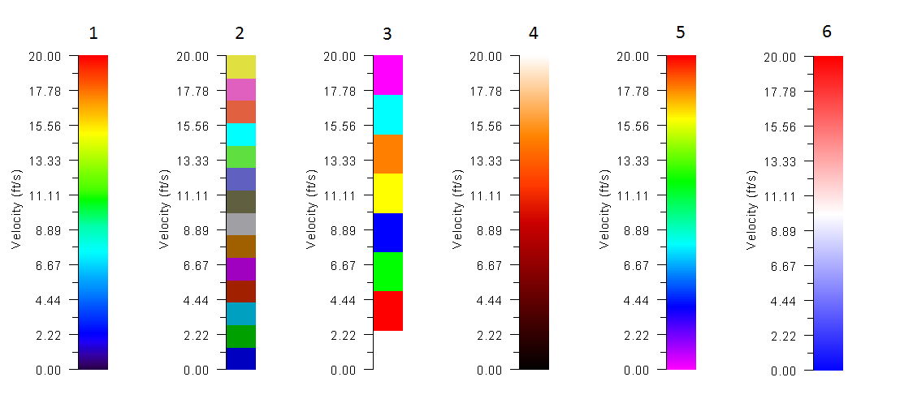{ width=100% }

2. The generic meaning of world file parameters are:

    - Line 1: A: pixel size in the x-direction in map units/pixel
    - Line 2: D: rotation about y-axis (ignored in this version)
    - Line 3: B: rotation about x-axis (ignored in this version)
    - Line 4: E: pixel size in the y-direction in map units, almost always negative
    - Line 5: C: x-coordinate of the center of the upper left pixel
    - Line 6: F: y-coordinate of the center of the upper left pixel.

    Example:\

        2.05
        0.00
        0.00
        -2.05
        795944.99
        310049.73

    In this example, 2.05 is the pixel size in x-direction, rotation in x and y axes is 0.00, pixel size in y direction is 2.05 (shown in negative), x-coordinate of upper left pixel is 795944.99 and y-coordinate of upper left pixel is 310049.73.

    The following table indicates the supported image formats and their corresponding world file extensions.

    & ,\
    & , ,\
    & , ,\
    - **,:** ,

### Data for Profile Result Output: .PROFILES 

Use this file to provide profiles (polylines) along which results will be generated.\
Line 1: Number of profiles.\
**NPROFILES**\
NPROFILES group of files including: Profile ID, number of vertices in profile I, the number of intervals to divide each profile, and coordinates for each vertex in polyline.\
**PROFILEID**\
**NVERTICES_PR(I) ND_PR**\
**X_PRF(I), Y_PRF(I)**\
**\...**

#### Example of a .PROFILES file

    2
    ProfileA
    2 10
    800500.45 }306895.63
    799095.07 307457.34
    ProfileB
    3 10
    800503.45 306896.63
    799500.00 306900.00
    799095.07 307457.34

This file indicates there are 2 profiles. First profile ID is: ProfileA which is defined with a 2-vertex polyline and will be divided in 10 segments.

- **ND_PR:** I; $>2$; -; Intervals to divide each profile sub-segment between vertices. Results will be reported at each interval.
- **NPROFILES:** I; $>0$; -; Number of profiles.
- **NVERTICES_PR(I):** I; $>1$; -; Number of vertices in each profile.
- **PROFILEID:** S; $<26$; -; Profile name. Should have less than 26 characters and must not contain blank spaces.
- **X_PRF(I,J), Y_PRF(I,J):** R; -; m or ft; Coordinates of each vertex J in profile I.

### Cross Section Data for Result Output File: .XSECS 

Cross sections are used to output numeric results at user defined lines on the mesh.\
Line 1: Number of cross sections.\
**NCROSS_SECTIONS**\
NCROSS_SECTIONS groups of lines containing the cross section ID, the number of vertices defining the cross section (always equal to 2), the number of intervals to divide the cross section and the list of coordinates of initial and final point in cross section:\
**XSECID**\
**NPXSEC ND_CS**\
**X1_CS(I) Y1_CS(I)**\
**X2_CS(I) Y2_CS(I)**\

#### Example of a .XSECS file

    3
    CrossSectionA
    2 40
    800500.45 306895.63
    799095.07 307457.34
    CrossSectionB
    2 40
    800492.17 307163.36
    799171.99 307594.56
    CrossSectionC
    2 40
    800449.99 307404.31
    799223.97 307690.20

This file indicates there are 3 cross sections. The first one has ID = CrossSectionA and will be divided in 40 segments.

- **NCROSS_SECTIONS:** I; $>0$; -; Number of cross sections.
- **ND_CS:** I; $>2$; -; Cross section will be divided in ND_CS segments. Results will be reported at each segment. See comment 1.
- **NPXSEC:** I; $2$; -; Number of points defining cross section. In the present version only the two extreme points are allowed to define the cross section, therefore this value should always be 2.
- **X1_CS, Y1_CS, X2_CS, Y2_CS:** R; -; m or ft; Coordinates of initial and ending point of each cross section.
- **XSECID:** S; $<26$; -; Cross section name. Should have less than 26 characters and must not contain blank spaces.

#### Comments for the .XSECS File

1. The model will cut the mesh using the cross section line and extract results at the division points. If ND_CS is too small, the program may not capture anything in between the divisions, and the computed cross section discharges may have big errors.

## Elevation data

### X Y Z data with header

These files contain scattered data in the format suitable to import it in a text editor or spreadsheet program. For example the *BedElevations* data layer. It usually has extension, but can have any other file extension provided that the format is as described herein. Each point is identified by its X and Y coordinates and the elevation value for that coordinate.\
Line 1: Number of points and number of parameters per point (header)\
**NUMBER_OF_DATA_POINTS**\
NUMBER_OF_DATA_POINTS lines with X, Y and parameters data.\
**X(POINT) Y(POINT) P1(POINT) P2(POINT) \... PN(POINT)**

#### Example of an .EXP File

    11086 1
    798439.73 306063.87 160.00
    798477.04 309506.95 201.10
    798489.45 309522.30 200.93
    798498.09 306222.29 162.00
    798504.45 305915.63 160.00
    798511.71 306075.55 161.00
    798516.09 309412.73 201.74
    798517.37 309592.42 163.14
    ...

In this example file, there are 11086 elevation data points, one parameter per point (the elevation for each point).

- **NUMBER_OF_DATA_POINTS:** I; $>0$; -; Number of data points in the file.
- **NUMBER_OF_PARAMETERS:** I; $>0$; -; Number of parameters for each point. In the case of the elevation data file this value is equal to 1.
- **X:** I; -; m or ft; X Coordinate of each elevation point. See comment 1.
- **Y:** R; -; m or ft; Y Coordinate of each elevation point. See comment 1.
- **P:** R; -; m or ft; Parameter value. See comment 2.

#### Comments for the .EXP Data File

1. X and Y coordinates may be given in either meters or feet, depending on the units being used in the project. Coordinate system should always correspond to plane projection. OilFlow2D does not support geographical coordinates in Latitude/Longitude format.
2. Elevation values should be given in the same units as the corresponding coordinates.

## Boundary conditions data files

### One Variable Boundary Condition Files

This format applies to the following data files:

- Time vs. Water Surface Elevation (BCTYPE = 1, 17)
- Time vs. Discharge (BCTYPE = 6)

*Note: BCTYPE parameter is described in Table 7.*\
Line 1: Number points in data series.\
**NDATA**\
NDATA lines containing\
**TIME(I) VARIABLE(I)**\
Where VARIABLE(I) is WSE, or Q, depending on the boundary condition **BCTYPE**.

#### Example of the Boundary Condition File for One Variable Time Series

The following example shows an inflow hydrograph where NDATA is 7 and there are 7 lines with pairs of time and discharge:\

    7
    0. 20.
    1. 30.
    1.3 50.
    2. 90.
    4. 120.
    5. 200.
    7. 250.

- **NDATA:** I; $>0$; -; Number of points in data series.
- **TIME:** R; $>0$; h; Time in hours. The time interval is arbitrary.
- **VARIABLE:** R; -; -; Represents Water Surface Elevation, or Discharge, depending on the boundary condition.

### Two Variables Boundary Condition Files

This format applies to the following data files:

- Time vs. Discharge Q and Water Surface Elevation (BCTYPE = 5)
- Time vs. Q water discharge and Qs sediment discharge (BCTYPE = 26)

Line 1: Number points in data series.\
**NDATA**\
NDATA lines containing time and two values.\
**TIME(I) VARIABLE1(I) VARIABLE2(I)**\
Where VARIABLE1(I) and VARIABLE2(I) depend on the boundary condition type as follows:

- **5:** Q; WSE

#### Example of the Two-Variable Boundary Condition File

The following example shows a file for BCTYPE=5 where discharge and WSE are given, NDATA is 10 and there are 10 lines with pairs of time, discharge and WSE:\

    10
     0. 20. 1420.
     1. 30. 1421.5
     1.3 50. 1423.
    ...
     7. 250. 1420.
     8.1 110. 1426.
    10. 60. 1423.5
    20. 20. 1421.

- **NDATA:** I; $>0$; -; Number of points in data series.
- **TIME:** R; $>0$; h; Time in hours. The time interval is arbitrary.
- **VARIABLE1:** R; -; -; Represents Water Surface Elevation, Discharge, U or V velocity components depending on the boundary condition.
- **VARIABLE2:** R; -; -; Represents Water Surface Elevation, Discharge, U or V velocity components depending on the boundary condition.

### Multiple-Variable Boundary Condition Files

This format applies to the following data file:

- Time vs. Q water discharge and Qs sediment discharge (BCTYPE = 26)

Line 1: Number points in data series.\
**NDATA**\
NDATA lines containing time and two values.\
**TIME(I) VARIABLE1(I) VARIABLE2(I) \... VARIABLEN(I)** \
Where VARIABLE1(I) \... VARIABLEN(I) depend on the boundary condition type as follows:

- **Q:** Qs

#### Example of the Multiple-Variable Boundary Condition File

The following example shows a file for BCTYPE=26 where water discharge and sediment discharge for two fractions are given, NDATA is 10 and there are 10 lines with pairs of time, discharge and WSE:\

    10
     0. 20. 0.001 0.002
     1. 30. 0.002 0.005
     1.3 50. 0.003 0.010
    ...
     7.  250. 0.01  0.015
     8.1 110. 0.005 0.009
    10. 60. 0.004 0.007
    20. 20. 0.003 0.005.

- **NDATA:** I; $>0$; -; Number of points in data series.
- **TIME:** R; $>0$; h; Time in hours. The time interval is arbitrary.
- **VARIABLE1:** R; -; -; Represents Water Discharge.
- **VARIABLE2..N:** R; -; -; Represents Sediment Discharge for the given fraction.

### Stage-Discharge Data Files

This format applies to the stage (water surface elevation) vs. discharge table used for BCTYPE = 9 and 19.\
Line 1: Number points in data series.\
**NDATA**\
NDATA lines containing stage and discharge.\
**STAGE(I) Q(I)**\
Where STAGE(I) is water surface elevation and Q(I) is the corresponding discharge.

#### Example of the Stage-Discharge Boundary Condition File

The following example shows a stage-discharge rating table where NDATA is 21 and there are 21 lines with pairs of stage and corresponding discharge:

    21
    -1.00 0.00
    -0.75 1.79
    -0.50 5.20
    -0.25 9.45
    0.00 14.23
    0.25 19.37
    0.50 24.76
    0.75 30.36
    1.00 36.09
    1.25 41.95
    1.50 47.89
    1.75 53.92
    2.00 60.00
    2.25 66.14
    2.50 72.31
    2.75 78.53
    3.00 84.78
    3.25 91.05
    3.50 97.35
    3.75 103.67
    4.00 110.01

- **NDATA:** I; $>0$; -; Number of lines in data file.
- **STAGE:** R; $>0$; m or ft; Water surface elevation.
- **Q:** R; $>0$ &m$^{3}$/s or ft$^{3}$/s; Water discharge.

### Culvert Depth-Discharge Data Files

This format applies to the culvert depth vs. discharge table.\
Line 1: Number points in data series.\
**NDATA**\
NDATA lines containing depth and discharge.\
**DEPTH(I) Q(I)**\
Where DEPTH(I) is depth corresponding to discharge Q(I).

#### Example of the Culvert Depth-Discharge File

The following example shows a depth-discharge rating table for a culvert. NDATA is 7 and there are 7 lines with pairs of depth and corresponding discharge:\

    7
    0 0.20
    0.1 1.00
    1.00 36.09
    2.00 60.00
    3.00 84.78
    4.00 110.01
    100.00 110.02

- **NDATA:** I; $>0$; -; Number of lines in data file.
- **DEPTH:** R; $>0$; m or ft; Water depth.
- **Q:** R; $>0$; m$^{3}$/s or ft$^{3}$/s; Water discharge.
