# Output File Reference

RiverFlow2D generates results in many output ASCII text files. These files can be easily accessed with any text editor and they can be imported into QGIS o other GIS software for visualization and analysis. RiverFlow2D always creates output ASCII files in both English and metric units depending on the units provided in the data files.

## Output File Overview

The following tables summarizes the output files generated by RiverFlow2D:

- **List of output times:** & Reports output times for result files.
- **Run control parameters, components used, etc.:** ,; Echoes input data read from files including modeling control parameters, mesh data, boundary conditions, and for each report time interval inflow and outflow discharges and velocities file is in metric units and file in English units.
- **Native model output files:** & Reports the model results at cells for each reporting interval.
- **Run control parameters, components used, etc.:** ,; Echoes input data read from files including modeling control parameters, mesh data, boundary conditions, and for each report time interval inflow and outflow discharges and velocities file is in metric units and file in English units.
- **Triangular-cell mesh information:** ,; These files provide comprehensive information about the triangular-cell mesh. is in metric units and file in English units.
- **Run progress results:** & This file report for each output interval the computer time, average time step, inflow and outflow water and sediment transport discharge at open boundaries and volume and mass conservation errors.

- **Maximum values tabular output:** ,; For each output interval maximum nodal velocity modules, depths, and are written to file is in metric units and in English units.
- **Time series at observation points:** ,; These files report time series of results for the cell where the point is located. The results include time series of velocities, depths, water surface and bed elevations, bed elevation changes, wet-dry condition, and Froude number. File name format is as follows: for metric units and for English units, where is the observation point name.
- **Mass balance:** & Report total inflow and outflow discharges and volumes for each output interval.
- **Hot start:** & Generated in the RiverFlow2D model to restart a simulation from previously computed results. The file contains the time in seconds and the corresponding file name from which the model will restart when using the hot start option.
- **Native model output files:** & Report the model results at cells for each reporting interval.
- **Native model output files for MT module:** & Report the model results at cells for each reporting interval when using the MT module with variable properties option.

- **Cross section output:** ,; For all output intervals, these files provide bed elevation, depth, water surface elevation, depth average velocity, and Froude number, water and sediment discharge. is in metric and in English units.
- **Cross section hydrographs:** ,; Report a hydrograph table for each cross section. is the water hydrograph and the sediment flux hydrograph for each cross section. See Comment 1.
- **Profile output:** ,; For each output interval and for a number of points along user defined polylines, these files provide bed elevation, depth, water surface elevation, depth average velocity, and Froude number are written to file is in metric and in English units.
- **Culverts:** & Output discharge at every culvert for each report interval. File name format is as follows: where culvertID is the user provided name.
- **Internal Rating Tables:** & Output discharge at every IRT for each report interval.File name format is as follows: , where IrtID is the text provided by the user to identify the Internal Rating Table.
- **Weirs:** ,; Report results for weirs. is in metric units and WEIRE in English units.

- **General results:** & When the Create Graphic Output Files check box is selected in the Graphic Output Panel, RiverFlow2D model will output files, that report velocities, depths, water surface and bed elevations, bed elevation changes, wet-dry condition, Froude number and sediment transport discharge for each output time interval. These files can be used by third party software including Paraview to generate high quality graphs of RiverFlow2D results. ParaView (<https://www.paraview.org>) is an open-source, multi-platform data analysis and visualization application. ParaView users can quickly build visualizations to analyze their data using qualitative and quantitative techniques. The data exploration can be done interactively in 3D o programming using ParaView's batch processing capabilities.

- **Spatial distribution of results for each report interval:** & For each output interval cell velocities, depths, water surface and bed elevations, bed elevation changes, wet-dry condition, Froude number, and sediment transport fluxes, etc., are written to file. These files are used to prepare Results vs Time maps. The file names is .
- **Spatial distribution of pollutant concentrations for each report interval:** & For each output interval cell concentrations are written to file. These files are used to prepare Pollutant Concentration vs Time maps. The file name is .
- **Spatial distribution of sediment concentrations for each report interval:** & For each output interval cell sediment concentrations are written to file. These files are used to prepare sediment concentration vs Time maps. The file name is .
- **Oil particle coordinates, and properties for each report interval:** & For each output interval particle coordinates, volume, density, viscosity, and oil state are written to file. These files are used by prepare oil property vs Time maps. The file name is .

- **Maximum Values at Cells Files:** & These ASCII files report maximum values of velocity module, depth and water surface elevations and allow seamless transfer to QGIS Geographic Information System software for generating maps. The files named as follows:. See Comment 1.
- **Time-to-Depth at Cells File:** & This file reports the time at which certain depths are reached during the simulation, inundation time, etc. and allow seamless transfer to QGIS. The files are named as follows:. See Comment 1.

- **Hazard Intensity Values at Cells File:** & These ASCII files report the Hazard Intensity values for various hazard classification used in different countries. These include the United State Bureau of Reclamation, Swiss methods, Criteria used in Austria and in the UK. and allow seamless transfer to QGIS for map preparation. The files are named as follows:. See Comment 1.

#### Comments for Output Files

In the RiverFlow2D model these files are generated during the final step after the model completes the run, and when post processing results using the Plot RiverFlow2D results on the *Data Input Program Graphic Output Options* panel.

### Essential files required to generate maps, graphics and animations

As it is clear from the list of files given above, RiverFlow2D creates a significant number files containing model results, and some of them may be huge for large project. However, only a subset of these files are required to create graphs in RiverFlow2D. Knowing which output files are required is often of practical importance when there is a need to reduce the number of files to transfer to a computer different from that used to perform the simulations. One example is when using a cloud service to perform simulations and the user needs to download result files to a local computer. Downloading only the essential files for postprocessing will help minimizing connection costs.

This section summarizes the essential files to create maps, graphics and animation in a RiverFlow2D project. This assumes the existing project has the layers created to generate the RiverFlow2D files such as *Trimesh*, etc.

The following table presents the various graphics and animations that can be created with RiverFlow2D and the output files necessary for each graph.

!!! note

    The are the native result output files of the model, that are always in SI units. Although are not directly used for graphic output, they can be helpful to regenerate the post processing files if you delete post processing files described in this section.

Results vs Time Maps &

1..

2..

3..

Pollutant Concentration vs Time Maps &

1..

2..

Sediment Concentration vs Time Maps &

1..

2..

Fluid concentration, density, viscosity, and yield stress vs Time Maps &

1..

2..

Oil or Plastic location and properties for the OilFlow2D model. Time maps and animations. &

1..

2..

3..

Maximum Result Maps &

1..

Time-to-Depth Maps &

1..

Hazard Intensity Maps &

1..

Animations, Cross Sections and Profiles &

1. 

2..

3..

4. for the PL and WQ modules.
5. for the ST module.
6. for the MT module.

## General Output Files

This section describes the content of each output file.

### Output times .outfiles file

This file includes a list of times corresponding to each output interval. The following is an example of the content of a typical file:

    time_0000_00_00_00.exp
    time_0000_00_06_00.exp
    time_0000_00_12_00.exp
    time_0000_00_18_00.exp
    time_0000_00_24_00.exp
    time_0000_00_30_00.exp
    time_0000_00_36_00.exp

### Output times for the Oil Spill on Water model .outfilesoilw file

This file includes a list of times corresponding to each output interval generated when running the oil spill on water model. The following is an example of the content of a typical file:

    _0000_02_00_00
    _0000_02_15_00
    _0000_02_30_00
    _0000_02_45_00
    _0000_03_00_00
    _0000_03_15_00
    _0000_03_30_00
    _0000_03_45_00

### Run Options Summary .outi and .oute files

These files replicate the input data read from files including modeling control parameters, mesh data, boundary conditions, and inflow and outflow discharges and velocities for each output interval. The file is in metric units and in English units. Part of a typical output is as follows:

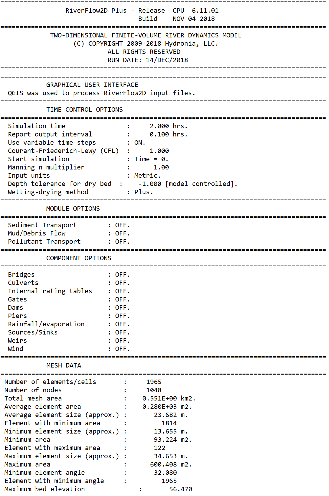{ width=60% }

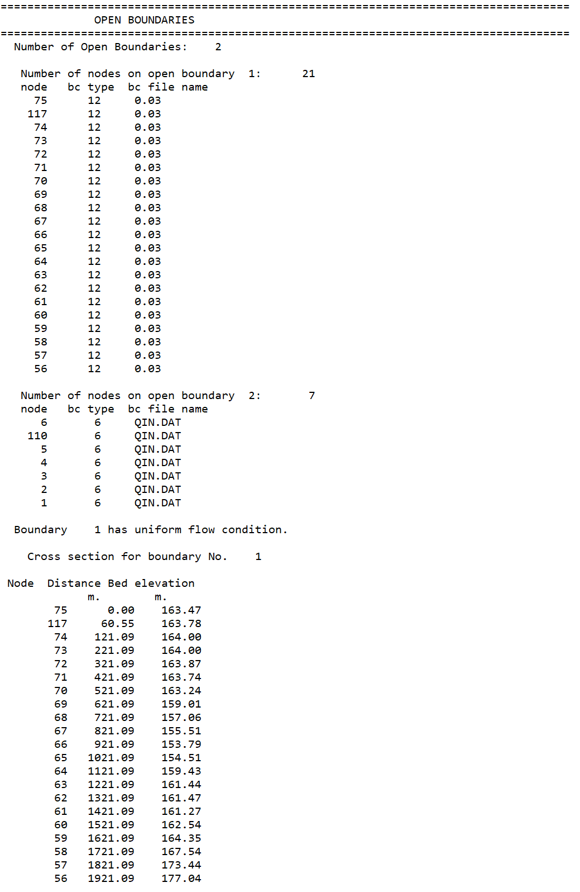{ width=80% }

### Mesh Data and Mesh Metrics .meshouti and .meshoute files

Mesh data is written to files with extensions: (metric units) and (English units). These files provide comprehensive information about the triangular-cell mesh. The following table summarizes the available output.

- **Number of cells:** Total number of cells in the mesh
- **Number of nodes:** Total number of nodes in the mesh
- **X:** x-coordinate of node
- **Y:** y-coordinate of node
- **BEDEL:** Initial bed elevation
- **INITIAL_WSE:** Initial fluid surface elevation
- **BC ID:** Boundary condition code
- **BC File:** Boundary condition file name
- **Node1, Node2, Node3:** Nodes numbers of each cell in counterclockwise order
- **Manning's n:** Manning' n roughness coefficient
- **Area:** Cell area
- **Angle:** Minimum angle in cell
- **Total mesh area:** Sum of areas of all cells on the mesh
- **Average cell area:** Total mesh area divided by number of cells
- **Average cell size:** Average size of cells on mesh
- **Cell with minimum area:** Smallest cell
- **Minimum cell size:** Approximate linear size of smallest cell
- **Minimum cell area:** Area of smallest cell
- **Cell with maximum area:** Largest cell
- **Maximum cell size:** Approximate linear size of largest cell
- **Maximum cell area:** Area of largest cell
- **Minimum cell angle:** Smallest cell internal angle
- **Cell with minimum angle:** Cell that has the smallest internal angle

This file also reports the list of acute cells that have an internal angle of less than 5 degrees. If there are acute cells, the model will give an error message and will not be able to execute.\
An excerpt of a typical file format is shown below:

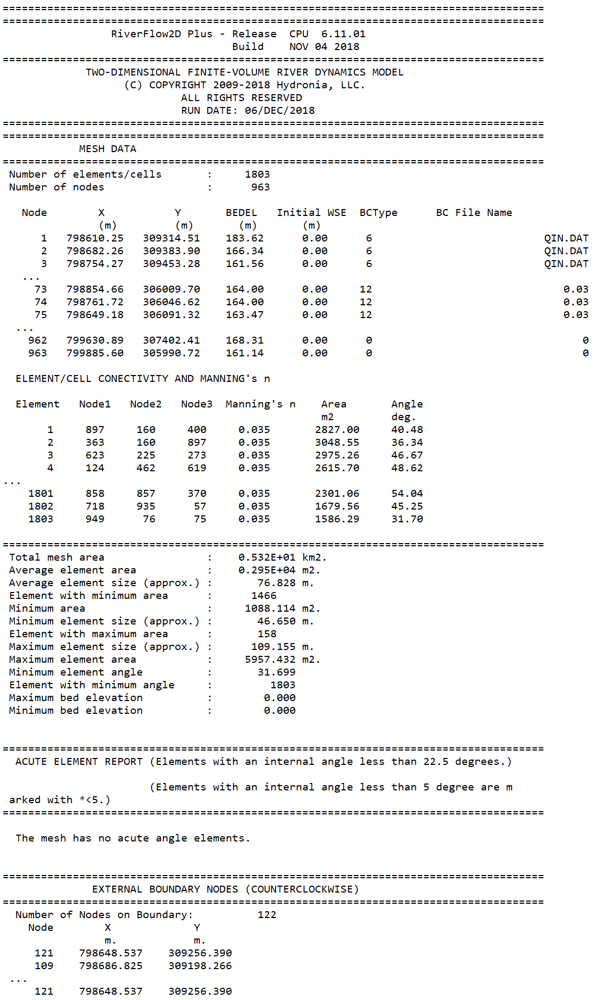{ width=90% }

### Run Summary .rout file

Run summary report is written to file with extension:. These files report for each output interval the computer time, average time step, and for each open boundary inflow (positive) o outflow (negative) discharge (m$^{2}$/s o ft$^{3}$/s), volume conservation error (%), volumetric sediment discharge (m$^{2}$/s o ft$^{3}$/s) and sediment mass conservation error (%)

#### Example of a .rout file

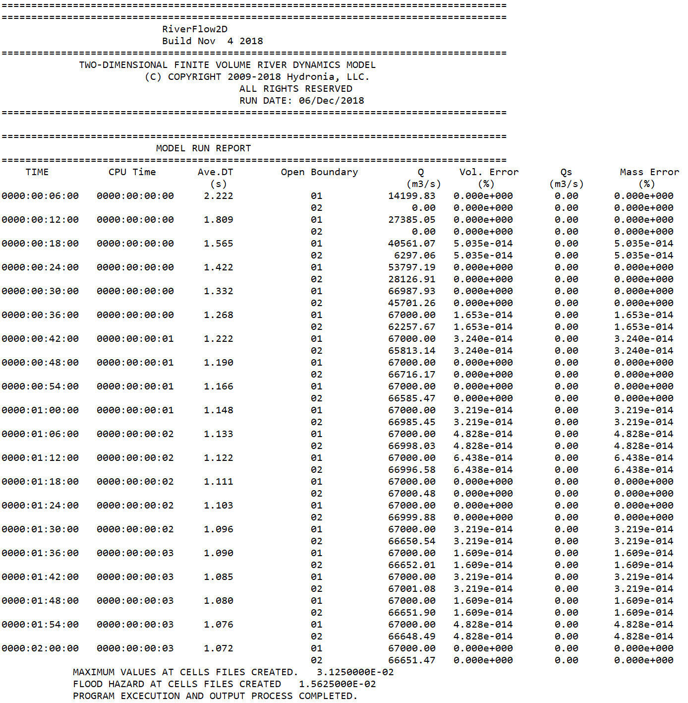{ width=100% }

### General Model Result Files state\*.out, stateN.out, and stateOL.out Files

These files include direct output of model results and are used by the post processor program to generate secondary results. The units are always metric.

#### State\*.out files

These ASCII files include the model results for each output interval for all modules except the MT with variable properties. The file name is as follows:

- for the first output interval,
- 
- \...
- for the final output interval.

The output interval is defined by **TOUT**, that is the third parameter on line 6 of the file.

#### StateN\*.out files

These ASCII files include the model results for each output interval for the MT module with variable properties. The file name is as follows:

- for the first output interval,
- 
- \...
- for the final output interval.

#### StateOL\*.out files

These ASCII files include the model results for each output interval for OilFlow2D when using the Heat Transfer model module. The file name is as follows:

- for the first output interval,
- 
- \...
- for the final output interval.

The output interval is defined by **TOUT**, that is the third parameter on line 6 of the file.

The format specifications of the files is as follows:

**RiverFlow2D--Hydrodynamics only**\
File name:\
LEVEL 0.0000\
VEL_X 0.0000\
VEL_Y 0.0000\
LEER number of columns\
$h$ $u$ $v$   *\[one line for each cell\]*\
**RiverFlow2D--PL**\
File name:\
LEVEL 0.0000\
VEL_X 0.0000\
VEL_Y 0.0000\
SOL_1 0.0000\
$\vdots$\
SOL_N 0.0000\
LEER number of columns\
$h$ $u$ $v$ $c_1$ $\cdots$ $c_N$   *\[one line for each cell\]*\
**RiverFlow2D--WQ**\
File name:\
LEVEL 0.0000\
VEL_X 0.0000\
VEL_Y 0.0000\
SOL_1 0.0000\
$\vdots$\
SOL_N 0.0000\
LEER number of columns\
$h$ $u$ $v$ $c_1$ $\cdots$ $c_N$   *\[one line for each cell\]*\
**RiverFlow2D--UD**\
File name:\
LEVEL 0.0000\
VEL_X 0.0000\
VEL_Y 0.0000\
SOL_1 0.0000\
$\vdots$\
SOL_N 0.0000\
LEER number of columns\
$h$ $u$ $v$ $c_1$ $\cdots$ $c_N$   *\[one line for each cell\]*\
**RiverFlow2D--ST Bedload transport**\
File name:\
LEVEL 0.0000\
VEL_X 0.0000\
VEL_Y 0.0000\
LEER number of columns\
$h$ $u$ $v$ $z_b$   *one line for each cell*\
**RiverFlow2D--ST Suspended transport**\
File name:\
LEVEL 0.0000\
VEL_X 0.0000\
VEL_Y 0.0000\
SOL_1 0.0000\
$\vdots$\
SOL_N 0.0000\
LEER number of columns\
$h$ $u$ $v$ $z_b$ $\phi_1$ $\cdots$ $\phi_N$   *\[one line for each cell\]*\
**RiverFlow2D--MT**\
File name:\
LEVEL 0.0000\
VEL_X 0.0000\
VEL_Y 0.0000\
SOL_1 0.0000\
$\vdots$\
SOL_N 0.0000\
LEER number of columns\
$h$ $u$ $v$ $z_b$ $\phi_1$ $\cdots$ $\phi_N$ $\rho$ $\mu_B$ $\tau_y$   *\[one line for each cell\]*\
**OilFlow2D**\
File name:\
LEVEL 0.0000\
VEL_X 0.0000\
VEL_Y 0.0000\
LEER number of columns\
$h$ $u$ $v$   *\[one line for each cell\]*\
**OilFlow2D--HT**\
File name:\
LEVEL 0.0000\
VEL_X 0.0000\
VEL_Y 0.0000\
SOL_1 0.0000\
$\vdots$\
SOL_N 0.0000\
LEER number of columns\
$h$ $u$ $v$ $T$ $\rho$ $\mu_B$ $\tau_y$   *\[one line for each cell\]*\

- **SOL_N:** -; Number of sediment classes or pollutants

- **$h$:** $(m)$; Flow depth
- **$u$:** $(m/s)$; Flow velocity in $x-$direction
- **$v$:** $(m/s)$; Flow velocity in $y-$direction
- **$c_j$:** Given by user; Concentration of the $j$ solute in the flow
- **$z_b$:** $(m)$; Bed level
- **$\phi_j$:** $(-)$& Vol. conc. of the $j$ sediment class in the flow
- **$\rho$:** $(kg/m^3)$; Density
- **$T$:** $(^{\circ}C)$; Fluid temperature
- **$\mu_B$:** $(Pa \cdot s)$& Viscosity
- **$\tau_y$:** $(Pa)$; Yield stress

### Maximum Value Tabular .maxi and .maxe Files

These files report maximum nodal values of velocity module, depth, water surface elevations, and bed changes over the complete simulation. is in metric units and in English units. The reported variables are described in the following tables:

- **CELL:** Cell number; -; -

- **2:** VELOCITY; Maximum velocity magnitude $\sqrt{U^2+V^2}$; ft/s; m/s
- **3:** DEPTH; Maximum water depth; ft; m
- **4:** WSEL; Maximum water surface elevation; ft; m
- **6:** DEPTHxVEL; Maximum product of depth and velocity; ft$^{2}$/s; m$^{2}$/s
- **7:** SHEAR STRESS; Maximum shear stress; lb/ft$^{2}$; Pa
- **8:** IMPACT FORCE; Maximum unit impact force; lb/ft; N/m

- **CELL:** Cell number; -; -

- **2:** VELOCITY; Maximum velocity magnitude $\sqrt{U^2+V^2}$; ft/s; m/s
- **3:** DEPTH; Maximum water depth; ft; m
- **4:** WSEL; Maximum water surface elevation; ft; m
- **5:** DEPTHxVEL; Maximum product of depth and velocity; ft$^{2}$/s; m$^{2}$/s
- **6:** BED ELEV.; Maximum bed elevation; ft; m
- **7:** MIN BED ELEV.; Minimum bed elevation; ft; m
- **8:** EROS. DEPTH; Maximum erosion depth; ft; m
- **9:** DEPOS. DEPTH; Maximum deposition depth; ft; m
- **10:** SHEAR STRESS; Maximum shear stress; lb/ft$^{2}$; Pa
- **11:** IMPACT FORCE; Maximum unit impact force per unit width; lb/ft; N/m

A typical output file follows:

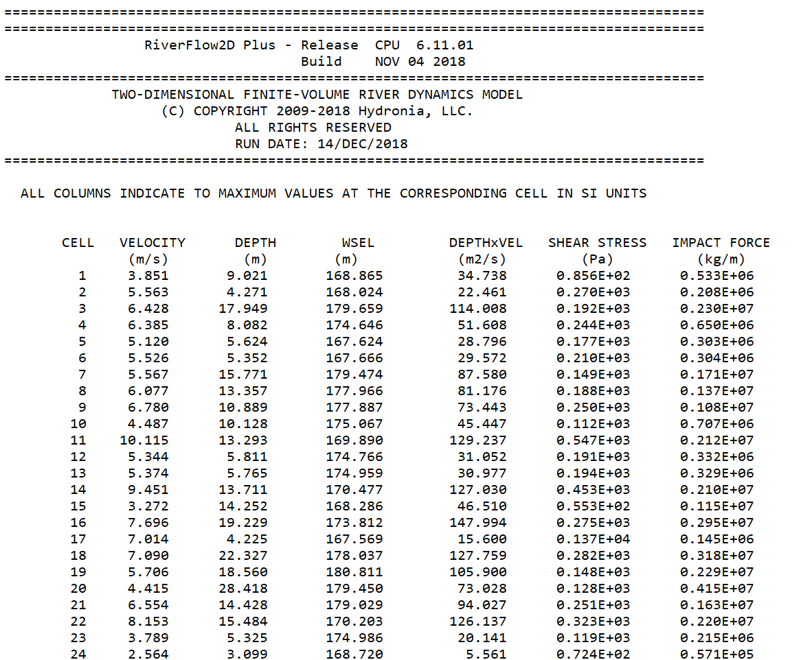{ width=75% }

### Observation Point Output

These files report time series of results at observation points. The program finds cell where the observation point point is located and writes the result time series of the following variables:

- **Time:** Time in hours; -; -
- **2:** U; Velocity component in x direction; ft; m
- **3:** V; Velocity component in y direction; ft; m
- **4:** VELOCITY; Maximum velocity magnitude $\sqrt{U^2+V^2}$; ft/s; m/s
- **5:** DEPTH; Maximum water depth; ft; m
- **6:** WSEL; Maximum water elevation; ft; m
- **7:** BEDEL_ORI; Maximum bed elevation\*; ft; m
- **8:** BEDEL; Maximum bed elevation\*; ft; m
- **9:** DELTA_BED; Minimum erosion depth\*; ft; m
- **10:** Froude; Maximum deposition depth\*; ft; m
- **11:** QSX; Volumetric sediment discharge per unit width in x direction; ft$^{2}$/s; m$^{2}$/s
- **12:** QSY; Volumetric sediment discharge per unit width in y direction; ft$^{2}$/s; m$^{2}$/s
- **13:** QS; Volumetric sediment discharge magnitude $Q_s=\sqrt{Q_{sx}^2+Q_{sy}^2}$; ft$^{2}$/s; m$^{2}$/s

The file name for each cell is:\
for metric units and\
for English units.\
Where is the name given to the observation point. For example: is the file name for time series results of. An example of this file is shown below.

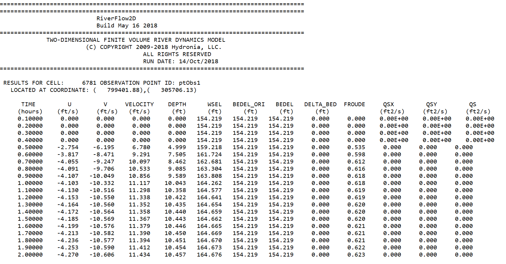{ width=100% }

### Hot Start 2binitialized.hotstart File

The hot start file is used to restart a simulation from previously computed results and when hot start option is selected. By default the file contains the name of the last report time in seconds and the corresponding file. Those results will be used as initial conditions on all the mesh cells to restart the simulation when the hot start option is activated. For example, if the user stops the simulation at 5 hours to review results or runs the model up to that time the file would have the following text:\

!!! note

    Note that the files are named sequentially. For instance, corresponds to the 4$^{th}$ reporting interval.

RiverFlow2D can be restarted from the any existing report time by reading the initial conditions from the file indicated in the file. To restart from a time different from the last one calculated, just edit the file and enter the desired time in seconds and corresponding file name that is to be used as initial conditions. For example, to hot start from hour 3 (10800 seconds) and assuming that the report interval is 0.5 hours, the file should contain the following entry:\
The hot start option is often useful to establishing initial conditions common to a series of simulations for various return periods. For instance, to generate your initial state, you could run the model with a constant discharge inflow until the model converges to a steady state. Assuming that the final report time corresponds to the file, you can edit the file as shown:\
Then when you run the RiverFlow2D model using the hot start option, the model will start assuming that the data in the file will define the initial conditions. You may want to keep the and files in a separate directory and copy them to the project folder for each desired scenario.

!!! note

    Please, keep in mind that the files are tied to the mesh you use, so if you modify the mesh in any way, you will need to use the corresponding to that mesh.

### Mass Balance Output File

The

file reports on the global mass/volume balance throughout the simulation. The file content varies depending on the module used according to the following format:

**RiverFlow2D--Hydrodynamics**\
Column 1: Time\
Column 2: Accumulated water volume inflow\
Column 3: Accumulated water volume outflow\
Column 4: Internal water volume\
Column 5: Accumulated rain/evaporation water volume\
Column 6: Accumulated infiltration water volume\
**RiverFlow2D--PL**\
Column 1: Time\
Column 2: Accumulated water volume inflow\
Column 3: Accumulated water volume outflow\
Column 4: Internal water volume\
Column 5: Accumulated rain/evaporation water volume\
Column 6: Accumulated infiltration water volume\
Column 7: Accumulated solute_1 volume inflow\
Column 8: Accumulated solute_1 volume outflow\
Column 9: Internal solute_1 volume\
Column 10: Accumulated uptake solute_1 volume\
$\vdots$\
Column 11+$k$: Accumulated solute\_$k$ volume inflow\
Column 12+$k$: Accumulated solute\_$k$ volume outflow\
Column 13+$k$: Internal solute\_$k$ volume\
Column 14+$k$: Accumulated uptake solute\_$k$ volume\
**RiverFlow2D--WQ**\
Column 1: Time\
Column 2: Accumulated water volume inflow\
Column 3: Accumulated water volume outflow\
Column 4: Internal water volume\
Column 5: Accumulated rain/evaporation water volume\
Column 6: Accumulated infiltration water volume\
Column 7: Accumulated solute_1 volume inflow\
Column 8: Accumulated solute_1 volume outflow\
Column 9: Internal solute_1 volume\
Column 10: Accumulated uptake solute_1 volume\
$\vdots$\
Column 11+$k$: Accumulated solute\_$k$ volume inflow\
Column 12+$k$: Accumulated solute\_$k$ volume outflow\
Column 13+$k$: Internal solute\_$k$ volume\
Column 14+$k$: Accumulated uptake solute\_$k$ volume\
**RiverFlow2D--UD**\
Column 1: Time\
Column 2: Accumulated water volume inflow\
Column 3: Accumulated water volume outflow\
Column 4: Internal water volume\
Column 5: Accumulated rain/evaporation water volume\
Column 6: Accumulated infiltration water volume\
**RiverFlow2D--ST Bedload transport**\
Column 1: Time\
Column 2: Accumulated water volume inflow\
Column 3: Accumulated water volume outflow\
Column 4: Internal water volume\
Column 5: Accumulated rain/evaporation water volume\
Column 6: Accumulated infiltration water volume\
Column 7: Accumulated solid volume inflow\
Column 8: Accumulated solid volume outflow\
Column 9: Internal solid volume\
Column 10: $NULL$\
**RiverFlow2D--ST Suspended transport**\
Column 1: Time\
Column 2: Accumulated water+solid volume inflow\
Column 3: Accumulated water+solid volume outflow\
Column 4: Internal water+solid volume\
Column 5: Accumulated rain/evaporation water volume\
Column 6: Accumulated infiltration water volume\
Column 7: Accumulated solid volume inflow\
Column 8: Accumulated solid volume outflow\
Column 9: Internal solid volume\
Column 10: Accumulated bed exchange water+solid volume\
**RiverFlow2D--MT**\
Column 1: Time\
Column 2: Accumulated mud/tailings volume inflow\
Column 3: Accumulated mud/tailings mass inflow\
Column 4: Accumulated mud/tailings volume outflow\
Column 5: Accumulated mud/tailings mass outflow\
Column 6: Internal mud/tailings volume\
Column 7: Internal mud/tailings mass\
Column 8: Accumulated rain water volume\
Column 9: Accumulated rain water mass\
Column 10: Accumulated bed exchange mud/tailings volume\
Column 11: Accumulated bed exchange mud/tailings mass\
**OilFlow2D**\
Column 1: Time\
Column 2: Accumulated oil volume inflow\
Column 3: Accumulated oil volume outflow\
Column 4: Internal oil volume\
Column 5: Accumulated intake/evaporation oil volume\
Column 6: Accumulated infiltration oil volume\
**OilFlow2D--HT**\
Column 1: Time\
Column 2: Accumulated oil volume inflow\
Column 3: Accumulated oil mass inflow\
Column 4: Accumulated oil volume outflow\
Column 5: Accumulated oil mass outflow\
Column 6: Internal oil volume\
Column 7: Internal oil mass\
Column 8: $NULL$\
Column 9: $NULL$\
Column 10: $NULL$\
Column 11: $NULL$\

## Component Output Files

### Booms .OUTBOOMS Output File

When considering Booms in the OilFlow2D oil-on-water spill model creates an output file with extension: , that reports on the oil or plastic volumes in bbl and m$^3$ retained by each boom and for each output interval:

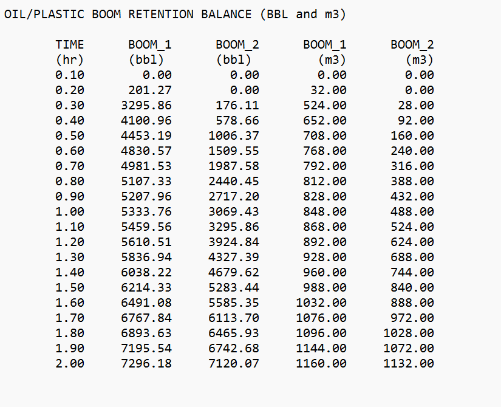{ width=80% }

### Culvert CULVERT_culvertID.out Output Files

For each culvert, RiverFlow2D creates an output file named: , where is the text provided by the user to identify the culvert. Report includes discharge for each report interval and the water surface elevations (WSEL1, WSEL2) at each culvert end as shown:

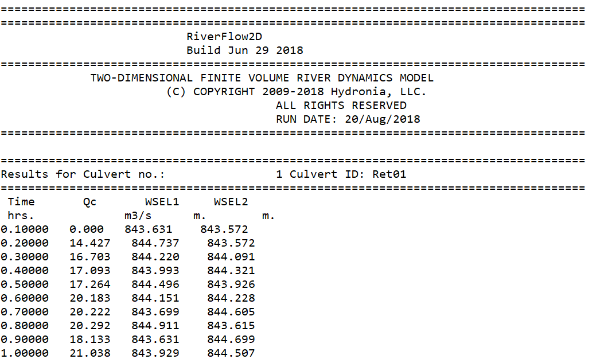{ width=80% }

### Internal Rating Table IRT_irtID.out Files

For each Internal Rating Table, RiverFlow2D creates an output file named: , where is the text provided by the user to identify the Internal Rating Table. Report includes discharge for each report interval as shown:

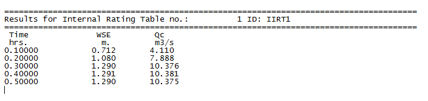{ width=100% }

### Weir Output .weiri and .weire Files

These files report results for each weir and for each output interval. File extension is for metric units and for English units. Output includes the following information:

- **EDGE:** Edge number
- **N1:** Cell at side 1 of the edge
- **N2:** Cell at side 2 of the edge
- **WSE1:** Water surface elevation at cell N1
- **WSE2:** Water surface elevation at cell N2
- **D1:** Depth at cell N1
- **D2:** Depth at cell N2
- **Distance:** Edge length
- **Q:** Edge discharge

A typical weir output file format is shown below:

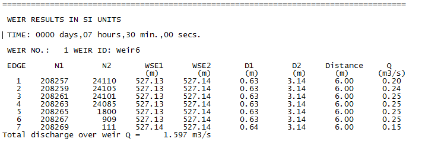{ width=100% }

## Cross Section and Profile Output Files

### General Cross Section .xseci and .xsece Files

When using the *Output results* for *cross sections* option, the model will generate files with extensions and , that report results along user provided cross sections. For each output interval and for each user defined cross sections the bed elevation, depth, water surface elevation, depth average velocity, Froude number and volumetric sediment discharge per unit width is written to file is in metric and in English units. A typical file is as follows:

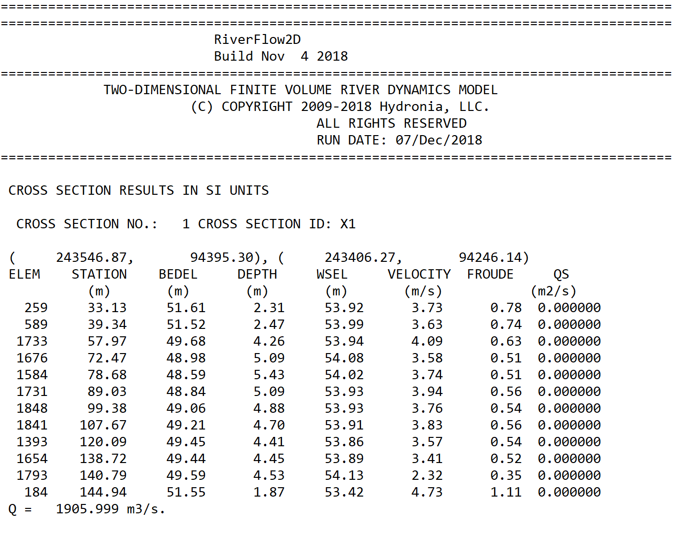{ width=100% }

When running only hydrodynamics the and files will display the cross section water discharge. When running sediment transport, in addition to the water discharge these files will report the total sediment discharge in ft$^{3}$/s o m$^{3}$/s.

### Cross Section Hydrograph .xsech and .xsecsed Files 

These files will only be generated using the post processing Plot RiverFlow2D results button on the *Graphic Output Options* panel. When using the *Output results for cross sections* option, the model will generate files with extension and (if using sediment transport component), that report a hydrograph table for each cross section. A typical path.xsech

file is as follows:

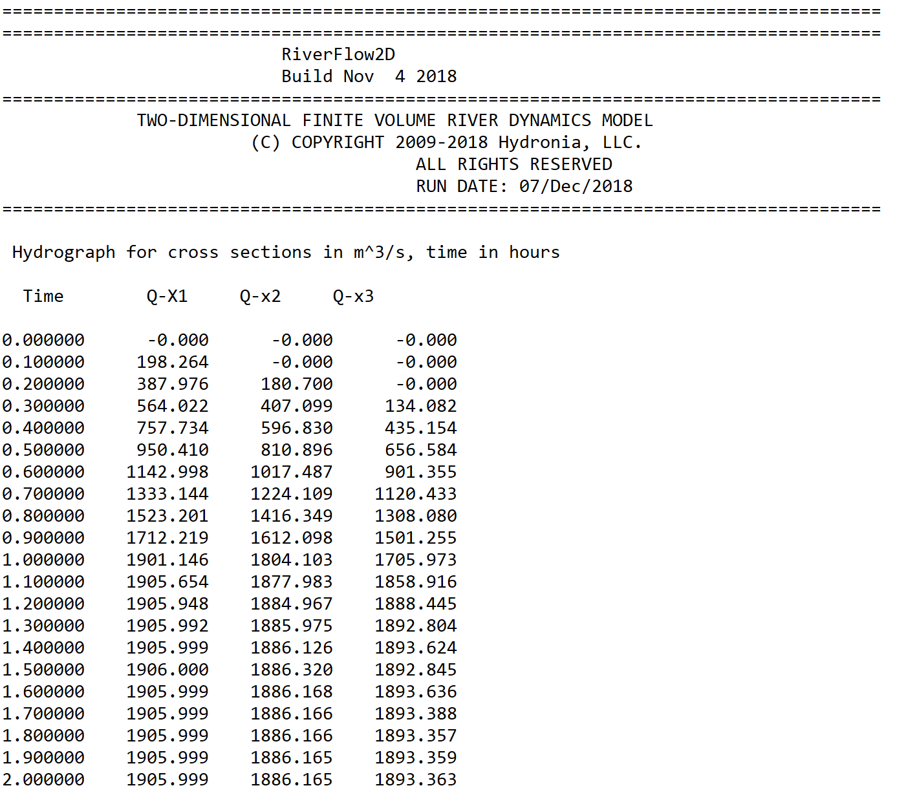{ width=100% }

### Profile .prfi and .prfe Files

When using the *Output results for profiles* option, the model will generate files with extensions and , that report results along user provided polylines. For each output interval and for the number of points along user defined polylines these files list bed elevation, depth, water surface elevation, depth average velocity, and Froude number. is in metric and in English units. An example output is shown below:

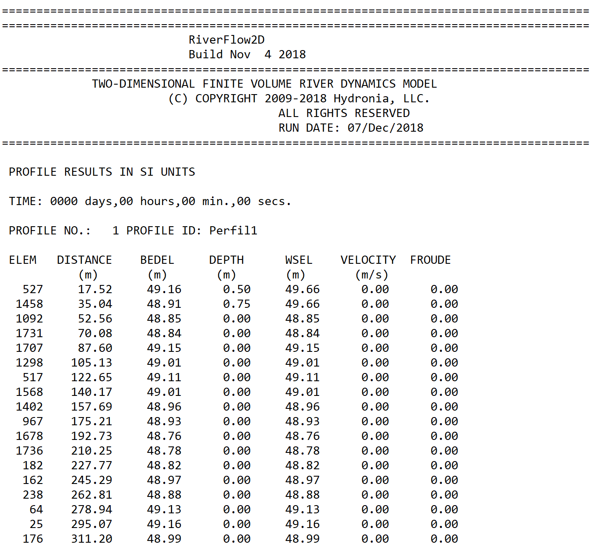{ width=95% }

## Output Files for QGIS Post-processing

### General Results at Cells

These ASCII files allow seamless transfer to QGIS Geographic Information System software. These files use the extension and are named as follows:\
Where dddd is days, hh is hours, mm is minutes and ss seconds. For example\
corresponds to a file for time: 1 day, 12 hours, 1 minute and 34 seconds.

The format for these files is as follows. The first line contains the number if cells (NELEM) and the number of cell parameters which is 16. Then it follows NELEM lines with results for each cell in the triangular-cell mesh as shown:

- **Velocity component in x direction U:** ft/s; m/s
- **2:** Velocity component in y direction V; ft/s; m/s
- **3:** Velocity magnitude $\left|\vec U\right|=\sqrt{U^2+V^2}$; ft/s; m/s
- **4:** Water surface elevation; ft; m
- **5:** Depth H; ft; m
- **6:** Initial bed elevation; ft; m
- **7:** Bed elevation; ft; m
- **8:** Bed elevation change since time = 0; ft; m
- **9:** Froude number; -; -
- **10:** Volumetric sediment discharge per unit width in x direction: $Q_{sx}$; ft$^{2}$/s; m$^{2}$/s
- **11:** Volumetric sediment discharge per unit width in y direction: $Q_{sy}$; ft$^{2}$/s; m$^{2}$/s
- **12:** Volumetric sediment discharge magnitude: $Q_s\sqrt{Q_{sx}^2+Q_{sy}^2}$; ft$^{2}$/s; m$^{2}$/s
- **13:** Bed shear stress\*:; lb/ft$^{2}$; Pa
& $\tau=\gamma H S_f=\gamma \left(U n/k\right)^2/H^{1/3}$ &\
- **14:** Accumulated rainfall volume; ft$^{3}$; m$^{3}$
- **15:** Accumulated infiltration volume; ft$^{3}$; m$^{3}$
- **16:** Manning's n; -; -

### Oil Spill on Land Considering Heat Transfer Concentration Files (OilFlow2D Overland Spills Module)

These ASCII files contains oil properties for each cell when the user selects the option to compute heat transfer in the OilFlow2D model. These files use the extension and are named as follows:\
Where dddd is days, hh is hours, mm is minutes and ss seconds. For example\
corresponds to a file for time: 1 day, 12 hours, 1 minute and 34 seconds.\
The files contains NELEM lines with results for each cell in the triangular-cell mesh as shown:

- **1:** Temperature; $^\circ$C or $^\circ$F
- **2:** Density; kg/m$^3$ or lb/ft$^3$
- **3:** Viscosity; Pa.s or lb.s/in$^2$
- **4:** Yield stress; Pa or lb/in$^2$

The following is an extract of a typical file:\

    24.285166 896.773201 0.127555 388.067542
    33.863397 890.767650 0.084793 11.684067
    24.291867 896.768999 0.127518 387.241991
    48.416306 881.642976 0.047768 0.000000
    24.271945 896.781491 0.127630 389.696434
    30.217557 893.053592 0.098751 45.954962
    43.904228 884.472049 0.056749 0.000000
    46.777124 882.670743 0.050825 0.000000
    24.264588 896.786103 0.127671 390.602726
    24.429900 896.682453 0.126746 370.236305
    24.363673 896.723977 0.127116 378.395478

### Pollutant Concentration Files (PL Module)

These ASCII files contains pollutant transport module results. These files use the extension and are named as follows:\
Where dddd is days, hh is hours, mm is minutes and ss seconds. For example\
corresponds to a file for time: 1 day, 12 hours, 1 minute and 34 seconds.\
The format for these files is as follows. The first line indicates the number of solutes used in the PL run (NP_MAX). Then follows NELEM lines with results for each cell in the triangular-cell mesh as shown:

- **1:** Concentration for solute 1; Same as in BC's
- **2:** Concentration for solute 2; Same as in BC's
- **\...:** \...; \...
- **NP_MAX:** Concentration for solute NP_MAX; Same as in BC's

The following file is an example of a typical file:\

    3
    0.000000 0.000000 0.000000
    0.000000 0.000000 0.000000
    0.000000 0.000000 0.000000
    0.202378 0.000000 0.000000
    0.326602 0.000000 0.000000
    0.291721 0.000000 0.000000
    0.000000 0.000000 0.000000
    ...

In this example, the has 3 pollutants.

### Sediment Concentration and Bed Fraction Files (ST Module)

These ASCII files contain suspended sediment concentrations and bed material fractions. These files use the extension and are named as follows:\
Where dddd is days, hh is hours, mm is minutes and ss seconds. For example\
corresponds to a file for time: 1 day, 12 hours, 1 minute and 34 seconds.\
If the Suspended Sediment Model is activated the format for these files is as follows. The first line indicates the number of suspended sediment classes and fractions used in the ST run times 2 plus 1 (2\*NSSNFRAC+1). Then follows NELEM lines with results for each cell in the triangular-cell mesh as shown:

- **Cv(1):** Concentration by volume for fraction 1; Fraction of 1
- **Cv(2):** Concentration by volume for fraction 2; Fraction of 1
- **\...:** \...; \...
- **Cv(NSSNFRAC):** Concentration by volume for fraction NSSNFRAC; Fraction of 1

- **Fr(1):** Fraction of class 1 on the bed active layer; Fraction of 1
- **Fr(2):** Fraction of class 2 on the bed active layer; Fraction of 1
- **\...:** \...; \...
- **Fr(NSSNFRAC):** Fraction of class NSSNFRAC on the bed active layer; Fraction of 1
- **D$_{50}$:** Average grain diameter on the bed active layer calculated as $\sum_j (Fr_j D_{{50}_j})$; m-ft

If the Suspended Sediment Model is not activated concentrations are not written and the format for these files is as follows. The first line indicates the number of bed fractions used in the ST run times 2 plus 1 (NSSNFRAC+1). Then follows NELEM lines with results for each cell in the triangular-cell mesh as shown:

- **Fr(1):** Fraction of class 1 on the bed active layer; Fraction of 1
- **Fr(2):** Fraction of class 2 on the bed active layer; Fraction of 1
- **\...:** \...; \...
- **Fr(NSSNFRAC):** Fraction of class NSSNFRAC on the bed active layer; Fraction of 1
- **D$_{50}$:** Average grain diameter on the bed active layer calculated as $\sum_j (Fr_j D_{{50}_j})$; m-ft

!!! note

    NOTE:

    If Suspended Sediment Transport is activated but cells are dry concentrations are written as-9999.

    If bed evolution is not activated, bed fractions and D50 is written as -9999.

### Mud and Tailings Concentration and Property Files (MT Module)

These ASCII files contain flowing material concentrations and bed material fractions. These files use the extension and are named as follows:\
Where dddd is days, hh is hours, mm is minutes and ss seconds. For example\
corresponds to a file for time: 1 day, 12 hours, 1 minute and 34 seconds.\
The format for these files is as follows. The first line indicates the number of sediment fractions used in the MT run times 2 plus 5 (2\*MF_NFRAC+5). Then follows NELEM lines with results for each cell in the triangular cell mesh as shown:

- **Cv(1):** Concentration by volume for fraction 1; Fraction of 1
- **Cv(2):** Concentration by volume for fraction 2; Fraction of 1
- **\...:** \...; \...
- **Cv(MF_NFRAC):** Concentration by volume for fraction MF_NFRAC; Fraction of 1
- **CvTotal:** Concentration by volume for the mixture; Fraction of 1
- **$\rho$:** Fluid density; lb/ft$^3$ or kg/m$^3$
- **$\mu$:** Fluid dynamic viscosity; lb.s/in$^2$ or Pa.s
- **Ys:** Yield stress; lb/in$^2$ or Pa
- **H$_{dep}$:** Deposited layer thickness; ft or m
- **Fr(1):** Fraction of class 1 on the bed active layer; Fraction of 1
- **Fr(2):** Fraction of class 2 on the bed active layer; Fraction of 1
- **\...:** \...; \...
- **Fr(MF_NFRAC):** Fraction of class MF_NFRAC on the bed active layer; Fraction of 1
- **D$_{50}$:** Average grain diameter on the bed active layer calculated as $\sum_j (Fr_j D_{{50}_j})$; m-ft

Note that in no data cells, all values are equal to -9999 in scientific notation -0.9999E+04.

### Oil and Plastics Output Files (OilFlow2D Spills On Water and Plastics Modules)

#### Particles in Mesh Files

These ASCII files report the oil or plastic particle coordinates, and properties for each report interval.

These files use the extension and are named as follows:\
Where dddd is days, hh is hours, mm is minutes and ss seconds. For example\
corresponds to a file for time: 1 day, 12 hours, 1 minute and 34 seconds.\
The format for these files is as follows. The first line indicates the total number of particles NP representing the oil or plastic. Then follows NP lines with results for each particle as shown:

- **1:** Time since released; hours
- **2:** Spill number; 1, 2,\..., NSpillSites
- **3:** Cell in which the particle is located for this time; -
- **4:** X coordinate of the particle; m or ft
- **5:** Y coordinate of the particle; m or ft
- **6:** Z coordinate of the particle; m or ft
- **7:** Particle volume; m$^3$ or ft$^3$
- **8:** Particle density; Specific gravity
- **9:** Particle viscosity; cPoise (0.001 Pa.s) or (lb. s/ft$^2$)
- **10:** Particle state.

- Active inside the mesh (flowing)
- On shore
- Went out of the mesh
- On bottom
- Evaporated.

& -\

The following file is an example of a typical file :\

     1000
     0.000     1    108   583104.440  2859074.590     0.000   20.000   0.825  15.0   1
     0.000     1     91   583048.358  2859239.876     0.000   20.000   0.825  15.0   1
     0.000     1    124   583054.107  2859039.172     0.000   20.000   0.825  15.0   1
     0.000     1    124   583025.906  2859012.304     0.000   20.000   0.825  15.0   1
     0.000     1    154   582984.811  2858954.262     0.000   20.000   0.825  15.0   1
     0.400     1   2089   583076.449  2859329.372     0.000   20.000   0.825  15.0   1
     0.400     1   2171   583077.807  2859406.086     0.000   20.000   0.825  15.0   1
     0.800     1    145   583011.099  2858829.013     0.000   20.000   0.825  15.0   1
     0.800     1     66   582971.325  2858846.586     0.000   20.000   0.825  15.0   1
     1.100     1  20438   582205.981  2857441.104     0.000   20.000   0.825  15.0   1
     1.100     1  20453   582184.220  2857537.876     0.000   20.000   0.825  15.0   1
     1.300     1  20353   582250.333  2857832.535     0.000   20.000   0.825  15.0   1
     1.300     1  20733   582673.118  2858336.860     0.000   20.000   0.825  15.0   1
     1.500     1    117   583186.693  2858579.932     0.000   20.000   0.825  15.0   1
     1.500     1     73   583148.156  2858460.752     0.000   20.000   0.825  15.0   1

Note that in no data cells, particle coordinates X and Y are equal to -9999.

#### Water Hydrodynamics and Oil-Plastic Volumes in Mesh Files

These ASCII files report the oil or plastic volumes for each spill point at all mesh cells for each report interval. These files use the extension and are named as follows:\
Where dddd is days, hh is hours, mm is minutes and ss seconds. For example\
corresponds to a file for time: day 0, 6 hours, 1 minute and 54 seconds.\
The format for these files is as follows. The first line indicates the total number of cells NELEM and the number of spill points NSPILLS. Then follows NELEM lines with results for each cells as shown on table :

- **Water velocity component in x direction U:** ft/s; m/s
- **2:** Water velocity component in y direction V; ft/s; m/s
- **3:** Water velocity magnitude $\left|\vec U\right|=\sqrt{U^2+V^2}$; ft/s; m/s
- **4:** Water surface elevation; ft; m
- **5:** WaterDepth H; ft; m
- **6:** Bed elevation; ft; m
- **7:** Oil volume per unit area in cell for spill 1; ft; m
- **8:** Oil volume per unit area in cell for spill 2; ft; m
- **NSPILLS + 6:** Oil volume per unit area in cell for spill NSPILLS; ft; m

The following file is an example of a typical file:\

        8260 2
    -0.414E+00 0.343E+00 0.538E+00 0.353E+01 0.846E+01 -0.493E+01 0.375E-01 0.000E+00
    -0.344E+00 0.303E+00 0.458E+00 0.353E+01 0.343E+01 0.984E-01 0.250E-01 0.000E+00
    -0.344E+00 0.288E+00 0.449E+00 0.353E+01 0.364E+01 -0.115E+00 0.250E-01 0.000E+00
    -0.392E+00 0.331E+00 0.513E+00 0.353E+01 0.813E+01 -0.460E+01 0.375E-01 0.000E+00
    -0.321E+00 0.288E+00 0.431E+00 0.353E+01 0.666E+01 -0.313E+01 0.250E-01 0.000E+00
    -0.377E+00 0.351E+00 0.515E+00 0.353E+01 0.550E+01 -0.197E+01 0.625E-01 0.000E+00
    -0.378E+00 0.276E+00 0.467E+00 0.353E+01 0.603E+01 -0.250E+01 0.375E-01 0.000E+00
    -0.337E+00 0.302E+00 0.453E+00 0.353E+01 0.826E+01 -0.473E+01 0.625E-01 0.000E+00
    -0.360E+00 0.298E+00 0.468E+00 0.353E+01 0.813E+01 -0.460E+01 0.250E-01 0.000E+00
    -0.441E+00 0.328E+00 0.550E+00 0.353E+01 0.813E+01 -0.460E+01 0.000E+00 0.000E+00
    -0.343E+00 0.330E+00 0.476E+00 0.353E+01 0.653E+01 -0.300E+01 0.375E-01 0.000E+00
    -0.573E-01 0.788E-02 0.578E-01 0.353E+01 0.470E+00 -0.306E+01 0.000E+00 0.000E+00
    -0.247E+00 0.199E+00 0.317E+00 0.353E+01 0.200E+01 0.153E+01 0.250E-01 0.000E+00
    -0.267E+00 0.269E+00 0.379E+00 0.353E+01 0.438E+01 -0.850E+00 0.500E-01 0.000E+00
        ...

#### Maximum Oil-Plastic Volume per Unit Area File

This ASCII files report maximum oil or plastics volume per unit area allow seamless transfer to QGIS Geographic Information System software. This file use the extension and are named as follows:\
The format for these file is as follows. The first line contains the number of cells (NELEM), and the number of spills (NSPILLS). Then follows NELEM lines with each column indicating the maximum oil volume per unit area for each spill as shown on table. Dry cells are indicated with the number -9999.000.

- **1:** Maximum oil volume per unit area for spill 1; ft; m
- **2:** Maximum oil volume per unit area for spill 2; ft; m
- **\...:** \...; \...; \...
- **NSPILLS:** Maximum oil volume per unit area for spill NSPILLS; ft; m

The following file is an example of a typical file:

           7086           2
    2.5281593E-05 4.2135565E-04
    -9999.000 -9999.000 
    -9999.000 -9999.000 
    2.7736165E-05 -9999.000 
    8.1205413E-05 6.7670504E-04
    2.3327330E-04 1.1663549E-03
    1.1482510E-04 4.7843312E-04
    2.0842110E-04 2.9774143E-03
    ...

#### Oil Global Mass Balance .OUTOILVOL

This ASCII file reports the oil global mass balance throughout the simulation.

The file is named and includes for each time the following values:

- IN MESH: Oil volume that is moving.
- OUT MESH: Oil volume that has exit through the model open boundaries.
- ON SHORE: Oil volume on the mesh closed boundaries.
- ON BOTTOM: Oil volume on the bottom.
- TOTAL: Total oil volume that should equal the sum of IN MESH, OUT MESH, ON SHORE, and ON BOTTOM.

The volumes are given in barrels (BBL) and m$^3$.

The following file is an example of a typical file:

    ===================================================================================== 
    ===================================================================================== 
    OilFlow2D  - Release  CPU  8.04                    
    Build SEP 12 2022 
    ===================================================================================== 
    TWO-DIMENSIONAL FINITE-VOLUME OIL FLOW MODEL 
    (R) TRADEMARK 2009-2022 Hydronia, LLC. 
    ALL RIGHTS RESERVED 
    RUN DATE: 22/SEP/2022
    ===================================================================================== 

    TIME     IN MESH   OUT MESH   ON SHORE   ON BOTTOM    TOTAL 
    (h)       (m3)      (m3)      (m3)      (m3)       (m3)
    0.010   1020.044     0.000     0.000     0.000   1020.044    
    0.020   1040.040     0.000     0.000     0.000   1040.040    
    0.030   1060.035     0.000     0.000     0.000   1060.035    
    0.040   1080.030     0.000     0.000     0.000   1080.030    
    0.050   1011.443     0.000     0.000    88.600   1100.043    
    0.060    797.030     0.000     0.000    323.001  1120.031    
    0.070    598.218     0.000     0.000    541.815  1140.033    
    ...

### Maximum Value Files

These ASCII files report maximum values of velocity module, depth and water surface elevations, and other and allow seamless transfer to QGIS Geographic Information System software. These files use the extension and are named as follows:\
The format for these files is as follows. The first line contains the number of cells (NELEM), and the number of cell parameters which is 6 by default, or 11 if the run was made with the Sediment Transport Module. There follows NELEM lines with velocity module, depth and water surface elevation for each cell as shown:

- **1:** Maximum velocity magnitude $\sqrt{U^2+V^2}$; ft/s; m/s
- **2:** Maximum depth; ft; m
- **3:** Maximum water surface elevation; ft; m
- **4:** Maximum depth x velocity; ft$^{2}$/s; m$^{2}$/s
- **5:** Maximum bed elevation\*; ft; m
- **6:** Minimum bed elevation\*; ft; m
- **7:** Maximum erosion depth\*; ft; m
- **8:** Maximum deposition depth\*; ft; m
- **9:** Maximum bed shear stress; lb/ft$^{2}$; Pa
- **10:** Maximum impact force per unit width; lb/ft; N/m
- **11:** Limiting DT times; -; -

### Time-to-Depth at Cells Output File

The file reports the time at which certain depths are reached during the simulation and allow seamless transfer to QGIS Geographic Information System software. The time-to-depth files have the following name:\
The format for these files is as follows. The first line indicates the number of cells (NELEM) and the number of cell parameters (5 by default).

For the file in Metric Units there follows NELEM lines with time to 0.30 m, time to 0.5 m, time to 1 m, time to maximum depth, and total inundated time for each cell as shown in Table. When the cell remains dry o depth is below 0.30 m the reported value is -1. Time is always given in hours.

For the file in English Units there follows NELEM lines with time to 1 ft, time to 2 ft, time to 3 ft, time to maximum depth, and total inundated time for each cell as shown in Table. When the cell remains dry o depth is below 1ft the reported value is -1.

The inundation time is computed as the total time during the simulation that cell depth is greater than 0. If the cell gets wet, then dries out and gets wet again, the intermediate dry period is not considered.

- **Time to 0.30 m (Metric) o 1 ft. (English)\*:** h.
- **2:** Time to 0.50 m (Metric) o 2 ft. (English)\*; h.
- **3:** Time to 1 m (Metric) o 3 ft. (English)\*; h.
- **4:** Time to maximum depth\*; h.
- **5:** Inundation time; h.
- **6:** Arrival time; h.

### Hazard Intensity Values at Cells Output File

These ASCII files report the Hazard Intensity values for various hazard classification used in different countries. These include the United State Bureau of Reclamation, Swiss methods, Criteria used in Austria, Australia and in the UK. The file can be used to create hazard maps in the QGIS Geographic Information System software. These files use the extension and are named as follows:\
The format for these files is as follows. The first line indicates the number of cells (NELEM), and the number of cell parameters (11). There follows NELEM lines with the hazard intensities for each cell as shown:

- **USBR Homes:** $0, 1, 2,$ and $3$
- **2:** USBR Passenger Vehicles; $0, 1, 2,$ and $3$
- **3:** USBR Mobile Homes; $0, 1, 2,$ and $3$
- **4:** USBR Adults; $0, 1, 2,$ and $3$
- **5:** USBR Children; $0, 1, 2,$ and $3$
- **6:** Swiss Method for Water Flooding; $0, 1, 2,$ and $3$
- **7:** Swiss Method for Debris Flow; $0, 1, 2,$ and $3$
- **8:** Austrian Method for River Flooding; $0, 1,$ and $2$
- **9:** Austrian Method for Torrents Tr=100 yrs.; $0, 1,$ and $2$
- **10:** Austrian Method for Torrents Tr=10 yrs.; $0, 1,$ and $2$
- **11:** UK Method; $0, 1, 2,$ and $3$
- **12:** Custom Water Flood; $0, 1, 2,$ and $3$
- **13:** Custom Debris Flow; $0, 1, 2,$ and $3$
- **14:** Australia Flood Hazard; $0, 1, 2, 3,$ and $4$
- **15:** ECWHM Equivalent Clear Water Hazard Map; $0-8$

#### USBR Hazard Levels

The USBR Hazard includes five attributes corresponding of hazard level for houses, mobile homes, vehicles, adults and children based on the United States Bureau of Reclamation classification of flood hazards (USBR, 1988). The attributes can get the values of 1, 2 o 3 depending on the hazard level summarized in the following table:

& Low-danger zone\
- **2:** Judgment zone
- **3:** High-danger zone

For further details about the USBR Hazard classification, consult USBR (1988).

## VTK Output Files for Paraview

RiverFlow2D model will output files, that report velocities, depths, water surface and bed elevations, bed elevation changes, wet-dry condition, Froude number and sediment transport discharge for each output time interval. These files can be used by third party software including Paraview to generate hh quality graphs of RiverFlow2D results. ParaView (<https://www.paraview.org>) is an open-source, multi-platform data analysis and visualization application. ParaView users can quickly build visualizations to analyze their data using qualitative and quantitative techniques. The data exploration can be done interactively in 3D o using ParaView's batch processing capabilities.
