# Results vs Time Mapping Tools

The plugin provides a comprehensive set of mapping tools for visualizing and analyzing simulation results. These tools allow users to create, display, and export various types of maps representing hydraulic parameters, sediment or tailings concentrations, time of arrival or to depth, hazard assessments, economic evaluations.

{ width=10% }

Users have the following options available in the mapping tool menu:

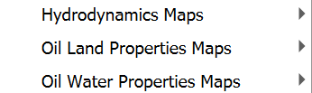{ width=50% }

The mapping tools in the plugin enable users to visualize simulation results in both cell-based and raster formats. The plugin provides specialized tools for different types of analyses, including:

-   Time-dependent maps for various hydraulic parameters (Results vs Time Maps)

-   Maximum value maps showing peak conditions (Maximum Result Maps)

-   Hazard intensity maps for risk assessment (Hazard Intensity Maps)

-   Time-depth maps for flood progression analysis (Time-to-Depth Maps)

-   Element concentration or fractions maps for pollutant/sediment/mud transport (Element Concentration Maps)

-   Hydro-Economic Evaluation of Flood (HEEF) maps (Hydro-Economic Evaluation of Flood Map)

## Results vs Time Maps
The Results vs Time Maps tool allows users to create and visualize time-dependent maps of various hydraulic parameters from model simulations.

### Dialog Window

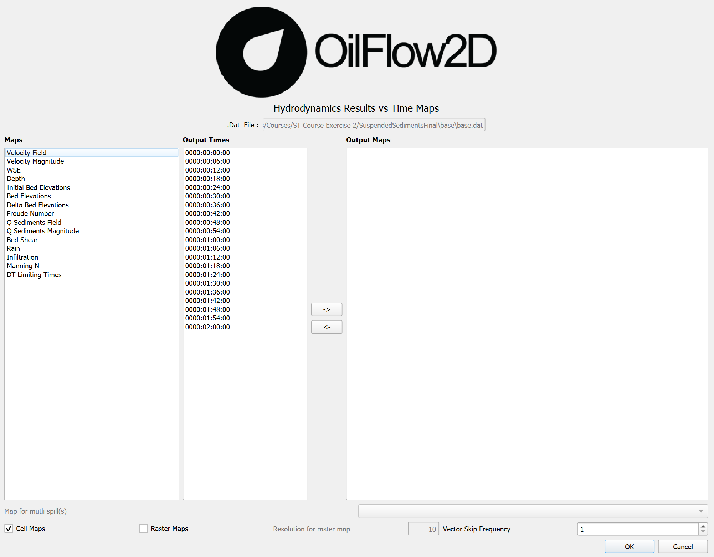{ width=100% }

### Dialog Controls
[]{#tab:results_vs_time_maps_controls label="tab:results_vs_time_maps_controls"}

| Output File List | *text field* | Displays the path to the simulation results file (read-only). |
| --- | --- | --- |
| Maps | *list view* | Displays available map types that can be selected for visualization, such as Velocity Field, Velocity Magnitude, WSE, Depth, etc. |
| Output Times | *list view* | Displays available simulation output times that can be selected for visualization. |
| Arrow Buttons (→, ←) | *buttons* | Transfer selected maps and times to/from the Output Maps list. |
| Output Maps | *list view* | Shows the maps that will be created when OK is clicked. |
| Cell Maps | *checkbox* | Enables cell-based (vector polygon) map output. |
| Raster Maps | *checkbox* | Enables raster map output. |
| Resolution for raster map | *text field* | Sets the resolution for raster interpolation, in projected units. Only enabled when \"Raster Maps\" is checked. |
| Vector Skip Frequency | *spinner* | Sets the number of vectors to skip between each vector in vector-type maps, controlling display density. |
| OK | *button* | Creates the selected maps and adds them to the QGIS project. |
| Cancel | *button* | Closes the dialog without making changes. |

### Results vs Time Map Types
The Results vs Time Maps tool can generate the following maps:

| Velocity | m/s or ft/s | Vector field showing flow velocity direction and magnitude with arrows. |
| --- | --- | --- |
| Velocity Magnitude | m/s or ft/s | Scalar field showing the magnitude of flow velocity. |
| WSE | m or ft | Water surface elevation at each computational cell. |
| Depth | m or ft | Water depth at each computational cell. |
| Initial Bed Elevations | m or ft | Initial bed elevation at each computational cell (available when sediment transport module is active). |
| Bed Elevations | m or ft | Current bed elevation at each computational cell (available when sediment transport module is active). |
| Delta Bed Elevations | m or ft | Change in bed elevation from initial conditions (available when sediment transport module is active). |
| Froude Number | dimensionless | Local Froude number at each computational cell. |
| Q Sediments Field | m³/s or ft³/s per unit width | Creates vector field from sediment transport components in columns 9-11, with arrows showing direction and relative magnitude. Available only with sediment transport module. |
| Q Sediments Magnitude | m³/s or ft³/s per unit width | Extracts sediment transport magnitude from column 11, applies Equal Interval classification with 9 classes. Available only with sediment transport module. |
| Bed Shear | Pa or lbf/ft² | Bed shear stress at each computational cell (available when sediment transport module is active). |
| Rain | mm/hr or in/hr | Rainfall intensity at each computational cell (available when rainfall module is active). |
| Infiltration | mm/hr or in/hr | Infiltration rate at each computational cell (available when infiltration module is active). |
| Manning N | s$\cdot$m$^{-1/3}$ or s$\cdot$ft$^{-1/3}$ | Manning's roughness coefficient at each computational cell. |
| DT Limiting Times | dimensionless | Time step limiting factors at each computational cell. |

### Workflow
To generate maps using the Results vs Time Maps tool, follow these steps:

1.  Ensure you have completed a simulation and have output files available.

2.  From the Results vs Time Maps menu, click on \"*Results vs Time Maps*\"

    { width=5% }.

    

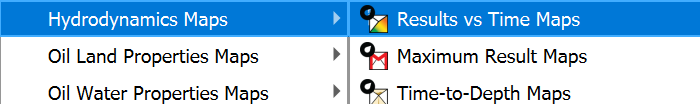{ width=50% }

3.  In the dialog that appears, the current scenario directory should be automatically selected. If not, browse to the appropriate directory containing your simulation results.

4.  Select one or more map types from the list by checking the corresponding map names:

    

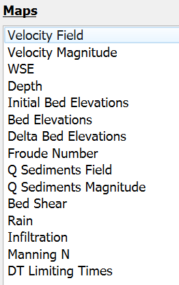{ width=30% }

5.  Select the output times you want to visualize. Hold down the Control key to select multiple times.

    
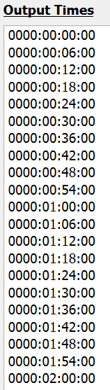{ width=10% }

6.  Transfer the selected maps and times to the *Output Maps* list by clicking the right arrow button { width=5% }.

7.  If you wish to remove a map or time from the *Output Maps* list, select it and click the left arrow button 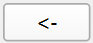{ width=5% }.

8.  Choose the output format: Check *Cell Maps* to create polygon-based maps or check *Raster Maps* to create grid-based maps with interpolation (or both!).

    

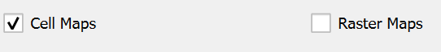{ width=40% }

9.  If *Raster Maps* is selected, specify the raster resolution in the projected units (ft or m).

    

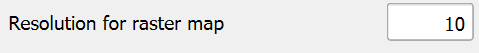{ width=40% }

10. If a vector map such as *Velocity Field* is selected, you can specify the *Vector Skip Frequency* to control the density of the vectors.

    

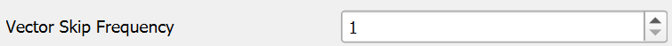{ width=50% }

11. Click \"OK\" to generate the maps.

12. The generated maps will be added to the QGIS layer panel under the \"OUTPUT_RESULTS\" group.

13. You can now manipulate these layers like any other QGIS layer, adjusting styling, transparency, etc.

### Requirements
| Active Project | An active project must be loaded in QGIS. |
| --- | --- |
| Simulation Results | A completed simulation with output files in the project's scenario directory. |
| Required Data Files | The following files must be present in the scenario directory: |

### Technical Information
The following table provides technical details on how each map type is processed and visualized. Legend values are displayed in metric units (m, m/s, m$^2$/s, etc.) when the project is in metric mode, and English units (ft, ft/s, ft$^2$/s, etc.) when in English mode. The unit system is automatically detected based on the QGIS project settings.

| Velocity Field | Creates vector field visualization from velocity components ($v_x$, $v_y$) in columns 0-1, with arrow size scaled by $v_{mag} = \sqrt{v_x^2 + v_y^2}$. Applies vector skip frequency for density control and uses graduated color ramp from blue to red based on magnitude. |
| --- | --- |
| Velocity Magnitude | Extracts scalar velocity magnitude (m/s or ft/s) from column 2, applies Quantile classification with 9 classes and blue-to-red color ramp. Excludes values below 0.01 m/s (or ft/s). |
| WSE (Water Surface Elevation) | Reads WSE values (m or ft) from column 3, applies Equal Interval classification with 9 classes. Handles no-data values (-9999.0) by using minimum WSE as lower bound. |
| Depth | Processes depth values (m or ft) from column 4 using Equal Interval classification with 9 classes and blue color ramp. Excludes depths below 0.01 m (or ft). |
| Initial Bed Elevations | Reads values (m or ft) from column 5, applies Equal Interval classification with 8 classes and specialized topographic color ramp. Handles no-data values (-9999.0) by excluding them. |
| Bed Elevations | Processes current bed elevation (m or ft) from column 6 using Equal Interval classification with 8 classes and topographic color ramp. Available only with sediment transport module. |
| Delta Bed Elevations | Calculates bed elevation changes (m or ft) from column 7, uses Equal Interval classification with 8 classes and diverging color ramp centered on zero. Available only with sediment transport module. |
| Froude Number | Processes Froude numbers from column 8 using Equal Interval classification with 9 classes. Color ramp highlights subcritical ($Fr < 1$) and supercritical ($Fr > 1$) flow regions. |
| Q Sediments Field | Creates vector field from sediment transport components in columns 9-11, with arrows showing direction and relative magnitude. Vector components (vx, vy) are in sediment transport units (m³/s or ft³/s per unit width), and the magnitude (vm) is in column 11. Available only with sediment transport module. |
| Q Sediments Magnitude | Extracts sediment transport magnitude (m³/s or ft³/s per unit width) from column 11, applies Equal Interval classification with 9 classes. Available only with sediment transport module. |
| Bed Shear | Processes bed shear stress (N/m² or lb/ft²) from column 12 using Equal Interval classification with 9 classes. Available only with sediment transport module. |
| Rain | Reads rainfall intensity (mm/hr or in/hr) from column 13, applies Equal Interval classification with 9 classes. Available only with rainfall module. |
| Infiltration | Processes infiltration rates (mm/hr or in/hr) from column 14 using Equal Interval classification with 9 classes. Available only with infiltration module. |
| Manning N | Displays Manning's roughness coefficient from column 15 using Equal Interval classification with 9 classes to show spatial distribution of roughness values. |
| DT Limiting Times | Shows time step limiting factors from column 16 using Equal Interval classification with 5 classes. Vector output only, excludes zero values. |

## Maximum Result Maps
The Maximum Result Maps tool generates maps showing the maximum values reached during a simulation for various hydraulic parameters.

### Dialog Window

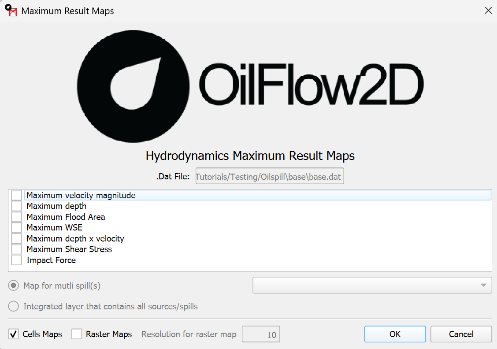{ width=100% }

You can reach this dialog by clicking on the *Maximum Result Maps* button under the *Hydrodynamic Maps* menu in the *Results vs Time Maps* tool:

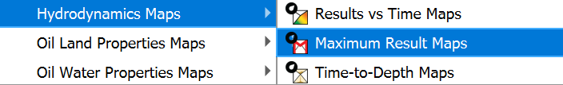{ width=50% }

### Dialog Controls
[]{#tab:max_value_cell_controls label="tab:max_value_cell_controls"}

| Maximum Value File | *text field* | Displays the path to the simulation results file (read-only). |  |
| --- | --- | --- | --- |
| Value Selector | *list widget* | List of available oil property maximum value map types that can be selected for visualization. |  |
| Map for multi spill(s) | *radio button | dropdown* | Option to create maps for a specific spill selected from the dropdown when multiple spills are present in the simulation. |
| Integrated layer that contains all sources/spills | *radio button* | Option to create a single map that integrates data from all spills in the simulation. |  |
| Cells Maps | *checkbox* | Enables cell-based (vector polygon) map output. Checked by default. |  |
| Raster Maps | *checkbox* | Enables raster map output. |  |
| Resolution for raster map | *text field* | Sets the resolution for raster interpolation, in projected units. Only enabled when \"Raster Maps\" is checked. Default value is 10. |  |
| OK | *button* | Creates the selected maximum value maps and adds them to the QGIS project. |  |
| Cancel | *button* | Closes the dialog without making changes. |  |

### Maximum Value Map Types
The Maximum Result Maps tool for OilFlow2D can generate maximum value maps for the following parameters:

| Maximum Oil Temperature | °C or °F | Maximum oil temperature reached at each location during the simulation. |
| --- | --- | --- |
| Maximum Oil Density | kg/m³ or lb/ft³ | Maximum oil density reached at each location during the simulation. |
| Maximum Oil Viscosity | Pa·s or lb·s/ft² | Maximum oil viscosity reached at each location during the simulation. |
| Maximum Oil Yield Stress | Pa or lb/ft² | Maximum oil yield stress reached at each location during the simulation. |

Additionally, when accessing the Hydrodynamic Maximum Result Maps, these map types are available:

| Maximum Velocity Magnitude | m/s or ft/s | Maximum flow velocity magnitude reached at each location during the simulation. |
| --- | --- | --- |
| Maximum Depth | m or ft | Maximum water depth reached at each location during the simulation. |
| Maximum Flood Area | n/a | Polygon outlining the maximum extent of flooding throughout the simulation. |
| Maximum WSE | m or ft | Maximum water surface elevation reached at each location during the simulation. |
| Maximum Depth x Velocity | m²/s or ft²/s | Maximum product of depth and velocity (DV) reached at each location, used for hazard assessment. |
| Maximum Shear Stress | N/m² or lbf/ft² | Maximum bed shear stress reached at each location during the simulation. |
| Impact Force | N/m² or lbf/ft² | Maximum impact force reached at each location, calculated from flow momentum and density. |

### Workflow
To generate maps using the Maximum Result Maps tool, follow these steps:

1.  Ensure you have completed a model simulation with the *Output maximum files* option enabled and have output files available, the *Output maximum files* option is available in the *Control Data* tab of the Hydronia Data Input Program.

    

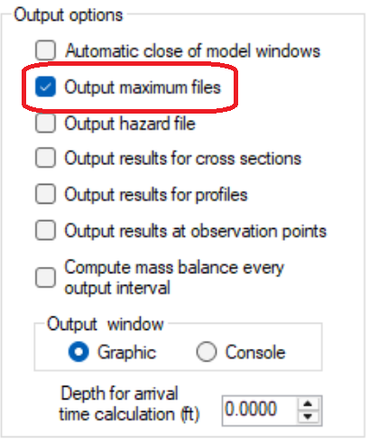{ width=30% }

2.  From the *Results vs Time Maps* menu, click on *Hydrodynamic Maps* then *Maximum Result Maps*. { width=5% }.

    

{ width=50% }

3.  In the dialog that appears, the current scenario directory should be automatically selected. If not, browse to the appropriate directory containing your simulation results.

4.  Select one or more map types from the list by checking the corresponding checkboxes:

    

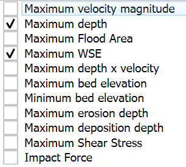{ width=30% }

5.  Choose the output format:

    -   Check *Cell Maps* to create polygon-based maps (triangular mesh).

    -   Check *Raster Maps* to create grid-based maps with interpolation.

    -   If *Raster Maps* is selected, specify the raster resolution in project units (ft or m).

        

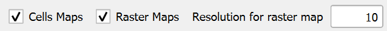{ width=60% }

6.  Click \"OK\" to generate the map(s).

7.  The generated map(s) will be added to the QGIS layer panel under the \"OUTPUT_RESULTS\" group.

The map(s) will show maximum values reached during the entire simulation period, regardless of when those maximum values occurred.

### Requirements
| Active Project | An active project must be loaded in QGIS. |
| --- | --- |
| Simulation Results | A completed model simulation with the *Output maximum files* option enabled and have output files available, the *Output maximum files* option is available in the *Control Data* tab of the Hydronia Data Input Program. |
| Required Data Files | The following files must be present in the scenario directory: |

### Technical Information
The following table provides technical details on how each map type is processed and visualized:

| Velocity Magnitude | The tool scans all time steps in the `cell_*_max.textout` files and identifies the maximum velocity magnitude value for each computational cell. Graduated symbology is applied using the Quantile classification method with a color ramp from blue (low) to red (high). Values below 0.01 m/s are excluded. |
| --- | --- |
| Depth | The tool analyzes all time steps and extracts the maximum water depth value for each computational cell. Equal Interval classification is used for graduated symbology, providing a consistent color scale from light blue (shallow) to dark blue (deep). Values below 0.01 m are excluded. |
| Maximum Flood Area | Creates a polygon by dissolving all cells where maximum depth exceeds a threshold value (typically 0.01 m). The total flooded area and volume are calculated and stored as polygon attributes. |
| WSE (Water Surface Elevation) | Maximum water surface elevation is determined for each cell. Equal Interval classification is used with a specialized color ramp. No-data values (-9999.0) are handled by using the minimum valid WSE as the lower bound. |
| Depth x Velocity | Maximum product of depth and velocity (DV) is calculated for each cell. Equal Interval classification is used with a color ramp highlighting hazard levels based on standard thresholds. |
| Maximum Shear Stress | Maximum bed shear stress is extracted from sediment transport calculations. Equal Interval classification is used with a color ramp from blue (low) to red (high). Only available with sediment transport module. |
| Impact Force | Maximum impact force is calculated from flow momentum and density. Equal Interval classification is used with a color ramp highlighting areas of significant impact potential. |
| DT Limiting Times | Shows time step limiting factors using 5-class Equal Interval classification. Vector output only, with zero values excluded. Used to identify areas controlling simulation stability. |
| Maximum Bed Elevation | Maximum bed elevation is tracked during sediment transport simulations. Equal Interval classification with topographic color ramp. Only available with sediment transport module. |
| Minimum Bed Elevation | Minimum bed elevation is tracked during sediment transport simulations. Equal Interval classification with topographic color ramp. Only available with sediment transport module. |
| Maximum Erosion Depth | Maximum erosion depth is calculated from bed elevation changes. Equal Interval classification with specialized color ramp. Only available with sediment transport module. |
| Maximum Deposition Depth | Maximum deposition depth is calculated from bed elevation changes. Equal Interval classification with specialized color ramp. Only available with sediment transport module. |

## Time-to-Depth Maps
The Time-to-Depth Maps tool creates maps that analyze the temporal aspects of flooding by correlating water depths with specific times during a simulation. This tool is particularly useful for understanding flood dynamics, such as inundation timing, duration of flooding, and wave propagation. Users can generate maps showing when specific water depths are reached, how long areas remain underwater, and when flood waves first arrive at different locations.

### Dialog Window
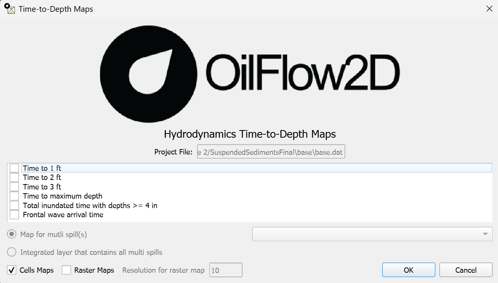{ width=.8\textwidth }

### Dialog Controls
[]{#tab:time_depth_controls label="tab:time_depth_controls"}

| Project File | *text field* | Displays the path to the simulation results file (read-only). |
| --- | --- | --- |
| Map Type List | *checkbox list* | List of available time-to-depth map types that can be selected. |
| Cells Maps | *checkbox* | Enables vector (cell-based) map output. |
| Raster Maps | *checkbox* | Enables raster map output. |
| Resolution for raster map | *textbox* | Sets the resolution for raster interpolation, in meters. Only enabled when Raster Maps is checked. |
| OK | *button* | Creates the selected time-to-depth maps and adds them to the QGIS project. |
| Cancel | *button* | Closes the dialog without making changes. |

### Time-Depth Analysis Maps
The Time-to-Depth Maps tool supports the following map types:

| Time to 1 ft (0.30 m) | hours | Shows the time when water depth first reaches 1 ft (0.30 m) at each location. |
| --- | --- | --- |
| Time to 2 ft (0.50 m) | hours | Shows the time when water depth first reaches 2 ft (0.50 m) at each location. |
| Time to 3 ft (1 m) | hours | Shows the time when water depth first reaches 3 ft (1 m) at each location. |
| Time to maximum depth | hours | Shows the time when water depth reaches its maximum value at each location. |
| Total inundated time with depths $>=$ 4 in (0.1 m) | hours | Shows the total duration for which water depth exceeds 4 in (0.1 m) at each location. |
| Frontal wave arrival time | hours | Shows the time when water first arrives at each location, typically using a very small depth threshold. |

### Workflow
To generate time-to-depth maps, follow these steps:

1.  Ensure you have completed a RiverFlow2D simulation and have output files available.

2.  From the *Results vs Time Maps* menu, navigate to the *Hydrodynamic Maps* submenu, then click on *Time-to-Depth Maps* { height=5% }.

    

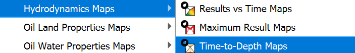{ width=60% }

3.  In the dialog that appears, the current scneario directory and project file information should be automatically populated.

4.  Select one or more map types from the list by checking the corresponding checkboxes:

    -   Time to 1 ft (0.30 m) - Shows when water depth first reaches 1 ft/0.30 m

    -   Time to 2 ft (0.50 m) - Shows when water depth first reaches 2 ft/0.50 m

    -   Time to 3 ft (1 m) - Shows when water depth first reaches 3 ft/1 m

    -   Time to maximum depth - Shows when maximum water depth occurs

    -   Total inundated time with depths $>=$ 4 in (0.1 m) - Shows duration above threshold

    -   Frontal wave arrival time - Shows when water first arrives

5.  Choose the output format:

    -   Check \"Cells Maps\" to create polygon-based maps (cell-centered).

    -   Check \"Raster Maps\" to create grid-based maps with interpolation.

    -   If \"Raster Maps\" is selected, specify the raster resolution in meters.

        

{ width=60% }

6.  Click \"OK\" to generate the selected time-to-depth maps.

7.  The generated maps will be added to the QGIS layer panel under the \"OUTPUT_RESULTS\" group.

8.  The maps will display time values (in hours) based on the selected map types.

### Requirements
| Active Project | An active project must be loaded in QGIS. |
| --- | --- |
| Simulation Results | A completed simulation with output files in the project's scenario directory. |
| Required Data Files | The following files must be present in the scenario directory: |

### Technical Information
The Time-to-Depth Maps tool processes time-series data from model simulations and generates maps based on the following calculations:

| Time to 1 ft (0.30 m) | For each cell, the algorithm analyzes the time series of water depths and identifies the first time step where $depth \geq 0.30$ m (or 1 ft). The formula is: $t_{0.30m} = min(t)$ where $depth(t) \geq 0.30$ m. If the threshold is never reached, the cell is excluded from the map. |
| --- | --- |
| Time to 2 ft (0.50 m) | For each cell, the algorithm analyzes the time series of water depths and identifies the first time step where $depth \geq 0.50$ m (or 2 ft). The formula is: $t_{0.50m} = min(t)$ where $depth(t) \geq 0.50$ m. If the threshold is never reached, the cell is excluded from the map. |
| Time to 3 ft (1 m) | For each cell, the algorithm analyzes the time series of water depths and identifies the first time step where $depth \geq 1.0$ m (or 3 ft). The formula is: $t_{1.0m} = min(t)$ where $depth(t) \geq 1.0$ m. If the threshold is never reached, the cell is excluded from the map. |
| Time to maximum depth | For each cell, the algorithm finds the time step at which the maximum water depth occurs during the entire simulation. The formula is: $t_{max} = t$ where $depth(t) = max(depth)$ for all time steps. |
| Total inundated time with depths $>= 4$ in (0.1 m) | For each cell, the algorithm calculates the cumulative time for which the water depth exceeds 0.1 m (or 4 in). The formula is: $t_{total} = \sum \Delta t$ for all time steps where $depth(t) \geq 0.1$ m. |
| Frontal wave arrival time | For each cell, the algorithm identifies the earliest time step at which water is present (typically using a very small depth threshold). The formula is: $t_{arrival} = min(t)$ where $depth(t) > 0$ (or some small threshold). |

## Hazard Intensity Maps
The Hazard Intensity Maps tool allows users to create maps that classify flood hazards based on various international standards for assessing flood risk to people, vehicles, and structures.

### Dialog Window

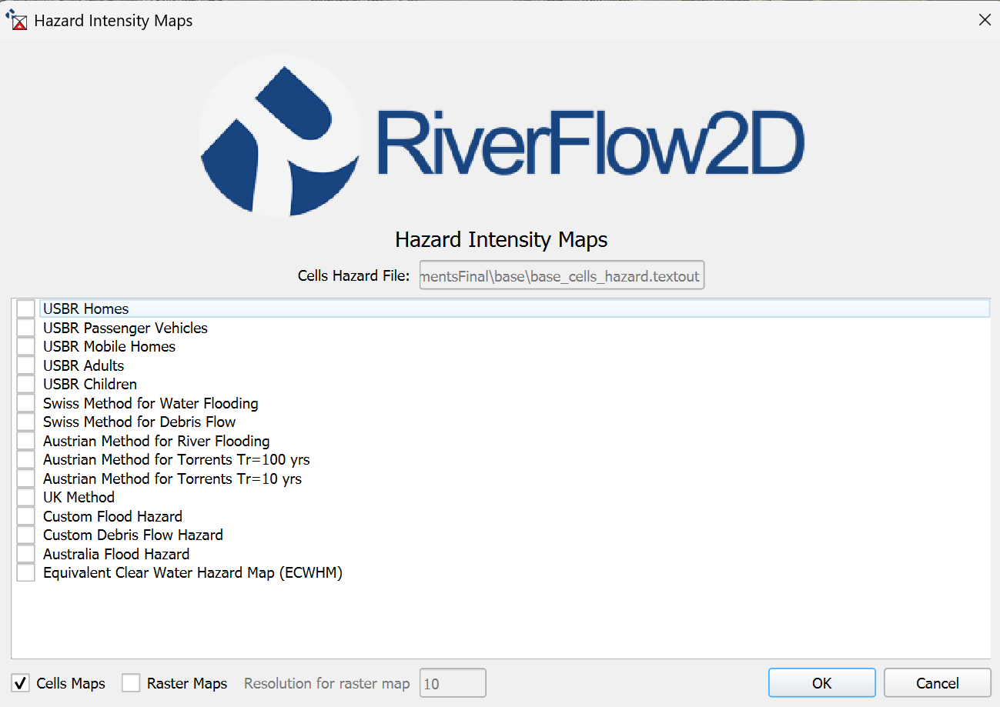{ width=80% }

### Dialog Controls
[]{#tab:hazard_intensity_controls label="tab:hazard_intensity_controls"}

| Cells Hazard File | *file browser* | Displays the directory containing simulation results. |
| --- | --- | --- |
| Map Type List | *checkbox list* | Selects the hazard classification method to use (DEFRA, Australian, FEMA, Swiss, or Russo). |
| Cell Maps | *checkbox* | Enables vector (cell-based) map output. |
| Raster Maps | *checkbox* | Enables raster map output. |
| Resolution (m) | *textbox* | Sets the resolution for raster interpolation, in meters. |
| OK | *button* | Creates the hazard intensity map and adds it to the QGIS project. |
| Cancel | *button* | Closes the dialog without making changes. |

### Hazard Classification Methods
The Hazard Intensity Maps tool supports several standard hazard classification methods:

| USBR Homes | US Bureau of Reclamation classification for residential homes, focused on structural damage risk. |
| --- | --- |
| USBR Passenger Vehicles | US Bureau of Reclamation classification for vehicle safety during flooding events. |
| USBR Mobile Homes | US Bureau of Reclamation classification specific to mobile/manufactured homes. |
| USBR Adults | US Bureau of Reclamation classification for adult human safety during flooding. |
| USBR Children | US Bureau of Reclamation classification for child safety during flooding, with more conservative thresholds. |
| Swiss Method for Water Flooding | Swiss federal classification system for clear water flood hazards, focusing on structural impacts. |
| Swiss Method for Debris Flow | Modified Swiss classification adjusted for the greater destructive potential of debris flows. |
| Austrian Method for River Flooding | Austrian classification method for riverine flooding scenarios. |
| Austrian Method for Torrents Tr=100 yrs | Austrian classification for torrent flooding with 100-year return period. |
| Austrian Method for Torrents Tr=10 yrs | Austrian classification for torrent flooding with 10-year return period. |
| UK Method | UK Department for Environment, Food and Rural Affairs (DEFRA) method based on depth and velocity combinations. |
| Custom Flood Hazard | User-defined classification method for specialized flood hazard assessment. |
| Custom Debris Flow Hazard | User-defined classification method for specialized debris flow hazard assessment. |
| Australia Flood Hazard | Australian hazard classification method, emphasizing velocity as a significant factor. |
| Equivalent Clear Water Hazard Map (ECWHM) | Specialized map for mud/debris flows that converts the higher hazard of mud into an equivalent clear water hazard. |

Each hazard category is visually represented with a distinct color coding scheme appropriate to the selected method, typically ranging from low hazard (green/blue) to extreme hazard (red).

### Workflow
To generate hazard intensity maps, follow these steps:

1.  Ensure you have completed a model simulation with the *Output hazard files* option enabled and have output files available, the *Output hazard files* option is available in the *Control Data* tab of the Hydronia Data Input Program.

    

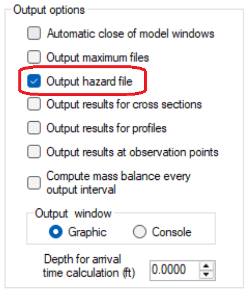{ width=30% }

2.  From the *Results vs Time Maps* menu, click on *Hazard Intensity Maps*

    { width=5% }.

    

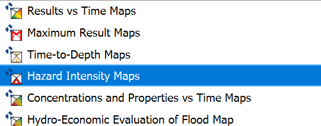{ width=50% }

3.  In the dialog that appears, the current scenario directory should be automatically selected. If not, browse to the appropriate directory containing your simulation results.

4.  Select one or more hazard classification methods from the list by checking the corresponding checkboxes:

    -   USBR Homes - Classification for residential structural damage risk

    -   USBR Passenger Vehicles - Classification for vehicle safety

    -   USBR Mobile Homes - Classification for mobile/manufactured homes

    -   USBR Adults - Classification for adult human safety

    -   USBR Children - Classification for child safety with conservative thresholds

    -   Swiss Method for Water Flooding - Swiss classification for clear water hazards

    -   Swiss Method for Debris Flow - Swiss classification adapted for debris flows

    -   Austrian Method for River Flooding - Austrian method for riverine flooding

    -   Austrian Method for Torrents Tr=100 yrs - For torrent flooding with 100-year return period

    -   Austrian Method for Torrents Tr=10 yrs - For torrent flooding with 10-year return period

    -   UK Method - DEFRA method based on depth and velocity combinations

    -   Custom Flood Hazard - User-defined method for specialized flood assessments

    -   Custom Debris Flow Hazard - User-defined method for debris flow assessments

    -   Australia Flood Hazard - Australian method emphasizing velocity factors

    -   Equivalent Clear Water Hazard Map (ECWHM) - For mud/debris flow conversions

5.  Choose the output format:

    -   Check *Cell Maps* to create polygon-based maps (triangular mesh).

    -   Check *Raster Maps* to create grid-based maps with interpolation.

    -   If *Raster Maps* is selected, specify the raster resolution in meters (ft or m).

        

{ width=60% }

6.  Click \"OK\" to generate the hazard intensity map.

7.  The generated map will be added to the QGIS layer panel under the \"OUTPUT_RESULTS\" group.

8.  The map will display hazard categories based on the combination of maximum water depth and maximum velocity reached during the simulation period.

### Requirements
| Active Project | An active project must be loaded in QGIS. |
| --- | --- |
| Simulation Results | A completed model simulation with the *Output hazard files* option enabled and have output files available, the *Output hazard files* option is available in the *Control Data* tab of the Hydronia Data Input Program. |
| Required Data Files | The following files must be present in the scenario directory: |

### Technical Information
The tool processes data from `*_cells_hazard.textout` files, which contain precalculated hazard indicators for each computational cell in the model domain. The following table provides technical details about how each hazard classification method is calculated and visualized:

| USBR Homes | US Bureau of Reclamation classification for residential homes. The algorithm applies the following criteria: |
| --- | --- |
| USBR Passenger Vehicles | US Bureau of Reclamation classification for vehicle safety during flooding: |
| USBR Mobile Homes | US Bureau of Reclamation classification for mobile/manufactured homes: |
| USBR Adults | US Bureau of Reclamation classification for adult human safety: |
| USBR Children | US Bureau of Reclamation classification for child safety with more conservative thresholds: |
| Swiss Method for Water Flooding | The Swiss method classifies hazards based on depth and velocity with a focus on potential damage to structures: |
| Swiss Method for Debris Flow | Similar to the water flooding method but adjusted for the greater destructive potential of debris flows: |
| Austrian Method for River Flooding | The Austrian method uses a simpler three-category classification focused on depth thresholds: |
| Austrian Method for Torrents Tr=100 yrs | Austrian classification for torrent flooding with 100-year return period: |
| Austrian Method for Torrents Tr=10 yrs | Austrian classification for torrent flooding with 10-year return period: |
| UK Method | UK Department for Environment, Food and Rural Affairs (DEFRA) method categorizes hazards based on depth, velocity, and their product: |
| Custom Flood Hazard | User-defined classification method for specialized flood hazard assessment. Parameters are specified by the user in a custom configuration file with format: |
| Custom Debris Flow Hazard | User-defined classification method for specialized debris flow hazard assessment, with similar format to Custom Flood Hazard but with additional parameters: |
| Australia Flood Hazard | The Australian method emphasizes velocity in hazard determination with a six-category system: |
| Equivalent Clear Water Hazard Map (ECWHM) | Specialized map for mud/debris flows that converts higher hazard of mud into equivalent clear water hazard: |

## Concentrations and Properties vs Time Maps
The Concentrations and Properties vs Time Maps tool visualizes the transport and dispersion of tracers or pollutants in the simulation.

### Dialog Window

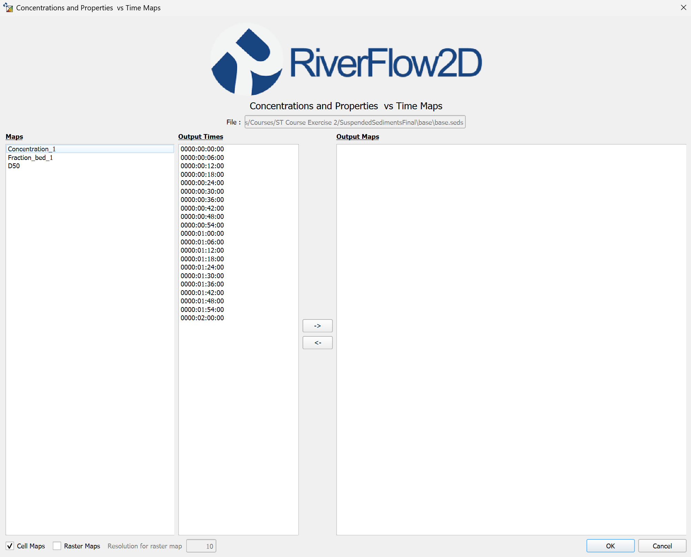{ width=100% }

You can reach this dialog by clicking on the *Concentrations and Properties vs Time Maps* button in the *Results vs Time Maps* tool:

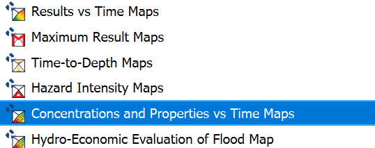{ width=50% }

### Dialog Controls
[]{#tab:element_concentration_controls label="tab:element_concentration_controls"}

| Scenario Directory | *file browser* | Selects the directory containing simulation results. |
| --- | --- | --- |
| Map Type | *list view* | Selects the concentration maps to create, including: Concentration, Maximum Concentration, and Time of Maximum Concentration. |
| Output Times | *list view* | Displays available simulation output times that can be selected for visualization. |
| Arrow Buttons (→, ←) | *buttons* | Transfer selected maps and times to/from the Output Maps list. |
| Output Maps | *list view* | Shows the maps that will be created when OK is clicked. |
| Cell Maps | *checkbox* | Enables vector (cell-based) map output. |
| Raster Maps | *checkbox* | Enables raster map output. |
| Resolution for raster map | *textbox* | Sets the resolution for raster interpolation, in projected units. |
| OK | *button* | Creates the selected concentration maps and adds them to the QGIS project. |
| Cancel | *button* | Closes the dialog without making changes. |

### Concentrations Map Types
The Concentrations and Properties vs Time Maps tool can generate different map types depending on the transport module being used:

| Pollutant Transport (.solutes) | dimensionless (0-1) |  |
| --- | --- | --- |
| Sediment Transport (.seds) |  |  |
|  |  |  |
| Mud/Debris Flow (.mud) |  |  |

For each map type, users can generate time-dependent maps showing values at specific time steps, or create maximum value maps showing the peak values reached during the simulation. Legend units are displayed in metric or English units based on the QGIS project settings.

### Workflow
To generate maps using the Concentrations and Properties vs Time Maps tool, follow these steps:

1.  Ensure you have completed a simulation with sediment/pollutant transport and have output files available.

2.  From the Results vs Time Maps menu, click on \"Concentrations and Properties vs Time Maps\".

3.  In the dialog that appears, the current scenario directory should be automatically selected. If not, browse to the appropriate directory containing your simulation results.

4.  Select one or more map types to generate from the available options. The specific maps will depend on which transport module is active in your simulation:

    -   For **Pollutant Transport** (.solutes):

        -   `Conc_1`, `Conc_2`, etc. - Concentration values for each chemical species (mg/L or ppm)

    -   For **Sediment Transport** (.seds):

        -   `Concentration_1`, `Concentration_2`, etc. - Suspended sediment concentration (g/L or ppm)

        -   `Fraction_bed_1`, `Fraction_bed_2`, etc. - Bed composition (dimensionless fraction, 0-1)

        -   `D50` - Median grain size distribution (mm or in)

    -   For **Mud/Debris Flow** (.mud):

        -   `Conc_1`, `Conc_2`, etc. - Individual fraction concentrations (g/L or ppm)

        -   `Conc_Total` - Total concentration (g/L or ppm)

        -   `Density` - Mixture density (kg/m³ or lb/ft³)

        -   `Viscosity` - Mixture viscosity (Pa·s or lb·s/ft²)

        -   `YieldStress` - Mixture yield stress (Pa or lb/ft²)

        -   `Hdep` - Deposition depth (m or ft)

        -   `Fraction_bed_1`, `Fraction_bed_2`, etc. - Composition of deposited material (dimensionless fraction, 0-1)

        -   `D50` - Median grain size of deposited material (mm or in)

5.  Select the output times you want to visualize. Hold down the Control key to select multiple times.

6.  Transfer the selected maps and times to the *Output Maps* list by clicking the right arrow button { width=5% }.

7.  If you wish to remove a map or time from the *Output Maps* list, select it and click the left arrow button { width=5% }.

8.  Choose the output format:

    -   Check *Cell Maps* to create polygon-based maps (triangular mesh).

    -   Check *Raster Maps* to create grid-based maps with interpolation.

    -   If *Raster Maps* is selected, specify the raster resolution in meters (ft or m).

        

{ width=60% }

9.  Click \"OK\" to generate the concentration maps.

10. The generated maps will be added to the QGIS layer panel under the \"OUTPUT_RESULTS\" group.

### Requirements
| Active Project | An active project must be loaded in QGIS. |
| --- | --- |
| Simulation Type | A completed simulation with one of the following modules activated: |
| Required Data Files | The following files must be present in the scenario directory: |
| Concentration Data | The simulation must have output data for at least one pollutant/sediment/mud concentrations or properties. |

### Technical Information
The following table provides technical details on how different file types are processed and how maps are generated:

| File Type Detection | The tool examines the project's `.dat` file to determine which transport modules are active: |
| --- | --- |
| Pollutant Transport Maps | For `.solutes` files, the tool processes: |
| Sediment Transport Maps | For `.seds` files, the tool processes: |
| Mud/Debris Flow Maps | For `.mud` files, the tool processes: |
| Concentration Maps | For time-dependent concentration maps: |
| Maximum Concentration Maps | For maximum concentration maps: |
| Time of Maximum Concentration Maps | For time of maximum concentration maps: |
| Vector Cell Map Creation | For cell-based (vector) maps: |
| Raster Map Creation | For raster maps, the tool uses TIN (Triangulated Irregular Network) interpolation: |
| Time Series Filtering | The `.outfiles` file is used to: |
| Multi-Element Selection | For models with multiple transported elements (pollutants or sediment fractions): |

The technical implementation ensures that concentration and property maps accurately represent the numerical results from the transport simulation while providing visually informative representations. For simulations with multiple elements or fractions, the tool maintains the distinction between different constituents, enabling detailed analysis of transport and mixing processes. The option to generate both vector-based and raster-based outputs provides flexibility for different visualization and analysis needs.

## Hydro-Economic Evaluation of Flood Map
The Hydro-Economic Evaluation of Flood Map tool integrates flood hazard information with exposure data to assess risk.

### Dialog Window
<figure id="fig:heef_maps_dialog">

<figcaption>HEEF Maps Dialog</figcaption>
</figure>

### Dialog Controls
[]{#tab:heef_maps_controls label="tab:heef_maps_controls"}

| Scenario Directory | *file browser* | Selects the directory containing simulation results. |
| --- | --- | --- |
| Exposure Layer | *layer selector* | Selects the vector layer containing exposure information (buildings, infrastructure, etc.). |
| Hazard Method | *dropdown* | Selects the hazard classification method to use. |
| HEEF Method | *dropdown* | Selects the HEEF risk assessment method to use. |
| OK | *button* | Creates the HEEF risk map and adds it to the QGIS project. |
| Cancel | *button* | Closes the dialog without making changes. |

### HEEF Map Types
The Hydro-Economic Evaluation of Flood Map tool can generate the following map types:

| Damage Map | Shows estimated damage in monetary units (e.g., dollars) for each cell in the domain based on the selected damage assessment method. |
| --- | --- |
| Normalized Damage Map | Shows damage as a percentage of the total value of assets in each cell. |
| Maximum Depth Map | Displays the maximum water depth reached during the simulation. This is used in the damage calculations. |
| Land Use Map | Shows the land use categories assigned to each cell. Different damage functions are applied based on land use. |

### Workflow
To generate maps using the Hydro-Economic Evaluation of Flood Map tool, follow these steps:

1.  Ensure you have completed a RiverFlow2D simulation and have output files available.

2.  From the Results vs Time Maps menu, click on \"Hydro-Economic Evaluation of Flood Map\".

3.  In the dialog that appears:

    -   Select the directory containing the simulation results.

    -   Select a land use raster file from the dropdown menu (this should be a GeoTIFF file with land use categories).

    -   Choose a damage assessment method from the dropdown menu (e.g., USACE, FEMA, HAZUS, custom).

    -   Optionally, select a depth-damage function file if using a custom damage assessment method.

    -   Select a currency for damage calculations (e.g., USD, EUR, GBP).

    -   Enter property values for each land use category, or use the default values provided.

4.  Choose the output format:

    -   Check *Cell Maps* to create polygon-based maps (triangular mesh).

    -   Check *Raster Maps* to create grid-based maps with interpolation.

    -   If *Raster Maps* is selected, specify the resolution in meters (ft or m).

5.  Click \"Calculate\" to perform the damage assessment calculation.

6.  A progress bar will display the calculation status.

7.  Once complete, select which map types to generate from the \"Select Maps\" list.

8.  Click \"OK\" to generate the selected maps.

9.  The generated maps will be added to the QGIS layer panel under the \"OUTPUT_RESULTS\" group.

10. A summary report with damage statistics will also be generated and can be accessed through the \"View Report\" button.

### Requirements
| Active Project | An active project must be loaded in QGIS. |
| --- | --- |
| Simulation Results | A completed simulation with output files in the project's scenario directory. |
| Required Data Files | The following files must be present in the scenario directory: |
| Land Use Data | A land use raster file (GeoTIFF format) must be available and properly aligned with the model domain. Each pixel value should correspond to a land use category code. |
| Depth-Damage Functions | Built-in depth-damage functions are available for standard assessment methods (USACE, FEMA, HAZUS). For custom methods, a CSV file with depth-damage relationships must be provided. |
| Property Values | Monetary values for each land use category must be specified. Default values are provided but may need adjustment based on local economic conditions. |

### Technical Information
The following table provides technical details on how damage assessment is performed and how maps are generated:

| Data Integration Process | The tool integrates three key data types: |
| --- | --- |
| Building Exposure Layer | The tool requires a vector layer (typically called \"HEEF_Builds\") containing: |
| Vulnerability Functions | Vulnerability functions are stored in separate text files (with .txt extension) named after their function ID. Two types are supported: |
| Sampling Flood Parameters | The tool samples flood parameters (depth and velocity) for each building using: |
| 1D Vulnerability Function Interpolation | For depth-only vulnerability functions (Type 1): |
| 2D Vulnerability Function Interpolation | For depth-velocity vulnerability functions (Type 2): |
| Damage Calculation | Economic damage is calculated for each building using: |
| Output Map Generation | The tool creates a polygon shapefile (\"HEEF_Damage.shp\") with the following attributes: |
| Visualization | The damage map is styled using: |
| Data Management | The tool automatically: |

The Hydro-Economic Evaluation of Flood Map tool provides a quantitative approach to flood risk assessment by translating hydraulic model results into economic impacts. The implementation uses specialized interpolation techniques to accurately represent the relationship between flood parameters and damage, accounting for the uncertainty inherent in vulnerability assessments. The combination of accurate hydraulic modeling with economic damage functions creates a powerful decision support tool for flood risk management and planning.

## Oil on Land Maps
The Oil on Land Maps tool allows users to visualize time-dependent maps showing the physical properties of oil that has been spilled on land.

### Dialog Window
<figure id="fig:oil_land_maps_dialog">

<figcaption>Oil on Land Properties vs Time Maps Dialog</figcaption>
</figure>

This tool provides visualization of how oil properties change over time as they interact with the terrain and environment.

### Dialog Controls
[]{#tab:oil_land_maps_controls label="tab:oil_land_maps_controls"}

| .Dat File | *text field* | Displays the path to the simulation results file (read-only). |
| --- | --- | --- |
| Maps | *list view* | Displays available oil property map types that can be selected for visualization. |
| Output Times | *list view* | Displays available simulation output times that can be selected for visualization. |
| Arrow Buttons (→, ←) | *buttons* | Transfer selected maps and times to/from the Output Maps list. |
| Output Maps | *list view* | Shows the maps that will be created when OK is clicked. |
| Map for multi spill(s) | *dropdown* | For simulations with multiple spills, allows selection of which spill(s) to map. |
| Cell Maps | *checkbox* | Enables cell-based (vector polygon) map output. |
| Raster Maps | *checkbox* | Enables raster map output. |
| Resolution for raster map | *text field* | Sets the resolution for raster interpolation, in projected units. Only enabled when \"Raster Maps\" is checked. |
| Vector Skip Frequency | *spinner* | Sets the number of vectors to skip between each vector in vector-type maps, controlling display density. |
| OK | *button* | Creates the selected maps and adds them to the QGIS project. |
| Cancel | *button* | Closes the dialog without making changes. |

### Oil on Land Map Types
The Oil on Land Maps tool can generate the following maps showing oil properties:

| Oil Temperature | Temperature of the oil at each computational cell, which affects physical properties of the oil. |
| --- | --- |
| Oil Density | Density of the oil at each computational cell, which changes as the oil weathers. |
| Oil Viscosity | Viscosity of the oil at each computational cell, which affects flow behavior and penetration into soil. |
| Oil Yield Stress | Yield stress of the oil at each computational cell, indicative of its resistance to flow. |

### Workflow
To generate oil on land property maps, follow these steps:

1.  Ensure you have completed an OilFlow2D simulation with the Heat Transfer option enabled.

2.  From the Results vs Time Maps menu, click on \"*Oil on Land Properties vs Time Maps*\" to open the dialog.

3.  Select one or more map types from the Maps list (Oil Temperature, Oil Density, Oil Viscosity, Oil Yield Stress).

4.  Select one or more output times from the Output Times list.

5.  Click the → button to add the selected map types and times to the Output Maps list.

6.  If your simulation includes multiple oil spills, select the appropriate spill from the \"Map for multi spill(s)\" dropdown.

7.  Select the desired output format:

    -   Check \"Cell Maps\" to create polygon shapefiles.

    -   Check \"Raster Maps\" to create interpolated raster grids (specify the resolution).

8.  Click OK to generate the selected maps.

### Requirements
To use the Oil on Land Properties vs Time Maps tool, you need:

-   A completed OilFlow2D simulation with Heat Transfer option enabled

-   The following files in your project directory:

    -   `*.dat` - Simulation control file

    -   `*.oilp` - Oil properties file with Heat Transfer option enabled (line 12 = 1)

    -   `*.OUTFILES` - List of output times

    -   `cell_ol_*.textout` - Cell oil land data output files for each time step

-   Domain Outline shapefile for raster map creation

## Oil on Water Maps
The Oil on Water Maps tool allows users to create spatial maps showing the distribution and properties of oil spilled on water surfaces.

### Dialog Window
<figure id="fig:oil_water_maps_dialog">

<figcaption>Oil on Water Spatial Maps Dialog</figcaption>
</figure>

This tool provides a comprehensive view of oil spill characteristics on water bodies, allowing users to assess the extent and potential impacts of the spill.

### Dialog Controls
[]{#tab:oil_water_maps_controls label="tab:oil_water_maps_controls"}

| .DAT File | *text field* | Displays the path to the simulation results file (read-only). |
| --- | --- | --- |
| Map Type List | *list widget* | Displays available oil property map types that can be selected for visualization. |
| Cell Maps | *checkbox* | Enables cell-based (vector polygon) map output. |
| Raster Maps | *checkbox* | Enables raster map output. |
| Resolution for raster map | *text field* | Sets the resolution for raster interpolation, in projected units. Only enabled when \"Raster Maps\" is checked. |
| OK | *button* | Creates the selected maps and adds them to the QGIS project. |
| Cancel | *button* | Closes the dialog without making changes. |

### Oil on Water Map Types
The Oil on Water Maps tool can generate the following maps:

| Oil State | Classification of oil location (oil in water, on shore, or on bed) represented with different colors. |
| --- | --- |
| Oil Concentration | Concentration of oil at each computational cell. |
| Oil Mass | Mass of oil at each computational cell. |
| Oil Thickness | Thickness of the oil slick at each computational cell. |
| Oil Temperature | Temperature of the oil at each computational cell, which affects physical properties. |
| Oil Density | Density of the oil at each computational cell, which changes as the oil weathers. |
| Oil Viscosity | Viscosity of the oil at each computational cell, which affects spread rate and interaction with water. |
| Total Evaporated Mass | Amount of oil that has evaporated from each computational cell. |
| Maximum Area | The maximum extent of oil coverage over the entire simulation. |

### Workflow
To generate oil on water maps, follow these steps:

1.  Ensure you have completed an OilFlow2D simulation.

2.  From the Results vs Time Maps menu, click on \"*Oil on Water Spatial Maps*\" to open the dialog.

3.  Select one or more map types from the Map Type List.

4.  Select the desired output format:

    -   Check \"Cell Maps\" to create polygon shapefiles.

    -   Check \"Raster Maps\" to create interpolated raster grids (specify the resolution).

5.  Click OK to generate the selected maps.

### Requirements
To use the Oil on Water Spatial Maps tool, you need:

-   A completed OilFlow2D simulation

-   The following files in your project directory:

    -   `*.dat` - Simulation control file

    -   `*.oilw` - Oil on water properties file

    -   `oil_concentration.txt` - Oil concentration data

    -   `oil_mass.txt` - Oil mass data

    -   `oil_state.txt` - Oil state classification data

    -   `oil_thickness.txt` - Oil thickness data

    -   `oil_temperature.txt` - Oil temperature data (if heat transfer is enabled)

-   For simulations with multiple spills, corresponding numbered output files

-   Domain Outline shapefile for raster map creation

## Common Features and Functionality
All the mapping tools in the plugin share common features and functionality:

### Output Options
-   **Cell Maps:** Creates polygon shapefiles representing simulation mesh cells, with attributes for the selected parameters.

-   **Raster Maps:** Creates interpolated raster grids for smoother visualization, with user-defined resolution.

### Raster Map Creation
For raster map creation, the Results vs Time Maps tool uses TIN (Triangulated Irregular Network) interpolation to convert cell-centered values to a continuous surface at user-specified resolution. The resulting raster is clipped to the domain outline and no-data values (-9999.0) are properly handled and excluded. The tool ensures efficient processing of large datasets while maintaining numerical accuracy. The implementation supports both cell-based (vector) and interpolated (raster) visualizations, providing flexibility for different analysis needs.

### Layer Management
-   All generated maps are added to an \"OUTPUT_RESULTS\" group in the QGIS layer panel.

-   Appropriate styling is automatically applied to each map type, including color ramps and classification methods.

-   Vector layers with directional data (velocity, sediment transport) are displayed with arrow symbols showing direction and magnitude.

### Export Capabilities
-   Maps can be exported as shapefiles or raster files for further analysis or sharing.

-   The Animation Tool (described in Chapter [4](animation.md)) can be used to create time-series animations of most results vs time based map types.

-   Map outputs can be incorporated into QGIS print layouts for highly customizable report generation.
