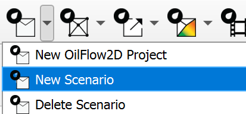
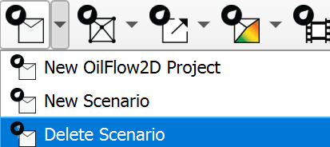
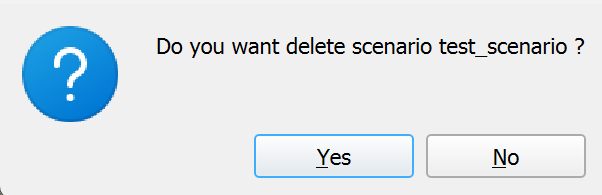
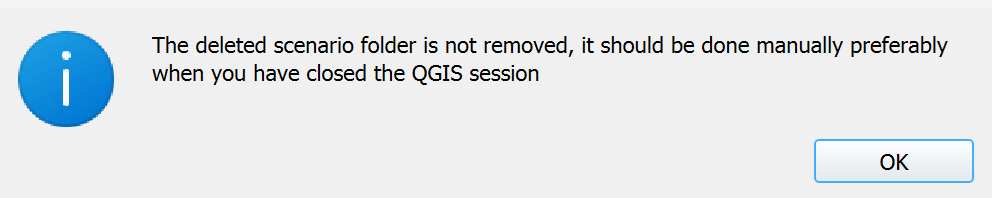

# New Project / Scenario Tool

**New Project Tool Icon for OilFlow2D**

This chapter describes the tools related to creating and managing new projects and scenarios. Within the *New OilFlow2D Project* menu, the following tools are available:

**New OilFlow2D Project Menu**

## New OilFlow2D Project
This tool initializes a new *OilFlow2D* project. It sets up the necessary directory structure, creates a QGIS project, and generates the required initial GeoPackage layers based on the components selected by the user. This establishes the foundation for defining model geometry, components, and simulation parameters within a multi-scenario context.

### Dialog Window

The *New OilFlow2D Project* dialog allows the user to specify the project name, initial scenario name, project location, and select the components to be included in the initial setup.

**Create New Project Dialog for OilFlow2D**

### Dialog Controls

The dialog contains the following controls:

| **Control** | **Type** | **Description** |
| --- | --- | --- |
| Set Current Project Projection | *Button* | Button to open the QGIS Project Properties dialog to select or verify the Coordinate Reference System (CRS) for the project. |
| Projection Display | *Read-only field* | Read-only field showing the selected project CRS (e.g., EPSG code). |
| Project Name | *Text input field* | Text input field to specify the name for the new project. This name will be used for the main project folder and the QGIS project file. |
| Name Initial Scenario | *Text input field* | Text input field to specify the name for the first scenario within the project. A subfolder with this name will be created. |
| Project Directory | *Text input field* | Text input field displaying the path to the directory where the project folder will be created. |
| Browse Button (...) | *Button* | Button next to Project Directory that opens a directory selection dialog. |
| Components Checkboxes | *Checkbox Group* | A series of checkboxes allowing the user to select which model components and data layers should be initialized. Options include common hydrodynamic features (MeshDensityLine, MeshBreakLine, Manning Nz, Initial WSE, Bridges, Gates, Culverts, Weirs, DamBreach, Sources/Sinks, etc.) and OilFlow2D-specific features like: SpillPaths, ShoreLine, OilSpills, SpillBooms, OilPipelines, OilPipeLineBoundCond, OilRetDepth, VegTrapp. (All are checked by default). |
| Ok | *Button* | Button to confirm the settings and create the new project. |
| Cancel | *Button* | Button to close the dialog without creating a project. |

### Initial Layers
The tool creates several initial GeoPackage layers within the `shape` subdirectory of the new scenario, based on the components selected in the dialog. The following table describes the layers created by default:

| **Layer Name** | **Type** | **Description** |
| --- | --- | --- |
| MeshDensityLine | Line | Defines lines along which mesh density is controlled. |
| MeshDensityPolygon | Polygon | Defines areas within which mesh density is controlled. |
| MeshBreakLine | Line | Enforces mesh element edges along these lines (e.g., levees, walls). |
| Domain Outline | Polygon | Defines the outer boundary of the 2D model domain. |
| Boundary Conditions | Line | Defines locations where boundary conditions (inflow, outflow, WSE) are applied. |
| Manning Nz | Polygon | Defines zones with specific anisotropic Manning's roughness coefficients. |
| Initial WSE | Polygon | Defines zones with specific initial water surface elevations. |
| Observation Points | Point | Defines locations where time series output results will be generated. |
| Sources Sinks | Point | Defines locations where flow is added (source) or removed (sink). |
| Wind | Polygon | Defines zones where wind shear stress is applied. |
| RainEvap | Polygon | Defines zones where rainfall and/or evaporation rates are applied. |
| Infiltration | Polygon | Defines zones with specific soil infiltration parameters. |
| Weirs | Line | Represents weir structures controlling flow. |
| Gates | Point | Represents gate structures controlling flow. |
| Culverts | Line | Represents culverts (pipes) conveying flow. |
| Bridges | Line | Represents the overall alignment or deck of bridge structures. |
| Piers | Polygon | Represents bridge pier obstructions. |
| Abutments | Polygon | Represents bridge abutment obstructions. |
| DamBreach | Polygon | Defines parameters for simulating a dam breach failure. |
| Spill Paths | Line | Defines preferential paths for oil spill movement. |
| ShoreLine | Line | Defines the shoreline boundary with specific oil interaction properties. |
| OilSpills | Point | Defines the location, type, and parameters of oil spill sources. |
| SpillBooms | Line | Represents physical booms used for oil containment. |
| OilPipelines | Line | Represents the alignment of oil pipelines. |
| OilPipeLineBoundCond | Point | Defines boundary conditions (e.g., leaks) for oil pipelines. |
| OilRetDepth | Polygon | Defines zones with specific oil retention depth characteristics. |
| VegTrapp | Polygon | Defines zones where vegetation characteristics affect oil trapping. |
| CrossSections | Line | Defines lines along which cross-sectional results are extracted. |
| Profiles | Line | Defines lines along which longitudinal profile results are extracted. |

### Layer Attributes
Please refer to the 8.1 section for detailed information on the attributes for the default layers created by the New Project tool.

### Workflow
The typical workflow for using the New Project tool is as follows:

1.  Open QGIS and click on the { width=5% } icon to open the *New OilFlow2D Project* dialog.

2.  The *Create New OilFlow2D Project* dialog appears.

3.  By default, all common components are selected. Click the `Layers` dropdown menu and click `None` to deselect all layers if needed, then select the desired initial components.

4.  Set the project's Coordinate Reference System (CRS) using the **Projection** button. Ensure a projected CRS is selected.

5.  Enter a unique name for the **Name Initial Scenario** or leave the default.

6.  Click the `...` button to select a path for the **Project Directory**.

7.  Click **Ok**.

8.  The tool validates the inputs (directory, names, CRS).

9.  If valid, it creates the project directory structure: `Project Directory/Scenario Name/shape/`.

10. Essential project metadata (e.g., marking it as a Multi-Scenario project, storing the current scenario name) is written into the QGIS project properties.

11. The newly created layers (based on selected components) are loaded into the QGIS Layers Panel.

12. Default styling and labeling are applied to the layers.

13. The project's CRS is set according to the user's selection.

### Requirements

-   A valid output directory must be selected where the user has write permissions.

-   A unique Project Name must be provided. The tool will check if a folder with this name already exists in the selected Project Directory.

-   A unique Scenario Name must be provided.

-   A valid projected Coordinate Reference System (CRS) must be selected for the QGIS project. Geographic coordinate systems are not valid for hydrodynamic modeling because the unit of length is the arc degree.

### Technical Details

-   **Directory Structure**: The tool always creates a nested directory structure: `Project Name/Scenario Name/shape`.

-   **QGIS Project File**: Creating a new project does not automatically save a `.qgz` file. Project-specific settings are stored within this file. Ensure that the qgz file is outside of the scenario directory, and in the main project directory.

## Create New Scenario
This tool allows users to create a new scenario within an existing *OilFlow2D* project. It essentially duplicates the directory structure and essential data files from a selected existing scenario (source scenario) to create a new, independent scenario ready for modification.

### Dialog Window

The *New Scenario* dialog prompts the user for the name of the new scenario and allows selection of an existing scenario to use as a template.

**The New Scenario dialog window for OilFlow2D.**

### Dialog Controls

| **Control** | **Type** | **Description** |
| --- | --- | --- |
| Base Scenario | *Combo box* | Populated with the names of existing scenarios in the current project. The user selects the scenario to use as the template for the new one. |
| New Scenario Name | *Text input field* | Text input field where the user enters the desired name for the new scenario. |
| Ok | *Button* | Button to confirm the settings and create the new scenario. |
| Cancel | *Button* | Button to close the dialog without creating a new scenario. |

### Workflow
1.  Open QGIS and click on the

    { width=5% } icon and click on the *New Scenario* menu item.

{ width=40% }

2.  The *Add New New Scenario to Project* dialog appears.

3.  Enter a unique name for the **New Scenario Name**.

4.  Click **Ok**.

5.  A new scenario directory is created at the same level as the existing scenario directories: `project_folder\scenario_name\shape`.

6.  The tool determines which files need to be copied.

7.  Essential project files (GeoPackages, mesh files, shapefiles), are copied from the Base Scenario's and `/shape` directories to the corresponding locations in the New Scenario directory.

8.  The plugin updates its internal list of scenarios (reflected in a scenario selection dropdown in the main interface).

9.  The plugin switches the active scenario to the newly created one, unloading layers from the previous scenario and loading the corresponding layers from the new scenario's `shape` directory.

### Requirements

-   A *RiverFlow2D MS* project must be currently open in QGIS.

-   The project must contain at least one existing scenario to serve as the base.

-   A unique New Scenario Name must be provided. It cannot be empty or match an existing scenario name.

-   The user must have write permissions in the project directory.

### Technical Details

-   **Scenario Identification**: Scenarios are identified by their folder names within the main project directory.

-   **Data Duplication**: The core action is file-based copying. It duplicates the structure, content and common data files (like GeoPackages). Does **not** copy any model output files or produced maps.

-   **Active Scenario Switching**: Involves unloading the layers associated with the previous scenario and loading the corresponding layers from the new scenario's directory by updating their data source paths.

## Delete Scenario
This tool removes an existing scenario from the *OilFlow2D* project. This action is irreversible but the files are not permanently deleted from the file system.

### Dialog Window

The *Delete Scenario* dialog allows the user to select which existing scenario to remove.

**The Delete Scenario dialog window.**

### Dialog Controls

| **Control** | **Type** | **Description** |
| --- | --- | --- |
| Select Scenario | *Combo box* | Populated with the names of existing scenarios in the current project. The user selects the scenario to be deleted. |
| Ok | *Button* | Button to confirm the selection and remove the chosen scenario from the project. |
| Cancel | *Button* | Button to close the dialog without removing any scenario. |

### Workflow
1.  Ensure a *OilFlow2D* project is open and active.

2.  Activate the tool, click on the { width=5% } icon and click on the *Delete Scenario* menu item.

    { width=40% }

3.  The *Delete Scenario from OilFlow2D Project* dialog appears.

4.  The **Select Scenario** dropdown list is populated with all existing scenarios.

5.  Select the scenario you wish to remove from the dropdown list.

6.  Click **Ok**.

7.  The user will receive a confirmation message asking them to confirm the removal.

    { width=50% }

8.  Click **Ok** again to confirm the removal.

9.  The tool identifies the directory path corresponding to the selected scenario, then removes the scenario from the project.

10. The user will receive a message indicating that the scenario has been removed from the project.

    { width=70% }

11. As the message indicates, this action is not permanently deleting files from the file system. If the user chooses, they can manually delete the entire directory in File Explorer. This will make it unrecoverable.

12. The plugin updates its internal list of scenarios, removing the deleted one (this is reflected in the scenario selection dropdown in the main interface).

13. Save your changes to the project to ensure that the changes are saved and no leftover artifacts are left behind.

### Requirements

-   A *RiverFlow2D MS* project must be currently open in QGIS.

-   The project must contain at least two scenarios, as the currently active scenario cannot be deleted.

-   The user must select a scenario from the list.

-   The plugin will not allow the user to delete a scenario if it is the only one remaining in the project.

### Manual Recovery of Deleted Scenario

If you need to recover a scenario that was deleted from the project but did not delete the old scenario directory, you can create a new scenario and manually copy the files back in.

-   Follow the steps in the 1.2 section to create a new scenario.

-   Save the project.

-   Close QGIS.

-   In File Explorer, navigate to the old scenario directory and copy the contents, not the directory itself.

-   Paste the files into the new scenario directory, overwriting the existing files.

-   Open QGIS and load the project.

-   The new scenario will be loaded with the copied files.

### Technical Details

-   **Files are left intact**: The scenario directory and associated .qlr file is left intact. The user must manually delete the directory and .qlr file.

-   **Cannot reuse deleted scenario name**: Unless the user deletes the associated .qlr file and saves the project, the scenario name cannot be reused.

-   **Interface Update**: The scenario selection dropdown in the main plugin interface is updated to reflect the removal of the scenario.

-   **Post-Deletion Active Scenario**: The plugin automatically switches the active QGIS view to another existing scenario after the deletion is complete.
