# Tools

This chapter provides a comprehensive reference for the tools available in the QGIS plugin. You can access the tools via the toolbar or the Main Menu under *Plugins*:

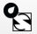

## EPA-SWMM Tools
The plugin includes tools for integrating with EPA's Storm Water Management Model (SWMM), enabling users to create SWMM input files directly from QGIS layers and import existing SWMM files.

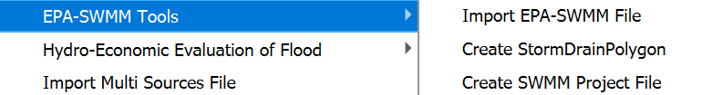

### Dialog Window
#### Import EPA-SWMM File
This tool imports an existing EPA-SWMM INP or HYC file into QGIS as vector layers.

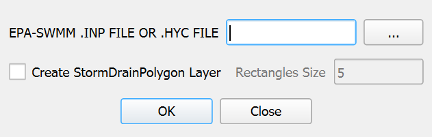

#### Create StormDrainPolygon
This tool creates polygon representations around storm drain nodes.

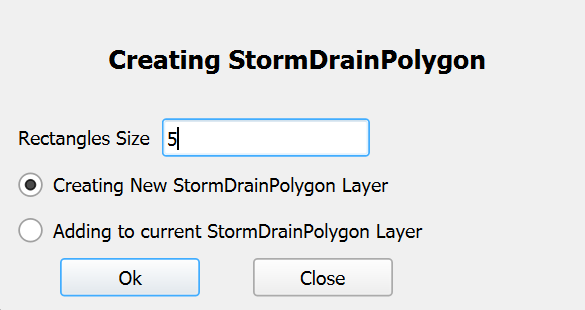

#### Create SWMM Project File
This tool creates an EPA-SWMM compatible INP file from QGIS layers.

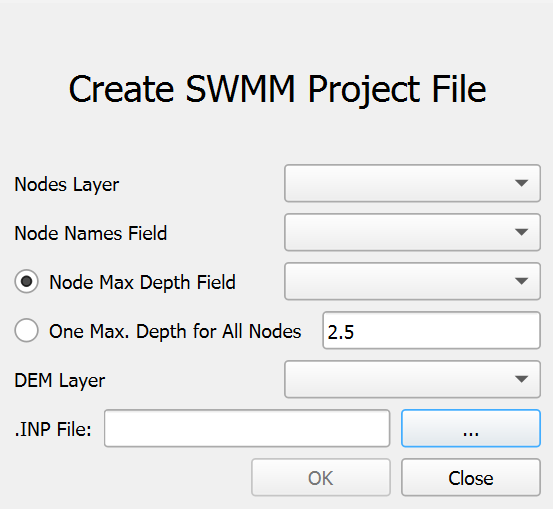

### Dialog Controls
#### Import EPA-SWMM File
[]{#tab:import_swmm_controls label="tab:import_swmm_controls"}

| EPA-SWMM .INP FILE OR .HYC FILE | *field* | Specify the path to the SWMM input file (INP or HYC). |
| --- | --- | --- |
| \... | *button* | Opens a file dialog to browse for the SWMM file. |
| Create StormDrainPolygon Layer | *checkbox* | If checked, creates polygon representations around imported nodes. |
| Rectangles Size | *field* | Defines the size of the rectangular polygons (default: 5 units). Enabled only if the \"Create StormDrainPolygon Layer\" checkbox is checked. |
| Ok | *button* | Executes the import process. |
| Close | *button* | Closes the dialog. |

#### Create StormDrainPolygon
[]{#tab:create_sdp_controls label="tab:create_sdp_controls"}

| Rectangle Size | *field* | Defines the size of the rectangular polygons (default: 5 units). |
| --- | --- | --- |
| Creating New StormDrainPolygon Layer | *radioButton* | Removes any existing StormDrainPolygon layer and creates a new one. |
| Adding to current StormDrainPolygon Layer | *radioButton* | Adds new polygons to the existing StormDrainPolygon layer, if present. |
| OK | *button* | Executes the polygon creation. |
| Close | *button* | Closes the dialog. |

#### Create SWMM Project File
[]{#tab:create_swmm_controls label="tab:create_swmm_controls"}

| Nodes Layer | *dropdown* | Selects the point layer containing SWMM junction nodes. |
| --- | --- | --- |
| Node Names Field | *dropdown* | Selects the field containing unique node identifiers. |
| Node Max Depth Field | *radioButton* | Uses a field from the nodes layer for maximum depth. |
| Node Max Depth Value | *field* | Input for the maximum depth value (enabled only when the corresponding radio button is selected, with default values based on map units). |
| One Max. Depth for All Nodes | *radioButton* | Uses a single value for maximum depth for all nodes. |
| DEM Layer | *dropdown* | Selects the raster layer for elevation data. |
| INP File | *field* | Specifies the output location for the SWMM INP file. |
| \... | *button* | Opens a file dialog to choose the output file location. |
| Close | *button* | Closes the dialog. |
| Ok | *button* | Executes the INP file creation. |

### Workflow
#### Import EPA-SWMM File
1.  Checks for a RiverFlow2D project.

2.  Reads the specified EPA-SWMM file (INP or HYC).

3.  Extracts node information (coordinates, IDs, attributes).

4.  Creates a StormDrain point layer in the project's shape directory.

5.  If \"Create StormDrainPolygon Layer\" is checked, creates polygons around nodes.

6.  Adds the layer(s) to the COMPONENTS group in QGIS.

7.  Applies styling and labeling to the imported layers.

#### Create StormDrainPolygon
1.  Checks for a RiverFlow2D project.

2.  Locates the StormDrain point layer.

3.  Extracts node coordinates and IDs.

4.  Creates rectangular polygons based on the specified size.

5.  Creates a new layer or adds to an existing one, based on the selected radio button.

6.  Adds the layer to the COMPONENTS group in QGIS.

7.  Labels the polygons with node IDs.

#### Create SWMM Project File
1.  Select the nodes and DEM layers, along with the required fields in the dialog controls.

2.  Define the maximum depth using a field or a single value.

3.  Select the output path for the INP file.

4.  Click OK to generate the SWMM project file.

### Requirements
#### Import EPA-SWMM File
-   An active RiverFlow2D project.

-   A valid EPA-SWMM INP or HYC file.

#### Create StormDrainPolygon
-   An active RiverFlow2D project.

-   A StormDrain point layer containing the nodes.

#### Create SWMM Project File
-   An active RiverFlow2D project.

-   A nodes layer with unique identifiers.

-   A DEM layer covering the node area.

### Technical Details
#### Import EPA-SWMM File
##### File Format Support

-   **INP Files:** Standard EPA-SWMM input files.

-   **HYC Files:** Hydronia-specific format for storm drain networks.

Imported layers are saved in the shape directory of the current project scene.

##### Coordinate System Considerations

The tool checks for coordinate system mismatches between the INP file and the QGIS project, warning the user if units differ.

#### Create StormDrainPolygon
The StormDrainPolygon layer is saved in the shape directory of the current project scene.

#### Create SWMM Project File
##### Output File Structure

The generated INP file includes: TITLE, OPTIONS, EVAPORATION, JUNCTIONS, INFLOWS, REPORT, MAP, and COORDINATES sections.

*See the OilFlow2D for QGIS  Reference Manual Output Files section for more details.*

##### Processing Method

1.  Extracts points from the nodes layer.

2.  Samples the DEM at each point.

3.  Calculates invert elevations (DEM elevation - maximum depth).

4.  Formats data according to SWMM INP specifications.

5.  Writes the complete file.

##### Usage Notes

-   Ensure nodes are placed appropriately in the point layer.

-   The DEM should cover all junction locations.

-   Output units (feet or meters) are determined by QGIS project units.

-   The INP file is a basic structure, further customizable in EPA-SWMM.

-   Only junctions are created; other elements (conduits, subcatchments) must be added in EPA-SWMM.

#### Integration with UDSWMM Module

The EPA-SWMM tool is designed to work in conjunction with the UDSWMM module for comprehensive urban drainage modeling capabilities.

*See the OilFlow2D for QGIS  Reference Manual Output Files section for more details.*

## Import Multi Sources File Tool
The Import Multi Sources File tool provides functionality for importing point source data from external files into the current project as a QGIS vector layer. This section details the tool's interface, workflow, and technical implementation.

### Dialog Window
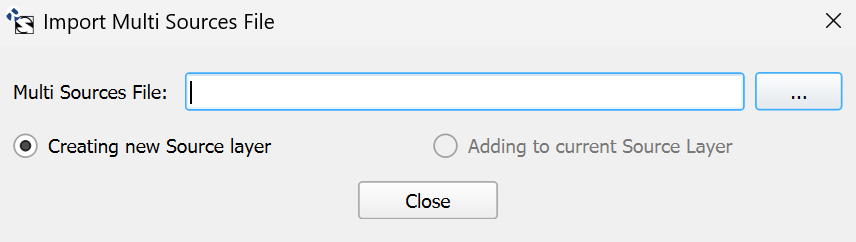

### Dialog Controls
[]{#tab:multisource_dialog_controls label="tab:multisource_dialog_controls"}

| Multi Sources File | *field* | Path to the multi-source data file to be imported. |
| --- | --- | --- |
| \... | *button* | Opens a file dialog to browse for the multi-source file. |
| Creating new Source layer | *radioButton* | When selected, creates a new Sources layer, removing any existing one. |
| Adding to current Source Layer | *radioButton* | When selected, adds points to the existing Sources layer (enabled only if a Sources layer exists). |
| Close | *button* | Closes the dialog without making changes. |

### Workflow
1.  The tool first checks for an active RiverFlow2D project.

2.  The user selects a multi-source file using the file dialog.

3.  Based on the selected radio button option:

    -   If \"Creating new Source layer\" is selected, any existing Sources layer is removed from the project and deleted from disk.

    -   If \"Adding to current Source Layer\" is selected, the existing Sources layer is used (this option is only enabled if a Sources layer exists).

4.  The tool reads the multi-source file and:

    -   Extracts the number of sources from the first line.

    -   For each source, reads the ID, X/Y coordinates, and associated file.

    -   Creates a point feature for each source.

5.  The layer is styled with red point symbols and labeled using the SOURCEID field.

6.  The layer is added to the COMPONENTS group in the QGIS layer tree.

7.  Configuration is applied to the layer's attribute form:

    -   SOURCETYPE field is configured with a value map (1: Discharge vs Time, 2: Rating table depth vs Q).

    -   FILENAME field is configured with an external resource widget.

    -   A custom UI form and Python script are attached to the layer for advanced functionality.

8.  A confirmation message is displayed when the import is complete.

### Requirements
-   An active RiverFlow2D project is required.

-   The multi-source file must follow the specified format.

-   The tool adds the layer to a COMPONENTS group in the layer tree, creating the group if it doesn't exist.

-   The layer uses the project's coordinate reference system.

-   The Sources layer is created in the project's `shape` directory.

### Technical Details
#### File Format
The multi-source file should follow this format:

-   First line: Number of sources (integer)

-   Subsequent lines (one per source): SourceID X-coordinate Y-coordinate Filename

Example:

    3
    Source1 125.5 345.7 discharge1.txt
    Source2 220.8 410.2 discharge2.txt
    Source3 180.3 275.9 discharge3.txt

#### Integration with RiverFlow2D
Each point represents a source or sink where water enters or leaves the model domain. The points are associated with files that define the discharge characteristics:

-   **Discharge vs Time (Type 1):** Files containing time series of discharge values.

-   **Rating Table (Type 2):** Files defining the relationship between water depth and discharge.

The layer includes a custom form interface that facilitates the assignment and editing of source properties directly within QGIS.

## Import RF2D Layers Tool
The Import RF2D Layers tool provides functionality for importing various RiverFlow2D components and data files into QGIS as vector and raster layers. This comprehensive tool supports multiple file formats specific to hydrodynamic modeling and allows users to integrate simulation components with GIS data.

### Dialog Window
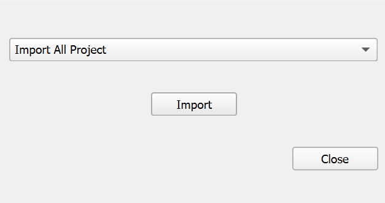

### Dialog Controls
[]{#tab:importrf2d_dialog_controls label="tab:importrf2d_dialog_controls"}

| Component Selector | *dropdown* | Dropdown list to select which RiverFlow2D component to import. Options include TriMesh, Domain Outline, Boundary Conditions, Manning's n values, and many others. |
| --- | --- | --- |
| Import | *button* | Executes the import process for the selected component. |
| Close | *button* | Closes the dialog without making changes. |

### Workflow
1.  The tool first checks for an active RiverFlow2D project and retrieves the project's coordinate reference system.

2.  The user selects a component type from the dropdown list.

3.  When \"Import\" is clicked, the tool performs one of the following workflows:

    -   If \"Import All Project\" is selected, the tool attempts to import all available components from the project directory in sequence, checking for the existence of each file type.

    -   For individual component selections, the tool opens a file dialog with the appropriate file extension filter, allowing the user to select the specific file to import.

4.  During import, the tool:

    -   Checks for and optionally removes any existing layer of the same type

    -   Reads the selected file format and extracts geometry and attribute data

    -   Creates appropriate QGIS vector or raster layers

    -   Applies symbology and labeling based on the layer type

    -   Organizes the layers into logical groups in the QGIS layer tree

When importing the entire project, a progress dialog displays the status of the import process.

For some layer types, the tool creates a custom form interface for editing the attributes, enhancing the user's ability to modify the model parameters directly within QGIS.

### Requirements
-   An active RiverFlow2D project is required.

-   The project must have a defined coordinate reference system.

-   For full project import, all component files should be present in the project directory with the expected naming conventions.

-   The tool requires write access to the project directory to create shapefiles for the imported layers.

-   Sufficient memory is needed when importing large meshes (particularly TriMesh components with many elements).

### Technical Details
#### Supported File Types
The tool supports various RiverFlow2D file types, each representing a different component of the hydrodynamic model:

| **Component** | **File Extension** | **Description** |
| --- | --- | --- |
| All Project | `.FED` | Imports all available RiverFlow2D components from the project directory in a single operation. Uses the FED file as the starting point to locate other project files. |
| TriMesh | `.FED` | Finite element mesh defining the computational domain. |
| Domain Outline | `_domain_outline.exp` | Polygon defining the domain boundary. |
| Boundary Conditions | `_BoundaryConditions.exp` | Lines defining where boundary conditions are applied. |
| Manning's n | `.MannN2` | Roughness zones for flow resistance. |
| Manning's nz | `.MANNN` | Directional roughness zones. |
| Rain/Evaporation | `.LRAIN` | Precipitation and evaporation zones. |
| Infiltration | `.LINF` | Soil infiltration zones. |
| Wind | `.WIND` | Wind forcing zones. |
| Gates | `.TGATES` | Hydraulic gates and structures. |
| Bridges | `.TBRIDGES` | Bridge structures within the flow domain. |
| Culverts | `.CULVERTS` | Culvert structures for flow routing. |
| Weirs | `.TWEIRS` | Weir structures for flow control. |
| Dam Breach | `.TDAMS` | Dam failure modeling parameters. |
| Sources/Sinks | `.SOURCES` | Point sources and sinks within the domain. |
| Cross Sections | `.XSECS` | River cross-sectional data. |
| Profiles | `.PROFILES` | Longitudinal profiles along rivers. |
| Observation Points | `.OBS` | Locations for time series output. |
| DEM | `_BedElevations.exp` | Bed elevation data for the domain. |

#### Best Practices
-   Before importing a new version of an existing component, it's recommended to first delete the old layer from QGIS to avoid conflicts.

-   The \"Import All Project\" option provides the most streamlined workflow when setting up a new project or updating an entire model.

-   For incremental updates or when working with specific components, use the individual import options to target only the needed data.

-   After import, verify that the geometry and attributes of the imported layers match the expected values from the source files.

-   For large projects, consider importing components individually rather than using \"Import All Project\" to better manage memory usage.

## Recover Layers Tool
The Recover Layers tool provides functionality for recovering RiverFlow2D component layers that exist in the project directory but have been removed from the QGIS canvas. This tool allows users to quickly restore project layers without needing to re-import them from their source files.

### Dialog Window
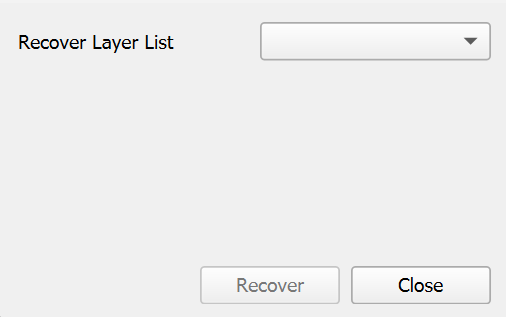

### Dialog Controls
[]{#tab:recover_dialog_controls label="tab:recover_dialog_controls"}

| Recover Layer List | *dropdown* | Displays a list of project layers that exist in the project directory but are not currently loaded in QGIS. |
| --- | --- | --- |
| Recover | *button* | Loads the selected layer from the project directory and adds it to the appropriate group in the QGIS layer tree. |
| Close | *button* | Closes the dialog without recovering any layers. |

### Workflow
1.  When opened, the tool automatically scans the active RiverFlow2D project's directory structure.

2.  The tool compares the layers currently loaded in QGIS against the shapefiles present in the project's `shape` directory.

3.  Any layers that exist as files but are not currently loaded in QGIS are added to the \"Recover Layer List\" dropdown.

4.  The user selects a layer to recover from the dropdown list.

5.  When the \"Recover\" button is clicked, the tool:

    -   Loads the shapefile from the project directory

    -   Applies appropriate styling and labeling based on the layer type

    -   For specific layer types like Boundary Conditions, configures custom attribute forms and widgets

    -   Adds the layer to the appropriate group in the QGIS layer tree (MESH_SPATIAL_DATA, COMPONENTS, or OUTPUT_CONTROL)

6.  If no layers are available for recovery, the \"Recover\" button is disabled.

### Requirements
-   An active RiverFlow2D project is required.

-   The project must have a defined directory structure with a `shape` subdirectory containing component shapefiles.

-   Shapefiles must follow the standard naming conventions for the tool to recognize them.

-   The user must have read access to the project directory to load the shapefiles.

### Technical Details
#### Supported Layer Types
The tool can recover a wide range of RiverFlow2D component layers, including:

-   Domain Outline

-   Mesh components (MeshBreakLine, MeshDensityLine, MeshDensityPolygon)

-   Boundary Conditions

-   Manning's roughness coefficients (Manning N, Manning Nz)

-   Hydraulic structures (Bridges, Gates, Culverts, Weirs, DamBreach)

-   Environmental components (Infiltration, RainEvap, Wind)

-   Sources and Sinks

-   Analysis components (CrossSections, Profiles, ObservationPoints)

-   Other specialized components (MultipleDemBoundaries, InitialConcentrations, InternalRatingTable, etc.)

Each layer type is recovered with its proper styling and configuration based on predefined settings in the tool.

#### Best Practices
-   Use this tool when you accidentally remove layers that are part of an existing project rather than reimporting them.

-   After recovering layers, verify their styling and configuration to ensure they match your expectations.

-   If you need to recover multiple layers, recover them one by one, selecting each from the dropdown and clicking \"Recover\".

-   The tool only recovers layers that still have their corresponding shapefile in the project directory; if files have been deleted, use the Import RF2D Layers tool instead.

## Compare Output Raster Maps Tool
The Compare Output Raster Maps tool provides functionality for comparing raster outputs from different simulation scenarios. This tool enables quantitative assessment of differences between model runs, allowing users to evaluate the impact of parameter changes, analyze alternative designs, or validate model results against different scenarios.

### Dialog Window
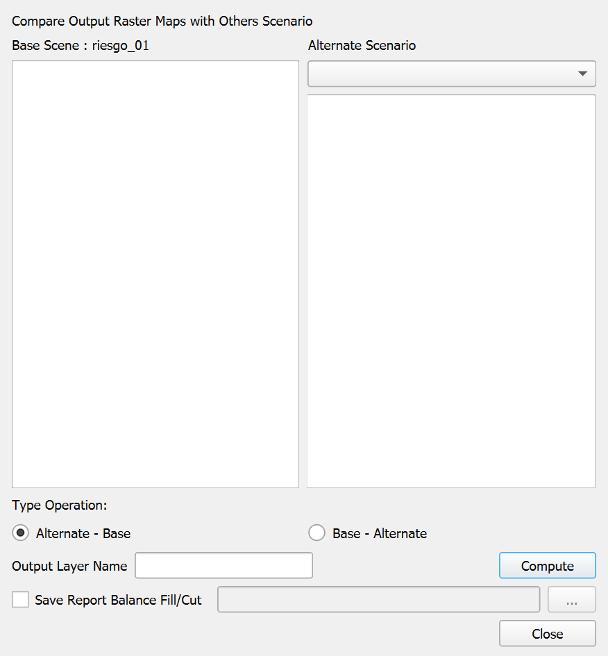

### Dialog Controls
[]{#tab:compare_dialog_controls label="tab:compare_dialog_controls"}

| Base Scenario List | *list view* | Displays all available raster layers from the current project for selection as the base scenario. |
| --- | --- | --- |
| Alternate Scenario Dropdown | *combo box* | Selects the alternate scenario to compare against the base scenario. |
| Alternate Scenario List | *list view* | Shows available raster layers from the selected alternate scenario. |
| Type Operation | *radio buttons* | Specifies the comparison operation to perform: \"Alternate - Base\" (default) or \"Base - Alternate\". |
| Output Layer Name | *text field* | Sets the name for the resulting difference layer. |
| Compute | *button* | Executes the comparison operation and creates the difference layer. |
| Save Report Balance Fill/Cut | *checkbox* | When checked, generates a quantitative report of the differences between the maps, including volumes of fill and cut. |
| Report File Path | *text field* | Specifies the location to save the report file (enabled when the checkbox is checked). |
| Browse | *button* | Opens a file dialog to select the report file location. |
| Close | *button* | Closes the dialog. |

### Workflow
1.  The tool first loads all available raster layers from the current active RiverFlow2D project as the base scenario.

2.  Select a raster layer from the base scenario list that you want to compare.

3.  From the alternate scenario dropdown, select an alternate project:

    -   The dropdown is populated with available project scenarios.

    -   When selected, the tool loads all raster layers from that scenario.

4.  Select a corresponding raster layer from the alternate scenario list to compare against the base layer.

5.  Choose the type of operation:

    -   *\"Alternate - Base\"* shows where the *alternate* scenario has higher values than the *base* (positive differences) and where it has lower values (negative differences).

    -   *\"Base - Alternate\"* shows where the *base* scenario has higher values than the *alternate* (positive differences) and where it has lower values (negative differences). This effectively inverts the results of the first option.

6.  Enter a name for the output difference layer.

7.  If you want to generate a volumetric report of the differences:

    -   Check the *\"Save Report Balance Fill/Cut\"* option.

    -   Specify a location to save the report using the text field or browse button.

8.  Click \"Compute\" to execute the comparison operation.

9.  The tool performs the following steps:

    -   Loads both selected raster layers into memory.

    -   Ensures they have matching extents and resolutions.

    -   Performs the specified arithmetic operation (subtraction) between the layers.

    -   Creates a new raster layer with the calculated differences.

    -   Applies appropriate symbology to highlight positive and negative differences.

    -   If requested, calculates the volumetric differences and generates a report.

10. The resulting difference layer is added to the QGIS project with a color ramp symbology.

### Requirements
-   An active RiverFlow2D project is required for the base scenario.

-   Both base and alternate raster layers must:

    -   Have the same coordinate reference system.

    -   Have compatible extents and resolutions.

    -   Represent the same type of data (e.g., water depth, velocity magnitude) for meaningful comparison.

-   Write access to the project directory is needed for creating the difference layer and report file.

### Technical Details
#### Difference Layer Interpretation
The resulting difference layer helps visualize and quantify changes between scenarios:

-   **Positive Values (typically shown in blue):** Indicate areas where the alternate scenario has higher values than the base scenario. For water depth comparisons, these represent areas with deeper water in the alternate scenario.

-   **Negative Values (typically shown in red):** Indicate areas where the alternate scenario has lower values than the base scenario. For water depth comparisons, these represent areas with shallower water in the alternate scenario.

-   **Values Near Zero (typically shown in white or transparent):** Indicate areas with minimal differences between scenarios.

#### Volumetric Balance Report
When the \"Save Report Balance Fill/Cut\" option is selected, the tool generates a detailed report containing:

-   **Header Information:** Date, time, project names, and layers compared.

-   **Raster Statistics:** Min, max, mean, and standard deviation of difference values.

-   **Fill Volume:** Total volume of positive differences (where alternate $>$ base).

-   **Cut Volume:** Total volume of negative differences (where alternate $<$ base).

-   **Net Volume:** The algebraic sum of fill and cut volumes.

-   **Cell Details:** Number of cells with positive, negative, and zero differences.

-   **Area Summary:** Total area affected by changes, broken down by positive and negative differences.

This report is useful for quantitative assessment of design alternatives, impact analysis, or verification of model changes.

#### Best Practices
-   Compare rasters of the same type (e.g., water depth with water depth) to ensure meaningful results.

-   Use descriptive output layer names that indicate which scenarios are being compared.

-   For elevation or bathymetry comparisons, consider the \"Alternate - Base\" operation to show areas of deposition as positive and erosion as negative.

-   Review both the visual difference layer and the volumetric report for comprehensive analysis.

-   When comparing multiple pairs of layers, organize output layers in a group for easier management.

-   Consider using transparency in the difference layer symbology to see underlying reference layers.

-   For time-dependent outputs, ensure you are comparing the same time step from each scenario.

## Setting TriMesh Elevation Tool
The Setting TriMesh Elevation tool provides functionality for assigning elevation values from a FED file to a TriMesh layer. This tool allows users to update the elevation attributes of mesh elements without reimporting the entire mesh, making it useful for updating terrain information in an existing model or applying elevation adjustments.

### Dialog Window
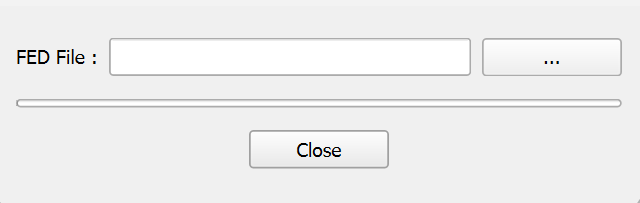

### Dialog Controls
[]{#tab:elevfed_dialog_controls label="tab:elevfed_dialog_controls"}

| FED File | *field* | Path to the FED file containing elevation data for the mesh elements. |
| --- | --- | --- |
| \... | *button* | Opens a file dialog to browse for and select a FED file. |
| Progress Bar | *progress bar* | Shows the progress of the elevation data import process. |
| Close | *button* | Closes the dialog. |

### Workflow
1.  The tool first checks for an active RiverFlow2D project.

2.  The dialog presents a field for selecting a FED file, with a browse button to facilitate file selection.

3.  When a FED file is selected using the browse button:

    -   The tool verifies that a TriMesh layer exists in the current project.

    -   It reads the FED file to extract elevation data for each mesh element.

    -   The tool compares the number of elements in the FED file with the number of features in the TriMesh layer to ensure they match.

    -   If the element counts match, the tool updates the elevation attribute (field index 5) for each mesh element with the corresponding value from the FED file.

    -   A progress bar visualizes the import process.

    -   Upon completion, a confirmation message is displayed.

4.  If an error occurs during the process (e.g., no TriMesh layer found, or element count mismatch), an appropriate error message is displayed.

### Requirements
-   An active RiverFlow2D project is required.

-   A TriMesh layer must exist in the QGIS project.

-   The FED file must contain elevation data for all mesh elements.

-   The number of elements in the FED file must match the number of features in the TriMesh layer.

-   The TriMesh layer must have an attribute field at index 5 for storing elevation values.

### Technical Details
#### File Format Requirements
The FED file used for setting TriMesh elevation must follow the standard RiverFlow2D FED file format:

-   First line: Contains the number of elements and number of header lines.

-   Header lines: Contains header information (skipped during processing).

-   Element data: Each subsequent line contains element data, with the elevation value in the 6th column (index 5).

#### Best Practices
-   Before updating elevations, ensure that the TriMesh layer is the one you want to modify, as the changes will affect the mesh geometry.

-   Verify that the FED file contains appropriate elevation values before applying them to the mesh.

-   After updating elevations, review the mesh to ensure the changes were applied correctly.

-   Consider saving your project before using this tool, as the changes to the TriMesh layer are permanent once applied.

-   For large meshes with many elements, the import process may take some time. The progress bar provides visual feedback on the operation status.

## Check Internal Angle of TriMesh's Cells Tool
The Check Internal Angle of TriMesh's Cells tool provides functionality for identifying and locating problematic cells in a triangular mesh where internal angles are less than 5 degrees. Meshes with extremely small angles can cause computational instability and inaccuracies in hydrodynamic simulations, making this tool essential for quality control of the computational domain.

This tool also detects cells with null area. In these cases, the tool displays the cell ID, but because these cells have no geometry, the zoom and selection tools cannot be used. Therefore, the cell must be located manually to determine the cause, which is usually two nodes with the same coordinates.

### Dialog Window
This tool has a minimal interface as it automatically runs the checking process when launched and displays results in a separate dialog if problematic cells are found.

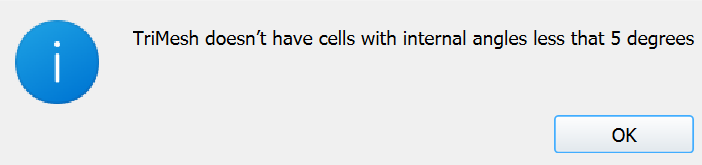

### Dialog Controls
[]{#tab:check_angles_controls label="tab:check_angles_controls"}

| Close | *button* | Closes the dialog after the checking process. |
| --- | --- | --- |

### Workflow
1.  When launched, the tool automatically checks for an active TriMesh layer in the project.

2.  A progress dialog appears, showing the status of the checking process.

3.  The tool examines each triangular cell in the TriMesh, calculating all three internal angles.

4.  For each cell, the tool:

    -   Extracts the coordinates of the three vertices.

    -   Computes the squared distances between each pair of vertices.

    -   Calculates the internal angles using the law of cosines.

    -   Checks if any angle is less than 5 degrees (approximately 0.08726647 radians).

5.  If any cells with problematic angles are found:

    -   A list dialog opens showing the IDs of all problematic cells.

    -   The user can select a cell from the list and use the \"Zoom to cell\" button to inspect it in the map canvas.

    -   The selected cell is highlighted in the TriMesh layer.

6.  If no problematic cells are found, an information message is displayed and the tool closes.

7.  If a cell with zero area is detected during the checking process (indicating overlapping vertices), an error message is shown with the cell ID, and the checking process terminates.

### Requirements
-   An active RiverFlow2D project is required.

-   A TriMesh layer must be present in the QGIS project with the name \"TriMesh\".

-   The TriMesh layer must contain valid triangular geometry.

-   The tool requires read access to the mesh data to perform angle calculations.

### Technical Details
#### List of Cells Dialog
If the tool identifies cells with internal angles less than 5 degrees, it displays a secondary dialog listing these cells:

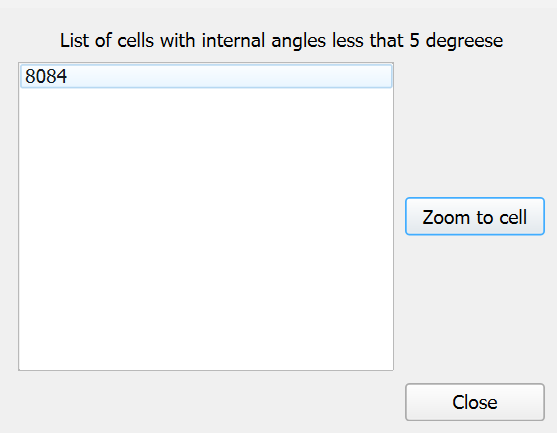

[]{#tab:list_cells_controls label="tab:list_cells_controls"}

| List of cells | *list view* | Displays cell IDs of triangular elements with internal angles less than 5 degrees. |
| --- | --- | --- |
| Zoom to cell | *button* | Zooms the map canvas to the selected cell for visual inspection. |
| Close | *button* | Closes the dialog. |

#### Numerical Method
The tool uses the following approach to calculate and check internal angles:

1.  For each triangular cell with vertices $v_0$, $v_1$, and $v_2$:

2.  Calculate squared distances between vertices:

    -   $d_{12}^2 = (v_1.x - v_0.x)^2 + (v_1.y - v_0.y)^2$

    -   $d_{13}^2 = (v_2.x - v_0.x)^2 + (v_2.y - v_0.y)^2$

    -   $d_{23}^2 = (v_2.x - v_1.x)^2 + (v_2.y - v_1.y)^2$

3.  Calculate internal angles using the law of cosines:

    -   $\cos(\angle v_0) = \frac{d_{12}^2 + d_{13}^2 - d_{23}^2}{2\sqrt{d_{12}^2 \cdot d_{13}^2}}$

    -   $\cos(\angle v_1) = \frac{d_{12}^2 + d_{23}^2 - d_{13}^2}{2\sqrt{d_{12}^2 \cdot d_{23}^2}}$

    -   $\angle v_2 = \pi - (\angle v_0 + \angle v_1)$

4.  Check if any angle is less than 5 degrees (0.08726647 radians).

#### Best Practices
-   Run this tool after creating or modifying a TriMesh to ensure the mesh quality meets numerical stability requirements.

-   Use this tool before running simulations to identify and fix potential problems in the computational mesh.

-   When problematic cells are identified:

    -   Consider remeshing the affected areas with different mesh density parameters.

    -   Manually edit the mesh to correct geometric issues.

    -   If using breaklines to control mesh generation, adjust their placement to avoid creating sliver triangles.

-   For optimal numerical simulation, all internal angles should ideally be between 30 and 120 degrees, though the tool only flags the most extreme cases below 5 degrees.

-   Consider running this tool alongside other mesh quality checks such as ensuring smooth elevation transitions between adjacent cells.

## Oil Pipeline Break Model Tool
The Oil Pipeline Break Model tool generates spill source points along an Oilpipeline polyline using break spacing, inflow conditions, and oil properties. It computes spill outflow rates for each break, samples elevations along the pipeline, and creates a Sources layer that can be used in OilFlow2D simulations.

### Dialog Window
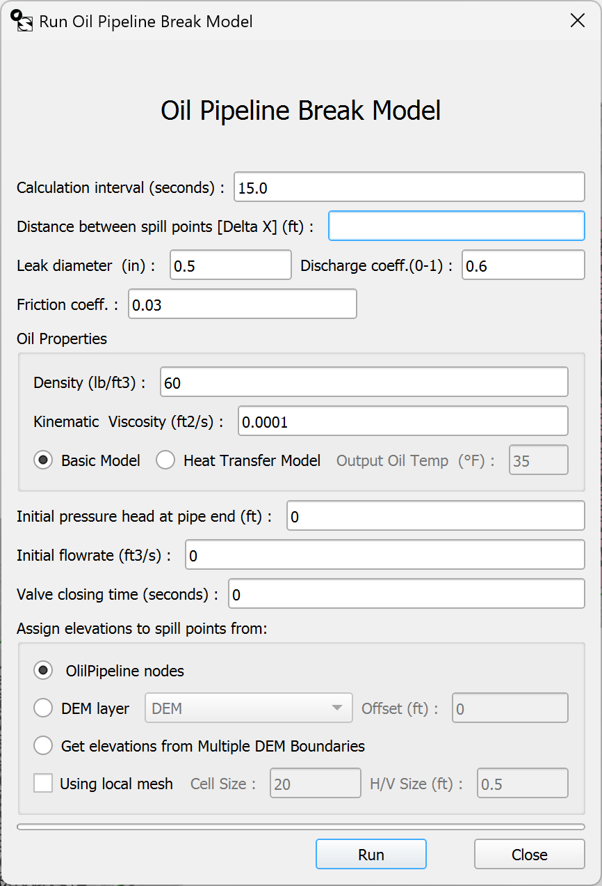

### Dialog Controls
[]{#tab:oil_pipeline_break_controls label="tab:oil_pipeline_break_controls"}

| Calculation interval (seconds) | *field* | Time step used to compute spill sources. |
| --- | --- | --- |
| Distance between spill points \[Delta X\] | *field* | Spacing between break points along the pipeline. |
| Leak diameter | *field* | Leak diameter used for each break point; must be smaller than the pipeline diameter. |
| Discharge coeff. (0-1) | *field* | Discharge coefficient for leak flow calculations. |
| Friction coeff. | *field* | Friction coefficient for the pipeline. |
| Density | *field* | Oil density. |
| Kinematic viscosity | *field* | Oil kinematic viscosity. |
| Basic Model | *radio button* | Runs the basic model without temperature output. |
| Heat Transfer Model | *radio button* | Runs the heat transfer model and enables output temperature. |
| Output temp | *field* | Output temperature for the heat transfer model. |
| Initial pressure head at pipe end | *field* | Initial pressure head at the pipe end. |
| Initial flowrate | *field* | Initial flowrate in the pipeline. |
| Valve closing time (seconds) | *field* | Valve closing time for internal boundary conditions. |
| Oilpipeline nodes | *radio button* | Uses Z values from the Oilpipeline geometry to assign elevations. |
| DEM layer | *radio button* | Samples elevations from a raster DEM layer. |
| DEM layer list | *dropdown* | Selects the DEM raster to sample. |
| Offset | *field* | Adds an elevation offset when sampling from a DEM. |
| Get elevations from Multiple DEM Boundaries | *radio button* | Samples elevations using the MultipleDemBoundaries layer. |
| Using local mesh | *checkbox* | Enables local mesh generation options. |
| Cell Size | *field* | Local mesh cell size around spill points. |
| H/V Size | *field* | Local mesh proportion relative to spill locations. |
| Run | *button* | Runs the Oil Pipeline Break Model tool. |
| Close | *button* | Closes the dialog without running. |

### Workflow
1.  Open the OilFlow2D Tools menu and select Run Oil Pipeline Break Model.

2.  Ensure the Oilpipeline layer is loaded and contains valid diameter and roughness attributes.

3.  Optional: Load the OilPipelineValves layer if internal valve points are needed.

4.  Set the calculation interval, break spacing (Delta X), leak diameter, discharge coefficient, and friction coefficient.

5.  Enter oil properties and choose the model type (Basic or Heat Transfer). If using Heat Transfer, set the output temperature.

6.  Provide initial pressure head, initial flowrate, and valve closing time.

7.  Select how elevations are assigned: Oilpipeline Z values, DEM layer with offset, or Multiple DEM Boundaries.

8.  If needed, enable local mesh options and set Cell Size and H/V Size.

9.  Click Run. The plugin generates spill source points and adds a Sources layer to the COMPONENTS group.

10. Save the QGIS project to preserve the generated sources.

### Requirements
-   An active OilFlow2D project and scene directory must be configured.

-   The Oilpipeline layer must exist and be active.

-   Leak diameter must be smaller than the pipeline diameter attribute.

-   If DEM sampling is used, the selected raster must cover the pipeline extent.

-   If Multiple DEM Boundaries is selected, the MultipleDemBoundaries layer must exist and contain features.

-   The Oil Pipeline module executable and license must be available.

### Technical Details
#### Outputs
-   Creates spill source files in the scene directory:

    -   *datain.txt*, *output.txt*, *pointZ.txt*

    -   *opbmp.txt* (parámetros guardados)

    -   *\<project\>\_spillSources.txt*

-   Creates a Sources layer at *shape/Sources.shp* and adds it to the COMPONENTS group.

-   When using Multiple DEM Boundaries, writes a *.MDPoly* file and converts rasters to *.asc* as needed.

#### Usage Notes
-   If the Oilpipeline layer is missing, the tool will not run.

-   If a DEM does not cover the pipeline, the tool stops with an error.

-   Negative pressure warnings appear in the OF2D log messages panel after processing.

-   Units are based on the current project map units (meters or feet).

## HCA Impact Analysis Tool
The HCA Impact Analysis tool computes the impact of oil spills on High Consequence Areas (HCA) using spatial intersections between simulation results and HCA/line datasets (NHD). The result includes intersection tables and, optionally, a point layer with spill metrics per source.

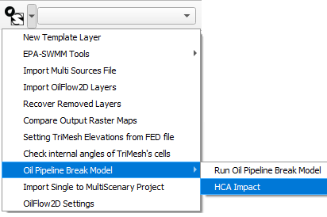

### Dialog Window
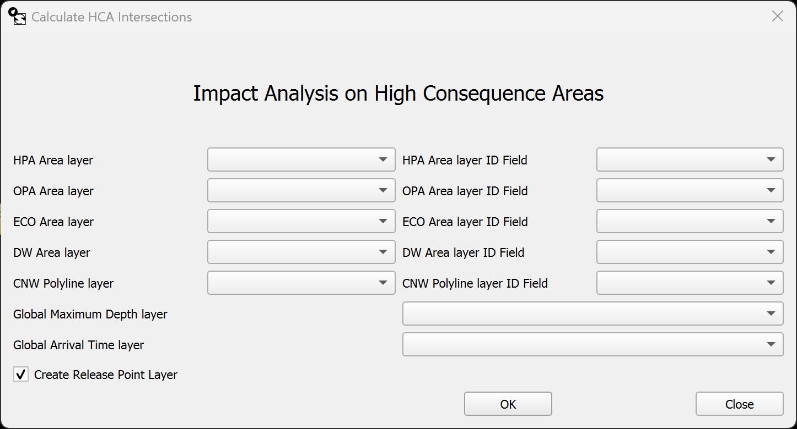

### Dialog Controls
[]{#tab:hca_controls label="tab:hca_controls"}

| HPA Area layer | *dropdown* | Selects the HPA polygon layer (NHDArea). |
| --- | --- | --- |
| HPA Area layer ID Field | *dropdown* | Identifier field for the HPA layer (recommended: OBJECTID). |
| OPA Area layer | *dropdown* | Selects the OPA polygon layer. |
| OPA Area layer ID Field | *dropdown* | Identifier field for the OPA layer (recommended: OBJECTID). |
| ECO Area layer | *dropdown* | Selects the ECO polygon layer. |
| ECO Area layer ID Field | *dropdown* | Identifier field for the ECO layer (recommended: OBJECTID). |
| DW Area layer | *dropdown* | Selects the DW polygon layer. |
| DW Area layer ID Field | *dropdown* | Identifier field for the DW layer (recommended: OBJECTID). |
| CNW Polyline layer | *dropdown* | Selects the CNW polyline layer (NHDLine). |
| CNW Polyline layer ID Field | *dropdown* | Identifier field for the CNW layer (recommended: OBJECTID). |
| Global Maximum Depth layer | *dropdown* | Integrated global maximum depth map. |
| Global Arrival Time layer | *dropdown* | Integrated frontal wave arrival time map. |
| Create Release Point Layer | *checkbox* | Generates the releasePoint layer based on the Sources layer. |
| OK | *button* | Runs the HCA impact analysis. |
| Close | *button* | Closes the dialog without running. |

### Workflow
1.  Ensure simulation results and integrated *Global Maximum Depth* and *Global Arrival Time* maps are available from the hydrodynamic mapping tools.

2.  Open OilFlow2D Tools → Oil Pipeline Break Model → HCA Impact.

3.  Select the HPA/OPA/ECO/DW layers and the CNW layer, along with their ID fields (OBJECTID recommended).

4.  Select at least one depth or arrival time map; the analysis requires at least one of these.

5.  Optionally enable *Create Release Point Layer* to generate the releasePoint layer.

6.  Click OK to run the analysis. Intersection layers and tables are created in the TABLES group.

### Requirements
-   An active OilFlow2D project with spill results and a Sources layer.

-   Integrated *Global Maximum Depth* and/or *Global Arrival Time* maps.

-   NHDArea and NHDLine layers with an OBJECTID field (or equivalent) for identifiers.

-   At least one HCA/line layer selected with no duplicate selections in the dialog.

-   If NHD layers are sourced from a geodatabase/REST service, reproject them to the project CRS and convert curved geometries to straight segments before running the analysis.

### Technical Details
#### Outputs
-   Creates tables in the *TABLES* group: *Spills-HPAAreas*, *Spills-OPAAreas*, *Spills-ECOAreas*, *Spills-DWAreas*, and *Spills-CNWLine*.

-   Optional: creates the *releasePoint* layer with spill metrics per source.

-   Links *releasePoint* to the HCA tables for Identify Features queries.

#### Key Results
Key fields in *releasePoint* include: SPILLID, DRAINUPVOL, DRAINDWVOL, SPILLVOL, SPILLAREA, MAXQ, MEANQ, DRAINTIME, and NHD_Intersected (yes/no). The Spills-NHDArea tables include volume, area, and min/max arrival times per area; the Spills-NHDLine table includes intersection length per segment. Units depend on the project CRS.

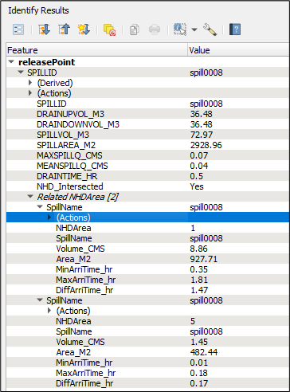

#### Usage Notes
-   If the NHDArea/NHDLine layers are not named as expected, select them manually in the dialog.

-   The analysis requires at least one HCA/line layer and at least one depth or arrival time layer.

-   Do not select the same layer in more than one dialog field.

## RiverFlow2D Settings Tool
The RiverFlow2D Settings Tool provides a centralized interface for configuring essential parameters required for RiverFlow2D project operations. This tool allows users to specify the RiverFlow2D executable location, set project paths, and configure mesh processing options that affect simulation performance and accuracy.

::: center
:::

### Dialog Window
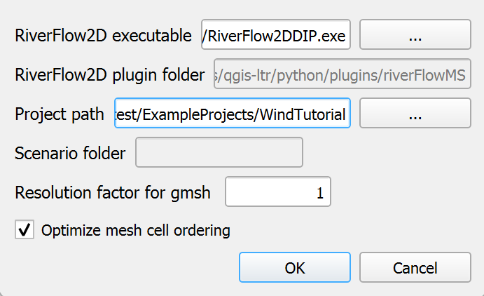

### Dialog Controls
[]{#tab:rf2d_settings_controls label="tab:rf2d_settings_controls"}

| RiverFlow2D executable | *text field* | Path to the RiverFlow2D executable file (.exe) on the system. |
| --- | --- | --- |
| Browse (executable) | *button* | Opens a file dialog to select the RiverFlow2D executable file. |
| Project Path | *text field* | Directory path where project files are stored. |
| Browse (project path) | *button* | Opens a directory dialog to select the project folder. |
| Project File | *text field* | Name of the project file without extension. |
| Browse (project file) | *button* | Opens a file dialog to select a .dat project file. |
| Resolution factor for gmsh | *text field* | Numeric value that determines mesh element size during gmsh processing. Default is 1. |
| Optimize mesh cell ordering | *checkbox* | When checked, enables optimization of mesh cell numbering to improve computational efficiency. |
| OK | *button* | Saves the settings and closes the dialog. |
| Cancel | *button* | Closes the dialog without saving changes. |

### Workflow
1.  When the tool is launched, it verifies that a RiverFlow2D project has been set up. If no project is configured, a warning message appears, and the dialog will not open.

2.  If a project exists, the dialog opens and loads the current configuration from both:

    -   QGIS application settings (for the RiverFlow2D executable path)

    -   Project-specific settings (for project paths and mesh settings)

3.  The user can modify any of the following settings:

    -   **RiverFlow2D executable**: Path to the simulation software executable file, typically located in the RiverFlow2D installation directory.

    -   **Project Path**: Directory where all project files will be saved.

    -   **Project File**: Base name for the project file (without extension).

    -   **Resolution factor for gmsh**: Numeric value that controls mesh element sizing during mesh generation with gmsh. Higher values produce finer meshes.

    -   **Optimize mesh cell ordering**: Option to renumber mesh cells for improved computational performance.

4.  After making the desired changes, clicking \"OK\" saves all settings:

    -   The RiverFlow2D executable path is saved in the QGIS application settings.

    -   Project path, project file name, resolution factor, and mesh optimization setting are saved in the current QGIS project.

5.  The saved settings are then used by other tools in the plugin, including mesh generation, simulation runs, and results processing.

### Requirements
-   A valid RiverFlow2D installation is required on the system.

-   The user must have appropriate permissions to access and execute the RiverFlow2D executable.

-   The project path directory must exist and be writable by the user.

-   If specifying a project file, the corresponding .dat file should be valid if it already exists.

-   When using the resolution factor for gmsh, numeric values between 0.1 and 10 are recommended for most applications.

### Technical Details
#### Configuration Details
**RiverFlow2D Executable Path**

The executable path is critical as it allows the plugin to launch RiverFlow2D for simulations. The default location is typically:

    C:/Program Files/Hydronia/RiverFlow2D/RiverFlow2DDIP.exe

**Resolution Factor for gmsh**

The resolution factor controls the element size in the mesh generation process:

-   Values less than 1 create coarser meshes with larger elements (faster computation, lower accuracy).

-   Values greater than 1 create finer meshes with smaller elements (slower computation, higher accuracy).

-   The default value of 1 maintains the original resolution derived from the elevation data.

**Mesh Cell Optimization**

The \"Optimize mesh cell ordering\" option improves computational efficiency by:

-   Reordering mesh cells to minimize the bandwidth of the system matrix.

-   Reducing memory requirements during simulation.

-   Potentially decreasing simulation time, especially for large meshes.

#### Best Practices
If instructed to do so or you are sure about the settings, you can change the settings to help solve a problem. If you are unsure about the settings, please contact Hydronia Support.

-   Sometimes QGIS will misplace the path of the project file, setting it here will help the plugin find the project file in those cases.

-   When working with large domains:

    -   Start with a lower resolution factor (0.5 - 0.8) for initial testing and calibration.

    -   Gradually increase the resolution factor for final production runs.

-   Always enable mesh cell optimization for large meshes (over 500,000 elements) to improve computational efficiency.

-   Document the resolution factor used for each simulation to ensure reproducibility of results.

## Multi-hydrograph to Single-hydrograph Files Tool
The Multi-hydrograph to Single-hydrograph Files Tool provides a specialized function for converting time-series hydrograph data from a combined multi-source file format into individual single-hydrograph files. This tool is particularly useful for preparing hydrologic inputs for simulations when working with multiple inflow sources that were initially stored in a unified data file.

### Dialog Window
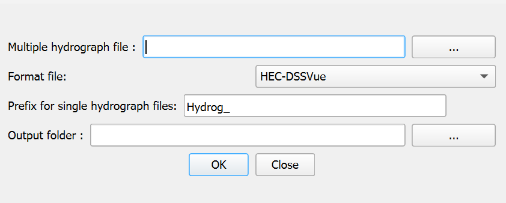

### Dialog Controls
[]{#tab:multihydrograph_controls label="tab:multihydrograph_controls"}

| Multiple hydrograph file | *text field* | Path to the input file containing multiple hydrograph data. |
| --- | --- | --- |
| Browse | *button* | Opens a file dialog to select the input multiple hydrograph file. |
| Format file | *dropdown* | Specifies the format of the input file (currently supports HEC-DSSVue format). |
| Prefix for single hydrograph files | *text field* | Text prefix to be added to all generated output files (default: \"Hydrog\_\"). |
| Output folder | *text field* | Directory where the individual hydrograph files will be saved. |
| Browse (output folder) | *button* | Opens a directory dialog to select the output folder. |
| OK | *button* | Processes the input file and generates the individual hydrograph files. |
| Close | *button* | Cancels the operation and closes the dialog. |

### Workflow
1.  When launched, the tool automatically sets the default output directory to the current project's scene directory.

2.  The user selects a multiple hydrograph input file by either:

    -   Typing the full path in the \"Multiple hydrograph file\" field, or

    -   Clicking the \"Browse\" button to navigate to and select the file.

3.  The tool automatically populates the \"Output folder\" field with the directory containing the selected input file, but the user can specify a different output location if desired.

4.  The user may customize the prefix for the generated files by modifying the \"Prefix for single hydrograph files\" field. The default prefix is \"Hydrog\_\".

5.  The user selects the appropriate format from the \"Format file\" dropdown. Currently, the tool supports HEC-DSSVue formatted files.

6.  After configuring all settings, the user clicks \"OK\" to process the file. The tool:

    -   Reads the multi-hydrograph input file

    -   Identifies the number of separate hydrographs contained within

    -   Creates individual files for each hydrograph

    -   Names each file using the specified prefix followed by a sequential number

    -   Displays a summary message showing how many files were created

7.  The tool displays a completion message indicating the number of hydrograph files that were successfully created.

### Requirements
-   An active RiverFlow2D project is recommended for proper file path management, though not strictly required.

-   The input multi-hydrograph file must be properly formatted according to the HEC-DSSVue standard, with time values in the expected columns.

-   The user must have write permissions for the selected output directory.

-   For HEC-DSSVue format, the file must contain:

    -   Time data in column 5 (in hours:minutes format, e.g., \"08:30\")

    -   Flow values for different hydrographs starting from column 6

### Technical Details
#### File Processing Details
The tool processes HEC-DSSVue formatted files using the following approach:

1.  The file is scanned to determine the number of data rows and columns.

2.  The tool identifies how many separate hydrographs are present by counting the number of data columns after the time column (starting from column 6).

3.  For each identified hydrograph, a separate output file is created with the naming pattern: \[prefix\]\[number\].txt (e.g., \"Hydrog_1.txt\", \"Hydrog_2.txt\").

4.  Each output file is structured with:

    -   A header line containing the number of time steps

    -   Data rows with two columns: cumulative time (in hours) and flow value

5.  The tool converts time data from the HEC-DSSVue format (HH:MM) to decimal hours for the output files, calculating cumulative time as it processes each row.

#### Best Practices
-   Use this tool early in the RiverFlow2D project setup process when preparing input data.

-   Verify that the generated single-hydrograph files have the correct number of time points and appropriate time intervals before using them in simulations.

-   Keep the original multi-hydrograph file as a backup in case you need to regenerate the individual files with different settings.

-   When managing multiple inflow sources, use descriptive prefixes to clearly identify the purpose of each hydrograph set (e.g., \"Inflow\_\", \"Tributary\_\").

-   If creating multiple sets of hydrograph files, consider organizing them in separate directories to avoid confusion.

-   After generating the hydrograph files, use the RiverFlow2D Source tool to properly assign them to source points in your model.

## Import Single to Multi-scenario Project Tool
This tool facilitates the migration of standalone RiverFlow2D projects into the multi-scenario framework, allowing users to organize and compare multiple simulation scenarios within a single QGIS project.

::: center
:::

### Dialog Window
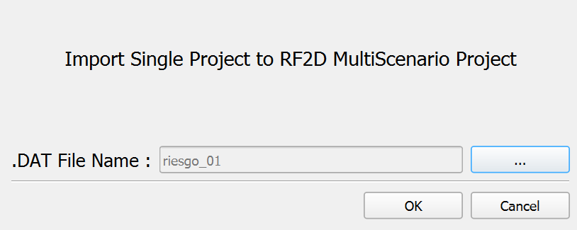

### Dialog Controls
[]{#tab:import_project_controls label="tab:import_project_controls"}

| .DAT File Name | *text field* | Read-only field displaying the path to the selected RiverFlow2D project file (.dat). |
| --- | --- | --- |
| Browse | *button* | Opens a file dialog to select the RiverFlow2D project file (.dat) to import. |
| OK | *button* | Initiates the import process after confirming the selected project file. |
| Cancel | *button* | Closes the dialog without importing any project. |

### Workflow
1.  When launched, the tool checks if a multi-scenario project structure already exists. If not, it will prompt the user to create one first.

2.  The user selects a RiverFlow2D project file (.dat) by clicking the browse button, which opens a file selection dialog. Only files with the .dat extension will be shown.

3.  After selecting a valid project file, its path appears in the \".DAT File Name\" field.

4.  When the user clicks \"OK\", the tool performs the following operations:

    -   Verifies that the selected file is a valid RiverFlow2D project file.

    -   Creates a new scenario folder within the multi-scenario project structure.

    -   Copies all relevant project files from the source location to the new scenario folder.

    -   Updates file paths in the project to reflect the new location.

    -   Registers the new scenario in the multi-scenario project configuration.

    -   Updates layer data sources to point to the new file locations.

5.  Upon completion, a success message is displayed, and the imported project becomes available as a scenario in the multi-scenario project.

6.  If errors occur during the import process (e.g., invalid file structure, permissions issues), appropriate error messages are shown.

### Requirements
-   A valid multi-scenario RiverFlow2D project structure must exist or be created before using this tool.

-   The source project must be a valid RiverFlow2D project with a proper .dat file and associated data files.

-   The user must have read permissions for the source project files and write permissions for the multi-scenario project directory.

-   Sufficient disk space must be available to copy all project files to the new location.

-   The QGIS project should be saved before performing the import operation to ensure all current settings are properly maintained.

### Technical Details
#### File Operations
The tool performs several file system operations during the import process:

1.  **Project Structure Validation**: Checks that both the source project and target multi-scenario structure are valid.

2.  **Scenario Name Generation**: Creates a unique scenario name based on the source project name (the \*.dat file name), avoiding conflicts with existing scenarios.

3.  **Directory Creation**: Creates a new scenario directory within the multi-scenario project structure.

4.  **File Copying**: Recursively copies all project files from the source location to the new scenario directory, preserving the directory structure.

5.  **Path Reconfiguration**: Updates all file paths within the project files to reflect the new location in the multi-scenario structure.

6.  **Layer Source Updates**: Modifies QGIS layer data sources to point to the files in the new location.

The tool preserves the entire project structure, including:

-   Project definition files (.dat, .qgs, .qgz)

-   Mesh files (.2dm, .msh)

-   Input data files (hydrographs, boundary conditions)

-   Simulation output files (if present)

-   Reference data and GIS layers

#### Best Practices
-   Before importing a project, ensure it runs correctly as a standalone project to avoid transferring configuration issues.

-   When working with large projects containing significant output data, consider removing unnecessary simulation results before importing to reduce the import time and storage requirements.

-   After importing, verify that all layers and references are correctly linked in the new scenario.

-   Keep a backup of the original standalone project until you have confirmed the imported scenario functions correctly.
