# Mesh Generation in RiverFlow2D

The basis of RiverFlow2D computational engine, RiverFlow2D is the flexible mesh, also called unstructured mesh or Triangular Irregular Network (TIN). The mesh is formed by triangles most often of different size, and is called flexible because it can be adapted to irregular topography, boundaries, structures, or any obstacle that may exist on the modeling area (see Figure ).

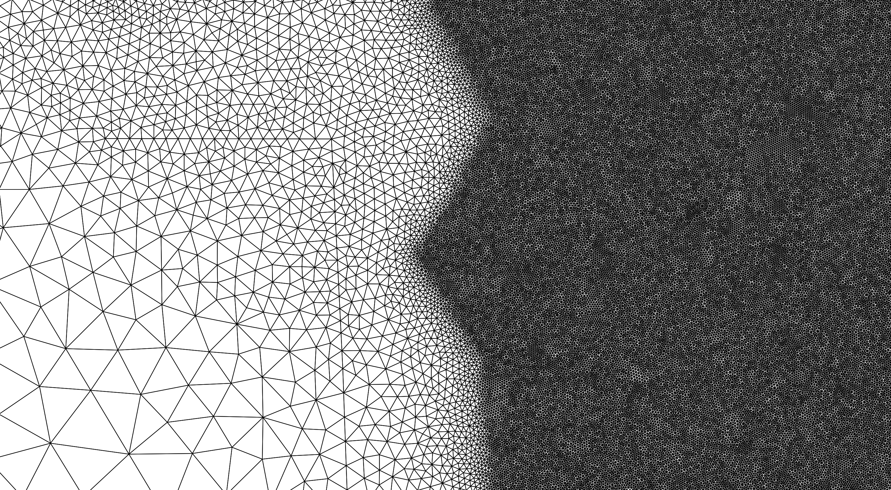{ width=5in }

The fundamental computational unit in the RiverFlow2D model is the triangular cell, where velocities, depth, and other variables are computed.

There are several tools in RiverFlow2D that can be used to control the mesh generation. These tools make use of spatial objects such as polylines and polygons, and parameters that you can enter in the *Domain Outline*, *MeshDensityLine*, *MeshDensityPolygon* and *MeshBreakLine* layers.

## Cell-size control using the Domain outline

The *Domain Outline* is a key layer that defines the mesh limits and the extent of the modeling area. It accepts polygons, and needs to contain at least one polygon. It can also include internal polygons that represent impermeable islands or other obstacles. The internal polygons will not contain any cells.

For each polygon in the *Domain Outline* layer you need to enter a *CellSize* attribute that controls the approximate triangle size desired for the generated mesh (see Figure ).

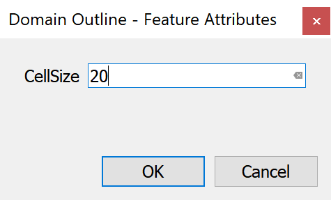{ width=3in }

Figure shows a mesh with one hole. The mesh is defined by an external polygon with *CellSize* equal to 50 ft, and the internal polygon has a *CellSize* of 10 ft. Note that the resulting mesh has smaller triangles around the internal polygon and larger triangles close to the boundary.

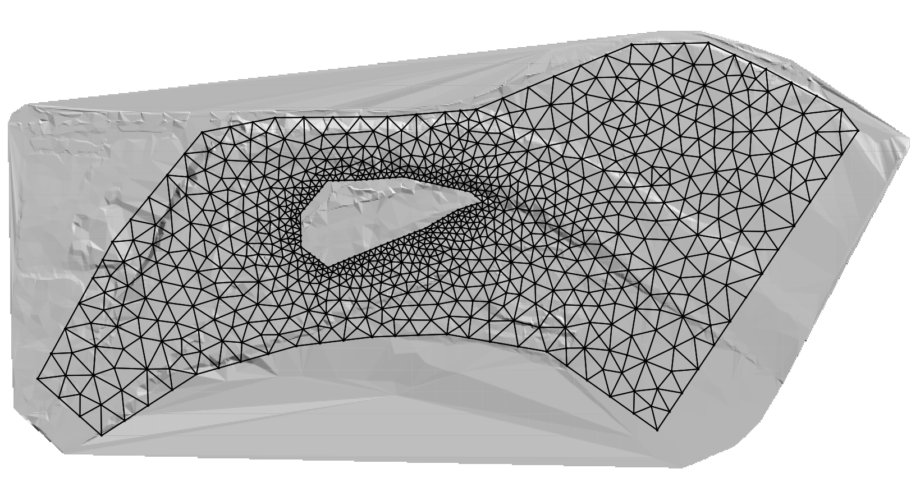{ width=5.5in }

## Cell-size control using Polylines in the MeshDensityLine Layer

The *MeshDensityLine* layer is used to enter polylines over which the mesh generation program will refine the mesh according to each polyline *CellSize* attribute. The polylines will not force the mesh generator to create nodes along the lines. In this sense, they act as soft breaklines (see Figure ).

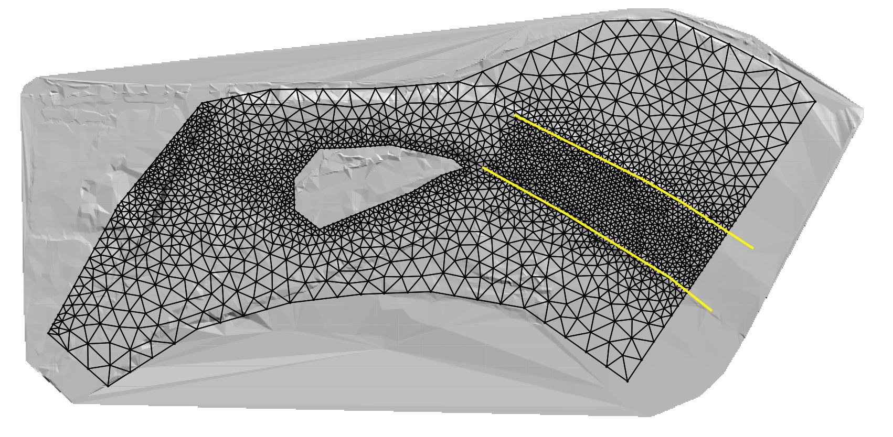{ width=5.5in }

## Cell-size control using Polygons in the MeshDensityPolygon Layer

The *MeshDensityPolygon* layer is used to enter polygons within which the mesh generation program will refine the mesh according to each polygon *CellSize* attribute. The polygon outlines will not force the mesh generator to create nodes along the polygon limits (see Figure ).

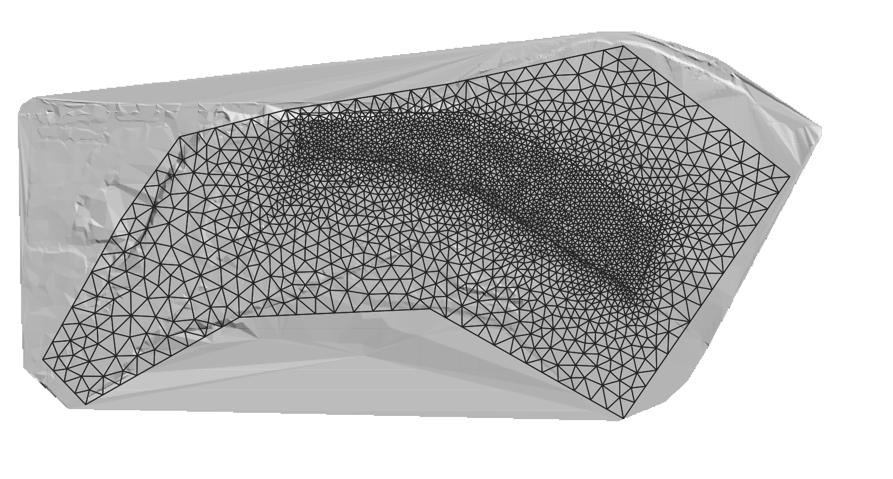{ width=5.5in }

## Cell-size control using Polylines in the MeshBreakLine Layer

The *MeshBreakLine* layer is used to enter polylines along which the mesh generation program will refine the mesh according to each polyline *CellSize* attribute, similarly as in the *MeshDensityLine* layer, but in this case, the lines will force the mesh generator to create nodes along the lines. Therefore, they act as hard breaklines (see Figure ).

{ width=5.5in }

In addition to the control offered by the spatial objects entered in the *Domain Outline*, *MeshDensityLine*, *MeshDensityPolygon*, and *MeshBreakLine* layers, other layers can be used to adjust the mesh alignment and resolution. For instance, the Bridges, Gates, and Weirs components are entered as polylines on the respective layers and all of them have a *CellSize* attribute that have the same effect as as the mesh breaklines.

## Boundary Conditions

Data to impose open boundary conditions in RiverFlow2D should be entered in the *Boundary Conditions* layer. This layer accepts only polygons. Lines or points are not allowed. To enter a polygon, first select the layer by clicking Boundary Conditions on the QGIS layers panel

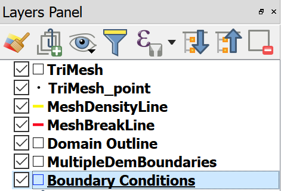{ width=2in }

Then click on Toggle Editing (pencil), and on the Add Feature (polygon) as shown

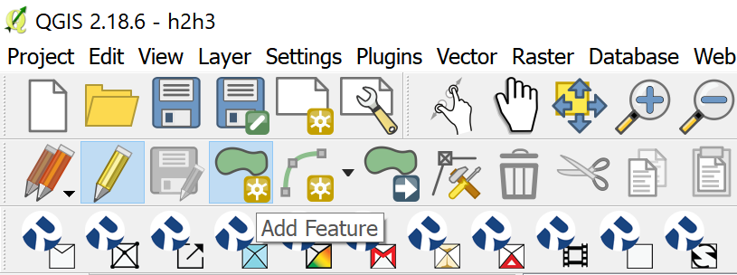{ width=2in }

Using the mouse, click vertices until you create a polygon the covers the area where you want to define as an Open Boundary

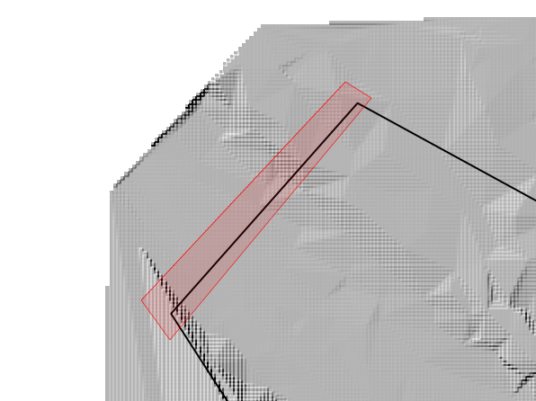{ width=2in }

To complete entering the polygon, right click and the following dialog will appear where as an example we have selected the open boundary as Inflow, Discharge vs. time, and the data will be written to the.

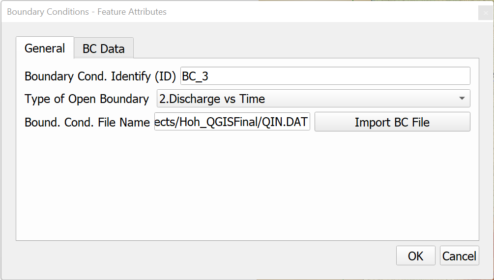{ width=3.5in }

To complete the data, select the BC Data panel and enter the hydrograph as shown.

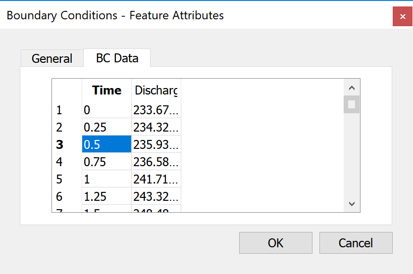{ width=3.5in }

All nodes on the mesh boundary that lie inside the polygon will be considered open boundary nodes.

You can define as many inflow and outflow boundaries as needed. All the boundary not contained within the BC polygons will be considered as closed boundaries and no flow will be allowed to cross it.

## Mesh Spatial Data

### Mannings' n

To assign spatially varied Manning's n coefficients in RiverFlow2D you enter polygons in the Manning N layer. This layer accepts only polygons. Lines or points are not allowed. To enter a polygon, first select the layer by clicking Manning N on the QGIS layers panel

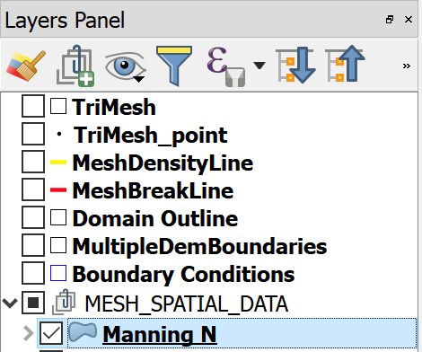{ width=2in }

Then click on Toggle Editing (pencil), and on the Add Feature (polygon) as shown

{ width=2in }

Using the mouse, click vertices until you create a polygon the covers the area where you want to set an specific Mannings n value

To complete entering the polygon, right click and the following dialog will appear where as an example we have selected the open boundary as Inflow, Discharge vs. time, and the data will be written to the.

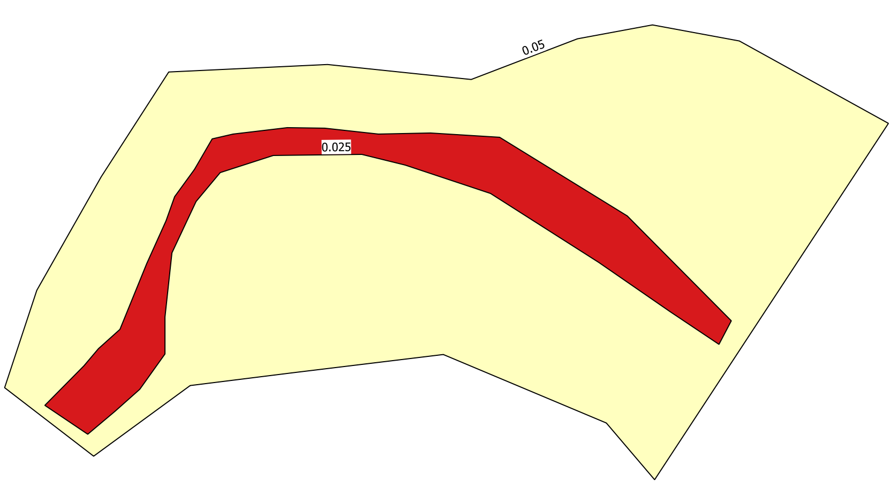{ width=3.5in }

To complete the data, select the *BC Data* panel and enter the hydrograph as shown. All cells on the Manning's n polygon will be assigned the n value corresponding to that polygon on the mesh boundary that lie inside the polygon will be considered open boundary nodes.

## RiverFlow2D Toolbar Functions

### New RiverFlow2D Project 

{ width=6cm }

This icon is used to create a new project template from scratch. There are three things you need to do in the dialog to complete creating a new project:

1. Select the component or mesh layers you want to create.
2. Select the Coordinate Reference System or *Projection*.
3. Enter the working *Project Directory*.

Figure shows the *Create New RiverFlow2D Project Dialog*. Note that do not need to select all the available layers, but just the ones that you will be using initially in your project. You can always add more layers later using the *New Template Layer* command in the RiverFlow2D *Tools* icon described below.

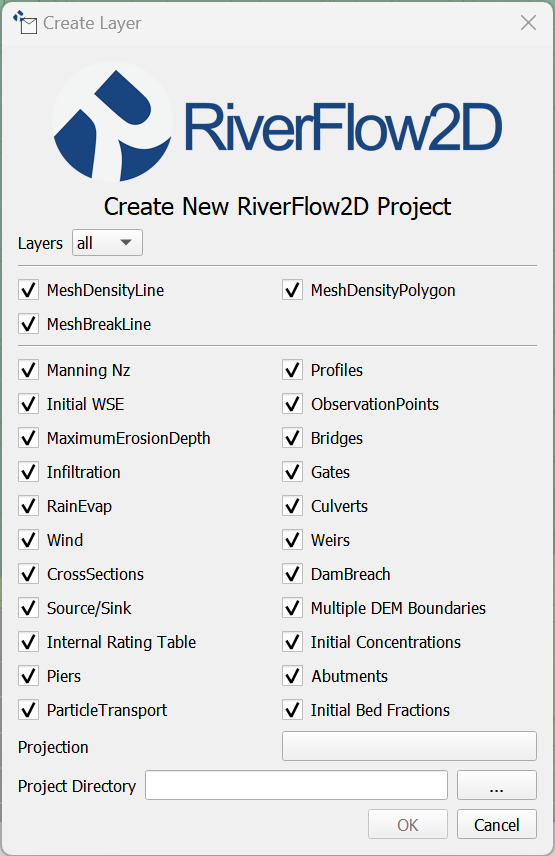{ width=3.5in }

### Generate TriMesh 

{ width=6cm }

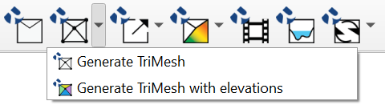{ width=2.5in }

### Export Files for RiverFlow2D 

{ width=6cm }

### Maps 

{ width=6cm }

### Animations 

{ width=6cm }

### Cross Sections 

{ width=6cm }

### Tools 

{ width=6cm }

#### Landslide Tool 

The Landslide tool allow representing the initial volume of material that could be mobilized during a landslide. The tool requires creating one or more polygons in the Landslide layer and indicating the depth or volume of the material (see Figure ) and the concentration of the sediment classes that form this material. With this information, the model will assume that under the given polygon the material down to the given depth, could flow depending on the other model conditions.

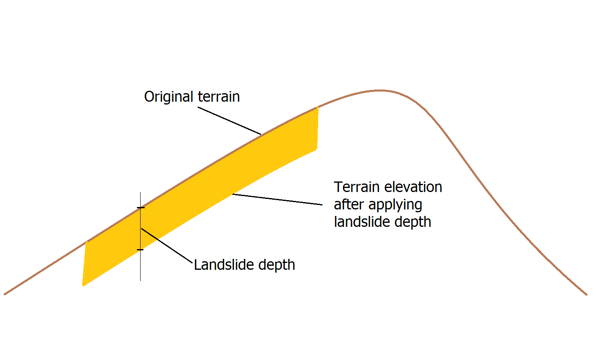

To enter the data, first create the *LandSide* layer.

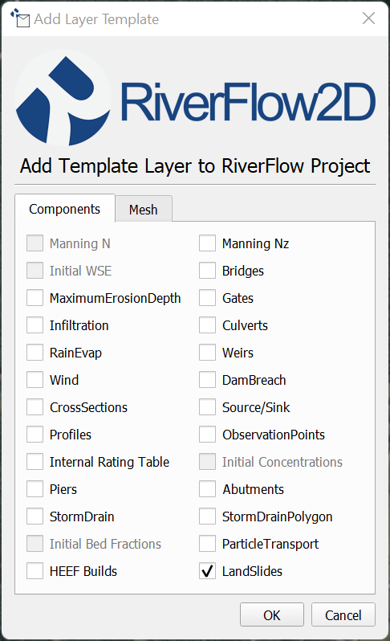

Then draw a polygon and enter the depth or volume and sediment class concentrations as indicated in the dialogs :

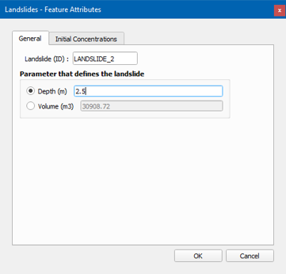

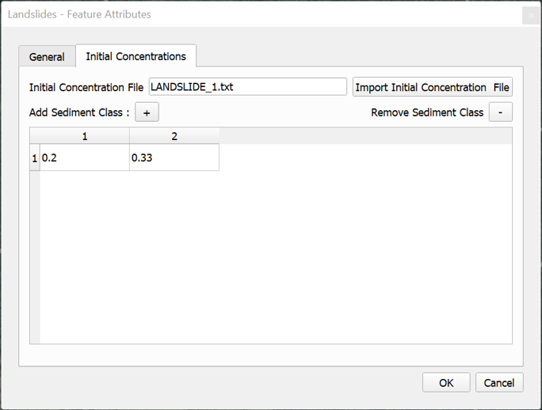

When the user provides the depth, all the cells contained in the landslide polygons will changes as follows:

- The cell elevation will be equal to the original terrain elevation minus the given depth (see Figure )
- The initial water or material elevation will be equal to the original terrain elevation.

When the user provides the volume, the model computes an average area of the landslide as depth = Volume/Polygon area, and all the cells contained in the landslide polygons will change as indicated above. All of the terrain changes are transferred to the .FED file that contains the mesh data and cell elevations.

Note that the *Read initial water elevs. from FED file* needs to be selected in the DIP Control Data panel.
