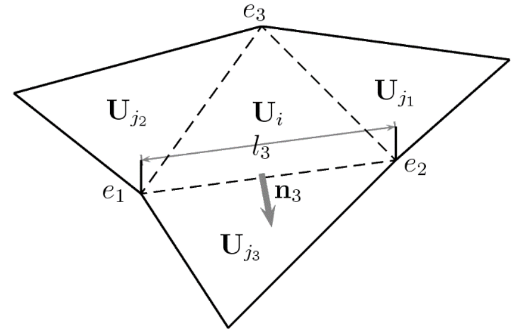
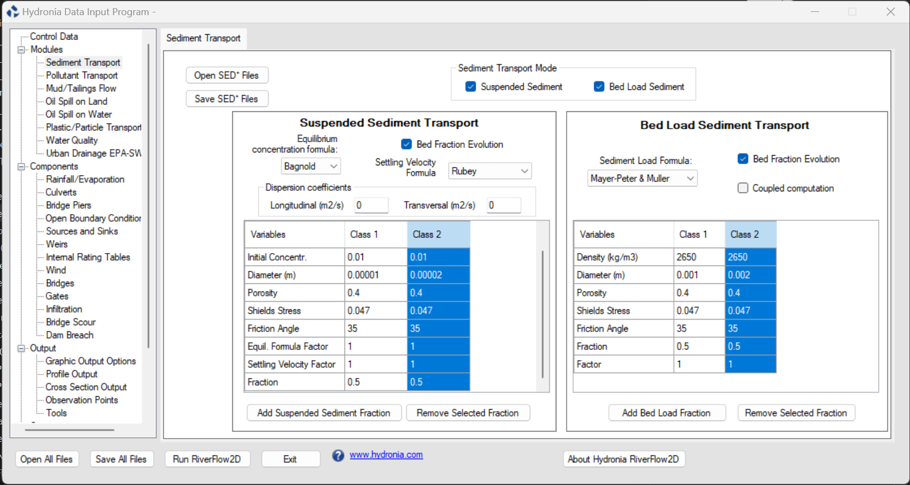

# Sediment Transport Module: ST

The science of sediment transport deals with the interrelationship between flowing water and sediment particles. Despite of having been studied since the 1950s and being widely employed in engineering practice , the sediment transport modeling remains at present one of the most active topic in the field of hydraulic research. Although numerical modeling of free surface flows with suspended and bedload transport over erodible bed in realistic situations involves transient flow and movable flow boundaries, the conventional and pioneer methods for performing morphodynamic simulations in coastal areas and rivers decouple the hydrodynamic and the erosion and deposition components. Ignoring unsteady hydrodynamic effects means that the time scales of the morphodynamics changes are smaller in comparison with the hydrodynamic ones. Assuming this hypothesis, only a quasi-steady process of slowly varying bed-load can be reasonably modeled, so that rapidly varying flows containing shocks or discontinuities remain excluded. For this reason RiverFlow2D allows accurate simulation ranging from slow-evolving events to abrupt river bed changes.

## Model Equations

The relevant formulation of the model derives from the depth averaged equations expressing water+sediment mixture volume conservation, sediment volume conservation and water+sediment mixture momentum conservation. Sediments can be transported as bedload or suspended load. That system of partial differential equations is formulated here in coupled form as follows

$$\frac{\partial \mathbf{U}}{\partial t}+\frac{\partial \mathbf{F(U)}}{\partial x}+\frac{\partial \mathbf{G(U)}}{\partial y}=\mathbf{S(U)}+\mathbf{R(U)}$$

where

$$\mathbf{U}=\left( \begin{array}{ccccccc}
      - **h,:** q_x,; q_y,; h\phi_1,; \ldots,; h\phi_{N_p},; \sum\limits_{p=1} ^{N_p} z_p      \end{array}\right)^{T}$$

are the conserved variables with $h$ representing the mixture flow depth, $q_x = hu$ and $q_y = hv$ the mixture unit discharges, with $(u,v)$ the depth averaged components of the velocity vector $\mathbf{u}$ along the $x$ and $y$ coordinates respectively and $\phi_p$, with $p=1,...,{N_p}$ representing the scalar depth-averaged volumetric concentration of the $N_p$ different sediments size-classes transported in suspension. The term $z_p$ is the contribution of $p$-th sediment class to the bed layer. Hence, the total bed elevation $z$ can be computed as $z=\sum_{p=1} ^{N_p} z_p$. The formulation allows the possibility of considering a heterogeneous soil, where different sediment fractions of material may coexist.

On the other hand the fluxes are given by

$$\begin{array}{l}
    \mathbf{F}=\left( \begin{array}{ccccccc}
      q_x, &
      \frac {q_x^2}{h} + \frac {1}{2} g h^2, &
      \frac{q_x q_y}{h}, &
      q_x \phi_1, &
      \ldots &
      q_x \phi_{N_p},&
      \sum\limits_{p=1} ^{N_p} (\xi_p\, q_{bp,x}) 
    \end{array}\right)^{T} \\
      \mathbf{G}=\left( \begin{array}{ccccccc}
      q_y , &
      \frac{q_x q_y}{h}, &
      \frac {q_y^2}{h} + \frac {1}{2} g h^2, &
      q_y \phi_1, &
      \ldots, &
      q_y \phi_{N_p}, &
      \sum\limits_{p=1}^{N_p} (\xi_p\, q_{bp,y}) 
    \end{array}\right)^{T} \\ 
    \end{array}$$

where $g$ is the acceleration of the gravity, $\xi_p = 1/ (1-p_p)$ accounts for the volumetric loosening effect for the solid particles in the erodible bed, $p_p$ is the specific porosity of the $p$-th bed layer sediment fraction and $q_{bp,x}$ and $q_{bp,y}$ are the capacity bedload transport rates along the $x$ and $y$ coordinates respectively, computed by means of empirical laws. The source terms of the system are split in three kind of terms. The term $\mathbf{S}$ is defined as

$$\mathbf{S}=\left(  0 , \;  \frac{p_{b,x}} {\rho_w} - \frac{\tau_{b,x}} {\rho_w}, \; \frac{p_{b,y}} {\rho_w} - \frac{\tau_{b,y}} {\rho_w} ,0, \ldots,0,0 \right)^{T}$$

with $p_{b,x},p_{b,y}$ and $\tau_{b,x},\tau_{b,y}$ are the pressure force along the bottom and the bed shear stress in the $x$ and $y$ direction respectively, with ${\rho_w}$ the density of water. The former can be formulated in terms of the bed slopes of the bottom level $z$

$$\begin{aligned}
& \frac{p_{b,x}} {\rho_w} = - gh\frac{\partial z}{\partial x} = ghS_{0x}, 
\\
& \frac{p_{b,y}} {\rho_w} = -gh \frac{\partial z}{\partial y}= ghS_{0y}
\end{aligned}$$

and the friction losses are written in terms of the Manning's roughness coefficient $n$

$$\begin{aligned}
 \frac{\tau_{b,x}} {\rho_w}=g h S_{fx} \quad \text{with:} \quad S_{fx}= \frac{n^2u \sqrt{u^2+v^2}}{h^{4/3}} 
 \\ 
 \frac{\tau_{b,y}} {\rho_w}=g h S_{fy}  \quad \text{with:} \quad  S_{fy}= \frac{n^2v\sqrt{u^2+v^2}}{h^{4/3}}  
\end{aligned}$$

The net exchange terms between the flow and the erodible bed $\mathbf{R}$, having a volumetric character, is defined as

$$\mathbf{R}= \left(\sum\limits_{p=1}^{N_p} (\xi_p\, R_p), 0,0,R_1, \ldots, R_{N_p},-\sum\limits_{p=1} ^{N_p} (\xi_p\, R_p) \right)^T$$

where $R_p$ is the net exchange solid flux between the mixture flow and the erodible bed layer for the $p$-th sediment fraction.

## Sediment transport laws

Two different ways of sediment transport govern the dynamics of the mobile bed considered in RiverFlow2D: the suspended load and the bedload. Both of them may coexist or one may be dominant.

As each sediment transport law is derived from different laboratory and field data sets a calibration parameter in the form of a correction factor is considered in order to adjust the numerical results.

### Bedload transport

When bedload is the dominant sediment transport mechanism and the influence of the suspended load is negligible system in turns into the following reduced form\
*Water mass conservation* $$\frac{\partial{(h)}}{\partial{t}}+ \frac{\partial{(hu)}}{\partial{x}} + \frac{\partial{(hv)}}{\partial{y}}=0$$

*Water momentum conservation in $x$ direction* $$\frac{\partial {(hu)}}{\partial t} + \frac{\partial {\big(hu^{2}+(1/2)gh^{2}\big)}}{\partial x} + \frac{\partial{(huv)}}{\partial{y}} = \frac{p_{bx}}{\rho_w}-\frac{\tau_{bx}}{\rho_w}$$

*Water momentum conservation in $y$ direction* $$\frac{\partial {(hv)}}{\partial t} + \frac{\partial{(huv)}}{\partial{x}}+\frac{\partial {\big(hv^{2}+(1/2)gh^{2}\big)}}{\partial y} = \frac{p_{by}}{\rho_w}-\frac{\tau_{by}}{\rho_w}$$

*Bed elevation changes* $$\frac{\partial}{\partial t} \left( \sum_{p=1} ^{N_p} z_p \right) + \frac{\partial}{\partial x}  \left( \sum_{p=1} ^{N_p} \xi_p\, q_{bp,x} \right) + \frac{\partial}{\partial y} \left( \sum_{p=1} ^{N_p} \xi_p\, q_{bp,y} \right)  = 0$$

The modulus of the bedload transport rate, $q_{bp}$, for the $p$-th sediment size-class is defined as

$$q_{bp}=\sqrt{q_{bp,x}+q_{bp,y}}$$

and is computed as

$$q_{bp} = f_{bp}\, \Phi_p\, \sqrt{g(s_p-1)d_{50p}^3}$$

where $f_{bp}$ is the fraction in the transport layer, $s_p=\rho_{sp}/\rho_w$ is the density ratio, $\rho_{sp}$ is the density of the sediment and $d_{50p}$ is the median diameter for the $p$-th sediment size-class.

The dimensionless parameter $\Phi_p$ for the $p$-th sediment size-class is computed by an empirical law. Table collects the formulas that are implemented in the present release of RiverFlow2D. For the shake of clarity, the subscript $p$ has been omitted in the empirical bedload transport formulation, where $d_{90}$, $d_{50}$ and $d_{30}$ are the grain diameter for which $90\%$, $50\%$ and $30\%$ of the weight of a non-uniform sample is finer respectively, $\theta$ is the dimensionless Shields stress, $\theta_c$ is the critical value Shields stress for the incipient motion and $\theta_c^S$ is the critical Shield stress as expressed by Smart (1984).

The Shields stress is computed as

$$\theta = \frac{|\tau_b|}{(\rho_s-\rho_w)\,g\,d_{50}}$$

being $|\tau_b|$ the modulus of the shear stress generated at the bottom by the bed roughness, which is taken into account through the Manning's coefficient $n$ and computed as

$$|\tau_b| = \rho_w\, h \frac{n^2\, (u^2+v^2)}{h^{4/3}}$$

p3cmcc

- **Meyer-Peter:** Mueller (1948); $8\left(\theta-\theta_c\right)^{3/2}$; $d_{50}$,$\theta_c$,$\rho_s$
- **Ashida Michiue (1972):** $17\left(\theta-\theta_c\right)\left(\sqrt\theta-\sqrt\theta_c\right)$; $d_{50}$,$\theta_c$,$\rho_s$
- **Engelund and Fredsøe (1976):** $18.74\left(\theta-\theta_c\right)\left(\sqrt\theta-0.7\sqrt\theta_c\right)$; $d_{50}$,$\theta_c$,$\rho_s$
- **Fernandez-Luque and van Beek (1976):** $5.7\left(\theta-\theta_c\right)^{3/2}$; $d_{50}$,$\theta_c$,$\rho_s$
- **Parker fit to Einstein (1979):** $11.2\left(1-\theta/\theta_c\right)^{9/2}$; $d_{50}$,$\theta_c$,$\rho_s$
- **Smart (1984):** $4\left(d_{90}/d_{30}\right)^{0.2}S_0^{0.6}C\theta^{1/2}\left(\theta-\theta_c^5\right)$; $d_{30}$,$d_{50}$,$d_{90}$,$\theta_c$,$\theta_c^S$,$\rho_s$
- **Nielsen (1992):** $12\theta^{1/2}\left(\theta-\theta_c\right)$; $d_{50}$,$\theta_c$,$\rho_s$
- **Wong:** $4.93\left(\theta-\theta_c\right)^{1.6}$; $d_{50}$,$\theta_c$,$\rho_s$
- **Wong:** $3.97\left(\theta-\theta_c\right)^{3/2}$; $d_{50}$,$\theta_c$,$\rho_s$
- **Camenen-Larson:** $12\theta^{3/2}exp\left(-4.5\theta_c/\theta\right)$; $d_{50}$,$\theta_c$,$\rho_s$

The sum $\sum_{p=1}^{N_p} z_p$ in can consider heterogeneous soil, where different fractions of material may coexist. In order to take into account this heterogeneity, every sediment transport discharge ($q_{bp,x}$,$q_{bp,y}$) associated to the $p$-th sediment size-class is multiplied by its corresponding soil fraction $f_{bp}$. Therefore, it is necessary to defined the fraction of each sediment size-class in the bed layer.

### Suspended load transport

When the suspension load plays the key role in the mobilization of the bed, the term of bedload can be omitted and system in turns into the following form\
*Mixture mass conservation* $$\frac{\partial{(h)}}{\partial{t}}+ \frac{\partial{(hu)}}{\partial{x}} + \frac{\partial{(hv)}}{\partial{y}}=\sum\limits_{p=1}^{N_p} \xi_p\, R_p$$

*Mixture momentum conservation in $x$ direction* $$\frac{\partial {(hu)}}{\partial t} + \frac{\partial {\big(hu^{2}+(1/2)gh^{2}\big)}}{\partial x} + \frac{\partial{(huv)}}{\partial{y}} = \frac{p_{bx}}{\rho_w}-\frac{\tau_{bx}}{\rho_w}$$

*Mixture momentum conservation in $y$ direction* $$\frac{\partial {(hv)}}{\partial t} + \frac{\partial{(huv)}}{\partial{x}}+\frac{\partial {\big(hv^{2}+(1/2)gh^{2}\big)}}{\partial y} = \frac{p_{by}}{\rho_w}-\frac{\tau_{by}}{\rho_w}$$

*Suspended sediment mass conservation for the $p$-th size-class* $$\frac{\partial{(h\phi_p)}}{\partial{t}} + \frac{\partial{(hu\phi_p)}}{\partial{x}} + \frac{\partial{(hv\phi_p)}}{\partial{x}}= R_{p}$$

*Bed elevation changes* $$\frac{\partial}{\partial t} \left( \sum_{p=1} ^{N_p} z_p \right) = - \sum\limits_{p=1} ^{N_p} \xi_p\, R_p$$

where the net exchange flux between the mixture flow and the bed layer for the $p$-th sediment size-class, $R_p$, is calculated as

$$R_p = A_{bp}\, (E_p-D_p) = A_{bp}\, \omega_{mp}\, (\phi_{p}^* - \phi_{p} )$$

where $E_p$ and $D_p$ are the specific entrainment and deposition rates for the $p$-th sediment class respectively, and the factor $A_{bp}$ denotes the exposure area for the $p-$th sediment class on the top layer of erodible bed, satisfying $\sum_{p=1}^{N_p} A_{bp}=1$. The entrainment and deposition rates are computed as $E_p = \omega_{mp}\, \phi_{p}^*$ and $D_p = \omega_{mp}\, \phi_{p}$ respectively, being $\phi_{*p}$ the equilibrium or capacity solid concentration and $\omega_{mp}$ the actual settling velocity of the $p$-th sediment class in the sediment-laden flow mixture, both obtained through empirical laws. The term $\phi_p$ contains the information about the suspended sediment mass of the $p$-th sediment size-class which is actually transported. In all of them, the input parameters are the sediment density and the grain diameter of the $p$-th sediment size-class.

It is worth noticing that sediment exchange laws have been derived for one single particle falling in clear water and under steady situations. Hence, in case of considering a transient situation with a sediment concentration in the flow column, the influence of the nearby particles must be taken into consideration since it can strongly reduce the fall velocity in comparison with clear water. This effect, known as hindered settling , is included in the equations by computing the actual settling velocity $\omega_{mp}$ for each sediment size-class in the mixture flow as:

$$\omega_{mp}= \left\lbrace
\begin{array}{ll}
    - **\alpha_{\omega p} \left(1-\frac{\phi_0}{2\sqrt{d_{50p}}}\right)^3 \omega_{sp}:** \text{if: } \phi_0>2\sqrt{d_{50p}}
    - **\alpha_{\omega p} \left(1-\phi_0\right)^4 \omega_{sp}:** \text{oherwise}
\end{array}
\right.$$

where $\alpha_{\omega p}$ is a tuning parameter defined by the modeler, $phi_0=\sum\limits_{p=1} ^{N_p} \phi_p$ accounts for the bulk concentration in the mixture flow and $\omega_{sp}$ is the theoretical settling velocity of a single sediment particle in clear water and $d_{50p}$ is the median diameter of each sediment class. Table collects the formulas considered in this RiverFlow2D release for the computation of the settling velocity of each sediment class in clear water $\omega_{sp}$. In all of them, the input parameters which are necessary are the sediment density and median diameter for each size-class. For the shake of clarity, the subscript $p$ has been omitted in the empirical formulation in.

p1.5cmcp3.0cm

- **Rubey (1933):** $\omega_s = F\sqrt{\left(\frac{\rho_s}{\rho_w}-1\right)gd_{50}}$; If $d_{50}$ $>$ 1 mm, $F$ = 0.79, otherwise $F=\left(\frac{2}{3}+\frac{36\nu^2}{gd_{50}^3\left(\rho_s/\rho_w -1\right)}\right)^{0.5}-\left(\frac{36\nu^2}{gd_{50}^3\left(\rho_s/\rho_w -1\right)}\right)^{0.5}$
- **Zhang (1961):** $\omega_s = \sqrt{\left(13.95\frac{\nu}{d_{50}}\right)^2+1.09\left(\frac{\rho_s}{\rho_w}-1\right)gd_{50}}-13.95\frac{\nu}{d_{50}}$; Valid for a wide range of $d_{50}$
- **Zanke (1977):** $\omega_s = 10\frac{\nu}{d_{50}}\left(\left(1+0.01\left(\frac{\rho_s}{\rho_w}-1\right)\frac{gd_{50}^3}{\nu^2}\right)^{0.5}-1\right)$ &
- **Van Rijn (1984):** $\omega_s = \left(\frac{1}{18} \frac{\rho_s - \rho_w}{\rho_w} g\frac{d^{2}_{s}}{\nu}\right)$; $d_{50}$ $<$ 0.1 mm
- **Raudkivi (1990):** $\omega_s =\left(\frac{\left(2/3\right)\left(\rho_s/\rho_w -1\right)gd_{50}^2}{\nu}-32\right)\frac{\nu}{1.2d_{50}}$; $d_{50}$ $>$ 1 mm
- **Julien (1995):** $\omega_s =\left(\frac{\left(2/3\right)\left(\rho_s/\rho_w -1\right)gd_{50}^2}{\nu}-24\right)\frac{\nu}{1.5d_{50}}$ &
- **Cheng(1997):** $\omega_s =\frac{\nu}{d_{50}}\left(\sqrt{25+1.2D_*^2}-5\right)^{1.5}$; $D_*$ = $d_{50}\left(\left(\rho_s/\rho_w -1\right)g/\nu^2\right)^{1/3}$
- **Jiménez-Madsen (2003):** $\omega_s = (C_1+C_2S_*)\sqrt{(s-1)gd_{50}}$; $C_1$, $C_2$ and $S_*$ as in Jiménez-Madsen
- **Wu-Wang(2006):** $\omega_s$ = $\frac{M\nu}{Nd_s}\left(\sqrt{\frac{1}{4}\left(\frac{4N}{3M^2}D_*^3\right)^{1/n}}-0.5\right)^n$; $M$, $N$ and $n$ as in Wu and $D_*$ = $d_{50}\left(\left(\rho_s/\rho_w -1\right)g/\nu^2\right)^{1/3}$

### Capacity suspended load formulas

As it has been mentioned before, the equilibrium concentration $\phi_{p}^*$ which appears in is obtained for each $p$ sediment size-class as

$$\phi_{p}^*=\frac{q_{sp}^*}{h\, U}$$

where $U = \sqrt{u^2+v^2}$ is the modulus of the flow velocity and $q_{*sp}$ is the capacity suspended solid transport rate, which are estimating using one of the following empirical relationships. For the shake of clarity, the subscript $p$ has been omitted in the empirical laws.

- Bagnold (1966, ) considered that the shear stress is proportional to the flow velocity and it was established the following formula,

    $$q_{s}^* = 0.01\frac{\rho_s}{\rho_s-\rho_w}\frac{\tau_b\,U^2}{\omega_s}$$

    being $\tau_b$ the shear stress generated at the bottom by the bed roughness which is computed using.

- Van Rijn (1984, ) proposed calculate the equilibrium suspended load integrating the sediment flux within the layer where the suspension plays a key role, i.e. between the term $h_s$ and $h$,

    $$q_{s}^* = \int\nolimits_{h_s}^{h} \phi_m\, U\ dh'$$

    where, $q_{s}^*$ is expressed by volume per unit time, and the terms of $\phi_m$ and $h_s$ were defined as follows

    $$\phi_m = \phi_s \left(\frac{\frac{h}{h^{'}}-1}{\frac{h}{h_s}-1}\right)^{\omega_s/(k U_*)}$$

    with

    $$\phi_s = \frac{0.117}{d_{50}}\left(\frac{\nu^2}{(s - 1)g}\right)^{1/3}\left(\frac{\theta}{\theta_c}-1\right)$$

    $$h_s = 0.3\, d_{50} \left(d_{50}\left(\frac{(s - 1) g}{\nu^2}\right)^{1/3}\right)^{0.7}\sqrt{\frac{\theta}{\theta_c}-1}$$

    where $\theta$ is the dimensionless Shields stress calculated using , $\theta_c$ is the critical Shields parameter, $d_{50}$ is the sediment median diameter, $s$ is the density ratio and $\nu$ is the kinematic viscosity of water.

### Active layer composition

The exposure each sediment class in the top layer of the erodible bed, known as active layer, governs the exchange of solid material between the the bedload and the suspended transport. This RiverFlow2D release includes to models for the active layer composition:

- **Fixed fraction model:** The composition in the top layer of the erodible bed does not vary respect to the substrate defined by the user. Therefore, given the fraction of each sediment class in the substrate $F_{sp}$, satisfying $\sum_{p=1}^{N_p} F_{sp}=1$, the composition of the beload rate and the suspended exchange term are estimated as

    $$\begin{aligned}
    & \text{Bedload fraction:} \quad 
    f_{bp}=F_{sp} 
    \\
    & \text{Exchange exposure:} \quad 
    A_{bp}= \left\lbrace
    \begin{array}{ll}
        - **F_{sp}:** \text{if: } E_p-D_p > 0
        - **1:** \text{oherwise}
    \end{array}
    \right.
    \end{aligned}$$

- **Active layer model:** A more complicated approach is provided by the active layer model. Sediments in the top layer of the erodible bed can be freely exchanged with the bedload transport layer, the suspended load in the flow and the underlying substrate. Hence the composition of this active layer evolves following the equation

    $$\frac{\partial}{\partial t} (f_{ap} \eta_a) = -  \xi_p \left( \frac{\partial\, q_{bp,x} }{\partial x} + \frac{\partial\, q_{bp,y}}{\partial y} \right)  - \big( \xi_p\, R_p \big) - f_{ep} \frac{\partial z_e}{\partial t}$$

    being $\eta_a$ is the thickness of the active layer and $f_{ap}$ the fraction of the $p$-th sediment class in the active layer, which satisfies $\sum_{p=1}^{N_p} f_{ap}=1$, and $z_e$ denotes the interface between the active layer and the underlying substrate. The active layer thickness is estimated here as a function of the maximum sediment diameter and the bed form height , whereas the temporal variation of the interface $\partial z_e/\partial t$ is approximated by the bulk bed level change $\partial z/\partial t$. The term $f_{ep}$ denotes fraction of the $p$-th sediment class which is exchange throughout the interface $z_e$, satisfying $\sum_{p=1}^{N_p} f_{ep}=1$, and it is estimated here as

    $$f_{ep} = 
    \left\lbrace
    \begin{array}{l l}
    - **F_{sp}:** \text{if: } \partial z_e / \partial t < 0
    - **\beta_a f_{ap} + (1-\beta_a) \phi_p/\phi_0:** \text{otherwise}
    \end{array}
    \right.$$

    where $\beta_a$ is tuning weighting parameter set to 0.6 in RiverFlow2D and $\phi_p/\phi_0$ represents the relative concentration of the $p$-th sediment class in the suspended load.

    The composition of the beload rate and the suspended exchange term are estimated as

    $$\begin{aligned}
    & \text{Bedload fraction:} \quad 
    f_{bp}=f_{ap} 
    \\
    & \text{Exchange exposure:} \quad 
    A_{bp}= \left\lbrace
    \begin{array}{ll}
        - **\frac{f_{ap}/d_{50p}}{\sum_{p=1}^{N_p} f_{ap}/d_{50p}}:** \text{if: } E_p-D_p > 0
        - **1:** \text{oherwise}
    \end{array}
    \right.
    \end{aligned}$$

## Boundary conditions for the suspended sediment model

When using the suspended sediment model, the user must impose volume concentration for each sediment fraction at all inflow boundaries. This data should be included in the same file that sets the time series at each inlet. For instance, if you select two sediment fractions and BCType=6 where the inflow is set as discharge vs time, a typical file would be like this one:

  ----- --------- ----- -----
  3 
  0        1000\. 0.1   0.2
  2       67000\. 0.1   0.2
  100     67000\. 0.1   0.2
  ----- --------- ----- -----

The first column is time in hours. There are 3 times 0, 2 and 100 hours. The second column is the water discharge (1000, 67000, 67000). Then there are two columns that should have the sediment volume concentration $\phi_p$ for each given fraction.

## Boundary conditions for the bedload model

### Provide only water discharge inflow

When using the bedload model, the user can impose the water discharge only and let the model compute the solid inflow. This is an useful feature when you do not have solid discharge data. In that case the model will determine the solid discharge for each sediment class based on the local flow conditions and the bedload formula selected, which may be a good approximation in many applications.

In this option, you select the *D*ischarge vs. Time boundary condition (BCType=6) and provide a table containing time and water discharge only. A typical file would be like this one:

  ----- --------- -- --
  3 
  0 1000\. 
  2 67000\. 
  100 67000\. 
  ----- --------- -- --

The first column is time in hours. This file indicates that there are 3 times 0, 2 and 100 hours. The second column is the water discharge (1000, 67000, 67000). No other columns will be necessary.

### Water and sediment discharge inflow

When using the bedload model, the user can impose the water discharge and bedload volumetric inflow. In this case, the sediment inflow must be provided for each sediment fraction at all inlets. This data should be included in the same file that sets the time series at each inlet. For instance, if you select two sediment fractions and BCType=26, a typical file would be like this one:

  ----- --------- ------- -------
  3 
  0        1000\. 0.005   0.002
  2       67000\. 0.005   0.002
  100     67000\. 0.005   0.002
  ----- --------- ------- -------

The first column is time in hours. There are 3 times 0, 2 and 100 hours. The second column is the water discharge (1000, 67000, 67000). Then there are two columns that have the bedload volumetric inflow for each given sediment class.

Bedload discharge should be given in m$^3$/s when using Metric units and ft$^3$/s for English units.

## Boundary conditions for combined the bedload and suspended load model

When using the bedload and suspended models together, the user must impose the suspended sediment concentration $\phi_p$ and the bedload volumetric inflow for each sediment fraction at all inlets. This data should be included in the same file that sets the time series at each inlet. For instance, if you select two sediment classes and BCType=26, a typical inflow boundary condition file would be like this one:

  ----- --------- ----- ------ ------- -------
  3 
  0        1000\. 0.1   0.2    0.005   0.002
  2       67000\. 0.1   0.2    0.005   0.002
  100     67000\. 0.1   0.2.   0.005   0.002
  ----- --------- ----- ------ ------- -------

The first column is time in hours. This file indicates that there are 3 times 0, 2 and 100 hours. The second column is the water discharge (1000, 67000, 67000). The third and fourth columns are the bedload solid discharge inflow for each given class. Finally, the fifth and sixth columns represent the sediment volume concentration $\phi_p$ for each class.

Bedload discharge should be given in m$^3$/s when using Metric units and ft$^3$/s for English units.

## Sediment Transport Finite-Volume Numerical Solution

The system of equations is integrated in a volume or grid cell $\Omega$ using Gauss theorem:

$$\frac {\partial} {\partial t} \int_{\Omega} \mathbf{U}d\Omega + \oint_{ \partial \Omega } \mathbf{En}   dl  = \int_{\Omega} \mathbf{S}d \Omega    +  \int_{\Omega} \mathbf{R}d \Omega$$

where $\mathbf{n}=(n_x,n_y)$ is the outward unit normal vector to the volume $\Omega$.

In order to obtain a numerical solution of system  we divide the domain in computational cells, $\Omega_i$, using a mesh fixed in time, and  is applied to each cell

$$\begin{array}{cc}
      \displaystyle{\frac {\partial} {\partial t} \int_{\Omega_i} \mathbf{U} d\Omega + \sum_{k=1} ^{NE} \int_{e_{k}}^{e_{k+1}} (\mathbf{En})^\downarrow_{ k}  dl_k = \int_{\Omega_i} \mathbf{S}d \Omega    +  \int_{\Omega_i} \mathbf{R}d \Omega }  \\   
    \end{array}$$

with $(\mathbf{En})^\downarrow_{ k}$ the value of the interface flux function through the edge $k$ to be defined, $\mathbf{n}_{k}=(n_x,n_y)$ is the outward unit normal vector to the cell edge $k$, and $NE$ is the number of edges in cell $i$. A sketch of the fluxes is showed in Figure.

{ width=6cm }

Assuming a piecewise representation of the conserved variables

$$\mathbf{U}_{i}^{n}=\frac{1}{A_i} \int_{\Omega_i} \mathbf{U}(x,y,t^{n})d\Omega$$

Equation is written as

$$\frac {\partial} {\partial t} \int_{\Omega_i} \mathbf{U}d\Omega  + \sum_{k=1} ^{NE} (\mathbf{En})^\downarrow_{ k}    l_k = \int_{\Omega_i} \mathbf{S}d \Omega      +  \int_{\Omega_i} \mathbf{R}d \Omega$$

where $l_k$ is the corresponding edge length. System is solved following the theory of Roe's Riemann solver and using the upwind discretization \[\].

## Entering Data for the Sediment Transport Model in the DIP

To enter data for a sediment transport simulation use the *Sediment Transport* panel.

{ width=100% }

## Assumptions and considerations of the Sediment Transport Model

The main assumptions involved in the present version of RiverFlow2D model are:

- When using the bedload option, the sediment transport rate is equal to the transport capacity under equilibrium conditions.
- Each sediment particle size is considered using a single characteristic diameter ($D_{50}$) for all formulas except for that of Smart (1984) that considers three sizes ($D_{30}$, $D_{50}$ and $D_{90}$).
- The fixed fraction model ensures bed conservation of all the fractions separately.
- The active layer model is able to account for bed armoring effects but does not ensure conservation for all the bed fractions separately.
- The model does not consider local scour such as pier scour, where three-dimensional flow determines the sediment transport and bed change rates.
- When assigning maximum erosion bed elevation, the model blocks further erosion when the bed elevation reaches the given limit.

!!! note

    Since the formulations for the bed load discharge, the suspended load discharge and the settling velocity are based on deterministic laws supported by experimentation, tuning parameter factors have been considered for each one. Hence, the model makes possible the calibration of the computed sediment transport for each particular situation.
